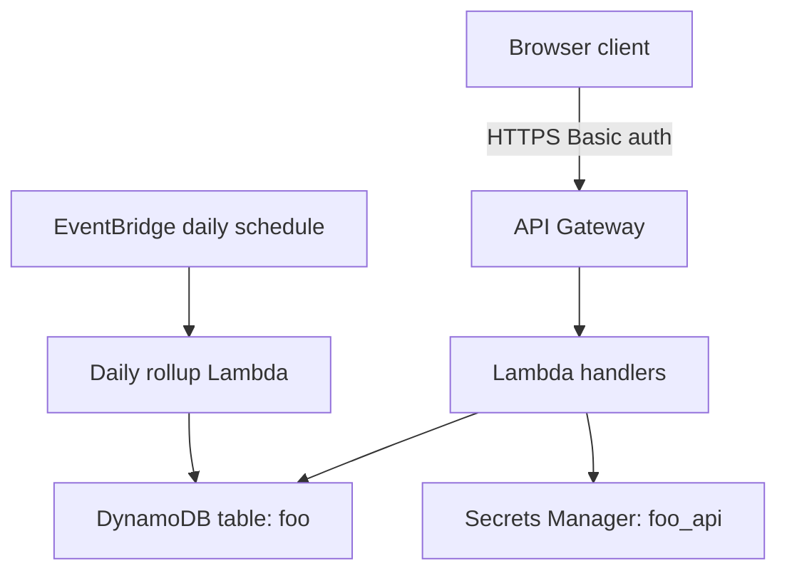
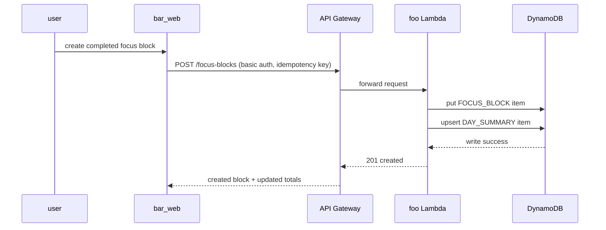

# Foo API

The foo API service provides an authenticated HTTP API for planning and tracking personal focus blocks, daily output, and consistency metrics.

## Overview

- **Service type**: backend API (`foo_api`)
- **Interface**: REST over HTTPS
- **Runtime**: AWS Lambda (Java 21) behind API Gateway
- **Primary storage**: DynamoDB single-table design
- **Primary consumer**: `bar_web`

## Features and scope boundaries

### In scope

- Authenticate every endpoint using HTTP Basic credentials validated by a custom authorizer.
- Create, list, and update focus blocks for the authenticated user.
- Return per-day and rolling summary metrics for dashboard views.
- Persist user records with snake_case attributes and deterministic key prefixes.
- Support idempotent block creation so retries do not duplicate records.

### Out of scope

- Shared/team workspaces and multi-user collaboration.
- Push notifications, reminders, or background mobile sync.
- Manual operational runbooks or release process documentation.

## Architecture



### Primary workflow



## Main technical decisions

- Use API Gateway + Lambda to stay consistent with existing repo services and keep infrastructure lightweight.
- Use HTTP Basic auth for consistency with current clients and simple credential bootstrapping.
- Store canonical block and summary data in DynamoDB using `pk`/`sk` prefixes for predictable access patterns.
- Keep summary writes in the same request path to provide fresh totals immediately after mutations.
- Require an `Idempotency-Key` header on block creation to make retries safe across flaky networks.

## Domain glossary

- **Focus block**: a single uninterrupted work session with start/end timestamps and category.
- **Category**: a user-defined grouping label for a block (for example writing, admin, or learning).
- **Day summary**: aggregate metrics for one local calendar day per user.
- **Streak day**: a day that meets the configured minimum focus minutes threshold.

## Integration contracts

### External systems

- **Google Calendar API (optional busy-window import)**: The service can fetch busy windows to avoid overlap in focus planning features. Direction is outbound HTTPS/JSON using OAuth 2.0 bearer auth. Required request fields are `calendar_id`, `time_min`, `time_max`, and `time_zone`. Failures are non-blocking and the service returns local focus data without calendar context.
- **Automation webhook receiver (optional outbound event delivery)**: The service can send completion events to user-configured third-party automation endpoints. Required payload fields are `event_id`, `event_type`, `occurred_at`, `user_id`, `block_id`, `duration_minutes`, and `category`. Delivery uses HTTPS `POST` with signature headers; failures retry with backoff and are eventually dropped after max attempts.

## API contracts

### Conventions

- Base URL: `https://api.foo.jordansimsmith.com`
- Auth: `Authorization: Basic <base64 user:password>`
- Request and response JSON fields use snake_case.
- No API version segment in path.
- Non-2xx responses use:

```json
{
  "message": "validation error details"
}
```

### Endpoint summary

| Method | Path                       | Purpose                                |
| ------ | -------------------------- | -------------------------------------- |
| `GET`  | `/focus-blocks`            | list blocks for user and date range    |
| `POST` | `/focus-blocks`            | create a focus block (idempotent)      |
| `PUT`  | `/focus-blocks/{block_id}` | replace one focus block                |
| `GET`  | `/summary`                 | fetch totals, streak, and chart points |

### Example request and response

`POST /focus-blocks`

Request:

```json
{
  "started_at": "2026-02-10T08:00:00Z",
  "ended_at": "2026-02-10T09:15:00Z",
  "category": "writing",
  "timezone": "Pacific/Auckland",
  "notes": "drafted weekly plan"
}
```

Response `201`:

```json
{
  "focus_block": {
    "block_id": "ac5f62f9-9b90-4adb-8c6a-294260f70f8a",
    "started_at": "2026-02-10T08:00:00Z",
    "ended_at": "2026-02-10T09:15:00Z",
    "category": "writing",
    "duration_minutes": 75
  },
  "day_summary": {
    "date": "2026-02-10",
    "total_minutes": 210,
    "blocks_completed": 3
  }
}
```

## Data and storage contracts

### DynamoDB model

- **Table name**: `foo`
- **Primary key**:
  - `pk`: `USER#<user>`
  - `sk`: item-specific prefix
- **Item types**:
  - `FOCUS_BLOCK#<block_id>`
  - `DAY_SUMMARY#<yyyy-mm-dd>`
- **Global secondary index**:
  - `gsi1pk`: `USER#<user>`
  - `gsi1sk`: `START#<epoch_seconds>#BLOCK#<block_id>` for reverse chronological block queries

### Representative records

Focus block item:

```json
{
  "pk": "USER#alice",
  "sk": "FOCUS_BLOCK#ac5f62f9-9b90-4adb-8c6a-294260f70f8a",
  "user": "alice",
  "block_id": "ac5f62f9-9b90-4adb-8c6a-294260f70f8a",
  "started_at": 1770710400,
  "ended_at": 1770714900,
  "duration_minutes": 75,
  "category": "writing",
  "timezone": "Pacific/Auckland",
  "updated_at": 1770714912
}
```

Day summary item:

```json
{
  "pk": "USER#alice",
  "sk": "DAY_SUMMARY#2026-02-10",
  "user": "alice",
  "date": "2026-02-10",
  "total_minutes": 210,
  "blocks_completed": 3,
  "streak_day": true,
  "updated_at": 1770714912
}
```

## Behavioral invariants and time semantics

- `ended_at` must be greater than `started_at`; maximum block duration is `480` minutes.
- All persisted timestamps are epoch seconds in UTC; date bucketing uses the request timezone.
- `POST /focus-blocks` is idempotent per `(user, Idempotency-Key)` for 24 hours.
- Summary totals are deterministic functions of persisted focus block records.
- `GET /focus-blocks` returns blocks ordered by `started_at` descending.

## Source of truth

| Entity         | Authoritative source             | Notes                                                   |
| -------------- | -------------------------------- | ------------------------------------------------------- |
| Focus blocks   | DynamoDB `FOCUS_BLOCK` items     | client values are accepted only after server validation |
| Daily totals   | DynamoDB `DAY_SUMMARY` items     | computed from canonical focus blocks                    |
| User identity  | Basic auth username              | injected from validated `Authorization` header          |
| Credential set | Secrets Manager `foo_api` secret | no credential material in code or terraform state       |

## Security and privacy

- API Gateway custom authorizer enforces authentication before handler execution.
- Per-user partitioning (`pk = USER#<user>`) prevents cross-user reads and writes.
- Secrets are read from AWS Secrets Manager with least-privilege IAM.
- Logs must exclude raw auth headers, secret payloads, and sensitive free-text notes.
- Transport is HTTPS only via API Gateway custom domain and certificate.

## Configuration and secrets reference

### Environment variables

| Name                           | Required | Purpose                                   | Default behavior                               |
| ------------------------------ | -------- | ----------------------------------------- | ---------------------------------------------- |
| `FOO_TABLE_NAME`               | yes      | DynamoDB table for API data               | startup fails if missing                       |
| `FOO_SECRET_NAME`              | yes      | Secrets Manager secret id for Basic users | auth rejects all requests if unreadable        |
| `FOO_ALLOWED_ORIGIN`           | yes      | CORS allow-origin for web client domain   | preflight and browser calls fail if mismatched |
| `FOO_MAX_BLOCK_MINUTES`        | no       | upper bound for a single block duration   | defaults to `480`                              |
| `FOO_STREAK_THRESHOLD_MINUTES` | no       | minutes required for a streak day         | defaults to `60`                               |

### Secret shape

```json
{
  "users": [
    {
      "user": "alice",
      "password": "strong-password"
    }
  ]
}
```

## Performance envelope

- Target steady state: up to `10` requests/second and `200` requests/minute burst.
- `GET` endpoints should complete within `300 ms` p95 under normal load.
- `POST` and `PUT` endpoints should complete within `500 ms` p95 due to dual writes.
- Read/write throughput is sized for always-free-tier-friendly personal workloads.
- Daily rollup must complete in under `30` seconds for up to one year of user history.

## Testing and quality gates

- Unit tests cover validation, idempotency handling, and time-bucketing logic.
- Integration tests run handlers against DynamoDB test containers and fake secrets.
- API contract tests verify error shape and auth behavior for all public endpoints.
- Required checks before merge: `bazel test //foo_api:all` and `bazel build //foo_api:all`.

## Local development and smoke checks

- Run service tests: `bazel test //foo_api:all`
- Build deployable artifacts: `bazel build //foo_api:all`
- If running locally with a fake gateway, verify:
  - `GET /summary` returns `401` without auth
  - authenticated `POST /focus-blocks` returns `201`
  - subsequent `GET /summary` reflects the new block totals

## End-to-end scenarios

### Scenario 1: create and view a completed block

1. User logs into `bar_web`.
2. Client sends `POST /focus-blocks` with a 75-minute writing block.
3. API persists block and updates day summary.
4. Client refreshes dashboard via `GET /summary` and shows updated totals and streak.

### Scenario 2: edit a block and recompute totals

1. User updates a block category from `admin` to `learning`.
2. Client sends `PUT /focus-blocks/{block_id}`.
3. API replaces the block item and recalculates day summary.
4. Client reloads list and summary and sees consistent category and totals.
