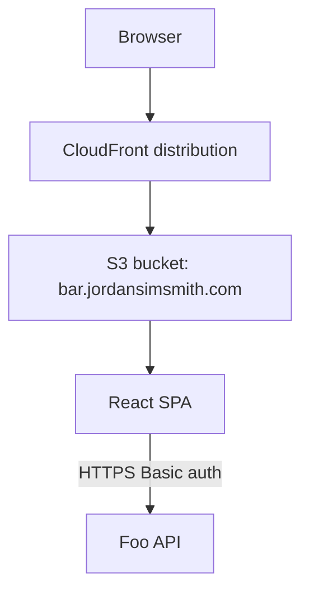
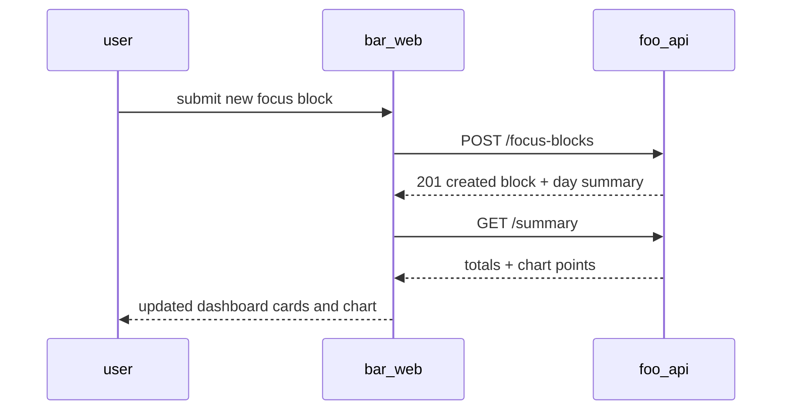

# Bar web

The bar web service is a responsive single-page app that lets an authenticated user plan focus blocks, review progress, and manage daily consistency against `foo_api`.

## Overview

- **Service type**: web client (`bar_web`)
- **Interface**: browser SPA served via CloudFront/S3
- **Frontend stack**: React + TypeScript + Vite + Mantine
- **Primary backend**: `foo_api`
- **Primary users**: single-user personal productivity workflow

## Features and scope boundaries

### In scope

- Authenticate users with HTTP Basic credentials and persist session token in `localStorage`.
- Protect authenticated routes and redirect unauthenticated users to login.
- Create, list, and edit focus blocks through typed API client calls.
- Render daily totals, streak state, and a lightweight cumulative chart.
- Provide a responsive interface optimized for mobile and desktop.

### Out of scope

- Offline-first syncing and background conflict resolution.
- Multi-user collaboration, shared goals, or team dashboards.
- Browser push notifications or reminder scheduling.

## Architecture

### Primary workflow

## Main technical decisions

- Use React + TypeScript + Mantine to match existing `_web` services and keep implementation patterns consistent.
- Store auth token in `localStorage` because sessions should survive browser restarts.
- Keep server state in a typed API client rather than introducing a global cache library.
- Prefer simple SVG-based chart rendering for low dependency overhead.
- Support a fake in-memory API adapter in development for rapid UI iteration without backend dependency.

## Domain glossary

- **Focus block**: one planned or completed work session with start/end and category.
- **Category**: user-facing label used to group focus blocks in list and chart views.
- **Day summary**: dashboard aggregate for one calendar day.
- **Streak day**: a day that meets minimum focus threshold from backend summary.

## Integration contracts

### External systems

- **None in current scope**: `bar_web` does not call third-party APIs or webhooks directly. If this changes, document each integration with required fields inline (for example provider identifiers and event timestamps), plus auth method, cadence, and failure behavior.

## API contracts

### Consumed backend endpoints

- `GET /focus-blocks`
- `POST /focus-blocks`
- `PUT /focus-blocks/{block_id}`
- `GET /summary`

### UI contract expectations

- Request and response bodies use snake_case field names.
- Error responses use `{"message":"..."}` and surface directly in user-visible feedback.
- `POST /focus-blocks` uses an idempotency key so retries are safe after transient failures.
- Summary responses are treated as canonical for dashboard cards and chart values.

## Data and storage contracts

### Browser storage

| Location        | Key                        | Purpose                                     | Retention                  |
| --------------- | -------------------------- | ------------------------------------------- | -------------------------- |
| `localStorage`  | `bar.auth.basic_token`     | persisted Basic auth token                  | until explicit logout      |
| `localStorage`  | `bar.preferences.timezone` | user-selected display timezone              | until user changes setting |
| in-memory state | n/a                        | form state, loading flags, transient errors | reset on full page refresh |

### Data ownership expectations

- The browser does not persist focus block records outside API responses.
- API responses are normalized into view models before rendering.
- No sensitive credentials are stored in query parameters or URL fragments.

## Behavioral invariants and time semantics

- Form inputs use local datetime controls, then convert to UTC ISO strings for API requests.
- List rendering sorts blocks by `started_at` descending, matching backend ordering.
- Duration displayed in the UI is derived from backend values, not recomputed client-side.
- Duplicate submit clicks are prevented while a save request is in flight.
- Dashboard dates and labels always render in the selected display timezone.

## Source of truth

| Entity                    | Authoritative source      | Notes                                                 |
| ------------------------- | ------------------------- | ----------------------------------------------------- |
| Credential validity       | `foo_api` auth response   | login success is determined by authenticated API call |
| Focus blocks              | `foo_api` responses       | client state is a projection only                     |
| Daily totals and streak   | `foo_api` summary payload | cards and charts never override backend totals        |
| Session token persistence | browser `localStorage`    | cleared on logout                                     |

## Security and privacy

- All API traffic is HTTPS only and uses `Authorization` headers.
- The app never logs full auth tokens or password input values.
- Logout removes persisted token and resets authenticated state immediately.
- CORS must allow only the production web origin for browser API calls.
- UI copy avoids exposing internal error traces; only sanitized messages are shown.

## Configuration and secrets reference

### Environment variables

| Name                    | Required        | Purpose                                 | Default behavior                             |
| ----------------------- | --------------- | --------------------------------------- | -------------------------------------------- |
| `VITE_API_IMPL`         | no              | choose `http` or `fake` backend adapter | defaults to `fake` in development            |
| `VITE_API_URL`          | yes when `http` | base URL for `foo_api`                  | startup warning and blocked calls if missing |
| `VITE_DEFAULT_TIMEZONE` | no              | initial timezone selection              | defaults to browser timezone                 |
| `VITE_APP_NAME`         | no              | app title shown in header               | defaults to `Bar web`                        |

### Secrets handling

- The web app does not embed server secrets.
- Basic credentials are entered by the user at runtime and encoded client-side only for request headers.
- Infrastructure credentials for deploy remain outside app runtime and are managed by Terraform workflows.

## Performance envelope

- Initial app shell should load within `2` seconds on a typical broadband connection.
- Dashboard refresh should complete within `1` second p95 when API latency is within target.
- Bundle strategy favors simple dependencies to keep JS payload lightweight.
- Typical user profile assumes fewer than `500` focus blocks in active date ranges.
- Rendering logic should remain smooth at `60 fps` for common interactions on modern devices.

## Testing and quality gates

- Unit tests cover route protection, login behavior, and core form interactions.
- Presenter/API client tests validate request shaping and error mapping behavior.
- Component tests verify block list ordering, summary card rendering, and timezone formatting.
- Required checks before merge: `bazel test //bar_web:unit-tests` and `bazel build //bar_web:build`.

## Local development and smoke checks

- Recommended dev server: `cd bar_web && pnpm vite dev`
- Bazel dev server option: `bazel run //bar_web:vite -- dev`
- Default local mode uses the fake in-memory API adapter.
- Basic smoke flow:
  - login with fake credentials
  - create a focus block
  - verify summary cards and chart update
  - edit the block and confirm values refresh correctly

## End-to-end scenarios

### Scenario 1: login and add first block

1. User opens `/` and enters credentials.
2. App validates auth by calling `GET /summary`.
3. User creates one 60-minute block from the dashboard form.
4. UI shows updated day total and streak card from backend summary.

### Scenario 2: adjust an existing block

1. User opens a previously saved block and edits its category and duration.
2. App sends `PUT /focus-blocks/{block_id}` with full block payload.
3. App reloads summary and block list.
4. Updated values appear consistently in list rows and dashboard aggregates.
