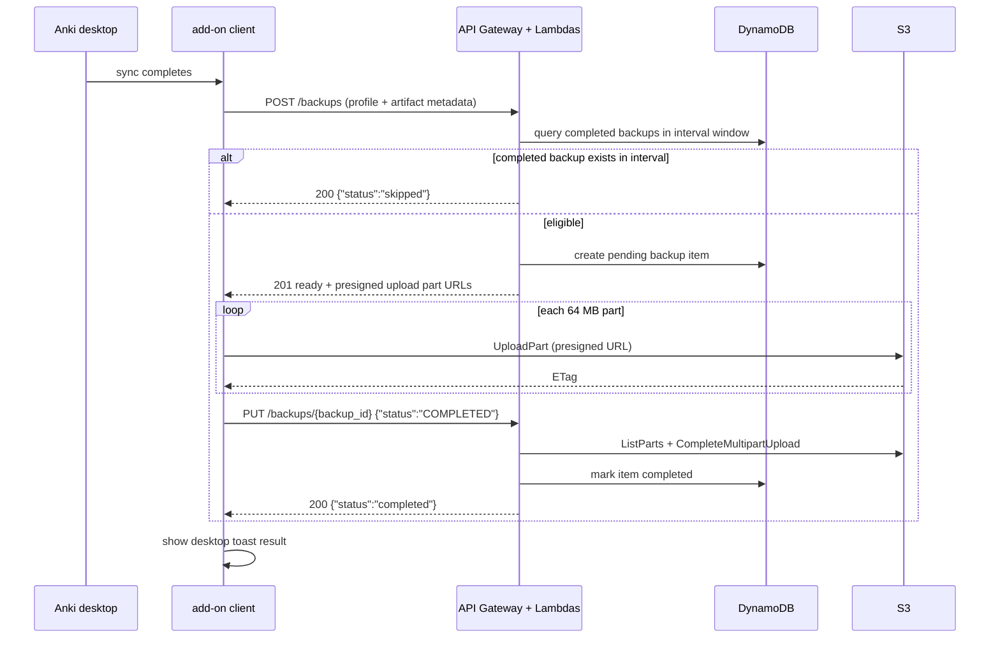

# Anki backup API

The Anki backup API provides an authenticated backend for creating immutable, versioned `.colpkg` backups from desktop Anki sync events and restoring from any retained point in history.

## Overview

- **Service type**: backend API (`anki_backup_api`) with a desktop add-on companion (`anki_backup_api/addon/anki_backup.py`)
- **Interface**: REST over HTTPS (API Gateway -> Lambda proxy integration)
- **Runtime**: AWS Lambda (Java 21)
- **Primary storage**: DynamoDB table `anki_backup` + S3 bucket `anki-backup.jordansimsmith.com`
- **Auth model**: HTTP Basic via API Gateway custom authorizer backed by Secrets Manager
- **Primary client**: desktop Anki add-on that runs after sync events
- **v1 user profile**: single personal user, with multi-user partitioning path built into key design

## User stories

- As an Anki learner, I want backups to run automatically after desktop sync, so that I do not rely on manual backup habits.
- As a user performing risky overwrite sync operations, I want immutable daily history, so that I can recover from bad states.
- As a cost-conscious user, I want retention and cadence controls, so that storage stays within a low monthly budget.

## Features and scope boundaries

### In scope

- Authenticate every API route with HTTP Basic credentials validated by a custom API Gateway authorizer.
- Let the add-on attempt backup after every desktop sync while the server enforces frequency gating.
- Create backup artifacts as full `.colpkg` packages (collection database plus media files).
- Use S3 multipart upload only, with `64 MB` part size and server-driven completion.
- Persist backup metadata in DynamoDB with per-user partitioning and immutable completed records.
- Keep daily backup history for 90 days using S3 lifecycle expiration and DynamoDB TTL.
- Support restore through API-assisted history listing and short-lived presigned download URLs.
- Notify the user through add-on toasts for success, skipped, and failure outcomes.

### Out of scope

- Selective deck-level or note-level restore.
- Special pre/post-overwrite backup workflows beyond normal sync-triggered behavior.
- Non-desktop ingestion paths that bypass desktop sync.
- Rich dashboard-style UI for backup history and observability.
- Deduplication, tiered lifecycle optimization, or compression strategies beyond `.colpkg`.

## Architecture

```mermaid
flowchart TD
  anki[Anki desktop sync] --> addon[Backup add-on]
  addon -->|POST /backups| gateway[API Gateway]
  gateway --> auth[AuthHandler Lambda]
  gateway --> create[CreateBackup Lambda]
  create --> ddb[DynamoDB anki_backup]
  create --> presign[S3 presign operations]
  addon -->|multipart UploadPart URLs| s3[S3 anki-backup.jordansimsmith.com bucket]
  addon -->|PUT /backups/{backup_id}| update[UpdateBackup Lambda]
  update --> s3
  update --> ddb
  addon -->|GET /backups| list[FindBackups Lambda]
  list --> ddb
  addon -->|GET /backups/{backup_id}| get[GetBackup Lambda]
  get --> s3
```

### Primary workflow



## Main technical decisions

- Server-side frequency gating is authoritative; the add-on always attempts after sync and the API decides `ready` vs `skipped`.
- Multipart upload is required in v1 to support large backups and part-level retry behavior without redesigning later.
- Eligibility is query-based over completed backups within a configured interval (default 24 hours), with accepted race conditions that can allow occasional extra backups.
- Completed backups are immutable and retention-driven; deletion occurs only through retention expiry policies.
- The data model is multi-user-ready from day one (`pk = USER#<user>`) even though v1 usage is single-user.

## Domain glossary

- **Backup artifact**: one `.colpkg` file containing collection data and all media for a profile snapshot.
- **Pending backup**: a backup record created by `POST /backups` that has presigned upload context but is not completed yet.
- **Completed backup**: a backup record whose multipart upload is finalized and is eligible for restore listing/download.
- **Backup interval**: the minimum duration between successful backups for a user (default 24 hours).
- **Restore point**: one completed backup that can be downloaded and restored manually through normal Anki flow.

## Integration contracts

### External systems

- **Anki desktop add-on**: client calls API after sync completion with required `profile_id` and `artifact` fields (`filename`, `size_bytes`, `sha256`). On `status=ready`, it uploads all parts to S3 using presigned URLs and then completes via `PUT /backups/{backup_id}`; on `status=skipped`, it stops without upload. Failures are surfaced as local toasts and retried only on the next sync event.
- **Amazon S3 (`anki-backup.jordansimsmith.com`)**: stores immutable `.colpkg` objects at per-user/per-profile keys. Required upload metadata includes object key, upload ID, part numbers, and ETags resolved during completion. Lifecycle policy expires objects after 90 days and aborts incomplete multipart uploads after 1 day.

## API contracts

### Conventions

- Base URL: `https://api.anki-backup.jordansimsmith.com`
- Auth: `Authorization: Basic <base64 user:password>`
- JSON fields: snake_case
- Versioning: no version path segment
- Error shape for service-defined failures:

```json
{
  "message": "error details"
}
```

### Endpoint summary

| Method | Path                   | Purpose                                                       |
| ------ | ---------------------- | ------------------------------------------------------------- |
| `POST` | `/backups`             | check interval eligibility and create pending backup upload   |
| `PUT`  | `/backups/{backup_id}` | complete multipart upload and mark backup completed           |
| `GET`  | `/backups`             | list completed backups for restore history                    |
| `GET`  | `/backups/{backup_id}` | fetch one completed backup including short-lived download URL |

### Endpoint request and response contracts

- `POST /backups`
  - Request: `profile_id` plus `artifact` (`filename`, `size_bytes`, `sha256`)
  - Response `201`: `{ "status": "ready", "backup": ..., "upload": ... }` with presigned upload part URLs
  - Response `200`: `{ "status": "skipped" }` when a completed backup exists within interval
- `PUT /backups/{backup_id}`
  - Request: `{ "status": "COMPLETED" }`
  - Response `200`: `{ "status": "completed" }`
  - Behavior note: server resolves uploaded part ETags with `ListParts` before `CompleteMultipartUpload`
- `GET /backups`
  - Response `200`: `{ "backups": [backup, ...] }` for completed backups only
- `GET /backups/{backup_id}`
  - Response `200`: `{ "backup": backup }` including `download_url` and `download_url_expires_at` for restore

### Example request and response

`POST /backups` request:

```json
{
  "profile_id": "japanese-main",
  "artifact": {
    "filename": "collection-2026-03-01.colpkg",
    "size_bytes": 534773760,
    "sha256": "0f7a6f8f64028f5f2f1f5a9a2b745f9028ce8f5df5c9a2c7d61f73b05c5ce12b"
  }
}
```

`POST /backups` response `201` (eligible):

```json
{
  "status": "ready",
  "backup": {
    "backup_id": "550e8400-e29b-41d4-a716-446655440000",
    "profile_id": "japanese-main",
    "status": "PENDING",
    "created_at": "2026-03-01T10:23:01Z",
    "completed_at": null,
    "size_bytes": 534773760,
    "sha256": "0f7a6f8f64028f5f2f1f5a9a2b745f9028ce8f5df5c9a2c7d61f73b05c5ce12b",
    "expires_at": "2026-05-30T10:23:01Z",
    "download_url": null,
    "download_url_expires_at": null
  },
  "upload": {
    "part_size_bytes": 67108864,
    "expires_at": "2026-03-01T11:23:01Z",
    "parts": [
      {
        "part_number": 1,
        "upload_url": "https://..."
      }
    ]
  }
}
```

`POST /backups` response `200` (skipped):

```json
{
  "status": "skipped"
}
```

## Data and storage contracts

### S3 object contract

- **Bucket**: `anki-backup.jordansimsmith.com`
- **Object key format**:

```text
users/<user>/profiles/<profile_id>/backups/<yyyy>/<mm>/<dd>/<backup_id>.colpkg
```

- **Object-level contract**:
  - one immutable `.colpkg` per completed backup
  - server-side encryption with SSE-S3
  - 90-day lifecycle expiration
  - incomplete multipart uploads aborted after 1 day

### DynamoDB model

- **Table name**: `anki_backup`
- **Primary key**:
  - `pk`: `USER#<user>`
  - `sk`: `BACKUP#<backup_id>`
- **Item type**:
  - `BACKUP#<backup_id>` stores upload metadata, backup status, profile ID, checksum, size, S3 location, and retention fields
- **Access patterns**:
  - create-backup interval check: query user partition for completed backups where `completed_at >= now - backup_interval`
  - update-backup completion: get by `pk` + `BACKUP#<backup_id>`, then set status and completion timestamps
  - list backups: query user partition and return completed items sorted by `created_at` descending
  - get backup: direct get by `pk` + `BACKUP#<backup_id>`

Representative completed item:

```json
{
  "pk": "USER#alice",
  "sk": "BACKUP#550e8400-e29b-41d4-a716-446655440000",
  "backup_id": "550e8400-e29b-41d4-a716-446655440000",
  "status": "COMPLETED",
  "profile_id": "main",
  "s3_bucket": "anki-backup.jordansimsmith.com",
  "s3_key": "users/alice/profiles/main/backups/2026/03/01/550e8400-e29b-41d4-a716-446655440000.colpkg",
  "upload_id": "2~aBcDef...",
  "part_size_bytes": 67108864,
  "size_bytes": 534773760,
  "sha256": "0f7a6f8f64028f5f2f1f5a9a2b745f9028ce8f5df5c9a2c7d61f73b05c5ce12b",
  "created_at": 1772360660,
  "completed_at": 1772360701,
  "expires_at": "2026-05-30T10:25:01Z",
  "ttl": 1780136701
}
```

## Behavioral invariants and time semantics

- The add-on attempts backup after each sync; the server alone determines whether a new backup is allowed.
- The backup interval default is 24 hours and is evaluated against completed backups only.
- The service intentionally accepts a race window where concurrent eligible requests can create more than one backup in the same interval.
- `POST /backups` creates a `PENDING` backup; only `PUT /backups/{backup_id}` with `status=COMPLETED` can finalize it.
- Completed backups are immutable and can only disappear through retention expiry.
- API timestamps are ISO-8601 UTC; DynamoDB operational timestamps use epoch seconds where defined by implementation fields.
- Retention is 90 days in both S3 lifecycle policy and DynamoDB TTL derivation.

## Source of truth

| Entity                     | Authoritative source                             | Notes                                                               |
| -------------------------- | ------------------------------------------------ | ------------------------------------------------------------------- |
| User identity              | Basic auth username                              | injected by validated API Gateway authorizer                        |
| Backup metadata and status | DynamoDB `BACKUP#<backup_id>` items              | authoritative status (`PENDING`/`COMPLETED`) and retention metadata |
| Backup artifact bytes      | S3 object at `s3_bucket + s3_key`                | immutable once multipart upload is completed                        |
| Backup eligibility window  | DynamoDB completed backups + configured interval | evaluated server-side at `POST /backups`                            |
| Credential set             | Secrets Manager secret `anki_backup_api`         | credentials are never embedded in source or Terraform state         |

## Security and privacy

- API Gateway custom authorizer enforces Basic auth before backup handlers execute.
- Secrets are loaded from AWS Secrets Manager and not persisted in code, logs, or Terraform state.
- S3 public access is blocked; object access is via IAM for service internals and short-lived presigned URLs for clients.
- Transport is HTTPS only.
- Logs must redact or omit raw auth headers, credentials, presigned URLs, and local file path details.
- User data is partitioned by authenticated user key prefix in DynamoDB and S3 key paths.

## Configuration and secrets reference

### Environment variables

None in current scope. The service uses fixed v1 constants that match repository patterns:

- DynamoDB table: `anki_backup`
- S3 bucket: `anki-backup.jordansimsmith.com`
- Secrets Manager secret id: `anki_backup_api`
- Backup interval: `24` hours
- Retention: `90` days
- Multipart part size: `67108864` bytes (`64 MB`)
- Upload URL TTL: `3600` seconds (1 hour)
- Download URL TTL: `3600` seconds (1 hour)

### Secret shape

```json
{
  "users": [
    {
      "user": "alice",
      "password": "strong-password"
    }
  ]
}
```

## Performance envelope

- Artifact size target is `~500 MB` today with support up to `5 GB` through multipart upload.
- Multipart part size is `64 MB`, producing roughly `80` parts for a `5 GB` backup.
- Normal cadence target is one successful backup per interval (24 hours by default), with accepted occasional duplicate backups in rare races.
- Retention and projected dataset size are designed to keep storage cost around or below the personal-use budget target.

## Testing and quality gates

- Unit tests cover interval eligibility checks, multipart part calculations, checksum/metadata validation, and auth parsing behavior.
- Integration tests cover handler behavior against DynamoDB test containers with fake S3 presign/completion clients.
- E2E tests cover LocalStack-backed flow: create backup -> multipart upload -> finalize -> list -> get.
- Required checks before merge:
  - `bazel build //anki_backup_api:all`
  - `bazel test //anki_backup_api:all`
  - `bazel mod tidy`
  - `bazel run //:format`

## Local development and smoke checks

- Build service targets: `bazel build //anki_backup_api:all`
- Run tests: `bazel test //anki_backup_api:all`
- Run add-on smoke tests: `python3 anki_backup_api/addon/anki_backup.py`
- Fast API smoke flow against a local stack:
  - call `POST /backups` with valid Basic auth and artifact metadata
  - if response is `ready`, upload at least one part using returned URL
  - call `PUT /backups/{backup_id}` with `{"status":"COMPLETED"}`
  - verify `GET /backups` includes the completed backup
  - verify `GET /backups/{backup_id}` returns a non-null `download_url`

## End-to-end scenarios

### Scenario 1: automatic backup after desktop sync

1. User completes Anki sync on desktop, triggering the `sync_did_finish` hook.
2. Add-on derives active `profile_id`, exports `.colpkg` with media, computes artifact metadata (`filename`, `size_bytes`, `sha256`), and calls `POST /backups`.
3. API either returns `status=skipped` (already backed up in interval) or `status=ready` with presigned part URLs.
4. On `ready`, add-on uploads all parts to S3 and calls `PUT /backups/{backup_id}` with `status=COMPLETED`.
5. API finalizes multipart upload, marks backup completed in DynamoDB, and add-on shows success toast.

### Scenario 2: restore from a historical backup

1. User opens Tools > Anki Backup History in the desktop application.
2. Add-on calls `GET /backups` and displays completed backups within retention window in a dialog.
3. User selects a backup and clicks Download; add-on calls `GET /backups/{backup_id}` and opens the short-lived `download_url` in the system browser.
4. User downloads the `.colpkg` and performs the standard manual Anki restore flow via File > Import.
5. User resumes normal sync behavior, and future backups continue under the same interval and retention rules.
