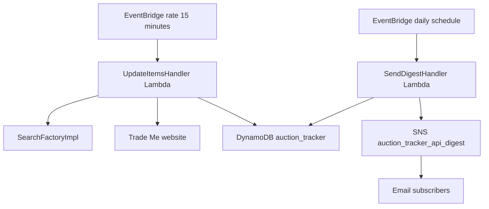
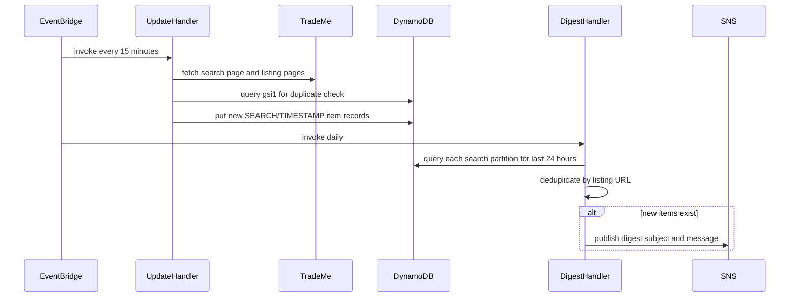

# Auction tracker API

The auction tracker API service runs scheduled backend workflows that scrape Trade Me listings, store discovered items, and send a daily digest email for newly found listings.

## Overview

- **Service type**: backend scheduled worker (`auction_tracker_api`)
- **Interface**: EventBridge scheduled events to AWS Lambda handlers (`RequestHandler<ScheduledEvent, Void>`)
- **Runtime**: AWS Lambda (Java 21)
- **Primary storage**: DynamoDB table `auction_tracker` with `gsi1` for duplicate checks
- **Primary consumers**: email subscribers on SNS topic `auction_tracker_api_digest`

## Features and scope boundaries

### In scope

- Run `UpdateItemsHandler` every 15 minutes to scrape predefined Trade Me searches.
- Build search URLs with term, optional price filters, condition filter, and `sort_order=expirydesc`.
- Fetch listing pages, normalize listing URLs, and skip listings marked as reserve not met.
- Store newly discovered items in DynamoDB with deterministic key prefixes and 30-day TTL.
- Prevent duplicate inserts for the same `(search_url, item_url)` pair using GSI `gsi1`.
- Run `SendDigestHandler` daily and publish a digest for listings discovered in the last 24 hours.
- Deduplicate digest entries by listing URL when the same listing appears in multiple searches.

### Out of scope

- Exposing public HTTP endpoints or interactive UI contracts.
- User-configurable search management at runtime (searches are code-defined in `SearchFactoryImpl`).
- Scraping paginated result pages beyond the first page of each search result.
- Persisting listing descriptions in DynamoDB (descriptions are extracted during scraping but not stored).
- Custom retry orchestration beyond default AWS retry behavior and Lambda re-invocation semantics.

## Architecture



### Primary workflow



## Main technical decisions

- Use EventBridge + Lambda for low operational overhead and fixed scraping/digest cadence.
- Use Jsoup scraping against Trade Me server-rendered pages instead of a browser automation stack.
- Use DynamoDB `pk`/`sk` prefixes with `gsi1` so duplicate checks are direct key lookups, not scans.
- Keep table and topic names code-defined (`auction_tracker`, `auction_tracker_api_digest`) to reduce configuration complexity.
- Keep search definitions in code (`SearchFactoryImpl`) for deterministic behavior and easy testability.
- Treat digest timing as a daily NZ-local intent while current infrastructure executes at `21:00 UTC` (`cron(0 21 * * ? *)`).
- Use browser-like headers and cookies in scrape requests to improve compatibility with Trade Me page delivery.

## Domain glossary

- **Search definition**: one configured Trade Me query with base URL, search term, optional price bounds, and condition.
- **Discovered item**: one listing found and parsed from Trade Me with normalized URL and title.
- **Duplicate item**: an item where the same search URL and listing URL already exists in `gsi1`.
- **Digest window**: rolling 24-hour interval from the digest handler execution timestamp.
- **Cross-search duplicate**: the same listing URL appearing in multiple search definitions.

## Integration contracts

### External systems

- **Trade Me website**: outbound HTTPS `GET` requests to search and listing pages derived from configured searches. Requests include browser-like headers/cookies and a 30-second timeout. Item-page fetch failures are logged and skipped; unrecoverable search errors fail the invocation.
- **Amazon DynamoDB**: outbound reads/writes against table `auction_tracker`. Update flow performs duplicate checks and inserts; digest flow queries per-search partitions for recent items.
- **Amazon SNS**: outbound publish to topic `auction_tracker_api_digest` when at least one new item exists in the digest window. Topic ARN is resolved by listing topics and matching by topic-name suffix.
- **Amazon EventBridge**: scheduled invocation source for both handlers (`rate(15 minutes)` and `cron(0 21 * * ? *)`).

## API contracts

### Conventions

- This service does not expose public HTTP endpoints in current scope.
- Invocation contract is Lambda scheduled execution with input `ScheduledEvent` and output `null`.
- Handler exceptions are logged and rethrown as runtime exceptions, causing invocation failure.

### Endpoint summary

| Interface             | Contract                                | Purpose                                 |
| --------------------- | --------------------------------------- | --------------------------------------- |
| EventBridge -> Lambda | scheduled event to `UpdateItemsHandler` | scrape listings and persist new records |
| EventBridge -> Lambda | scheduled event to `SendDigestHandler`  | find recent items and publish digest    |

### Example request and response

Invocation event (representative):

```json
{
  "source": "aws.events",
  "detail-type": "Scheduled Event"
}
```

Handler result on success:

```json
null
```

## Data and storage contracts

### DynamoDB model

- **Table name**: `auction_tracker`
- **Primary key**:
  - `pk` (string): `SEARCH#<full_search_url>`
  - `sk` (string): `TIMESTAMP#<epoch_seconds_zero_padded_to_10_digits>ITEM#<item_url>`
- **Attributes**:
  - `title` (string): listing title
  - `url` (string): normalized listing URL with query parameters removed
  - `timestamp` (number): epoch seconds (`Clock.now()`)
  - `ttl` (number): epoch seconds at `timestamp + 30 days`
  - `version` (number): optimistic locking version (`@DynamoDbVersionAttribute`)
  - `gsi1pk` (string): `SEARCH#<full_search_url>`
  - `gsi1sk` (string): `ITEM#<item_url>`
- **Global secondary index `gsi1`**:
  - hash key: `gsi1pk`
  - range key: `gsi1sk`
  - projection: `ALL`
  - usage: exact duplicate existence check before inserting an item
- **Access patterns**:
  - duplicate check: query `gsi1` on exact `gsi1pk` + `gsi1sk`
  - digest query: query one search partition for items with `sk` greater than a rolling 24-hour threshold
- **Retention behavior**:
  - DynamoDB TTL is enabled on `ttl`; items expire approximately 30 days after discovery

Representative record:

```json
{
  "pk": "SEARCH#https://www.trademe.co.nz/a/marketplace/sports/golf/irons/steel-shaft/search?search_string=titleist+iron&price_max=75&condition=used&sort_order=expirydesc",
  "sk": "TIMESTAMP#1751139600ITEM#https://www.trademe.co.nz/a/marketplace/sports/golf/irons/steel-shaft/listing/5337003621",
  "title": "Titleist iron set",
  "url": "https://www.trademe.co.nz/a/marketplace/sports/golf/irons/steel-shaft/listing/5337003621",
  "timestamp": 1751139600,
  "ttl": 1753731600,
  "version": 1,
  "gsi1pk": "SEARCH#https://www.trademe.co.nz/a/marketplace/sports/golf/irons/steel-shaft/search?search_string=titleist+iron&price_max=75&condition=used&sort_order=expirydesc",
  "gsi1sk": "ITEM#https://www.trademe.co.nz/a/marketplace/sports/golf/irons/steel-shaft/listing/5337003621"
}
```

## Behavioral invariants and time semantics

- Every update invocation iterates all configured searches and attempts to process each one.
- Duplicate insert prevention is deterministic by exact `(search_url, item_url)` match through `gsi1`.
- Digest selection window is deterministic: items newer than `clock.now().minus(1, ChronoUnit.DAYS)`.
- Digest output deduplicates by listing URL across all configured searches.
- Listing URLs are canonicalized by stripping query parameters before persistence and digesting.
- Listings marked `Reserve not met` are filtered out and never persisted.
- Search-result pagination beyond the first page is not processed; the handler logs a warning when pagination is detected.
- `sk` includes zero-padded epoch seconds, preserving deterministic lexicographic time ordering.
- TTL is always computed as `timestamp + 30 days`.

## Source of truth

| Entity                     | Authoritative source                  | Notes                                                             |
| -------------------------- | ------------------------------------- | ----------------------------------------------------------------- |
| Search definitions         | `SearchFactoryImpl` in service code   | current definitions are static and code-controlled                |
| Listing content snapshot   | Trade Me listing pages at scrape time | title/url are persisted; description is transient in scrape logic |
| Persisted discovered items | DynamoDB `auction_tracker` table      | canonical history used for duplicate checks and digest generation |
| Digest recipients          | SNS topic subscriptions in Terraform  | email endpoints are infra-managed                                 |
| Schedule cadence           | EventBridge rules in Terraform        | update `rate(15 minutes)`, digest `cron(0 21 * * ? *)`            |

## Security and privacy

- Service is schedule-driven and does not expose public HTTP interfaces.
- Lambda IAM role grants required access for DynamoDB operations and SNS publish/list-topics operations.
- AWS credentials and region resolve through the AWS SDK default provider chain in Lambda/runtime environments.
- Integrations use HTTPS transport (Trade Me and AWS APIs).
- Logging uses standard INFO/WARN/ERROR levels; avoid introducing logs that include sensitive operational data such as subscription endpoints.
- Scraping uses browser-like request headers/cookies; these are implementation details and should be reviewed when upstream page behavior changes.

## Configuration and secrets reference

### Environment variables

This service defines no service-specific environment variable reads in application code.

| Name   | Required | Purpose                                        | Default behavior                                                                                  |
| ------ | -------- | ---------------------------------------------- | ------------------------------------------------------------------------------------------------- |
| `none` | n/a      | no service-specific environment variable reads | table/topic names are code-defined; AWS SDK resolves credentials and region from runtime defaults |

### Secret shape

None in current scope. The service does not read Secrets Manager secrets or custom secret payloads.

## Performance envelope

- Update schedule runs every 15 minutes; digest schedule runs daily (`21:00 UTC`) and represents a daily NZ-local intent.
- Lambda runtime settings are `memory_size = 1024` MB for both handlers.
- Lambda timeout is `120` seconds for `UpdateItemsHandler` and `30` seconds for `SendDigestHandler`.
- Jsoup HTTP requests use a `30` second timeout per request.
- Per-item scrape failures are non-fatal for a run (warn and continue), while handler-level failures bubble as invocation errors.

## Testing and quality gates

- Unit tests (`JsoupTradeMeClientTest`) cover URL generation, listing parsing, query-parameter stripping, and reserve filtering.
- Integration tests cover update persistence, duplicate prevention, multi-search processing, 24-hour digest filtering, and digest deduplication.
- E2E tests validate the LocalStack pipeline (Lambda invoke plus SNS/SQS notification path); the full flow test is disabled in CI.
- Required checks before merge:
  - `bazel test //auction_tracker_api:unit-tests`
  - `bazel test //auction_tracker_api:integration-tests`
  - `bazel build //auction_tracker_api:update-items-handler`
  - `bazel build //auction_tracker_api:send-digest-handler`

## Local development and smoke checks

- Run unit and integration suites: `bazel test //auction_tracker_api:unit-tests //auction_tracker_api:integration-tests`
- Build handler artifacts: `bazel build //auction_tracker_api:update-items-handler //auction_tracker_api:send-digest-handler`
- Optional local E2E path (requires local image load): `bazel test //auction_tracker_api:e2e-tests`
- Minimal smoke flow:
  - run `UpdateItemsHandler` with known fake search responses and verify only new items are inserted
  - validate inserted keys follow `SEARCH#...` and `TIMESTAMP#...ITEM#...` formats
  - run `SendDigestHandler` and verify one digest publish when recent items exist, and no publish when none exist

## End-to-end scenarios

### Scenario 1: scheduled scrape ingests new listings

1. EventBridge triggers `UpdateItemsHandler` on the 15-minute schedule.
2. Handler loads static searches from `SearchFactoryImpl` and scrapes Trade Me search/listing pages.
3. For each discovered listing, handler checks `gsi1` for an existing `(search_url, item_url)` record.
4. Handler writes only new items to DynamoDB with timestamp, TTL, and prefixed primary/GSI keys.

### Scenario 2: daily digest publishes recent unique listings

1. EventBridge triggers `SendDigestHandler` on the daily schedule (`21:00 UTC`).
2. Handler queries each search partition for records newer than the rolling 24-hour threshold.
3. Handler deduplicates merged results by listing URL across searches.
4. Handler publishes one SNS digest when at least one item exists; otherwise it logs that no new items were found.
