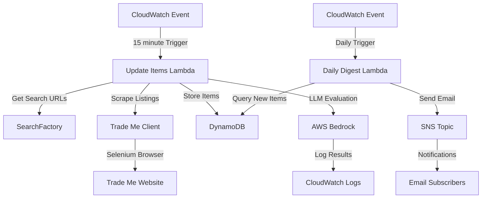

# Auction tracker service

The auction tracker service automatically monitors auction listings on Trade Me and sends daily digest emails with new listings that match specified search criteria.

## System architecture



## Requirements and specifications

### Functional requirements

- Monitor auction listings on Trade Me using web scraping
- Support multiple predefined search criteria with configurable filters
- Store discovered auction items in DynamoDB with metadata
- Evaluate items using AWS Bedrock LLM integration
- Send daily digest emails with new listings found in the last 24 hours
- Check for new items every 15 minutes across all searches
- Support any category of items through flexible search configuration

### Technical specifications

- Serverless architecture using AWS Lambda
- Data persistence with DynamoDB using composite keys
- Web scraping with Selenium headless browser for client-side rendered pages
- LLM integration with AWS Bedrock for item evaluation
- Notification delivery through Amazon SNS
- Daily digest scheduling with CloudWatch Events
- 15-minute scraping frequency for all searches
- Search criteria factory pattern for maintainable configuration

## Implementation details

### Technologies

- AWS Lambda for serverless execution
- DynamoDB for storing auction item data
- Amazon SNS for email notification delivery
- AWS Bedrock for LLM-based item evaluation
- Selenium WebDriver for web scraping client-side rendered pages
- Java runtime environment
- AWS CloudWatch Events for scheduled triggers
- Terraform for infrastructure as code
- LocalStack Bedrock for E2E testing

### Key components

- `UpdateItemsHandler`: Lambda handler that scrapes Trade Me for new items
- `TradeMeClient`: Client interface for retrieving auction data from Trade Me
- `SeleniumTradeMeClient`: Implementation using Selenium WebDriver for scraping
- `SearchFactory`: Factory providing predefined search URLs and criteria
- `AuctionTrackerItem`: Data model for storing auction data in DynamoDB
- `ItemDigestHandler`: Lambda handler that sends daily email summaries
- `ItemEvaluator`: Client for AWS Bedrock LLM item evaluation
- `AuctionTrackerFactory`: Factory for creating required dependencies

### Configuration

- Item scraping frequency: Every 15 minutes via CloudWatch Events
- Daily digest frequency: Once per day via CloudWatch Events
- DynamoDB table: "auction_tracker" with partition key "pk" and sort key "sk"
- SNS topic name: "auction_tracker_api_digest"
- Email subscribers: Configured in Terraform

### Web scraping process

The SeleniumTradeMeClient implements a comprehensive web scraping pipeline for extracting auction data from Trade Me:

#### Search and pagination

1. **Search URL construction**: Builds Trade Me search URLs with encoded search terms and price filters
2. **Page navigation**: Iterates through search result pages using ChromeDriver with headless browsing
3. **Result detection**: Waits for search results to load by detecting either result count headers or listing elements
4. **Link extraction**: Extracts individual listing URLs from search pages using CSS selectors (`a[href*='/listing/']`)
5. **Smart pagination**: Continues to next page until no new listings found or page limit reached (5 pages max)

#### Individual item extraction

1. **Page loading**: Navigates to each listing URL and waits for content to load (15 second timeout)
2. **Title extraction**: Uses CSS selector `h1.tm-marketplace-buyer-options__listing_title, h1.tm-marketplace-koru-listing__title` to extract item titles
3. **Content extraction**: Gathers all text from `.tm-marketplace-listing-body__container, .tm-marketplace-koru-listing__body` elements for descriptions
4. **Text processing**:
   - Joins multiple content sections with spaces
   - Normalizes whitespace and removes excessive formatting
   - Truncates descriptions to 1000 characters for storage efficiency
5. **Error handling**: Logs and continues processing when individual listings timeout or fail

#### Technical details

- **Browser configuration**: Uses Chrome with headless mode, no-sandbox, and optimized window size
- **Wait strategy**: Implements explicit waits using WebDriverWait for reliable element detection
- **CSS selectors**: Uses specific Trade Me CSS classes validated through testing
- **Timeout handling**: 30-second timeout per page with graceful failure for slow-loading listings

### Data schema

DynamoDB table structure:

- **Partition Key**: pk (String) - Trade Me search URL
- **Sort Key**: sk (String) - Timestamp + Trade Me item URL
- **Attributes**:
  - title (String) - Auction item title
  - ttl (Number) - Time to live expiry timestamp (30 days from item creation)

Example DynamoDB item:

```json
{
  "pk": {
    "S": "SEARCH#https://www.trademe.co.nz/a/marketplace/sports/golf/wedges-chippers/search?search_string=titleist%20wedge"
  },
  "sk": {
    "S": "TIMESTAMP#1748489155ITEM#https://www.trademe.co.nz/a/marketplace/sports/golf/wedges-chippers/listing/5337003621"
  },
  "title": {
    "S": "Titleist Vokey SM6 Wedge 60* K Grind (Rattle in Head) $1 RESERVE!!!"
  },
  "ttl": {
    "N": "1751081155"
  }
}
```
