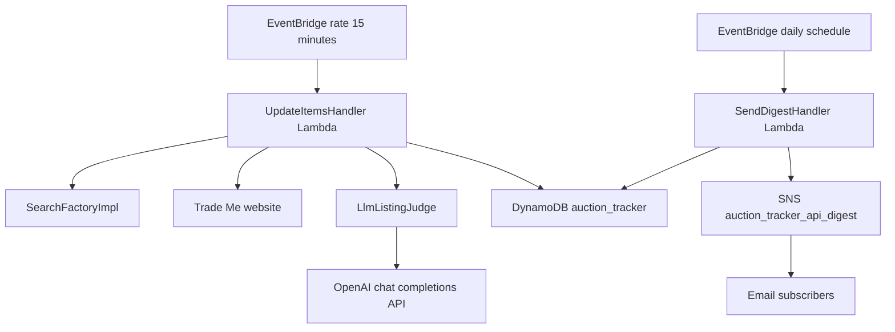
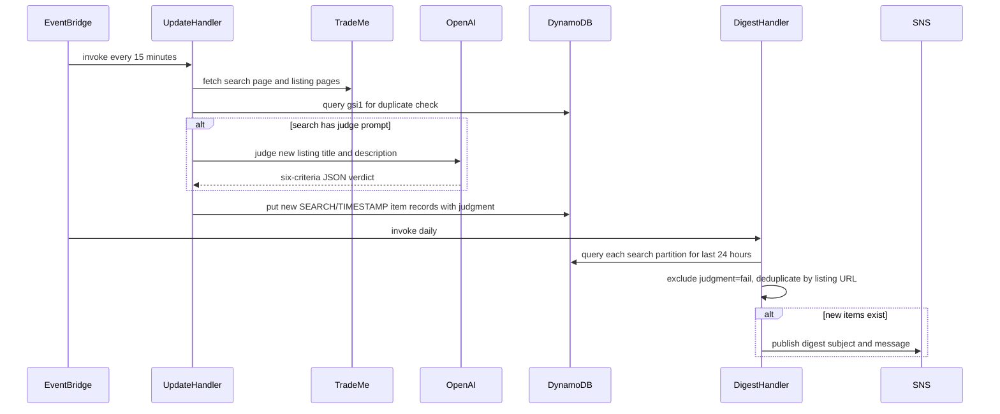

# Auction tracker API

The auction tracker API service runs scheduled backend workflows that scrape Trade Me listings, judge configured searches with an LLM listing filter, store discovered items, and send a daily digest email for newly found listings.

## Overview

- **Service type**: backend scheduled worker (`auction_tracker_api`)
- **Interface**: EventBridge scheduled events to AWS Lambda handlers (`RequestHandler<ScheduledEvent, Void>`)
- **Runtime**: AWS Lambda (Java 21)
- **Primary storage**: DynamoDB table `auction_tracker` with `gsi1` for duplicate checks
- **Primary consumers**: email subscribers on SNS topic `auction_tracker_api_digest`

## User stories

- As a bargain hunter, I want Trade Me listings scraped automatically, so that I do not miss relevant new items.
- As a digest subscriber, I want one daily deduplicated summary, so that I can review new listings quickly.
- As a maintainer, I want duplicate detection per search and listing URL, so that persisted records and digests stay clean.
- As an MTG bulk-lot hunter, I want junk listings (wrong game, single cards, basic lands, store repacks) filtered by an LLM judge, so that the digest only surfaces lots worth a look.

## Features and scope boundaries

### In scope

- Run `UpdateItemsHandler` every 15 minutes to scrape predefined Trade Me searches.
- Build search URLs with term, optional price filters, condition filter, and `sort_order=expirydesc`.
- Fetch listing pages, normalize listing URLs, and skip listings marked as reserve not met.
- Judge new listings on searches with a configured judge prompt (the three MTG searches: `bulk`, `collection`, `assorted`) using an OpenAI LLM against six binary criteria, and persist the overall verdict.
- Store newly discovered items in DynamoDB with deterministic key prefixes and 30-day TTL.
- Prevent duplicate inserts for the same `(search_url, item_url)` pair using GSI `gsi1`.
- Run `SendDigestHandler` daily and publish a digest for listings discovered in the last 24 hours, excluding listings judged `fail`.
- Deduplicate digest entries by listing URL when the same listing appears in multiple searches.

### Out of scope

- Exposing public HTTP endpoints or interactive UI contracts.
- User-configurable search management at runtime (searches are code-defined in `SearchFactoryImpl`).
- Scraping paginated result pages beyond the first page of each search result.
- Persisting listing descriptions in DynamoDB (descriptions are extracted during scraping, passed to the judge, but not stored).
- Custom retry orchestration beyond default AWS retry behavior and Lambda re-invocation semantics.
- Re-judging listings after their first verdict (judgments are permanent for a record's lifetime).
- Judging listings on searches without a configured judge prompt (the RAM search).

## Architecture


```mermaid
flowchart TD
  updateSchedule[EventBridge rate 15 minutes] --> updateHandler[UpdateItemsHandler Lambda]
  updateHandler --> searchFactory[SearchFactoryImpl]
  updateHandler --> tradeMe[Trade Me website]
  updateHandler --> listingJudge[LlmListingJudge]
  listingJudge --> openAi[OpenAI chat completions API]
  updateHandler --> auctionTable[DynamoDB auction_tracker]
  digestSchedule[EventBridge daily schedule] --> digestHandler[SendDigestHandler Lambda]
  digestHandler --> auctionTable
  digestHandler --> digestTopic[SNS auction_tracker_api_digest]
  digestTopic --> subscribers[Email subscribers]
```

### Primary workflow


```mermaid
sequenceDiagram
  participant EventBridge
  participant UpdateHandler
  participant TradeMe
  participant OpenAI
  participant DynamoDB
  participant DigestHandler
  participant SNS

  EventBridge->>UpdateHandler: invoke every 15 minutes
  UpdateHandler->>TradeMe: fetch search page and listing pages
  UpdateHandler->>DynamoDB: query gsi1 for duplicate check
  alt search has judge prompt
    UpdateHandler->>OpenAI: judge new listing title and description
    OpenAI-->>UpdateHandler: six-criteria JSON verdict
  end
  UpdateHandler->>DynamoDB: put new SEARCH/TIMESTAMP item records with judgment
  EventBridge->>DigestHandler: invoke daily
  DigestHandler->>DynamoDB: query each search partition for last 24 hours
  DigestHandler->>DigestHandler: exclude judgment=fail, deduplicate by listing URL
  alt new items exist
    DigestHandler->>SNS: publish digest subject and message
  end
```

## Main technical decisions

- Use EventBridge + Lambda for low operational overhead and fixed scraping/digest cadence.
- Use Jsoup scraping against Trade Me server-rendered pages instead of a browser automation stack.
- Use DynamoDB `pk`/`sk` prefixes with `gsi1` so duplicate checks are direct key lookups, not scans.
- Keep table and topic names code-defined (`auction_tracker`, `auction_tracker_api_digest`) to reduce configuration complexity.
- Keep search definitions in code (`SearchFactoryImpl`) for deterministic behavior and easy testability.
- Treat digest timing as a daily NZ-local intent while current infrastructure executes at `21:00 UTC` (`cron(0 21 * * ? *)`).
- Use browser-like headers and cookies in scrape requests to improve compatibility with Trade Me page delivery.
- Judge listings at scrape time (the only moment descriptions exist in memory) and persist the verdict, so each listing is judged at most once per search and the digest filters purely from storage.
- Use `gpt-5.4-mini` with reasoning effort `none` via the shared `lib/llm` client; the model, effort, and prompt were selected by the eval harness in `evals/` (perfect test-split TPR/TNR at the lowest cost and latency).
- Freeze the production system prompt (judge prompt v2 plus train-split few-shot examples) as a checked-in resource `src/main/resources/prompts/mtg-bulk-judge.md`, loaded through `lib/prompts`.
- Fail closed on judge errors: exceptions fail the invocation and the run retries on the next 15-minute tick; already-persisted items are not re-judged.
- Memoize judgments per `(judge prompt, listing URL)` within an invocation so overlapping judged searches trigger one LLM call per listing.

## Domain glossary

- **Search definition**: one configured Trade Me query with base URL, search term, optional price bounds, condition, and optional judge prompt resource name.
- **Discovered item**: one listing found and parsed from Trade Me with normalized URL and title.
- **Duplicate item**: an item where the same search URL and listing URL already exists in `gsi1`.
- **Judged search**: a search definition with a judge prompt (currently the three MTG searches sharing `prompts/mtg-bulk-judge.md`).
- **Judgment**: the LLM verdict for a listing, `pass` or `fail`; overall pass requires all six criteria (`mtg_cards`, `bulk_scale`, `not_basic_lands`, `not_universes_beyond`, `civilian_seller`, `fixed_collection`) to pass.
- **Digest window**: rolling 24-hour interval from the digest handler execution timestamp.
- **Cross-search duplicate**: the same listing URL appearing in multiple search definitions.

## Integration contracts

### External systems

- **Trade Me website**: outbound `GET` requests to search and listing pages derived from configured searches. The base origin defaults to `https://www.trademe.co.nz` and can be overridden with `AUCTION_TRACKER_TRADEME_BASE_URL` (used in E2E tests). Requests include browser-like headers/cookies and a 30-second timeout. Item-page fetch failures are logged and skipped; unrecoverable search errors fail the invocation.
- **Amazon DynamoDB**: outbound reads/writes against table `auction_tracker`. Update flow performs duplicate checks and inserts; digest flow queries per-search partitions for recent items.
- **Amazon SNS**: outbound publish to topic `auction_tracker_api_digest` when at least one new item exists in the digest window. Topic ARN is resolved by listing topics and matching by topic-name suffix.
- **Amazon EventBridge**: scheduled invocation source for both handlers (`rate(15 minutes)` and `cron(0 21 * * ? *)`).
- **OpenAI chat completions API**: outbound `POST /v1/chat/completions` for new listings on judged searches, with model `gpt-5.4-mini`, reasoning effort `none`, and JSON response format. The base origin defaults to `https://api.openai.com` and can be overridden with `AUCTION_TRACKER_OPENAI_BASE_URL` (used in E2E tests). The API key is read from the `auction_tracker_api` secret. Request failures and malformed verdicts fail the invocation.
- **AWS Secrets Manager**: outbound read of secret `auction_tracker_api` for the OpenAI API key, resolved lazily on the first judged listing per Lambda instance.

## API contracts

### Conventions

- This service does not expose public HTTP endpoints in current scope.
- Invocation contract is Lambda scheduled execution with input `ScheduledEvent` and output `null`.
- Handler exceptions are logged and rethrown as runtime exceptions, causing invocation failure.

### Endpoint summary

| Interface             | Contract                                | Purpose                                 |
| --------------------- | --------------------------------------- | --------------------------------------- |
| EventBridge -> Lambda | scheduled event to `UpdateItemsHandler` | scrape listings and persist new records |
| EventBridge -> Lambda | scheduled event to `SendDigestHandler`  | find recent items and publish digest    |

### Example request and response

Invocation event (representative):

```json
{
  "source": "aws.events",
  "detail-type": "Scheduled Event"
}
```

Handler result on success:

```json
null
```

## Data and storage contracts

### DynamoDB model

- **Table name**: `auction_tracker`
- **Primary key**:
  - `pk` (string): `SEARCH#<full_search_url>`
  - `sk` (string): `TIMESTAMP#<epoch_seconds_zero_padded_to_10_digits>ITEM#<item_url>`
- **Attributes**:
  - `title` (string): listing title
  - `url` (string): normalized listing URL with query parameters removed
  - `timestamp` (number): epoch seconds (`Clock.now()`)
  - `judgment` (string, optional): LLM verdict `pass` or `fail`; absent for items from searches without a judge prompt and for records created before judging existed
  - `ttl` (number): epoch seconds at `timestamp + 30 days`
  - `version` (number): optimistic locking version (`@DynamoDbVersionAttribute`)
  - `gsi1pk` (string): `SEARCH#<full_search_url>`
  - `gsi1sk` (string): `ITEM#<item_url>`
- **Global secondary index `gsi1`**:
  - hash key: `gsi1pk`
  - range key: `gsi1sk`
  - projection: `ALL`
  - usage: exact duplicate existence check before inserting an item
- **Access patterns**:
  - duplicate check: query `gsi1` on exact `gsi1pk` + `gsi1sk`
  - digest query: query one search partition for items with `sk` greater than a rolling 24-hour threshold
- **Retention behavior**:
  - DynamoDB TTL is enabled on `ttl`; items expire approximately 30 days after discovery

Representative record:

```json
{
  "pk": "SEARCH#https://www.trademe.co.nz/a/marketplace/sports/golf/irons/steel-shaft/search?search_string=titleist+iron&price_max=75&condition=used&sort_order=expirydesc",
  "sk": "TIMESTAMP#1751139600ITEM#https://www.trademe.co.nz/a/marketplace/sports/golf/irons/steel-shaft/listing/5337003621",
  "title": "Titleist iron set",
  "url": "https://www.trademe.co.nz/a/marketplace/sports/golf/irons/steel-shaft/listing/5337003621",
  "timestamp": 1751139600,
  "ttl": 1753731600,
  "version": 1,
  "gsi1pk": "SEARCH#https://www.trademe.co.nz/a/marketplace/sports/golf/irons/steel-shaft/search?search_string=titleist+iron&price_max=75&condition=used&sort_order=expirydesc",
  "gsi1sk": "ITEM#https://www.trademe.co.nz/a/marketplace/sports/golf/irons/steel-shaft/listing/5337003621"
}
```

## Behavioral invariants and time semantics

- Every update invocation iterates all configured searches and attempts to process each one.
- Duplicate insert prevention is deterministic by exact `(search_url, item_url)` match through `gsi1`.
- A listing on a judged search is judged at most once per search: the `gsi1` duplicate check skips persisted records before the judge is consulted, and the persisted `judgment` never changes.
- Judging is fail-closed: an LLM error or malformed verdict fails the invocation; the affected listing is retried on the next scheduled run.
- Within one invocation, the same listing URL under the same judge prompt produces exactly one LLM call; all matching searches persist the shared verdict.
- Items with `judgment` = `fail` are never included in digest messages; items with `judgment` = `pass` or no judgment are included.
- Digest selection window is deterministic: items newer than `clock.now().minus(1, ChronoUnit.DAYS)`.
- Digest output deduplicates by listing URL across all configured searches.
- Listing URLs are canonicalized by stripping query parameters before persistence and digesting.
- Listings marked `Reserve not met` are filtered out and never persisted.
- Search-result pagination beyond the first page is not processed; the handler logs a warning when pagination is detected.
- `sk` includes zero-padded epoch seconds, preserving deterministic lexicographic time ordering.
- TTL is always computed as `timestamp + 30 days`.

## Source of truth

| Entity                     | Authoritative source                           | Notes                                                              |
| -------------------------- | ---------------------------------------------- | ------------------------------------------------------------------ |
| Search definitions         | `SearchFactoryImpl` in service code            | current definitions are static and code-controlled                 |
| Listing content snapshot   | Trade Me listing pages at scrape time          | title/url are persisted; description is transient in scrape logic  |
| Judge prompt               | `src/main/resources/prompts/mtg-bulk-judge.md` | frozen system prompt validated by the eval harness in `evals/`     |
| Judge model and effort     | `LlmListingJudge` constants in service code    | `gpt-5.4-mini`, reasoning effort `none`                            |
| Persisted discovered items | DynamoDB `auction_tracker` table               | canonical history used for duplicate checks, verdicts, and digests |
| Digest recipients          | SNS topic subscriptions in Terraform           | email endpoints are infra-managed                                  |
| Schedule cadence           | EventBridge rules in Terraform                 | update `rate(15 minutes)`, digest `cron(0 21 * * ? *)`             |

## Security and privacy

- Service is schedule-driven and does not expose public HTTP interfaces.
- Lambda IAM role grants required access for DynamoDB operations, SNS publish/list-topics operations, and reading the `auction_tracker_api` secret.
- The OpenAI API key lives only in Secrets Manager; it is never logged or persisted in DynamoDB.
- AWS credentials and region resolve through the AWS SDK default provider chain in Lambda/runtime environments.
- Integrations use HTTPS transport (Trade Me, OpenAI, and AWS APIs).
- Listing titles and descriptions (public Trade Me content) are sent to the OpenAI API for judging; no user data is involved.
- Logging uses standard INFO/WARN/ERROR levels; avoid introducing logs that include sensitive operational data such as subscription endpoints.
- Scraping uses browser-like request headers/cookies; these are implementation details and should be reviewed when upstream page behavior changes.

## Configuration and secrets reference

### Environment variables

| Name                               | Required | Purpose                                           | Default behavior                                            |
| ---------------------------------- | -------- | ------------------------------------------------- | ----------------------------------------------------------- |
| `AUCTION_TRACKER_TRADEME_BASE_URL` | no       | override Trade Me base origin for search/listings | defaults to `https://www.trademe.co.nz` when unset or blank |
| `AUCTION_TRACKER_OPENAI_BASE_URL`  | no       | override OpenAI base origin for judging           | defaults to `https://api.openai.com` when unset or blank    |

### Secret shape

Secrets Manager secret `auction_tracker_api` (value set manually after Terraform apply):

```json
{
  "openai_api_key": "sk-..."
}
```

## Performance envelope

- Update schedule runs every 15 minutes; digest schedule runs daily (`21:00 UTC`) and represents a daily NZ-local intent.
- Lambda runtime settings are `memory_size = 1024` MB for both handlers.
- Lambda timeout is `300` seconds for `UpdateItemsHandler` (sized for sequential judging at roughly 2 seconds per new judged listing, including first-run backfill) and `30` seconds for `SendDigestHandler`.
- Jsoup HTTP requests use a `30` second timeout per request.
- Judging costs roughly $0.011 per judged listing at current model pricing; steady-state runs judge only newly discovered listings.
- Per-item scrape failures are non-fatal for a run (warn and continue), while handler-level failures (including judge errors) bubble as invocation errors.

## Testing and quality gates

- Unit tests (`JsoupTradeMeClientTest`) cover URL generation, listing parsing, query-parameter stripping, and reserve filtering.
- Unit tests (`LlmListingJudgeTest`) cover verdict parsing, criterion failure, malformed responses, and the exact LLM request shape against the real checked-in prompt resource.
- Integration tests cover update persistence, duplicate prevention, multi-search processing, judgment persistence, judge-once memoization, fail-closed judge errors, 24-hour digest filtering, fail-judged exclusion, and digest deduplication (LLM calls faked via `FakeLlmClient`).
- E2E tests validate the LocalStack pipeline (Lambda invoke plus SNS/SQS notification path) against local Trade Me website and OpenAI stub containers and are CI-safe.
- Required checks before merge:
  - `bazel test //auction_tracker_api:unit-tests`
  - `bazel test //auction_tracker_api:integration-tests`
  - `bazel build //auction_tracker_api:update-items-handler`
  - `bazel build //auction_tracker_api:send-digest-handler`

## Local development and smoke checks

- Run unit and integration suites: `bazel test //auction_tracker_api:unit-tests //auction_tracker_api:integration-tests`
- Build handler artifacts: `bazel build //auction_tracker_api:update-items-handler //auction_tracker_api:send-digest-handler`
- Optional local E2E path (requires local image load): `bazel test //auction_tracker_api:e2e-tests`
- Minimal smoke flow:
  - run `UpdateItemsHandler` with known fake search responses and verify only new items are inserted
  - validate inserted keys follow `SEARCH#...` and `TIMESTAMP#...ITEM#...` formats
  - run `SendDigestHandler` and verify one digest publish when recent items exist, and no publish when none exist

## End-to-end scenarios

### Scenario 1: scheduled scrape ingests new listings

1. EventBridge triggers `UpdateItemsHandler` on the 15-minute schedule.
2. Handler loads static searches from `SearchFactoryImpl` and scrapes Trade Me search/listing pages.
3. For each discovered listing, handler checks `gsi1` for an existing `(search_url, item_url)` record.
4. Handler writes only new items to DynamoDB with timestamp, TTL, and prefixed primary/GSI keys.

### Scenario 2: new MTG listing is judged before persistence

1. `UpdateItemsHandler` discovers a new listing on a judged MTG search (`bulk`, `collection`, or `assorted`).
2. Handler checks the per-run memo; on a miss it sends the listing title and description to the OpenAI API with the frozen system prompt.
3. The judge parses the six-criteria JSON verdict; overall pass requires all six criteria to pass, and failed criteria are logged with their reasoning.
4. Handler persists the record with `judgment` = `pass` or `fail`; other searches discovering the same listing in the same run reuse the memoized verdict.

### Scenario 3: daily digest publishes recent unique listings

1. EventBridge triggers `SendDigestHandler` on the daily schedule (`21:00 UTC`).
2. Handler queries each search partition for records newer than the rolling 24-hour threshold.
3. Handler excludes records with `judgment` = `fail` and deduplicates merged results by listing URL across searches.
4. Handler publishes one SNS digest when at least one item exists; otherwise it logs that no new items were found.
