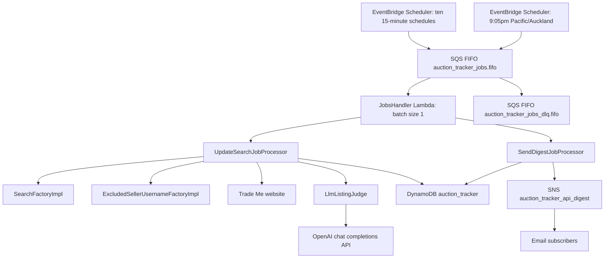
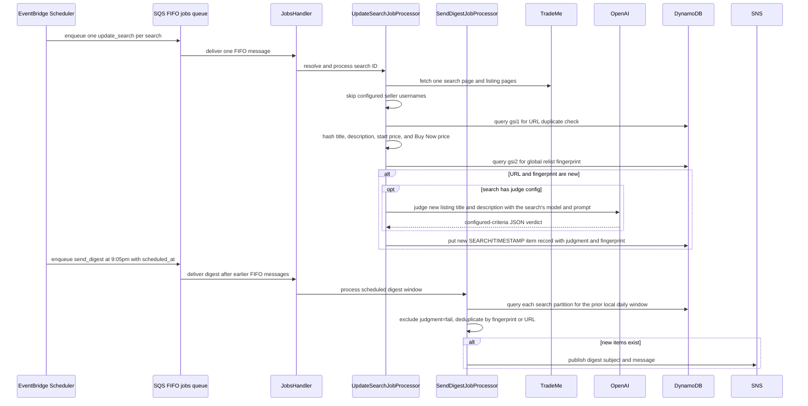

# Auction tracker API

The auction tracker API service runs scheduled queued workflows that scrape Trade Me listings and seller-set prices, judge configured searches with per-search LLM listing filters, store discovered items, and send a daily digest email for newly found listings.

## Overview

- **Service type**: backend queued worker (`auction_tracker_api`)
- **Interface**: EventBridge Scheduler -> SQS FIFO -> AWS Lambda (`RequestHandler<SQSEvent, Void>`)
- **Runtime**: AWS Lambda (Java 21)
- **Primary storage**: DynamoDB table `auction_tracker` with `gsi1` for URL duplicate checks and `gsi2` for relist fingerprint checks
- **Primary consumers**: email subscribers on SNS topic `auction_tracker_api_digest`

## User stories

- As a bargain hunter, I want Trade Me listings scraped automatically, so that I do not miss relevant new items.
- As a digest subscriber, I want one daily deduplicated summary, so that I can review new listings quickly.
- As a digest subscriber, I want relists with unchanged content and seller-set prices suppressed across searches for 30 days, so that listings I have already reviewed do not reappear under a new listing ID.
- As a digest subscriber, I want a relist with a changed seller-set price to be notified again, so that I see when a seller lowers the price.
- As a digest subscriber, I want listings from known seller usernames excluded, so that my own listings do not appear in the digest.
- As a maintainer, I want duplicate detection by listing URL, exact listing content, and seller-set price terms, so that persisted records, judge calls, and digests stay clean.
- As an MTG bulk-lot hunter, I want junk listings (wrong game, single cards, basic lands, store repacks) filtered by an LLM judge, so that the digest only surfaces lots worth a look.
- As a RAM kit hunter, I want mismatched listings (wrong family, DDR generation, configuration, speed, timings, or form factor) filtered by an LLM judge, so that the digest only surfaces kits matching my existing G.Skill Trident Z 2x16GB DDR4-3200 CL16 kit.

## Features and scope boundaries

### In scope

- Queue one `update_search` job per configured Trade Me search every 15 minutes. Each job invokes the worker for exactly one search.
- Identify the ten code-defined searches with stable IDs: `ram-g-skill`, `ram-gskill`, `ram-trident-z`, `mtg-bulk`, `mtg-collection`, `mtg-assorted`, `mtg-clear-out`, `mtg-clearout`, `mtg-lot`, and `mtg-one-dollar-reserve`.
- Build search URLs with term, optional price filters, condition filter, and `sort_order=expirydesc`.
- Fetch listing pages, normalize listing URLs, extract original start and Buy Now prices from the embedded Trade Me page state, exclude current bids from relist identity, and skip listings marked as reserve not met.
- Extract seller usernames from embedded Trade Me page state and skip listings from the injected code-defined exclusion set, initially `roseshade`, before duplicate checks, judging, or persistence.
- Judge new listings on searches with a configured judge (all ten searches: the seven MTG searches `bulk`, `collection`, `assorted`, `clear out`, `clearout`, `lot`, `$1 reserve` and the three RAM searches `g.skill`, `gskill`, `trident z`) using an OpenAI LLM against the judge's configured binary criteria, and persist the overall verdict.
- Carry judge configuration (prompt resource, model, reasoning effort, criteria) per search: the MTG searches share one judge config, the RAM searches share another.
- Store newly discovered items in DynamoDB with deterministic key prefixes and 30-day TTL.
- Prevent duplicate inserts for the same `(search_url, item_url)` pair using GSI `gsi1`.
- Suppress relists globally before judging when GSI `gsi2` contains the same exact title, description, start price, and Buy Now price SHA-256 fingerprint.
- Queue one `send_digest` job daily at 9:05pm `Pacific/Auckland`. The worker publishes a digest for the preceding local daily window, excluding listings judged `fail`.
- Deduplicate digest entries by price-aware content fingerprint, falling back to listing URL for records created before content fingerprinting.
- Retry failed worker messages through the FIFO queue and route messages that fail five receives to the passive worker DLQ. The DLQ is inspected and redriven by a human after the cause is fixed.
- Accept at-least-once processing: duplicate deliveries can repeat scraping, judging, DynamoDB writes, or SNS publication. Existing GSI and digest deduplication limits user-visible duplicates.
- Alert only on a non-zero worker DLQ depth; the worker Lambda is excluded from the platform Lambda failure-rate alarms.

### Out of scope

- Exposing public HTTP endpoints or interactive UI contracts.
- User-configurable search management at runtime (searches are code-defined in `SearchFactoryImpl`).
- Runtime management of excluded seller usernames (the production set is code-defined in `ExcludedSellerUsernameFactoryImpl`).
- Scraping paginated result pages beyond the first page of each search result.
- Persisting listing descriptions or seller-set prices independently in DynamoDB (they are extracted during scraping and used for judging or fingerprinting, but only the fingerprint is stored).
- Fuzzy relist detection when a seller changes the title or description.
- Custom retry orchestration beyond default AWS retry behavior and Lambda re-invocation semantics.
- Re-judging listings after their first verdict (judgments are permanent for a record's lifetime), including records persisted by the removed narrow RAM search (`g.skill trident z 32gb ddr4`), which age out via TTL.
- Spec-based RAM searches (`32gb ddr4`, `ddr4 ram`): result volume exceeds the single scraped page and is mostly junk; revisit only if the brand searches miss listings.

## Architecture


```mermaid
flowchart TD
  updateSchedules[EventBridge Scheduler: ten 15-minute schedules] --> jobsQueue[SQS FIFO auction_tracker_jobs.fifo]
  digestSchedule[EventBridge Scheduler: 9:05pm Pacific/Auckland] --> jobsQueue
  jobsQueue --> jobsHandler[JobsHandler Lambda: batch size 1]
  jobsHandler --> searchProcessor[UpdateSearchJobProcessor]
  jobsHandler --> digestProcessor[SendDigestJobProcessor]
  searchProcessor --> searchFactory[SearchFactoryImpl]
  searchProcessor --> excludedSellers[ExcludedSellerUsernameFactoryImpl]
  searchProcessor --> tradeMe[Trade Me website]
  searchProcessor --> listingJudge[LlmListingJudge]
  listingJudge --> openAi[OpenAI chat completions API]
  searchProcessor --> auctionTable[DynamoDB auction_tracker]
  digestProcessor --> auctionTable
  digestProcessor --> digestTopic[SNS auction_tracker_api_digest]
  digestTopic --> subscribers[Email subscribers]
  jobsQueue --> jobsDlq[SQS FIFO auction_tracker_jobs_dlq.fifo]
```

### Primary workflow


```mermaid
sequenceDiagram
  participant UpdateSchedule as EventBridge Scheduler
  participant JobsQueue as SQS FIFO jobs queue
  participant JobsHandler
  participant SearchProcessor as UpdateSearchJobProcessor
  participant DigestProcessor as SendDigestJobProcessor
  participant TradeMe
  participant OpenAI
  participant DynamoDB
  participant SNS

  UpdateSchedule->>JobsQueue: enqueue one update_search per search
  JobsQueue->>JobsHandler: deliver one FIFO message
  JobsHandler->>SearchProcessor: resolve and process search ID
  SearchProcessor->>TradeMe: fetch one search page and listing pages
  SearchProcessor->>SearchProcessor: skip configured seller usernames
  SearchProcessor->>DynamoDB: query gsi1 for URL duplicate check
  SearchProcessor->>SearchProcessor: hash title, description, start price, and Buy Now price
  SearchProcessor->>DynamoDB: query gsi2 for global relist fingerprint
  alt URL and fingerprint are new
    opt search has judge config
      SearchProcessor->>OpenAI: judge new listing title and description with the search's model and prompt
      OpenAI-->>SearchProcessor: configured-criteria JSON verdict
    end
    SearchProcessor->>DynamoDB: put new SEARCH/TIMESTAMP item record with judgment and fingerprint
  end
  UpdateSchedule->>JobsQueue: enqueue send_digest at 9:05pm with scheduled_at
  JobsQueue->>JobsHandler: deliver digest after earlier FIFO messages
  JobsHandler->>DigestProcessor: process scheduled digest window
  DigestProcessor->>DynamoDB: query each search partition for the prior local daily window
  DigestProcessor->>DigestProcessor: exclude judgment=fail, deduplicate by fingerprint or URL
  alt new items exist
    DigestProcessor->>SNS: publish digest subject and message
  end
```

## Main technical decisions

- Use ten EventBridge Scheduler schedules to enqueue one message per search into a single FIFO queue. Use a second Scheduler schedule for the digest message.
- Use one constant FIFO message group (`auction-tracker`) and Lambda event-source batch size one to serialize upstream load and keep each invocation scoped to one job.
- Keep `JobsHandler` limited to SQS message parsing and dispatch; `UpdateSearchJobProcessor` owns one-search scraping and persistence, while `SendDigestJobProcessor` owns digest selection and SNS publication.
- Use content-based deduplication, a 14-day retention period, a 1,800-second visibility timeout, and a five-receive redrive policy to one FIFO worker DLQ. Do not add claim records, transactions, a message ledger, or a Scheduler DLQ.
- Treat worker processing as at least once. Duplicate scraping, judging, persistence, and SNS publication are acceptable; GSI URL/fingerprint checks and digest grouping remain the suppression mechanisms.
- Use Jsoup scraping against Trade Me server-rendered pages instead of a browser automation stack.
- Use DynamoDB `pk`/`sk` prefixes with `gsi1` and `gsi2` so URL duplicate and relist checks are direct key lookups, not scans.
- Keep table and topic names code-defined (`auction_tracker`, `auction_tracker_api_digest`) to reduce configuration complexity.
- Keep search definitions in code (`SearchFactoryImpl`) for deterministic behavior and easy testability.
- Inject excluded seller usernames through `ExcludedSellerUsernameFactory`; keep the production set in `ExcludedSellerUsernameFactoryImpl` and use a fake in integration tests.
- Run the digest at 9:05pm New Zealand local time using `cron(5 21 * * ? *)` with the `Pacific/Auckland` schedule timezone. Use the message's `scheduled_at` as the upper boundary and the preceding local 9:05pm boundary as the lower boundary, including across daylight-saving transitions.
- Use browser-like headers and cookies in scrape requests to improve compatibility with Trade Me page delivery.
- Judge listings at scrape time (the only moment descriptions exist in memory) and persist the verdict, so matching fingerprinted relists are skipped before judging and the digest filters purely from storage.
- Define relist identity through the injected `ListingFingerprinter`; `Sha256ListingFingerprinter` hashes the exact scraped title, description, normalized original start price, and normalized Buy Now price separated by null characters. Current bids are excluded because they are bidder-driven rather than seller-set; any content or seller-price change produces a new fingerprint.
- Read seller-set prices from the server-rendered `#frend-state` JSON at `NGRX_STATE.listing.cachedDetails.entities.<listing_id>.item`, where `startPrice` remains distinct from `maxBidAmount` after bidding begins. Missing or malformed required page data fails the invocation rather than storing an unsafe fingerprint.
- Read the required seller username from the same embedded listing item at `member.nickname`. A missing or blank username fails the invocation so upstream contract drift is detected instead of bypassing exclusions.
- Existing title-and-description fingerprints are not backfilled. They do not match price-aware fingerprints, so the first relist after deployment can produce one notification even when its price is unchanged; subsequent relists use price-aware suppression.
- Carry judge configuration as a nullable nested `Judge` record (`prompt`, `model`, `reasoningEffort`, `criteria`) on each `SearchFactory.Search`, with one shared constant per judge in `SearchFactoryImpl`; criteria ride with the config because verdict validation is per-judge.
- MTG judge: `gpt-5.4-mini` with reasoning effort `none` via the shared `lib/llm` client; retain the configuration selected by the eval harness in `evals/mtg_bulk/` while reducing the v4 prompt to the five current criteria.
- RAM judge: `gpt-5.4-nano` with reasoning effort `low`; selected by the eval harness in `evals/ram/` (perfect test-split TPR/TNR at roughly 3.6x lower cost than the mini candidate).
- Broaden RAM coverage with three brand searches (`g.skill`, `gskill`, `trident z`) because Trade Me tokenizes `g.skill` and `gskill` differently and the previous narrow term returned almost nothing; spec-based terms stay out to keep results within the single scraped page.
- Freeze each production system prompt (current eval prompt plus train-split few-shot examples) as a checked-in resource loaded through `lib/prompts`: `src/main/resources/prompts/mtg-bulk-judge.md` (mtg_bulk v4) and `src/main/resources/prompts/ram-judge.md` (ram v3).
- Fail closed on judge errors: exceptions fail the invocation so the same SQS message is retried; already-persisted items are not re-judged.
- Persist listing discovery time from the worker's actual processing time, not the Scheduler's scheduled time, so delayed searches remain eligible for the next unsent digest window.

## Domain glossary

- **Search definition**: one configured Trade Me query with a stable ID, base URL, search term, optional price bounds, condition, and optional judge configuration. The ID is stored directly on `SearchFactory.Search` and is the only identifier accepted by `SearchFactory.getSearch`.
- **Judge configuration**: a prompt resource name, OpenAI model, reasoning effort, and ordered criteria list shared by the searches that use it (one config for MTG, one for RAM).
- **Discovered item**: one listing found and parsed from Trade Me with normalized URL, title, transient description, transient seller username, and transient seller-set price terms.
- **Excluded seller username**: a normalized Trade Me member nickname in the injected global exclusion set; matching listings are discarded before any storage lookup, LLM call, or persistence.
- **URL duplicate**: an item where the same search URL and listing URL already exists in `gsi1`.
- **Content fingerprint**: a deterministic SHA-256 identity derived from the exact scraped listing title, description, normalized original start price, and normalized Buy Now price, persisted as `fingerprint`, and used to derive `gsi2pk`.
- **Seller-set price terms**: the original auction start price and optional Buy Now price embedded in Trade Me's server-rendered page state; current bids are excluded.
- **Relisted item**: a listing with a new URL whose price-aware content fingerprint matches a record retained in `gsi2`.
- **Judged search**: a search definition with a judge configuration (currently all ten searches: seven MTG sharing `prompts/mtg-bulk-judge.md`, three RAM sharing `prompts/ram-judge.md`).
- **Judgment**: the LLM verdict for a listing, `pass` or `fail`; overall pass requires all configured criteria to pass (MTG: `mtg_cards`, `bulk_scale`, `not_basic_lands`, `civilian_seller`, `fixed_collection`; RAM: `trident_z_family`, `ddr4`, `kit_2x16gb`, `speed_3200`, `timings_cl16`, `desktop_udimm`). MTG set origin and crossover branding, including Universes Within and Universes Beyond, do not affect eligibility.
- **Search ID**: stable code-defined identifier carried by an `update_search` job (for example `mtg-bulk` or `ram-g-skill`).
- **Worker job**: one `update_search` or `send_digest` message delivered from the FIFO queue to `JobsHandler`.
- **Digest window**: interval from the preceding local 9:05pm `Pacific/Auckland` boundary (exclusive) through the job's `scheduled_at` upper boundary (inclusive).
- **Cross-search duplicate**: the same listing URL or price-aware content fingerprint appearing in multiple search definitions.

## Integration contracts

### External systems

- **Trade Me website**: outbound `GET` requests to search and listing pages derived from configured searches. The base origin defaults to `https://www.trademe.co.nz` and can be overridden with `AUCTION_TRACKER_TRADEME_BASE_URL` (used in E2E tests). Requests include browser-like headers/cookies and a 30-second timeout. Individual item-page fetch failures are logged and skipped; missing or malformed required title, description, seller username, or seller-price data and unrecoverable search errors fail the invocation. Seller usernames are read from `item.member.nickname`.
- **Amazon DynamoDB**: outbound reads/writes against table `auction_tracker`. Update flow performs per-search URL checks, global content-fingerprint checks, and inserts; digest flow queries per-search partitions for recent items.
- **Amazon SNS**: outbound publish to topic `auction_tracker_api_digest` when at least one new item exists in the digest window. Topic ARN is resolved by listing topics and matching by topic-name suffix.
- **Amazon SQS**: FIFO queue `auction_tracker_jobs.fifo` receives one message per configured search every 15 minutes and one digest message at 9:05pm. Content-based deduplication is enabled, all messages use group `auction-tracker`, retention is 14 days, and the worker event source uses batch size one. Failed messages are retried and routed after five receives to FIFO DLQ `auction_tracker_jobs_dlq.fifo`, which also retains messages for 14 days.
- **Amazon EventBridge Scheduler**: ten schedules enqueue `update_search` jobs with `cron(0/15 * * * ? *)`; one schedule enqueues `send_digest` with `cron(5 21 * * ? *)`, all in the `Pacific/Auckland` timezone. Each target includes `<aws.scheduler.scheduled-time>` and retries delivery up to five times for one hour. No Scheduler DLQ is configured; a delivery still failing after those retries is an accepted missed run. A dedicated scheduler role can send only to the FIFO jobs queue.
- **OpenAI chat completions API**: outbound `POST /v1/chat/completions` for new listings on judged searches, with the search's configured model and reasoning effort (`gpt-5.4-mini`/`none` for MTG, `gpt-5.4-nano`/`low` for RAM) and JSON response format. The base origin defaults to `https://api.openai.com` and can be overridden with `AUCTION_TRACKER_OPENAI_BASE_URL` (used in E2E tests). The API key is read from the `auction_tracker_api` secret. Request failures and malformed verdicts fail the invocation.
- **AWS Secrets Manager**: outbound read of secret `auction_tracker_api` for the OpenAI API key, resolved lazily on the first judged listing per Lambda instance.

## API contracts

### Conventions

- This service does not expose public HTTP endpoints in current scope.
- Invocation contract is one-record Lambda SQS execution with input `SQSEvent` and output `null`. The event-source mapping is configured with batch size one, and the handler rejects batches of any other size.
- Handler exceptions are logged and rethrown as runtime exceptions, causing invocation failure.

### Endpoint summary

| Interface                         | Contract                                     | Purpose                                                      |
| --------------------------------- | -------------------------------------------- | ------------------------------------------------------------ |
| EventBridge Scheduler -> SQS FIFO | `update_search` message per stable search ID | enqueue one search scrape                                    |
| EventBridge Scheduler -> SQS FIFO | `send_digest` message with `scheduled_at`    | enqueue the daily digest                                     |
| SQS FIFO -> Lambda                | one-record `SQSEvent` to `JobsHandler`       | process one search or digest and acknowledge only on success |

### Example request and response

Update message (representative):

```json
{
  "job_type": "update_search",
  "search_id": "mtg-bulk",
  "scheduled_at": "2026-09-25T09:00:00Z"
}
```

Digest message (representative):

```json
{
  "job_type": "send_digest",
  "scheduled_at": "2026-09-25T09:05:00Z"
}
```

Handler result on success:

```json
null
```

## Data and storage contracts

### DynamoDB model

- **Table name**: `auction_tracker`
- **Primary key**:
  - `pk` (string): `SEARCH#<full_search_url>`
  - `sk` (string): `TIMESTAMP#<epoch_seconds_zero_padded_to_10_digits>ITEM#<item_url>`
- **Attributes**:
  - `title` (string): listing title
  - `url` (string): normalized listing URL with query parameters removed
  - `fingerprint` (string, optional): 64-character SHA-256 of the exact scraped title, description, normalized original start price, and normalized Buy Now price; records created before price-aware fingerprinting retain the prior title-and-description hash
  - `timestamp` (number): epoch seconds (`Clock.now()`)
  - `judgment` (string, optional): LLM verdict `pass` or `fail`; absent for items from searches without a judge configuration and for records created before judging existed
  - `ttl` (number): epoch seconds at `timestamp + 30 days`
  - `version` (number): optimistic locking version (`@DynamoDbVersionAttribute`)
  - `gsi1pk` (string): `SEARCH#<full_search_url>`
  - `gsi1sk` (string): `ITEM#<item_url>`
  - `gsi2pk` (string, optional): `FINGERPRINT#<fingerprint>`; derived from the standalone `fingerprint` attribute
  - `gsi2sk` (string, optional): `ITEM#<item_url>`; present when `gsi2pk` is present
- **Transient fields**:
  - `description`: used for judging and fingerprinting but not persisted
  - `start_price` and `buy_now_price`: used for fingerprinting but not persisted independently
- **Global secondary index `gsi1`**:
  - hash key: `gsi1pk`
  - range key: `gsi1sk`
  - projection: `ALL`
  - usage: exact duplicate existence check before inserting an item
- **Global secondary index `gsi2`**:
  - hash key: `gsi2pk`
  - range key: `gsi2sk`
  - projection: `KEYS_ONLY`
  - usage: global exact content-fingerprint existence check before judging or inserting a relist
- **Access patterns**:
  - URL duplicate check: query `gsi1` on exact `gsi1pk` + `gsi1sk`
  - relist check: query `gsi2` on exact `gsi2pk`
  - digest query: query one search partition for items after the previous local 9:05pm boundary, then retain items through the message's scheduled upper boundary
- **Retention behavior**:
  - DynamoDB TTL is enabled on `ttl`; items and their GSI entries expire approximately 30 days after discovery

Representative record:

```json
{
  "pk": "SEARCH#https://www.trademe.co.nz/a/marketplace/computers/components/memory-ram/16gb-or-more/search?search_string=trident+z&price_max=200&condition=used&sort_order=expirydesc",
  "sk": "TIMESTAMP#1751139600ITEM#https://www.trademe.co.nz/a/marketplace/computers/components/memory-ram/16gb-or-more/listing/6021068148",
  "title": "32gb (2x 16gb) Trident Z RGB 3200Mhz DDR4 Memory",
  "url": "https://www.trademe.co.nz/a/marketplace/computers/components/memory-ram/16gb-or-more/listing/6021068148",
  "fingerprint": "<64-character-sha256>",
  "timestamp": 1751139600,
  "judgment": "pass",
  "ttl": 1753731600,
  "version": 1,
  "gsi1pk": "SEARCH#https://www.trademe.co.nz/a/marketplace/computers/components/memory-ram/16gb-or-more/search?search_string=trident+z&price_max=200&condition=used&sort_order=expirydesc",
  "gsi1sk": "ITEM#https://www.trademe.co.nz/a/marketplace/computers/components/memory-ram/16gb-or-more/listing/6021068148",
  "gsi2pk": "FINGERPRINT#<fingerprint>",
  "gsi2sk": "ITEM#https://www.trademe.co.nz/a/marketplace/computers/components/memory-ram/16gb-or-more/listing/6021068148"
}
```

## Behavioral invariants and time semantics

- Every `update_search` invocation resolves exactly one stable search ID and processes only that search.
- Every update invocation loads the global excluded seller username set once from `ExcludedSellerUsernameFactory`.
- Seller usernames are trimmed and compared case-insensitively with the normalized exclusion set. A match is skipped before `gsi1`, fingerprint, `gsi2`, judge, or persistence work and can never reach the digest.
- A missing or blank seller username fails the invocation before the listing can enter duplicate, relist, judging, or persistence behavior.
- A previously indexed exact `(search_url, item_url)` match in `gsi1` is skipped before fingerprinting or judging.
- New records receive a standalone deterministic `fingerprint` attribute from the exact scraped title, description, normalized original start price, and normalized Buy Now price separated by null characters; `gsi2pk` is derived from it.
- A new listing is skipped before judging when its fingerprint exists anywhere in `gsi2`, regardless of the search or prior judgment.
- Any title, description, original start price, or Buy Now price change produces a different fingerprint and is treated as new; changes to the current bid do not affect the fingerprint.
- Records created before fingerprint deployment have no `gsi2` attributes and continue to use URL-only deduplication; no historical backfill occurs.
- Records created with the prior title-and-description fingerprint remain unchanged until TTL expiry. Their first relist after price-aware deployment is treated as new even at the same price, after which the new fingerprint suppresses unchanged relists.
- Duplicate deliveries are expected under at-least-once processing. Concurrent or repeated invocations can race before GSI updates propagate; existing GSI checks and digest fingerprint/URL grouping limit duplicate stored and notified listings without promising exactly-once behavior.
- Each listing returned by a search is processed independently; there are no per-invocation fingerprint or judgment caches. Distinct listing URLs with the same fingerprint may therefore repeat judging or persistence work, while the GSI and digest grouping still provide the intended suppression behavior.
- A persisted `judgment` never changes.
- Every judged search's verdict is validated against its own criteria list; a response missing any configured criterion is malformed and fails the invocation.
- Judging is fail-closed: an LLM error or malformed verdict fails the SQS invocation so the message is retried and eventually routed to the worker DLQ after five receives if the cause persists.
- Items with `judgment` = `fail` are never included in digest messages; items with `judgment` = `pass` or no judgment are included.
- Digest selection window is deterministic from `scheduled_at`: items after the preceding local 9:05pm boundary and no later than the scheduled upper boundary. Subtracting one local day preserves the intended wall-clock boundary across DST changes.
- Persisted discovery timestamps come from the worker's actual processing clock, not `scheduled_at`, so delayed search jobs are included in the next appropriate digest window.
- SNS publication errors fail the digest invocation; the message is not acknowledged and a later retry can publish the same digest again after an ambiguous post-publication failure.
- Digest output deduplicates fingerprinted records by the standalone `fingerprint` attribute across all configured searches and falls back to listing URL for legacy records.
- Listing URLs are canonicalized by stripping query parameters before persistence and digesting.
- Listings marked `Reserve not met` are filtered out and never persisted.
- An individual item-page network fetch failure is logged and skipped. Missing or malformed title, description, seller username, embedded page state, original start price, or Buy Now price fails the invocation.
- Search-result pagination beyond the first page is not processed; the search processor logs a warning when pagination is detected.
- `sk` includes zero-padded epoch seconds, preserving deterministic lexicographic time ordering.
- TTL is always computed as `timestamp + 30 days`.

## Source of truth

| Entity                     | Authoritative source                                                                      | Notes                                                                                                  |
| -------------------------- | ----------------------------------------------------------------------------------------- | ------------------------------------------------------------------------------------------------------ |
| Search definitions         | `SearchFactoryImpl` in service code                                                       | current definitions are static and code-controlled                                                     |
| Excluded seller usernames  | `ExcludedSellerUsernameFactoryImpl` in service code                                       | global normalized set, initially `roseshade`; injected behind `ExcludedSellerUsernameFactory`          |
| Listing content snapshot   | Trade Me listing pages at scrape time                                                     | title/url/fingerprint are persisted; description, seller username, and seller-set prices are transient |
| Judge prompts              | `src/main/resources/prompts/mtg-bulk-judge.md`, `src/main/resources/prompts/ram-judge.md` | frozen system prompts validated by the eval harnesses in `evals/mtg_bulk/` and `evals/ram/`            |
| Judge model and effort     | `Judge` constants in `SearchFactoryImpl`                                                  | MTG `gpt-5.4-mini`/`none`, RAM `gpt-5.4-nano`/`low`                                                    |
| Persisted discovered items | DynamoDB `auction_tracker` table                                                          | canonical history used for duplicate checks, verdicts, and digests                                     |
| Digest recipients          | SNS topic subscriptions in Terraform                                                      | email endpoints are infra-managed                                                                      |
| Search IDs and schedules   | `SearchFactoryImpl` and `infra/main.tf`                                                   | ten stable IDs; update `cron(0/15 * * * ? *)`; digest `cron(5 21 * * ? *)` in `Pacific/Auckland`       |

## Security and privacy

- Service is schedule-driven and does not expose public HTTP interfaces.
- Lambda IAM role grants required access for DynamoDB operations, SNS publish/list-topics operations, and reading the `auction_tracker_api` secret.
- The worker Lambda role can read/write the auction table, read the OpenAI secret, publish to the digest topic, and consume the jobs queue. The dedicated Scheduler role can send only to the jobs queue.
- The OpenAI API key lives only in Secrets Manager; it is never logged or persisted in DynamoDB.
- AWS credentials and region resolve through the AWS SDK default provider chain in Lambda/runtime environments.
- Integrations use HTTPS transport (Trade Me, OpenAI, and AWS APIs).
- Listing titles and descriptions (public Trade Me content) are sent to the OpenAI API for judging; seller usernames and seller-set prices are not sent.
- Listing content-and-price fingerprints are persisted in DynamoDB; raw descriptions, seller usernames, and seller-set prices are not persisted independently.
- Logging uses standard INFO/WARN/ERROR levels; avoid introducing logs that include sensitive operational data such as subscription endpoints.
- Scraping uses browser-like request headers/cookies; these are implementation details and should be reviewed when upstream page behavior changes.

## Configuration and secrets reference

### Environment variables

| Name                               | Required | Purpose                                           | Default behavior                                            |
| ---------------------------------- | -------- | ------------------------------------------------- | ----------------------------------------------------------- |
| `AUCTION_TRACKER_TRADEME_BASE_URL` | no       | override Trade Me base origin for search/listings | defaults to `https://www.trademe.co.nz` when unset or blank |
| `AUCTION_TRACKER_OPENAI_BASE_URL`  | no       | override OpenAI base origin for judging           | defaults to `https://api.openai.com` when unset or blank    |

### Secret shape

Secrets Manager secret `auction_tracker_api` (value set manually after Terraform apply):

```json
{
  "openai_api_key": "sk-..."
}
```

## Performance envelope

- Ten search schedules run every 15 minutes; the digest schedule runs daily at 9:05pm in `Pacific/Auckland`, including across daylight-saving transitions.
- The worker Lambda uses `memory_size = 1024` MB and a `300` second timeout. The FIFO queue visibility timeout is `1,800` seconds, leaving room for Lambda retries and long scraping/judging calls.
- The event-source mapping uses batch size one and one constant message group, so upstream Trade Me/OpenAI load is serialized even if Lambda capacity increases.
- Jsoup HTTP requests use a `30` second timeout per request.
- Each new URL performs one per-search `gsi1` query and, when not found, one global `gsi2` query before any optional LLM call.
- Excluded sellers are rejected before DynamoDB reads or LLM calls.
- Judging costs roughly $0.011 per judged MTG listing and $0.0014 per judged RAM listing at current model pricing; steady-state runs judge only newly discovered listings.
- Per-item network fetch failures are non-fatal for a run (warn and continue), while required-field parsing failures, processor-level failures, and judge errors bubble as invocation errors.

## Testing and quality gates

- Unit tests (`JsoupTradeMeClientTest`, `Sha256ListingFingerprinterTest`) cover URL generation, listing parsing, query-parameter stripping, reserve filtering, required seller-username extraction, fail-closed seller and price parsing, current-bid exclusion, decimal normalization, and exact content-and-price fingerprint semantics.
- Unit tests (`ExcludedSellerUsernameFactoryImplTest`) lock down the production exclusion set.
- Unit tests (`LlmListingJudgeTest`) cover verdict parsing, criterion failure, malformed responses, and the exact LLM request shape (per-judge model, effort, and criteria) against both real checked-in prompt resources.
- Unit tests (`SearchFactoryImplTest`) cover the ten search definitions, stable IDs, their filters, and judge config wiring.
- Integration tests (`UpdateSearchJobProcessorIntegrationTest`, `SendDigestJobProcessorIntegrationTest`) cover one-search processing, invalid jobs and unknown IDs, dependency failures, repeated delivery safety, excluded-seller suppression before judging, URL duplicate prevention, global relist suppression before judging, changed-description and changed-price handling, judgment persistence, the fixed local digest window including DST, fail-judged exclusion, price-aware fingerprint digest deduplication, legacy URL fallback, and SNS failure propagation (LLM and SNS calls are faked).
- E2E tests enqueue an ordered search message followed by a digest message into the LocalStack FIFO queue and validate queue-driven DynamoDB persistence and SNS/SQS notification delivery, including an excluded `roseshade` listing.
- Required checks before merge:
  - `bazel test //auction_tracker_api:unit-tests`
  - `bazel test //auction_tracker_api:integration-tests`
  - `bazel build //auction_tracker_api:jobs-handler`

## Local development and smoke checks

- Run unit and integration suites: `bazel test //auction_tracker_api:unit-tests //auction_tracker_api:integration-tests`
- Build the worker artifact: `bazel build //auction_tracker_api:jobs-handler`
- Optional local E2E path (requires local image load): `bazel test //auction_tracker_api:e2e-tests`
- Minimal smoke flow:
  - enqueue an `update_search` message with a known fake search response and verify only that search is processed
  - validate inserted keys follow `SEARCH#...` and `TIMESTAMP#...ITEM#...` formats
  - enqueue a `send_digest` message and verify one digest publish when recent items exist, and no publish when none exist

### Operational recovery

Inspect the failed message in `auction_tracker_jobs_dlq.fifo` and the corresponding worker logs. Fix the underlying cause, then redrive the worker DLQ messages to `auction_tracker_jobs.fifo`. Scheduler delivery failures after their five configured attempts are not placed in a second DLQ.

## End-to-end scenarios

### Scenario 1: scheduled scrape ingests new listings

1. EventBridge Scheduler enqueues one `update_search` message for each stable search ID on the 15-minute cadence.
2. The FIFO event source invokes `JobsHandler` with one message; it delegates the stable ID to `UpdateSearchJobProcessor`, which resolves it from `SearchFactoryImpl`, loads excluded seller usernames, and scrapes only that search.
3. For each discovered listing, the search processor skips a case-insensitive seller username match before any downstream work.
4. For an allowed listing, the search processor checks `gsi1` for an existing `(search_url, item_url)` record.
5. For a new URL, the search processor reads the original start and Buy Now prices from the embedded page state, computes the price-aware content fingerprint, and checks global `gsi2`.
6. The search processor writes only new URLs and fingerprints to DynamoDB with timestamp, TTL, and prefixed primary/GSI keys.

### Scenario 2: new listing on a judged search is judged before persistence

1. `UpdateSearchJobProcessor` discovers a new listing on a judged search (an MTG search or a RAM search).
2. The processor confirms the URL and content fingerprint are new, then sends the listing title and description to the OpenAI API using the search's configured model, reasoning effort, and frozen system prompt.
3. The judge parses the JSON verdict against the search's configured criteria; overall pass requires every configured criterion to pass, and failed criteria are logged with their reasoning.
4. The processor persists the record with `judgment` = `pass` or `fail`. A repeated or overlapping job can perform the work again, but GSI checks and digest grouping keep duplicate user-visible listings suppressed.

### Scenario 3: daily digest publishes recent unique listings

1. EventBridge Scheduler enqueues `send_digest` daily at 9:05pm in `Pacific/Auckland`, after the 9:00pm search messages.
2. `SendDigestJobProcessor` uses the message's scheduled time as the upper bound and queries each search partition after the preceding local 9:05pm boundary.
3. The processor excludes records with `judgment` = `fail` and deduplicates merged results by the price-aware fingerprint, falling back to listing URL for records created before fingerprinting.
4. The processor publishes one SNS digest when at least one item exists; otherwise it logs that no new items were found.
