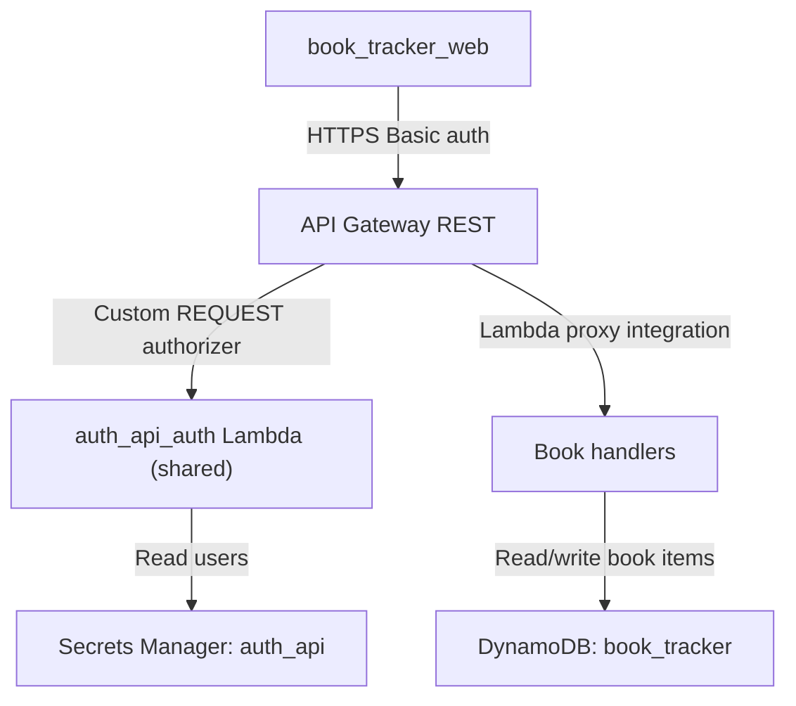

# Book tracker API

The book tracker API service provides an authenticated HTTP API for recording finished books per user, keyed by Open Library work identifiers, and returning a rolling 12-month reading count alongside the user's timeline.

## Overview

- **Service type**: backend API (`book_tracker_api`)
- **Interface**: REST over HTTPS (API Gateway REST + Lambda proxy integration)
- **Runtime**: AWS Lambda (Java 21)
- **Primary storage**: DynamoDB single-table (`book_tracker`) with one GSI (`gsi1`) for date-descending list queries
- **Auth model**: API Gateway custom REQUEST authorizer provided by the shared `auth_api` service (see `auth_api/README.md`)
- **Primary consumer**: `book_tracker_web`

## User stories

- As a reader, I want to record a finished book with a chosen finished date, so that my reading history is captured.
- As a reader, I want to see my books grouped by the month I finished them, so that I can visualize my reading pace.
- As a reader, I want a rolling 12-month total, so that I can see how much I have read recently without waiting for a calendar year boundary.
- As a user who mis-entered a book, I want to edit the finished date or delete the entry, so that my history stays accurate.
- As an API client, I want deterministic duplicate-add rejection, so that the same book cannot appear twice in a library.

## Features and scope boundaries

### In scope

- Authenticate every non-`OPTIONS` endpoint via HTTP Basic credentials validated by the shared `auth_api` authorizer.
- Create one finished-book entry per Open Library work per authenticated user.
- Reject duplicate adds with `409` and a body referencing the existing entry's `finished_date`.
- List a user's finished books ordered by `finished_date` descending, with a server-computed `rolling_12_month_count`.
- Fetch one finished-book entry by Open Library work ID.
- Update the `finished_date` on one entry (the only mutable field in v1).
- Delete one entry.
- Persist Open Library metadata as frozen snapshots captured at add time.
- Persist the full cover URL submitted by the client at add time; the backend stores and returns it verbatim with no URL construction of its own.

### Out of scope

- Calling Open Library from the backend; all external-metadata calls are made by the browser in v1.
- Manual entry of books not found in Open Library.
- Re-read tracking, currently-reading / want-to-read / did-not-finish states.
- Ratings, notes, reviews, tags, genres, format.
- Analytics beyond the rolling 12-month count.
- Editing Open Library-sourced metadata (title, author, cover, page count, publication year).
- Self-service signup or multi-user administration endpoints.

## Architecture



### Primary workflow

```mermaid
sequenceDiagram
  participant Web as book_tracker_web
  participant Gateway as API Gateway
  participant Auth as auth_api authorizer
  participant Create as CreateBookHandler
  participant Find as FindBooksHandler
  participant Dynamo as DynamoDB

  Web->>Gateway: POST /books (Basic auth)
  Gateway->>Auth: validate authorization
  Auth-->>Gateway: allow
  Gateway->>Create: invoke handler
  Create->>Dynamo: conditional put on (pk, sk)
  alt already present
    Dynamo-->>Create: ConditionalCheckFailed
    Create->>Dynamo: get existing item
    Create-->>Gateway: 409 already added on <date>
  else new
    Dynamo-->>Create: ok
    Create-->>Gateway: 201 created book
  end
  Web->>Gateway: GET /books (Basic auth)
  Gateway->>Find: invoke handler
  Find->>Dynamo: query gsi1 (user partition) scanIndexForward=false
  Dynamo-->>Find: items ordered by finished_date desc
  Find-->>Gateway: books + rolling_12_month_count
```

## Main technical decisions

- Use API Gateway + Lambda to stay consistent with other API services in this repository and keep infrastructure lightweight.
- Partition all items by authenticated user so the service is multi-user-ready without data migration.
- Encode the Open Library work ID directly into the sort key (`sk = BOOK#<open_library_work_id>`) so duplicate adds become a conditional-put failure instead of a read-then-write race.
- Maintain a single GSI `gsi1` with `gsi1sk = FINISHED#<YYYY-MM-DD>#BOOK#<open_library_work_id>` so timeline reads do not need in-memory sorting.
- Rewrite `gsi1sk` on `finished_date` updates so ordering is always consistent with the persisted date.
- Compute `rolling_12_month_count` at read time using the injected `Clock` so integration tests can pin the boundary deterministically.
- Persist `cover_url` as-is at add time rather than storing a cover identifier and constructing the URL on every response. This keeps the backend free of Open Library-specific formatting and extends the "metadata frozen at add time" property to the cover URL.
- Do not call Open Library from the backend in v1; the browser captures metadata at search time and submits it verbatim, matching the product requirement that metadata is frozen at add time.

## Domain glossary

- **Open Library work ID**: Open Library's stable identifier for an abstract book across editions (e.g. `OL27448W`). Used as the canonical per-book identity.
- **Book entry**: one persisted record for a finished book belonging to one authenticated user.
- **Finished date**: the `YYYY-MM-DD` date the user marks the book as finished; user-chosen and editable.
- **Rolling 12-month count**: number of book entries whose `finished_date` falls within `[today - 365 days, today]` inclusive, using the authoritative server clock at read time.
- **Cover URL**: the full image URL captured by the browser at add time (typically of the form `https://covers.openlibrary.org/b/id/<cover_i>-L.jpg`) and persisted verbatim, or `null` when no cover is available.

## Integration contracts

### External systems

- **None in current scope**: `book_tracker_api` does not call third-party APIs or webhooks. All Open Library lookups happen in the browser via `book_tracker_web`. If a backend Open Library proxy is introduced later, document it here with required request fields, auth method, cadence, and failure behavior.

## API contracts

### Conventions

- Base URL: `https://api.book-tracker.jordansimsmith.com`
- Auth: `Authorization: Basic <base64(user:password)>`
- Request and response JSON fields use `snake_case`.
- No version segment in path.
- Non-2xx response shape:

```json
{
  "message": "error details"
}
```

- CORS: allowed origin `https://book-tracker.jordansimsmith.com`; methods `GET,POST,PUT,DELETE,OPTIONS`; headers `Authorization,Content-Type`.

### Endpoint summary

| Method   | Path                            | Purpose                                                                 |
| -------- | ------------------------------- | ----------------------------------------------------------------------- |
| `POST`   | `/books`                        | create one book entry                                                   |
| `GET`    | `/books`                        | list books ordered by `finished_date` desc and a rolling 12-month count |
| `GET`    | `/books/{open_library_work_id}` | fetch one book entry                                                    |
| `PUT`    | `/books/{open_library_work_id}` | update the `finished_date` on one book entry                            |
| `DELETE` | `/books/{open_library_work_id}` | delete one book entry                                                   |

### Shared book object

```json
{
  "open_library_work_id": "OL27448W",
  "title": "The Lord of the Rings",
  "authors": ["J.R.R. Tolkien"],
  "cover_url": "https://covers.openlibrary.org/b/id/14625765-L.jpg",
  "page_count": 1193,
  "publication_year": 1954,
  "finished_date": "2026-05-04",
  "created_at": 1714809600,
  "updated_at": 1714809600
}
```

- `cover_url`, `page_count`, and `publication_year` are nullable.
- `authors` is always an array; an empty array is valid.
- `created_at` and `updated_at` are epoch seconds in UTC.

### Example request and response

`POST /books`

Request:

```json
{
  "open_library_work_id": "OL27448W",
  "title": "The Lord of the Rings",
  "authors": ["J.R.R. Tolkien"],
  "cover_url": "https://covers.openlibrary.org/b/id/14625765-L.jpg",
  "page_count": 1193,
  "publication_year": 1954,
  "finished_date": "2026-05-04"
}
```

Response `201`:

```json
{
  "book": {
    "open_library_work_id": "OL27448W",
    "title": "The Lord of the Rings",
    "authors": ["J.R.R. Tolkien"],
    "cover_url": "https://covers.openlibrary.org/b/id/14625765-L.jpg",
    "page_count": 1193,
    "publication_year": 1954,
    "finished_date": "2026-05-04",
    "created_at": 1714809600,
    "updated_at": 1714809600
  }
}
```

Representative key failures:

- `400`: validation error (`{"message":"open_library_work_id is required"}`, `{"message":"finished_date must be YYYY-MM-DD"}`, etc.)
- `409`: duplicate work for the authenticated user (`{"message":"already added on 2026-04-12"}`).
- `401`: unauthorized at API Gateway with `WWW-Authenticate: Basic`.

`GET /books` response `200`:

```json
{
  "books": [
    {
      "open_library_work_id": "OL27448W",
      "title": "The Lord of the Rings",
      "authors": ["J.R.R. Tolkien"],
      "cover_url": "https://covers.openlibrary.org/b/id/14625765-L.jpg",
      "page_count": 1193,
      "publication_year": 1954,
      "finished_date": "2026-05-04",
      "created_at": 1714809600,
      "updated_at": 1714809600
    }
  ],
  "rolling_12_month_count": 17
}
```

`PUT /books/{open_library_work_id}`

Request body:

```json
{
  "finished_date": "2026-04-15"
}
```

Response `200`: the full updated book object under `{"book": {...}}`.

`DELETE /books/{open_library_work_id}`

Response `204` (no body). `404` with `{"message":"Not Found"}` when the work does not exist in the user's library.

### Validation rules

- `open_library_work_id`: required; matches `^OL[0-9]+W$`.
- `title`: required; non-blank.
- `authors`: optional array of strings; missing or `null` normalizes to `[]`.
- `cover_url`: optional non-blank string (typically an `https://covers.openlibrary.org/...` URL) or `null`.
- `page_count`: optional positive integer or `null`.
- `publication_year`: optional integer in `[0, current_year + 5]` or `null`.
- `finished_date`: required; parseable as `YYYY-MM-DD`. No future-date upper bound in v1.

## Data and storage contracts

### DynamoDB model

- **Table name**: `book_tracker`
- **Billing**: `PAY_PER_REQUEST`
- **Primary key**:
  - `pk`: `USER#<user>`
  - `sk`: `BOOK#<open_library_work_id>`
- **Global secondary index `gsi1`**:
  - `gsi1pk`: `USER#<user>`
  - `gsi1sk`: `FINISHED#<YYYY-MM-DD>#BOOK#<open_library_work_id>`
  - Projection: `ALL`
  - Query pattern: `scanIndexForward = false` for descending `finished_date`
- **Point-in-time recovery**: enabled
- **Deletion protection**: enabled

Item attributes:

| Attribute              | Type   | Notes                                                          |
| ---------------------- | ------ | -------------------------------------------------------------- |
| `pk`                   | string | `USER#<user>`                                                  |
| `sk`                   | string | `BOOK#<open_library_work_id>`                                  |
| `gsi1pk`               | string | `USER#<user>`                                                  |
| `gsi1sk`               | string | `FINISHED#<YYYY-MM-DD>#BOOK#<open_library_work_id>`            |
| `user`                 | string | authenticated user name                                        |
| `open_library_work_id` | string | Open Library OLID suffix (e.g. `OL27448W`)                     |
| `title`                | string | frozen at add time                                             |
| `authors`              | list   | frozen at add time; empty list valid                           |
| `cover_url`            | string | nullable; full URL persisted verbatim from add-time submission |
| `page_count`           | number | nullable; Open Library `number_of_pages_median`                |
| `publication_year`     | number | nullable; Open Library `first_publish_year`                    |
| `finished_date`        | string | `YYYY-MM-DD`                                                   |
| `created_at`           | number | epoch seconds                                                  |
| `updated_at`           | number | epoch seconds                                                  |

### Representative record

```json
{
  "pk": "USER#alice",
  "sk": "BOOK#OL27448W",
  "gsi1pk": "USER#alice",
  "gsi1sk": "FINISHED#2026-05-04#BOOK#OL27448W",
  "user": "alice",
  "open_library_work_id": "OL27448W",
  "title": "The Lord of the Rings",
  "authors": ["J.R.R. Tolkien"],
  "cover_url": "https://covers.openlibrary.org/b/id/14625765-L.jpg",
  "page_count": 1193,
  "publication_year": 1954,
  "finished_date": "2026-05-04",
  "created_at": 1714809600,
  "updated_at": 1714809600
}
```

### Access patterns

| Access pattern                    | Operation                                                                       |
| --------------------------------- | ------------------------------------------------------------------------------- |
| add book (reject duplicate)       | `PutItem` with `attribute_not_exists(pk) AND attribute_not_exists(sk)`          |
| list books for user, newest first | `Query gsi1` with `pk = USER#<user>`, `scanIndexForward = false`                |
| get single book                   | `GetItem pk=USER#<user>, sk=BOOK#<open_library_work_id>`                        |
| update `finished_date`            | `PutItem` or `UpdateItem` rewriting `finished_date`, `gsi1sk`, and `updated_at` |
| delete                            | `DeleteItem pk=USER#<user>, sk=BOOK#<open_library_work_id>`                     |

## Behavioral invariants and time semantics

- User identity on reads and writes is derived from the validated Basic auth username on the incoming request.
- `finished_date` is stored as a day-level `YYYY-MM-DD` string with no timezone component.
- `created_at` and `updated_at` are epoch seconds in UTC; `created_at` is preserved on update and `updated_at` is replaced.
- A given `open_library_work_id` appears at most once per user; duplicate adds are rejected via conditional put and surface the existing entry's `finished_date`.
- Editing `finished_date` rewrites both the attribute and the `gsi1sk` on the same item so `GET /books` ordering remains correct.
- `PUT /books/{open_library_work_id}` ignores any body fields other than `finished_date` in v1.
- `GET /books` returns books sorted by `finished_date` descending, with `open_library_work_id` as a deterministic tiebreaker from the GSI sort key.
- `rolling_12_month_count` counts books whose `finished_date` is within `[today - 365 days, today]` inclusive, where `today` is the UTC date from the injected `Clock` at request time.

## Source of truth

| Entity                 | Authoritative source                                    | Notes                                                                        |
| ---------------------- | ------------------------------------------------------- | ---------------------------------------------------------------------------- |
| User identity          | Basic auth username                                     | parsed from `Authorization` header in authorizer and handler request context |
| Finished-book entries  | DynamoDB `BOOK#<open_library_work_id>` items            | client values are accepted only after server validation                      |
| Open Library metadata  | browser capture at add time, persisted by API           | frozen snapshot; backend does not re-fetch Open Library in v1                |
| Rolling 12-month count | derived at read time from persisted entries             | never materialized; uses server clock                                        |
| Cover URL              | browser-constructed at add time, persisted verbatim     | backend does not re-derive or re-format; `null` when no cover was available  |
| Credential set         | Secrets Manager `auth_api` secret (owned by `auth_api`) | no credential material in code or Terraform state                            |

## Security and privacy

- All non-`OPTIONS` methods use API Gateway `CUSTOM` authorization routed to the shared `auth_api` authorizer Lambda.
- Unauthorized requests return `401` with `WWW-Authenticate: Basic`.
- Per-user partitioning (`pk = USER#<user>`) prevents cross-user reads and writes.
- Credentials live in the shared `auth_api` Secrets Manager secret owned by the `auth_api` service, not in source or Terraform state.
- Transport is HTTPS only via the custom domain `api.book-tracker.jordansimsmith.com`.
- Handler logs must not include the `Authorization` header, raw password values, or secret payloads.

## Configuration and secrets reference

### Environment variables

No service-specific environment variables are consumed by handlers in current scope.

| Name     | Required | Purpose                                                                   | Default behavior                                |
| -------- | -------- | ------------------------------------------------------------------------- | ----------------------------------------------- |
| `(none)` | n/a      | behavior is configured via code constants and Terraform-managed resources | table name and CORS origin come from code/infra |

### Secret shape

This service reads no secrets at runtime. Basic auth credentials live in the shared `auth_api` secret owned by the `auth_api` service (see `auth_api/README.md`).

## Performance envelope

- Lambda handlers run with `512 MB` memory, `10` second timeout, `x86_64` architecture.
- DynamoDB uses `PAY_PER_REQUEST` with one GSI for list queries.
- Designed for personal workload scale: fewer than a few thousand book entries per user, low read/write concurrency.
- `GET /books` cost scales linearly with total books for the authenticated user because the handler paginates the GSI query and counts the rolling window in memory.
- No formal latency SLO is defined in current scope; always-free-tier envelopes are the target.

## Testing and quality gates

- Unit tests cover `BookValidator` (every validation rule) and the cover-URL construction helper. Authorizer logic (Basic header parsing, users-array matching, allow/deny policy output) is covered by `auth_api`'s `AuthHandlerTest`.
- Integration tests run each handler against DynamoDB Testcontainers, covering happy paths, validation failures, duplicate-add `409`, `finished_date` edit with `gsi1sk` rewrite, `404` on missing items, and the rolling 12-month boundary against a pinned `Clock`.
- End-to-end tests drive `POST` → `GET` list → `GET` one → `PUT` → `GET` → `DELETE` → verify-gone through a LocalStack stack (API Gateway + Lambda + DynamoDB).
- Required checks before merge:
  - `bazel build //book_tracker_api:all`
  - `bazel test //book_tracker_api:all`
- Repository-level post-change checks:
  - `bazel mod tidy`
  - `bazel run //:format`

## Local development and smoke checks

- Run the full service test suite: `bazel test //book_tracker_api:all`
- Run focused suites:
  - `bazel test //book_tracker_api:unit-tests`
  - `bazel test //book_tracker_api:integration-tests`
  - `bazel test //book_tracker_api:e2e-tests`
- Minimal smoke flow (LocalStack):
  1. `POST /books` with a valid authenticated payload returns `201` and a complete book object.
  2. `POST /books` again with the same `open_library_work_id` returns `409` and the original `finished_date`.
  3. `GET /books` returns the entry and `rolling_12_month_count = 1`.
  4. `PUT /books/{open_library_work_id}` changes `finished_date` and a follow-up `GET /books` reflects the new month order and updated `updated_at`.
  5. `DELETE /books/{open_library_work_id}` returns `204` and a follow-up `GET /books/{open_library_work_id}` returns `404`.

## End-to-end scenarios

### Scenario 1: record a finished book

1. User picks a search result in `book_tracker_web` and confirms a finished date.
2. Client sends authenticated `POST /books` with captured Open Library metadata and `finished_date`.
3. API validates the payload, performs a conditional `PutItem`, and returns `201` with the canonical book object.
4. Client refreshes `GET /books`, which now includes the new entry at the top of the timeline with an updated `rolling_12_month_count`.

### Scenario 2: correct a finished date

1. User opens the entry in the web client and changes the finished date to a prior month.
2. Client sends `PUT /books/{open_library_work_id}` with the new `finished_date`.
3. API rewrites `finished_date`, `gsi1sk`, and `updated_at` on the existing item.
4. Client calls `GET /books` and the entry now appears under the correct month heading; `rolling_12_month_count` reflects the moved entry.

### Scenario 3: reject a duplicate

1. User searches for a book already in the library and attempts to add it again.
2. Client sends `POST /books` with the same `open_library_work_id`.
3. API's conditional `PutItem` fails; handler loads the existing record and returns `409` with `{"message":"already added on <finished_date>"}`.
4. Client surfaces the message without disturbing existing state.
