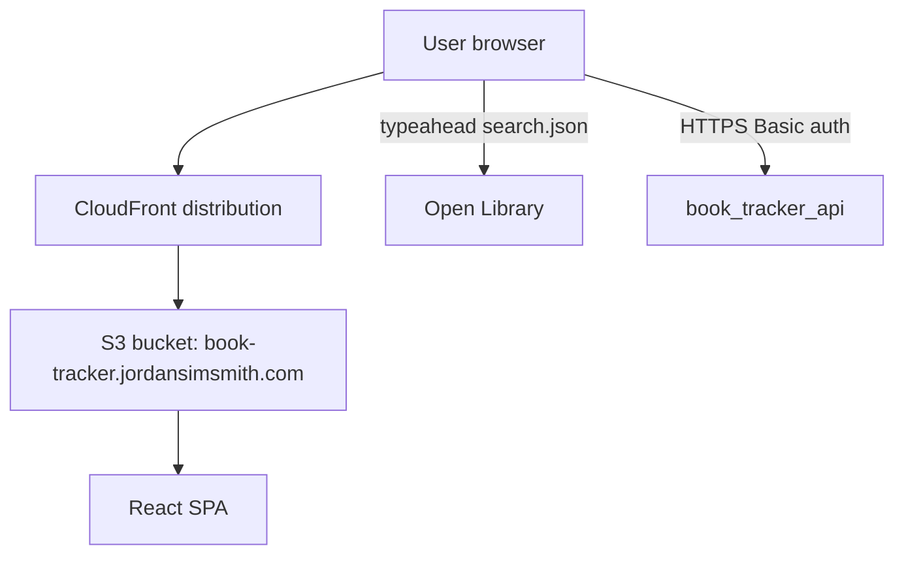
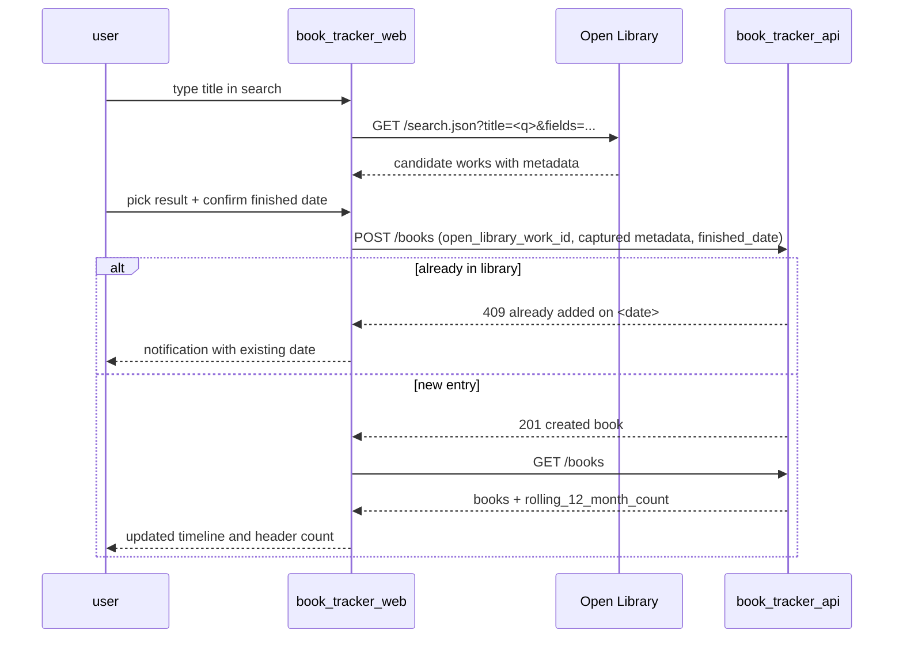

# Book tracker web

The book tracker web service is a responsive single-page app that lets an authenticated user search Open Library, record finished books with a chosen finished date, and review a month-grouped reading timeline with a rolling 12-month count.

## Overview

- **Service type**: web client (`book_tracker_web`)
- **Interface**: browser SPA served via CloudFront and S3
- **Frontend stack**: React + TypeScript + Vite + Mantine, React Router
- **Primary backend**: `book_tracker_api`
- **External data source**: Open Library (browser-direct calls for typeahead search)
- **Primary user**: single-user personal reading-tracking workflow

## User stories

- As a reader, I want to log in and see all my finished books grouped by the month I finished them, so that my reading history is immediately visible.
- As a reader, I want to search Open Library by title and pick a result with cover and author, so that adding a book is quick and unambiguous.
- As a reader, I want to backfill books I finished in the past, so that my full reading history is represented.
- As a reader, I want to correct or remove an entry I logged by mistake, so that my history stays accurate.
- As a returning user, I want my session to persist between visits, so that I do not have to log in on every load.

## Features and scope boundaries

### In scope

- Authenticate with username and password; validate credentials against `book_tracker_api` and persist a Basic auth token in `localStorage`.
- Protect authenticated routes (`/books`, `/books/add`) and redirect unauthenticated users to `/`.
- Search Open Library by title with a debounced typeahead, render title/author/cover, and stage a result for confirmation.
- Confirm an add with a date picker (defaults to today, supports backfilling any past date) and send `POST /books` with the captured metadata.
- Render finished books grouped by " " sections in descending order.
- Render the server-computed rolling 12-month count prominently in the application header.
- Edit an entry's `finished_date` via a modal.
- Delete an entry with an explicit confirmation dialog.
- Provide a responsive layout that works on both mobile and desktop widths.
- Use a swappable API client so development mode runs against an in-memory fake without backend or network dependency.

### Out of scope

- Multi-user collaboration, shared libraries, or role-based access controls.
- Offline / PWA behavior, conflict resolution, or local-first persistence of book entries.
- Manual entry of books not found in Open Library.
- Editing Open Library-sourced metadata (title, author, cover, page count, publication year).
- Reminder scheduling, push notifications, or calendar integration.
- Analytics beyond the rolling 12-month count.

## Architecture

### Primary workflow

## Main technical decisions

- Use React + TypeScript + Mantine + Vite to stay consistent with existing web services and inherit their Bazel and testing conventions.
- Use a typed `ApiClient` interface with swappable implementations (`http-client.ts` in production, `fake-client.ts` in development) so UI work can iterate without a running backend.
- Mirror the same pattern for Open Library (`OpenLibraryClient` interface with `open-library-http-client.ts` + `open-library-fake-client.ts`) so local development stays offline and deterministic.
- Call Open Library directly from the browser rather than proxying through the backend, based on the product decision that captured metadata is frozen at add time. This avoids an extra backend hop per keystroke and removes the need for a backend integration in v1. If CORS support from Open Library ever proves unreliable, the fallback is a backend `GET /books/search` proxy.
- Store the Basic auth session token in `localStorage` so sessions survive browser restarts; clear it on explicit logout.
- Treat backend responses as canonical for both the timeline and the rolling 12-month count; the frontend does not recompute the metric client-side.
- Keep UI state in React component state and Mantine forms rather than introducing a global server-state cache library.

## Domain glossary

- **Book entry**: one persisted record for a finished book belonging to the authenticated user.
- **Open Library work ID**: Open Library's stable identifier for an abstract book across editions (e.g. `OL27448W`); used in URL path params and as the canonical identity across the API.
- **Finished date**: the `YYYY-MM-DD` date the user marks the book as finished; user-chosen, editable, backfillable.
- **Rolling 12-month count**: the server-computed number of finished books within the last 365 days, displayed in the application header.
- **Cover URL**: the full image URL captured and constructed in the browser at add time, persisted verbatim by the backend, and returned unchanged in API responses; a text-only card is rendered when the URL is `null`.

## Integration contracts

### External systems

- **Open Library search API (browser-direct)**: `GET https://openlibrary.org/search.json` is called by the browser during the add flow. Query parameters are `title=<user input>`, `limit=10`, and `fields=key,title,author_name,cover_i,first_publish_year,number_of_pages_median,edition_count`. No authentication is used. Responses populate the search UI; before `POST /books`, the browser constructs the full cover URL from `cover_i` (`https://covers.openlibrary.org/b/id/<cover_i>-L.jpg`) so the backend persists the complete URL verbatim. When `cover_i` is absent, `cover_url` is submitted as `null`. Failures surface as a user-visible error on the add page and do not affect existing timeline data.
- **Open Library covers CDN**: cover images are loaded directly from `https://covers.openlibrary.org/b/id/<cover_i>-L.jpg` URLs. The URL is constructed once in the browser at add time and then returned as-is by `book_tracker_api` on subsequent reads. No additional headers or auth. Missing or broken images fall back to a text-only card.

## API contracts

### Consumed backend endpoints

- `POST /books`
- `GET /books`
- `GET /books/{open_library_work_id}`
- `PUT /books/{open_library_work_id}`
- `DELETE /books/{open_library_work_id}`

### UI contract expectations

- Requests and responses use snake_case field names (for example `open_library_work_id`, `finished_date`, `rolling_12_month_count`).
- Authenticated requests send `Authorization: Basic <token>` from the persisted session token.
- Finished dates are sent and consumed as `YYYY-MM-DD` strings and displayed in month-year sections.
- Non-2xx responses include `{"message":"..."}`; the UI surfaces that message directly, falling back to status text when JSON parsing fails.
- `409` responses from `POST /books` are treated as a normal user-feedback path, not an error to retry; the message (including the existing `finished_date`) is shown in a notification.
- `PUT /books/{open_library_work_id}` accepts only `finished_date` in v1; the UI does not attempt to update other metadata fields.

## Data and storage contracts

### Browser storage

| Location              | Key                 | Purpose                                                                                                 | Retention                  |
| --------------------- | ------------------- | ------------------------------------------------------------------------------------------------------- | -------------------------- |
| `localStorage`        | `book_tracker_auth` | persisted session `{ "username": string, "token": string }` where `token` is base64 `username:password` | until explicit logout      |
| in-memory React state | n/a                 | search typeahead state, modal state, loading/error flags, debounced input values                        | reset on full page refresh |

### Data ownership expectations

- `book_tracker_api` is authoritative for persisted book entries and the rolling 12-month count.
- Open Library is authoritative for search results during typeahead; once a result is selected and persisted, the captured metadata snapshot on `book_tracker_api` takes over as the display source.
- The web client does not persist book records or search results in browser storage between sessions.
- In development mode, fake-client data is in-memory only and resets on browser refresh.

## Behavioral invariants and time semantics

- Search typeahead is debounced at 300 ms or more before calling Open Library; empty queries do not trigger requests.
- Add submission is disabled until a search result is selected and the `finished_date` parses as `YYYY-MM-DD`.
- The `finished_date` picker defaults to the user's local "today" and allows any past date; there is no future-date guard in v1 (validation is the backend's responsibility).
- Timeline grouping uses the `finished_date` year-month as the section heading; sections render in descending order, and entries within a section render in descending `finished_date` with title as a tiebreaker.
- Duplicate-add responses (`409`) are not treated as errors; the UI shows the "already added on `<date>`" message and stays on the add page with current inputs preserved.
- Deleting an entry requires an explicit confirmation dialog.
- The rolling 12-month count is never recomputed in the client; it is taken verbatim from the latest `GET /books` response.

## Source of truth

| Entity                      | Authoritative source                     | Notes                                                              |
| --------------------------- | ---------------------------------------- | ------------------------------------------------------------------ |
| Credential validity         | `book_tracker_api` response              | login is treated as successful after an authenticated `GET /books` |
| Finished-book entries       | `book_tracker_api`                       | list and detail views render API-backed payloads                   |
| Rolling 12-month count      | `book_tracker_api` `GET /books` response | never recomputed in the client                                     |
| Open Library search results | `openlibrary.org/search.json`            | used only to stage the add flow; not persisted locally             |
| Session persistence         | browser `localStorage`                   | cleared on logout via `clearSession()`                             |

## Security and privacy

- Production API calls are HTTPS with `Authorization: Basic` headers.
- Username and password are user-provided at runtime and converted to a Base64 token used only for the `Authorization` header.
- Session data is stored in `localStorage`, never in URL query parameters or fragments.
- Logout immediately removes the stored session and returns the user to `/`.
- Open Library calls are anonymous; no PII leaves our system via that path.
- The web app does not embed backend secrets or infrastructure credentials.
- Error handling surfaces short user-facing messages and does not intentionally expose credential values.

## Configuration and secrets reference

### Environment variables

| Name                         | Required | Purpose                                             | Default behavior                                          |
| ---------------------------- | -------- | --------------------------------------------------- | --------------------------------------------------------- |
| `VITE_API_BASE_URL`          | no       | base URL for `book_tracker_api` HTTP client         | defaults to `https://api.book-tracker.jordansimsmith.com` |
| `VITE_OPEN_LIBRARY_BASE_URL` | no       | origin for browser-direct Open Library search calls | defaults to `https://openlibrary.org`                     |

Build mode behavior: production (`import.meta.env.PROD`) uses the HTTP API client and the HTTP Open Library client. Development uses in-memory fakes for both so the dev server has no backend or network dependency.

### Secrets handling

- No server-managed secret values are bundled into this frontend runtime.
- Basic credentials are entered by the user at login time and encoded client-side only for request headers.
- The persisted session token is removed on logout and cannot be recovered client-side.

## Performance envelope

- Targeted for a single-user workflow with low-to-moderate book volumes; expected typical active libraries are fewer than a few thousand entries.
- Core interactions (loading the timeline, opening the add flow, editing, deleting) are designed to feel immediate in normal browser conditions.
- Search typeahead is debounced to keep Open Library request volume low during fast typing.
- Initial app shell should load within a few seconds on a typical broadband connection; the build is split only as needed by Vite defaults.
- Dependency choices prioritize straightforward rendering and maintainable performance over heavy client-side data frameworks.

## Testing and quality gates

- Unit and component tests run with Vitest and React Testing Library under `jsdom`.
- Key coverage areas:
  - login and route protection
  - timeline rendering (month grouping, empty state, rolling count display, cover fallback)
  - add flow (debounced search against the fake Open Library client, selection, date picker, happy-path submit, `409` duplicate surfacing)
  - edit modal (`finished_date` change re-groups the timeline)
  - delete confirmation (confirm path removes the entry, cancel leaves it)
  - HTTP clients tested against stubbed `fetch` for happy paths and error shapes
- Required checks before merge:
  - `bazel test //book_tracker_web:unit-tests`
  - `bazel build //book_tracker_web:typecheck`
  - `bazel build //book_tracker_web:build`
- Repository-level post-change checks:
  - `bazel mod tidy`
  - `bazel run //:format`

## Local development and smoke checks

- Recommended local development: `cd book_tracker_web && pnpm vite dev`
- Bazel dev server option: `bazel run //book_tracker_web:vite -- dev`
- Development mode uses fake in-memory API data and fake Open Library results by default; no backend or internet dependency is required.
- Basic smoke flow:
  - log in with any non-empty credentials in dev mode
  - open `/books` and verify the timeline renders with seeded fake entries grouped by month
  - open `/books/add`, search, pick a result, choose a past finished date, and confirm the new entry appears in the correct month section
  - repeat the same add to verify the "already added on `<date>`" notification
  - open an existing entry, change its finished date, and verify the section regrouping
  - delete an entry from the edit modal and confirm it disappears from the timeline

## End-to-end scenarios

### Scenario 1: log in and add a finished book

1. User opens `/`, enters credentials, and submits the login form.
2. App writes the session to `localStorage`, validates by calling `GET /books`, and navigates to `/books`.
3. User opens `/books/add`, types a title, and picks a search result from the typeahead.
4. User picks today's date (or backfills a past date) and clicks Add.
5. App sends `POST /books` with the captured metadata and navigates back to `/books`.
6. Timeline re-renders with the new entry in the correct month section; the header rolling count updates from the latest `GET /books` response.

### Scenario 2: correct a mis-dated entry

1. User clicks a book card on `/books` to open the edit modal.
2. User changes the finished date to an earlier month and saves.
3. App sends `PUT /books/{open_library_work_id}` with the new `finished_date`.
4. Modal closes; timeline re-renders with the entry under the new month heading and the rolling count refreshed.

### Scenario 3: remove an entry

1. User opens a book's edit modal and clicks Delete.
2. App shows a confirmation dialog; user confirms.
3. App sends `DELETE /books/{open_library_work_id}`.
4. Modal closes; the entry disappears from the timeline and the rolling count updates from the follow-up `GET /books`.

