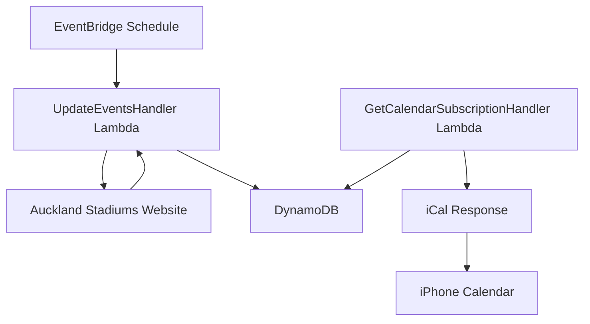

# Event calendar API service

The event calendar API service extracts, processes, and provides structured data about stadium events and game times from the Go Media Stadium (formerly Mt Smart Stadium) in Auckland.

## System architecture

## Requirements and specifications

### Functional requirements

- Extract event information from Go Media Stadium website
- Process both individual event pages and season overview pages
- Capture comprehensive event details including:
  - Event title
  - Event date and time
  - Event URL
  - Event information (box office opening, gate opening, etc.)
- Store extracted data in DynamoDB
- Expose event data through iCal subscription endpoint
- Update event data hourly through scheduled polling
- Support calendar subscription in iPhone and other calendar apps

### Technical specifications

- Lambda execution frequency: Every hour via EventBridge schedule
- DynamoDB table: "event_calendar" with hash key "pk" and range key "sk"
- Point-in-time recovery enabled for data protection
- Deletion protection enabled for the DynamoDB table
- Lambda memory: 1024MB
- Lambda timeout: 30 seconds
- Java 17 runtime for Lambda functions
- API Gateway endpoint with custom domain: api.event-calendar.jordansimsmith.com

## Implementation details

### Technologies

- AWS Lambda for serverless execution
- Amazon EventBridge for scheduled task execution
- DynamoDB for storing structured event data
- AWS API Gateway for exposing the iCal endpoint
- Java 17 runtime environment
- Jsoup library for HTML parsing
- Biweekly library for iCal generation
- AWS Certificate Manager for SSL/TLS
- Custom domain name with API Gateway

### Key components

- `UpdateEventsHandler`: Lambda handler that processes scheduled events to scrape the website
- `GetCalendarSubscriptionHandler`: Lambda handler that serves iCal subscription data
- `JsoupGoMediaEventClient`: Implementation that uses Jsoup to scrape event data
- `EventCalendarItem`: Data model for storing event data in DynamoDB
- `EventCalendarFactory`: Factory for creating the required dependencies

### Configuration

- Lambda execution frequency: Hourly via EventBridge schedule
- DynamoDB table: "event_calendar" with hash key "pk" and range key "sk"
- API Gateway endpoint: GET /calendar
- Custom domain: api.event-calendar.jordansimsmith.com
- Time zone: Pacific/Auckland
