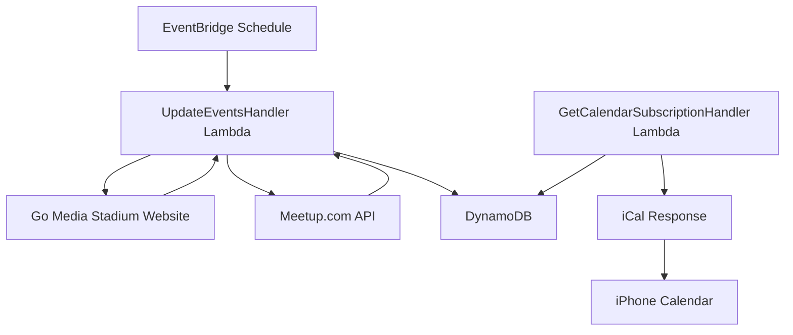

# Event calendar service

The event calendar service extracts, processes, and provides structured data about events from multiple sources including Go Media Stadium and meetup.com groups.

## System architecture



## Requirements

### Functional requirements

- Extract event information from Go Media Stadium website
- Extract event information from meetup.com groups via GraphQL API
- Track both upcoming and past events from configured meetup groups
- Process both individual event pages and season overview pages
- Capture comprehensive event details including:
  - Event title
  - Event date and time
  - Event URL
  - Event information (box office opening, gate opening, etc.)
  - Event location (for meetup events)
- Store extracted data in DynamoDB
- Expose event data through iCal subscription endpoint
- Update event data every 15 minutes through scheduled polling
- Support calendar subscription in iPhone and other calendar apps

### Technical specifications

- Performance: System updates event data every 15 minutes automatically
- Reliability: Event data is persistently stored and consistently available
- Availability: Calendar subscription endpoint accessible 24/7

## Implementation details

### Technologies

- AWS Lambda for serverless execution
- Amazon EventBridge for scheduled task execution
- DynamoDB for storing structured event data
- AWS API Gateway for exposing the iCal endpoint
- Java 21 runtime environment
- Jsoup library for HTML parsing
- Java HTTP Client for REST API calls
- Jackson library for JSON processing
- Biweekly library for iCal generation
- AWS Certificate Manager for SSL/TLS
- Custom domain name with API Gateway

### Key components

- `UpdateEventsHandler`: Lambda handler that processes scheduled events to scrape the website
- `GetCalendarSubscriptionHandler`: Lambda handler that serves iCal subscription data
- `JsoupGoMediaEventClient`: Implementation that uses Jsoup to scrape event data
- `MeetupClient`: Interface for fetching events from meetup.com
- `HttpMeetupClient`: Implementation using HTTP client and JSON parsing
- `EventCalendarItem`: Data model for storing event data in DynamoDB
- `EventCalendarFactory`: Factory for creating the required dependencies

### Configuration

- Lambda execution frequency: Every 15 minutes via EventBridge schedule
- DynamoDB table: "event_calendar" with hash key "pk" and range key "sk"
- API Gateway endpoint: GET /calendar
- Custom domain: api.event-calendar.jordansimsmith.com
- Time zone: Pacific/Auckland
- Lambda memory: 1024MB, timeout: 30 seconds
- Java 21 runtime for Lambda functions

### Meetup.com integration

The service fetches events from configured meetup.com groups using their GraphQL API. The integration makes two API calls per group to retrieve both upcoming and past events.

**Configured groups:**

- auckland-japanese-english-exchange-enkai-縁会 (Japanese/English Exchange ENKAI)

**API Details:**

- Endpoint: `https://www.meetup.com/gql2`
- Method: HTTP POST with JSON body
- Uses Apollo persisted queries (query hashes required)
- No authentication required for public events

**Request format for upcoming events:**

```json
{
  "operationName": "getUpcomingGroupEvents",
  "variables": {
    "urlname": "GROUP_URLNAME",
    "afterDateTime": "2025-10-25T05:09:23.000Z"
  },
  "extensions": {
    "persistedQuery": {
      "version": 1,
      "sha256Hash": "55bced4dca11114ce83c003609158f19b3ca289939c2e6c0b39ce728722756f4"
    }
  }
}
```

**Request format for past events:**

```json
{
  "operationName": "getPastGroupEvents",
  "variables": {
    "urlname": "GROUP_URLNAME",
    "beforeDateTime": "2025-10-25T05:07:29.933Z"
  },
  "extensions": {
    "persistedQuery": {
      "version": 1,
      "sha256Hash": "84d621b514d4bfad36d9b37d78f469ee558b01ebe97ba9fb9183fe958b2ad1f1"
    }
  }
}
```

**Response format:**
Both operations return events at `.data.groupByUrlname.events.edges[].node` with fields:

- `id`: Event identifier
- `title`: Event name
- `eventUrl`: Link to event page
- `dateTime`: Start time (ISO 8601 with timezone)
- `venue`: Location details (name, address, city) - may be null for future events
- `status`: "ACTIVE", "PAST", or "CANCELLED"

### DynamoDB item examples

Event data is persisted in the `event_calendar` table with snake_case attribute names. Below are sample JSON items for each supported source:

**Go Media Stadium event**

```json
{
  "pk": "STADIUM#https://www.aucklandstadiums.co.nz/our-venues/go-media-stadium",
  "sk": "EVENT#https://www.aucklandstadiums.co.nz/event/warriors-storm",
  "title": "Warriors vs Storm",
  "event_url": "https://www.aucklandstadiums.co.nz/event/warriors-storm",
  "event_info": "Box office opens at 17:30, gates open at 18:30",
  "timestamp": 1711414200,
  "stadium_url": "https://www.aucklandstadiums.co.nz/our-venues/go-media-stadium"
}
```

**Meetup.com event**

```json
{
  "pk": "MEETUP_GROUP#https://www.meetup.com/auckland-japanese-english-exchange-enkai-縁会",
  "sk": "EVENT#https://www.meetup.com/auckland-japanese-english-exchange-enkai-縁会/events/123456789/",
  "title": "Japanese/English Exchange ENKAI",
  "event_url": "https://www.meetup.com/auckland-japanese-english-exchange-enkai-縁会/events/123456789/",
  "timestamp": 1769079600,
  "meetup_group_url": "https://www.meetup.com/auckland-japanese-english-exchange-enkai-縁会",
  "location": "The Occidental, 6 Vulcan Lane, Auckland"
}
```
