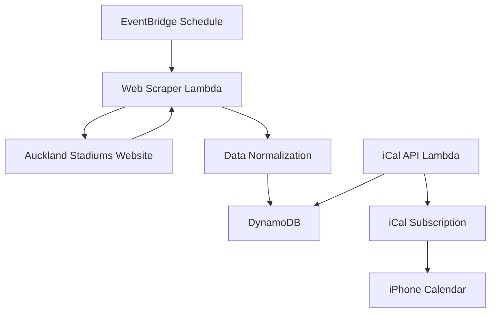

# Event calendar API service

The event calendar API service extracts, processes, and provides structured data about stadium events and game times from the Auckland Stadiums website.

## System architecture

## Requirements and specifications

### Functional requirements

- Extract event information from Auckland Stadiums website
- Process both individual event pages and season overview pages
- Capture comprehensive event details including:
  - Event title
  - Event date
  - Kickoff time
  - Venue
  - Detailed timing information (box office opening, gate opening)
- Normalize dates to ISO format (YYYY-MM-DD)
- Normalize times to 24-hour format
- Remove prefix text from venue names
- Store extracted data in a structured format
- Expose data through a consistent API
- Avoid duplicate processing of event pages
- Implement rate limiting through appropriate delays between requests
- Provide detailed logging of the extraction process
- Provide calendar data in iCal format for subscription in iPhone calendar
- Regularly update event data through scheduled polling

### Technical specifications

- Complete extraction process within 2 minutes
- Process all event types (sports matches, concerts, special events)
- Handle season overview pages containing multiple event listings
- Extract event information from both main venue page and individual event pages
- Provide data normalization for consistent formatting
- Support incremental updates of event information
- Implement proper error handling for network failures or HTML structure changes
- Ensure the system is maintainable and extensible for future venue additions
- Poll the Auckland Stadiums website at regular intervals via EventBridge schedule
- Persist structured event data in DynamoDB
- Expose iCal subscription endpoint for seamless calendar integration

## Implementation details

### Technologies

- AWS Lambda for serverless execution
- Java runtime environment for Lambda functions
- Amazon EventBridge for scheduled task execution
- DynamoDB for storing structured event data
- AWS API Gateway for exposing the iCal endpoint
- Jsoup library for HTML parsing
- Amazon SNS for optional notification delivery

### Key components

- `UpdateEventsHandler`: Lambda handler that processes scheduled events to scrape the website
- `GoMediaEventClient`: Client interface for retrieving event data
- `JsoupGoMediaEventClient`: Implementation that uses Jsoup to scrape event data
- `Event`: Data model for storing event data in DynamoDB
- `EventCalendarFactory`: Factory for creating the required dependencies
- `GetSubscriptionHandler`: Lambda handler that serves iCal subscription data

### Configuration

- Lambda execution frequency: Hourly via EventBridge schedule
- DynamoDB table: "event_calendar" with hash key "pk" and range key "sk"
- API Gateway endpoint for iCal subscription
