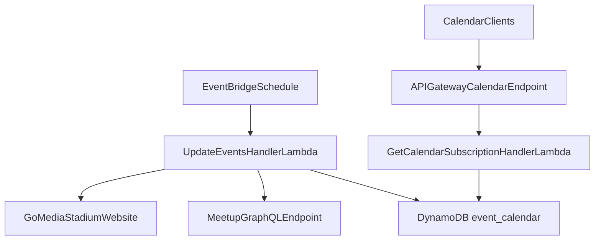
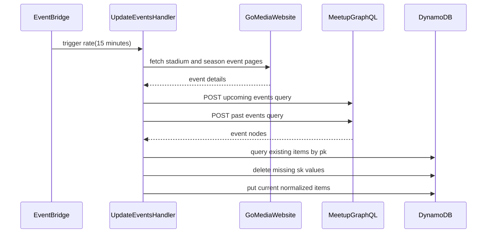

# Event calendar API

The event calendar API ingests public event data from Go Media Stadium and Meetup, stores normalized records in DynamoDB, and serves a subscription-ready iCal feed.

## Overview

- **Service type**: backend API (`event_calendar_api`)
- **Interface**: scheduled ingestion + REST over HTTPS (`GET /calendar`)
- **Runtime**: AWS Lambda (Java 21) behind API Gateway and EventBridge
- **Primary storage**: DynamoDB table `event_calendar`
- **Primary consumers**: public calendar clients (for example Apple Calendar and Google Calendar)

## Features and scope boundaries

### In scope

- Poll Go Media Stadium pages and configured Meetup groups every 15 minutes.
- Normalize source data into a single DynamoDB schema with deterministic `pk` and `sk` prefixes.
- Persist current events and delete stale events no longer returned by a source.
- Serve a single iCal subscription endpoint at `GET /calendar`.
- Include source-specific fields (`event_info` for stadium events, `location` for Meetup events).

### Out of scope

- Per-user, authenticated, or private calendar feeds.
- Manual event curation workflows in this service.
- Dynamic runtime configuration for Meetup groups or table naming.
- Push/webhook delivery of event updates.

## Architecture



### Primary workflow



## Main technical decisions

- Use pull-based scheduled ingestion instead of push integration because upstream sources do not provide stable webhook contracts in this service.
- Store source events in one DynamoDB table using `STADIUM#...` and `MEETUP_GROUP#...` partition prefixes so update and read paths can query each source partition directly.
- Keep Meetup group configuration in code (`MeetupsFactoryImpl`) to keep runtime dependencies minimal.
- Generate iCal on demand from DynamoDB instead of storing pre-rendered calendars, so subscribers always receive the latest persisted snapshot.
- Keep `GET /calendar` intentionally unauthenticated to maximize compatibility with calendar subscription clients.

## Domain glossary

- **Source partition**: a logical event source represented by one `pk` value (stadium or meetup group).
- **Event item**: one DynamoDB record with canonical event fields and source-specific metadata.
- **Calendar subscription**: a client polling `GET /calendar` for iCal updates.
- **Stale event**: an existing DynamoDB record whose `sk` is absent from the most recent upstream fetch for its `pk`.

## Integration contracts

### External systems

- **Go Media Stadium website**: outbound HTML fetches against `EVENT_CALENDAR_GOMEDIA_BASE_URL` (default `https://www.aucklandstadiums.co.nz`), then `/our-venues/go-media-stadium`, event pages, and season pages. Required extracted fields are title, event URL, parsed date/time, and event summary details. Authentication is none. Cadence is every scheduled update run (`rate(15 minutes)`). Failures throw and fail the Lambda invocation.
- **Meetup GraphQL API**: outbound `POST` to `EVENT_CALENDAR_MEETUP_BASE_URL` + `/gql2` (default base URL `https://www.meetup.com`). Required request fields are `operationName`, `variables.urlname`, one of `variables.afterDateTime` or `variables.beforeDateTime`, and `extensions.persistedQuery.sha256Hash`. The handler performs two calls per group (upcoming and past events) each run. Authentication is none for public group events. Failures throw and fail the Lambda invocation.

## API contracts

### Conventions

- Base URL: `https://api.event-calendar.jordansimsmith.com`
- Auth: none (`/calendar` is intentionally public for subscription compatibility)
- Response media type: `text/calendar; charset=utf-8`
- Path convention: no API version segment
- Error behavior: the handler does not return a custom error body on exceptions; unhandled errors bubble and result in API Gateway 5xx responses

### Endpoint summary

| Method | Path        | Purpose                                  |
| ------ | ----------- | ---------------------------------------- |
| `GET`  | `/calendar` | return iCal feed generated from DynamoDB |

### Example request and response

Request:

```http
GET /calendar HTTP/1.1
Host: api.event-calendar.jordansimsmith.com
Accept: text/calendar
```

Response `200` (truncated):

```text
BEGIN:VCALENDAR
PRODID:-//jordansimsmith.com//Event Calendar//EN
BEGIN:VEVENT
SUMMARY:Warriors vs Storm
DTSTART:20240325T193000Z
DESCRIPTION:Box office opens at 5:30PM, Gates open at 6:30PM
URL:https://www.aucklandstadiums.co.nz/event/warriors-storm
END:VEVENT
END:VCALENDAR
```

## Data and storage contracts

### DynamoDB model

- **Table name**: `event_calendar`
- **Primary key**:
  - `pk` (partition key, string)
  - `sk` (sort key, string)
- **Item key patterns**:
  - Stadium partition: `pk = STADIUM#<stadium_url>`
  - Meetup partition: `pk = MEETUP_GROUP#<meetup_group_url>`
  - Event item: `sk = EVENT#<event_url>`
- **Common attributes**: `title`, `event_url`, `timestamp`
- **Source-specific attributes**:
  - Stadium: `event_info`, `stadium_url`
  - Meetup: `meetup_group_url`, `location`
- **Indexes**: none in current scope

### Representative records

Stadium event item:

```json
{
  "pk": "STADIUM#https://www.aucklandstadiums.co.nz/our-venues/go-media-stadium",
  "sk": "EVENT#https://www.aucklandstadiums.co.nz/event/warriors-storm",
  "title": "Warriors vs Storm",
  "event_url": "https://www.aucklandstadiums.co.nz/event/warriors-storm",
  "event_info": "Box office opens at 5:30PM, Gates open at 6:30PM",
  "timestamp": 1711395000,
  "stadium_url": "https://www.aucklandstadiums.co.nz/our-venues/go-media-stadium"
}
```

Meetup event item:

```json
{
  "pk": "MEETUP_GROUP#https://www.meetup.com/example-group",
  "sk": "EVENT#https://www.meetup.com/example-group/events/123456789",
  "title": "Japanese English Exchange",
  "event_url": "https://www.meetup.com/example-group/events/123456789",
  "timestamp": 1769032800,
  "meetup_group_url": "https://www.meetup.com/example-group",
  "location": "TBD"
}
```

## Behavioral invariants and time semantics

- `timestamp` is persisted as epoch seconds in UTC.
- Go Media event date/time parsing uses `Pacific/Auckland`; if no valid time is extracted from event info, start time defaults to `00:00`.
- Meetup event start time uses the upstream ISO-8601 `dateTime` parsed as `Instant`.
- `location` is set to `"TBD"` when Meetup venue data is missing.
- During each update run, records are grouped by `pk`; any persisted `sk` not present in current source results for that `pk` is deleted.
- `sk` is derived from `event_url`, so repeated discovery of the same event URL performs deterministic upsert behavior.
- Calendar event ordering is not a stable contract and should not be relied on by clients.

## Source of truth

| Entity                     | Authoritative source                                          | Notes                                     |
| -------------------------- | ------------------------------------------------------------- | ----------------------------------------- |
| Stadium event metadata     | Go Media Stadium pages at ingestion time                      | Scraped into normalized DynamoDB items    |
| Meetup event metadata      | Meetup GraphQL responses at ingestion time                    | Upcoming and past queries merged each run |
| Normalized event snapshot  | DynamoDB `event_calendar` items                               | Used as canonical store for API output    |
| Calendar feed payload      | On-demand iCal generation in `GetCalendarSubscriptionHandler` | Derived from current DynamoDB state       |
| Meetup group configuration | `MeetupsFactoryImpl` in service code                          | Currently hardcoded to two Meetup groups  |

## Security and privacy

- `GET /calendar` is intentionally unauthenticated to support broad calendar subscription compatibility.
- Transport to clients is HTTPS via API Gateway custom domain and ACM certificate.
- Lambda execution uses an IAM role scoped to DynamoDB table access plus basic execution logging permissions.
- The service does not read runtime secrets in current scope.
- Source data is public event metadata; logs should still avoid dumping large upstream payloads or noisy raw responses.

## Configuration and secrets reference

### Environment variables

| Name                              | Required | Purpose                                            | Default behavior                                   |
| --------------------------------- | -------- | -------------------------------------------------- | -------------------------------------------------- |
| `EVENT_CALENDAR_GOMEDIA_BASE_URL` | no       | override Go Media website base URL for event crawl | falls back to `https://www.aucklandstadiums.co.nz` |
| `EVENT_CALENDAR_MEETUP_BASE_URL`  | no       | override Meetup GraphQL API base URL               | falls back to `https://www.meetup.com`             |

### Secret shape

None in current scope.

## Performance envelope

- Ingestion cadence is fixed at `rate(15 minutes)` via EventBridge.
- Lambda runtime settings are `1024 MB` memory, with `30s` timeout for `get_calendar_subscription` and `120s` timeout for `update_events`.
- `GET /calendar` performs one DynamoDB query for the stadium partition plus one query per configured Meetup group.
- `update_events` performs upstream network fetches, then per-partition query/delete/upsert operations in DynamoDB.
- No explicit high-throughput SLO is defined; the service is optimized for low-cardinality public event feeds.

## Testing and quality gates

- Unit tests cover parsing and client behavior (`JsoupGoMediaEventClient`, `HttpMeetupClient`).
- Integration tests cover Lambda handler behavior with DynamoDB test infrastructure.
- E2E tests validate the local containerized flow from update ingestion to calendar response generation using mock Go Media and Meetup hosts on an internal test network, so the suite is CI-safe and does not require outbound internet.
- Pre-merge checks:
  - `bazel build //event_calendar_api:all`
  - `bazel test //event_calendar_api:all`

## Local development and smoke checks

- Run unit and integration tests quickly: `bazel test //event_calendar_api:unit-tests //event_calendar_api:integration-tests`
- Run full service checks (includes e2e): `bazel test //event_calendar_api:all`
- Local smoke expectation:
  - invoke update handler successfully
  - invoke subscription handler successfully
  - verify returned iCal includes `PRODID:-//jordansimsmith.com//Event Calendar//EN` and at least one `VEVENT`

## End-to-end scenarios

### Scenario 1: scheduled ingestion refreshes source events

1. EventBridge triggers `UpdateEventsHandler`.
2. Handler fetches Go Media pages and Meetup upcoming/past events for configured groups.
3. Handler normalizes records into source partitions and queries existing partition items.
4. Handler deletes stale records missing from current source results and upserts current records.

### Scenario 2: calendar client consumes current event feed

1. A calendar app subscribes to `GET /calendar`.
2. API Gateway invokes `GetCalendarSubscriptionHandler`.
3. Handler reads stadium and meetup partitions from DynamoDB and builds iCal `VEVENT` entries.
4. Client receives `text/calendar` output and updates local calendar entries.
