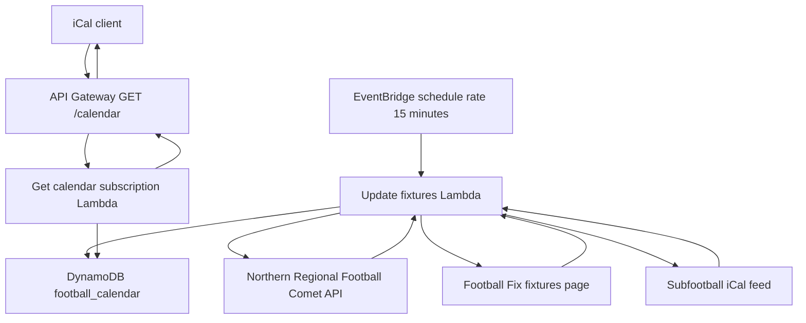
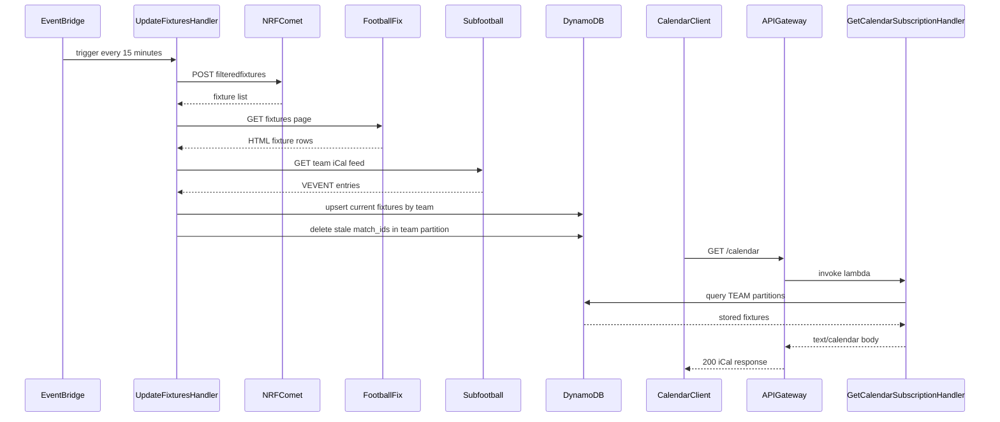

# Football calendar API

The football calendar API aggregates fixtures from multiple football sources, stores them in DynamoDB, and serves a public iCal subscription feed for calendar clients.

## Overview

- **Service type**: backend API (`football_calendar_api`)
- **Interfaces**: scheduled fixture ingestion and public HTTPS iCal endpoint
- **Runtime**: AWS Lambda (Java 21) behind API Gateway
- **Primary storage**: DynamoDB table `football_calendar`
- **Primary consumers**: iPhone Calendar and other iCal-compatible clients

## Features and scope boundaries

### In scope

- Poll configured teams from Northern Regional Football Comet API, Football Fix, and Subfootball every 15 minutes.
- Transform source records into a unified fixture model and persist records in DynamoDB.
- Reconcile fixtures per team partition by upserting current fixtures and deleting stale `match_id` values for teams present in a run.
- Expose `GET /calendar` that returns an aggregated iCal calendar across all configured teams.
- Include optional fixture metadata when available from a source (`status`, `latitude`, `longitude`).

### Out of scope

- Authentication or authorization for `GET /calendar` (endpoint is intentionally public).
- Runtime team management, per-user team configuration, or per-request filtering.
- Manual fixture edits through an API.
- Browser-specific CORS behavior guarantees.

## Architecture



### Primary workflow



## Main technical decisions

- Use Lambda plus API Gateway for consistency with the repo's API services and simple infrastructure.
- Keep team/source configuration in code (`TeamsFactoryImpl`) instead of runtime configuration to keep deployment simple.
- Use DynamoDB keys `pk = TEAM#<team_id>` and `sk = MATCH#<match_id>` for direct per-team reads and deterministic overwrite behavior.
- Fetch all sources before writing so a failed source call fails the run before reconciliation writes start.
- Build iCal on demand from DynamoDB instead of caching generated calendars to keep output aligned with latest persisted fixtures.

## Domain glossary

- **Fixture**: a single match record with teams, kickoff timestamp, and venue metadata.
- **Team id**: canonical configured team label used in DynamoDB partition keys (for example `Flamingos`).
- **Match id**: upstream fixture identifier (`Id`, `data-fixture-id`, or iCal `UID`) used in sort keys.
- **Reconciliation**: per-team diff that deletes persisted fixtures missing from the latest fetched set for that team.
- **Calendar event**: iCal `VEVENT` generated from one persisted fixture.

## Integration contracts

### External systems

- **Northern Regional Football Comet API**: outbound HTTPS `POST` to `https://www.nrf.org.nz/api/1.0/competition/cometwidget/filteredfixtures` with no auth. Required request fields are `competitionId`, `orgIds`, `from`, `to`, `sportId`, and `seasonId`; response fields consumed are `Id`, `HomeTeamNameAbbr`, `AwayTeamNameAbbr`, `Date`, `VenueName`, `Address`, `Latitude`, `Longitude`, and `Status`. Called every scheduled run. Non-200 or parse errors fail the update run.
- **Football Fix**: outbound HTTPS `GET` to `https://footballfix.spawtz.com/Leagues/Fixtures` with query params `SportId`, `VenueId`, `LeagueId`, `SeasonId`, and `DivisionId`, no auth. Required parsed HTML fields are date headers (`tr.FHeader`), fixture rows (`tr.FRow`), time (`td.FDate`), venue (`td.FPlayingArea`), teams (`td.FHomeTeam`, `td.FAwayTeam`), and `data-fixture-id` from `td.FScore nobr`. Called every scheduled run. Network or parse failures fail the update run; rows missing a fixture id are skipped.
- **Subfootball**: outbound HTTPS `GET` to `https://subfootball.com/teams/calendar/{teamId}` with `Accept: text/calendar`, no auth. Required VEVENT fields are `UID`, `SUMMARY`, `DTSTART`, and `LOCATION`; `DESCRIPTION` is optional and used to derive field/venue text. Called every scheduled run. Non-200 or parse errors fail the update run; malformed events are skipped.

## API contracts

### Conventions

- Base URL: `https://api.football-calendar.jordansimsmith.com`
- Auth: none (public endpoint)
- Versioning: no version segment in path
- Content type: `text/calendar; charset=utf-8`
- Request payload: none
- On handler failures, no custom error envelope is defined by this service.

### Endpoint summary

| Method | Path        | Purpose                                               |
| ------ | ----------- | ----------------------------------------------------- |
| `GET`  | `/calendar` | Return aggregated iCal calendar for configured teams. |

### Example request and response

Request:

```http
GET /calendar HTTP/1.1
Host: api.football-calendar.jordansimsmith.com
Accept: text/calendar
```

Response `200`:

```text
BEGIN:VCALENDAR
PRODID:-//jordansimsmith.com//Football Calendar//EN
VERSION:2.0
BEGIN:VEVENT
SUMMARY:Bucklands Beach Bucks M5 vs Ellerslie AFC Flamingoes M
DTSTART:20250405T150000Z
LOCATION:Lloyd Elsmore Park 2, 2 Bells Avenue
DESCRIPTION:Status: CONFIRMED
END:VEVENT
END:VCALENDAR
```

## Data and storage contracts

### DynamoDB model

- **Table name**: `football_calendar`
- **Primary key**:
  - `pk`: `TEAM#<team_id>`
  - `sk`: `MATCH#<match_id>`
- **Stored attributes**:
  - `team`, `match_id`, `home_team`, `away_team`, `timestamp`, `venue`, `address`, `latitude`, `longitude`, `status`
- **Write behavior**:
  - `UpdateFixturesHandler` writes fixtures with `putItem` (upsert by primary key).
  - For teams with fetched fixtures in the current run, existing items with missing `match_id` are deleted.

Representative item:

```json
{
  "pk": "TEAM#Flamingos",
  "sk": "MATCH#2716942185",
  "team": "Flamingos",
  "match_id": "2716942185",
  "home_team": "Bucklands Beach Bucks M5",
  "away_team": "Ellerslie AFC Flamingoes M",
  "timestamp": 1743865200,
  "venue": "Lloyd Elsmore Park 2",
  "address": "2 Bells Avenue",
  "latitude": -36.9053315,
  "longitude": 174.8997797,
  "status": "CONFIRMED"
}
```

### Data ownership expectations

- Upstream source systems own raw fixture facts (`Comet`, `Football Fix`, `Subfootball`).
- `football_calendar` is the service's canonical projected store for calendar serving.
- iCal output is derived from DynamoDB records and is not persisted separately.

## Behavioral invariants and time semantics

- Comet fixture `Date` values are parsed as `ISO_LOCAL_DATE_TIME` in `Pacific/Auckland`.
- Football Fix date and time strings are parsed in `Pacific/Auckland`.
- Subfootball event start times are read from iCal `DTSTART` and converted to `Instant`.
- Persisted `timestamp` values use epoch seconds (UTC instant via `EpochSecondConverter`).
- Comet and Football Fix fixtures are team-filtered using case-insensitive substring matching on home/away names.
- Subfootball fixtures are not name-filtered after fetch; all events from configured team feed ids are stored.
- Event order in `GET /calendar` is not contractually guaranteed.
- Only team partitions represented in the current fetched fixture set are reconciled for stale deletions.

## Source of truth

| Entity             | Authoritative source                 | Notes                                                                |
| ------------------ | ------------------------------------ | -------------------------------------------------------------------- |
| Team configuration | `TeamsFactoryImpl`                   | Hardcoded team ids, matchers, and source parameters in code.         |
| NRF fixtures       | Northern Regional Football Comet API | Pulled every schedule run and projected into DynamoDB.               |
| Football Fix rows  | Football Fix fixtures page           | Parsed from HTML table rows and projected into DynamoDB.             |
| Subfootball events | Subfootball iCal feed                | Parsed from VEVENT entries and projected into DynamoDB.              |
| Calendar feed      | DynamoDB `football_calendar` table   | `GET /calendar` reads persisted fixtures and renders iCal on demand. |

## Security and privacy

- `GET /calendar` is intentionally public (`authorization = NONE` in API Gateway).
- Transport is HTTPS through API Gateway custom domain and ACM certificate.
- Service runtime does not read credential secrets in current scope.
- IAM permissions for lambdas are scoped to DynamoDB operations for `football_calendar` plus basic execution logging.
- Stored data is fixture metadata only; no user account data is modeled by this service.

## Configuration and secrets reference

### Environment variables

No application environment variables are read in current scope.

Current runtime configuration is code and infra defined:

- DynamoDB table name is hardcoded as `football_calendar` in `FootballCalendarModule`.
- Team/source configuration is hardcoded in `TeamsFactoryImpl`.
- Schedule cadence, runtime, memory, timeout, and endpoint wiring are defined in Terraform.

### Secret shape

None in current scope. This service does not read runtime secrets.

## Performance envelope

- Update cadence is fixed at `rate(15 minutes)` via EventBridge schedule.
- Lambda runtime bounds are `java21`, `1024 MB` memory, and `30` second timeout.
- DynamoDB uses `PAY_PER_REQUEST` billing mode with `pk/sk` keyed access.
- No explicit latency or throughput SLOs are defined in current scope.

## Testing and quality gates

- Unit tests validate client parsing and mapping behavior (Comet JSON, Football Fix HTML, Subfootball iCal).
- Integration tests cover update reconciliation and iCal response generation against DynamoDB test containers.
- E2E tests run against LocalStack and invoke both lambdas to verify end-to-end fixture-to-calendar flow.
- Required checks before merge:
  - `bazel test //football_calendar_api:all`
  - `bazel build //football_calendar_api:all`

## Local development and smoke checks

- Run all service tests: `bazel test //football_calendar_api:all`
- Build deployable artifacts: `bazel build //football_calendar_api:all`
- Quick smoke flow:
  1. Run `bazel test //football_calendar_api:e2e-tests`.
  2. Verify the test invokes `update_fixtures_handler` and `get_calendar_subscription_handler`.
  3. Verify parsed iCal output contains `VCALENDAR` and at least one `VEVENT`.

## End-to-end scenarios

### Scenario 1: scheduled refresh and calendar subscription

1. EventBridge triggers `update_fixtures` on the 15-minute schedule.
2. Service fetches fixtures from Comet, Football Fix, and Subfootball for configured teams.
3. Service writes current fixtures to DynamoDB and removes stale `match_id` values in processed team partitions.
4. Calendar client calls `GET /calendar`.
5. Service reads team partitions from DynamoDB and returns aggregated iCal events.

### Scenario 2: fixture removed upstream

1. A previously persisted fixture id disappears from an upstream source response for a processed team.
2. Next scheduled update fetches current fixtures and computes the new `match_id` set.
3. Reconciliation deletes the stale DynamoDB item for that team partition.
4. Subsequent `GET /calendar` responses no longer contain that removed fixture.
