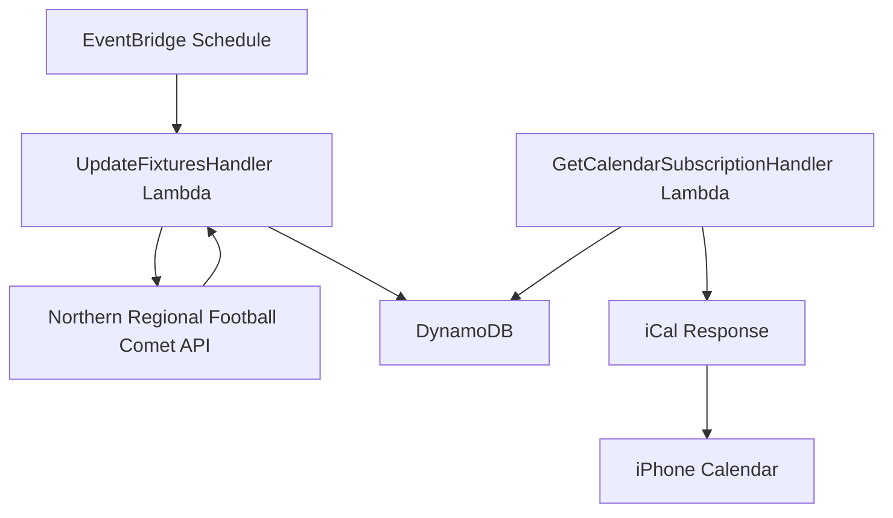

# Football Calendar API service

The football calendar API service extracts, processes, and provides structured data about football fixtures from the Northern Regional Football (NRF) Comet API in Auckland.

## System architecture



## Requirements and specifications

### Functional requirements

- Extract fixture information from Northern Regional Football Comet API
- Capture comprehensive fixture details including:
  - Match title (teams playing)
  - Match date and time
  - Venue location
- Store extracted data in DynamoDB
- Expose fixture data through iCal subscription endpoint
- Update fixture data regularly through scheduled polling
- Support calendar subscription in iPhone calendar app

### Technical specifications

- Lambda execution frequency: Regular schedule via EventBridge
- DynamoDB table: "football_calendar" with hash key "pk" and range key "sk"
- Java 17 runtime for Lambda functions
- API Gateway endpoint with custom domain for calendar subscription

## Implementation details

### Technologies

- AWS Lambda for serverless execution
- Amazon EventBridge for scheduled task execution
- DynamoDB for storing structured fixture data
- AWS API Gateway for exposing the iCal endpoint
- Java 17 runtime environment
- HTTP client library for API requests
- JSON processing for parsing API responses
- Biweekly library for iCal generation
- AWS Certificate Manager for SSL/TLS
- Custom domain name with API Gateway

### Key components

- `UpdateFixturesHandler`: Lambda handler that processes scheduled events to fetch fixture data
- `GetCalendarSubscriptionHandler`: Lambda handler that serves iCal subscription data
- `HttpCometClient`: Implementation for interacting with the NRF Comet API
- `FootballCalendarItem`: Data model for storing fixture data in DynamoDB
- `FootballCalendarFactory`: Factory for creating the required dependencies

### Team filtering

The service is designed to track a specific team ("Flamingos") and filter out other fixtures. The implementation:

1. Uses the team name as the partition key in DynamoDB for efficient querying
2. Filters API results to include only matches involving the Flamingos team
3. Organizes data in DynamoDB by team, with each match as a separate item
4. Uses "TEAM#flamingos" as the partition key and "MATCH#{match_id}" as the sort key

### Configuration

- Lambda execution frequency: Weekly via EventBridge schedule
- DynamoDB table: "football_calendar" with hash key "pk" and range key "sk"
- API Gateway endpoint: GET /calendar
- Custom domain: api.football-calendar.jordansimsmith.com
- Time zone: Pacific/Auckland

### Data schema

#### API Request example

```
URL: https://www.nrf.org.nz/api/1.0/competition/cometwidget/filteredfixtures

JSON Body:
{
  "competitionId": "2716594877",
  "orgIds": "44838",
  "from": "2025-04-05T00:00:00.000Z",
  "to": "2025-04-11T00:00:00.000Z",
  "sportId": "1",
  "seasonId": "2025",
  "gradeIds": "",
  "gradeId": "",
  "organisationId": "",
  "roundId": null,
  "roundsOn": false,
  "matchDay": null,
  "phaseId": null,
  "logos": "True"
}
```

#### API Response example

```json
{
  "fixtures": [
    {
      "Id": "2716942185",
      "HomeOrgLogo": "//prodcdn.sporty.co.nz/cometcache/comet/logo/285712",
      "AwayOrgLogo": "//prodcdn.sporty.co.nz/cometcache/comet/logo/289232",
      "GradeId": "Grade",
      "GradeName": "Grade",
      "HomeTeamNameAbbr": "Bucklands Beach Bucks M5",
      "AwayTeamNameAbbr": "Ellerslie AFC Flamingoes M",
      "CompetitionId": null,
      "Round": "Round",
      "RoundName": "Round",
      "Date": "2025-04-05T15:00:00",
      "VenueId": "47651",
      "VenueName": "Lloyd Elsmore Park 2",
      "GLN": "9429302884032",
      "HomeScore": "",
      "AwayScore": "",
      "SectionId": 0,
      "SectionName": null,
      "PublicNotes": null,
      "CssName": null,
      "MatchSummary": null,
      "MatchDayDescription": null,
      "SportId": null,
      "matchDay": 1,
      "Longitude": "174.8997797",
      "Latitude": "-36.9053315",
      "Address": "2 Bells Avenue",
      "Status": "POSTPONED",
      "CometScore": ""
    }
  ]
}
```

#### DynamoDB schema

- Table: `football_calendar`
- Partition key (pk): `TEAM#{team}`
- Sort key (sk): `MATCH#{match_id}`
- Attributes:
  - `team`: The team we're tracking (e.g., "Flamingos")
  - `match_id`: Unique identifier for the match
  - `home_team`: Team playing at home
  - `away_team`: Team playing away
  - `timestamp`: Match date and time (stored as epoch seconds)
  - `venue`: Match venue name
  - `address`: Venue address
  - `latitude`: Venue latitude (numeric)
  - `longitude`: Venue longitude (numeric)
  - `status`: Match status (e.g., "POSTPONED")
