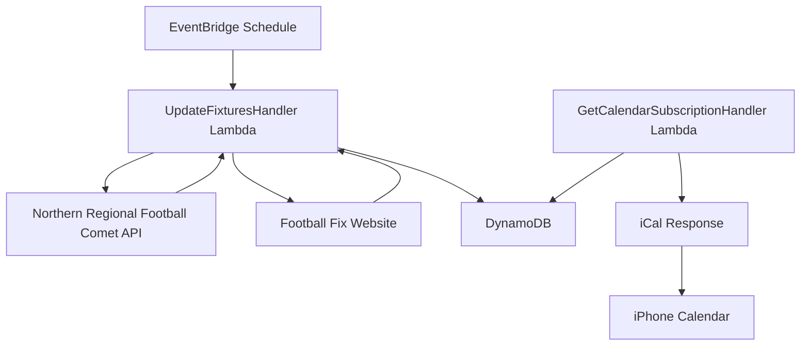

# Football calendar service

The football calendar service extracts, processes, and provides structured data about football fixtures from multiple sources including the Northern Regional Football (NRF) Comet API and the Football Fix website in Auckland.

## System architecture



## Requirements

### Functional requirements

- Extract fixture information from multiple sources:
  - Northern Regional Football Comet API
  - Football Fix website (via web scraping)
- Capture comprehensive fixture details including:
  - Match title (teams playing)
  - Match date and time
  - Venue location
- Store extracted data in DynamoDB
- Expose fixture data through iCal subscription endpoint
- Update fixture data regularly through scheduled polling
- Support calendar subscription in iPhone calendar app

### Technical specifications

- Serverless architecture using AWS Lambda
- Data persistence with DynamoDB using composite keys
- RESTful API for calendar subscription access
- Java 17 runtime environment
- Scheduled execution via EventBridge triggers
- Custom domain with HTTPS support
- Time zone support for Pacific/Auckland

## Implementation details

### Technologies

- AWS Lambda for serverless execution
- Amazon EventBridge for scheduled task execution
- DynamoDB for storing structured fixture data
- AWS API Gateway for exposing the iCal endpoint
- Java 17 runtime environment
- HTTP client library for API requests
- JSON processing for parsing API responses
- JSoup library for HTML parsing and web scraping
- Biweekly library for iCal generation
- AWS Certificate Manager for SSL/TLS
- Custom domain name with API Gateway

### Key components

- `UpdateFixturesHandler`: Lambda handler that processes scheduled events to fetch fixture data from multiple sources
- `GetCalendarSubscriptionHandler`: Lambda handler that serves iCal subscription data
- `HttpCometClient`: Implementation for interacting with the NRF Comet API using HTTP requests
- `CometClient`: Client interface for retrieving fixture data from the Comet API
- `JsoupFootballFixClient`: Implementation for scraping fixture data from the Football Fix website
- `FootballFixClient`: Client interface for retrieving fixture data from Football Fix
- `FootballCalendarItem`: Data model for storing fixture data in DynamoDB
- `FootballCalendarFactory`: Factory for creating the required dependencies
- `TeamsFactory`: Factory for defining team configurations and data source parameters

### Team filtering

The service is designed to track specific teams from multiple sources and filter out other fixtures. The implementation:

1. Uses the team name as the partition key in DynamoDB for efficient querying
2. Filters results from each data source to include only matches involving configured teams
3. Supports multiple teams from different sources:
   - "Flamingos" from Northern Regional Football Comet API (both league and cup competitions)
   - "Flamingos Sevens" from Football Fix website
4. Organizes data in DynamoDB by team, with each match as a separate item
5. Uses "TEAM#{team_id}" as the partition key and "MATCH#{match_id}" as the sort key

### Configuration

- Lambda execution frequency: Every 15 minutes via EventBridge schedule
- Lambda memory: 1024MB, timeout: 30 seconds
- Java 17 runtime for Lambda functions
- DynamoDB table: "football_calendar" with hash key "pk" and range key "sk"
- API Gateway endpoint: GET /calendar
- Custom domain: api.football-calendar.jordansimsmith.com
- Time zone: Pacific/Auckland

### Data schema

#### API Request example

```
URL: https://www.nrf.org.nz/api/1.0/competition/cometwidget/filteredfixtures

JSON Body:
{
  "competitionId": "2716594877",
  "orgIds": "44838",
  "from": "2025-04-05T00:00:00.000Z",
  "to": "2025-04-11T00:00:00.000Z",
  "sportId": "1",
  "seasonId": "2025",
  "gradeIds": "",
  "gradeId": "",
  "organisationId": "",
  "roundId": null,
  "roundsOn": false,
  "matchDay": null,
  "phaseId": null,
  "logos": "True"
}
```

#### API Response example

```json
{
  "fixtures": [
    {
      "Id": "2716942185",
      "HomeOrgLogo": "//prodcdn.sporty.co.nz/cometcache/comet/logo/285712",
      "AwayOrgLogo": "//prodcdn.sporty.co.nz/cometcache/comet/logo/289232",
      "GradeId": "Grade",
      "GradeName": "Grade",
      "HomeTeamNameAbbr": "Bucklands Beach Bucks M5",
      "AwayTeamNameAbbr": "Ellerslie AFC Flamingoes M",
      "CompetitionId": null,
      "Round": "Round",
      "RoundName": "Round",
      "Date": "2025-04-05T15:00:00",
      "VenueId": "47651",
      "VenueName": "Lloyd Elsmore Park 2",
      "GLN": "9429302884032",
      "HomeScore": "",
      "AwayScore": "",
      "SectionId": 0,
      "SectionName": null,
      "PublicNotes": null,
      "CssName": null,
      "MatchSummary": null,
      "MatchDayDescription": null,
      "SportId": null,
      "matchDay": 1,
      "Longitude": "174.8997797",
      "Latitude": "-36.9053315",
      "Address": "2 Bells Avenue",
      "Status": "POSTPONED",
      "CometScore": ""
    }
  ]
}
```

#### Football Fix web scraping

The service scrapes fixture data from the Football Fix website using JSoup.

URL format:

```
https://footballfix.spawtz.com/Leagues/Fixtures?SportId=0&VenueId={venueId}&LeagueId={leagueId}&SeasonId={seasonId}&DivisionId={divisionId}
```

Parameters:

- `SportId`: Always 0 (football)
- `VenueId`: Venue identifier (e.g., 13 for Mt Eden)
- `LeagueId`: League identifier
- `SeasonId`: Season identifier
- `DivisionId`: Division identifier

Example HTML structure:

```html
<table class="FTable">
  <tr class="FHeader">
    <td colspan="5">Thursday 23 Oct 2025</td>
  </tr>
  <tr class="FRow FBand">
    <td class="FDate">7:20pm</td>
    <td class="FPlayingArea">Field 1<br /></td>
    <td class="FHomeTeam"><a href="...">Lad FC</a></td>
    <td class="FScore">
      <div><nobr data-fixture-id="148617">vs</nobr></div>
    </td>
    <td class="FAwayTeam"><a href="...">Flamingoes</a></td>
  </tr>
</table>
```

Extracted data:

- Fixture ID: From `data-fixture-id` attribute
- Date: Parsed from header row (e.g., "Thursday 23 Oct 2025")
- Time: Parsed from FDate cell (e.g., "7:20pm")
- Venue: Playing area name (e.g., "Field 1")
- Home team: Text from FHomeTeam cell
- Away team: Text from FAwayTeam cell
- Address: Configured per venue (e.g., "3/25 Normanby Road, Mount Eden, Auckland 1024")
- Timezone: Pacific/Auckland

#### DynamoDB schema

- Table: `football_calendar`
- Partition key (pk): `TEAM#{team}`
- Sort key (sk): `MATCH#{match_id}`
- Attributes:
  - `team`: The team we're tracking (e.g., "Flamingos")
  - `match_id`: Unique identifier for the match
  - `home_team`: Team playing at home
  - `away_team`: Team playing away
  - `timestamp`: Match date and time (stored as epoch seconds)
  - `venue`: Match venue name
  - `address`: Venue address
  - `latitude`: Venue latitude (numeric)
  - `longitude`: Venue longitude (numeric)
  - `status`: Match status (e.g., "POSTPONED")

#### Example DynamoDB item

```json
{
  "pk": {
    "S": "TEAM#flamingos"
  },
  "sk": {
    "S": "MATCH#2716942185"
  },
  "team": {
    "S": "Flamingos"
  },
  "match_id": {
    "S": "2716942185"
  },
  "home_team": {
    "S": "Bucklands Beach Bucks M5"
  },
  "away_team": {
    "S": "Ellerslie AFC Flamingoes M"
  },
  "timestamp": {
    "N": "1743811200"
  },
  "venue": {
    "S": "Lloyd Elsmore Park 2"
  },
  "address": {
    "S": "2 Bells Avenue"
  },
  "latitude": {
    "N": "-36.9053315"
  },
  "longitude": {
    "N": "174.8997797"
  },
  "status": {
    "S": "POSTPONED"
  }
}
```
