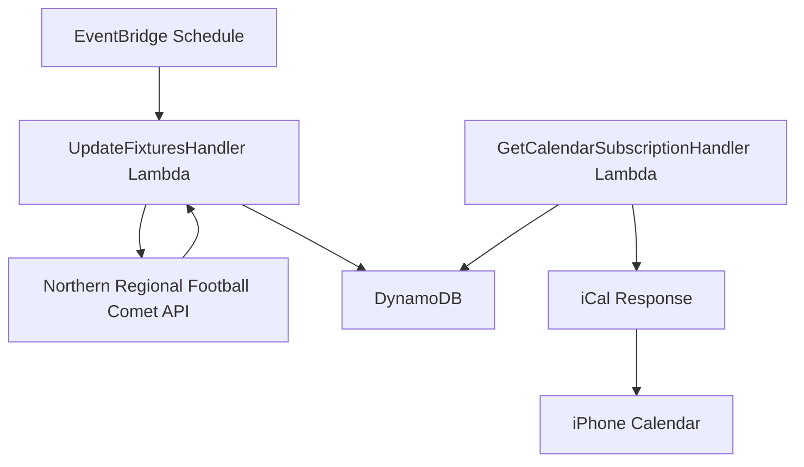

# Football Calendar API service

The football calendar API service extracts, processes, and provides structured data about football fixtures from the Northern Regional Football (NRF) Comet API in Auckland.

## System architecture

## Requirements and specifications

### Functional requirements

- Extract fixture information from Northern Regional Football Comet API
- Capture comprehensive fixture details including:
  - Match title (teams playing)
  - Match date and time
  - Venue location
- Store extracted data in DynamoDB
- Expose fixture data through iCal subscription endpoint
- Update fixture data regularly through scheduled polling
- Support calendar subscription in iPhone calendar app

### Technical specifications

- Lambda execution frequency: Regular schedule via EventBridge
- DynamoDB table: "football_calendar" with hash key "pk" and range key "sk"
- Java 17 runtime for Lambda functions
- API Gateway endpoint with custom domain for calendar subscription

## Implementation details

The technical implementation details will be added as the service is developed.