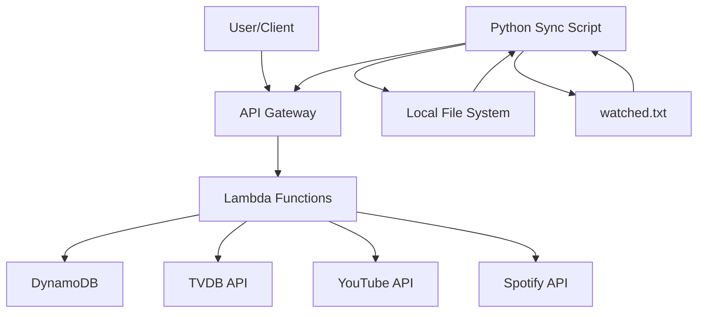

# Immersion tracker service

The immersion tracker service records and monitors media consumption for language learning immersion, tracking watched shows and episodes while providing progress statistics.

## System architecture



## Requirements

### Functional requirements

- Track watched TV shows and episodes for language learning immersion
- Track watched movies for language learning immersion
- Track watched YouTube videos for language learning immersion
- Track watched Spotify podcast episodes for language learning immersion
- Store metadata about shows from TVDB API
- Store metadata about movies from TVDB API
- Store metadata about YouTube videos from YouTube API
- Store metadata about Spotify episodes from Spotify API
- Provide progress statistics (total episodes watched, hours watched, etc.)
- Support syncing episodes from local files to the cloud database
- Support syncing movies from local files to the cloud database
- Support syncing YouTube videos and Spotify episodes from local watched.txt file
- Allow updating show metadata with TVDB information
- Display progress summaries for all tracked shows, movies, YouTube channels, and Spotify shows
- Support authentication for secure access

### Technical specifications

- RESTful API for accessing tracker functionality
- Secure data storage with user-based partitioning
- Automatic cleanup of local files after syncing
- Support for common video file formats (.mkv, .mp4)
- Cloud-based storage for persistence across devices
- AWS Lambda-based serverless architecture
- API Gateway with custom domain and HTTPS support

## Implementation details

### Technologies

- AWS Lambda for serverless computing
- Amazon DynamoDB for data storage
- AWS API Gateway for REST API endpoints
- AWS Secrets Manager for credential management
- Java 17 for Lambda implementation
- Python for client-side scripts
- Bazel for building and deployment
- Terraform for infrastructure as code

### Key components

- `AuthHandler`: Handles user authentication
- `GetProgressHandler`: Retrieves progress statistics
- `GetShowsHandler`: Lists tracked shows
- `SyncEpisodesHandler`: Syncs local episodes to the database
- `SyncMoviesHandler`: Syncs local movies to the database
- `SyncYoutubeHandler`: Syncs YouTube videos to the database
- `SyncSpotifyHandler`: Syncs Spotify podcast episodes to the database
- `UpdateShowHandler`: Updates show metadata with TVDB information
- `ImmersionTrackerItem`: Data model for DynamoDB items
- `sync_episodes.py`: Client script that scans local files and watched.txt, calls the Lambda API to sync episodes, movies, YouTube videos, and Spotify episodes, and manages watched files

### Configuration

- DynamoDB table with partition key for user and sort key for item type
- Lambda functions with minimal permissions following least privilege
- API Gateway with custom domain (api.immersion-tracker.jordansimsmith.com)
- Authentication using API Gateway authorizers
- TVDB API integration for show metadata lookup
- YouTube API integration for video metadata lookup
- Spotify API integration for podcast episode metadata lookup using client credentials flow

### DynamoDB data model examples

**Episode item:**

```json
{
  "pk": "USER#alice",
  "sk": "EPISODE#show_name#episode_filename",
  "user": "alice",
  "folder_name": "show_name",
  "file_name": "episode_filename",
  "timestamp": 1672531200
}
```

**Show item:**

```json
{
  "pk": "USER#alice",
  "sk": "SHOW#show_name",
  "user": "alice",
  "folder_name": "show_name",
  "tvdb_id": 12345,
  "tvdb_name": "Example Show",
  "tvdb_image": "https://artworks.thetvdb.com/banners/posters/12345-1.jpg"
}
```

**YouTube video item:**

```json
{
  "pk": "USER#alice",
  "sk": "YOUTUBEVIDEO#dQw4w9WgXcQ",
  "user": "alice",
  "youtube_video_id": "dQw4w9WgXcQ",
  "youtube_video_title": "Example Video Title",
  "youtube_channel_id": "UCChannelId123",
  "youtube_video_duration": 253,
  "timestamp": 1672531200
}
```

**YouTube channel item:**

```json
{
  "pk": "USER#alice",
  "sk": "YOUTUBECHANNEL#UCChannelId123",
  "user": "alice",
  "youtube_channel_id": "UCChannelId123",
  "youtube_channel_title": "Example Channel"
}
```

**Spotify episode item:**

```json
{
  "pk": "USER#alice",
  "sk": "SPOTIFYEPISODE#4qjerzMw8jfD30VOG0tjpK",
  "user": "alice",
  "spotify_episode_id": "4qjerzMw8jfD30VOG0tjpK",
  "spotify_episode_title": "No 1 紹介(しょうかい) Introduction",
  "spotify_show_id": "6Nl8RDfPxsk4h4bfWe76Kg",
  "spotify_episode_duration": 388,
  "timestamp": 1672531200
}
```

**Spotify show item:**

```json
{
  "pk": "USER#alice",
  "sk": "SPOTIFYSHOW#6Nl8RDfPxsk4h4bfWe76Kg",
  "user": "alice",
  "spotify_show_id": "6Nl8RDfPxsk4h4bfWe76Kg",
  "spotify_show_name": "The Miku Real Japanese Podcast | Japanese conversation | Japanese culture"
}
```

**Movie item:**

```json
{
  "pk": "USER#alice",
  "sk": "MOVIE#spirited_away",
  "user": "alice",
  "file_name": "spirited_away",
  "tvdb_id": 12345,
  "tvdb_name": "Spirited Away",
  "tvdb_image": "https://artworks.thetvdb.com/artworks/12345/posters/12345-1.jpg",
  "movie_duration": 7500,
  "timestamp": 1672531200
}
```
