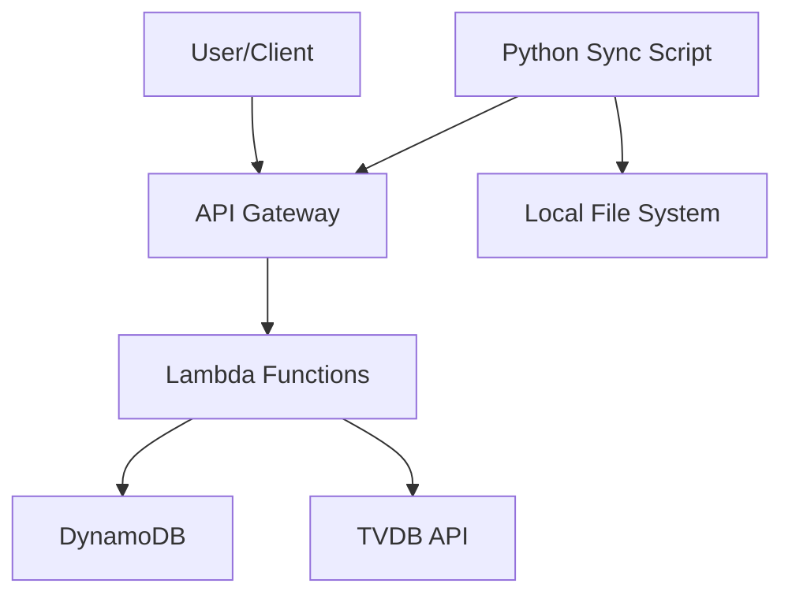

# Immersion tracker service

The immersion tracker service records and monitors media consumption for language learning immersion, tracking watched shows and episodes while providing progress statistics.

## System architecture

## Requirements and specifications

### Functional requirements

- Track watched TV shows and episodes for language learning immersion
- Store metadata about shows from TVDB API
- Provide progress statistics (total episodes watched, hours watched, etc.)
- Support syncing episodes from local files to the cloud database
- Allow updating show metadata with TVDB information
- Display progress summaries for all tracked shows
- Support authentication for secure access

### Technical specifications

- RESTful API for accessing tracker functionality
- Secure data storage with user-based partitioning
- Automatic cleanup of local files after syncing
- Support for common video file formats (.mkv, .mp4)
- Cloud-based storage for persistence across devices
- AWS Lambda-based serverless architecture
- API Gateway with custom domain and HTTPS support

## Implementation details

### Technologies

- AWS Lambda for serverless computing
- Amazon DynamoDB for data storage
- AWS API Gateway for REST API endpoints
- AWS Secrets Manager for credential management
- Java 17 for Lambda implementation
- Python for client-side scripts
- Bazel for building and deployment
- Terraform for infrastructure as code

### Key components

- `AuthHandler`: Handles user authentication
- `GetProgressHandler`: Retrieves progress statistics
- `GetShowsHandler`: Lists tracked shows
- `SyncEpisodesHandler`: Syncs local episodes to the database
- `UpdateShowHandler`: Updates show metadata with TVDB information
- `ImmersionTrackerItem`: Data model for DynamoDB items
- `sync_episodes.py`: Client script that scans local files, calls the Lambda API to sync episodes, and manages watched files

### Configuration

- DynamoDB table with partition key for user and sort key for item type
- Lambda functions with minimal permissions following least privilege
- API Gateway with custom domain (api.immersion-tracker.jordansimsmith.com)
- Authentication using API Gateway authorizers
- TVDB API integration for metadata lookup
