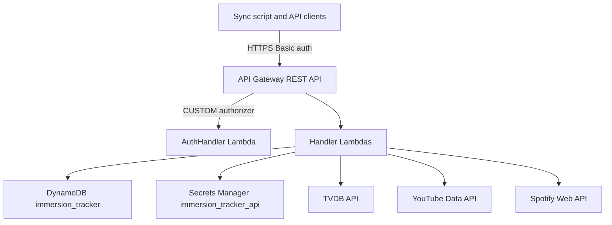
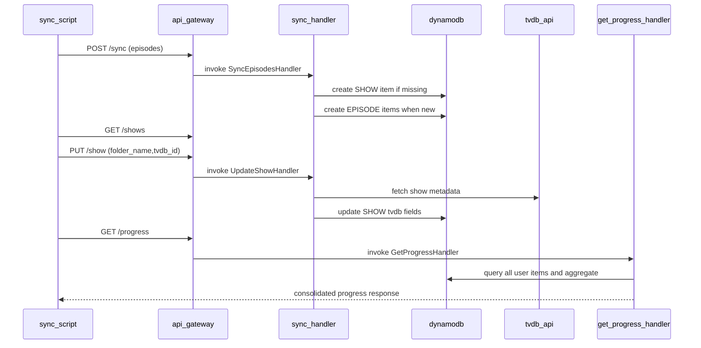

# Immersion tracker API

The immersion tracker API provides an authenticated backend for recording watched language-immersion content and returning consolidated progress analytics across shows, movies, YouTube, and Spotify.

## Overview

- **Service type**: backend API (`immersion_tracker_api`)
- **Interface**: REST over HTTPS (API Gateway -> Lambda proxy integration)
- **Runtime**: AWS Lambda (Java 21)
- **Primary storage**: DynamoDB single-table design (`immersion_tracker`)
- **Primary client**: local sync script (`immersion_tracker_api/script/sync_episodes.py`)
- **External metadata providers**: TVDB, YouTube Data API v3, Spotify Web API

## Features and scope boundaries

### In scope

- Authenticate every API route with a custom API Gateway Lambda authorizer using HTTP Basic credentials.
- Sync watched local episodes, movies, YouTube videos, and Spotify episodes into per-user DynamoDB partitions.
- Enrich content metadata from TVDB (shows and movies), YouTube (videos and channels), and Spotify (episodes and shows).
- Return aggregate progress metrics, daily activity, weekly trend, and grouped progress summaries from persisted data.
- Support idempotent sync semantics by skipping existing items keyed by deterministic `pk`/`sk` values.
- Maintain a script-oriented workflow that can prompt for TVDB IDs, call API endpoints, and clean up local watched files.

### Out of scope

- Building or documenting a separate web UI contract in this service README.
- Background or scheduled ingestion pipelines; sync is client-initiated through explicit API calls.
- Additional product-scope commitments beyond the implemented endpoint and data contracts below.

## Architecture



### Primary workflow



## Main technical decisions

- Use API Gateway + Lambda for a low-ops serverless API that matches other services in this repository.
- Use one DynamoDB table with key prefixes (`EPISODE#`, `SHOW#`, `MOVIE#`, `YOUTUBEVIDEO#`, `YOUTUBECHANNEL#`, `SPOTIFYEPISODE#`, `SPOTIFYSHOW#`) to keep read and write paths simple for per-user workloads.
- Use HTTP Basic authentication via API Gateway custom authorizer and Secrets Manager-backed credentials for straightforward script and CLI usage.
- Enrich and persist provider metadata during sync operations so progress queries avoid extra outbound calls.
- Compute progress and trend metrics at read time from canonical items; this keeps writes simple but makes read cost proportional to user data volume.

## Domain glossary

- **Episode item**: one watched local show episode keyed by `EPISODE#<folder_name>#<file_name>`.
- **Show item**: metadata record keyed by `SHOW#<folder_name>`, enriched from TVDB.
- **Movie item**: watched movie keyed by `MOVIE#<file_name>`, enriched from TVDB.
- **YouTube video item**: one watched video keyed by `YOUTUBEVIDEO#<video_id>`.
- **YouTube channel item**: channel metadata keyed by `YOUTUBECHANNEL#<channel_id>`.
- **Spotify episode item**: one watched podcast episode keyed by `SPOTIFYEPISODE#<episode_id>`.
- **Spotify show item**: show metadata keyed by `SPOTIFYSHOW#<show_id>`.

## Integration contracts

### External systems

- **TVDB API (`https://api4.thetvdb.com/v4`)**: `HttpTvdbClient` logs in with secret key `tvdb_api_key` (`POST /login`) then calls `GET /series/{id}` and `GET /movies/{id}` during `PUT /show` and `POST /syncmovies`. Required response data for writes is `name`, `image`, and runtime (`averageRuntime` for series, `runtime` for movies). Non-200 or non-`success` responses fail the request.
- **YouTube Data API v3 (`https://www.googleapis.com/youtube/v3`)**: `HttpYoutubeClient` uses `youtube_api_key` as query parameter and calls `GET /videos` and `GET /channels` for each new video ID in `POST /syncyoutube`. Required video data is `id`, `snippet.title`, `snippet.channelId`, and `contentDetails.duration`; channel metadata includes title and thumbnail URL preference (high, then medium, then default). Non-200 or invalid payload shape fails the request.
- **Spotify Web API (`https://accounts.spotify.com` and `https://api.spotify.com/v1`)**: `HttpSpotifyClient` exchanges `spotify_client_id` and `spotify_client_secret` for an access token using client credentials, then calls `GET /episodes/{episode_id}` for each new episode ID in `POST /syncspotify`. Required data includes episode `id`, `name`, `duration_ms`, `show.id`, and `show.name`; first show image URL is used when present. Non-200 or invalid payload shape fails the request.

## API contracts

### Conventions

- Base URL: `https://api.immersion-tracker.jordansimsmith.com`
- Auth: `Authorization: Basic <base64 user:password>`
- JSON field naming: snake_case for request and response fields
- Versioning: no version segment in route paths
- CORS: allows origin `https://immersion-tracker.jordansimsmith.com`, methods `GET,POST,PUT,OPTIONS`, headers `Authorization,Content-Type`
- Success shape: handlers currently return `200` with JSON body
- Unauthorized shape: API Gateway returns `401` with `WWW-Authenticate: Basic` and payload:

```json
{
  "message": "<gateway auth error message>"
}
```

- Error behavior: handlers do not define custom `400` or `404` responses; unhandled parsing, validation, and integration failures bubble as upstream API Gateway/Lambda errors.

### Endpoint summary

| Method | Path           | Purpose                                                           |
| ------ | -------------- | ----------------------------------------------------------------- |
| `GET`  | `/progress`    | return consolidated progress and analytics across all media types |
| `GET`  | `/shows`       | list tracked show folders and current TVDB metadata               |
| `POST` | `/sync`        | sync watched local show episodes and create missing show records  |
| `PUT`  | `/show`        | enrich an existing show with TVDB metadata                        |
| `POST` | `/syncyoutube` | sync watched YouTube video IDs and channel metadata               |
| `POST` | `/syncspotify` | sync watched Spotify episode IDs and show metadata                |
| `POST` | `/syncmovies`  | sync watched local movies using provided TVDB IDs                 |

### Endpoint request and response contracts

- `GET /progress`
  - Request body: none
  - Response `200`: progress payload with totals, today counters, `days_since_first_episode`, nullable `weekly_trend_percentage`, `daily_activity`, `all_time_progress`, and grouped `shows`, `youtube_channels`, `spotify_shows`, `movies`
  - Identifier note: `shows[].show_id` is the TVDB ID when known; `movies[].movie_id` is the local file identifier (`file_name`)
- `GET /shows`
  - Request body: none
  - Response `200`: `{ "shows": [{ "folder_name": string, "tvdb_id": number|null, "tvdb_name": string|null, "tvdb_image": string|null }] }`
- `POST /sync`
  - Request body: `{ "episodes": [{ "folder_name": string, "file_name": string }] }`
  - Response `200`: `{ "episodes_added": number }`
- `PUT /show`
  - Request body: `{ "folder_name": string, "tvdb_id": number }`
  - Response `200`: `{}`
  - Behavior note: show must already exist for that user partition
- `POST /syncyoutube`
  - Request body: `{ "video_ids": [string] }`
  - Response `200`: `{ "videos_added": number }`
- `POST /syncspotify`
  - Request body: `{ "episode_ids": [string] }`
  - Response `200`: `{ "episodes_added": number }`
- `POST /syncmovies`
  - Request body: `{ "movies": [{ "file_name": string, "tvdb_id": number }] }`
  - Response `200`: `{ "movies_added": number }`

### Example request and response

`POST /sync`

Request:

```json
{
  "episodes": [
    {
      "folder_name": "show_name",
      "file_name": "episode_name"
    }
  ]
}
```

Response `200`:

```json
{
  "episodes_added": 1
}
```

`GET /progress` response shape (selected fields):

```json
{
  "total_episodes_watched": 10,
  "total_movies_watched": 2,
  "total_hours_watched": 14,
  "episodes_watched_today": 1,
  "movies_watched_today": 0,
  "youtube_videos_watched": 3,
  "youtube_videos_watched_today": 0,
  "spotify_episodes_watched": 5,
  "spotify_episodes_watched_today": 1,
  "days_since_first_episode": 120,
  "weekly_trend_percentage": 12.5,
  "daily_activity": [
    {
      "days_ago": 0,
      "minutes_watched": 60
    }
  ],
  "all_time_progress": [
    {
      "label": "Jan 2026",
      "cumulative_hours": 14
    }
  ],
  "shows": [
    {
      "show_id": "12345",
      "name": "Example Show",
      "artwork_url": "https://example.com/poster.jpg",
      "episodes_watched": 10
    }
  ],
  "youtube_channels": [],
  "spotify_shows": [],
  "movies": []
}
```

## Data and storage contracts

### DynamoDB model

- **Table name**: `immersion_tracker`
- **Primary key**:
  - `pk`: `USER#<user>`
  - `sk`: item-type prefix with deterministic identifiers
- **Secondary indexes**: none defined
- **Type converters**:
  - `timestamp` uses `EpochSecondConverter` (epoch seconds)
  - duration fields use `DurationSecondsConverter` (seconds)

Item types and required attributes:

- **Episode (`EPISODE#<folder_name>#<file_name>`)**: `pk`, `sk`, `user`, `folder_name`, `file_name`, `timestamp`
- **Show (`SHOW#<folder_name>`)**: `pk`, `sk`, `user`, `folder_name`; optional `tvdb_id`, `tvdb_name`, `tvdb_image`, `tvdb_average_runtime`; includes optimistic-lock `version`
- **Movie (`MOVIE#<file_name>`)**: `pk`, `sk`, `user`, `file_name`, `tvdb_id`, `tvdb_name`, `tvdb_image`, `movie_duration`, `timestamp`
- **YouTube video (`YOUTUBEVIDEO#<video_id>`)**: `pk`, `sk`, `user`, `youtube_video_id`, `youtube_video_title`, `youtube_channel_id`, `youtube_video_duration`, `timestamp`
- **YouTube channel (`YOUTUBECHANNEL#<channel_id>`)**: `pk`, `sk`, `user`, `youtube_channel_id`, `youtube_channel_title`, optional `youtube_channel_artwork_url`
- **Spotify episode (`SPOTIFYEPISODE#<episode_id>`)**: `pk`, `sk`, `user`, `spotify_episode_id`, `spotify_episode_title`, `spotify_show_id`, `spotify_episode_duration`, `timestamp`
- **Spotify show (`SPOTIFYSHOW#<show_id>`)**: `pk`, `sk`, `user`, `spotify_show_id`, `spotify_show_name`, optional `spotify_show_artwork_url`

### Data ownership expectations

- User watch events and identifiers are authored by client sync payloads and persisted as canonical records in DynamoDB.
- Provider metadata fields are owned by TVDB, YouTube, and Spotify and copied into service records at sync/update time.
- Progress totals and trends are derived values computed from persisted records and are not separately authored.

Representative records:

Episode item:

```json
{
  "pk": "USER#alice",
  "sk": "EPISODE#show_name#episode_name",
  "user": "alice",
  "folder_name": "show_name",
  "file_name": "episode_name",
  "timestamp": 1730000000
}
```

Show item:

```json
{
  "pk": "USER#alice",
  "sk": "SHOW#show_name",
  "user": "alice",
  "folder_name": "show_name",
  "tvdb_id": 12345,
  "tvdb_name": "Example Show",
  "tvdb_image": "https://example.com/poster.jpg",
  "tvdb_average_runtime": 2700,
  "version": 2
}
```

Movie item:

```json
{
  "pk": "USER#alice",
  "sk": "MOVIE#movie_name",
  "user": "alice",
  "file_name": "movie_name",
  "tvdb_id": 67890,
  "tvdb_name": "Example Movie",
  "tvdb_image": "https://example.com/movie.jpg",
  "movie_duration": 7200,
  "timestamp": 1730000000
}
```

## Behavioral invariants and time semantics

- User identity for reads and writes is derived from the HTTP Basic username in `Authorization`.
- A sync request only inserts new items; existing `pk`/`sk` records are skipped and not overwritten.
- `POST /sync` creates a `SHOW` item when missing before creating `EPISODE` items.
- `PUT /show` requires an existing show record; otherwise the request fails.
- `GetProgressHandler` uses `Pacific/Auckland` for day boundaries (`today`, daily activity windows, weekly trend periods).
- Episode duration in progress analytics uses show `tvdb_average_runtime` when present; otherwise fallback is 20 minutes.
- `weekly_trend_percentage` is `null` until at least 14 days of history exist.
- `youtube_channels` and `spotify_shows` are sorted by watch count descending, then by name when counts match.
- `shows` are sorted by episodes watched descending.
- `total_hours_watched` is truncated to whole hours via `Duration.toHours()`.

## Source of truth

| Entity                            | Authoritative source                                       | Notes                                                                |
| --------------------------------- | ---------------------------------------------------------- | -------------------------------------------------------------------- |
| User identity                     | Basic auth username                                        | Parsed from `Authorization` header in authorizer and request context |
| Watched local episodes and movies | Client sync payloads accepted by `/sync` and `/syncmovies` | Persisted as canonical item records per user                         |
| YouTube watch records             | Client-provided video IDs plus YouTube API metadata        | Video and channel metadata persisted at sync time                    |
| Spotify watch records             | Client-provided episode IDs plus Spotify API metadata      | Episode and show metadata persisted at sync time                     |
| TV show and movie metadata        | TVDB API lookups                                           | Persisted into `SHOW` and `MOVIE` records                            |
| Progress metrics                  | Derived at read time from DynamoDB user partition          | No separate aggregate cache table                                    |
| Credential set                    | Secrets Manager secret `immersion_tracker_api`             | Referenced by authorizer and provider clients                        |

## Security and privacy

- All non-OPTIONS API methods use custom API Gateway authorization (`CUSTOM`) with `AuthHandler`.
- Unauthorized requests return `401` and `WWW-Authenticate: Basic`.
- Per-user partitioning (`pk = USER#<user>`) scopes records by authenticated identity.
- Runtime credentials and provider keys are loaded from AWS Secrets Manager, not hardcoded in source.
- Transport is HTTPS through the custom API domain `api.immersion-tracker.jordansimsmith.com`.
- CORS is restricted to `https://immersion-tracker.jordansimsmith.com`.

## Configuration and secrets reference

### Environment variables

Deployed Lambda handlers do not currently define service-specific environment variables in Terraform for table name, secret name, or provider configuration. The operational constants are fixed in code and infra (`immersion_tracker` table, `immersion_tracker_api` secret).

Local script and test variables:

| Name                         | Scope                     | Required | Purpose                                  | Default behavior              |
| ---------------------------- | ------------------------- | -------- | ---------------------------------------- | ----------------------------- |
| `IMMERSION_TRACKER_USER`     | sync script               | yes      | HTTP Basic username for API calls        | script raises if missing      |
| `IMMERSION_TRACKER_PASSWORD` | sync script               | yes      | HTTP Basic password for API calls        | script raises if missing      |
| `IMMERSION_TRACKER_API_URL`  | sync script               | no       | API base URL override for local/E2E runs | defaults to production domain |
| `TVDB_API_KEY`               | LocalStack init for tests | optional | test secret value for TVDB               | empty string when unset       |
| `YOUTUBE_API_KEY`            | LocalStack init for tests | optional | test secret value for YouTube            | empty string when unset       |
| `SPOTIFY_CLIENT_ID`          | LocalStack init for tests | optional | test secret value for Spotify auth       | empty string when unset       |
| `SPOTIFY_CLIENT_SECRET`      | LocalStack init for tests | optional | test secret value for Spotify auth       | empty string when unset       |

### Secret shape

```json
{
  "users": [
    {
      "user": "alice",
      "password": "strong-password"
    }
  ],
  "tvdb_api_key": "string",
  "youtube_api_key": "string",
  "spotify_client_id": "string",
  "spotify_client_secret": "string"
}
```

## Performance envelope

- The service is optimized for personal, interactive sync workloads rather than high-throughput multi-tenant traffic.
- Sync handlers process each submitted item sequentially and perform external lookups inline, so request latency is sensitive to provider API latency and batch size.
- Progress reads query the full user partition and compute aggregates in memory, so response time grows with total tracked history for that user.
- No explicit numeric SLO or throughput target is currently defined in repository contracts.

## Testing and quality gates

- Unit tests cover provider HTTP clients and response/validation behavior.
- Integration tests cover each handler against DynamoDB test containers with fake provider clients.
- E2E tests execute the sync script against a LocalStack-backed API and verify user-facing flows.
- Required service checks:
  - `bazel build //immersion_tracker_api:all`
  - `bazel test //immersion_tracker_api:all`

## Local development and smoke checks

- Run the full service test suite: `bazel test //immersion_tracker_api:all`
- Run E2E script coverage only: `bazel test //immersion_tracker_api:e2e-tests`
- Run script directly from workspace root:
  - `bazel run //immersion_tracker_api:sync-episodes-script.py`
  - Set `IMMERSION_TRACKER_USER` and `IMMERSION_TRACKER_PASSWORD`
  - Optionally set `IMMERSION_TRACKER_API_URL` to a local test stack URL
  - `watched.txt` is read from the current working directory where the script runs
- Fast smoke check pattern:
  - sync at least one item (`/sync`, `/syncmovies`, `/syncyoutube`, or `/syncspotify`)
  - request `/progress`
  - verify corresponding counts and grouped sections changed in response

## End-to-end scenarios

### Scenario 1: sync local episodes and enrich shows

1. User places watched episode files under `shows/<folder>/watched`.
2. Script sends `POST /sync` with `{episodes:[{folder_name,file_name}]}`.
3. API inserts missing `SHOW` items and inserts only new `EPISODE` items.
4. Script requests `GET /shows`, prompts for missing TVDB IDs, and calls `PUT /show`.
5. User requests `GET /progress` and sees updated show counts, daily activity, and total hours.
6. Script deletes synced local watched files and removes completed show folders when no video files remain.

### Scenario 2: sync watched links from watched.txt

1. User adds YouTube and Spotify links to `watched.txt`.
2. Script extracts video and episode IDs, then calls `POST /syncyoutube` and `POST /syncspotify`.
3. API fetches metadata from YouTube and Spotify and stores both content and channel/show records.
4. User requests `GET /progress` and sees updated `youtube_channels` and `spotify_shows`.
5. Script clears `watched.txt` after successful sync.
