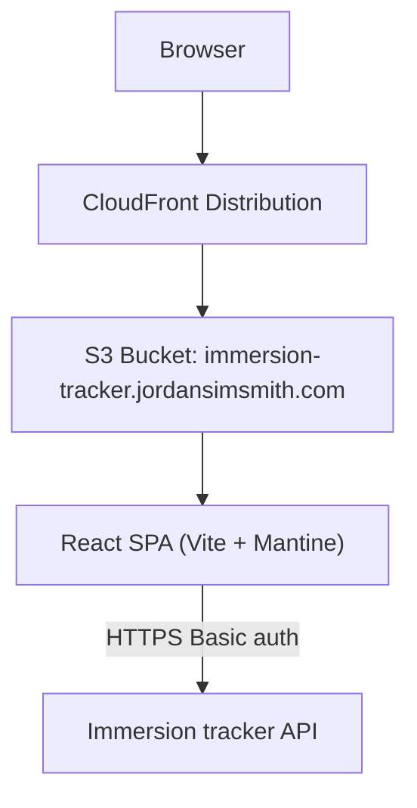

# Immersion tracker web

The immersion tracker web service is a responsive single-page app that lets an authenticated user view their immersion progress (total hours watched, an all-time cumulative chart, and a content-type breakdown with top artwork tiles).

## System architecture

## Requirements

### Functional requirements

- **Login**:
  - collect username/password
  - validate credentials via a lightweight authenticated API call (`GET /progress`) before accepting login
  - store a Basic auth token in `localStorage` (persists across browser sessions)
  - logout clears the stored token
- **Route protection**:
  - unauthenticated access to `/progress` redirects to `/`
  - after login, navigate to `/progress`
- **Progress dashboard** (`/progress`):
  - show a glanceable summary of total hours watched
  - render an all-time cumulative hours chart
  - show separate sections for each content type:
    - series (shows)
    - movies
    - YouTube
    - Spotify podcasts
  - each section shows:
    - total count watched for that content type
    - top 5 tiles (ranked by count; movies alphabetical)
    - each tile shows artwork, name, and watched count (movies show name and artwork)
    - a “See all” modal that reveals the full list for that content type
- **Responsive UX**: usable on both mobile and desktop
- **Read-only**: no editing or interaction beyond navigation and opening modals

### Technical specifications

- **Framework**: React
- **Language**: TypeScript
- **Build tool**: Vite
- **UI library**: Mantine
- **Theme**: Mantine `createTheme({ primaryColor: 'indigo' })` (calm accent)
- **Routing**: React Router (`react-router-dom`)
- **Forms**: `@mantine/form`
- **Notifications**: `@mantine/notifications`
- **Charts**: lightweight custom SVG charts (avoid heavyweight charting dependencies)
- **State strategy**:
  - UI state in React component state
  - server state via a typed API client (no React Query)
- **Auth/session**:
  - Basic token stored in `localStorage` (persists across browser sessions)
  - http client injects `Authorization` header
- **CORS**:
  - `immersion_tracker_api` responds with `Access-Control-Allow-Origin: https://immersion-tracker.jordansimsmith.com`
  - API Gateway handles preflight requests (OPTIONS) allowing `Authorization,Content-Type` headers and `GET,OPTIONS` methods
- **Hosting**: S3 + CloudFront (SPA deep-link support)
- **Infra**: Terraform (aligned with repo patterns from `packing_list_web` / `personal_website_web`)
- **Build system**: Bazel (aligned with repo patterns)

## Implementation details

### Route map

- `/` login/home
- `/progress` progress dashboard (requires auth)

### UX guiding principles

- **vibe**: calm, simple, glanceable; prioritize immediate comprehension over dense detail.
- **mantine-first**: prefer Mantine components + theme tokens; avoid bespoke styling.
- **theme**: use a calm primary color (e.g. `indigo`) distinct from `packing_list_web`'s `teal`.
- **responsive**:
  - mobile-first layout with comfortable spacing and large tap targets
  - desktop uses a wider container and denser grids where appropriate
- **layout**:
  - use Mantine `AppShell` with a simple header (app name left, user + logout right)
  - use a centered `Container` for page content (no sidebar navigation)
- **artwork**:
  - consistent tile aspect ratios; use cover-crop with subtle rounding
  - if artwork is missing, render a neutral placeholder

### API contract

The web app uses a single authenticated call:

- `GET /progress` (Basic auth)

The response includes the fields required to render the dashboard:

- **Top-level**:
  - `total_hours_watched: number`
  - `all_time_progress: Array<{ label: string; cumulative_hours: number }>`
  - `total_episodes_watched: number`
  - `total_movies_watched: number`
  - `youtube_videos_watched: number`
  - `spotify_episodes_watched: number`
- **Breakdowns** (pre-sorted):
  - `shows: Array<{ show_id: string; name: string | null; artwork_url: string | null; episodes_watched: number }>` sorted by `episodes_watched` desc
  - `youtube_channels: Array<{ channel_id: string; channel_name: string | null; artwork_url: string | null; videos_watched: number }>` sorted by `videos_watched` desc
  - `spotify_shows: Array<{ show_id: string; show_name: string | null; artwork_url: string | null; episodes_watched: number }>` sorted by `episodes_watched` desc
  - `movies: Array<{ movie_id: string; name: string | null; artwork_url: string | null }>` sorted by `name` asc

### Module layout

#### Separation of concerns

- **Pages** (`src/pages/*`):
  - own route-level state (loading/error/data) and side-effects (`useEffect`)
  - call presenter methods for data fetching and for deriving view models
  - avoid embedding non-trivial sorting/aggregation logic directly in JSX
- **Presenters** (`src/presenters/*`):
  - encapsulate API calls via `apiClient`
  - transform raw API responses into view models for components
  - keep presenters React-free (no hooks, no JSX)
- **Components** (`src/components/*`):
  - presentational and controlled by props; no network calls
  - minimal internal state (UI-only)
- **Domain helpers** (`src/domain/*`):
  - pure formatting/sorting utilities shared across presenters/components when needed

#### API integration

- `api/client.ts`
  - typed endpoint functions (no generic transport exported):
    - `getProgress()`
  - selects an underlying implementation:
    - `api/http-client.ts` (prod): real HTTP calls with `fetch`
    - `api/fake-client.ts` (dev): pure in-memory stub for local development (no backend required; resets on refresh)
  - normalizes error handling to `{"message":"..."}`

#### Auth/session

- `auth/session.ts`
  - read/write/clear Basic token in `localStorage`

#### Presenters

- `presenters/progress-presenter.ts`
  - convert the raw API response into view models for:
    - summary + chart data
    - top 5 tiles per section
    - full lists for “See all” modals

### Page/component architecture

#### Pages

- `LoginPage` (`/`)
- `ProgressPage` (`/progress`)

#### Layout and routing helpers

- `AppShellLayout` (Mantine `AppShell` header + main container)
- `RequireAuth` (redirect unauthenticated users)
- `ErrorBoundary` (route-level fallback)

#### Feature components

- `ProgressSummary` (total hours + cumulative chart)
- `ContentTypeSection` (header + top 5 grid + “See all” modal)
- `ArtworkTile` (artwork + name + count)

### Local development

- **For hot reloading** (recommended for development): run Vite directly outside Bazel:
  - `cd immersion_tracker_web && pnpm vite dev`
- **Via Bazel** (sandboxed, no hot reload): `bazel run //immersion_tracker_web:vite -- dev`
- By default, the app uses the **fake in-memory API client** in dev mode (no backend required; no network calls)
- Optionally, switch to the **http API client** to test against the deployed API (e.g. with a Vite env var such as `VITE_API_IMPL=http` and `VITE_API_URL=https://api.immersion-tracker.jordansimsmith.com`)

### Testing

- **Unit tests**: Vitest + React Testing Library (jsdom)
- **Bazel**: `bazel test //immersion_tracker_web:unit-tests`
- Focus areas:
  - login flow + route protection
  - progress dashboard rendering with representative data
  - “See all” modal behavior and sorting

### Deployment (Terraform) notes

- **Bucket**: `immersion-tracker.jordansimsmith.com`
- **CloudFront**:
  - origin access control (OAC) for private S3 access
  - viewer protocol policy redirect-to-https
  - SPA routing support:
    - map `403` and `404` to `/index.html` with `200` so deep links work on refresh
- Terraform implementation should follow the existing pattern used by `packing_list_web/infra/main.tf`:
  - locate Bazel output via `data.external` and `tools/terraform/resolve_location.sh`
  - upload built assets using `hashicorp/dir/template` + `aws_s3_object`

