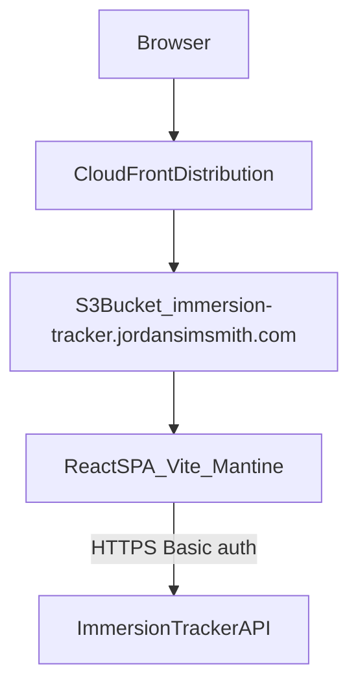
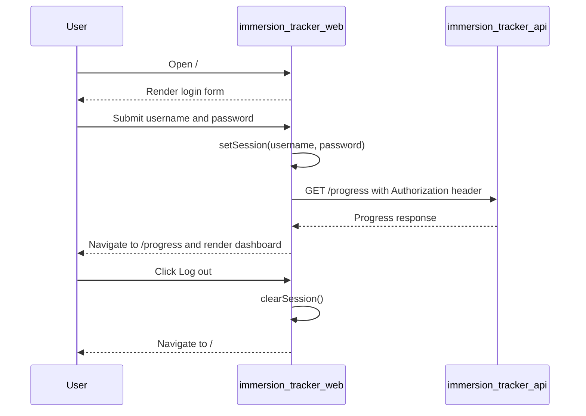

# Immersion tracker web

The immersion tracker web service is a responsive single-page app that lets an authenticated user view their immersion progress (total hours watched, an all-time cumulative chart, and a content-type breakdown with top artwork tiles).

## Overview

- **Service type**: web client (`immersion_tracker_web`)
- **Interface**: browser SPA served from CloudFront + S3
- **Frontend stack**: React, TypeScript, Vite, Mantine
- **Primary backend**: `immersion_tracker_api`
- **Primary users**: a single authenticated personal user workflow

## Features and scope boundaries

### In scope

- Authenticate with username/password and validate credentials via `GET /progress`.
- Persist session state in browser `localStorage` and clear it on logout.
- Protect `/progress` and redirect unauthenticated users to `/`.
- Render a read-only dashboard with:
  - total hours watched
  - cumulative hours chart
  - content sections for series, movies, YouTube, and Spotify
  - top 5 tiles per section with a `See all` modal for full lists
- Provide responsive layouts for mobile and desktop.

### Out of scope

- Creating or editing immersion records from the web client.
- User registration, password reset, or account profile management.
- Offline sync, background refresh jobs, or conflict resolution.
- Real-time updates over websockets or server-sent events.
- Direct browser calls to third-party providers.

## Architecture

### Primary workflow

## Main technical decisions

- Use React + TypeScript + Vite + Mantine to stay aligned with existing `_web` services and keep implementation patterns consistent.
- Keep route-level and UI state in React component state, and avoid a global server-state library. This keeps complexity low, but does not provide automatic caching/polling behavior.
- Use a presenter (`ProgressPresenter`) to transform API payloads into view models. This keeps React components focused on rendering and interaction.
- Render the chart with lightweight custom SVG instead of introducing a charting dependency. This keeps bundle complexity lower at the cost of fewer built-in chart features.
- Use a dual API implementation strategy:
  - fake in-memory client in development by default
  - HTTP client in production (and in development when `VITE_API_IMPL=http`)
- Persist Basic auth token in `localStorage` so sessions survive browser restarts.

## Domain glossary

- **Progress dashboard**: the `/progress` screen that shows summary metrics, chart, and content sections.
- **Content section**: one grouped category (`Series`, `Movies`, `YouTube`, `Spotify`) with totals and ranked tiles.
- **Top tiles**: the first five tiles shown in each section before opening `See all`.
- **All-time progress point**: one `{ label, cumulative_hours }` datapoint used by the cumulative chart.

## Integration contracts

### External systems

- **Immersion tracker API**: the app consumes authenticated `GET /progress` over HTTPS.
- **CloudFront + S3**: static web assets are served from `immersion-tracker.jordansimsmith.com`.
- **Browser CORS dependency**: API responses must allow the production web origin to call `GET /progress` with `Authorization` header.
- **Terraform-managed hosting**: S3 bucket, CloudFront distribution, certificate, and static object upload are managed in `infra/main.tf`.

## API contracts

### Consumed backend endpoints

- `GET /progress` (requires `Authorization: Basic <base64 username:password>`)

### UI contract expectations

- Request and response payloads use snake_case field names.
- Error payloads should include `{"message":"..."}` when possible.
- When no JSON error message is returned, the client falls back to `response.statusText`.
- The web client treats API payload ordering as authoritative for list display and slicing.

### GET /progress fields consumed by UI

Only the fields below are required by the current UI. The API may return additional fields, but they are currently ignored by this web client.

| Field                      | Type                                                                                                                 | UI usage         |
| -------------------------- | -------------------------------------------------------------------------------------------------------------------- | ---------------- |
| `total_hours_watched`      | `number`                                                                                                             | summary value    |
| `all_time_progress`        | `Array<{ label: string; cumulative_hours: number }>`                                                                 | cumulative chart |
| `total_episodes_watched`   | `number`                                                                                                             | series total     |
| `total_movies_watched`     | `number`                                                                                                             | movies total     |
| `youtube_videos_watched`   | `number`                                                                                                             | YouTube total    |
| `spotify_episodes_watched` | `number`                                                                                                             | Spotify total    |
| `shows`                    | `Array<{ show_id?: string; name: string or null; artwork_url?: string or null; episodes_watched: number }>`          | series tiles     |
| `youtube_channels`         | `Array<{ channel_id?: string; channel_name: string or null; artwork_url?: string or null; videos_watched: number }>` | YouTube tiles    |
| `spotify_shows`            | `Array<{ show_id?: string; show_name: string or null; artwork_url?: string or null; episodes_watched: number }>`     | Spotify tiles    |
| `movies`                   | `Array<{ movie_id?: string; name: string or null; artwork_url?: string or null }>`                                   | movie tiles      |

## Data and storage contracts

### Browser storage

| Location        | Key                      | Value shape                        | Purpose                                     | Retention                      |
| --------------- | ------------------------ | ---------------------------------- | ------------------------------------------- | ------------------------------ |
| `localStorage`  | `immersion_tracker_auth` | `{"username":"...","token":"..."}` | persisted authenticated session             | until logout or explicit clear |
| in-memory state | n/a                      | React state objects                | loading, error, and transformed view models | reset on page refresh          |

### Data ownership expectations

- `immersion_tracker_web` does not persist immersion progress records locally.
- Progress payloads from `immersion_tracker_api` are authoritative and transformed into view models for rendering.
- Session persistence is browser-owned and scoped to the app origin.

## Behavioral invariants and time semantics

- Login is accepted only after a successful authenticated `GET /progress`.
- Unauthenticated users cannot access `/progress`; they are redirected to `/`.
- Authenticated users on `/` are redirected to `/progress`.
- Progress data is loaded once on `ProgressPage` mount; there is no polling or background refresh.
- Each section shows `topTiles = first 5` items and exposes `See all` only when more than five items exist.
- Tile fallback labels are deterministic for missing names:
  - shows: `Unknown show`
  - YouTube channels: `Unknown channel`
  - Spotify shows: `Unknown show`
  - movies: `Unknown movie`
- Movie tiles intentionally omit per-tile counts.
- Chart x-axis labels and cumulative values are rendered directly from API-provided `all_time_progress`.

## Source of truth

| Entity                            | Authoritative source                                              | Notes                                    |
| --------------------------------- | ----------------------------------------------------------------- | ---------------------------------------- |
| Credential validity               | `immersion_tracker_api` response to authenticated `GET /progress` | login only succeeds after API validation |
| Session token persistence         | browser `localStorage` key `immersion_tracker_auth`               | cleared by logout                        |
| Dashboard totals and chart points | `immersion_tracker_api` payload                                   | UI renders transformed projection only   |
| Section ordering and membership   | `immersion_tracker_api` list payloads                             | UI slices first five items for preview   |
| Hosted static assets              | Terraform-managed S3 objects                                      | CloudFront serves from S3 origin         |

## Security and privacy

- All API traffic is HTTPS and uses `Authorization` headers.
- Credentials are entered at runtime and encoded client-side for Basic auth.
- Logout removes persisted session data immediately.
- The app does not embed backend secrets in source code or build artifacts.
- API errors are surfaced as user-facing messages without exposing stack traces.
- Session token is stored in `localStorage`, so scripts running in the same origin can read it.

## Configuration and secrets reference

### Environment variables

| Name                | Required | Purpose                                       | Default behavior                                               |
| ------------------- | -------- | --------------------------------------------- | -------------------------------------------------------------- |
| `VITE_API_IMPL`     | no       | select `http` or `fake` client in development | defaults to `fake` when unset in dev                           |
| `VITE_API_BASE_URL` | no       | base URL for HTTP client                      | defaults to `https://api.immersion-tracker.jordansimsmith.com` |

Notes:

- In production builds (`import.meta.env.PROD`), the app always selects the HTTP client.
- The fake client still requires a stored session object and returns in-memory static data.

### Secrets handling

- The web app does not own or store server-side secrets.
- User credentials are provided interactively and converted into a Basic auth token stored in browser storage.
- Infrastructure credentials are managed outside application runtime via Terraform workflows.

## Performance envelope

- No formal numeric performance targets or SLOs are currently defined for this service.
- The page renders static shell content first, then loads progress data with one authenticated request.
- The current UX favors small dependency overhead and simple client-side transformations.
- There is no background polling, optimistic updates, or continuous data sync.

## Testing and quality gates

- Unit testing stack: Vitest + React Testing Library (`jsdom`).
- Coverage focus includes:
  - route protection and redirect behavior
  - login form validation and success/failure handling
  - progress dashboard rendering, modal behavior, and error states
- Required checks before merge:
  - `bazel test //immersion_tracker_web:unit-tests`
  - `bazel build //immersion_tracker_web:build`

## Local development and smoke checks

- Recommended development server:
  - `cd immersion_tracker_web && pnpm vite dev`
- Bazel dev server alternative:
  - `bazel run //immersion_tracker_web:vite -- dev`
- Preview built output:
  - `bazel run //immersion_tracker_web:preview`
- Default local API mode is fake client (no backend required).
- To call the real API in development:
  - `VITE_API_IMPL=http`
  - optional `VITE_API_BASE_URL=<your-api-base-url>`

Smoke check flow:

1. Open `/` and confirm login form renders.
2. Submit valid credentials and confirm redirect to `/progress`.
3. Confirm total hours, chart, and all four content sections render.
4. Open a `See all` modal for any section with more than five items.
5. Click `Log out` and confirm redirect back to `/`.

## End-to-end scenarios

### Scenario 1: login and load dashboard

1. User opens `/`.
2. User submits username and password.
3. App stores session token and validates with `GET /progress`.
4. App navigates to `/progress` and renders summary, chart, and sections.

### Scenario 2: protected route redirect

1. Unauthenticated user navigates directly to `/progress`.
2. App detects missing session and redirects to `/`.
3. Login page is displayed.

### Scenario 3: browse full section list and logout

1. Authenticated user opens `/progress`.
2. User clicks `See all` in a section with more than five items.
3. App opens modal with the full tile list for that section.
4. User closes the modal and clicks `Log out`.
5. App clears session storage and navigates to `/`.
