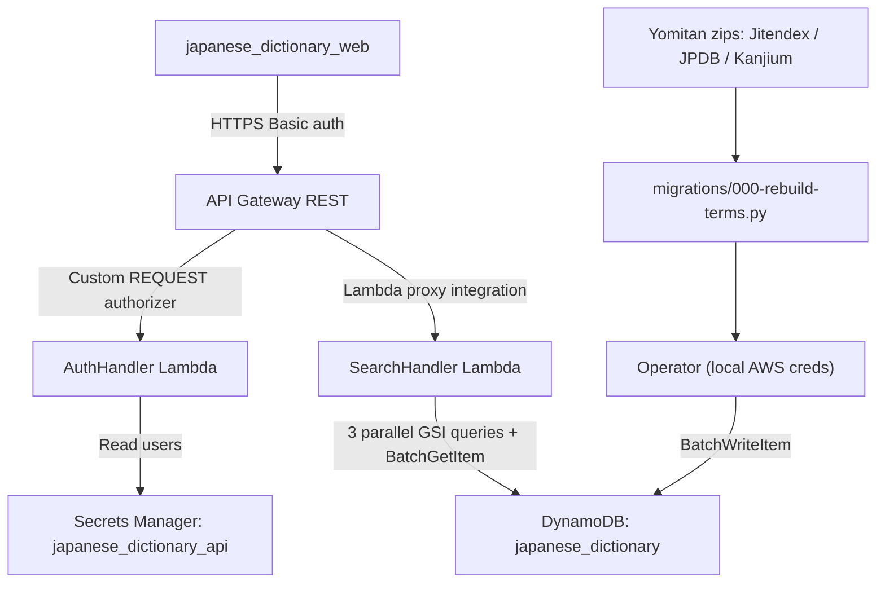
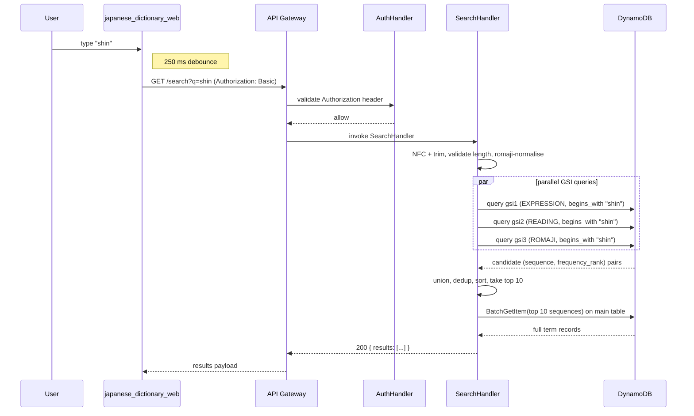
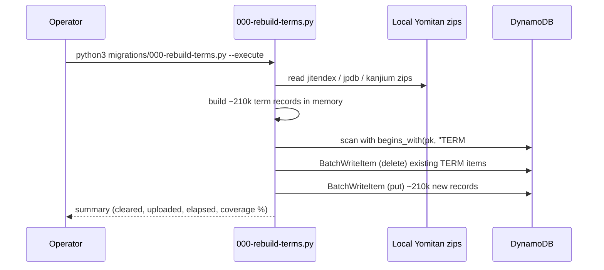

# Japanese dictionary API

The Japanese dictionary API service provides an authenticated HTTP API for prefix-matching a single shared corpus of Japanese terms (~210k canonical headwords) by `expression`, `reading`, or `reading_romaji`, returning the top-10 matches ordered by frequency.

## Overview

- **Service type**: backend API (`japanese_dictionary_api`)
- **Interface**: REST over HTTPS
- **Runtime**: AWS Lambda (Java 21) behind API Gateway REST
- **Primary storage**: DynamoDB single table `japanese_dictionary` with three GSIs
- **Auth model**: API Gateway custom REQUEST authorizer backed by `AuthHandler`
- **Primary consumer**: `japanese_dictionary_web`
- **Data refresh path**: standalone Python migration script (`migrations/000-rebuild-terms.py`) running with local AWS credentials; no Lambda-side ingest API

## User stories

- As a Japanese learner, I want to look up a term by its kanji prefix, so that I can find the canonical entry quickly while reading.
- As a learner who knows only the reading, I want to look up by hiragana or katakana prefix, so that I can find an entry without knowing the kanji.
- As a learner typing on a Latin keyboard, I want to look up by romaji prefix (Hepburn, kunrei, or wapuro), so that I can search without an IME.
- As an authenticated user, I want frequency-ordered results, so that the most commonly used senses surface first.
- As an operator refreshing the corpus, I want a single command on my laptop that clears existing terms and re-uploads from local Yomitan zips, so that the dictionary stays current.

## Features and scope boundaries

### In scope

- Require HTTP Basic authentication on the `/search` endpoint.
- Run prefix searches against three dimensions in parallel (`expression`, `reading`, `reading_romaji`) and union the results.
- Normalise incoming romaji queries (kunrei / wapuro / macron forms) to Modified Hepburn before matching.
- Return up to 10 results ordered by `frequency_rank` ascending with NULLs last and `sequence` ascending tie-break.
- Pass through Yomitan structured-content `glossary_raw` JSON unchanged for client-side rendering.
- Validate query length (≤ 64 characters after NFC + trim); short-circuit empty queries to a 200 with no results.
- Provide an operator migration script that destructively reloads the corpus from local Yomitan zips.

### Out of scope

- Substring or wildcard matching (prefix only).
- Fuzzy / typo-tolerant matching.
- Reverse English → Japanese lookup (no full-text search over gloss content).
- Deinflection of conjugated forms.
- Multi-dictionary support; single source `japanese_dictionary` only.
- Alternate-spelling / variant lookup; only the canonical headword is indexed.
- Pagination or "load more" beyond the top-10 cap.
- Per-user data partitioning; the corpus is read-shared across the single authed user.
- Image-binary hosting for the ~595 Jitendex entries that reference image files; v1 renders inline placeholder text in the consumer.
- Anki / flashcard rendering; audio playback; runtime corpus refresh endpoints.

## Architecture



### Primary workflow — search-as-you-type



### Corpus refresh workflow



## Main technical decisions

- Use API Gateway + Lambda + DynamoDB to stay consistent with every other backend service in the repo and keep infrastructure lightweight.
- Use a shared, non-user-partitioned DynamoDB table because the dictionary corpus is single-tenant read-shared data; HTTP Basic auth gates access without scoping data.
- Use three single-shard GSIs (`gsi1` keyed by `EXPRESSION`, `gsi2` by `READING`, `gsi3` by `ROMAJI`) so prefix matching by each lookup dimension is one `query(begins_with)` call. Constant partition keys keep all data in a single partition (~600 MB, well under the 10 GB limit); first-character sharding is a forward-compatible additive change if scale ever demands it.
- Use a slim `INCLUDE [sequence, frequency_rank]` GSI projection (the covering-index pattern) so a 1-char common-prefix query fits in one ~150 KB DynamoDB page; the bulky `glossary_raw` is fetched only for the 10 winning records via `BatchGetItem` on the main table. This is a deliberate divergence from the repo default `Projection: ALL` (justified by the corpus being ~1000× larger than other services').
- Store `glossary_raw` as a JSON-serialised string attribute, not a DynamoDB map, to bypass the 32-level nesting cap and to simplify enhanced-client mapping. Average serialised size 2–8 KB, well under DynamoDB's 400 KB item limit.
- Always run all three GSI queries in parallel and union the results, rather than auto-detecting input character class to query a single GSI. The wasted RCUs on empty queries are negligible (~3 RCU each), the wall-clock is `max(q1, q2, q3)` rather than the sum, and the union-and-dedup approach handles mixed-script input (e.g., `食べ`) without character-class branching.
- Compute `reading_romaji` (Modified Hepburn with vowel-doubling) at ingest time and persist it; normalise incoming queries (kunrei / wapuro / macron) to the same form at request time before matching.
- Make the migration script the only data-loading mechanism. No `POST /term` write API; `BatchWriteItem` direct from the operator's laptop, with a destructive clear-then-rebuild semantics keyed on `begins_with(pk, "TERM#")`. Matches the existing `migrations/NNN-*.py` pattern in `immersion_tracker_api/` and `event_calendar_api/`.

## Domain glossary

- **Term**: one canonical JMdict headword keyed by its `sequence` integer.
- **Sequence**: JMdict's stable per-headword integer identifier; survives upstream Jitendex revisions, used as the primary key.
- **Expression**: the canonical writing of a term (kanji or kana mixture). Indexed for prefix lookup on `gsi1`.
- **Reading**: the canonical kana-only reading of a term. Indexed for prefix lookup on `gsi2`.
- **Reading romaji**: Modified Hepburn (vowel-doubled, no macrons) computed from `reading` at ingest. Indexed for prefix lookup on `gsi3`.
- **Frequency rank**: JPDB-derived integer (lower = more common); NULL for the ~39% of terms not in JPDB's corpus.
- **Pitch**: kanjium-derived downstep position; `0` = heiban, `1` = atamadaka, `2..N-1` = nakadaka, `N` = odaka where `N` = mora count of `reading`. NULL for the ~59% of terms with no kanjium match or no valid pitch.
- **Glossary raw**: the verbatim Yomitan structured-content JSON tree, stored as a serialised string and rendered client-side.

## Integration contracts

### External systems

- None at runtime. The Lambda handlers do not call any external APIs; the corpus is loaded once via the operator-run migration script and served thereafter from DynamoDB.

### Upstream data sources (consumed only by the migration script, not by Lambda)

- **Jitendex (`jitendex-yomitan.zip`)**: Yomitan-format dictionary providing canonical JMdict headwords plus structured-content glossary trees. The migration script extracts `term_bank_*.json` files, applies argmax-by-score per JMdict `sequence`, and discards redirects.
- **JPDB Frequency Kana (`JPDB_v2.2_Frequency_Kana_*.zip`)**: Yomitan-format frequency dictionary. Joined per `(expression, reading)`; the script takes `min(rank)` across both kanji-form and kana-form (`㋕`-flagged) ranks to surface kana-dominant verbs correctly.
- **Kanjium Pitch Accents (`kanjium_pitch_accents.zip`)**: Yomitan-format pitch dictionary. Joined per `(expression, reading)`; the script picks `pitches[0].position` falling through to subsequent entries if the first fails mora-count validation.

## API contracts

### Conventions

- Base URL: `https://api.japanese-dictionary.jordansimsmith.com`
- Auth: `Authorization: Basic <base64(user:password)>`
- Request and response JSON fields use `snake_case`.
- No path version segment.
- Non-2xx response shape:

```json
{
  "message": "validation error details"
}
```

### Endpoint summary

| Method | Path      | Purpose                                               |
| ------ | --------- | ----------------------------------------------------- |
| `GET`  | `/search` | prefix-match a query and return up to 10 ranked terms |

### `GET /search`

Query parameters:

| Name | Required | Type   | Notes                                                                                     |
| ---- | -------- | ------ | ----------------------------------------------------------------------------------------- |
| `q`  | yes      | string | URL-encoded user query. Empty allowed. Max 64 characters after URL-decoding + NFC + trim. |

Behaviour:

- Empty `q` → `200 { "results": [] }`. Used by the SPA's session-validation step at login, analogous to `GET /templates` in `packing_list_web`.
- Non-empty `q` → run the parallel three-GSI query, union, dedup by `sequence`, sort by `frequency_rank` ASC nulls last with `sequence` ASC tie-break, take top 10, `BatchGetItem` full records, return.
- `q` length > 64 → `400 {"message": "q too long"}`.

Example request:

```
GET /search?q=shin HTTP/1.1
Host: api.japanese-dictionary.jordansimsmith.com
Authorization: Basic <base64>
```

Example response `200`:

```json
{
  "results": [
    {
      "sequence": 1316830,
      "expression": "新橋",
      "reading": "しんばし",
      "reading_romaji": "shinbashi",
      "frequency_rank": 18472,
      "pitch": 0,
      "glossary_raw": { "tag": "div", "content": "..." }
    }
  ]
}
```

Field semantics:

- `sequence` — integer, JMdict ID, stable across upstream Jitendex refreshes.
- `expression` — string, canonical writing.
- `reading` — string, canonical reading (kana).
- `reading_romaji` — string, Modified Hepburn vowel-doubled form computed at ingest.
- `frequency_rank` — integer or `null`. Lower = more common. `null` when the term is not present in JPDB's corpus.
- `pitch` — integer or `null`. `0` = heiban; `1` = atamadaka; `2..N-1` = nakadaka; `N` = odaka where `N` = mora count of `reading`. `null` when no kanjium match or no valid pitch.
- `glossary_raw` — Yomitan structured-content JSON tree, passed through unchanged for client-side rendering.

Representative key failures:

| Status | Body                              | Cause                                         |
| ------ | --------------------------------- | --------------------------------------------- |
| `400`  | `{"message":"q too long"}`        | `q` length > 64 after URL-decode + NFC + trim |
| `401`  | `{"message":"<gateway message>"}` | Missing or invalid Basic auth                 |

### Validation rules

- `q` is decoded once from the URL, NFC-normalised, and trimmed of leading/trailing ASCII whitespace before length and character checks.
- Length > 64 (after NFC + trim) is rejected with `400`.
- Empty `q` is allowed and short-circuits to `{"results": []}` without touching DynamoDB.
- No character whitelisting beyond NFC; users may paste arbitrary Unicode (it just won't match anything if it isn't a valid prefix).

### Romaji query normalisation

Incoming `q` is run through `RomajiNormaliser` before matching `gsi3`. Steps in fixed order:

1. Lowercase.
2. Replace each macron / circumflex with the doubled vowel (`ō → ou`, `ô → ou`, `ā → aa`, `ē → ee`, `ī → ii`, `ū → uu`).
3. Replace kunrei / wapuro digraphs:
   - `sy[aiueo]` → `sh[aiueo]` (`sya → sha`, etc.)
   - `ty[aiueo]` → `ch[aiueo]`
   - `zy[aiueo]` → `j[aiueo]`
   - Standalone consonants: `si → shi`, `ti → chi`, `tu → tsu`, `hu → fu`, `zi → ji`, `di → ji`, `du → zu`.
4. Strip apostrophes (`n'a → na`).

Idempotent: running the normaliser on already-normalised input is a no-op.

## Data and storage contracts

### DynamoDB model

- **Table name**: `japanese_dictionary`
- **Billing**: `PAY_PER_REQUEST`.
- **Primary key**:
  - `pk`: `TERM#<sequence>` (string)
  - `sk`: `TERM#<sequence>` (string, identical to `pk`; the redundant duplication keeps the table compatible with the existing repo single-table convention while leaving headroom for future non-`TERM#` item types).
- **Item type**:
  - `TERM#<sequence>` — the only item type in v1; carries the full term record.
- **Point-in-time recovery**: enabled.
- **Deletion protection**: enabled.

### Global secondary indexes

| GSI    | Partition key (S)       | Sort key (S)                | Projection                           |
| ------ | ----------------------- | --------------------------- | ------------------------------------ |
| `gsi1` | `gsi1pk = "EXPRESSION"` | `gsi1sk = <expression>`     | `INCLUDE [sequence, frequency_rank]` |
| `gsi2` | `gsi2pk = "READING"`    | `gsi2sk = <reading>`        | `INCLUDE [sequence, frequency_rank]` |
| `gsi3` | `gsi3pk = "ROMAJI"`     | `gsi3sk = <reading_romaji>` | `INCLUDE [sequence, frequency_rank]` |

Each partition key is a constant string (single-shard design); each sort key is the raw indexed value with no decoration. DynamoDB GSIs accept duplicate `(pk, sk)` tuples — homophones (e.g., `こころ` for 心 / 真 / 衷) coexist as multiple `gsi2` rows with identical `gsi2sk`. The Lambda dedups by `sequence` after unioning the three GSI query results. `begins_with(gsi1sk, "新")` matches `"新橋"`, `"新しい"`, etc. with natural prefix semantics.

The slim `INCLUDE` projection is exactly what the handler needs to dedup, sort with NULLs last, and pick the top 10 before fetching full records — `glossary_raw` and other text fields stay off the GSIs to keep per-row size at ~100 bytes.

### Representative record

```json
{
  "pk": "TERM#1316830",
  "sk": "TERM#1316830",
  "sequence": 1316830,
  "expression": "新橋",
  "reading": "しんばし",
  "reading_romaji": "shinbashi",
  "frequency_rank": 18472,
  "pitch": 0,
  "glossary_raw": "{\"tag\":\"div\",\"content\":\"...\"}",
  "gsi1pk": "EXPRESSION",
  "gsi1sk": "新橋",
  "gsi2pk": "READING",
  "gsi2sk": "しんばし",
  "gsi3pk": "ROMAJI",
  "gsi3sk": "shinbashi"
}
```

Required attributes on every TERM item: `pk`, `sk`, `sequence`, `expression`, `reading`, `reading_romaji`, `glossary_raw`, `gsi1pk`, `gsi1sk`, `gsi2pk`, `gsi2sk`, `gsi3pk`, `gsi3sk`.

Optional attributes: `frequency_rank`, `pitch` (integer or absent; absent attribute means NULL — no JPDB / kanjium match).

### Access patterns

| Use case                                     | Operation                                                                      | Notes                                                                   |
| -------------------------------------------- | ------------------------------------------------------------------------------ | ----------------------------------------------------------------------- |
| Prefix search by expression (kanji + mixed)  | `query(gsi1)` with `pk = "EXPRESSION" AND begins_with(sk, q)`                  | returns `(sequence, frequency_rank)` pairs                              |
| Prefix search by reading (kana)              | `query(gsi2)` with `pk = "READING" AND begins_with(sk, q)`                     | same shape                                                              |
| Prefix search by romaji (post-normalisation) | `query(gsi3)` with `pk = "ROMAJI" AND begins_with(sk, qNormalised)`            | same shape                                                              |
| Hydrate top 10 with full glossary            | `BatchGetItem` on main table                                                   | `pk = sk = "TERM#<sequence>"` for each of up to 10 sequences            |
| Migration clear                              | `scan` with `FilterExpression="begins_with(pk, :p)"`, `BatchWriteItem` deletes | full table scan; chunks of 25 deletes; retry on `UnprocessedItems`      |
| Migration upload                             | `BatchWriteItem` puts                                                          | chunks of 25; retry on `UnprocessedItems`; adaptive sleep on throttling |

## Behavioral invariants and time semantics

- The dictionary corpus is shared, read-only data; there is no per-user partition. Auth gates access only.
- `q` is NFC-normalised and trimmed before length validation and matching.
- Empty `q` deterministically returns `{"results": []}` without touching DynamoDB.
- Non-empty `q` always runs all three GSI queries in parallel; the result is the union deduplicated by `sequence`.
- Result ordering: `frequency_rank` ascending with NULLs last, `sequence` ascending as tie-break. Stable across requests for a fixed corpus.
- Top-10 cap is hard; clients cannot request more.
- Romaji normalisation is idempotent: `normalise(normalise(x)) == normalise(x)`.
- The migration script's clear step is keyed on `begins_with(pk, "TERM#")` so any future non-`TERM#` items in the same table are not affected.
- Each migration run fully replaces the corpus; there is no incremental upsert path. The act of running the script is the version bump (no `corpus_version` attribute).

## Source of truth

| Entity                 | Authoritative source                                   | Notes                                                                             |
| ---------------------- | ------------------------------------------------------ | --------------------------------------------------------------------------------- |
| User identity          | Basic auth username                                    | parsed from `Authorization` header in authorizer and request context              |
| Credential set         | Secrets Manager secret `japanese_dictionary_api`       | read by `AuthHandler`; never logged                                               |
| Term records           | DynamoDB `TERM#<sequence>` items                       | populated exclusively by `migrations/000-rebuild-terms.py`                        |
| Frequency rank values  | JPDB Frequency Kana zip (consumed at ingest)           | persisted on each term as `frequency_rank`; `null` when not in JPDB               |
| Pitch values           | Kanjium Pitch Accents zip (consumed at ingest)         | persisted on each term as `pitch`; `null` when no kanjium match or no valid pitch |
| Glossary content       | Jitendex zip (consumed at ingest)                      | persisted verbatim as `glossary_raw` JSON string                                  |
| Romaji form            | Computed from `reading` at ingest by the Python script | persisted as `reading_romaji`                                                     |
| Search result ordering | Lambda code (`SearchHandler`)                          | derived from persisted `frequency_rank` and `sequence`                            |

## Security and privacy

- API Gateway custom REQUEST authorizer (`AuthHandler`) enforces HTTP Basic authentication before any handler executes. `OPTIONS` preflight is `NONE` (MOCK integration with CORS headers).
- Credentials live in AWS Secrets Manager (`japanese_dictionary_api`); read by `AuthHandler` at runtime via least-privilege IAM. Never logged.
- The migration script uses the operator's local AWS credentials (`AWS_ACCESS_KEY_ID` / `AWS_SECRET_ACCESS_KEY`); no in-AWS credential is involved in the data load.
- No per-user data partition; the corpus is shared. The Basic auth gate exists as access control, not data scoping.
- No PII; the corpus is publicly available Japanese language data.
- Transport is HTTPS via API Gateway custom domain `api.japanese-dictionary.jordansimsmith.com`.
- CORS allowed origin is `https://japanese-dictionary.jordansimsmith.com` only.
- CloudWatch logs include `q` query strings (the words the user looked up). Acceptable at personal scale; explicitly noted.

## Configuration and secrets reference

### Environment variables

No service-specific environment variables are consumed by handlers in current scope. Behaviour is configured via code constants and Terraform-managed resources (table name, secret name, CORS origin).

| Name     | Required | Purpose                                                                  | Default behaviour                                           |
| -------- | -------- | ------------------------------------------------------------------------ | ----------------------------------------------------------- |
| `(none)` | n/a      | configuration is via code constants and Terraform-managed resources only | table name, secret name, and CORS origin come from defaults |

### Secret shape

Expected JSON payload for the `japanese_dictionary_api` Secrets Manager secret:

```json
{
  "users": [
    {
      "user": "alice",
      "password": "strong-password"
    }
  ]
}
```

No third-party API keys (the dictionary corpus is locally produced — no runtime calls to external APIs).

## Performance envelope

- Lambda sizing: `AuthHandler` runs at `512 MB` memory / `10 s` timeout (repo default); `SearchHandler` at `1024 MB` memory / `5 s` timeout (bumped above default for parallel SDK calls + Jackson tree parsing).
- DynamoDB: `PAY_PER_REQUEST` billing. Three GSIs with slim `INCLUDE` projection. Estimated table size: ~600 MB main + ~50 MB GSI projections = ~650 MB.
- Read path latency budget (warm path):
  - 30–50 ms HTTPS round-trip (Auckland → ap-southeast-2)
  - ~30 ms for the parallel three-GSI query (max of three)
  - ~30 ms for the `BatchGetItem` of top 10
  - ~10 ms for JSON parsing of `glossary_raw` × 10
  - **Total keystroke-to-pixel ~400 ms** (250 ms debounce dominates).
- Cold start adds ~500 ms one-off.
- Migration write path: ~1000 WCU sustained = ~1 MB/s. Full ~210k-item reload completes in ~10–15 minutes including retries.
- No formal latency SLO at v1; sized for personal workload only.

## Testing and quality gates

- Unit tests cover `AuthHandler` allow/deny + Base64 edge cases, `RomajiNormaliser` per-rule cases plus idempotency, `PitchPosition` mora counting + validation, `JapaneseDictionaryItem` key formatting, `SearchHandler` input validation + sort ordering + dedup + top-N truncation against fake DynamoDB clients.
- Integration tests run `SearchHandler` against DynamoDB Testcontainers with ~5 hand-picked seed terms covering: kanji-only, kana-only, kanji+reading with non-NULL `frequency_rank`, term with non-NULL `pitch`, term whose glossary references an image (placeholder rendering case). Asserts prefix match across all three dimensions, frequency-asc ordering, top-10 cap, empty `q` short-circuit, dedup correctness when a term is reachable via multiple GSIs.
- E2E tests use LocalStack (API Gateway + Lambda + DynamoDB + Secrets Manager) and exercise the full HTTP flow: `GET /search?q=新` returns the seed fixture, `GET /search?q=` returns `[]`, missing `Authorization` returns `401`, `q` length > 64 returns `400`. Deterministic; no outbound internet; no real AWS credentials.
- Required service checks:
  - `bazel build //japanese_dictionary_api:all`
  - `bazel test //japanese_dictionary_api:all`
- Repository-level post-change checks (per `AGENTS.md`):
  - `bazel mod tidy`
  - `bazel run //:format`

## Local development and smoke checks

- Run focused suites:
  - `bazel test //japanese_dictionary_api:unit-tests`
  - `bazel test //japanese_dictionary_api:integration-tests`
  - `bazel test //japanese_dictionary_api:e2e-tests`
- Run the migration script in dry-run mode (no writes):
  - `python3 japanese_dictionary_api/migrations/000-rebuild-terms.py --jitendex <path> --jpdb <path> --kanjium <path>`
  - Prints the count summary and frequency / pitch coverage without touching DynamoDB.
- Run the migration script in destructive mode:
  - Same command with `--execute` appended.
  - Requires `AWS_ACCESS_KEY_ID` and `AWS_SECRET_ACCESS_KEY` exported in the shell.
  - Clears all `TERM#...` items, then uploads ~210k fresh records. ~10–15 minutes.
- Minimal smoke flow against the deployed sandbox:
  1. `GET /search?q=新` returns one or more `SearchResult`s with `expression` starting with `新`.
  2. `GET /search?q=しん` returns kana-prefix matches.
  3. `GET /search?q=shin` returns romaji-prefix matches.
  4. `GET /search?q=` returns `{"results": []}`.
  5. Missing `Authorization` header returns `401` with `WWW-Authenticate: Basic`.

## End-to-end scenarios

### Scenario 1: kanji prefix lookup

1. The user types `新` into `japanese_dictionary_web`.
2. After 250 ms of no further keystrokes, the SPA sends `GET /search?q=%E6%96%B0`.
3. API Gateway authorises the request via `AuthHandler`.
4. `SearchHandler` runs three parallel GSI queries, finds matches in `gsi1` (`EXPRESSION` partition), unions and dedups, sorts by `frequency_rank` ASC nulls last.
5. `SearchHandler` `BatchGetItem`s the top 10 sequences and returns full term records including `glossary_raw`.
6. The SPA renders 10 expanded entries.

### Scenario 2: romaji prefix lookup with normalisation

1. The user types `tu` (kunrei-shiki for `つ`) into the SPA.
2. The SPA sends `GET /search?q=tu`.
3. `SearchHandler` runs `RomajiNormaliser` over `q`, producing `tsu`.
4. The three GSI queries fire; `gsi3` (`ROMAJI`) finds prefix matches against `tsu`.
5. Top-10 sorted by frequency are returned.

### Scenario 3: refresh the corpus from new upstream Yomitan zips

1. The operator downloads fresh `jitendex-yomitan.zip`, `JPDB_*.zip`, and `kanjium_pitch_accents.zip` to the local machine.
2. The operator exports `AWS_ACCESS_KEY_ID` and `AWS_SECRET_ACCESS_KEY`.
3. Operator runs `python3 japanese_dictionary_api/migrations/000-rebuild-terms.py --jitendex ... --jpdb ... --kanjium ...` (no `--execute`) to dry-run.
4. Reviews the printed summary (item counts, coverage percentages) for sanity.
5. Re-runs with `--execute`. The script clears all `TERM#...` items, then uploads ~210k fresh records.
6. The next `GET /search` call hits the freshly populated table.
