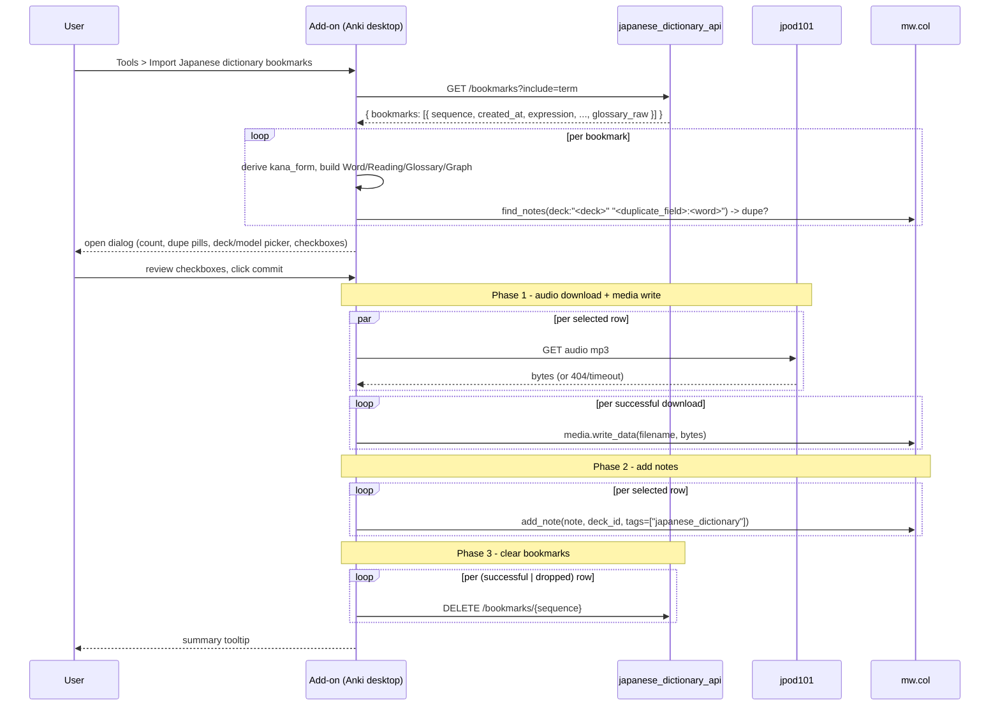

# Japanese dictionary Anki add-on

The Japanese dictionary Anki desktop add-on imports terms the user has bookmarked through `japanese_dictionary_api` into the user's Anki collection as `Animecards`-format notes.

## Overview

- **Service type**: Anki desktop add-on (Python 3.9+ inside Anki's PyQt6 runtime)
- **Interface**: Tools menu action `Import Japanese dictionary bookmarks`
- **Distribution**: Bazel-built `.ankiaddon` zip (`bazel build //japanese_dictionary_api:addon-package`)
- **Auth**: HTTP Basic via `JAPANESE_DICTIONARY_USER` / `JAPANESE_DICTIONARY_PASSWORD` environment variables, same credentials as the SPA
- **API surface consumed**: `GET /bookmarks?include=term`, `DELETE /bookmarks/{sequence}` on `japanese_dictionary_api`; jpod101 audio CDN (`https://assets.languagepod101.com/...`)
- **Anki API surface consumed**: `aqt.mw`, `aqt.gui_hooks.main_window_did_init`, `aqt.qt.QAction`, `aqt.utils.tooltip`, `aqt.operations.QueryOp`, plus `mw.col.find_notes`, `mw.col.add_note`, `mw.col.media.write_data`, `mw.col.decks.all_names_and_ids`, `mw.col.models.all_names_and_ids`

## User stories

- As a learner who bookmarked terms on my phone, I want a single menu action on Anki desktop that pulls those bookmarks, builds matching cards, and adds them to my deck, so that I don't have to manually re-look-up each term.
- As an Animecards user, I want imported cards to populate the same `Word`, `Reading`, `Glossary`, `Audio`, `Graph` fields my Yomitan + AnkiConnect workflow produces, so that the new cards look indistinguishable from the ones I've made before.
- As a learner reviewing a batch of bookmarks before commit, I want duplicates auto-detected against my current deck and unchecked by default, so that I don't accidentally add the same word twice.
- As a learner cleaning up the queue, I want unchecked rows on commit to also be unbookmarked at the API, so that rejected items don't reappear in every future dialog.
- As an operator, I want each successful import to clear the corresponding bookmark at the API automatically, so that the SPA on my phone reflects the up-to-date queue without manual cleanup.

## Features and scope boundaries

### In scope

- Register a single Tools menu action labelled `Import Japanese dictionary bookmarks` on Anki startup via `gui_hooks.main_window_did_init`.
- Fetch bookmarks with hydrated term records (`GET /bookmarks?include=term`).
- Derive `kana_form` per bookmark by walking `glossary_raw` (looking for the Jitendex `"uk"` misc-info marker), falling back to `expression == reading`.
- Build the prospective note in memory: `Word` (kana form picks `reading`, otherwise `expression`), `Reading`, `Glossary` (Python port of Yomitan's `structured-content-generator.js`, inline styles, no bundled CSS), `Graph` (Python port of Yomitan's `pronunciation-generator.js` simple-style SVG, inline styles), `Audio` (jpod101 URL → MP3 download → `[sound:<filename>]`).
- Open one modal dialog with the bookmark list, checkboxes (all checked except duplicates), deck and note-type pickers, footer warning + drop-count when any rows are unchecked, and a `Cancel` / commit button pair.
- On commit, run a three-phase background `QueryOp`: (1) parallel audio download + sequential `mw.col.media.write_data`, (2) sequential `mw.col.add_note`, (3) sequential `DELETE /bookmarks/{sequence}` for both successful imports and explicitly-dropped rows.
- Tag every imported note with `japanese_dictionary`.
- Detect duplicates locally with `mw.col.find_notes(f'deck:"<deck>" "<duplicate_field>:<word>"')` at dialog-open time only.
- Surface a summary tooltip on completion (imported / imported-without-audio / dropped / duplicates skipped / failed).
- Render glossary image nodes as inline placeholder text (`[image: <description-or-path>]`), matching the SPA.
- Rewrite internal glossary links (`href` starting with `?`) to `https://japanese-dictionary.jordansimsmith.com/search<href>` so clicking from Anki opens the SPA in a browser.

### Out of scope

- Automatic / scheduled / sync-lifecycle imports. Manual menu action only.
- Editing of any field inside the dialog before commit. The only controls are the per-row checkbox, deck picker, and note-type picker.
- Per-row sentence input. The data model has no sentence field; users add sentences in Anki post-import if desired.
- Importing into a different note type per row. Note type is one global picker.
- Audio sources other than jpod101. No fallback to Jisho / TTS / custom URL in v1.
- Image-binary download or hosting; image nodes render as `[image: ...]` placeholders.
- An `imported` status flag server-side or an audit log. Successful import = bookmark deleted = forgotten by the API.
- AnkiMobile or AnkiWeb support. Desktop Anki only.
- A `clear all` / `remove from queue` affordance separate from import.
- Bundled CSS. Inline styles in emitted HTML and SVG carry all visual rendering.
- Server-side `kana_form` storage; derived client-side.

## Architecture

```mermaid
flowchart TD
  user[User] -->|Tools menu click| addon[Anki desktop add-on]
  addon -->|GET /bookmarks?include=term| api[japanese_dictionary_api]
  api --> dynamo[(DynamoDB japanese_dictionary)]
  addon -->|GET audiomp3.php| jpod101[(jpod101 audio CDN)]
  addon -->|mw.col.find_notes / add_note| ankiCol[(Anki collection)]
  addon -->|mw.col.media.write_data| ankiMedia[(Anki media store)]
  addon -->|DELETE /bookmarks/{seq}| api
```

### Primary workflow



## Main technical decisions

- **Manual menu trigger only**: matches the existing `Run backup now` action in `anki_backup_api/addon/anki_backup.py`. No automatic polling, no sync-lifecycle hook. Single explicit user action keeps state simple and predictable.
- **Single dialog, no per-row preview**: the dialog renders one row per bookmark with Word / Reading / freq / duplicate pill. No per-row expansion. Rationale: the user already reviewed each term when bookmarking on phone; the dialog's job is to confirm and let them drop entries they no longer want.
- **Default-checked except duplicates**: every row is pre-checked unless `mw.col.find_notes` flags it as already present in the configured deck. The user can flip any checkbox manually.
- **Drop-on-commit semantics**: unchecked rows are unbookmarked at the API on commit (just like imported rows). Treats the dialog as a complete review pass. Cancel always preserves all bookmarks. Signposted in three ways: commit button label includes drop count when non-zero (`"Import 7 (drop 3)"`), footer warning label visible when any rows are unchecked, summary tooltip reports drops separately from imports.
- **Client-side `kana_form` derivation**: walk `glossary_raw` for the Jitendex `"uk"` misc-info marker; fall back to `expression == reading`. No new API field, no migration. If the heuristic ever proves fragile across Jitendex versions, we can promote `kana_form` to a `TermItem` attribute via a one-line migration update without changing the add-on's public seam.
- **Faithful Yomitan port for glossary HTML and pitch graph SVG**: matches the visual style of cards the user already makes with Yomitan + AnkiConnect. Inline styles in emitted HTML/SVG so no CSS bundling is required.
- **jpod101 only for audio**: deterministic URL `https://assets.languagepod101.com/dictionary/japanese/audiomp3.php?kanji=<expression>&kana=<reading>` (kanji omitted when `kana_form`). Per `_getInfoJpod101` in Yomitan's `audio-downloader.js`. Audio download failure is degraded gracefully — the note is imported without the Audio field populated and counted as `imported_without_audio`.
- **Three-phase commit pipeline**: (1) parallel audio download via `ThreadPoolExecutor` + sequential `mw.col.media.write_data` on the main thread (since `mw.col` is not thread-safe), (2) sequential `mw.col.add_note`, (3) sequential `DELETE /bookmarks/{sequence}` for both successful imports and dropped unchecked rows. Per-phase loops are easier to reason about than mixed per-row chains; parallel audio download cuts commit wall-clock from `sum` to `max` across rows.
- **Tests via pytest, py_test target**: pure-function ports (`structured_content`, `pitch_graph`, `kana_form`, `audio`) have unit tests using `@pytest.mark.parametrize` for table-driven cases. UI (dialog) and integration (entry point, HTTP, file I/O) code is exercised by manual smoke in Anki rather than automated tests.

## Configuration and secrets reference

### Environment variables

| Name                           | Required | Purpose                                                         | Default                                              |
| ------------------------------ | -------- | --------------------------------------------------------------- | ---------------------------------------------------- |
| `JAPANESE_DICTIONARY_USER`     | yes      | HTTP Basic auth username for `japanese_dictionary_api`          | n/a — error tooltip if unset at import time          |
| `JAPANESE_DICTIONARY_PASSWORD` | yes      | HTTP Basic auth password for `japanese_dictionary_api`          | n/a — error tooltip if unset at import time          |
| `JAPANESE_DICTIONARY_API_URL`  | no       | Override the API base URL for testing against a different stack | `https://api.japanese-dictionary.jordansimsmith.com` |

Anki has no built-in env-var injection; the user exports these in their shell before launching Anki (typical pattern: `~/.zshrc` or platform equivalent). Same shape as `anki_backup_api/addon/anki_backup.py`'s env-var contract.

### `config.json` (Anki add-on config)

Shipped defaults persisted via Anki's add-on config (`mw.addonManager.getConfig`):

```json
{
  "deck": "Mining",
  "note_type": "Animecards",
  "field_mapping": {
    "Word": "Word",
    "Reading": "Reading",
    "Glossary": "Glossary",
    "Audio": "Audio",
    "Graph": "Graph"
  },
  "tag": "japanese_dictionary",
  "duplicate_field": "Word",
  "api_url": "https://api.japanese-dictionary.jordansimsmith.com"
}
```

Users edit via Anki's standard `Config` button on the Add-ons screen.

## Behavioral invariants

- A bookmark is either present (queued) or absent (resolved). There is no `imported` flag server-side; the Anki collection is the source of truth for what's been imported.
- Successful imports and explicit drops both clear the bookmark at the API. Failures (e.g. `add_note` rejected, jpod101 timeout when audio is required) leave the bookmark in place.
- A row is counted as `imported_without_audio` when `add_note` succeeds but the Audio field could not be populated (download or content-type check failed). The bookmark is still cleared.
- Dangling bookmarks (sequence absent from the corpus, e.g. after a Jitendex refresh) are silently omitted from the dialog. They remain bookmarked at the API and will only re-surface if a future corpus refresh re-adds the term.
- Duplicate detection runs once at dialog open, not at commit time. The user can manually re-enable a duplicate to force-add it; Anki's own duplicate-detection on `add_note` will then decide whether to accept.
- The add-on never modifies the `Animecards` model, deck templates, or styling. It only reads existing model / field metadata and writes new notes.

## Source of truth

| Entity                  | Authoritative source                                              | Notes                                                                                                 |
| ----------------------- | ----------------------------------------------------------------- | ----------------------------------------------------------------------------------------------------- |
| Queued bookmarks        | `japanese_dictionary_api`'s `BOOKMARK#` rows                      | fetched per `GET /bookmarks?include=term`; the addon never writes bookmarks server-side               |
| Term records            | `japanese_dictionary_api`'s `TERM#` rows                          | hydrated into each `Bookmark` row by the API when `?include=term` is set                              |
| Audio binaries          | jpod101 CDN                                                       | fetched anonymously; downloaded bytes are written to Anki's media store and never persisted otherwise |
| Imported notes          | User's Anki collection                                            | created via `mw.col.add_note`; the addon never updates or deletes existing notes                      |
| Deck / note-type config | Anki add-on config persisted by `mw.addonManager`                 | seeded from the shipped `config.json` defaults                                                        |
| HTTP credentials        | User shell environment (`JAPANESE_DICTIONARY_USER` / `_PASSWORD`) | read fresh on every request; never persisted by the add-on                                            |

## Security and privacy

- Credentials are read from environment variables on every request and passed to `requests.request` via `auth=(user, password)`. Never logged. Errors that quote env-var presence (e.g. `"JAPANESE_DICTIONARY_USER is not set"`) never include the value.
- HTTPS for the API and jpod101 audio. No certificate pinning beyond `requests`'s defaults.
- Audio binary validation is minimal: confirm `Content-Type` starts with `audio/`. Worst case a "no audio available" stub file ends up in the user's media store; the user can re-record manually.
- No PII crossing the network. Bookmarks are JMdict sequence integers + epoch timestamps; jpod101 fetches are anonymous headword/reading lookups.
- Anki collection writes are scoped to `mw.col.media.write_data` (write-only, new files only) and `mw.col.add_note` (new notes only). The addon never updates or deletes existing notes, models, or templates.

## Performance envelope

- **Dialog open**: `GET /bookmarks?include=term` (~150–300 ms warm path) + per-row local `find_notes` queries (~1 ms each, ~100 ms for 100 bookmarks). Dialog renders inside Anki's "instant" budget at expected scale.
- **Commit**: dominated by Phase 1 (jpod101 audio download, ~200–800 ms per row). Parallelised via `ThreadPoolExecutor`; wall-clock ≈ `max(per-row download)` capped at the executor pool size. For 10 rows, Phase 1 is ~1 s instead of ~5 s sequential. Phase 2 is ~10 ms × N rows for `add_note`. Phase 3 is ~50 ms × N rows for sequential `DELETE`s. Total for 10 rows: ~2 s vs the per-row chain's ~10 s.
- **Glossary HTML render**: single-pass tree walk, ~5–20 ms per term in pure Python with `xml.etree.ElementTree`. Done in memory before dialog opens.
- **Pitch graph SVG render**: ~1 ms per term. Negligible.
- **Memory footprint**: hundred bookmarks × ~5 KB per `Bookmark` ≈ 500 KB at dialog open. Trivial.

No formal SLO; sized for personal workload only.

## Testing and quality gates

- Pure-function ports (`structured_content`, `pitch_graph`, `kana_form`, `audio`) have `pytest` unit tests with `@pytest.mark.parametrize` for table-driven cases. New `addon/test_*.py` files are picked up automatically by the `addon-unit-tests` py_test target via `pytest` discovery.
- UI (`dialog.py`) and integration (`japanese_dictionary.py` orchestration, `api_client.py` HTTP) code is exercised by manual smoke in Anki.
- Required checks:
  - `bazel build //japanese_dictionary_api:addon-package`
  - `bazel test //japanese_dictionary_api:addon-unit-tests`
- Repository-level checks (per `AGENTS.md`):
  - `bazel mod tidy`
  - `bazel run //:format`

## Local development and smoke checks

- Build the `.ankiaddon` zip:
  - `bazel build //japanese_dictionary_api:addon-package`
  - Output: `bazel-bin/japanese_dictionary_api/japanese-dictionary-importer.ankiaddon`
- Install in Anki desktop:
  - Tools > Add-ons > Install from file → pick the `.ankiaddon`.
  - Restart Anki.
- Run the addon unit tests:
  - `bazel test //japanese_dictionary_api:addon-unit-tests`
- Manual smoke flow (after installing in Anki):
  1. Export `JAPANESE_DICTIONARY_USER` and `JAPANESE_DICTIONARY_PASSWORD` in the shell that launches Anki.
  2. Use the SPA on phone to bookmark a few terms.
  3. In Anki desktop, click Tools → Import Japanese dictionary bookmarks.
  4. The dialog should show one row per bookmark with Word / Reading / freq, duplicates flagged.
  5. Confirm; the progress dialog runs, then the summary tooltip appears.
  6. Check the Mining deck — new `Animecards`-tagged notes appear with Word, Reading, Glossary, Audio, Graph populated.
  7. Reload the SPA on phone — the imported bookmarks are gone from the queue.

## End-to-end scenarios

### Scenario 1: typical bookmark-import-clear loop

1. The user bookmarks 10 terms via the SPA on phone over the course of a day.
2. At their laptop, they launch Anki with `JAPANESE_DICTIONARY_USER` / `_PASSWORD` exported.
3. They click Tools → Import Japanese dictionary bookmarks.
4. The dialog opens with all 10 rows pre-checked.
5. They commit. The progress dialog reports phase 1 (audio download), phase 2 (notes added), phase 3 (bookmarks cleared at the API).
6. Summary tooltip: `"Imported 10"`.
7. Reloading the SPA on phone shows zero queued bookmarks.

### Scenario 2: duplicate handling

1. The user has previously imported `新橋` (sequence 1316830) and re-bookmarks it on the phone.
2. They run the import flow on desktop.
3. The dialog shows the row unchecked, with a `[duplicate]` tag (the configured deck already has a note where `Word == 新橋`).
4. The user leaves it unchecked and clicks commit.
5. Phase 3 runs `DELETE /bookmarks/1316830`, removing the stale bookmark; no Anki write.
6. Summary tooltip: `"Imported 0 (1 dropped, 1 duplicate skipped)"`.

### Scenario 3: audio failure degrades gracefully

1. The user bookmarks a rare term whose jpod101 audio file 404s.
2. They run the import flow.
3. Phase 1 logs the audio failure; `audio_files[sequence]` is `None`.
4. Phase 2 calls `add_note` without populating the Audio field.
5. Phase 3 runs `DELETE /bookmarks/{sequence}` — the import succeeded structurally.
6. Summary tooltip: `"Imported 1 (1 without audio)"`. The user can re-record audio in Anki later.

### Scenario 4: dangling bookmark after corpus refresh

1. A previous Jitendex refresh removed sequence 9999999, but the user's old bookmark for it remains in DynamoDB.
2. They run the import flow.
3. `GET /bookmarks?include=term` silently drops the dangling row server-side.
4. The dialog shows the user's other bookmarks but not the dangling one.
5. The dangling bookmark stays in DynamoDB; no surface to clean it up in v1. It would only re-appear if a future corpus refresh re-adds the term.
