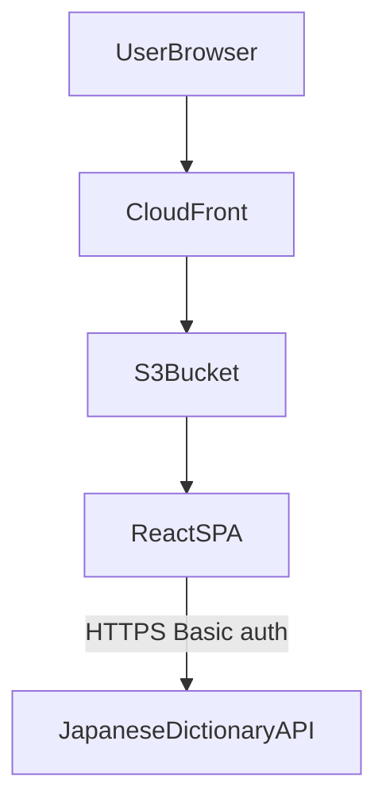
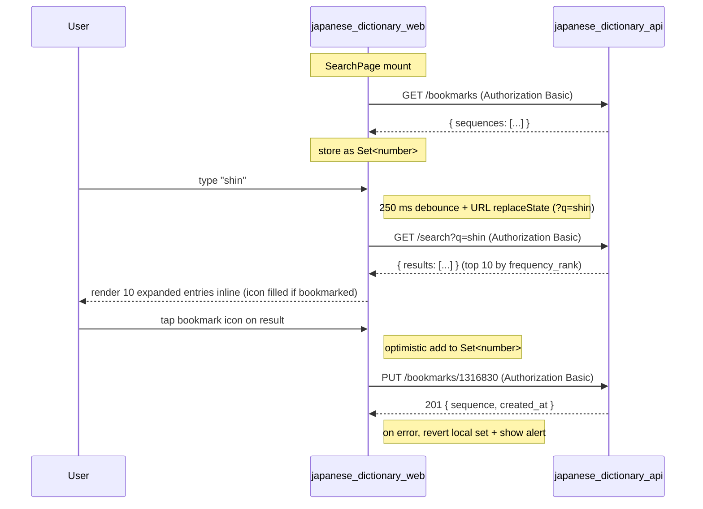

# Japanese dictionary web

The Japanese dictionary web service is a single-page app that lets an authenticated user prefix-search a Japanese term corpus by romaji, kana, or kanji and view the matched entries with frequency rank and pitch accent inline.

## Overview

- **Service type**: web client (`japanese_dictionary_web`)
- **Interface**: browser SPA served via CloudFront and S3
- **Frontend stack**: React + TypeScript + Vite + Mantine + React Router
- **Primary backend**: `japanese_dictionary_api`
- **Primary user**: single-user personal Japanese dictionary lookup

## User stories

- As a Japanese learner, I want to type a romaji prefix and see the most common matching terms surface within a heartbeat, so that I can find the word I'm half-remembering quickly.
- As a learner reading on my phone, I want kana and kanji prefix lookup with mobile-first thumb-reach UI, so that the app is comfortable to use one-handed.
- As a learner studying at my desk, I want the same layout to reflow nicely on desktop, so that I can use the dictionary at any screen size without context switching.
- As a learner reviewing a result, I want the entry rendered fully inline with its glossary, frequency rank, and pitch dot graph, so that I can read the full entry without an extra click.
- As a returning user, I want my login session to persist across browser reloads, so that I can resume looking up words without re-authing each time.
- As a user sharing a result, I want the URL to reflect the current query (e.g., `?q=しん`), so that I can bookmark or copy a specific lookup.
- As a learner doing lookups, I want a bookmark button on each search result, so that I can flag a word for later flashcard creation in one tap.
- As a returning learner, I want each result that I have already bookmarked to render in a "bookmarked" state, so that I don't bookmark the same word twice.

## Features and scope boundaries

### In scope

- Authenticate with username/password against the backend, persist a Basic auth token in `localStorage`.
- Protect the search route and redirect unauthenticated users to the login form.
- Single search page with a debounced (~250 ms) text input that mirrors `?q=<query>` to the URL via `replaceState`.
- Run lookups via a typed `ApiClient` interface with HTTP and fake implementations swapped on `import.meta.env.PROD`.
- Render up to 10 results, fully expanded inline, ordered by `frequency_rank` ascending with NULLs last.
- Per-entry header showing `expression`, `reading`, `reading_romaji`, and the raw `frequency_rank` integer.
- Per-entry body rendering the Yomitan structured-content `glossary_raw` JSON tree with hand-authored CSS targeting `data-sc-*` selectors.
- Per-entry pitch dot graph (SVG port of Yomitan's `pronunciation-generator.js`) when `pitch` is non-NULL, plus the pitch-pattern label (heiban / atamadaka / nakadaka / odaka).
- Per-entry bookmark icon button: outline icon when unbookmarked (clickable), filled icon when bookmarked (disabled).
- Pre-load the user's full bookmark set once on `SearchPage` mount and keep it in memory; new bookmarks update the local set optimistically and revert on API error.
- Mobile-first responsive layout that reflows to desktop with a max-width container.
- Empty-state, no-results-state, loading-state, and error-state UI for the search page.

### Out of scope

- Multi-user accounts, shared sessions, or per-user history.
- Un-bookmarking from the SPA in v1; the bookmark button is one-way.
- A "view my bookmarks" page; v1 only surfaces the bookmark state inline on search results.
- A separate detail page or per-entry route (`/term/<id>`); the only sharable URL form is `/search?q=<query>`.
- Pagination or "load more"; the top 10 results are the entire response.
- Image binaries from Jitendex (~595 entries reference image files); image nodes render as inline placeholder text in v1.
- Anki / flashcard rendering, audio playback, IME-style conversion, or in-app deinflection.
- Offline support, service workers, or local caching of dictionary or bookmark data.

## Architecture



### Primary workflow



## Main technical decisions

- Use a typed `ApiClient` interface with swappable implementations (`createHttpClient()` / `createFakeClient()`) keyed off `import.meta.env.PROD`, matching `packing_list_web`. Production builds hit the real backend; development uses an in-memory fake with ~30 hand-picked fixture terms and an in-memory bookmark set.
- Store session data in `localStorage` under key `japanese_dictionary_auth` so authentication persists across browser reloads.
- Mirror the current query to the URL via `replaceState` (no history spam) so any lookup is bookmarkable; read `?q=` on mount to pre-populate the input.
- Use a 250 ms debounce on input changes to keep keystroke-to-results latency snappy without spamming the API for in-flight typing.
- Render every result fully expanded inline (no detail page, no accordion); the result list and the entry detail are the same view.
- Author a small dedicated stylesheet (`src/components/glossary.css`) targeting Yomitan's `data-sc-*` attribute taxonomy, imported from `GlossaryRenderer.tsx`. This is a justified divergence from the repo's "Mantine props + inline `style={}`" pattern, because the renderer emits raw HTML elements (`<div>`, `<span>`, `<ul>`, `<ruby>`, `<rt>`, `<a>`) outside Mantine's reach. The CSS uses Mantine theme tokens (`var(--mantine-color-*)`) for theme cohesion.
- Skip image binaries in v1; the renderer emits placeholder text for `` nodes (`[image: <description>]`). Image hosting is deferred — see `japanese_dictionary_api/README.md` for the upgrade path.
- Port Yomitan's `pronunciation-generator.js` SVG dot-graph into a small React component with the mora-counting helper extracted to `src/domain/morae.ts`.
- Use Mantine's responsive breakpoints (`useMediaQuery` + `em()`) for mobile-vs-desktop reflow without a custom layout abstraction.
- Fetch the user's full bookmark set once on `SearchPage` mount and hold it as a React `Set<number>` for O(1) membership checks against rendered results. Re-fetching after every search would couple search to bookmarks unnecessarily; the bookmark count is bounded (single-user app) so the upfront cost is negligible.
- Apply the bookmark write optimistically: add the sequence to the local set immediately on click and revert on API error. The button is disabled while bookmarked; a failed write removes the local entry and surfaces the message in the existing alert region so the user can retry.
- Treat a bookmark fetch failure on mount as soft: log the error and render every result as not-bookmarked. Search continues to work; the worst case is a duplicate `PUT` that the API resolves idempotently.
- Extend the existing `ApiClient` interface rather than introducing a separate `BookmarkClient`. The HTTP and fake implementations stay co-located, and the SPA only ever holds a single client instance.

## Domain glossary

- **Term**: one canonical JMdict headword as returned by the API (`SearchResult` shape).
- **Sequence**: integer JMdict ID, used internally as the React `key` for each rendered entry and as the lookup key into the bookmark set.
- **Expression**: the canonical writing of a term (kanji or kana mixture). Rendered prominently in the entry header.
- **Reading**: the canonical kana-only reading. Rendered next to the expression in the header.
- **Reading romaji**: Modified Hepburn vowel-doubled form. Rendered as a small grey caption in the header.
- **Frequency rank**: integer or `null`. Lower = more common. Rendered as `#<rank>` in the header right-aligned; omitted when null.
- **Pitch**: integer or `null`. Position of the pitch downstep. Rendered as a horizontal SVG dot graph in the entry body when non-null.
- **Pitch pattern**: human-readable label derived from `pitch` and the mora count of `reading`. Rendered alongside the dot graph.
- **Glossary raw**: the Yomitan structured-content JSON tree returned by the API. Rendered by `GlossaryRenderer` as nested HTML preserving `data-sc-*` attributes.
- **Structured-content node** (`SCNode`): a recursive type matching the JSON shape — `string | SCNode[] | { tag, content, data?, ...attrs }`.
- **Bookmark**: a per-user flag indicating that the calling user has saved a `sequence` for later. Held client-side as a `Set<number>` of bookmarked sequences, hydrated on `SearchPage` mount via `GET /bookmarks`.

## Integration contracts

### External systems

- **None in current scope**: `japanese_dictionary_web` calls only `japanese_dictionary_api`. No third-party APIs, webhooks, or analytics endpoints.

## API contracts

### Consumed backend endpoints

| Method | Path                    | Purpose                                                                      |
| ------ | ----------------------- | ---------------------------------------------------------------------------- |
| `GET`  | `/search`               | run a prefix search and return up to 10 ranked term records.                 |
| `GET`  | `/bookmarks`            | fetch every bookmarked sequence for the calling user (called once on mount). |
| `PUT`  | `/bookmarks/{sequence}` | bookmark a single term for the calling user (idempotent).                    |

`GET /search` serves two purposes: an empty `q` is a session-validation probe used at login (analogous to `GET /templates` in `packing_list_web`), and a non-empty `q` returns search results. `GET /bookmarks` is invoked exactly once when `SearchPage` mounts to seed the in-memory bookmark set.

### UI contract expectations

- Requests and responses use snake_case fields (`expression`, `reading`, `reading_romaji`, `frequency_rank`, `pitch`, `glossary_raw`, `sequence`).
- Authenticated requests send `Authorization: Basic <token>` from the persisted session.
- API error responses include `{"message":"..."}`; the UI surfaces the `message` text or falls back to status text when message parsing fails.
- The SPA does not retry failed requests; debounced input naturally re-fires the next search.
- `glossary_raw` is parsed as a recursive `SCNode` and walked by `GlossaryRenderer`; unknown tag values fall through to a default element renderer.

### `ApiClient` shape

```ts
export interface ApiClient {
  search(q: string): Promise<SearchResponse>;
  findBookmarks(): Promise<BookmarksResponse>;
  createBookmark(sequence: number): Promise<void>;
}
```

`SearchResponse` is `{ results: SearchResult[] }`. `SearchResult` carries `sequence`, `expression`, `reading`, `reading_romaji`, `frequency_rank | null`, `pitch | null`, and `glossary_raw` (recursive `SCNode`).

`BookmarksResponse` is `{ sequences: number[] }` — bare integers in `created_at` descending order from the API. `createBookmark` resolves on success and rejects with the `message` field from a non-2xx body so the caller can surface it.

Implementation selection at module load:

```ts
export const apiClient: ApiClient = import.meta.env.PROD
  ? createHttpClient()
  : createFakeClient();
```

## Data and storage contracts

### Browser storage

| Location              | Key                        | Purpose                                                                                                                               | Retention                  |
| --------------------- | -------------------------- | ------------------------------------------------------------------------------------------------------------------------------------- | -------------------------- |
| `localStorage`        | `japanese_dictionary_auth` | persisted session `{ "username": string, "token": string }` where token is base64 `username:password`                                 | until explicit logout      |
| URL query             | `?q=<query>`               | current search query (mirrored via `replaceState`)                                                                                    | per-page-load              |
| in-memory React state | n/a                        | current input value, pending debounce timer, in-flight request, last results, loading/error flags, bookmarked-sequences `Set<number>` | reset on full page refresh |

### Data ownership expectations

- `japanese_dictionary_api` is authoritative for term records, search ordering, and the canonical bookmark set.
- The web client never persists term records, search history, or bookmarks locally; the bookmark set is recomputed from `GET /bookmarks` on every fresh page load.
- In development mode, fake-client data (terms and bookmarks) is in-memory only and resets on browser refresh.
- Session token is the only persisted state; cleared on logout.

## Behavioral invariants and time semantics

- Input changes trigger a debounced search after 250 ms of no further keystrokes; subsequent keystrokes within the debounce window cancel and reset the timer.
- Empty input produces no API call and clears the result list; renders the empty-state hint.
- The current input value is mirrored to `?q=<value>` on the URL via `replaceState` (no browser history spam) on every input change.
- On `SearchPage` mount: (a) `?q` is read from `URLSearchParams` and used to pre-populate the input, firing an immediate (non-debounced) search if non-empty; (b) `findBookmarks()` is called once to seed the in-memory bookmark `Set<number>`. The two requests run independently — search does not wait on bookmarks.
- Internal links in rendered glossary content (`<a href="?q=...">` produced by Yomitan) are intercepted as React Router navigation that updates `?q=` and re-runs the search. The bookmark set persists across these intra-page navigations and is not re-fetched.
- External links in rendered glossary content open in a new tab.
- Image nodes (`` in structured content) render as inline placeholder text — `[image: <description-or-basename>]` — never as actual `` elements in v1.
- Result entries always render fully expanded; there is no collapsed state, accordion, or per-entry detail page.
- Result ordering is taken from the API response unchanged; the SPA does not re-sort.
- Each rendered `ResultEntry` shows a bookmark icon: outline + clickable when `sequence` is not in the bookmark set; filled + disabled when it is.
- Clicking the bookmark icon optimistically inserts `sequence` into the local set, fires `createBookmark(sequence)`, and on rejection removes it back from the set and surfaces the message in the existing alert region. The button does not display a per-row spinner or async state.
- A failure of the on-mount `findBookmarks()` call is non-fatal: the bookmark set is left empty and a one-off console warning is logged. Subsequent `PUT`s remain idempotent on the API, so retrying via a page reload recovers the state.
- Logout clears `japanese_dictionary_auth` from `localStorage` and navigates to `/`; the next page render shows the login form. The bookmark set is in-memory only, so logging out and back in re-fetches a fresh copy.

## Source of truth

| Entity                | Authoritative source                              | Notes                                                                                 |
| --------------------- | ------------------------------------------------- | ------------------------------------------------------------------------------------- |
| Credential validity   | `japanese_dictionary_api` auth-protected response | login is treated as successful after authenticated `GET /search?q=` returns 200       |
| Search results        | `japanese_dictionary_api`                         | the SPA renders the API response unchanged; no client-side filtering or re-sorting    |
| Bookmark membership   | `japanese_dictionary_api` `GET /bookmarks`        | the SPA mirrors the API set in a `Set<number>` and updates it optimistically on `PUT` |
| Entry rendering       | local React renderer over server JSON             | `GlossaryRenderer` walks the `glossary_raw` tree at render time                       |
| Pitch graph rendering | local React/SVG component                         | derived from `(reading, pitch)` in the API response                                   |
| Session persistence   | browser `localStorage`                            | cleared on logout via `clearSession()`                                                |
| Current search query  | URL `?q=` query param                             | mirrored from input via `replaceState`; read on mount                                 |

## Security and privacy

- Production API calls are HTTPS via the API custom domain, with a `Authorization: Basic` header derived from `localStorage.japanese_dictionary_auth`.
- The user-entered username and password are converted to a base64 token at login and never stored in plaintext beyond the duration of the login form input; only the token is persisted.
- Session data is stored in `localStorage`, not URL query params or fragments.
- Logout clears stored session data immediately and returns the user to `/`.
- The web app does not embed backend secrets, infrastructure credentials, or AWS keys.
- Error handling surfaces short user-facing messages and avoids exposing raw credential values or stack traces.
- The fake API client used in development never communicates over the network.

## Configuration and secrets reference

### Environment variables

| Name                | Required | Purpose                                  | Default behaviour                                                |
| ------------------- | -------- | ---------------------------------------- | ---------------------------------------------------------------- |
| `VITE_API_BASE_URL` | no       | override API base URL for local/E2E runs | defaults to `https://api.japanese-dictionary.jordansimsmith.com` |

Build mode behaviour: production (`import.meta.env.PROD`) uses the HTTP client; development uses the in-memory fake client.

### Secrets handling

- No server-managed secret values are bundled in this frontend runtime.
- Credentials are entered by the user at login time and used only to generate the `Authorization` header token.
- The persisted session token is removed on logout.

## Performance envelope

- Optimised for a single user issuing personal-scale queries (one search at a time, 250 ms debounce).
- Initial app shell is expected to load within ~2 seconds on a typical broadband connection.
- Target keystroke-to-pixel latency for a search: ~400 ms warm path (250 ms debounce + ~150 ms request + render).
- Result list renders 10 entries; render is direct React with no virtualisation needed.
- Bundle dependencies are limited to React, React Router, Mantine, the typed API client, the recursive `GlossaryRenderer`, and the `PitchGraph` SVG component. No data-fetching cache library, no UI animation library beyond Mantine's defaults.

## Testing and quality gates

- Unit and component tests run with Vitest and React Testing Library in `jsdom`.
- Key coverage areas:
  - Login flow (credential capture, session probe, redirect on success).
  - `SearchPage` debounce semantics, `?q=` URL sync, empty / loading / no-results / error rendering.
  - `SearchPage` bookmark behaviour: pre-loads `findBookmarks()` on mount, renders the bookmark icon as filled/disabled for matched sequences, optimistically marks new bookmarks on click and reverts on `createBookmark()` rejection.
  - `GlossaryRenderer` recursive rendering of representative structured-content trees (`<ul>`/`<li>`, `<ruby>`/`<rt>` furigana, internal link, external link, image placeholder, deeply-nested tree).
  - `PitchGraph` rendering for heiban / atamadaka / nakadaka / odaka patterns.
  - `morae.ts` mora-counting helper edge cases (small ya/yu/yo, `ん`, `っ`, `ー`).
  - HTTP client URL construction, auth header inclusion, error message extraction (across `search`, `findBookmarks`, and `createBookmark`).
  - Fake client bookmark behaviour: `findBookmarks` reflects prior `createBookmark` calls, idempotent on repeated `createBookmark`.
- Required service checks:
  - `bazel test //japanese_dictionary_web:unit-tests`
  - `bazel build //japanese_dictionary_web:typecheck`
  - `bazel build //japanese_dictionary_web:build`

## Local development and smoke checks

- Recommended local development: `cd japanese_dictionary_web && pnpm vite dev`
- Bazel development option: `bazel run //japanese_dictionary_web:vite -- dev`
- Development mode uses the fake in-memory API by default (no backend dependency); ~30 hand-picked fixture terms cover hiragana / katakana / kanji / romaji / pitch / image-bearing / null-frequency cases.
- Basic smoke flow:
  - Log in with any credentials in dev mode (fake client always succeeds).
  - Type `shi` and verify romaji-prefix results appear after the 250 ms debounce.
  - Type `しん` and verify kana-prefix results.
  - Type `新` and verify kanji-prefix results.
  - Confirm the URL updates to `?q=<value>` on each keystroke.
  - Reload the page with `?q=新` and confirm the input pre-populates and the search fires immediately.
  - Click the bookmark icon on a result and confirm it switches to the filled, disabled state.
  - Reload the page and confirm the bookmark icon for that result is still rendered as filled and disabled.
  - Click an internal link inside a rendered glossary entry and confirm `?q=` updates and the search refreshes.
  - Logout and confirm the next reload shows the login screen.

## End-to-end scenarios

### Scenario 1: log in and look up a kanji prefix

1. User opens `/`, enters credentials, and submits the login form.
2. App writes the session to `localStorage`, validates with `GET /search?q=` (returns `200 {"results": []}`), and routes to the search page.
3. User types `新` and waits 250 ms.
4. App fires `GET /search?q=%E6%96%B0`; response returns the top-10 most-common terms starting with 新.
5. App renders 10 `ResultEntry` components stacked vertically; each shows the expression, reading, romaji, frequency rank, optional pitch graph, and full glossary.

### Scenario 2: bookmark and revisit a search

1. User has a results page open at `/search?q=しんぶん`.
2. User copies the URL and opens it in another tab.
3. After login (session is shared via `localStorage`), the search page mounts; reads `?q=しんぶん`; pre-populates the input; fires an immediate (non-debounced) search.
4. The same top-10 results render.

### Scenario 3: navigate a cross-reference link inside a rendered glossary

1. Results show an entry whose glossary contains an internal link (e.g., `<a href="?query=新聞紙">新聞紙</a>` in the source structured content).
2. User taps the link.
3. `GlossaryRenderer` intercepts the click, calls React Router `navigate('/search?q=新聞紙')`, and the URL updates via `replaceState`.
4. `SearchPage` re-runs the search for `新聞紙` and renders the new top-10 list.

### Scenario 4: bookmark a term during a lookup

1. User is on the search results page with several entries rendered, including `新橋`.
2. User taps the bookmark icon next to the `新橋` entry.
3. The icon immediately swaps to the filled, disabled state and the SPA fires `PUT /bookmarks/1316830` in the background.
4. On `201`, no further UI update happens — the optimistic state is now confirmed.
5. The user reloads the page; on mount, `GET /bookmarks` returns `{ "sequences": [..., 1316830, ...] }`, the bookmark `Set<number>` is seeded, and the same `新橋` entry renders pre-bookmarked.

### Scenario 5: log out

1. User taps the logout button on the search page.
2. App calls `clearSession()` (removes `japanese_dictionary_auth` from `localStorage`).
3. App navigates to `/`; the next render shows the login form.
