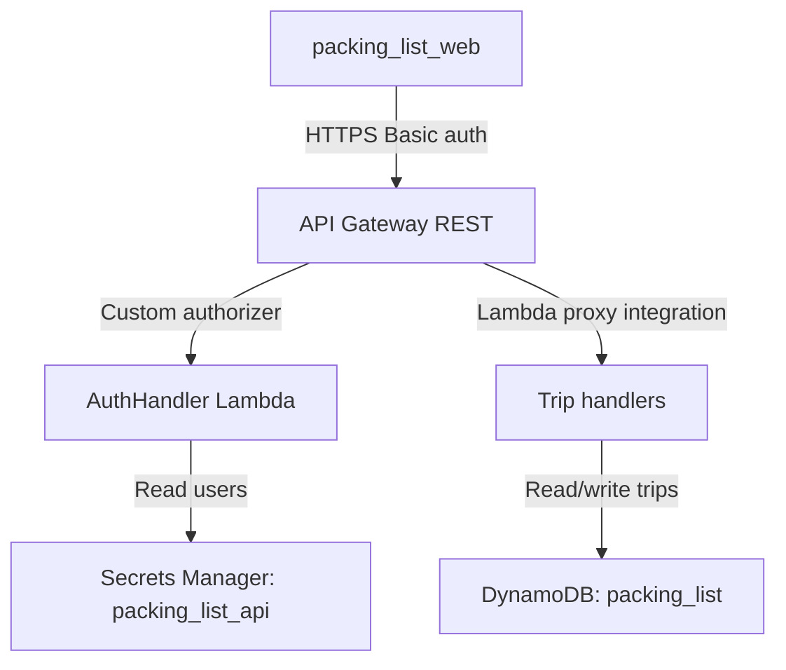

# Packing list API

The packing list API service provides an authenticated HTTP API for reading shared packing templates and creating, listing, fetching, and updating per-user trip packing lists.

## Overview

- **Service type**: backend API (`packing_list_api`)
- **Interface**: REST over HTTPS
- **Runtime**: AWS Lambda (Java 21) behind API Gateway REST
- **Primary storage**: DynamoDB table `packing_list` with `gsi1` index
- **Auth model**: API Gateway custom REQUEST authorizer backed by `AuthHandler`
- **Primary consumer**: `packing_list_web`

## Features and scope boundaries

### In scope

- Require HTTP Basic authentication on all API endpoints.
- Derive request user identity from the Basic username in `Authorization`.
- Return one base template plus predefined variations from `GET /templates`.
- Create trips with fully materialized item snapshots via `POST /trips`.
- List per-user trips in departure-date-descending order via `GET /trips`.
- Fetch one per-user trip with full item details via `GET /trips/{trip_id}`.
- Replace full trip content (metadata + items) via `PUT /trips/{trip_id}`.
- Validate request payloads with deterministic error messages.

### Out of scope

- Collaborative or shared trips across multiple users.
- Partial patch updates for trips; updates are full replacement only.
- Server-side template composition or merge logic.
- Runtime template authoring endpoints.
- Operational runbooks or release process documentation.

## Architecture



### Primary workflow

```mermaid
sequenceDiagram
  participant User as User
  participant Web as packing_list_web
  participant Gateway as API Gateway
  participant Auth as AuthHandler
  participant Secrets as Secrets Manager
  participant Create as CreateTripHandler
  participant Dynamo as DynamoDB

  User->>Web: confirm generated packing items
  Web->>Gateway: POST /trips with Basic auth
  Gateway->>Auth: validate authorization header
  Auth->>Secrets: get packing_list_api secret
  Secrets-->>Auth: users and passwords
  Auth-->>Gateway: allow request
  Gateway->>Create: invoke create handler
  Create->>Dynamo: put TRIP item
  Create-->>Gateway: 201 with created trip
  Gateway-->>Web: trip payload
```

## Main technical decisions

- Use API Gateway + Lambda to stay consistent with other repository API services and keep infrastructure lightweight.
- Keep templates in code (`TemplatesFactoryImpl`) instead of DynamoDB to make template reads deterministic and simple.
- Persist each trip as a single DynamoDB item containing all trip metadata and items for straightforward retrieval.
- Use `gsi1` with `DEPARTURE#<YYYY-MM-DD>#TRIP#<trip_id>` sort keys to support descending trip list queries.
- Make `PUT /trips/{trip_id}` a full replacement operation so the stored trip remains a complete, canonical snapshot.

## Domain glossary

- **Trip**: one holiday plan with metadata and a full list of trip items.
- **Base template**: the shared default item set returned by `GET /templates`.
- **Variation**: an additive item set (for example `tramping`, `camping`, `skiing`, `cycling`) returned by `GET /templates`.
- **Trip item status**: `unpacked`, `packed`, or `pack-just-in-time`.
- **Normalized item name**: lowercase, trimmed, and whitespace-collapsed item name used for duplicate detection.
- **Trip snapshot**: the persisted `items` list on a trip, independent from future template changes.

## Integration contracts

### External systems

- None in current scope outside AWS platform dependencies (API Gateway, Lambda, DynamoDB, Secrets Manager).

## API contracts

### Conventions

- Base URL: `https://api.packing-list.jordansimsmith.com`
- Auth: `Authorization: Basic <base64(user:password)>`
- Request and response fields use `snake_case`.
- No path version segment (no `/v1`).
- Non-2xx response shape:

```json
{
  "message": "validation error details"
}
```

### Endpoint summary

| Method | Path               | Purpose                                    |
| ------ | ------------------ | ------------------------------------------ |
| `GET`  | `/templates`       | return base template and variations        |
| `POST` | `/trips`           | create a trip with full item snapshot      |
| `GET`  | `/trips`           | list trip summaries for authenticated user |
| `GET`  | `/trips/{trip_id}` | fetch one trip with item details           |
| `PUT`  | `/trips/{trip_id}` | replace one trip (metadata + items)        |

### Example request and response

`POST /trips`

Request:

```json
{
  "name": "Japan 2026",
  "destination": "Tokyo",
  "departure_date": "2026-01-12",
  "return_date": "2026-01-26",
  "items": [
    {
      "name": "passport",
      "category": "travel",
      "quantity": 1,
      "tags": ["hand luggage"],
      "status": "unpacked"
    }
  ]
}
```

Response `201`:

```json
{
  "trip": {
    "trip_id": "6f7a0dbe-3c7a-4f5c-9c9f-74e7d9c0a5f5",
    "name": "Japan 2026",
    "destination": "Tokyo",
    "departure_date": "2026-01-12",
    "return_date": "2026-01-26",
    "items": [
      {
        "name": "passport",
        "category": "travel",
        "quantity": 1,
        "tags": ["hand luggage"],
        "status": "unpacked"
      }
    ],
    "created_at": 1766884800,
    "updated_at": 1766884800
  }
}
```

Representative key failures:

- `400`: validation error (for example `{"message":"quantity must be >= 1"}`)
- `400`: path/body mismatch on update (`{"message":"trip_id mismatch"}`)
- `404`: trip not found in user scope (`{"message":"Not Found"}`)
- `401`: unauthorized at API Gateway with `WWW-Authenticate: Basic`

`GET /templates` returns one `base_template` and a `variations` array. The full current catalog is defined in `packing_list_api/src/main/java/com/jordansimsmith/packinglist/TemplatesFactoryImpl.java`.

## Data and storage contracts

### DynamoDB model

- **Table name**: `packing_list`
- **Primary key**:
  - `pk`: `USER#<user>`
  - `sk`: `TRIP#<trip_id>`
- **Item type**:
  - `TRIP#<trip_id>` (stores entire trip and all items in one record)
- **Global secondary index (`gsi1`)**:
  - `gsi1pk`: `USER#<user>`
  - `gsi1sk`: `DEPARTURE#<YYYY-MM-DD>#TRIP#<trip_id>`
  - Query uses `scanIndexForward = false` for departure-date-descending trip lists

### Representative record

```json
{
  "pk": "USER#alice",
  "sk": "TRIP#6f7a0dbe-3c7a-4f5c-9c9f-74e7d9c0a5f5",
  "gsi1pk": "USER#alice",
  "gsi1sk": "DEPARTURE#2026-01-12#TRIP#6f7a0dbe-3c7a-4f5c-9c9f-74e7d9c0a5f5",
  "user": "alice",
  "trip_id": "6f7a0dbe-3c7a-4f5c-9c9f-74e7d9c0a5f5",
  "name": "Japan 2026",
  "destination": "Tokyo",
  "departure_date": "2026-01-12",
  "return_date": "2026-01-26",
  "items": [
    {
      "name": "passport",
      "category": "travel",
      "quantity": 1,
      "tags": ["hand luggage"],
      "status": "unpacked"
    }
  ],
  "created_at": 1766884800,
  "updated_at": 1766885625
}
```

## Behavioral invariants and time semantics

- `name`, `destination`, `departure_date`, `return_date`, and non-empty `items` are required for create and update.
- `departure_date` and `return_date` must be valid `YYYY-MM-DD` dates.
- Each item requires `name`, `category`, `quantity >= 1`, and valid `status`.
- Valid statuses are `unpacked`, `packed`, and `pack-just-in-time`.
- Duplicate item names are rejected using normalized-name matching (lowercase + trim + collapsed whitespace).
- `trip_id` is generated as a UUID on create.
- `created_at` and `updated_at` are epoch seconds; `created_at` is preserved on update and `updated_at` is replaced.
- `GET /trips` returns summaries in descending `departure_date` order.
- Updates are last-write-wins full replacements (no optimistic locking in current scope).

## Source of truth

| Entity                  | Authoritative source                        | Notes                                                   |
| ----------------------- | ------------------------------------------- | ------------------------------------------------------- |
| Template catalog        | `TemplatesFactoryImpl` in service code      | returned by `GET /templates`; not persisted in DynamoDB |
| User credentials        | Secrets Manager secret `packing_list_api`   | read by `AuthHandler` authorizer                        |
| Request user identity   | Basic username from `Authorization` header  | used to scope all DynamoDB keys                         |
| Trip metadata and items | DynamoDB `TRIP#...` items in `packing_list` | canonical state for create/list/get/update              |
| Trip list ordering      | DynamoDB `gsi1sk` key format                | derived from persisted `departure_date` and `trip_id`   |

## Security and privacy

- API Gateway custom REQUEST authorizer enforces Basic authentication before handler execution.
- Credentials are stored in AWS Secrets Manager and read at runtime by `AuthHandler`.
- Per-user data partitioning (`pk = USER#<user>`) prevents cross-user reads and writes.
- Transport is HTTPS via API Gateway custom domain `api.packing-list.jordansimsmith.com`.
- Handler logs should not include raw credentials, authorization headers, or secret payloads.

## Configuration and secrets reference

### Environment variables

No service-specific environment variables are consumed by handlers in current scope.

| Name     | Required | Purpose                                                                   | Default behavior                                                       |
| -------- | -------- | ------------------------------------------------------------------------- | ---------------------------------------------------------------------- |
| `(none)` | n/a      | behavior is configured via code constants and Terraform-managed resources | table name, secret name, and CORS origin come from code/infra defaults |

### Secret shape

Expected secret JSON for `packing_list_api`:

```json
{
  "users": [
    {
      "user": "alice",
      "password": "strong-password"
    }
  ]
}
```

## Performance envelope

- Lambda handlers run with `512 MB` memory, `10` second timeout, and `x86_64` architecture.
- DynamoDB uses `PAY_PER_REQUEST` billing with a single GSI for list queries.
- Service design targets personal workload scale rather than high-throughput multi-tenant usage.
- No formal latency SLO is defined in current scope.

## Testing and quality gates

- Unit tests cover authentication, template response mapping, and trip validation rules.
- Integration tests cover create/list/get/update handlers against DynamoDB Testcontainers.
- E2E tests cover create -> list -> get -> update -> get flows with LocalStack.
- Required service checks:
  - `bazel build //packing_list_api:all`
  - `bazel test //packing_list_api:all`
- Repository-level post-change checks:
  - `bazel mod tidy`
  - `bazel run //:format`

## Local development and smoke checks

- Run focused suites:
  - `bazel test //packing_list_api:unit-tests`
  - `bazel test //packing_list_api:integration-tests`
  - `bazel test //packing_list_api:e2e-tests`
- Minimal smoke flow:
  1. `POST /trips` with valid authenticated payload returns `201` and a generated `trip_id`.
  2. `GET /trips` returns the created trip summary for the same user.
  3. `GET /trips/{trip_id}` returns full item details.
  4. `PUT /trips/{trip_id}` updates fields and preserves `created_at`.

## End-to-end scenarios

### Scenario 1: create and list a trip

1. User generates a list in `packing_list_web` from `GET /templates`.
2. Client sends authenticated `POST /trips` with the full item snapshot.
3. API validates payload, writes one `TRIP#...` DynamoDB record, and returns `201`.
4. Client calls `GET /trips` and sees the trip in departure-date-descending order.

### Scenario 2: update a trip while packing

1. User edits trip details and item statuses in `packing_list_web`.
2. Client sends authenticated `PUT /trips/{trip_id}` with full replacement payload.
3. API validates `trip_id` match, preserves `created_at`, updates `updated_at`, and rewrites the trip record.
4. Client calls `GET /trips/{trip_id}` and sees the persisted changes.
