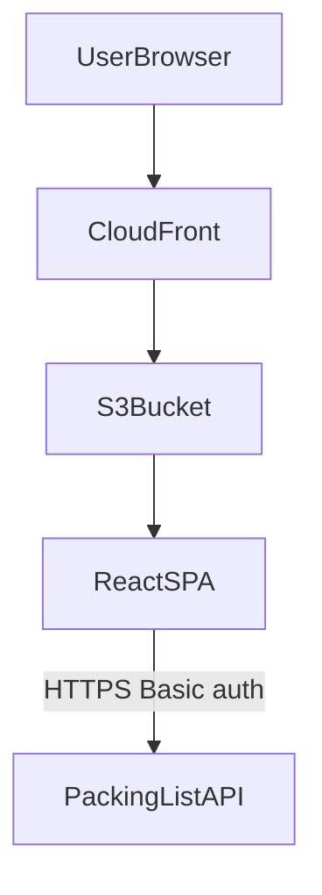
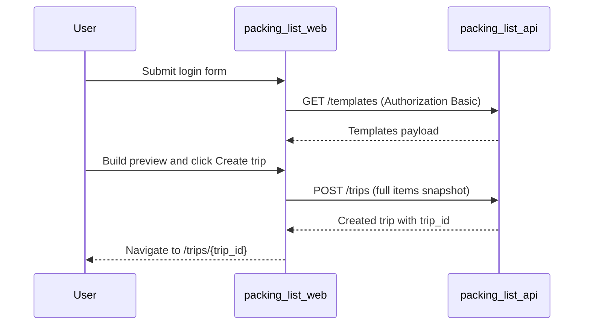

# Packing list web

The packing list web service is a responsive single-page app that lets an authenticated user create, edit, and pack per-trip packing lists from a base template plus optional variations.

## Overview

- **Service type**: web client (`packing_list_web`)
- **Interface**: browser SPA served via CloudFront and S3
- **Frontend stack**: React, TypeScript, Vite, Mantine, React Router
- **Primary backend**: `packing_list_api`
- **Primary user**: single-user personal trip packing workflow

## Features and scope boundaries

### In scope

- Authenticate with username/password, validate credentials against the backend, and persist a Basic auth token in browser storage.
- Protect trip routes (`/trips`, `/trips/create`, `/trips/:tripId`) and redirect unauthenticated users to `/`.
- List trips, create a trip from templates and optional variations, and open an existing trip for packing.
- Build the create-flow packing list client-side, including add/remove/edit actions before persisting.
- Persist trip creation via `POST /trips` and trip updates via full replacement `PUT /trips/{trip_id}`.
- Provide responsive UI behavior for both mobile and desktop layouts.

### Out of scope

- Multi-user collaboration, shared trips, or role-based access controls in the web client.
- Offline sync, background conflict resolution, or local-first persistence of trip records.
- Reminder scheduling, push notifications, or calendar integration.
- Server-managed draft workflows in create flow before trip creation.

## Architecture

### Primary workflow

## Main technical decisions

- Use a typed `ApiClient` interface with swappable implementations to keep page logic transport-agnostic.
- Select API implementation by build mode: production uses HTTP client, development uses an in-memory fake client for fast local iteration.
- Store session data in `localStorage` so authentication persists across browser reloads.
- Generate create-flow packing lists in the client and persist a full snapshot at creation time to avoid backend draft complexity.
- Use debounced autosave on trip edits to keep interaction responsive while limiting request churn.
- Keep UI state in React component state and presenters rather than introducing a separate global server-state cache library.

## Domain glossary

- **Base template**: default item set always used to initialize a new trip.
- **Variation**: optional additional item bundle that can be added during create flow.
- **Trip**: persisted packing plan with metadata (`name`, `destination`, dates) and item list.
- **Trip item**: one packable entry with `name`, `category`, `quantity`, `tags`, and `status`.
- **Item status**: packing lifecycle value (`unpacked`, `pack-just-in-time`, `packed`).

## Integration contracts

### External systems

- **None in current scope**: `packing_list_web` does not directly integrate with third-party vendors or webhooks.

## API contracts

### Consumed backend endpoints

| Method | Path               | Purpose                                                 |
| ------ | ------------------ | ------------------------------------------------------- |
| `GET`  | `/templates`       | validate session and load base template plus variations |
| `GET`  | `/trips`           | fetch trip summaries for trips list                     |
| `POST` | `/trips`           | create a trip with fully materialized items             |
| `GET`  | `/trips/{trip_id}` | fetch one trip for packing/editing                      |
| `PUT`  | `/trips/{trip_id}` | replace full trip payload after edits                   |

### UI contract expectations

- Requests and responses use snake_case fields (for example `trip_id`, `departure_date`, `base_template`).
- Authenticated requests send `Authorization: Basic <token>` from persisted session state.
- Trip dates are sent and consumed as `YYYY-MM-DD` strings.
- API error responses are expected to include `{"message":"..."}`; UI falls back to status text when message parsing fails.
- Trip updates are full replacements (`PUT` sends complete trip fields and item array, not partial patches).

## Data and storage contracts

### Browser storage

| Location              | Key                 | Purpose                                                                                               | Retention                  |
| --------------------- | ------------------- | ----------------------------------------------------------------------------------------------------- | -------------------------- |
| `localStorage`        | `packing_list_auth` | persisted session `{ "username": string, "token": string }` where token is base64 `username:password` | until explicit logout      |
| in-memory React state | n/a                 | create-flow preview, modal state, loading/errors, debounced pending save payload                      | reset on full page refresh |

### Data ownership expectations

- `packing_list_api` is authoritative for templates, persisted trips, and persisted packing status.
- Create-flow preview state in the browser is authoritative only until `POST /trips` succeeds.
- The web client does not persist trip records or templates in browser storage.
- In development mode, fake-client data is in-memory only and resets on browser refresh.

## Behavioral invariants and time semantics

- Item identity is normalized with `normalizedName(name)` (lowercased and whitespace-normalized) for merge, edit, and remove behavior.
- When merging template or variation items, matching item names merge by normalized identity: quantities sum and tags union.
- New items default to `unpacked` status.
- Category grouping sorts items alphabetically by name; category groups are alphabetical with `misc` rendered last.
- `hide packed` filtering is applied before category grouping, and empty categories are not rendered.
- Dates are formatted for API as `YYYY-MM-DD` and displayed with browser locale formatting from local `Date` objects.
- Trip edits in `TripPage` are autosaved with a 500ms debounce and pending changes are flushed on unmount.

## Source of truth

| Entity                        | Authoritative source                       | Notes                                                               |
| ----------------------------- | ------------------------------------------ | ------------------------------------------------------------------- |
| Credential validity           | `packing_list_api` auth-protected response | login is treated as successful after authenticated `GET /templates` |
| Template catalog              | `packing_list_api`                         | base template and variations are loaded from API client response    |
| Trip records                  | `packing_list_api`                         | list and detail pages render API-backed trip payloads               |
| In-progress create-flow edits | browser memory                             | temporary until create request succeeds                             |
| Session persistence           | browser `localStorage`                     | cleared on logout via `clearSession()`                              |

## Security and privacy

- Production API calls are expected to use HTTPS with Basic auth headers.
- Username/password are user-provided at runtime and converted to a Base64 token for transport header usage.
- Session data is stored in `localStorage`, not URL query params or fragments.
- Logout clears stored session data immediately and returns user to `/`.
- The web app does not embed backend secrets or infrastructure credentials.
- Error handling surfaces short user-facing messages and does not intentionally expose credential values.

## Configuration and secrets reference

### Environment variables

| Name                | Required | Purpose                      | Default behavior                                          |
| ------------------- | -------- | ---------------------------- | --------------------------------------------------------- |
| `VITE_API_BASE_URL` | no       | base URL for HTTP API client | defaults to `https://api.packing-list.jordansimsmith.com` |

Build mode behavior: production (`import.meta.env.PROD`) uses the HTTP client, while development uses the in-memory fake client.

### Secrets handling

- No server-managed secret values are bundled in this frontend runtime.
- Credentials are entered by the user at login time and used only to generate the `Authorization` header token.
- The persisted session token is removed on logout.

## Performance envelope

- Optimized for a single-user workflow with low-to-moderate trip and item volumes.
- Core interactions (loading trips, editing item status, and create-flow preview updates) are designed to feel immediate in normal browser conditions.
- Debounced autosave balances fast UI response with reduced backend write frequency.
- Dependency choices prioritize straightforward rendering and maintainable performance over heavy client-side data frameworks.

## Testing and quality gates

- Unit and component tests run with Vitest and React Testing Library in `jsdom`.
- Key coverage areas include login and route protection, create flow interactions, and trip editing/packing behavior.
- Required checks before merge:
  - `bazel test //packing_list_web:unit-tests`
  - `bazel build //packing_list_web:typecheck`
  - `bazel build //packing_list_web:build`

## Local development and smoke checks

- Recommended local development: `cd packing_list_web && pnpm vite dev`
- Bazel development option: `bazel run //packing_list_web:vite -- dev`
- Development mode uses fake in-memory API data by default (no backend dependency).
- Basic smoke flow:
  - log in with any credentials in dev mode
  - open `/trips` and verify trip list renders
  - create a trip from `/trips/create` and confirm redirect to `/trips/{trip_id}`
  - change statuses or item details in trip view and confirm autosave behavior

## End-to-end scenarios

### Scenario 1: login and create a trip

1. User opens `/`, enters credentials, and submits login.
2. App writes session to `localStorage`, validates with `GET /templates`, then navigates to `/trips`.
3. User opens `/trips/create`, fills trip details, and adds one or more variations.
4. User optionally edits preview items, then clicks Create trip.
5. App sends `POST /trips` with full item snapshot and navigates to `/trips/{trip_id}`.

### Scenario 2: update packing progress on an existing trip

1. User opens `/trips/{trip_id}` from trips list.
2. App loads full trip via `GET /trips/{trip_id}` and displays grouped categories.
3. User updates item status, edits quantities/tags, or adds/removes items.
4. App applies updates locally and autosaves via debounced `PUT /trips/{trip_id}` with full trip payload.
5. User can toggle `hide packed` and continue packing with current persisted state.
