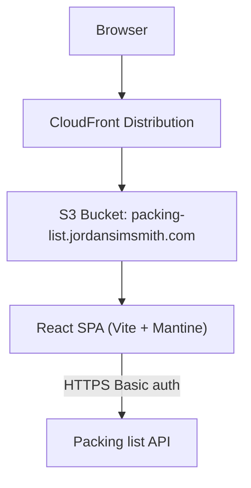

# Packing list web

The packing list web service is a responsive single-page app that lets an authenticated user generate, edit, and pack per-trip packing lists using a base template plus optional variations.

Instead of maintaining a manual spreadsheet each holiday, the web app generates a custom packing list for that specific trip, lets you tweak it, and then makes it easy to check items off while packing.

## System architecture

## Requirements

### Functional requirements

- **Login**:
  - collect username/password
  - validate credentials via a lightweight authenticated API call (`GET /templates`) before accepting login
  - store a Basic auth token in `sessionStorage` (clears when tab is closed)
  - logout clears the stored token
- **Route protection**:
  - unauthenticated access to `/trips/*` redirects to `/`
  - after login, navigate to `/trips`
- **Trips home** (`/trips`):
  - list trips ordered by `departure_date` descending
  - link to create flow and to individual trips
- **Create trip** (`/trips/create`):
  - enter trip metadata: name, destination, departure date, return date
  - load templates from the backend (`GET /templates`)
  - select zero or more variations (base template is fixed)
  - build a live preview list client-side by applying merge rules (see `packing_list_api/README.md`)
  - allow edits before persisting:
    - remove items
    - add one-off items
    - edit quantity/tags/status
  - persist by creating the trip in one shot (`POST /trips`)
- **Trip view / packing** (`/trips/:trip_id`):
  - load full trip (`GET /trips/{trip_id}`)
  - update by replacing the full trip (`PUT /trips/{trip_id}`)
  - group items by category
  - categories ordered alphabetically
  - hide categories with zero visible items
  - “hide packed” toggle
  - fast status controls (segmented control) supporting `unpacked`, `pack-just-in-time`, and `packed`
  - display tags at a glance
- **Responsive UX**: usable on both mobile and desktop

### Technical specifications

- **Framework**: React
- **Language**: TypeScript
- **Build tool**: Vite
- **UI library**: Mantine
- **Routing**: React Router (`react-router-dom`)
- **Forms**: `@mantine/form`
- **Notifications**: `@mantine/notifications`
- **State strategy**:
  - UI state in React component state
  - server state via a typed API client (no React Query)
- **Auth/session**:
  - Basic token stored in `sessionStorage`
  - http client injects `Authorization` header and `?user=...` query param
- **Hosting**: S3 + CloudFront (SPA deep-link support)
- **Infra**: Terraform (aligned with repo patterns from `personal_website_web`)
- **Build system**: Bazel (aligned with repo patterns)

## Implementation details

### Route map

- `/` login/home
- `/trips` trips list (requires auth)
- `/trips/create` create trip (requires auth)
- `/trips/:trip_id` trip view + packing (requires auth)

### Client-side generation and snapshot behavior

- The web app generates and edits the packing list client-side, then persists the fully-materialized `items` array via `POST /trips`.
- This gives “snapshot” behavior naturally: once the trip is created, it is independent from any subsequent changes to templates/variations.
- There is no server-side draft/finalization workflow; drafts exist only within the create flow before the `POST /trips` call.

### UX guiding principles

- **vibe**: calm, simple, and fast; avoid visual noise.
- **mantine-first**: prefer Mantine components + theme tokens; avoid one-off bespoke styling.
- **responsive**: mobile and desktop are first-class.
  - mobile uses comfortable spacing and large tap targets
  - desktop can be slightly denser to fit more on screen
- **layout**:
  - use Mantine `AppShell` with a simple header (app name left, user + logout right)
  - use a centered `Container` for page content (no sidebar navigation)
- **trips list** (`/trips`):
  - use list rows with subtle dividers (not heavy cards)
  - show only the essentials per row: name, destination, departure + return dates
  - avoid extra trip status badges
- **create flow** (`/trips/create`):
  - the create experience is a **live preview**:
    - start from the base template list
    - show variations with their item lists so it’s clear what will be included
    - add variations and the preview updates immediately as each variation is added
    - variations are **add-only** in a create session; use a single **Reset** action (with confirm) to start over
    - add/remove/edit items during preview and changes apply immediately
    - when happy, create the trip (persist snapshot) and navigate to the packing view
  - **make merges obvious**: show quantity \(> 1\) prominently.
- **packing view** (`/trips/:trip_id`):
  - group by category; categories sorted alphabetically; hide empty categories after filters apply
  - “hide packed” is a top-level toggle
  - per-item status uses a segmented control:
    - `unpacked`
    - `pack-just-in-time` (label shown as **Pack later**)
    - `packed`
  - show tags at a glance as small badges
- **errors and loading**:
  - inline validation for forms
  - toasts for API failures (show a short message)
  - skeletons for list loading; button loading state for create/save actions
- **accessibility**:

  - keep visible focus styles
  - don’t rely on color alone for status
  - ensure keyboard usability on desktop and generous tap targets on mobile

  - encourage reuse of existing categories, but allow creating new ones at any time
  - tags are free text and created on the fly

### Module layout

#### API integration

- `api/client.ts`
  - typed endpoint functions (no generic transport exported):
    - `getTemplates()`
    - `createTrip(...)`
    - `getTrips()`
    - `getTrip(tripId)`
    - `updateTrip(trip)`
  - selects an underlying implementation:
    - `api/http-client.ts` (prod): real HTTP calls with `fetch`
    - `api/fake-client.ts` (dev): pure in-memory stub for local development (no backend required; resets on refresh)
  - normalizes error handling to `{"message":"..."}`

#### Auth/session

- `auth/session.ts`
  - read/write/clear Basic token in `sessionStorage`

#### Domain helpers

- `domain/normalize.ts`
  - `normalizedName(...)` used for item identity rules
- `domain/generate.ts`
  - merge logic (sum quantities, union tags, first category wins, status defaults to `unpacked`)

### Page/component architecture

#### Pages

- `LoginPage` (`/`)
- `TripsPage` (`/trips`)
- `CreateTripPage` (`/trips/create`)
- `TripPage` (`/trips/:trip_id`)

#### Layout and routing helpers

- `AppShellLayout` (Mantine `AppShell` header + main container)
- `RequireAuth` (redirect unauthenticated users)
- `ErrorBoundary` (route-level fallback)

#### Feature components

- `TripForm` (name/destination/departure/return)
- `TemplatesPicker` (base template read-only + variation picker that shows each variation’s items)
- `PackingListEditor` (add/remove/edit items during create flow)
- `PackingListView` (packing view with grouping + status toggles)

#### Reusable components

- `CategorySection` (category header + list of items)
- `ItemRow` (name, quantity, tags, status controls)
- `TagsInput` (free-text tags)
- `StatusControl` (segmented control: `unpacked` / `pack-just-in-time` (“pack later”) / `packed`)

### Local development

- Run the Vite dev server via Bazel:
  - `bazel run //packing_list_web:vite -- dev`
- By default, the app uses the **fake in-memory API client** in dev mode (no backend required; no network calls)
- Optionally, switch to the **http API client** to test against the deployed API (e.g. with a Vite env var such as `VITE_API_IMPL=http`)

### Testing

- **Unit tests**: Vitest + React Testing Library (jsdom)
- **Bazel**: `bazel test //packing_list_web:unit-tests`
- Focus areas:
  - packing list editor interactions (add/remove/edit; dedupe-by-normalized-name)
  - route protection and login redirect behavior
  - create trip happy path with `api/client.ts` mocked

### Deployment (Terraform) notes

- **Bucket**: `packing-list.jordansimsmith.com`
- **CloudFront**:
  - origin access control (OAC) for private S3 access
  - viewer protocol policy redirect-to-https
  - SPA routing support:
    - map `403` and `404` to `/index.html` with `200` so deep links work on refresh
- Terraform implementation should follow the existing pattern used by `personal_website_web/infra/main.tf`:
  - locate Bazel output via `data.external` and `tools/terraform/resolve_location.sh`
  - upload built assets using `hashicorp/dir/template` + `aws_s3_object`
