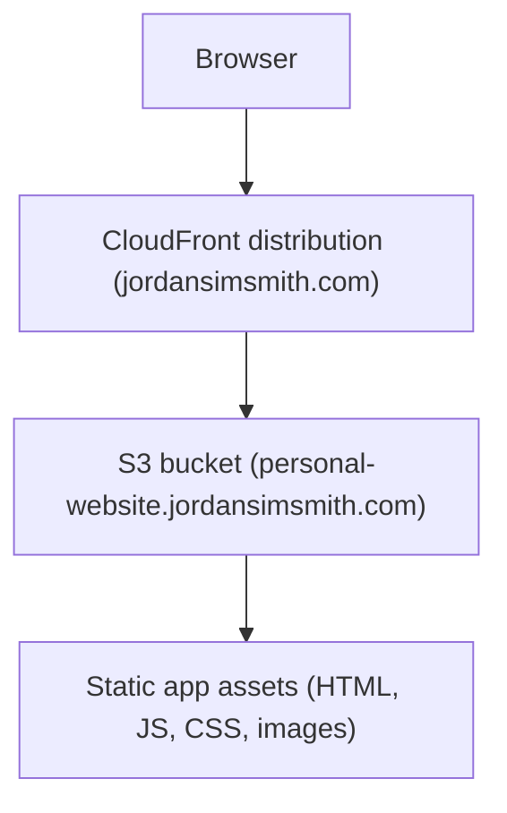
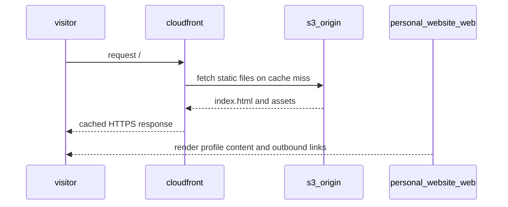

# Personal website web

The personal website web service is a static single-page site that presents Jordan Sim-Smith's profile and external links.

## Overview

- **Service type**: web client (`personal_website_web`)
- **Interface**: browser single-page app served through CloudFront and S3
- **Frontend stack**: React + JavaScript (JSX) + Vite + Mantine + PostCSS
- **Primary backend**: none (static content only)
- **Primary users**: people viewing Jordan's profile and external links

## Features and scope boundaries

### In scope

- Render a single-page profile experience with header, main content, and footer.
- Display profile image and static biography content.
- Provide outbound links to Canva, University of Auckland, GitHub, and LinkedIn.
- Apply responsive layout that stacks on small screens and uses two columns from the Mantine `md` breakpoint onward.
- Serve static build artifacts from S3 through CloudFront with HTTPS.

### Out of scope

- Multi-page routing.
- Contact forms, user-submitted content, or account management flows.
- Backend API calls, authentication, or persistent application data.
- Runtime feature flags or runtime environment-variable driven behavior.

## Architecture

### Primary workflow

## Main technical decisions

- Use React with Mantine components for a small, maintainable UI surface.
- Keep the app as a single page with no router to reduce complexity for a static site.
- Use Vite for development and build, wrapped by Bazel targets for repository consistency.
- Keep a minimal global stylesheet (`src/index.css`) and use Mantine primitives for most layout/styling.
- Deploy static artifacts through Terraform to private S3 plus CloudFront Origin Access Control.

## Integration contracts

### External systems

- None in current scope. The page contains outbound links to external sites, but this service does not call third-party APIs or receive webhooks.

## API contracts

### Consumed backend endpoints

- None in current scope.

### UI contract expectations

- No request or response payload contracts exist because this service does not perform API calls.

## Data and storage contracts

### Browser storage

| Location | Key | Purpose                         | Retention |
| -------- | --- | ------------------------------- | --------- |
| none     | n/a | no local or session persistence | n/a       |

### Data ownership expectations

- Profile text, links, and layout are authored in source files and bundled at build time.
- The browser runtime does not persist user state to localStorage, sessionStorage, IndexedDB, or cookies.

## Behavioral invariants and time semantics

- The app mounts one React root and renders a single page layout.
- Main content uses a column layout on small screens and switches to row layout at and above the Mantine `md` breakpoint.
- Header, main content, and footer are always rendered from static component structure.
- External links open in a new browser tab via `target="_blank"`.
- No service logic depends on clocks, time zones, scheduling, or periodic refresh.

## Source of truth

| Entity                                 | Authoritative source       | Notes                                   |
| -------------------------------------- | -------------------------- | --------------------------------------- |
| Profile text and outbound links        | `src/App.jsx`              | rendered directly by React components   |
| Theme settings                         | `src/main.jsx`             | Mantine theme sets heading font weight  |
| Breakpoint variables                   | `postcss.config.js`        | defines Mantine breakpoint variables    |
| Static document metadata and assets    | `index.html` and `public/` | title, favicon, and images              |
| Delivery domain, TLS, and cache policy | `infra/main.tf`            | S3, CloudFront, ACM, and cache settings |

## Security and privacy

- CloudFront enforces HTTPS with `redirect-to-https`.
- TLS minimum protocol is `TLSv1.2_2021`.
- S3 bucket access is private and restricted to CloudFront through Origin Access Control and bucket policy.
- The app does not collect credentials, process form input, or store personal data in browser storage.
- The app contains no runtime secrets.

## Configuration and secrets reference

### Environment variables

- None in current scope. The app does not read runtime `import.meta.env` values.

### Secrets handling

- No runtime secrets are required by this web app.
- Infrastructure credentials used for Terraform/AWS operations are managed outside this service code.

## Performance envelope

- CloudFront cache policy uses `default_ttl = 3600` and `max_ttl = 86400` for static delivery.
- Runtime rendering is static and has no backend API latency dependency.
- No automated performance budget thresholds are currently enforced by repository checks.

## Testing and quality gates

- There are no service-specific unit or integration test targets in `personal_website_web/BUILD.bazel`.
- Required quality gate for this service is a successful build: `bazel build //personal_website_web:build`.
- Repository CI runs workspace-level checks: `bazel build //...` and `bazel test //...`.

## Local development and smoke checks

- Start dev server: `bazel run //personal_website_web:vite -- dev`
- Build production assets: `bazel build //personal_website_web:build`
- Preview built assets: `bazel run //personal_website_web:preview`

Smoke flow:

1. Start the dev server and open the local URL.
2. Confirm header, profile image, biography text, and footer links render.
3. Resize from mobile width to desktop width and verify layout shifts from column to row.
4. Click GitHub and LinkedIn links and confirm external navigation opens in new tabs.

## End-to-end scenarios

### Scenario 1: visitor loads the homepage

1. Visitor opens `https://jordansimsmith.com`.
2. CloudFront serves `index.html` and related static assets from the S3 origin.
3. React mounts and renders profile content and outbound links.
4. Visitor can navigate to external profiles from page links.

### Scenario 2: visitor uses external profile links

1. Visitor reads the biography content in the main section.
2. Visitor clicks the GitHub or LinkedIn link.
3. The browser opens the target site in a new tab.
4. Visitor can return to the personal website tab without losing page state.
