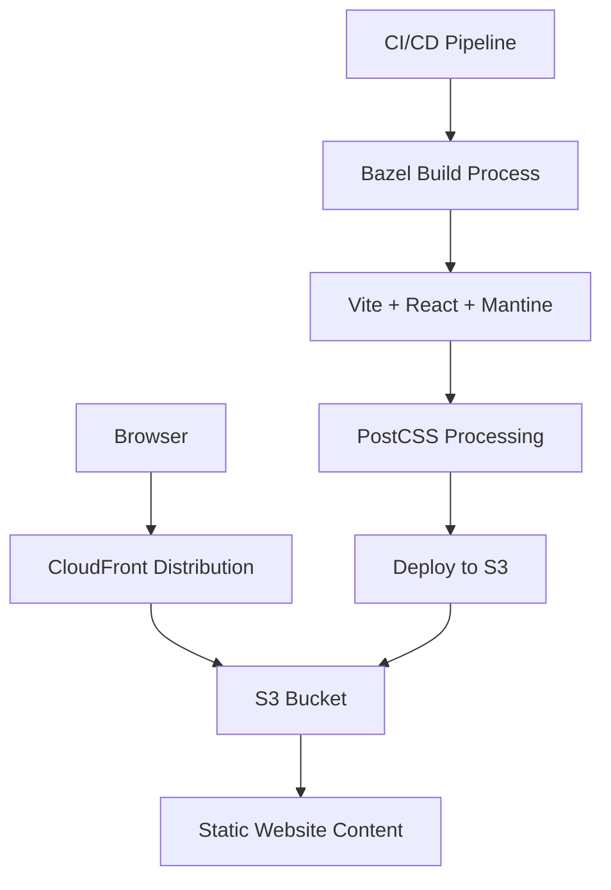

# Personal website

The personal website service provides an online portfolio, resume, and project showcase for Jordan Sim-Smith with responsive design and modern web standards.

## System architecture

## Requirements

### Functional requirements

- Display professional information including resume, skills, and experience
- Showcase portfolio of projects with descriptions and links
- Provide contact information and social media links
- Implement responsive design for all device sizes
- Optimize for fast loading times and accessibility

### Technical specifications

- Support for modern browsers (Chrome, Firefox, Safari, Edge)
- Mobile-first responsive design
- Accessibility compliance with WCAG guidelines
- Load time under 2 seconds for initial page load
- SEO optimization for improved discoverability

## Implementation details

### Technologies

- React for component-based UI development
- Mantine UI as the primary component library and design system
- PostCSS with Mantine preset for styling preprocessing
- Vite as the build tool and development server
- AWS S3 for static website hosting
- AWS CloudFront for content delivery
- Terraform for infrastructure as code
- Bazel for build system integration

### Key components

- `App.jsx`: Main application component that handles routing and layout using Mantine components
- `main.jsx`: Entry point for the React application with Mantine theme configuration
- `postcss.config.js`: PostCSS configuration for Mantine preprocessing and CSS variables
- `index.css`: Base application styling for full viewport height
- `infra/main.tf`: Terraform configuration for AWS infrastructure
- `BUILD.bazel`: Bazel build configuration for the website

### Development workflow

- Build the website: `bazel build //personal_website_web:build`
- Start development server: `bazel run //personal_website_web:vite -- dev`
- Preview production build: `bazel run //personal_website_web:preview`
- Build outputs are generated in the `dist/` directory

### Styling architecture

- Mantine UI provides the component library with built-in responsive design
- Custom theme configuration reduces heading font weight to 300 for modern typography
- PostCSS processes Mantine styles and CSS variables for consistent breakpoints
- CSS-in-JS approach through Mantine's styling system eliminates external stylesheets
- Responsive design uses Mantine's breakpoint system (xs: 36em, sm: 48em, md: 62em, lg: 75em, xl: 88em)

### Configuration

- CloudFront distribution for global content delivery
- S3 bucket configured for static website hosting
- CI/CD pipeline for automated deployments
- Custom domain with SSL/TLS encryption
