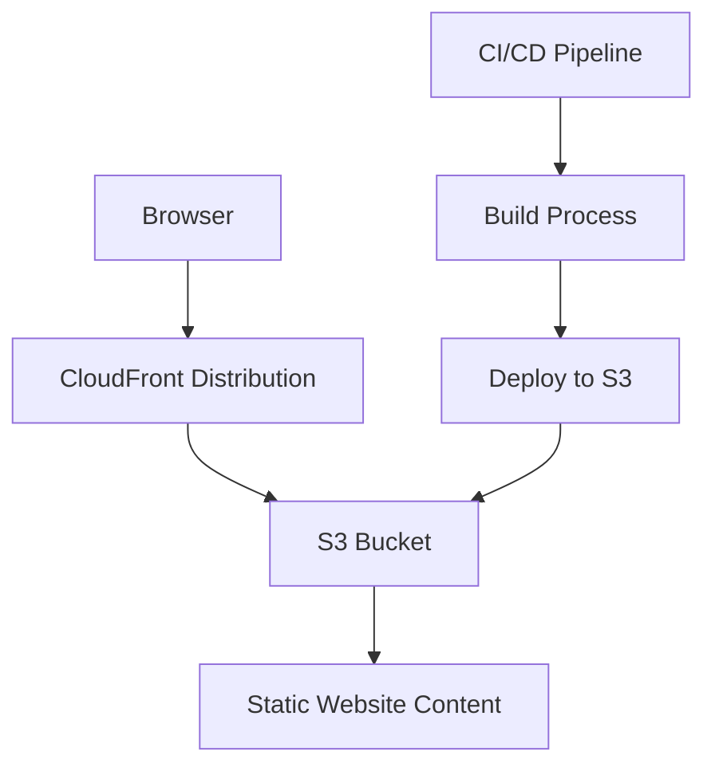

# Personal website

The personal website service provides an online portfolio, resume, and project showcase for Jordan Sim-Smith with responsive design and modern web standards.

## System architecture

## Requirements and specifications

### Functional requirements
- Display professional information including resume, skills, and experience
- Showcase portfolio of projects with descriptions and links
- Provide contact information and social media links
- Implement responsive design for all device sizes
- Optimize for fast loading times and accessibility

### Technical specifications
- Support for modern browsers (Chrome, Firefox, Safari, Edge)
- Mobile-first responsive design
- Accessibility compliance with WCAG guidelines
- Load time under 2 seconds for initial page load
- SEO optimization for improved discoverability

## Implementation details

### Technologies
- React for component-based UI development
- Vite as the build tool and development server
- AWS S3 for static website hosting
- AWS CloudFront for content delivery
- Terraform for infrastructure as code
- Bazel for build system integration

### Key components
- `App.jsx`: Main application component that handles routing and layout
- `main.jsx`: Entry point for the React application
- `infra/main.tf`: Terraform configuration for AWS infrastructure
- `BUILD.bazel`: Bazel build configuration for the website

### Configuration
- CloudFront distribution for global content delivery
- S3 bucket configured for static website hosting
- CI/CD pipeline for automated deployments
- Custom domain with SSL/TLS encryption 