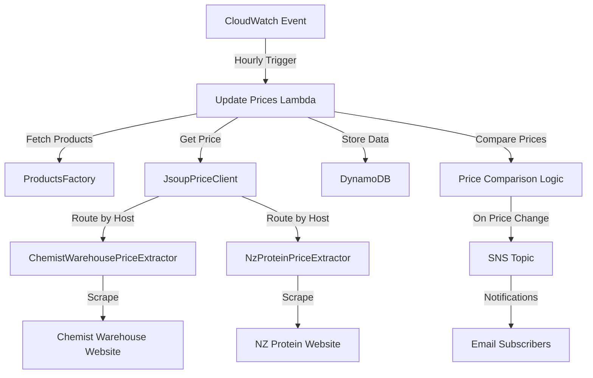

# Price tracker service

The price tracker service automatically monitors product prices on e-commerce websites and notifies users when prices change.

## System architecture

## Requirements

### Functional requirements

- Monitor product prices from Chemist Warehouse and NZ Protein websites
- Store price history for each tracked product
- Send notifications when prices change
- Support multiple product monitoring
- Support extensible price extraction for additional e-commerce sites
- Automatically update prices hourly

### Technical specifications

- Serverless architecture using AWS Lambda
- Data persistence with DynamoDB
- Notification delivery through Amazon SNS
- Price history retention with timestamp tracking
- Support for multiple email subscribers
- Hourly price checks

## Implementation details

### Technologies

- AWS Lambda for serverless execution
- DynamoDB for storing product and price data
- Amazon SNS for notification delivery
- Java runtime environment
- Jsoup library for HTML parsing
- AWS CloudWatch Events for scheduled triggers
- Terraform for infrastructure as code

### Key components

- `UpdatePricesHandler`: Lambda handler that processes scheduled events and updates prices
- `JsoupPriceClient`: Client that fetches product pages and delegates price extraction
- `PriceExtractor`: Interface for extracting prices from website-specific HTML
- `ChemistWarehousePriceExtractor`: Price extraction implementation for Chemist Warehouse
- `NzProteinPriceExtractor`: Price extraction implementation for NZ Protein
- `ProductsFactory`: Interface for finding products to track
- `ProductsFactoryImpl`: Implementation that provides the list of products to track
- `PriceTrackerItem`: Data model for storing price data in DynamoDB
- `PriceTrackerFactory`: Factory for creating the required dependencies
- `NotificationPublisher`: Interface for sending price change alerts

### Configuration

- Lambda execution frequency: Once per hour via CloudWatch Events
- DynamoDB table: "price_tracker" with hash key "pk" and range key "sk"
- SNS topic name: "price_tracker_api_price_updates"
- Email subscribers: Configured in Terraform
