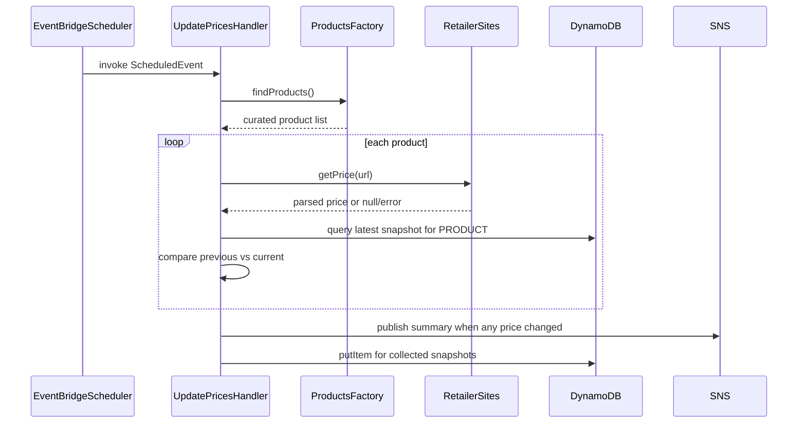

# Price tracker service

The price tracker service runs an hourly scheduled workflow that scrapes curated product pages, records price history, and sends notifications when tracked prices change.

## Overview

- **Service type**: backend scheduled worker (`price_tracker_api`)
- **Interface**: EventBridge-triggered Lambda invocation (no public HTTP API)
- **Runtime**: AWS Lambda (Java 21)
- **Primary storage**: DynamoDB table `price_tracker`
- **Primary outbound integrations**: retailer websites and Amazon SNS
- **Primary consumers**: Terraform-managed SNS email subscribers

## Features and scope boundaries

### In scope

- Run hourly price checks from a curated in-code product catalog.
- Scrape product pages using host-specific extractor implementations.
- Persist append-only price snapshots for every successfully scraped product.
- Detect changes by comparing the latest stored snapshot to the current scrape.
- Publish a summary notification when one or more prices changed in the run.

### Out of scope

- Public CRUD APIs for managing products, subscriptions, or historical records.
- Currency conversion, freight/tax normalization, or cross-store ranking analytics.
- Automatic bypass/remediation for anti-bot protections or breaking retailer HTML changes.
- Manual operations or deployment runbook documentation.

### Current catalog summary

| Retailer                                         | Product count | Representative examples                                                  |
| ------------------------------------------------ | ------------- | ------------------------------------------------------------------------ |
| Chemist Warehouse (`www.chemistwarehouse.co.nz`) | `32`          | Dynamic Whey 2kg, Quest Protein Bars, INC Creatine                       |
| NZ Protein (`www.nzprotein.co.nz`)               | `1`           | NZ Whey 1kg                                                              |
| NZ Muscle (`nzmuscle.co.nz`)                     | `24`          | Shotgun Whey variants, Musashi bars, Quest bars, NZ Muscle Protein Water |

## Architecture

```mermaid
flowchart TD
  eventBridge[EventBridge rule rate(1 hour)] --> updateHandler[Lambda price_tracker_api_update_prices]
  updateHandler --> productsFactory[ProductsFactoryImpl]
  updateHandler --> priceClient[JsoupPriceClient]
  priceClient --> chemistWarehouse[chemistwarehouse.co.nz]
  priceClient --> nzProtein[nzprotein.co.nz]
  priceClient --> nzMuscle[nzmuscle.co.nz]
  updateHandler --> dynamoDb[(DynamoDB price_tracker)]
  updateHandler --> snsTopic[SNS price_tracker_api_price_updates]
  snsTopic --> subscribers[Email subscribers]
```

### Primary workflow



## Main technical decisions

- Keep the service as a scheduled Lambda worker (not an HTTP API) because workload is periodic polling, not request/response serving.
- Store the tracked catalog directly in `ProductsFactoryImpl` so monitored products are explicit and versioned with code changes.
- Route parsing by URL host to dedicated extractors (`Chemist Warehouse`, `NZ Protein`, `NZ Muscle`) for deterministic selector behavior per site.
- Persist snapshots as append-only DynamoDB items keyed by product URL + timestamp to preserve full historical price series.
- Publish one aggregated SNS message per run to reduce notification noise when multiple products change together.

## Domain glossary

- **Tracked product**: one curated product URL + display name entry from `ProductsFactory`.
- **Price snapshot**: one persisted DynamoDB row for a product at a specific scrape timestamp.
- **Price change**: a difference between latest stored snapshot price and current scraped price for the same URL.
- **Scrape run**: one EventBridge-triggered Lambda execution covering the full product catalog.

## Integration contracts

### External systems

- **Chemist Warehouse website** (`www.chemistwarehouse.co.nz`): outbound HTTPS `GET` using Jsoup with browser-like headers and `30s` timeout. Required request field is the full product URL in the curated catalog. Auth method is none. Cadence is hourly per product. Failures return `null` when selector/price parsing fails and the product is skipped for that run.
- **NZ Protein website** (`www.nzprotein.co.nz`): outbound HTTPS `GET` with the same client behavior. Required request field is the full product URL in the curated catalog. Auth method is none. Cadence is hourly. Failures follow the same skip-on-null behavior.
- **NZ Muscle website** (`nzmuscle.co.nz`): outbound HTTPS `GET` with the same client behavior. Required request field is the full product URL in the curated catalog. Auth method is none. Cadence is hourly. Failures follow the same skip-on-null behavior.
- **Amazon SNS** (`price_tracker_api_price_updates`): outbound publish integration for change notifications. Required publish fields are topic name, subject, and message body lines containing product name, previous price, current price, and URL. Auth uses Lambda IAM role. When no matching topic ARN exists, publish fails and the invocation fails.

## API contracts

### Conventions

- The service exposes no public REST endpoints.
- Invocation contract is AWS Lambda `RequestHandler<ScheduledEvent, Void>`.
- Input follows the standard EventBridge scheduled event envelope.
- Output is `null`; observable behavior is side effects (DynamoDB writes and optional SNS publish).
- Unhandled errors are logged and rethrown as runtime exceptions, causing Lambda invocation failure.

### Endpoint summary

- none in current scope.

### Example request and response

Example invocation event:

```json
{
  "source": "aws.events",
  "detail-type": "Scheduled Event",
  "time": "2026-02-11T10:00:00Z",
  "resources": [
    "arn:aws:events:ap-southeast-2:123456789012:rule/price_tracker_api_update_prices"
  ]
}
```

Invocation outcome:

- Lambda returns `null`.
- One snapshot is written per successfully scraped product.
- SNS notification is published only when at least one price changed.

## Data and storage contracts

### DynamoDB model

- **Table name**: `price_tracker`
- **Primary key**:
  - `pk`: `PRODUCT#<url>`
  - `sk`: `TIMESTAMP#<epoch_seconds_padded_to_10_digits>`
- **Attributes**:
  - `pk` (String)
  - `sk` (String)
  - `price` (Number / Double)
  - `timestamp` (Number in storage, mapped to `Instant` in code)
  - `product` (String)
  - `url` (String)
  - `version` (Number, optimistic locking)
- **Access pattern**: query by `pk` with `scanIndexForward=false` and `limit=1` to read latest snapshot.
- **Write pattern**: append new snapshot per run (`putItem`), preserving price history over time.

Representative item:

```json
{
  "pk": "PRODUCT#https://www.chemistwarehouse.co.nz/buy/74329/inc-100-dynamic-whey-chocolate-flavour-2kg",
  "sk": "TIMESTAMP#1760000000",
  "price": 52.0,
  "timestamp": 1760000000,
  "product": "Chemist Warehouse - Dynamic Whey 2kg - Chocolate",
  "url": "https://www.chemistwarehouse.co.nz/buy/74329/inc-100-dynamic-whey-chocolate-flavour-2kg",
  "version": 1
}
```

## Behavioral invariants and time semantics

- Each invocation captures `now` once and uses that same timestamp for all snapshots written in the run.
- Snapshot timestamps are stored as epoch seconds (UTC) via `EpochSecondConverter`.
- Price comparison is exact `Double` equality (`Objects.equals(previousPrice, currentPrice)`).
- No notification is sent for a product with no previous snapshot.
- Products with `null` extracted prices are skipped and not written for that run.
- Notification publish happens before DynamoDB writes for the new snapshots.
- If scraping throws after retry exhaustion, the invocation fails and no later writes in that run are executed.
- Jsoup retries up to `3` attempts with exponential backoff (`1s`, `2s`, `4s`) plus jitter between retries.

## Source of truth

| Entity                     | Authoritative source                  | Notes                                                  |
| -------------------------- | ------------------------------------- | ------------------------------------------------------ |
| Tracked product catalog    | `ProductsFactoryImpl` in service code | Curated list shipped with deployments                  |
| Product page current price | Retailer HTML page at scrape time     | Parsed through host-specific extractor                 |
| Historical tracked prices  | DynamoDB `price_tracker` snapshots    | Canonical persisted history for comparisons            |
| Change notifications       | SNS topic messages                    | Derived from comparison against latest stored snapshot |
| Subscriber endpoints       | Terraform `local.subscriptions`       | Managed in infrastructure, not in application code     |

## Security and privacy

- Service has no public HTTP endpoint; it is invoked by EventBridge with explicit Lambda permission.
- IAM policy grants Lambda access to CloudWatch Logs, `price_tracker` DynamoDB actions, and SNS publish/list operations.
- The service does not read from Secrets Manager and has no custom secret payload contract.
- Stored data is public product metadata (name, URL, price, timestamp), not user PII.
- Outbound traffic is HTTPS scraping against public retailer pages plus AWS API calls.

## Configuration and secrets reference

### Environment variables

| Name                                          | Required                                       | Purpose                                       | Default behavior                                           |
| --------------------------------------------- | ---------------------------------------------- | --------------------------------------------- | ---------------------------------------------------------- |
| `PRICE_TRACKER_CHEMIST_WAREHOUSE_BASE_URL`    | optional                                       | Override Chemist Warehouse product URL base   | `https://www.chemistwarehouse.co.nz`                       |
| `PRICE_TRACKER_NZ_PROTEIN_BASE_URL`           | optional                                       | Override NZ Protein product URL base          | `https://www.nzprotein.co.nz`                              |
| `PRICE_TRACKER_NZ_MUSCLE_BASE_URL`            | optional                                       | Override NZ Muscle product URL base           | `https://nzmuscle.co.nz`                                   |
| `AWS_REGION`                                  | runtime-provided in AWS; test-provided locally | Region for AWS SDK clients                    | Terraform and tests use `ap-southeast-2`                   |
| `AWS_ACCESS_KEY_ID` / `AWS_SECRET_ACCESS_KEY` | local tests only                               | AWS SDK credentials for local test containers | Not required in production Lambda (execution role is used) |

### Secret shape

- none in current scope.

## Performance envelope

- Execution cadence is fixed at one scheduled run per hour (`rate(1 hour)`).
- Current catalog size is `57` product URLs processed sequentially in each run.
- Each fetch uses up to `3` attempts, `30s` request timeout, and exponential backoff with jitter.
- Lambda timeout is `120s`; catalog size and scrape behavior are tuned for personal-scale workloads.
- DynamoDB table uses `PAY_PER_REQUEST` billing mode for elastic low-volume operation.

## Testing and quality gates

- **Unit tests** (`//price_tracker_api:unit-tests`) validate extractor parsing behavior and unsupported host handling.
- **Integration tests** (`//price_tracker_api:integration-tests`) validate handler behavior with DynamoDB test container plus fake clock/price/products/notifications.
- **E2E tests** (`//price_tracker_api:e2e-tests`) validate LocalStack wiring (Lambda, DynamoDB, SNS, SQS) with mock retailer websites on an internal Testcontainers network.
- E2E runs are CI-safe and do not require outbound internet access to retailer hosts.
- Recommended pre-merge checks for this service: `bazel build //price_tracker_api:all` and `bazel test //price_tracker_api:all`.

## Local development and smoke checks

- Build service targets: `bazel build //price_tracker_api:all`
- Run all service tests: `bazel test //price_tracker_api:all`
- Fast E2E smoke check: `bazel test --test_filter=PriceTrackerE2ETest.shouldTrackChemistWarehousePricesAndSendNotifications //price_tracker_api:e2e-tests`
- Core behavior smoke check: `bazel test --test_filter=UpdatePricesHandlerIntegrationTest.handleRequestShouldUpdatePrices //price_tracker_api:integration-tests`
- Full E2E validation (mock retailer websites): `bazel test //price_tracker_api:e2e-tests`

### E2E runtime benchmark (2026-02-20)

| Scenario                               | Command                                                                                                      | Result                                                                                                    |
| -------------------------------------- | ------------------------------------------------------------------------------------------------------------ | --------------------------------------------------------------------------------------------------------- |
| Pre-migration baseline (origin/master) | `bazel test //price_tracker_api:e2e-tests`                                                                   | Did not complete reliably; run exceeded `400s` and was terminated while waiting on live retailer scraping |
| Post-migration cold-ish                | `hyperfine --runs 3 --warmup 0 --prepare "bazel clean --expunge" "bazel test //price_tracker_api:e2e-tests"` | Mean `106.204s` (min `100.262s`, max `109.842s`)                                                          |
| Post-migration warm                    | `hyperfine --runs 3 --warmup 2 "bazel test //price_tracker_api:e2e-tests"`                                   | Mean `261.9ms` (min `229.5ms`, max `324.1ms`)                                                             |

## End-to-end scenarios

### Scenario 1: hourly run detects a price change

1. EventBridge invokes `UpdatePricesHandler`.
2. Handler loads curated products and scrapes current prices.
3. For a product with existing history, handler compares previous and current values.
4. If changed, handler includes the change in a single SNS summary message.
5. Handler writes new snapshots for all successfully scraped products.

### Scenario 2: first-seen product or scrape miss

1. EventBridge invokes `UpdatePricesHandler`.
2. Handler scrapes a product with no prior snapshot, or scraping returns `null`.
3. First-seen product is written without notification; `null` scrape result is skipped with no write.
4. Invocation continues processing remaining products and only publishes when at least one valid price change is detected.
