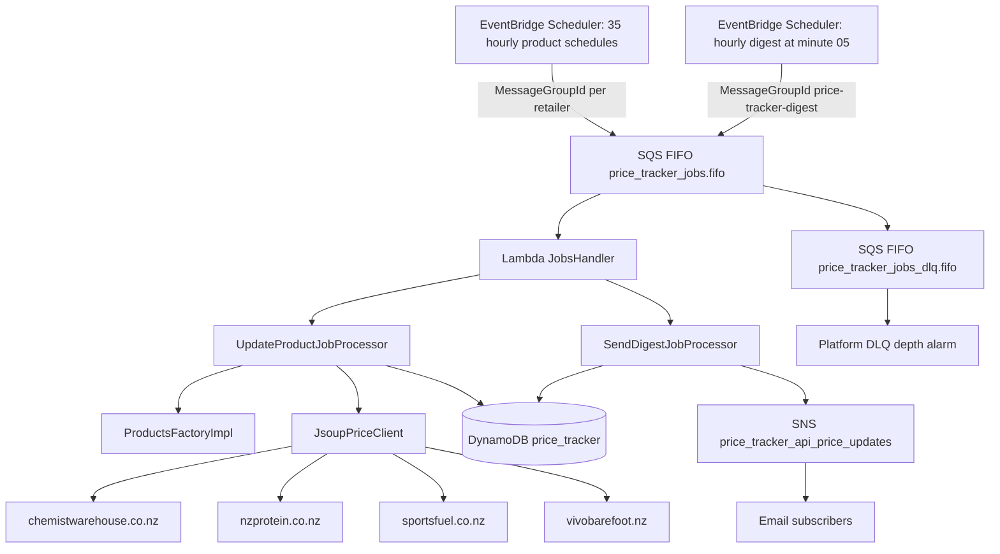
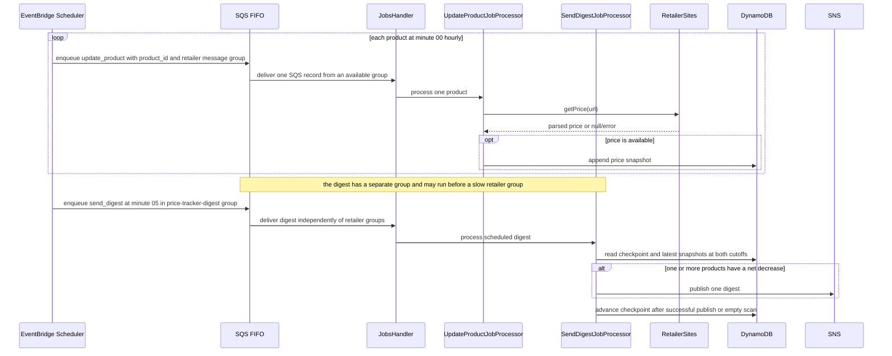

# Price tracker service

The price tracker service checks a curated catalog of retailer product pages every hour, records price history, and emails one hourly digest when products have net price decreases.

## Overview

- **Service type**: backend queued worker (`price_tracker_api`)
- **Interface**: EventBridge Scheduler -> SQS FIFO -> AWS Lambda (`RequestHandler<SQSEvent, Void>`)
- **Runtime**: AWS Lambda (Java 21)
- **Primary storage**: DynamoDB table `price_tracker`
- **Primary outbound integrations**: retailer websites and Amazon SNS
- **Primary consumers**: Terraform-managed SNS email subscribers

## User stories

- As a shopper, I want each tracked product checked hourly, so that price history is collected on a predictable cadence.
- As an email subscriber, I want one hourly digest containing net price decreases, so that I can review changes together without receiving an email for every product.
- As a maintainer, I want failed jobs retained in a passive dead-letter queue, so that persistent failures can be inspected and redriven.
- As a maintainer, I want hourly snapshots preserved, so that price history remains auditable.

## Features and scope boundaries

### In scope

- Queue one update job per curated product every hour.
- Scrape product pages using host-specific extractor implementations.
- Persist append-only price snapshots for each successfully scraped product.
- Queue one digest job five minutes after the hourly product schedules.
- Compare each product's latest price at the previous successful digest checkpoint with its latest price at the current cutoff. Include one line when the net price decreased.
- Retry failed jobs through SQS and route jobs that fail five receives to a passive worker DLQ.
- Alert when the worker DLQ contains visible messages.

### Out of scope

- Public CRUD APIs for managing products, subscriptions, or historical records.
- Currency conversion, freight/tax normalization, or cross-store ranking analytics.
- Automatic bypass/remediation for anti-bot protections or breaking retailer HTML changes.
- A Scheduler DLQ, exactly-once SNS publication, or a manual operations runbook.

### Current catalog summary

| Retailer                                         | Product count | Representative examples                    |
| ------------------------------------------------ | ------------- | ------------------------------------------ |
| Chemist Warehouse (`www.chemistwarehouse.co.nz`) | `32`          | Dynamic Whey 2kg, Quest Protein Bars       |
| NZ Protein (`www.nzprotein.co.nz`)               | `1`           | NZ Whey 1kg                                |
| Sportsfuel (`www.sportsfuel.co.nz`)              | `1`           | Clean Nutrition Whey Protein 1kg - Vanilla |
| Vivobarefoot (`vivobarefoot.nz`)                 | `1`           | Tracker Forest ESC Men's - Bracken         |

## Architecture


```mermaid
flowchart TD
  productSchedules[EventBridge Scheduler: 35 hourly product schedules] -->|MessageGroupId per retailer| jobsQueue[SQS FIFO price_tracker_jobs.fifo]
  digestSchedule[EventBridge Scheduler: hourly digest at minute 05] -->|MessageGroupId price-tracker-digest| jobsQueue
  jobsQueue --> jobsHandler[Lambda JobsHandler]
  jobsHandler --> updateProcessor[UpdateProductJobProcessor]
  jobsHandler --> digestProcessor[SendDigestJobProcessor]
  updateProcessor --> productsFactory[ProductsFactoryImpl]
  updateProcessor --> priceClient[JsoupPriceClient]
  priceClient --> chemistWarehouse[chemistwarehouse.co.nz]
  priceClient --> nzProtein[nzprotein.co.nz]
  priceClient --> sportsfuel[sportsfuel.co.nz]
  priceClient --> vivobarefoot[vivobarefoot.nz]
  updateProcessor --> table[(DynamoDB price_tracker)]
  digestProcessor --> table
  digestProcessor --> snsTopic[SNS price_tracker_api_price_updates]
  snsTopic --> subscribers[Email subscribers]
  jobsQueue --> jobsDlq[SQS FIFO price_tracker_jobs_dlq.fifo]
  jobsDlq --> platformAlarm[Platform DLQ depth alarm]
```

### Primary workflow


```mermaid
sequenceDiagram
  participant scheduler as EventBridge Scheduler
  participant queue as SQS FIFO
  participant handler as JobsHandler
  participant update as UpdateProductJobProcessor
  participant digest as SendDigestJobProcessor
  participant retailers as RetailerSites
  participant table as DynamoDB
  participant sns as SNS

  loop each product at minute 00 hourly
    scheduler->>queue: enqueue update_product with product_id and retailer message group
    queue->>handler: deliver one SQS record from an available group
    handler->>update: process one product
    update->>retailers: getPrice(url)
    retailers-->>update: parsed price or null/error
    opt price is available
      update->>table: append price snapshot
    end
  end
  Note over queue,digest: the digest has a separate group and may run before a slow retailer group
  scheduler->>queue: enqueue send_digest at minute 05 in price-tracker-digest group
  queue->>handler: deliver digest independently of retailer groups
  handler->>digest: process scheduled digest
  digest->>table: read checkpoint and latest snapshots at both cutoffs
  alt one or more products have a net decrease
    digest->>sns: publish one digest
  end
  digest->>table: advance checkpoint after successful publish or empty scan
```

## Main technical decisions

- Keep the service as a queued Lambda worker because the hourly catalog is split into independent product jobs.
- Store the tracked catalog and stable product IDs in `ProductsFactoryImpl`; keep the corresponding `product_ids` map in Terraform alongside the Scheduler resources.
- Route parsing by URL host to dedicated extractors (`Chemist Warehouse`, `NZ Protein`, `Sportsfuel`, `Vivobarefoot`) for deterministic selector behavior per site.
- Track only the Vanilla Sportsfuel variant using its `?variant=<id>` URL.
- Keep price snapshots append-only and retain their existing key and attribute format.
- Use one FIFO message group per retailer and a separate `price-tracker-digest` group, with batch size one. SQS preserves order within each group while Lambda can process different groups concurrently. Requests to one retailer remain serial, and a retailer failure does not block other retailers or the digest.
- The digest can run before a slow retailer group finishes. Product snapshots written after its cutoff are included by a later digest. A failed message blocks later messages in its retailer group until it succeeds or moves to the DLQ after five receives. The DLQ alarm surfaces persistent failures for inspection.
- Include only one net decrease per product. If a price drops and then recovers before the digest runs, that intermediate drop is not included. If it drops more than once and ends lower, the digest shows one line from the price at the previous checkpoint to the current price.
- Store the last successful digest cutoff as a checkpoint item in the existing DynamoDB table. No historical snapshot migration or table index change is needed.
- Treat queue processing and SNS publication as at least once. An ambiguous failure after SNS accepts a digest but before the checkpoint write can cause the next attempt to send the same digest again.
- Schedule product messages at minute 00 and digest messages at minute 05 in UTC. UTC keeps hourly boundaries continuous through New Zealand daylight-saving changes.
- Keep the existing DynamoDB table name (`price_tracker`) and SNS topic name (`price_tracker_api_price_updates`).

## Domain glossary

- **Tracked product**: one stable product ID, curated URL, and display name from `ProductsFactory`.
- **Price snapshot**: one persisted DynamoDB row for a product at a specific scrape timestamp.
- **Digest cutoff**: the last fully elapsed epoch second captured when a digest job begins processing.
- **Digest checkpoint**: one DynamoDB item recording the cutoff included in the last successful digest scan.
- **Net price decrease**: the latest price at the current cutoff is lower than the latest price at the previous successful checkpoint.
- **Worker job**: one `update_product` or `send_digest` message delivered from the FIFO queue to `JobsHandler`.

## Integration contracts

### External systems

- **Chemist Warehouse website** (`www.chemistwarehouse.co.nz`): outbound HTTPS `GET` using Jsoup with browser-like headers and `30s` timeout. The request URL comes from the curated catalog. Auth method is none. Cadence is hourly per product. A `null` extracted price is skipped; exhausted request or parsing exceptions fail that product job.
- **NZ Protein website** (`www.nzprotein.co.nz`): outbound HTTPS `GET` with the same client behavior. Cadence is hourly. A `null` extracted price is skipped; exceptions fail that product job.
- **Sportsfuel website** (`www.sportsfuel.co.nz`): one outbound HTTPS `GET` per hour for the Vanilla variant, using its `?variant=<id>` URL. A `null` extracted price is skipped; exceptions fail that product job.
- **Vivobarefoot website** (`vivobarefoot.nz`): one outbound HTTPS `GET` per hour for the Tracker Forest ESC Men's Bracken product. A `null` extracted price is skipped; exceptions fail that product job.
- **Amazon SNS** (`price_tracker_api_price_updates`): publish one digest when at least one product has a net decrease. The subject contains the decrease count; each body entry contains product name, previous price, current price, and URL. Auth uses the worker Lambda IAM role. Publish failures fail the digest job and leave the checkpoint unchanged.
- **Amazon SQS**: FIFO queue `price_tracker_jobs.fifo` receives one `update_product` message per product each hour and one `send_digest` message at minute 05. Content-based deduplication is enabled. Product messages use retailer groups `chemist-warehouse`, `nz-protein`, `sportsfuel`, or `vivobarefoot`; digest messages use `price-tracker-digest`. Retention is 14 days and Lambda event-source batch size is one. Failed worker messages are retried and moved after five receives to passive FIFO DLQ `price_tracker_jobs_dlq.fifo`, which also retains messages for 14 days. A failed product message blocks later messages for its retailer only.
- **Amazon EventBridge Scheduler**: 35 schedules enqueue product updates with `cron(0 * * * ? *)`; one schedule enqueues the digest with `cron(5 * * * ? *)`; both use UTC. Each uses the universal SQS `sendMessage` target, a dedicated role allowed to send only to the jobs queue, and a retry policy of five attempts over one hour. There is no Scheduler DLQ; a terminal failure to enqueue is an accepted missed run.

## API contracts

### Conventions

- The service exposes no public REST endpoints.
- Invocation contract is one-record Lambda SQS execution with input `SQSEvent` and output `null`. The handler rejects any batch size other than one.
- Handler exceptions are logged and rethrown as runtime exceptions, leaving the message for SQS retry.
- `scheduled_at` is required and must be an ISO-8601 instant. Product update messages must contain a known `product_id`.

### Endpoint summary

| Interface                         | Contract                                                     | Purpose                         |
| --------------------------------- | ------------------------------------------------------------ | ------------------------------- |
| EventBridge Scheduler -> SQS FIFO | `update_product` with stable `product_id` and `scheduled_at` | enqueue one product scrape      |
| EventBridge Scheduler -> SQS FIFO | `send_digest` with `scheduled_at`                            | enqueue the hourly price digest |
| SQS FIFO -> Lambda                | one-record `SQSEvent` to `JobsHandler`                       | process one product or digest   |

### Example request and response

Product update message:

```json
{
  "job_type": "update_product",
  "product_id": "chemist-warehouse-74329",
  "scheduled_at": "2026-09-30T08:00:00Z"
}
```

Digest message:

```json
{
  "job_type": "send_digest",
  "scheduled_at": "2026-09-30T08:05:00Z"
}
```

Handler result on success:

```json
null
```

An update with an unavailable extracted price succeeds without writing a snapshot. Other errors fail the invocation so SQS retries the message.

## Data and storage contracts

### DynamoDB model

- **Table name**: `price_tracker`
- **Snapshot primary key**:
  - `pk`: `PRODUCT#<url>`
  - `sk`: `TIMESTAMP#<epoch_seconds_padded_to_10_digits>`
- **Snapshot attributes**:
  - `pk` (String)
  - `sk` (String)
  - `price` (Number / Double)
  - `timestamp` (Number in storage, mapped to `Instant` in code)
  - `product` (String)
  - `url` (String)
  - `version` (Number, optimistic locking)
- **Snapshot access pattern**: strongly consistent query by `pk` and `sk <= cutoff` with `scanIndexForward=false` and `limit=1` to read the latest snapshot at or before a cutoff.
- **Snapshot write pattern**: append a new item per successful product scrape with `putItem`.
- **Checkpoint key**:
  - `pk`: `DIGEST#PRICE_DECREASES`
  - `sk`: `CHECKPOINT`
- **Checkpoint attribute**: `processed_through` (Number, epoch seconds). The digest writes the checkpoint after a successful SNS publish or after a scan with no decreases.

Representative snapshot:

```json
{
  "pk": "PRODUCT#https://www.chemistwarehouse.co.nz/buy/74329/inc-100-dynamic-whey-chocolate-flavour-2kg",
  "sk": "TIMESTAMP#1760000000",
  "price": 52.0,
  "timestamp": 1760000000,
  "product": "Chemist Warehouse - Dynamic Whey 2kg - Chocolate",
  "url": "https://www.chemistwarehouse.co.nz/buy/74329/inc-100-dynamic-whey-chocolate-flavour-2kg",
  "version": 1
}
```

Representative checkpoint:

```json
{
  "pk": "DIGEST#PRICE_DECREASES",
  "sk": "CHECKPOINT",
  "processed_through": 1760000000
}
```

## Behavioral invariants and time semantics

- Each product job captures `now` once and uses it for that snapshot.
- Snapshot timestamps are stored as epoch seconds (UTC) via `EpochSecondConverter`.
- Each digest captures its cutoff as the last fully elapsed epoch second before querying. Snapshot and checkpoint reads are strongly consistent. This avoids advancing the checkpoint past a product snapshot written later in the same second or missing an earlier completed write.
- The prior comparison boundary is the last successful digest checkpoint. On the first digest, the baseline is one hour before that message's `scheduled_at`.
- For each catalog product, the digest compares the latest snapshot at or before the prior checkpoint with the latest snapshot at or before the current cutoff. It sends a line only when both exist and `currentPrice < previousPrice`.
- A first-seen product has no prior snapshot and is not included. Price increases and unchanged prices are not notified. Multiple snapshots between checkpoints produce one net comparison per product; intermediate drops that recover are omitted.
- A product job makes one fetch attempt. A `null` price is skipped without a snapshot; network errors, non-`2xx` responses, and extraction exceptions fail the invocation so SQS retries the message.
- The checkpoint advances after SNS publish succeeds or when there are no decreases. If SNS publish fails, the checkpoint is unchanged and SQS retries the digest.
- If SNS accepted a digest but the checkpoint write then fails, a retry may publish the same digest again. Delivery is at least once.
- A late product update processed after a digest cutoff is included by the next digest, because the checkpoint does not advance past its timestamp.
- Non-`2xx` responses are logged at warn level with status code, response headers, and response body (body truncated to `1000` characters).

## Source of truth

| Entity                     | Authoritative source                | Notes                                                    |
| -------------------------- | ----------------------------------- | -------------------------------------------------------- |
| Product catalog and IDs    | `ProductsFactoryImpl`               | Curated list shipped with deployments                    |
| Product schedule IDs       | `infra/main.tf` `local.product_ids` | Must match IDs in `ProductsFactoryImpl`                  |
| Product message groups     | `infra/main.tf` product ID prefixes | Must map every scheduled product to its retailer group   |
| Product page current price | Retailer HTML page at scrape time   | Parsed through host-specific extractor                   |
| Historical tracked prices  | DynamoDB `price_tracker` snapshots  | Canonical source for digest comparisons and history      |
| Digest progress            | DynamoDB checkpoint item            | Advances after a successful digest publish or empty scan |
| Decrease notifications     | SNS topic messages                  | Derived from latest snapshots at the two digest cutoffs  |
| Subscriber endpoints       | Terraform `local.subscriptions`     | Managed in infrastructure, not in application code       |

## Security and privacy

- The service has no public HTTP endpoint; EventBridge Scheduler sends messages to the FIFO queue using a dedicated IAM role.
- Worker IAM grants access to CloudWatch Logs, `price_tracker` DynamoDB actions, SNS publish/list operations, and receive/delete operations on the jobs queue.
- The service does not read from Secrets Manager and has no custom secret payload contract.
- Stored data is public product metadata (name, URL, price, timestamp), not user PII.
- Outbound traffic is HTTPS scraping against public retailer pages plus AWS API calls.

## Configuration and secrets reference

### Environment variables

| Name                                          | Required                                       | Purpose                                       | Default behavior                                           |
| --------------------------------------------- | ---------------------------------------------- | --------------------------------------------- | ---------------------------------------------------------- |
| `PRICE_TRACKER_CHEMIST_WAREHOUSE_BASE_URL`    | optional                                       | Override Chemist Warehouse product URL base   | `https://www.chemistwarehouse.co.nz`                       |
| `PRICE_TRACKER_NZ_PROTEIN_BASE_URL`           | optional                                       | Override NZ Protein product URL base          | `https://www.nzprotein.co.nz`                              |
| `PRICE_TRACKER_SPORTSFUEL_BASE_URL`           | optional                                       | Override Sportsfuel product URL base          | `https://www.sportsfuel.co.nz`                             |
| `PRICE_TRACKER_VIVOBAREFOOT_BASE_URL`         | optional                                       | Override Vivobarefoot product URL base        | `https://vivobarefoot.nz`                                  |
| `AWS_REGION`                                  | runtime-provided in AWS; test-provided locally | Region for AWS SDK clients                    | Terraform and tests use `ap-southeast-2`                   |
| `AWS_ACCESS_KEY_ID` / `AWS_SECRET_ACCESS_KEY` | local tests only                               | AWS SDK credentials for local test containers | Not required in production Lambda (execution role is used) |

### Secret shape

- none in current scope.

## Performance envelope

- Product schedules enqueue `35` update messages at minute 00 each hour; one digest message is enqueued at minute 05. Product messages use four retailer groups, and the digest uses its own group. Lambda can process up to five groups concurrently, subject to available concurrency, while each retailer remains sequential.
- The Chemist Warehouse group receives `32` messages per hour. Its average processing time must stay below `112.5s` per message for that group to drain before the next hourly batch.
- Retailer fetches have a `30s` timeout. SQS retries a failed message after the queue's `720s` visibility timeout and moves it to the DLQ after five receives.
- Worker Lambda timeout is `120s`; queue visibility timeout is `720s` (six times the worker timeout). The event-source batch size is one.
- A digest performs up to `70` latest-snapshot queries (two for each product) plus the checkpoint read/write. At current catalog size this is a small `PAY_PER_REQUEST` workload.
- The DynamoDB table uses `PAY_PER_REQUEST` billing mode.

## Testing and quality gates

- **Unit tests** (`//price_tracker_api:unit-tests`) validate product ID lookup, catalog uniqueness, extractor parsing, and unsupported host handling.
- **Integration tests** (`//price_tracker_api:integration-tests`) validate one-product snapshot writes, null-price skip and unknown product handling, message parsing, checkpoint initialization/advancement, net decreases, recovered intermediate drops, and SNS failure behavior with DynamoDB test containers and fakes.
- **E2E tests** (`//price_tracker_api:e2e-tests`) validate LocalStack FIFO delivery, representative retailer scraping, and net-decrease digest publication using mock retailer websites on an internal Testcontainers network.
- E2E runs are CI-safe and do not require outbound internet access to retailer hosts.
- Recommended pre-merge checks: `bazel build //price_tracker_api:all` and `bazel test //price_tracker_api:all`.

## Local development and smoke checks

- Build service targets: `bazel build //price_tracker_api:all`
- Run all service tests: `bazel test //price_tracker_api:all`
- Product ID/catalog checks: `bazel test --test_filter=ProductsFactoryImplTest //price_tracker_api:unit-tests`
- Core product update behavior: `bazel test --test_filter=UpdateProductJobProcessorIntegrationTest //price_tracker_api:integration-tests`
- Digest comparison behavior: `bazel test --test_filter=SendDigestJobProcessorIntegrationTest //price_tracker_api:integration-tests`
- Full queue-driven E2E validation: `bazel test //price_tracker_api:e2e-tests`

## End-to-end scenarios

### Scenario 1: hourly product updates produce a net decrease digest

1. EventBridge Scheduler enqueues one `update_product` message per product at minute 00 UTC, using the product's retailer message group.
2. `JobsHandler` dispatches each message to `UpdateProductJobProcessor`, which resolves the stable product ID and scrapes one page.
3. A numeric price appends a snapshot; a `null` extracted price is skipped. A thrown error fails only that product job and is retried by SQS.
4. EventBridge Scheduler enqueues `send_digest` at minute 05 in the independent `price-tracker-digest` group. It can run while product groups are still processing.
5. `SendDigestJobProcessor` compares each product's latest price at the previous successful checkpoint with its latest price at the current processing cutoff. Product snapshots written after this cutoff are picked up by the next digest.
6. If any product has a lower net price, one SNS email lists one decrease per product. The checkpoint advances after a successful publish.

### Scenario 2: a digest spans multiple product checks

1. Product update messages continue independently in their retailer groups while the digest is delayed or retried in its own group.
2. When the digest runs, its cutoff covers snapshots written through that processing time, whether or not every retailer group has finished its hourly work.
3. For each product, the digest compares only the latest price at the previous checkpoint with the latest price at the new cutoff. A product update completed after the cutoff is included by the next digest.
4. A product that drops and recovers produces no decrease; a product that ends lower produces one line from its previous-checkpoint price to its current price.
5. The digest advances the checkpoint, so later digests do not reprocess that interval.

### Scenario 3: a product job fails repeatedly

1. A product update throws, for example because its retailer rate-limits the request.
2. SQS retries the same message up to five receives. Later messages for that retailer remain ordered behind it, while other retailer groups and the digest continue.
3. If all five receives fail, SQS moves the job to `price_tracker_jobs_dlq.fifo` and the next message for that retailer can proceed.
4. The platform DLQ alarm fires while at least one message is visible. After the cause is fixed, the failed job can be inspected and manually redriven.
