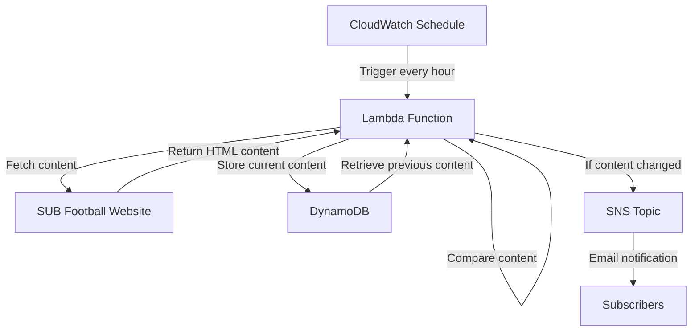

# Subfootball tracker service

The subfootball tracker service monitors the SUB Football registration page for content changes and notifies subscribers when updates are detected.

## System architecture

## Requirements

### Functional requirements

- Monitor the SUB Football registration page for content changes
- Store historical content snapshots in a database
- Send email notifications when content changes are detected
- Track only a single page (registration page) at present
- Execute monitoring on a scheduled basis (hourly)

### Technical specifications

- Content snapshot history retained indefinitely
- Email notifications sent within minutes of change detection
- Support for multiple email subscribers
- Maximum execution time: 30 seconds
- Memory allocation: 1024MB

## Implementation details

### Technologies

- AWS Lambda for serverless execution
- DynamoDB for storing content snapshots
- Amazon SNS for notification delivery
- Amazon CloudWatch Events for scheduling
- Java 17 runtime environment
- Jsoup library for HTML parsing
- Terraform for infrastructure as code

### Key components

- `UpdatePageContentHandler`: Lambda handler that processes scheduled events
- `JsoupSubfootballClient`: Client for retrieving website content
- `SubfootballTrackerItem`: Data model for tracking content snapshots
- `NotificationPublisher`: Interface for sending content update alerts

### Configuration

- Lambda execution frequency: Once per hour
- DynamoDB table: "subfootball_tracker" (partition key: pk, sort key: sk)
- SNS topic name: "subfootball_tracker_api_page_content_updates"
- Point-in-time recovery: Enabled
- Deletion protection: Enabled
