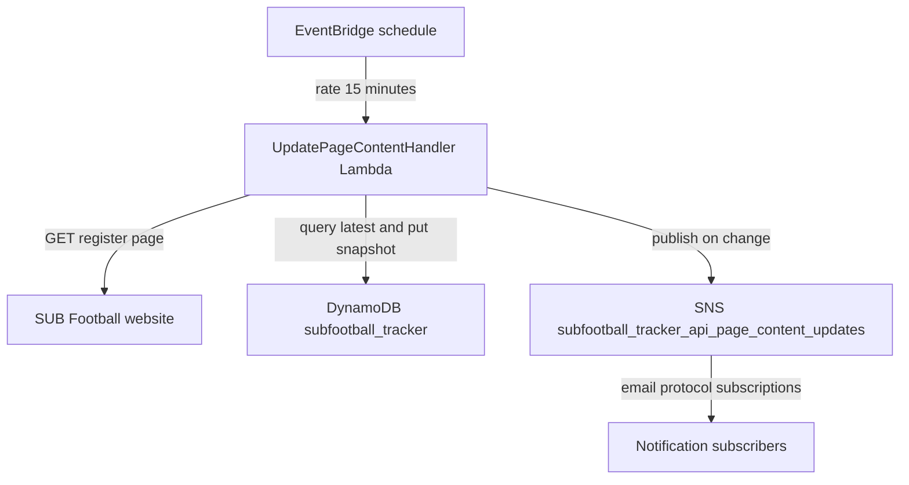
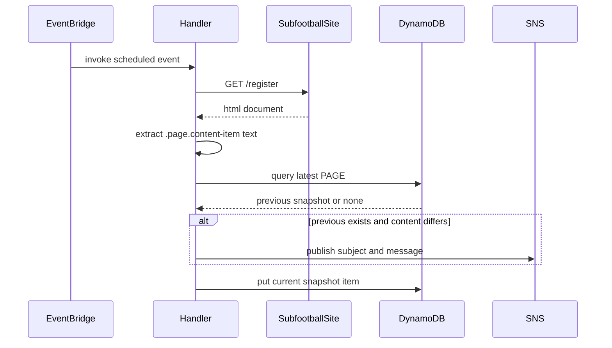

# Subfootball tracker API

The subfootball tracker API service runs a scheduled backend workflow that monitors the SUB Football registration page, stores snapshots, and sends email notifications when content changes are detected.

## Overview

- **Service type**: backend scheduled worker (`subfootball_tracker_api`)
- **Interface**: EventBridge scheduled event to an AWS Lambda handler (`RequestHandler<ScheduledEvent, Void>`)
- **Runtime**: AWS Lambda (Java 21)
- **Primary storage**: DynamoDB table `subfootball_tracker`
- **Primary consumers**: email subscribers on SNS topic `subfootball_tracker_api_page_content_updates`

## Features and scope boundaries

### In scope

- Run `UpdatePageContentHandler` on a fixed EventBridge schedule (`rate(15 minutes)`).
- Fetch `/register` from a configurable SUB Football base URL (defaults to `https://subfootball.com`) and extract the `.page.content-item` text content.
- Compare the latest stored snapshot against the current scrape result.
- Publish an SNS email notification when current content differs from the previous snapshot.
- Persist a new snapshot item on every run, including runs with no detected change.
- Keep infrastructure resources managed by Terraform (Lambda, EventBridge rule, DynamoDB table, SNS topic/subscriptions).

### Out of scope

- Monitoring any page other than the SUB Football registration page.
- Exposing public REST endpoints or interactive UI flows from this service.
- Storing structured content diffs or classifying change types.
- Retention pruning or TTL-based deletion of historical snapshots.
- Retry orchestration beyond default AWS service behavior.

## Architecture



### Primary workflow



## Main technical decisions

- Use EventBridge + Lambda for low operational overhead and predictable polling cadence.
- Store snapshots in DynamoDB with `pk`/`sk` key prefixes so the latest content can be queried with a single descending query.
- Persist a new snapshot on every run (not only on changes) so history reflects each poll result over time.
- Use Jsoup and a single CSS selector (`.page.content-item`) for simple extraction without browser automation.
- Resolve SNS topic ARN dynamically by listing topics and matching by topic-name suffix; this keeps publish calls simple but assumes exactly one matching topic exists.
- Make the SUB Football base URL configurable through one optional environment variable so E2E can run against a local stub while production keeps the existing upstream default.
- Keep table and topic names fixed in service code to reduce per-environment configuration complexity.

## Domain glossary

- **Registration content**: normalized text extracted from `.page.content-item` at `https://subfootball.com/register`.
- **Snapshot**: one persisted record containing content for a specific scrape timestamp.
- **Previous snapshot**: the newest persisted item for `PAGE#REGISTRATION` before the current run.
- **Change notification**: SNS publish event emitted only when current content differs from the previous snapshot.

## Integration contracts

### External systems

- **SUB Football website**: outbound unauthenticated `GET` to `<subfootball_base_url>/register` every scheduled run. `subfootball_base_url` defaults to `https://subfootball.com` and can be overridden with `SUBFOOTBALL_TRACKER_SUBFOOTBALL_BASE_URL` for test environments. The service requires `.page.content-item` to exist and normalizes extracted lines by translating `<br>` and `<p>` boundaries into newline separators before text comparison.
- **Amazon DynamoDB**: outbound query and put operations against table `subfootball_tracker`. The service queries the latest snapshot for `pk = PAGE#REGISTRATION` and always writes a new snapshot item.
- **Amazon SNS**: outbound publish to topic `subfootball_tracker_api_page_content_updates` when a content change is detected. The publisher resolves topic ARN using `ListTopics` and suffix matching; missing or duplicate matches fail the invocation.

## API contracts

### Conventions

- This service does not expose public HTTP endpoints in current scope.
- Invocation contract is Lambda scheduled execution: input `ScheduledEvent`, output `null`.
- Errors are logged and rethrown as runtime exceptions, causing invocation failure.

### Endpoint summary

| Interface             | Contract                                      | Purpose                                               |
| --------------------- | --------------------------------------------- | ----------------------------------------------------- |
| EventBridge -> Lambda | scheduled event to `UpdatePageContentHandler` | trigger scrape, compare, notify, and persist workflow |

### Example request and response

Invocation event (representative):

```json
{
  "source": "aws.events",
  "detail-type": "Scheduled Event"
}
```

Handler result on success:

```json
null
```

## Data and storage contracts

### DynamoDB model

- **Table name**: `subfootball_tracker`
- **Primary key**:
  - `pk` (string): `PAGE#<page>`; current page value is `REGISTRATION`
  - `sk` (string): `TIMESTAMP#<epoch_seconds>` with epoch seconds zero-padded to 10 digits
- **Attributes**:
  - `page` (enum/string): `REGISTRATION`
  - `timestamp` (number): epoch seconds
  - `content` (string): extracted page text
  - `version` (number): optimistic locking version (`@DynamoDbVersionAttribute`)
- **Access pattern**:
  - latest snapshot lookup: `pk = PAGE#REGISTRATION`, `scanIndexForward = false`, `limit = 1`
- **Retention behavior**:
  - no TTL configured; historical snapshots are retained indefinitely unless deleted out-of-band

Representative record:

```json
{
  "pk": "PAGE#REGISTRATION",
  "sk": "TIMESTAMP#1739295600",
  "page": "REGISTRATION",
  "timestamp": 1739295600,
  "content": "Current registration details line 1\nCurrent registration details line 2",
  "version": 3
}
```

## Behavioral invariants and time semantics

- Every invocation writes exactly one new snapshot item to DynamoDB.
- Notification is published only when a previous snapshot exists and `previous.content` is not equal to current content.
- First successful run does not notify because there is no previous snapshot to compare.
- Snapshot ordering is deterministic because `sk` encodes zero-padded epoch seconds and the query requests descending order.
- Timestamp values are generated from `Clock.now()` (system clock in production) and persisted as epoch seconds.
- Notification payload format is deterministic:
  - subject: `SUB Football registration page updated`
  - message prefix: `The latest content reads:`
  - content lines separated with CRLF blank-line spacing (`\r\n\r\n`)

## Source of truth

| Entity                    | Authoritative source                            | Notes                                                                                                      |
| ------------------------- | ----------------------------------------------- | ---------------------------------------------------------------------------------------------------------- |
| Live registration content | `<subfootball_base_url>/register` response body | defaults to `https://subfootball.com/register`; E2E can override base URL for deterministic local fixtures |
| Snapshot history          | DynamoDB `subfootball_tracker` items            | service writes one item per successful run                                                                 |
| Notification distribution | SNS topic subscriptions defined in Terraform    | topic publishes only when change is detected                                                               |
| Polling cadence           | EventBridge rule `rate(15 minutes)`             | schedule is infrastructure-defined                                                                         |

## Security and privacy

- Service is event-driven and does not expose public HTTP endpoints.
- Lambda IAM role is granted DynamoDB and SNS permissions required for this workflow.
- AWS credentials are provided via Lambda execution role and AWS SDK default provider chain.
- All external calls use HTTPS (SUB Football website and AWS APIs).
- Notification emails include full extracted registration content; subscriber list should be controlled as operationally sensitive data.
- Error logging captures invocation failures; avoid extending logs to include credential material.

## Configuration and secrets reference

### Environment variables

| Name                                       | Required | Purpose                                            | Default behavior                                         |
| ------------------------------------------ | -------- | -------------------------------------------------- | -------------------------------------------------------- |
| `SUBFOOTBALL_TRACKER_SUBFOOTBALL_BASE_URL` | no       | override base URL used by `JsoupSubfootballClient` | falls back to `https://subfootball.com` when unset/blank |

### Secret shape

None in current scope. The service does not read Secrets Manager secrets or custom secret payloads.

## Performance envelope

- Poll cadence is fixed at one invocation every 15 minutes.
- Lambda runtime settings are `memory_size = 1024` MB and `timeout = 30` seconds.
- Each invocation performs one website fetch, one DynamoDB query, one DynamoDB put, and optional SNS publish.
- No additional latency SLA/SLO targets are defined in current scope beyond successful completion within Lambda timeout.

## Testing and quality gates

- Integration coverage exists for the core happy path in `UpdatePageContentHandlerIntegrationTest`:
  - latest snapshot lookup and write
  - notification publish on content change
  - expected notification subject and message format
- Integration tests use DynamoDB test containers plus fake SUB Football client and fake notification publisher.
- E2E coverage exists in `SubfootballTrackerE2ETest`:
  - boots LocalStack with table, topic, queue, and lambda wiring from `init_resources.py`
  - runs lambda invocation path end-to-end through AWS SDK clients
  - uses a local Java `HttpServer` SUB Football stub container on a dedicated Docker network
  - validates SNS-to-SQS notification delivery and latest snapshot persistence
- Required checks before merge:
  - `bazel test //subfootball_tracker_api:integration-tests`
  - `bazel test //subfootball_tracker_api:e2e-tests`
  - `bazel build //subfootball_tracker_api:update-page-content-handler`

## Local development and smoke checks

- Run integration tests locally: `bazel test //subfootball_tracker_api:integration-tests`
- Run deterministic offline E2E locally: `bazel test //subfootball_tracker_api:e2e-tests`
- Build deployable handler artifact: `bazel build //subfootball_tracker_api:update-page-content-handler`
- Minimal smoke verification:
  - test setup seeds prior content and sets new scrape content
  - handler invocation writes a new snapshot with current timestamp
  - one notification is recorded for topic `subfootball_tracker_api_page_content_updates`

## End-to-end scenarios

### Scenario 1: first run with no previous snapshot

1. EventBridge triggers `UpdatePageContentHandler`.
2. Handler fetches and extracts current registration content from SUB Football.
3. Handler queries DynamoDB and finds no previous `PAGE#REGISTRATION` item.
4. Handler skips SNS publish and writes the first snapshot item.

### Scenario 2: content change detected on subsequent run

1. EventBridge triggers handler after at least one prior snapshot exists.
2. Handler fetches current registration content and loads latest previous snapshot.
3. Handler detects content mismatch and publishes SNS message with subject `SUB Football registration page updated`.
4. Handler writes the new snapshot so future comparisons use the latest content.
