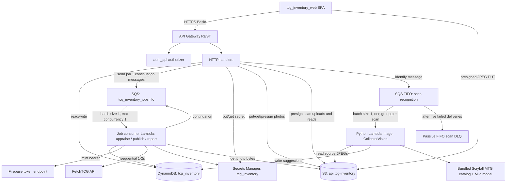
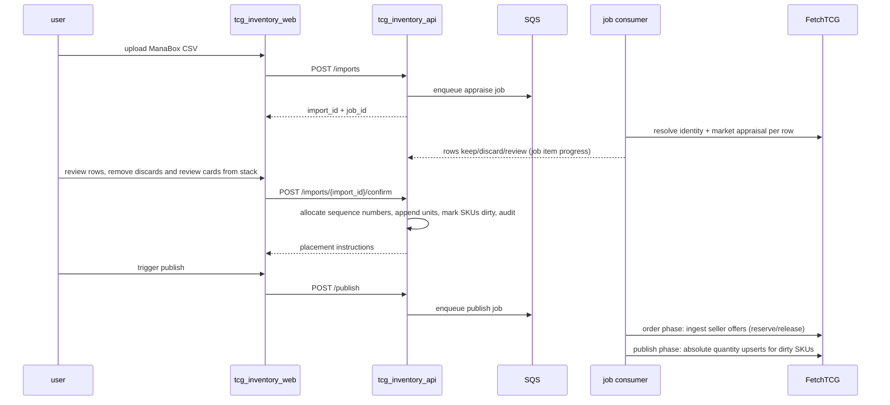
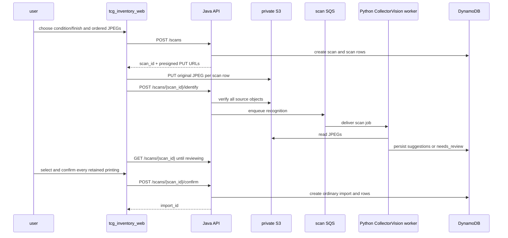

# TCG inventory API

The TCG inventory API service is the source of truth for a physical Magic: The Gathering card inventory stored under chaos sorting, projecting in-stock units to FetchTCG listings and mirroring FetchTCG order activity back as reservations, pulls, and releases.

## Overview

- **Service type**: backend API (`tcg_inventory_api`)
- **Interface**: REST over HTTPS plus an SQS-driven job consumer
- **Runtime**: AWS Lambda (Java 21) behind API Gateway REST; Java job Lambda consuming SQS; Python CollectorVision Lambda image consuming a separate scan queue
- **Primary storage**: DynamoDB table `tcg_inventory` with `gsi1`, `gsi2`, and `gsi3`; S3 bucket `api.tcg-inventory.jordansimsmith.com` (listing photos under `users/<user>/photos/`, source scans under `users/<user>/scans/`)
- **Auth model**: API Gateway custom REQUEST authorizer provided by the shared `auth_api` service (see `auth_api/README.md`)
- **External integration**: FetchTCG website API (unofficial), Firebase token exchange, and offline CollectorVision Scryfall MTG catalog; browser-direct Scryfall lookup for scanner review
- **Primary consumer**: `tcg_inventory_web`

## User stories

- As a card seller, I want to import a ManaBox scan, review each card's keep/discard appraisal in stack order, and confirm keepers into inventory with assigned storage locations, so that intake requires no physical sorting.
- As a card seller, I want to upload an ordered batch of card-front JPEGs, verify every exact printing, and create an ordinary import, so that a document scanner can replace ManaBox identification without changing appraisal or placement.
- As a card seller, I want scan uploads and recognition suggestions to survive browser closure, so that an interrupted review does not require rescanning the cards.
- As a card seller, I want FetchTCG listing quantities to always equal my in-stock unit counts, so that I never oversell or list phantom stock.
- As a card seller, I want cards appraised at NZ$20 or more to require photos captured during import review and projected onto their FetchTCG listings, so that high-value listings show the actual card the buyer receives.
- As a card seller, I want accepted offers to reserve the exact physical units and paid orders to produce a location-ordered pull sheet, so that fulfilment is one forward pass through my boxes.
- As a card seller, I want to see whether an accepted offer's price differs from my listed price, so that I can tell a lowball or over-ask from a buy-at-list sale.
- As a card seller packing an order, I want the buyer's name, delivery address, and the postage option they paid for, so that I can address and post the parcel without opening FetchTCG.
- As a card seller, I want every inventory mutation audited with before/after state, so that digital counts never silently drift from the physical boxes.
- As a card seller, I want a regenerated overview report of value, movement, and composition, so that I can appreciate the overall state of the inventory without browsing SKU by SKU.
- As a cautious FetchTCG user, I want conservative sequential API traffic and fail-closed credential handling, so that automation risk stays minimal.

## Features and scope boundaries

### In scope

- Authenticated CRUD for imports: upload a ManaBox CSV, appraise rows asynchronously, review appraisal decisions, confirm keepers into inventory, delete unwanted imports before confirm. Import detail derives `total_suggested_price` from keep-row suggested prices.
- Scanner intake: create a batch with one condition (`NM`, `LP`, `MP`, `HP`, or `DMG`) and finish (`normal`, `foil`, or `etched`), upload one ASCII-named JPEG front per card, identify with offline CollectorVision, explicitly confirm each retained Scryfall printing, and create one ordinary appraising import. Ascending filenames are bottom-to-top, and the first scanned row becomes the first import row. Alternate art, double-faced cards, and tokens are supported.
- Durable scan jobs and source images: all-or-abandon batch uploads, background recognition with stored suggestions, manual correction through browser-direct Scryfall calls, irreversible removal of an outlier scan row, deletion of an unfinished job, and read-only confirmed jobs. Confirmed source scans are retained indefinitely and never automatically used as listing photos.
- Appraisal per row: FetchTCG identity resolution for the submitted ManaBox or scan-confirmed printing (candidates verified against the row's Scryfall ID, cached on the SKU after first sight), keep filter, and suggested policy price.
- Inventory browse: SKU search and detail with unit lists and derived locations.
- Listing photos: up to 5 JPEG photos per keep row, captured during import review (raw-body upload, stored durably in S3, served via short-lived presigned URLs); confirm is blocked while any keep row appraised at NZ$20+ has no photos; photos freeze onto units at confirm and are immutable afterwards.
- Manual audited adjustments: remove a unit; change a unit's condition (moving it between SKUs).
- Publish job (single two-phase job): order phase ingests FetchTCG seller offers (reserve, pick-ready, void release on cancellation), then publish phase drains dirty SKUs to FetchTCG — create and update as absolute listing quantities projecting the first in-stock unit's photos as the listing images, delete the listing when the in-stock count reaches zero.
- Pull sheets for paid orders, sorted by unit sequence number; each entry carries the offered per-unit price, the unit's Scryfall ID, the unit's current block position (gaps from sold and removed cards collapsed), and the neighboring cards still in the block; order confirm marks pulled units sold.
- Offer vs listed price: each ingested offer line stores the FetchTCG listing's `listedPrice` at ingest time; `GET /orders` returns item and listed subtotals (shipping excluded) and `GET /orders/{order_id}` returns the same subtotals plus per-line offered and listed prices.
- Fulfillment details on orders: the buyer's display name, delivery address, and selected postage option are captured from the offer and refreshed on every order-phase run, so `GET /orders/{order_id}` carries what packing a parcel needs.
- Reports: an async report job aggregates the entire inventory into a stored dashboard snapshot (headline totals, monthly revenue, weekly intake vs sales, top sets, price buckets, top hits, aging bands); `GET /reports` serves the latest snapshot with staleness metadata and generation status.
- Per-user FetchTCG refresh-token storage with masked reads; fresh one-hour bearer minted per job run.
- Append-only audit log written transactionally with every mutation.

### Out of scope

- Repricing existing listings (a separate repricing process owns price maintenance; this service prices new listings only).
- Marketplaces other than FetchTCG; games other than Magic: The Gathering; non-English cards (they become review rows).
- Camera capture, PNG/TIFF/PDF scans, non-English/non-Magic recognition, scan quality grading, automatic per-image recognition retries, and using source scans as listing photos.
- Post-confirm photo editing (photos freeze at confirm; remove and re-import is the retake path) and FetchTCG buyer photo requests.
- Cost/purchase-price tracking and profit reporting (reports cover revenue and valuation only), bulk lots, master sets, POS, buylist.
- Background/scheduled polling of FetchTCG (all jobs are manually triggered).
- Deleting SKU records (they are permanent once created) or offer negotiation (accept/counter/reject happens on FetchTCG).

## Architecture



### Primary workflow



### Scanner workflow



## CollectorVision image

The image is an amd64, digest-pinned AWS Lambda Python 3.12 OCI image that loads CollectorVision, opens the pinned local v40 catalog with `Catalog.load(..., offline=True, version=40)`, and initializes its CPU ONNX Runtime/Milo embedder. The production handler processes SQS scan messages and uses only the packaged catalog and model at runtime.

The `collectorvision_image` macro in `collectorvision.bzl` owns the cache metadata, catalog downloads, direct Milo download, license layer, Python dependency layer, application layer, image labels, and image-load target. `BUILD.bazel` only invokes that macro. Records, embeddings, and Milo are all checksum-pinned Bazel downloads; Milo is downloaded directly from the pinned CollectorVision commit rather than extracted from the Python wheel.

The image uses `COLLECTORVISION_CACHE=/opt/collectorvision` and the v40 cache layout expected by CollectorVision. Python dependencies, including CPU-only `onnxruntime==1.19.2` and its transitive native dependencies, are installed at the Lambda-standard `/var/task` root, alongside the worker application, so `collector_vision` imports normally without a `PYTHONPATH` or runtime `sys.path` modification. The repository's Python 3.12 toolchain, dependency lock, and Lambda base image are intentionally aligned; the AL2023 Lambda base supplies the glibc version required by the pinned ONNX Runtime wheel without a compatibility-library layer. The package is pinned to commit `2a122d00d25c8d112a90e47bf235a021e0c53b0c`; the 5,191,100-byte Milo download is pinned by SHA-256, and the CollectorVision AGPL-3.0-or-later license is included in the image.

Build the image with `bazel build //tcg_inventory_api:scan-worker-image` and load it with `bazel run //tcg_inventory_api:scan-worker-image-load` for local smoke checks. The `scan-worker-image.digest` target is the authoritative manifest digest, and `scan-worker-image-push` pushes the same OCI layout by digest when given an ECR repository. The Terraform deployment runner creates the manifest-declared ECR repository through boto3 when it is absent, obtains ECR credentials in an isolated Docker config, and passes the resulting `repository@sha256:<digest>` to Lambda. ECR repositories are retained outside Terraform lifecycle; Terraform owns the Lambda retrieval policy and consumers. The worker initializes the pinned catalog and Milo embedder with `offline=True`, reads `SCAN_TABLE_NAME` and `SCAN_BUCKET_NAME`, and resolves the fixed `tcg_inventory_scan_jobs.fifo` queue when it needs to continue a batch.

The deployed worker is an x86_64 image Lambda with 1769 MB memory, a 900-second timeout, and a 30-day CloudWatch log group. Its source queue keeps a 960-second visibility timeout and max receive count 5. The immutable, scan-on-push ECR repository and separate worker role are limited to scan-object reads, the required DynamoDB reads/writes, source-queue delivery and continuation operations, and basic logging; the role has no DLQ access. Terraform pins the Lambda image to the pushed digest; the platform alarm observes both the ordinary job DLQ and the passive scan DLQ, while no DLQ consumer performs recovery.

The shared `infra/modules/container_lambda` module owns the generic image-Lambda role, basic logging policy, explicit log group, published function, and optional event-source mappings. The deployment runner owns creation of the scan-specific ECR repository; this service supplies its retrieval policy, worker data policy, queue, and environment values through Terraform.

## Main technical decisions

### Java package layout

The Java API is organized into hard-boundary vertical packages. `scans` owns scan records, recognition messages, scan persistence, and scan handlers; `imports` owns ManaBox parsing, appraisal, import records, photos during intake, and import handlers; `inventory` owns SKUs, units, locations, sequence allocation, and inventory handlers; `orders` owns offers, reservations, fulfillment, order persistence, and order handlers; `reports` owns report records, aggregation, generation, and report handlers; `publish` owns listing projection, publish orchestration, publish jobs, and publish handlers; and `settings` owns settings persistence and settings handlers. Dagger, jobs, FetchTCG clients, audit records, generic photo policy/storage helpers, and table constants remain in the top-level package.

Bazel mirrors this layout with `:scan-lib`, `:import-lib`, `:inventory-lib`, `:order-lib`, `:report-lib`, `:publish-lib`, and `:settings-lib`. The libraries depend in one direction: scans, imports, inventory, and settings depend on the top-level `:lib`; orders depend on inventory and settings; publish depends on inventory, orders, settings, and the top-level `:lib`; and reports depend on inventory and orders. Cross-vertical composition is kept on the smallest handler or job target that needs it (for example, import confirmation composes imports and inventory, while scan confirmation composes scans and imports). The jobs handler composes all vertical libraries directly; there is no separate jobs library.

- Inventory is the source of truth; FetchTCG listings are an absolute projection: listing quantity = count of `in_stock` units per SKU. Re-importing already-listed cards converges to a no-op, and FetchTCG's own decrement at offer acceptance converges without a write.
- Dirty-marker outbox for the projection: every mutation transaction sets a plain boolean `dirty` on affected SKU records. Only mutation transactions can set the flag, which makes every FetchTCG write traceable to an audited inventory event; blind reconciliation never changes quantities. Coalescing is inherent because the projection is absolute.
- Stock counts are never stored: SKU detail derives `in_stock`/`reserved`/`sold` counts from the unit items in its own partition query. SKU browse returns only identity fields (no counts, no unit fan-out) — users click through to the detail page for counts. With no denormalized aggregate there is nothing to drift or verify. Every mutation transaction bumps a plain `version` number on the affected SKU (`ADD version :1`); the publish phase recounts unit items for its absolute write and clears `dirty` conditionally on the version being unchanged since the recount, so a mutation landing mid-publish fails the clear and the SKU stays dirty for the next run.
- The `tcg_inventory` table remains a single physical-table storage contract, while each persisted record type has its own independent `@DynamoDbBean` schema (`SkuItem`, `UnitItem`, `ImportItem`, `ImportRowItem`, `ScanItem`, `ScanRowItem`, `OrderItem`, `JobItem`, `SettingsItem`, `ReportItem`, `AuditItem`, and `SequenceCounterItem`). Each bean owns its `pk`, `sk`, attributes, and applicable GSI keys; key formats, attribute names, converters, indexes, and REST payloads remain unchanged. Object values used by only one record schema stay nested in that bean, including separate `Photo` value types for units and import rows even though their shapes currently match. Cross-record atomic operations continue to use low-level DynamoDB requests with the concrete table schema for each serialized item.
- SQS FIFO work queue with continuation messages: messages carry only `{user, job_id, job_type}`; the job item's `continuation` is authoritative. The queue is FIFO with one message group per user because the group is what serializes the consumer to concurrency 1 (Lambda event source mappings cannot set maximum concurrency below 2 on standard queues), serializing all FetchTCG traffic and all inventory-mutating jobs (no job lease needed). Each slice does bounded work, checkpoints, and re-enqueues.
- Slice messages for one job are byte-identical, so content-based deduplication is disabled and every send sets an explicit `MessageDeduplicationId` of `<job_id>#<continuation>`: distinct slices are never deduplicated, duplicate re-sends of the same slice within the 5-minute dedup window are suppressed, and a send missing a dedup ID fails loudly instead of silently swallowing a continuation.
- Duplicate SQS delivery is expected and absorbed: slices read the job item fresh, DynamoDB effects are conditionally guarded, FetchTCG effects are absolute upserts keyed by `cardId` + condition.
- One publish job with two ordered phases (order phase before publish phase) structurally prevents relisting stock committed to a pending offer.
- Units are append-only with a globally monotonic `sequence_number` allocated by an atomic counter; storage blocks and locations are pure derivations of it. Sold and removed units leave gaps; nothing is renumbered or reshuffled. Order detail derives each pull unit's current block position at read time by querying the block's sequence range through `gsi3`; stored data never renumbers.
- The offer lifecycle is modeled with reservations: acceptance reserves forward-most in-stock units, payment makes the order pickable, non-payment voids and releases. Confirming a pull sets no dirty flag — the units left the projection at reservation and FetchTCG already decremented at acceptance.
- SKU identity is the deterministic composite `scryfall_id#finish#condition` — computable offline from a ManaBox row with no lookup. SKU records cache the resolved `fetchtcg_card_id` and are never deleted.
- Conditions use the 5-level TCGplayer-style scale; ManaBox's 7 values collapse at import and FetchTCG codes are a boundary translation. NM is the default when no condition is provided.
- FetchTCG traffic is sequential with 1–2 s random request spacing, bounded retries, an endpoint allowlist, and fail-closed bearer handling. Every job run mints a fresh one-hour bearer from the stored refresh token and persists a rotated refresh token when Firebase returns one.
- Reports are a stored snapshot, not live aggregation: a `report` job pages all SKU records via `gsi2` (projection ALL), derives every figure from unit and order items, and overwrites a singleton report item stamped with the latest audit ULID captured at generation start. `GET /reports` computes staleness (comparing the latest audit ULID against the snapshot's as-of audit ULID, plus a 24-hour backstop) without touching inventory partitions. Stock counts stay unstored; the report is a disposable projection regenerated on demand.
- Identity resolution is verified, never ranked: appraisal searches FetchTCG by set, front-face name, and finish, then accepts the first candidate whose `externalReferences.scryfallId` equals the row's Scryfall ID. Search relevance ranking is never trusted, so multiple printings of one name in a set (borderless, showcase, extended art) cannot collapse onto the wrong card; a row with no verified candidate becomes `review`. The search name is diacritic-folded to ASCII so FetchTCG's ASCII catalog names (for example `Khazad-dum`) still match Scryfall spellings, and the query string is URL-encoded so those characters cannot break the request URI.
- The static Scryfall→FetchTCG set mapping is a generated, checked-in artifact; unmapped sets stop appraisal into `review` rather than guessing. The generator maps each FetchTCG set to every distinct Scryfall code found by sampling unique card names from both the newest and oldest ends of that set, so reprint printings filed under an older FetchTCG set (for example MH1 and MH2 Timeshifts under Modern Horizons) still resolve.
- Photos are per-unit, captured on keep rows during import review (the only moment cards are in hand) and immutable after confirm — no unit-level photo mutations exist, so no photo-driven dirty flags or audit events. The import gate is NZ$20 against FetchTCG's NZ$50 client-side rule: the margin makes a sub-gate card later drifting past $50 negligible, and FetchTCG's API never rejects photo-less listings anyway (verified live — it defaults the front image to the stock card image), so a photo-less NZ$50+ upsert logs a warning and proceeds rather than blocking publish.
- Listing images are an absolute projection of the first (lowest sequence) in-stock unit's photos — the exact card the next buyer receives, since reservation allocates forward-most first. Every upsert sends full image state (verified live: an omitted `frontImage` resets to the stock image; a present `additionalImages` replaces the set). Each photo uploads to FetchTCG once ever; the returned URL is cached on the unit's photo entry and remains valid across listing deletion and recreation.
- Photo upload uses a raw `image/jpeg` request body through the API (the CSV import precedent) rather than presigned S3 uploads: client-side re-encoding keeps bodies far below Lambda's payload ceiling, so presign choreography buys nothing at photo sizes.
- Scan source images use direct presigned S3 PUTs because a typical batch has about 100 separate JPEGs. The API persists scan rows and requires every object to exist before it queues recognition; `POST /scans` returns the initial PUT URLs, and `GET /scans/{scan_id}` verifies upload state without issuing replacements. A failed or incomplete batch is abandoned and must be replaced by a new batch. Deletion hard-deletes the scan or row in DynamoDB before attempting S3 cleanup, so parent/row existence is the worker fence; a cleanup failure can leave private, unreachable orphan objects.
- CollectorVision runs in a separate Python Lambda OCI image and SQS queue so CPU inference cannot block the Java FetchTCG queue. The Scryfall MTG catalog snapshot, matching Milo model, and Python dependencies are pinned and bundled at build/deploy time; the worker opens a fixed catalog version with `Catalog.load("mtg", source="scryfall", cache_dir=..., offline=True, version=...)`. The matching Milo ONNX file must also occupy CollectorVision's `models/<model-sha>/model.onnx` cache path, or `catalog.embedder` attempts model resolution despite an offline catalog. A ZIP is unsuitable because the measured unpacked native dependencies alone exceed Lambda's 250 MiB ZIP limit.
- The scan queue is FIFO with batch size 1, one message group per scan, content-based deduplication disabled, and max receive count 5. Every initial or continuation send supplies an explicit `<scan_id>#<next_pending_scan_position>` deduplication ID; the body stays `{user, scan_id}`. Each invocation reads the first 100 pending rows in scan order, runs recognition, and writes each result directly; there is no row claim or `processing` state. Row statuses are the durable continuation checkpoint. Per-row failures become `needs_review`; fatal catalog initialization, infrastructure, and other worker errors propagate for normal SQS retries and then remain in a passive FIFO DLQ. The platform monitors the DLQ with a CloudWatch alarm, but no Lambda consumes it or changes scan state. Duplicate deliveries or overlapping workers may repeat inference and overwrite a result, which is safe because recognition is advisory; result writes still require the identifying parent and existing row, preventing deletion races from resurrecting data. Identification progress is derived from row statuses rather than a scan counter.
- An EFS catalog mount would require VPC subnets, mount targets, and separate catalog provisioning for a roughly 40 MiB catalog/model cache; an S3-to-`/tmp` catalog would download on each cold environment, contrary to the no-startup-download requirement. Sending recognition through the existing serialized Java jobs queue would require a Python handoff or a multi-runtime Java image and could delay appraisal/publishing; attaching two consumers to one queue would not route message types. The separate Python image/queue keeps these concerns isolated at the cost of one ECR/queue/deploy path.
- Recognition suggestions are advisory cosine-similarity results, never percentage confidence or approval. Every retained scan row needs explicit confirmation of an exact Scryfall printing. Manual choices stay browser-local until `POST /scans/{scan_id}/confirm`; the handler writes the ordinary import directly, matching the CSV import flow. A retry after the scan is confirmed returns its import ID, while a failure after import creation can leave an ordinary orphan import for manual cleanup.

## Domain glossary

- **Printing**: a specific card printing identified by Scryfall ID (set-specific; encodes name, set, collector number, language).
- **Finish**: `normal` | `foil` | `etched`.
- **Condition**: `NM` | `LP` | `MP` | `HP` | `DMG`. ManaBox import mapping: mint→NM, near_mint→NM, excellent→LP, good→MP, light_played→HP, played→HP, poor→DMG. FetchTCG listing mapping: NM→`raw-nm`, LP→`raw-lp`, MP→`raw-mp`, HP→`raw-hp`, DMG→`raw-d` (`raw-m` is never listed).
- **SKU**: printing + finish + condition; the sellable identity. One FetchTCG listing per SKU. Permanent once created.
- **Unit**: one physical card. Status lifecycle: `in_stock` → `reserved` → `sold`; `reserved` → `in_stock` on void; `in_stock` → `removed` by adjustment.
- **Photo**: a JPEG of a specific physical card (max 5 per row/unit, in upload order; the first uploaded is the listing front image), captured on a keep row during review, stored durably in S3, frozen onto the unit at confirm.
- **Sequence number**: globally monotonic integer per unit, assigned at import confirm; the canonical physical position.
- **Block**: `floor(sequence_number / 100)`, labeled `A0` … `A99`, `B0` … (letter advances every 100 blocks). Labels are logical and append-only; a block physically lives wherever its labeled divider sits.
- **Location**: display form `<block>-<offset>` with zero-based offset = `sequence_number % 100` (4242 → `A42-42`). Derived, never stored. Offsets are placement order; pulls leave gaps but preserve relative order, guaranteeing single-forward-pass pulls.
- **Current location**: `<block>-<current offset>` where the current offset counts the cards physically ahead of the unit in its block as of the read: sold and removed units are gone; in-stock and reserved units (including the order's own) still occupy their slots. Derived at read time via `gsi3`, never stored.
- **Import**: one ManaBox CSV or confirmed scan ingest session — uploaded, appraised, reviewed, confirmed once, then done. Status: `appraising` → `review` → `confirming` → `confirmed`. An unconfirmed import can be deleted outright (import and rows removed); confirmed imports are permanent because units reference them for provenance.
- **Import row**: one candidate physical card within a ManaBox or scan-created import (CSV quantities expand, and scan rows map one-to-one after deletions, so one import row = one card). A `keep` row becomes exactly one unit at confirm and records its assigned sequence number; `discard` and `review` rows never become units. Rows carry appraisal and review state and die with their import; units are permanent inventory.
- **Appraise**: the job that adds FetchTCG identity resolution and market appraisal (keep filter + suggested policy price) to either a ManaBox or scan-created import.
- **Scan**: one ordered batch of card-front JPEGs with immutable condition and finish. `scan_position` is 1-based bottom-first from filename order; the first scanned row becomes import row 1. Status: `uploading` → `identifying` → `reviewing` → `confirmed`. Per-row recognition failures become row `needs_review`; fatal worker failures retry through SQS and remain in the passive DLQ after the queue's receive limit, leaving the scan `identifying` for operational inspection or redrive; no extra lifecycle status is required.
- **Scan row**: one physical card front in a scan, keyed by immutable `scan_position`; it owns a source JPEG and recognition suggestions. A deleted row is excluded without renumbering survivors.
- **Scan suggestion**: a CollectorVision Scryfall catalog candidate with an exact printing ID and raw cosine score; it is neither a confirmation nor a calibrated probability. `needs_review` directs attention to ambiguous or failed matches.
- **Publish**: the job that projects inventory to FetchTCG; order phase (ingest offers) then publish phase (drain dirty SKUs).
- **Order**: an accepted FetchTCG offer. State: `awaiting_payment` → `to_pick` → `fulfilled`, or `awaiting_payment` → `voided`. An order created with an unmapped listing or insufficient stock enters `flagged` (requires manual review). Each line stores the offered line total (`price`) and the per-unit listing price captured at ingest (`listed_price`).
- **Fulfillment details**: the buyer's display name, delivery address, and selected postage option on an order — what the seller needs to address a parcel. Mirrored from the offer on every order-phase run, never edited locally.
- **Pull sheet**: pick list for a paid order, sorted by sequence number, forward-most duplicate first. Each entry carries the offered per-unit price, the current location, and the previous and next cards still in the block.
- **Dirty**: boolean on a SKU meaning its FetchTCG listing may not reflect current in-stock count; set only inside mutation transactions.
- **Report**: the singleton stored dashboard snapshot (totals, trends, composition figures) produced by the report job; overwritten in place, no history. Stale when any audited mutation postdates its as-of audit ULID or it is older than 24 hours.

## Integration contracts

### External systems

- **FetchTCG website API**: sequential HTTPS JSON requests to `https://api.fetchtcg.com` with a browser-compatible user agent. Public reads (card details `GET /v3/cards/{card_id}` — identity verification via `externalReferences.scryfallId`, market pricing via `pricingData` — card search `GET /v3/cards`, active listings `GET /v3/cards/{card_id}/listings`) are unauthenticated. Authenticated calls attach `Authorization: Bearer <token>` only to the seller offers list (`GET /v2/private/market/offers/seller`), managed-listings read (`GET /v1/manage-listings`), the listing image upload (`POST /v2/private/manage-listings/uploadListingImage`, multipart `file`, JPEG/PNG only, server re-encodes; returns a durable account-scoped `imageUrl` reusable across listing lifecycles), the listing upsert (`POST /v2/private/manage-listings`, absolute quantity, price, and image state keyed by `cardId` + condition — `frontImage` is a string that resets to the stock card image when omitted; `additionalImages` is `[{"label": null, "url": "..."}]` and replaces the set when present, `[]` clearing it), and the listing delete (`DELETE /v1/manage-listings/{listing_id}`, no body, 200 with empty body; a 404 means the listing is already gone and is treated as success — used to delist a SKU whose in-stock count reaches zero). Transient failures retry with bounded backoff; 401/403 stops the job. FetchTCG does not publish these endpoints as a supported API and its terms prohibit unpermitted automation; conservative pacing reduces load but the policy risk stays with the user.
- **Firebase token exchange**: each job run exchanges the stored refresh token at Firebase's fixed HTTPS token endpoint for a one-hour bearer. A replacement refresh token in the response is persisted back to the secret. The refresh token is never sent to FetchTCG.
- **Offer state mapping** (from the seller offers list): an offer first seen with `status = ACCEPTED` creates an order and reserves units, provided its `acceptedAt` is strictly after the user's `track_orders_after` setting (when set). Offers accepted at or before that instant are silently skipped on every run and never create order records. If `acceptedAt` is null or unparseable on an `ACCEPTED` offer, the offer is fail-closed skipped with a warning log. `currentAction` past payment confirmation — exactly `SEND_PICKUP_ADDRESS` (pickup), `SEND_TRACKING_CODE` (delivery), `SEND_REVIEW`, or `AWAIT_REVIEW`, the complete post-payment set observed in captured FetchTCG traffic — marks the order `to_pick`; actions at or before payment confirmation (`AWAITING_DELIVERY_MODE`, `AWAITING_SHIPPING_ADDRESS`, `SEND_PAYMENT_INSTRUCTIONS`, `AWAITING_PAYMENT`, and `CONFIRM_PAYMENT_RECEIVED`, where the buyer claims payment the seller has not yet confirmed) leave it `awaiting_payment`. An `awaiting_payment` order whose offer comes back `CANCELLED_BY_SELLER` or `CANCELLED_BY_BUYER` — the two post-acceptance cancellations in FetchTCG's own cancelled filter, whose other members (`REJECTED`, `WITHDRAWN_BY_BUYER`) are pre-acceptance and never produce orders — is voided and its units released; a cancelled offer carries `currentAction: null`, so it can never advance. An order absent from the list is left untouched, so a truncated page never releases stock. When an offer cannot resolve all its listing lines to known SKUs or has insufficient in-stock units, the order is created with status `flagged` (no units are reserved for unmapped lines). Each mapped line persists `items[].price` (offered line total) and `items[].listing.listedPrice` (per-unit asking price at ingest — FetchTCG's current listing price at fetch time, not a snapshot from offer creation). Payment instructions, bank details, proof of payment, and tracking details are never persisted.
- **Fulfillment details** (from the same seller offers list): every run copies `buyerName`, `buyerRegionAddress` (`line1`, `line2`, `suburb`, `city`, `postCode`, `country` only — latitude, longitude, and profile imagery are dropped), and `shippingOption.title` (the postage product the buyer paid for, for example `Economy Tracked`) onto the order. These fields are absent or incomplete until the buyer supplies them — pickup offers carry no `shippingOption`, and an address whose parts are all null stores as no address — so unlike `listed_price` they are refreshed on every order-phase run rather than frozen at ingest.
- **Scryfall API**: the set-mapping generator consumes public set/card records. In scanner intake, the browser calls Scryfall directly for search, paginated printings, card metadata, and reference images, including face images for double-faced cards. Order detail also returns each target unit's stored public Scryfall ID so the web client can request a small card image directly without an API-side lookup. The confirm scan endpoint receives the browser-selected ID and row metadata; it makes no Scryfall lookup. Existing FetchTCG appraisal verifies the ID against its candidate before a keep decision.
- **CollectorVision and CollectorVisionCatalog**: a pinned Python library, Scryfall MTG catalog v2 snapshot, and matching Milo ONNX model are installed in the scan worker image before deployment. Runtime opens a fixed catalog version with `offline=True`; it makes no catalog/model downloads. Search returns printing IDs and raw cosine scores; a candidate never bypasses human confirmation.

## API contracts

### Conventions

- Base URL: `https://api.tcg-inventory.jordansimsmith.com`
- Auth: `Authorization: Basic <base64(user:password)>` on every endpoint
- Request and response fields use `snake_case`; no path version segment
- Non-2xx responses use `{"message": "error details"}`
- `PATCH` is used for partial updates of resources with independent fields: each field present in the body is applied, absent fields are unchanged, and an empty body returns 400
- The photo upload endpoint accepts a raw binary body (`Content-Type: image/jpeg`, 4 MB max) instead of JSON; photo mutations respond `204` and clients re-read `GET /imports/{import_id}` for the updated `photos` list and `needs_photos`
- Scan source JPEGs upload via short-lived presigned S3 PUT URLs (`Content-Type: image/jpeg`); `POST /scans` returns the initial slots, and the API verifies each object with S3 before recognition. `GET /scans/{scan_id}` reports verification state but never issues replacement PUT URLs; an incomplete batch is abandoned and cannot be resumed. Initial bounds are 1–200 files, 1 MiB each, and 15-minute presigns; measure scanner output before changing the bounds.
- Async work is observed through the affected resource, not a generic jobs API: appraisal progress and errors ride on the import (`GET /imports/{import_id}`), publish progress and errors on `GET /publish` (current-or-latest run), and report generation progress and errors on `GET /reports` (latest snapshot plus current-or-latest generation). Job items exist in storage only as internal continuation state.
- Failure `error` values are short human-readable summaries: authentication failures instruct replacing the refresh token, and other failures store the root-cause exception message truncated to 300 characters. Full stack traces (including upstream FetchTCG response bodies) go to the Lambda logs only.
- Verb convention: edits that record client-owned data use `PUT` on the resource; domain actions that cause server-side cascades (confirm, publish) are `POST` sub-resource actions with transition-specific contracts

### Endpoint summary

| Method   | Path                                                     | Purpose                                                                                      |
| -------- | -------------------------------------------------------- | -------------------------------------------------------------------------------------------- |
| `POST`   | `/imports`                                               | upload a ManaBox CSV; starts the appraise job                                                |
| `GET`    | `/imports`                                               | list imports newest-first (continuation paging)                                              |
| `GET`    | `/imports/{import_id}`                                   | import status, progress, rows, and keep-row suggested total                                  |
| `PUT`    | `/imports/{import_id}/rows/{position}`                   | update a row's condition before confirm                                                      |
| `DELETE` | `/imports/{import_id}/rows/{position}`                   | delete a misidentified row before confirm                                                    |
| `POST`   | `/imports/{import_id}/rows/{position}/photos`            | add a photo to a keep row (raw JPEG body)                                                    |
| `DELETE` | `/imports/{import_id}/rows/{position}/photos/{photo_id}` | remove a row photo before confirm                                                            |
| `POST`   | `/imports/{import_id}/confirm`                           | append keeper units; returns placement instructions and total suggested price                |
| `DELETE` | `/imports/{import_id}`                                   | delete an unconfirmed import and its rows                                                    |
| `POST`   | `/scans`                                                 | create ordered scan slots with batch condition/finish and presigned upload URLs              |
| `GET`    | `/scans`                                                 | list scan jobs newest-first (continuation paging)                                            |
| `GET`    | `/scans/{scan_id}`                                       | scan rows, progress/suggestions, source GET URLs, and upload-phase verification state        |
| `POST`   | `/scans/{scan_id}/identify`                              | verify all uploaded JPEGs and queue one recognition pass                                     |
| `DELETE` | `/scans/{scan_id}/rows/{scan_position}`                  | permanently exclude one scan row while reviewing                                             |
| `POST`   | `/scans/{scan_id}/confirm`                               | create an ordinary import from explicitly confirmed printings and return its ID              |
| `DELETE` | `/scans/{scan_id}`                                       | delete an unfinished scan and its source objects                                             |
| `GET`    | `/skus`                                                  | browse/search SKUs (prefix search, continuation paging)                                      |
| `GET`    | `/skus/{sku_id}`                                         | SKU detail including its units                                                               |
| `DELETE` | `/skus/{sku_id}/units/{sequence_number}`                 | remove a unit (optional `reason` query param)                                                |
| `PUT`    | `/skus/{sku_id}/units/{sequence_number}`                 | update a unit's condition (moves it to another SKU; response returns the new `sku_id`)       |
| `GET`    | `/orders`                                                | list orders by descending numeric ID with item and listed subtotals (continuation paging)    |
| `GET`    | `/orders/{order_id}`                                     | order detail: offer lines (offered vs listed), allocated units, Scryfall IDs, pull locations |
| `POST`   | `/orders/{order_id}/confirm`                             | confirm the pull; marks allocated units sold                                                 |
| `POST`   | `/publish`                                               | start a publish run; responds 202 and is idempotent while one is queued/running              |
| `GET`    | `/publish`                                               | current-or-latest publish run: status, progress, error, pending dirty count                  |
| `POST`   | `/reports`                                               | start a report generation; responds 202 and is idempotent while one is queued/running        |
| `GET`    | `/reports`                                               | latest report snapshot with staleness and generation status; 404 before first run            |
| `GET`    | `/settings`                                              | settings view: credential presence, last-updated, track orders after                         |
| `PATCH`  | `/settings`                                              | partial update: optional refresh token + optional track orders after                         |

### Example request and response

`GET /imports`

Query parameters: optional `continuation` (opaque token from a previous page) and `limit` (default 20). Response is `{ "imports": [...], "next_continuation": "<token>" | null }` newest-first; `next_continuation` is null on the last page.

`GET /imports/{import_id}`

Response `200` is the import summary plus `rows` and `total_suggested_price` (the sum of keep rows' suggested listing prices, `0.00` when there are none). The total is derived at read time from the same keep-row prices confirm returns; it is never stored on the import item.

`POST /imports/{import_id}/confirm`

Response `200` (each placement instruction carries the card names at its boundary locations, taken from the keeper rows assigned to that range; `total_suggested_price` is the sum of those keepers' suggested listing prices):

```json
{
  "import_id": "01JEXAMPLEULID0000000000",
  "status": "confirmed",
  "unit_count": 87,
  "total_suggested_price": "342.50",
  "first_sequence_number": 4200,
  "last_sequence_number": 4286,
  "placement_instructions": [
    {
      "block": "A42",
      "from_location": "A42-0",
      "to_location": "A42-86",
      "from_name": "Llanowar Elves",
      "to_name": "Sol Ring",
      "unit_count": 87
    }
  ]
}
```

Representative failures:

- `409`: `{"message":"import is not in review status"}` (double confirm, or confirm during appraisal)
- `409`: `{"message":"2 rows need photos before confirm"}` (keep rows appraised at NZ$20+ still photo-less)
- `404`: `{"message":"Not Found"}` (unknown import in user scope)

`POST /imports/{import_id}/rows/{position}/photos` (body: raw JPEG bytes)

Response `204` (both photo mutations; no body). Updated `photos` and `needs_photos` are observed on `GET /imports/{import_id}`. Photos order by upload and the first is the listing front image — removing one promotes the next, so reordering is delete + re-upload. `url` on GET is a 15-minute presigned S3 GET.

Representative failures: `409` unless the import is in review; `400` for a non-keep row, a non-JPEG body, a body over 4 MB, or a sixth photo. Rows in `GET /imports/{import_id}` carry `photos` (`[{photo_id, url}]`, `[]` when none) and `needs_photos` (keep, appraised at NZ$20+, no photos yet).

`GET /skus/{sku_id}`

Response `200` (units sorted ascending by sequence number; locations and the `*_count` fields are derived server-side from unit items, never stored; unit `photos` are read-only — photo management exists only on review rows):

```json
{
  "sku_id": "f0a51425-d796-48b8-b68c-bc21fb465c81#normal#NM",
  "scryfall_id": "f0a51425-d796-48b8-b68c-bc21fb465c81",
  "name": "Elvish Aberration",
  "set_code": "a25",
  "set_name": "Masters 25",
  "collector_number": "167",
  "finish": "normal",
  "condition": "NM",
  "in_stock_count": 2,
  "reserved_count": 1,
  "sold_count": 0,
  "units": [
    {
      "sequence_number": 1204,
      "location": "A12-4",
      "status": "reserved",
      "photos": []
    },
    {
      "sequence_number": 4242,
      "location": "A42-42",
      "status": "in_stock",
      "photos": [
        {
          "photo_id": "01JEXAMPLEPHOTOULID00000",
          "url": "https://s3.ap-southeast-2.amazonaws.com/api.tcg-inventory.jordansimsmith.com/users/jordan/photos/01JEXAMPLEPHOTOULID00000.jpg?X-Amz-Expires=900&..."
        }
      ]
    },
    {
      "sequence_number": 4250,
      "location": "A42-50",
      "status": "in_stock",
      "photos": []
    }
  ]
}
```

Adjustment responses: `DELETE /skus/{sku_id}/units/{sequence_number}` responds `200` with the updated SKU detail (same shape as `GET /skus/{sku_id}`); `PUT /skus/{sku_id}/units/{sequence_number}` with body `{"condition": "LP"}` responds `200` with `{"sku_id": "f0a51425-d796-48b8-b68c-bc21fb465c81#normal#LP"}`.

`GET /orders/{order_id}`

Response `200` (the `units` list, sorted by sequence number, is the pull sheet when the order is `to_pick`; `lines` are offer lines in payload order; line `price` is the offered line total and `listed_price` is the per-unit asking price captured at ingest, or `null` on orders ingested before this field existed; `items_total_price` and `listed_total_price` follow the `GET /orders` semantics; unit `price` is the line total divided evenly across its quantity; `scryfall_id` is the stored public Scryfall printing ID for the target unit; `current_location`, `previous_card`, and `next_card` are a snapshot of the block as of the read, with neighbors `null` at block edges):

```json
{
  "order_id": "83663",
  "state": "to_pick",
  "accepted_at": 1765420932,
  "delivery_mode": "DELIVERY",
  "buyer_name": "Chris Andrew (generic)",
  "buyer_address": {
    "line1": "32 Abercrombie Street",
    "line2": null,
    "suburb": "Howick",
    "city": "Auckland",
    "post_code": "2014",
    "country": "NZ"
  },
  "postage_option": "Economy Tracked",
  "total_price": "3.33",
  "items_total_price": "3.33",
  "listed_total_price": "3.50",
  "unit_count": 1,
  "lines": [
    {
      "name": "Hellkite Tyrant",
      "set_code": "gtc",
      "collector_number": "75",
      "finish": "normal",
      "condition": "NM",
      "quantity": 1,
      "price": "3.33",
      "listed_price": "3.50"
    }
  ],
  "units": [
    {
      "sequence_number": 1204,
      "location": "A12-4",
      "current_location": "A12-1",
      "scryfall_id": "0bc3401f-935b-45ce-b1e6-300a5d9dfd4f",
      "name": "Hellkite Tyrant",
      "set_code": "gtc",
      "collector_number": "94",
      "finish": "normal",
      "condition": "NM",
      "price": "3.33",
      "previous_card": {
        "name": "Llanowar Elves",
        "set_code": "dom",
        "collector_number": "168",
        "finish": "normal",
        "condition": "NM"
      },
      "next_card": null
    }
  ]
}
```

Fulfillment fields are detail-only and each is independently nullable: `buyer_name` is FetchTCG's display form (`"<first> <last> (<profile>)"`), `postage_option` is the buyer's selected postage product and is `null` on pickup orders, and `buyer_address` is `null` until the buyer supplies one (its `line2` stays `null` when the buyer left it blank). All three are `null` on orders last ingested before these fields existed, until the next order-phase run refreshes them.

`GET /orders`

Query parameters: optional `continuation` (opaque token from a previous page) and `limit` (default 20). Response is `{ "orders": [...], "next_continuation": "<token>" | null }` in descending numeric FetchTCG order ID order; this assumes IDs increase over time. `next_continuation` is null on the last page. Summaries add `unit_count` (sum of line quantities), `items_total_price` (sum of line offered totals; excludes shipping), and `listed_total_price` (sum of `listed_price × quantity`). `listed_total_price` is `null` when any line lacks a listed baseline. `total_price` remains the FetchTCG offer total and may include shipping. `GET /orders/{order_id}` also returns `unit_count` (allocated unit count) and the same `items_total_price` and `listed_total_price` fields.

`POST /orders/{order_id}/confirm` responds `200` with a transition receipt `{"order_id": "83663", "state": "fulfilled"}` — not the order detail; clients re-read `GET /orders/{order_id}` for the updated order.

- `409` on `POST /orders/{order_id}/confirm`: `{"message":"order is not ready to pick"}` when the order is not `to_pick`.

`GET /reports`

Response `200` (arrays shown with one representative entry; empty buckets and bands are still emitted so charts render stable axes; money values are NZD decimal strings):

```json
{
  "generated_at": 1765420800,
  "stale": false,
  "generation": {
    "status": "succeeded",
    "error": null,
    "started_at": 1765420700,
    "finished_at": 1765420800
  },
  "report": {
    "totals": {
      "inventory_value": "2894.35",
      "in_stock_units": 9412,
      "sku_count": 6120,
      "reserved_units": 14,
      "sold_units": 862,
      "revenue_to_date": "1204.50",
      "unpriced_units": 3
    },
    "revenue_by_month": [
      { "month": "2026-07", "revenue": "180.20", "order_count": 12 }
    ],
    "intake_vs_sales_by_week": [
      { "week_start": "2026-07-06", "added_units": 240, "sold_units": 31 }
    ],
    "top_sets": [
      { "set_code": "a25", "set_name": "Masters 25", "in_stock_units": 812 }
    ],
    "price_buckets": [{ "label": "$0.25-$0.50", "in_stock_units": 5120 }],
    "top_hits": [
      {
        "sku_id": "f0a51425-d796-48b8-b68c-bc21fb465c81#normal#NM",
        "name": "Ragavan, Nimble Pilferer",
        "set_code": "mh2",
        "collector_number": "138",
        "finish": "normal",
        "condition": "NM",
        "price": "95.00",
        "in_stock_units": 1
      }
    ],
    "aging_bands": [{ "label": "0-30 days", "in_stock_units": 1200 }]
  }
}
```

- `generation` reflects the current-or-latest `report` job (`queued` | `running` | `succeeded` | `failed`, with `error` populated on failure); a run in flight rides alongside the previous snapshot.
- `404` with `{"message":"Not Found"}` before the first generation ever.

### Scan intake contract

`POST /scans` creates one scan batch before upload. The user selects one condition (`NM`, `LP`, `MP`, `HP`, `DMG`) and finish (`normal`, `foil`, `etched`) for the whole batch. The request contains 1–200 distinct ASCII JPEG filenames and expected byte sizes (maximum 1 MiB each). The API sorts filenames with ordinary case-sensitive lexicographic string ordering, assigns immutable 1-based `scan_position` values in ascending order, and rejects non-ASCII names, duplicate names, unsupported extensions, and invalid values. Position 1 is the bottom physical card and becomes import row 1. The web form applies this ordering implicitly without a preview or confirmation step; `1.jpg`, `10.jpg`, `2.jpg` is not silently treated as numeric order.

Request:

```json
{
  "condition": "LP",
  "finish": "foil",
  "files": [
    { "filename": "001.jpg", "size_bytes": 483200 },
    { "filename": "002.jpg", "size_bytes": 501003 }
  ]
}
```

Response `201` includes `scan_id` and the initial upload slots `rows: [{scan_position, filename, size_bytes, uploaded, upload_url, upload_headers}]` (`uploaded: false` initially); it does not repeat scan status or detail fields. The `upload_url` is a 15-minute presigned S3 PUT for `image/jpeg`; `upload_headers` contains `Content-Type: image/jpeg` and `If-None-Match: *`, so an issued slot cannot replace an object that already exists. The browser uploads each original JPEG directly. While uploading, `GET /scans/{scan_id}` checks each expected S3 object for exact size and content type and reports `uploaded` per row, but never returns replacement PUT URLs. Any failed or incomplete batch is abandoned and must be replaced by a new batch. Source objects use `users/<user>/scans/<scan_id>/<scan_position padded>.jpg`, not the listing photo prefix. Once identification starts, no PUT URL is issued and original bytes are immutable.

`POST /scans/{scan_id}/identify` uses S3 HeadObject to require every source JPEG to exist with an allowed size and content type. An incomplete batch returns `409` with `{"message":"all scan files must be uploaded before identification"}` and remains `uploading`; a complete batch conditionally moves `uploading -> identifying`, queues one `{"user":"<user>","scan_id":"<scan_id>"}` message on the fixed `tcg_inventory_scan_jobs.fifo` FIFO queue with group `<scan_id>` and deduplication ID `<scan_id>#0`, and responds `202` with `{"scan_id":"<scan_id>","status":"identifying"}`. Repeated calls in `identifying`, `reviewing`, or `confirmed` return `202` with the current state and do not enqueue another pass. The Python worker loads its bundled catalog/model offline, reads the first 100 pending rows in scan order, decodes each source JPEG, stores up to five eligible English candidates as `{scryfall_id, name, score}` (raw cosine score), and sets row status `suggested` or `needs_review`. If pending rows remain after a batch, it sends the same message body again with deduplication ID `<scan_id>#<next_pending_scan_position>`; row statuses, not a separate claim or counter, identify the next work. An unsupported, corrupt, or unmatched row becomes `needs_review`; no score auto-confirms. Real scanner ambiguity-threshold calibration is deferred to the physical end-to-end rehearsal. Fatal catalog/model initialization and infrastructure failures propagate through normal SQS retries to the passive DLQ; they do not mark unfinished rows or move the scan to `reviewing`. When all retained rows have terminal outcomes, the scan becomes `reviewing`. FIFO ordering serializes one scan, while at-least-once delivery may repeat inference safely. The UI must never display the score as a percentage probability.

`GET /scans` returns `{ "scans": [...], "next_continuation": "<opaque>" | null }` newest-first and is the authoritative collection read used after creation. `GET /scans/{scan_id}` returns batch values, status, `row_count` (the immutable initial batch size), `error`, and the currently retained ordered rows with `scan_position`, `filename`, `status`, `needs_review`, suggestions, and short-lived presigned `source_url` for uploaded objects. While `uploading`, it also returns each row's S3-verified `uploaded` boolean and no replacement `upload_url`. During `identifying`, the client derives progress by counting rows with terminal recognition statuses; the API does not expose a scan-level processed counter. Selected printing and confirmation state are browser-local and are not returned by the scan detail response, including after confirmation; a confirmed scan only carries its status and `import_id` alongside the normal scan rows.

The browser calls Scryfall directly for search, all pages of alternative printings, card metadata, and reference images. It handles `card_faces[].image_uris` when a double-faced card lacks top-level `image_uris`. It lets the user choose an exact Scryfall printing, including alternate art and tokens, and explicitly confirm every retained row. Changing the selected printing clears that row's confirmation. The selected printing must offer the batch finish (`normal` corresponds to Scryfall's `nonfoil`) and have `lang=en`; non-English and non-Magic cards are outside scope. The API does not proxy Scryfall; at handoff it validates the structure and complete coverage of submitted identities, while the existing appraisal later verifies each ID against FetchTCG's Scryfall reference.

`POST /scans/{scan_id}/confirm` accepts all retained scan positions with a confirmed Scryfall printing, creates an ordinary appraising import with rows in ascending `scan_position`, and returns `{"scan_id":"<id>","status":"confirmed","import_id":"<id>"}`. Each submitted row has `scan_position`, `scryfall_id`, `name`, `set_code`, `set_name`, and `collector_number`; the server sets `language=en` and the scan's condition/finish on the import row. Missing/extra positions, missing fields, and zero retained rows return 400. The request is accepted only from `reviewing`; the handler generates fresh import and job IDs, writes the import parent, rows, and appraise job, queues the job, then conditionally marks the scan `confirmed`. A retry after a successful handoff returns the stored import ID. A failure between those writes can leave a partially created or orphaned ordinary import; the single-user workflow accepts manual cleanup rather than coordinating the import and scan in one transaction. After successful handoff, the scan becomes `confirmed` and read-only. Import and import-row records receive no scan provenance fields; scan source images remain available indefinitely. The standard appraisal, review, photo gate, confirm, and listing flow applies to tokens and other supported printings without special handling. Confirmation and deletion are not coordinated; the single-user workflow assumes they are not concurrent.

Example confirm body for the LP/foil two-row scan above (the server applies those scan-level values to both import rows):

```json
{
  "rows": [
    {
      "scan_position": 1,
      "scryfall_id": "a9738cda-adb1-47fb-9f4c-ecd930228c4d",
      "name": "Ragavan, Nimble Pilferer",
      "set_code": "mh2",
      "set_name": "Modern Horizons 2",
      "collector_number": "138"
    },
    {
      "scan_position": 2,
      "scryfall_id": "4ced112a-e775-4f97-97b3-74877e9dce12",
      "name": "Dragon's Rage Channeler",
      "set_code": "mh2",
      "set_name": "Modern Horizons 2",
      "collector_number": "121"
    }
  ]
}
```

`DELETE /scans/{scan_id}/rows/{scan_position}` permanently excludes one row while the scan is `reviewing`, atomically deletes the row without changing the initial `row_count`, deletes its source object, and returns 204. The response continues to report the original batch size; the retained `rows` list is authoritative for what can be confirmed. Surviving scan positions do not change; the user removes the matching physical card immediately. `DELETE /scans/{scan_id}` hard-deletes an unfinished scan (`uploading`, `identifying`, or `reviewing`) before attempting to remove its objects/rows, returning 204; a confirmed scan returns 409. Worker writes require the parent scan and target row to still exist, so a deletion fence prevents an in-flight recognition result from recreating records. Confirmation and deletion are not transactionally coordinated. Child rows are removed before S3 cleanup; if that cleanup fails, private orphaned objects may remain unreachable. There is no undo and no automatic use of scan images as listing photos.

### Pricing policy (new listings)

Computed during appraisal for each keep row; the suggested price is stored on the row, copied to the SKU at confirm, and the publish phase lists at the SKU's stored suggested price. All values NZD.

```text
keep filter: market price >= 0.25 (applied at appraisal; below → discard)

tick = max(0.05, round_nearest_half_up(2.5% * lowest_rival, 0.05))

if lowest same-or-better-condition rival exists and lowest_rival >= 80% * market:
    benchmark = lowest_rival - tick
elif two-seller supported same-or-better-condition floor exists:
    benchmark = supported_floor
elif no same-or-better-condition rival exists and market >= 2.00:
    benchmark = market * 1.15
else:
    benchmark = market

price = max(0.25, round_nearest_half_up(benchmark, 0.05))
```

- Market price source: FetchTCG `pricingData.NZ.tcgMarketPrice`.
- Rival evidence: active New Zealand listings for the exact card in the SKU's condition or strictly better, excluding the authenticated account's own listings. Condition quality order: `raw-d < raw-hp < raw-mp < raw-lp < raw-nm < raw-m`.
- Two-seller supported floor: the first ascending same-or-better-condition price at which at least two distinct sellers are cumulatively available.
- Deep-discount guard: a lowest rival below 80% of market is not undercut.
- Sole-source premium: 15% over market when no rival exists and market ≥ NZ$2.00.

## Data and storage contracts

### DynamoDB model

- **Table**: `tcg_inventory`, keys `pk`/`sk`, PAY_PER_REQUEST.
- **`gsi1`** (dirty index): `gsi1pk` = `USER#<user>#DIRTY` (dirty) or `USER#<user>#CLEAN` (published), `gsi1sk = SKU#<sku_id>` (set once at SKU creation, never changed). Querying `gsi1pk = USER#<user>#DIRTY` returns exactly the dirty set. The publish phase flips `gsi1pk` to `CLEAN`; mutations flip it back to `DIRTY`.
- **`gsi2`**: SKU browse (`gsi2pk = USER#<user>#SKUS`, `gsi2sk = NAME#<normalized name>#<sku_id>`), supporting alphabetical listing and `begins_with` prefix search.
- **`gsi3`** (units by sequence): `gsi3pk = USER#<user>#UNITS` with the existing numeric `sequence_number` attribute as the range key; set on every unit at creation and preserved by status flips. Order detail queries each relevant block's sequence range (`block*100` to `block*100+99`) to derive current locations and neighboring cards; sold and removed units stay in the index and are filtered in code. Units created before the index existed are backfilled by `migrations/000-backfill-unit-gsi3.py`.
- Order sort keys use the original positive decimal FetchTCG ID padded to 20 digits, with the original ID stored separately as `order_id`. The `migrations/001-pad-order-keys.py` migration moves existing unpadded orders to this key shape before the new application version is deployed.
- `sku_id` is `<scryfall_id>#<finish>#<condition>`. A SKU record and its unit items share a partition so one query serves detail, recount, and allocation.

| Item             | pk                            | sk                                              | Notable attributes                                                                                                                                                                                                                                                                                          |
| ---------------- | ----------------------------- | ----------------------------------------------- | ----------------------------------------------------------------------------------------------------------------------------------------------------------------------------------------------------------------------------------------------------------------------------------------------------------- |
| SKU              | `USER#<u>#SKU#<sku_id>`       | `SKU`                                           | scryfall_id, finish, condition, name, set_code, set_name, collector_number, fetchtcg_card_id, fetchtcg_set_id, `version`, `dirty`, `fetchtcg_listing_id`, `last_published_quantity`, `last_published_price`, `last_published_at`                                                                            |
| Unit             | `USER#<u>#SKU#<sku_id>`       | `UNIT#<sequence_number>`                        | sequence_number, status, import_id, order_id (when reserved/sold), timestamps, `gsi3pk`, `photos` (ordered `{photo_id, fetchtcg_url once uploaded}` list)                                                                                                                                                   |
| Import           | `USER#<u>`                    | `IMPORT#<ulid>`                                 | filename, status, row counts, error (when the appraise job fails), timestamps                                                                                                                                                                                                                               |
| Import row       | `USER#<u>#IMPORT#<import_id>` | `ROW#<stack position, padded>`                  | submitted identity fields (CSV or confirmed scan), resolved identity, decision + reason, appraisal evidence (market price, rival evidence, suggested price), assigned sequence_number, `photos` (ordered `{photo_id}` list)                                                                                 |
| Scan             | `USER#<u>`                    | `SCAN#<scan_id>`                                | scan_id, status, condition, finish, immutable initial `row_count`, catalog_version, import_id after confirm, error, timestamps; no TTL                                                                                                                                                                      |
| Scan row         | `USER#<u>#SCAN#<scan_id>`     | `ROW#<scan_position, padded>`                   | scan_id, scan_position, filename, size_bytes, s3_key, status, suggestions (`scryfall_id`, name, raw score), needs_review, error                                                                                                                                                                             |
| Order            | `USER#<u>`                    | `ORDER#<fetchtcg_offer_id padded to 20 digits>` | order_id (original ID), state, FetchTCG status/currentAction snapshot, accepted_at, delivery_mode, financial totals, fulfillment details (`buyer_name`, `buyer_address` map, `postage_option`), embedded lines `[{sku_id, fetchtcg_listing_id, quantity, price, listed_price, allocated sequence_numbers}]` |
| Audit entry      | `USER#<u>#AUDIT`              | `<ulid>`                                        | event_type (`import_confirm`, `adjustment`, `reserve`, `payment`, `release`, `sell`, `publish`), affected sku_ids / unit sequence_numbers / order_id / import_id, before/after summary                                                                                                                      |
| Job              | `USER#<u>`                    | `JOB#<ulid>`                                    | internal continuation state, never an API resource: type (`appraise` \| `publish` \| `report`), status (`queued` \| `running` \| `succeeded` \| `failed`), continuation, progress counters, error                                                                                                           |
| Sequence counter | `USER#<u>`                    | `COUNTER#SEQUENCE`                              | `next_sequence_number`                                                                                                                                                                                                                                                                                      |
| Settings         | `USER#<u>`                    | `SETTINGS`                                      | credential metadata (set-at timestamp only), `track_orders_after` (epoch seconds)                                                                                                                                                                                                                           |
| Report           | `USER#<u>`                    | `REPORT`                                        | singleton snapshot: `report` (JSON string in the API's `report` shape), `as_of_audit_ulid` (the latest audit ULID at generation start), `updated_at` (generation instant)                                                                                                                                   |

### Representative records

```json
{
  "pk": "USER#jordan#SKU#f0a51425-d796-48b8-b68c-bc21fb465c81#normal#NM",
  "sk": "SKU",
  "sku_id": "f0a51425-d796-48b8-b68c-bc21fb465c81#normal#NM",
  "scryfall_id": "f0a51425-d796-48b8-b68c-bc21fb465c81",
  "finish": "normal",
  "condition": "NM",
  "name": "Elvish Aberration",
  "set_code": "a25",
  "collector_number": "167",
  "fetchtcg_card_id": "mtg_167_c_a25_normal",
  "fetchtcg_set_id": 78,
  "version": 7,
  "dirty": true,
  "gsi1pk": "USER#jordan#DIRTY",
  "gsi1sk": "SKU#f0a51425-d796-48b8-b68c-bc21fb465c81#normal#NM",
  "gsi2pk": "USER#jordan#SKUS",
  "gsi2sk": "NAME#elvish aberration#f0a51425-d796-48b8-b68c-bc21fb465c81#normal#NM",
  "fetchtcg_listing_id": 975737,
  "last_published_quantity": 3,
  "last_published_price": "0.30",
  "last_published_at": 1765420800
}
```

```json
{
  "pk": "USER#jordan#SKU#f0a51425-d796-48b8-b68c-bc21fb465c81#normal#NM",
  "sk": "UNIT#0000004242",
  "gsi3pk": "USER#jordan#UNITS",
  "sequence_number": 4242,
  "status": "in_stock",
  "import_id": "01JEXAMPLEULID0000000000",
  "photos": [
    {
      "photo_id": "01JEXAMPLEPHOTOULID00000",
      "fetchtcg_url": "https://listing-img.fetchtcg.com/aBcDeFgH0123456789/listing/5314d615-8f24-4eb9-8613-de544566c2c2.jpg"
    }
  ]
}
```

Scan row example:

```json
{
  "pk": "USER#jordan#SCAN#01K5G62PXD5NZ9CVW6E8E2S3HM",
  "sk": "ROW#000001",
  "scan_id": "01K5G62PXD5NZ9CVW6E8E2S3HM",
  "scan_position": 1,
  "filename": "001.jpg",
  "size_bytes": 483200,
  "s3_key": "users/jordan/scans/01K5G62PXD5NZ9CVW6E8E2S3HM/000001.jpg",
  "status": "suggested",
  "suggestions": [
    {
      "scryfall_id": "a9738cda-adb1-47fb-9f4c-ecd930228c4d",
      "name": "Ragavan, Nimble Pilferer",
      "score": 0.83
    }
  ],
  "needs_review": false
}
```

### Transaction shapes

Inventory mutations are `TransactWriteItems` including their audit entry; every SKU-affecting mutation bumps the affected SKU's `version` with `ADD version :1` and sets `gsi1pk` to the dirty value. Scan preparation and import creation do not mutate inventory; the later import confirm audits the resulting units. Order-lifecycle mutations that scale with order size (reserve, sell) split their writes into ordered transactions of at most 100 items (the `TransactWriteItems` cap), with the order write and the audit entry riding in the final transaction so the order item's state marks the mutation complete.

- **Import confirm**: conditional status flip `review → confirming` (single confirmer), one `UpdateItem ADD next_sequence_number :n` allocating the range, sequence numbers recorded on rows (skipped on retry if present), then chunked per-SKU transactions — conditional unit puts (carrying each row's `photos` list verbatim) + SKU dirty/version updates — where a replayed chunk fails its unit-exists condition and no-ops atomically; final flip `confirming → confirmed`. Confirm rejects with 409 while any keep row appraised at NZ$20+ has zero photos.
- **Scan confirm**: generate fresh import/job IDs, write the ordinary import parent and rows in ascending retained scan position, write the appraise job, queue it, then conditionally flip the scan to `confirmed`. A retry after the flip returns the stored import ID. A failure between writes can leave a partial or orphaned ordinary import, which is manually cleaned up if needed. The scan stores only the resulting import ID; the appraise job ID belongs to the import and job items. No scan source fields are written onto import/row items.
- **Scan deletion**: row deletion transactionally checks an unfenced `reviewing` scan and deletes the row without changing the immutable initial batch size; whole-scan deletion conditionally removes the unfinished parent first, fencing queued or in-flight worker writes, then removes child rows and S3 objects. Child-row removal precedes S3 cleanup; cleanup is not transactional with DynamoDB, so a failed cleanup can leave private orphaned objects.
- **Reserve**: per SKU, a dirty + version update followed by that SKU's unit `in_stock → reserved` transitions, chunked at 100 items in that order (any landed unit flip implies its SKU dirty landed in the same or an earlier chunk); the conditional order put keyed by FetchTCG offer id and the reserve audit land in the final chunk. Allocation reclaims units already `reserved` with the same offer id (a prior run that died before the order put), so retries converge without re-writing them.
- **Advance to pick (payment)**: conditional order `awaiting_payment → to_pick` update refreshing the FetchTCG status snapshot + a `payment` audit. No unit, dirty, or version writes — nothing changes in inventory or the listing projection; the audit exists because the transition moves the order into the revenue set, so it must surface as report staleness.
- **Release (void)**: per SKU, a dirty + version update followed by that SKU's unit `reserved → in_stock` transitions clearing `order_id`, chunked at 100 items in that order; the conditional order `awaiting_payment → voided` update refreshing the FetchTCG status snapshot (removing `fetchtcg_current_action`, which a cancelled offer sends as null) and the `release` audit land in the final chunk. Unit transitions tolerate already-`in_stock` units so a partially applied release converges on retry.
- **Sell (confirm pull)**: per SKU, a version bump followed by that SKU's unit `reserved → sold` transitions, chunked at 100 items; the conditional order `to_pick → fulfilled` update and the sell audit land in the final chunk. Unit transitions tolerate already-`sold` units so a partially applied confirm converges on retry. No dirty flag — reserved units already left the projection and FetchTCG decremented at acceptance.
- **Remove / condition edit**: conditional unit transitions with dirty and version updates; condition edit is one transaction across two SKU partitions (delete + re-put the unit item with the same sequence number and `photos` list, both SKUs dirtied).
- **Publish clear**: set `dirty = false`, set `gsi1pk` to clean value, update the listing snapshot — conditional on `dirty = true AND version = :captured` (the version read before the recount). A delist clears the listing snapshot (`fetchtcg_listing_id` and published values removed); a later restock creates a fresh listing.

## Behavioral invariants and time semantics

- CSV rows are quantity-expanded; CSV row order is physical bottom-up (ManaBox stacks last-scanned-on-top). The creator reverses them for top-of-stack-first review, and the current confirm implementation assigns sequence numbers in that resulting row order, so the top retained card receives the lower sequence number. Scan-created rows are not reversed, so the first scanned bottom card receives the lower sequence number.
- Scan filenames are restricted to ASCII, sorted ascending with ordinary case-sensitive lexicographic string ordering, and mapped to immutable 1-based bottom-first `scan_position` values. The first retained scan row becomes import row 1; deleted positions are omitted without renumbering the scan. Scan-created imports never reverse their rows.
- Every retained scan row requires an explicit browser confirmation of the exact printing. The API accepts the selected identities while the scan is `reviewing`; a retry after confirmation returns the stored import ID. Recognition scores never approve a printing.
- Scan states are exactly `uploading`, `identifying`, `reviewing`, and `confirmed`. Uploads and suggestions persist independently of the browser; pre-confirm manual choices may be lost on refresh. Confirmed source scans remain private and retained indefinitely. Confirmed scans are read-only, and source scans never enter listing photo projection automatically.
- Scan deletion is irreversible. A deleted row is absent without renumbering surviving positions; a whole scan is absent as soon as its parent item is deleted. Worker writes must condition on an existing parent scan and row, and cleanup failures may leave unreachable private S3 objects.
- Confirmation and deletion are not coordinated; the single-user workflow assumes they are not concurrent.
- Deleting the ordinary import created from a confirmed scan does not reopen or mutate the source scan. A failed confirmation attempt may leave an orphaned ordinary import that is cleaned up manually; deleting it does not reopen the source scan.
- Sequence numbers are unique per user: allocation is an atomic counter `ADD` (disjoint ranges by construction), the confirming-status gate prevents double allocation for one import, and unit keys embed the sequence number so within-SKU duplicates are unwritable.
- Discarded and review rows never create units; only `keep` rows are confirmed. Appraisal decisions are final for an import: review cards are set aside physically and return through a later import once their cause is fixed.
- Import `total_suggested_price` is derived from keep-row suggested prices at read time and never stored.
- Import deletion is allowed only while `review` (409 otherwise) and removes the import and all its rows.
- English-only intake: non-English rows become `review`; unmapped sets and unresolvable identities become `review` rather than guesses.
- The FetchTCG listing projection counts only `in_stock` units. Reserved and sold units are excluded. Upward and downward corrections, including delisting at zero, occur only for SKUs dirtied by an audited mutation.
- A delist whose listing FetchTCG has already removed (for example an untracked offer consumed the last copy, or the seller deleted it on the site) converges: the delete's 404 is treated as already-delisted, the snapshot clears, and the run continues.
- Stock counts are derived from unit items at read time and never stored. Every mutation transaction bumps the SKU `version`; the publish clear is conditional on the version being unchanged since the recount, so a mutation landing mid-publish leaves the SKU dirty.
- The order phase always completes before the publish phase within a run: it runs on the run's first slice, then listing slices drain the dirty set ~100 SKUs at a time, checkpointing the cumulative count as the continuation.
- Only FetchTCG offers with `acceptedAt` strictly after the user's `track_orders_after` setting create order records and reservations. The cutoff comparison uses epoch-seconds instants; the advance loop for existing orders is unfiltered (orders already tracked cannot be orphaned by a date change).
- Order fulfillment details (`buyer_name`, `buyer_address`, `postage_option`) mirror the offer on every order-phase run and are rewritten whenever any of them changed, in a single plain update that writes no audit entry: nothing about inventory or revenue moved, so the refresh must not mark the report stale. A run where none of the three changed writes nothing. An address whose parts are all null stores as no address rather than an empty map, and voided or fulfilled orders keep the details they last saw.
- Order line `listed_price` is captured once at ingest from the offer payload and never rewritten. Orders ingested before this field existed deserialize it as null; `listed_total_price` is then omitted. `items[].price` is a line total; `listedPrice` is per-unit. `total_price` includes shipping and is not compared against listed value.
- Order detail unit `price` is the line's offered total divided evenly across its quantity (2 dp, half-up) — a display value; stored line totals stay authoritative for sums. Each target unit returns its non-null stored `scryfall_id` from the SKU record; the API does not fetch or proxy card imagery, and neighbor cards intentionally carry only text identity fields. `current_location`, `previous_card`, and `next_card` are a snapshot of the block at read time: sold and removed units are excluded; in-stock and reserved units, including the order's own, count as boxed. Neighbors never cross block boundaries and are `null` at block edges.
- Advancing an order `awaiting_payment → to_pick` touches no units and sets no dirty flag, but writes a `payment` audit entry transactionally with the conditional status flip: revenue counts paid orders, so the advance marks the report stale like every other revenue-affecting mutation.
- Confirming a pull writes nothing to FetchTCG. Voiding an order releases units and dirties SKUs; the restored quantity reaches FetchTCG on the next publish run unless the seller already relisted on FetchTCG, in which case the projection converges as a no-op.
- Only an `awaiting_payment` order voids, and only when its offer is present in the seller list with a cancelled status: an order missing from the list keeps its reservations, and a cancellation arriving after payment leaves a `to_pick` order alone for manual handling. Release chunks like reserve and sell with the order write last, so a partially applied release leaves the order `awaiting_payment` and the next run finishes it.
- SKU records are never deleted; a zero-count SKU keeps its record, is delisted on FetchTCG, and is reused on restock.
- Duplicate SQS deliveries, replayed job slices, and re-processed offers converge: job slices read the job item's continuation fresh, order creation is conditional on the offer id, unit transitions are conditional on current status, publish writes are absolute.
- Reserve and sell chunk their writes at DynamoDB's 100-item transaction cap with the order write and audit last, so the order item's state marks completion. A run that dies mid-reserve leaves the offer untracked and its units `reserved` with the offer's id; the next run reclaims exactly those units (forward-most first, no re-write) and finishes the order. A partially applied pull confirm leaves the order `to_pick` and retrying converges. If a mid-reserve failure is never retried and the offer stops appearing `ACCEPTED`, the reclaimed-but-untracked units stay `reserved` until manually adjusted.
- A re-enqueueing slice must strictly advance the continuation (the deduplication id `<job_id>#<continuation>` only distinguishes slices when it does); the consumer fails the job loudly rather than re-enqueue a non-advancing slice.
- At most one publish run is queued or running per user: `POST /publish` creates the job conditionally, responds 202 either way, and starts nothing new while one is already active; progress is observed via `GET /publish`.
- Job failures surface on the affected resource: an appraise failure sets `error` on its import; a publish failure appears in `GET /publish`. Recovery is user-initiated (fix the cause — typically the credential — and re-trigger; for a failed appraise, delete the import and re-upload).
- Market appraisal deduplicates FetchTCG reads per printing + finish within a job run and caches card detail reads per card id within a batch, so verifying ambiguous names never re-fetches the same candidate.
- Report generation is a single-slice job of pure reads plus one snapshot overwrite; re-runs and duplicate deliveries converge on the same result. At most one report job is queued or running per user (`POST /reports` responds 202 either way, mirroring publish).
- Report staleness: the job captures the latest audit ULID before reading any data; `GET /reports` reports stale when a later audit entry exists or the snapshot is older than 24 hours, so mutations landing mid-generation surface as stale on the next read.
- Report figures count `in_stock` units only for value, price buckets, top sets, top hits, and aging; reserved units appear only in the headline reserved count; `removed` units are excluded everywhere. Intake trends count every unit by `created_at` (preserved across condition edits); sold trends use the sell-time `updated_at`; revenue counts paid orders (`to_pick`, `fulfilled`) as the sum of offer line totals (shipping excluded) bucketed by first-seen month. A unit's price is its SKU's `last_published_price` falling back to appraisal `suggested_price`; SKUs with neither surface as an unpriced count and are excluded from value figures.
- Report week and month bucketing and aging bands use the fixed `Pacific/Auckland` timezone; weeks start Monday. Top hits rank by per-unit price (quantity is display detail), tie-broken by name ascending.
- Photos are immutable after confirm: management exists only on keep rows while the import is in review (max 5, JPEG, 4 MB), and the confirm gate (409 while any keep row appraised at NZ$20+ is photo-less) is the only photo enforcement anywhere — publish never blocks on photos.
- Listing upserts always project full image state: a photographed SKU sends its first (lowest sequence) in-stock unit's photos (`frontImage` first, the rest as `additionalImages`); a photo-less SKU omits `frontImage` (FetchTCG defaults to the stock card image) and sends `additionalImages: []`. An upsert at NZ$50+ with a photo-less first unit logs a warning and proceeds.
- Each photo is uploaded to FetchTCG at most once: the returned `imageUrl` persists on the unit's photo entry as `fetchtcg_url` and is reused thereafter; replayed slices converge on the same URL.
- NM is the default condition where none is provided. Timestamps are epoch seconds; ULIDs order imports, jobs, and audit entries by creation time.

## Source of truth

| Entity                               | Authoritative source                                                                    | Notes                                                                                  |
| ------------------------------------ | --------------------------------------------------------------------------------------- | -------------------------------------------------------------------------------------- |
| Physical stack order and quantity    | ManaBox CSV row order and `Quantity`                                                    | reversed into import rows; current sequence assignment follows import row order        |
| Scan source order and batch values   | Scan and scan-row DynamoDB items                                                        | `scan_position` is filename-ascending and bottom-first; condition/finish are immutable |
| Scan images                          | Private S3 `users/<user>/scans/<scan_id>/` objects                                      | retained indefinitely after confirm; separate from listing photos                      |
| Recognition suggestions              | Scan-row DynamoDB items                                                                 | advisory CollectorVision results; submitted choices become import rows on scan confirm |
| Printing identity                    | ManaBox `Scryfall ID` or the scan confirm request, plus finish/condition                | exact ID passes through import appraisal; SKU computable from the row                  |
| FetchTCG card identity               | Verified FetchTCG lookup, cached as `fetchtcg_card_id` on the SKU                       | set mapping is a generated, checked-in artifact                                        |
| Unit existence, status, and position | DynamoDB unit items                                                                     | append-only; gaps are permanent                                                        |
| Stock counts                         | Derived from unit items at read time                                                    | never stored; publish recounts units for its absolute write                            |
| Listing quantity on FetchTCG         | Projection of in-stock unit count                                                       | absolute upserts keyed by `cardId` + condition                                         |
| Photo bytes                          | S3 object at `users/<user>/photos/<photo_id>.jpg`                                       | immutable; never lifecycle-deleted                                                     |
| Listing images on FetchTCG           | Projection of the first in-stock unit's photos                                          | full image state on every upsert; stock-image default when photo-less                  |
| New-listing price                    | Pricing policy in this README                                                           | computed at appraisal; publish lists the SKU's stored suggested price                  |
| Order state                          | FetchTCG seller offers list (`status`, `currentAction`)                                 | mapped to `awaiting_payment` / `to_pick` / `voided`                                    |
| Offer vs listed price                | Offer payload at ingest (`items[].price`, `listing.listedPrice`)                        | stored on the order line; not re-fetched later                                         |
| Order fulfillment details            | FetchTCG seller offers list (`buyerName`, `buyerRegionAddress`, `shippingOption.title`) | mirrored onto the order on every run; never edited locally                             |
| Market price                         | FetchTCG `pricingData.NZ.tcgMarketPrice`                                                | keep filter and pricing benchmark                                                      |
| Audit history                        | Append-only audit items                                                                 | written in the same transaction as each mutation                                       |
| Report figures                       | Stored report snapshot item                                                             | derived from SKU/unit/order items at generation time                                   |
| Report staleness                     | Latest audit ULID vs snapshot `as_of_audit_ulid`                                        | plus a fixed 24-hour wall-clock backstop                                               |

## Security and privacy

- All endpoints require Basic auth via the shared `auth_api` authorizer; all data is partitioned by user (`pk = USER#<user>…`).
- The FetchTCG refresh token lives only in the Secrets Manager secret; the settings endpoint writes it and never returns it (reads expose presence and last-updated only). Bearer tokens are minted per job run, held in memory, attached only to the four authenticated FetchTCG endpoints, and never logged.
- Orders persist the minimum buyer PII that addressing a parcel requires: display name, delivery address parts, and postage option. Everything else FetchTCG returns about the buyer or the transaction — payment instructions, bank details, proof of payment, tracking numbers, geocoordinates, contact details, and profile imagery — is dropped at parse time and never stored. Fulfillment details are returned only by `GET /orders/{order_id}`, never by the list endpoint, and never appear in logs or audit entries.
- Audit entries and logs exclude credentials and raw FetchTCG response bodies.
- Listing photos live in a private SSE-S3 bucket; clients access them only through short-lived presigned GET URLs, which are never logged. Copies uploaded to FetchTCG are public marketplace images by nature.
- Source scans use the same private bucket under a distinct user/scan prefix. Presigned PUT/GET URLs are short-lived, never logged, and issued only for the authenticated user's scan; PUT URLs stop when identification begins. The worker reads source objects and writes suggestions with least-privilege IAM. The browser sends selected printing IDs/metadata to confirm scan, not source image bytes.
- All external requests use HTTPS. FetchTCG automation is unsupported by its terms; the user owns that policy risk.

## Configuration and secrets reference

### Environment variables

| Name                    | Required              | Purpose                                        | Default behavior                      |
| ----------------------- | --------------------- | ---------------------------------------------- | ------------------------------------- |
| `AWS_REGION`            | yes (Lambda-provided) | region for Java SQS clients and worker AWS SDK | startup fails if absent               |
| `SCAN_TABLE_NAME`       | yes (Python worker)   | existing `tcg_inventory` DynamoDB table        | startup fails if absent               |
| `SCAN_BUCKET_NAME`      | yes (Python worker)   | existing private service S3 bucket             | startup fails if absent               |
| `COLLECTORVISION_CACHE` | yes (Python worker)   | bundled catalog/model cache path               | startup fails if missing/incompatible |

Fixed configuration lives in code: request spacing 1–2 s, bounded retries, request budgets, list page size 20, slice sizes (~100 rows per appraise slice, ~100 dirty SKUs per publish listing slice), country `NZ`, currency `NZD`, keep threshold NZ$0.25, price increment NZ$0.05, seller floor NZ$0.25. Photo constants: import gate NZ$20, publish warning NZ$50, 5 photos per row/unit, 4 MB max upload, 15-minute presign TTL. Report constants: staleness backstop 24 h, bucketing timezone `Pacific/Auckland`, price buckets $0.25–$0.50 / $0.50–$1 / $1–$2 / $2–$5 / $5–$10 / $10+ NZD, aging bands 0–30 / 31–90 / 91–180 / 180+ days, top sets 10, top hits 10.

The Java app and Python worker use the fixed queue names `tcg_inventory_jobs.fifo` and `tcg_inventory_scan_jobs.fifo` rather than a queue URL setting. Scan constants: 1–200 JPEGs per batch, 1 MiB per JPEG, 15-minute source presigns, up to five advisory suggestions per row, at most 100 pending rows per worker batch, one logical recognition attempt per row, and five source-queue receives before passive DLQ routing. Pin the CollectorVision source, Scryfall MTG catalog snapshot, model identity, and AWS SDK asset versions in the worker image. Updating the catalog means deploying a new image; the worker does not download it at startup.

### Secret shape

Secrets Manager secret `tcg_inventory`:

```json
{
  "<user>": "<firebase refresh token>"
}
```

Rotated refresh tokens returned by Firebase are written back to the same key.

## Performance envelope

- Scale target: 10,000+ units, ~5,000–10,000 SKUs/listings per user; DynamoDB request volume at this scale is negligible.
- SKU browse is a single GSI2 query returning identity fields only (no unit fan-out, no counts); detail derives counts from the partition query which returns the SKU and all its units in one shot.
- Order detail adds one `gsi3` query per distinct block in the order (at most 100 small items each); typical orders touch one or two blocks.
- Job Lambdas: 900 s timeout with the module's default 1769 MB memory (the 1-vCPU point — keeps Java cold starts fast; the GB-second cost of idle FetchTCG pacing still sits far inside the always-free compute allowance). HTTP handlers use module defaults (10 s).
- FetchTCG pacing dominates: an appraise slice of ~100 rows runs minutes; a daily publish run (typical daily delta) runs single-digit minutes; large publish backlogs (for example a first full-inventory publish) checkpoint and re-enqueue every ~100 SKUs; jobs re-enqueue continuations well before timeout.
- Photo volume is negligible (<10 photographed SKUs expected at target scale, ≤5 photos each); each photo uploads to FetchTCG once ever, inside the existing pacing.
- Report generation makes no FetchTCG calls: it pages all SKU records via gsi2 (~5–10 pages) and queries each SKU partition once (~25–100 s sequential at target scale), completing in a single slice. `GET /reports` is one item read plus two small queries.
- SQS consumer maximum concurrency 1; visibility timeout exceeds the function timeout.
- Normal scanner batches contain about 100 JPEGs. Physical capture under one minute is useful but not an image-recognition SLA. Source uploads go directly from browser to S3 with bounded concurrency; the Java API does not carry 100 JPEG bodies. The Python worker loads the bundled catalog once per warm environment and reports row progress. Measure real scanner image sizes, catalog memory, cold start, and 100-card processing time before changing bounds.
- Everything fits the repo's serverless cost posture (Lambda/SQS free tiers; Secrets Manager ~US$0.40/month).

## Testing and quality gates

- Unit tests: pricing policy scenarios (keep filter, undercut tick, deep-discount guard, supported floor, sole-source premium, rounding, floor), condition translation, set mapping, sequence/block/location derivation, FetchTCG client pacing/retries/allowlist/fail-closed auth/delete-of-missing-listing tolerance with fixture responses (including seller-offer `listedPrice`, `buyerName`, `buyerRegionAddress`, and `shippingOption` parsing, card `externalReferences.scryfallId` parsing, and search-name URL encoding), offer state mapping, report aggregation (price fallback chain, bucket and band edges, NZ-timezone bucketing, top-hits ordering and tie-break, paid-order filter, shipping excluded from revenue, removed-unit exclusion), report staleness comparison (as-of audit ULID and 24 h backstop), image-state projection (object shape, omission and replace rules, NZ$50 warning), and FetchTCG multipart upload encoding.
- Integration tests (DynamoDB Testcontainers, LocalStack SQS): import upload→rows, import list continuation paging, import detail keep-row suggested total, order list continuation paging and unit_count, order detail block positions (sold and removed gaps collapsing the current offset, reserved units counted as boxed, block-edge null neighbors, cross-SKU neighbors), per-unit offered prices and detail subtotals, appraisal identity verification (variant printings resolve by Scryfall ID, unverified candidates fall through to review, diacritic-folded names still resolve), confirm idempotency and double-confirm rejection, adjustments, reserve/advance/release/sell transitions (the advance asserting its `payment` audit, the release covering both cancelled statuses, its `release` audit, the no-ops for a missing offer and a `to_pick` order, and convergence on replay and on a partially applied release), chunked reserve, release, and sell for orders past the 100-item transaction cap, crashed-reserve reclaim convergence, publish create/update/delist and conditional clear, publish checkpointing and continuation across listing slices, duplicate-delivery no-ops, masked credential handling, report job snapshot writes, `GET /reports` staleness transitions, `POST /reports` idempotency while active, row photo CRUD against LocalStack S3 (caps, status gates, 204 mutations, `GET` import `photos`/`needs_photos` and presigned reads), confirm photo freeze and gate 409, condition-edit photo carry, publish image projection with one-time `fetchtcg_url` persistence, order-phase `listed_price` capture, order-phase fulfillment capture and refresh (an address arriving on a later run, an all-null address storing as none, no write when nothing changed), and order list/detail offered-vs-listed fields (including null baseline on legacy lines).
- E2E (LocalStack): import → appraise → confirm → publish → order → pull → confirm loop, then report generation and retrieval, plus the photo lifecycle (flagged row → photo → gated confirm → published images → sale swaps the listing to the next unit's photos). The ingested order asserts offered 1.50 against listed 2.00, its buyer name, delivery address, and postage option, and the pull sheet's per-unit price, current location, and block neighbors.
- Tests never call the live FetchTCG API.
- Scan tests cover ASCII filename ordering, batch condition/finish validation, rejection of non-ASCII names, complete-batch upload verification with no replacement URLs, owner-scoped source URLs, FIFO group/deduplication attributes, 100-row worker batches and continuation messages, direct result writes without claims, duplicate/overlapping delivery convergence, partial-batch retry, continuation-send failure recovery, finish/language filtering and face-result deduplication, corrupt/empty recognition results, infrastructure failure propagation, irreversible scan-row and whole-scan deletion, deletion fences for stale identify/worker writes, direct import parent/row/job writes, confirmed retry response, and first-scanned-first-import row order. Real scanner fixtures and ambiguity-threshold calibration are manual rehearsal work; the worker's packaged catalog/model must open offline with network disabled.
- Required checks: `bazel build //tcg_inventory_api:all`, `bazel test //tcg_inventory_api:all`, then repo-level `bazel mod tidy` and `bazel run //:format`.

## Local development and smoke checks

- Focused suites: `bazel test //tcg_inventory_api:unit-tests`, `:integration-tests`, `:e2e-tests`.
- Infrastructure deployment uses `bazel run //:apply -- --path tcg_inventory_api/infra --path platform/infra`. The runner builds Java artifacts and the worker digest, creates the manifest-declared ECR repository through boto3 when missing, pushes the image by digest, and then applies Terraform with the repository name and immutable image URI. The scan DLQ is observable through the platform alarm and has no recovery consumer.
- Minimal smoke flow (against deployed stack): set the credential via `PUT /settings`; `POST /imports` with a single-card CSV; poll the import to `review`; add a photo to the row from a phone (raw JPEG POST); `GET /imports/{import_id}` and verify it renders via the presigned URL; confirm; `POST /publish`; verify the listing appears on FetchTCG at the policy price; then remove the unit via `DELETE` and run publish again to verify the delist. Use only a throwaway low-value card for live smoke checks.

## End-to-end scenarios

### Scenario 1: daily import to listed stock

1. User uploads a 90-card ManaBox CSV; rows persist and the appraise job runs.
2. Appraisal resolves identities (duplicate printings within the run skip FetchTCG search), applies the keep filter, and prices keepers; three rows become `review` (one non-English, one unmapped set, one below threshold is `discard`).
3. User reviews top-of-stack first, physically removes the discards, sets aside the review cards, and confirms.
4. Confirm allocates sequence numbers 4200–4286 in import row order, appends 87 units, dirties 61 SKUs, and returns placement instructions ("A42-0 through A42-86").
5. User boxes the stack in one motion and triggers publish; the order phase finds nothing new; the publish phase upserts 61 listings (creates priced by policy, updates as absolute quantities) and clears the markers.

### Scenario 2: offer accepted, paid, and pulled

1. A buyer's offer for two copies is accepted on FetchTCG; FetchTCG takes the stock off-market.
2. The next publish run's order phase sees `status = ACCEPTED`, creates the order, captures each line's offered total and listing `listedPrice`, and reserves the two forward-most in-stock units; the SKU is dirtied but its projection (in-stock count) already matches FetchTCG's decrement, so the publish phase makes no write.
3. The buyer pays; a later run sees `currentAction` past payment confirmation and marks the order `to_pick`, writing a `payment` audit so the report shows stale with the new revenue pending.
4. The user opens the order, sees whether the offer is below, at, or above list plus the buyer's name, address, and paid postage option, then pulls both units in one forward pass and confirms; units become `sold` with no FetchTCG write.

### Scenario 3: void releases and relists safely

1. A buyer never pays; the seller cancels on FetchTCG and the reserved order's offer comes back `CANCELLED_BY_SELLER`.
2. The order phase voids the order, releases the units to `in_stock`, dirties the SKU, and writes a `release` audit.
3. If the seller already used FetchTCG's relist action, the publish phase recount matches the restored listing and converges as a no-op; otherwise the publish phase restores the quantity itself. Reserved stock was never re-projected while the offer was pending.

### Scenario 4: condition edit republishes both SKUs

1. The user regrades a unit from NM to LP.
2. One transaction moves the unit item to the LP SKU (same sequence number), dirties both SKUs, bumps both versions, and writes one audit entry.
3. The next publish updates the NM listing quantity (delisting it if the count reached zero) and creates or updates the LP listing at the policy price.

### Scenario 5: report snapshot after a day's activity

1. After confirming an import and running publish, the user opens the reports tab; `GET /reports` returns the previous snapshot marked stale because new audit entries postdate its as-of audit ULID.
2. The client posts `/reports`; the job captures the latest audit ULID, pages every SKU and its units, pages orders, and overwrites the snapshot.
3. `GET /reports` now returns fresh figures: updated totals, today's intake in the weekly trend, and any newly listed hits.

### Scenario 6: listing a hit with photos

1. An import contains a card appraised at NZ$60; its row is flagged `needs_photos` and confirm returns 409 while it stays photo-less.
2. The user opens the same import on their phone and photographs the card front and back; confirm then freezes the photos onto the created unit.
3. Publish uploads each photo to FetchTCG once, then creates the listing carrying the unit's photos as its images.
4. The unit sells while a second copy (photographed at its own import) remains; the next publish swaps the listing images to that unit's photos.
5. A card that entered below the NZ$20 gate and later reprices past NZ$50 publishes with FetchTCG's stock-image default plus a warning log; remove + re-import captures photos if the user cares to fix it.

### Scenario 7: document scanner to ordinary import

1. User sets `LP` and `foil`, then scans 100 Magic card fronts as `001.jpg` through `100.jpg`; `001.jpg` is the bottom card.
2. Browser creates a scan, refreshes the collection table, and uploads the complete JPEG batch to the initial presigned S3 URLs. If any upload fails, the batch remains an abandoned `uploading` job; the user starts a new batch. `GET /scans/{scan_id}` verifies every object before `POST /scans/{scan_id}/identify`.
3. Python worker opens its bundled Scryfall MTG catalog offline, stores suggestions, and marks an ambiguous alternate art row `needs_review`. Browser closure does not remove the scan or suggestions.
4. User returns, checks each original JPEG against a browser-direct Scryfall printing, corrects the ambiguous row, explicitly confirms every retained printing, and permanently deletes one damaged outlier while removing the physical card.
5. `POST /scans/{scan_id}/confirm` creates one import whose first row is the first retained scanned card and returns its `import_id`; the scan becomes read-only. The existing appraisal, photo gate, import confirmation, placement, and listing paths proceed normally, including for tokens.
