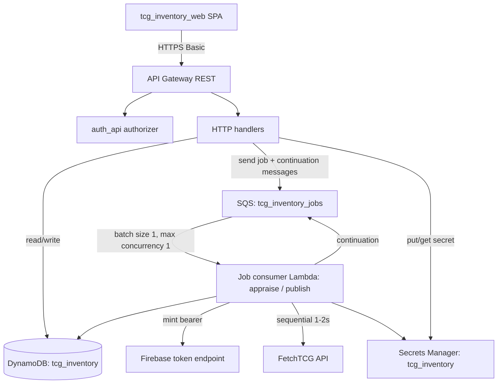
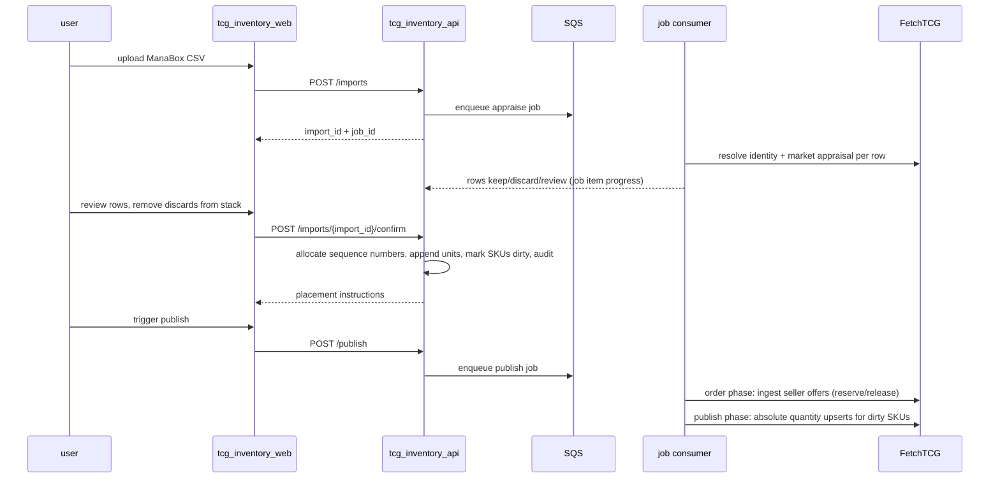

# TCG inventory API

The TCG inventory API service is the source of truth for a physical Magic: The Gathering card inventory stored under chaos sorting, projecting in-stock units to FetchTCG listings and mirroring FetchTCG order activity back as reservations, pulls, and releases.

## Overview

- **Service type**: backend API (`tcg_inventory_api`)
- **Interface**: REST over HTTPS plus an SQS-driven job consumer
- **Runtime**: AWS Lambda (Java 21) behind API Gateway REST; one job Lambda consuming SQS
- **Primary storage**: DynamoDB table `tcg_inventory` with `gsi1` and `gsi2`
- **Auth model**: API Gateway custom REQUEST authorizer provided by the shared `auth_api` service (see `auth_api/README.md`)
- **External integration**: FetchTCG website API (unofficial), Firebase token exchange
- **Primary consumer**: `tcg_inventory_web`

## User stories

- As a card seller, I want to import a ManaBox scan, review each card's keep/discard appraisal in stack order, and confirm keepers into inventory with assigned storage locations, so that intake requires no physical sorting.
- As a card seller, I want FetchTCG listing quantities to always equal my in-stock unit counts, so that I never oversell or list phantom stock.
- As a card seller, I want accepted offers to reserve the exact physical units and paid orders to produce a location-ordered pull sheet, so that fulfilment is one forward pass through my boxes.
- As a card seller, I want every inventory mutation audited with before/after state, so that digital counts never silently drift from the physical boxes.
- As a cautious FetchTCG user, I want conservative sequential API traffic and fail-closed credential handling, so that automation risk stays minimal.

## Features and scope boundaries

### In scope

- Authenticated CRUD for imports: upload a ManaBox CSV, appraise rows asynchronously, review and override rows, confirm keepers into inventory, delete unwanted imports before confirm.
- Appraisal per row: FetchTCG identity resolution for the CSV-identified printing (cached on the SKU after first sight), keep filter, and suggested policy price.
- Inventory browse: SKU search and detail with unit lists and derived locations.
- Manual audited adjustments: remove a unit; change a unit's condition (moving it between SKUs).
- Publish job (single two-phase job): order phase ingests FetchTCG seller offers (reserve, pick-ready, defensive void release), then publish phase drains dirty SKUs to FetchTCG — create and update as absolute listing quantities, delete the listing when the in-stock count reaches zero.
- Pull sheets for paid orders, sorted by unit sequence number; order confirm marks pulled units sold.
- Per-user FetchTCG refresh-token storage with masked reads; fresh one-hour bearer minted per job run.
- Append-only audit log written transactionally with every mutation.

### Out of scope

- Repricing existing listings (a separate repricing process owns price maintenance; this service prices new listings only).
- Marketplaces other than FetchTCG; games other than Magic: The Gathering; non-English cards (they become review rows).
- Camera or scanner-based intake, image recognition, and scan verification UIs.
- Cost/purchase-price tracking, profit reporting, analytics dashboards, bulk lots, master sets, POS, buylist.
- Background/scheduled polling of FetchTCG (all jobs are manually triggered).
- Deleting SKU records (they are permanent once created) or offer negotiation (accept/counter/reject happens on FetchTCG).

## Architecture



### Primary workflow



## Main technical decisions

- Inventory is the source of truth; FetchTCG listings are an absolute projection: listing quantity = count of `in_stock` units per SKU. Re-importing already-listed cards converges to a no-op, and FetchTCG's own decrement at offer acceptance converges without a write.
- Dirty-marker outbox for the projection: every mutation transaction sets a plain boolean `dirty` on affected SKU records. Only mutation transactions can set the flag, which makes every FetchTCG write traceable to an audited inventory event; blind reconciliation never changes quantities. Coalescing is inherent because the projection is absolute.
- The publish phase recounts actual unit items rather than trusting counters, then clears `dirty` conditionally on `in_stock_count` equalling the published count. A mutation landing mid-publish fails the clear and the SKU stays dirty; counter drift fails it permanently, turning silent corruption into a visible tripwire.
- SQS work queue with continuation messages: messages carry only `{user, job_id, job_type}`; the job item's `continuation` is authoritative. The consumer has maximum concurrency 1, serializing all FetchTCG traffic and all inventory-mutating jobs (no job lease needed). Each slice does bounded work, checkpoints, and re-enqueues.
- Duplicate SQS delivery is expected and absorbed: slices read the job item fresh, DynamoDB effects are conditionally guarded, FetchTCG effects are absolute upserts keyed by `cardId` + condition. FIFO queues buy nothing here.
- One publish job with two ordered phases (order phase before publish phase) structurally prevents relisting stock committed to a pending offer.
- Units are append-only with a globally monotonic `sequence_number` allocated by an atomic counter; storage blocks and locations are pure derivations of it. Sold and removed units leave gaps; nothing is renumbered or reshuffled.
- The offer lifecycle is modeled with reservations: acceptance reserves forward-most in-stock units, payment makes the order pickable, non-payment voids and releases. Confirming a pull sets no dirty flag — the units left the projection at reservation and FetchTCG already decremented at acceptance.
- SKU identity is the deterministic composite `scryfall_id#finish#condition` — computable offline from a ManaBox row with no lookup. SKU records cache the resolved `fetchtcg_card_id` and are never deleted.
- Conditions use the 5-level TCGplayer-style scale; ManaBox's 7 values collapse at import and FetchTCG codes are a boundary translation. NM is the default when no condition is provided.
- FetchTCG traffic is sequential with 1–2 s random request spacing, bounded retries, an endpoint allowlist, and fail-closed bearer handling. Every job run mints a fresh one-hour bearer from the stored refresh token and persists a rotated refresh token when Firebase returns one.
- The static Scryfall→FetchTCG set mapping is a generated, checked-in artifact; unmapped sets stop appraisal into `review` rather than guessing.

## Domain glossary

- **Printing**: a specific card printing identified by Scryfall ID (set-specific; encodes name, set, collector number, language).
- **Finish**: `normal` | `foil` | `etched`.
- **Condition**: `NM` | `LP` | `MP` | `HP` | `DMG`. ManaBox import mapping: mint→NM, near_mint→NM, excellent→LP, good→MP, light_played→HP, played→HP, poor→DMG. FetchTCG listing mapping: NM→`raw-nm`, LP→`raw-lp`, MP→`raw-mp`, HP→`raw-hp`, DMG→`raw-d` (`raw-m` is never listed).
- **SKU**: printing + finish + condition; the sellable identity. One FetchTCG listing per SKU. Permanent once created.
- **Unit**: one physical card. Status lifecycle: `in_stock` → `reserved` → `sold`; `reserved` → `in_stock` on void; `in_stock` → `removed` by adjustment.
- **Sequence number**: globally monotonic integer per unit, assigned at import confirm; the canonical physical position.
- **Block**: `floor(sequence_number / 100)`, labeled `A0` … `A99`, `B0` … (letter advances every 100 blocks). Labels are logical and append-only; a block physically lives wherever its labeled divider sits.
- **Location**: display form `<block>-<offset>` with zero-based offset = `sequence_number % 100` (4242 → `A42-42`). Derived, never stored. Offsets are placement order; pulls leave gaps but preserve relative order, guaranteeing single-forward-pass pulls.
- **Import**: one ManaBox CSV ingest session — uploaded, appraised, reviewed, confirmed once, then done. Status: `appraising` → `review` → `confirming` → `confirmed`. An unconfirmed import can be deleted outright (import and rows removed); confirmed imports are permanent because units reference them for provenance.
- **Import row**: one candidate physical card within an import (CSV rows are quantity-expanded, so one row = one card at one stack position). A `keep` row becomes exactly one unit at confirm and records its assigned sequence number; `discard` and `review` rows never become units. Rows carry appraisal and review state and die with their import; units are permanent inventory.
- **Appraise**: the job that adds what the CSV cannot contain — FetchTCG identity resolution and market appraisal (keep filter + suggested policy price).
- **Publish**: the job that projects inventory to FetchTCG; order phase (ingest offers) then publish phase (drain dirty SKUs).
- **Order**: an accepted FetchTCG offer. State: `awaiting_payment` → `to_pick` → `fulfilled`, or `awaiting_payment` → `voided`.
- **Pull sheet**: pick list for a paid order, sorted by sequence number, forward-most duplicate first.
- **Dirty**: boolean on a SKU meaning its FetchTCG listing may not reflect current in-stock count; set only inside mutation transactions.

## Integration contracts

### External systems

- **FetchTCG website API**: sequential HTTPS JSON requests to `https://api.fetchtcg.com` with a browser-compatible user agent. Public reads (card details `GET /v3/cards/{card_id}`, card search `GET /v3/cards`, active listings `GET /v3/cards/{card_id}/listings`) are unauthenticated. Authenticated calls attach `Authorization: Bearer <token>` only to the seller offers list (`GET /v2/private/market/offers/seller`), managed-listings read (`GET /v1/manage-listings`), the listing upsert (`POST /v2/private/manage-listings`, absolute quantity and price keyed by `cardId` + condition), and the listing delete (`DELETE /v1/manage-listings/{listing_id}`, no body, 200 with empty body — used to delist a SKU whose in-stock count reaches zero). Transient failures retry with bounded backoff; 401/403 stops the job. FetchTCG does not publish these endpoints as a supported API and its terms prohibit unpermitted automation; conservative pacing reduces load but the policy risk stays with the user.
- **Firebase token exchange**: each job run exchanges the stored refresh token at Firebase's fixed HTTPS token endpoint for a one-hour bearer. A replacement refresh token in the response is persisted back to the secret. The refresh token is never sent to FetchTCG.
- **Offer state mapping** (from the seller offers list): an offer first seen with `status = ACCEPTED` creates an order and reserves units. `currentAction` past payment confirmation (for example `SEND_PICKUP_ADDRESS`, tracking actions, `SEND_REVIEW`, `AWAIT_REVIEW`) marks the order `to_pick`. A reserved order whose offer status leaves `ACCEPTED`/`COMPLETED`, or whose offer disappears, is voided defensively: units are released and the order is flagged for manual review. Buyer names, addresses, payment instructions, and tracking details are never persisted.
- **Scryfall API**: consumed only by the set-mapping generator (public set catalog and card records); normal runs never call Scryfall.

## API contracts

### Conventions

- Base URL: `https://api.tcg-inventory.jordansimsmith.com`
- Auth: `Authorization: Basic <base64(user:password)>` on every endpoint
- Request and response fields use `snake_case`; no path version segment
- Non-2xx responses use `{"message": "error details"}`
- Async work is observed through the affected resource, not a generic jobs API: appraisal progress and errors ride on the import (`GET /imports/{import_id}`), publish progress and errors on `GET /publish` (current-or-latest run). Job items exist in storage only as internal continuation state.
- Verb convention: edits that record client-owned data use `PUT`/`PATCH` on the resource; domain actions that cause server-side cascades (confirm, publish) are `POST` sub-resource actions with transition-specific contracts

### Endpoint summary

| Method   | Path                                     | Purpose                                                                                |
| -------- | ---------------------------------------- | -------------------------------------------------------------------------------------- |
| `POST`   | `/imports`                               | upload a ManaBox CSV; starts the appraise job                                          |
| `GET`    | `/imports`                               | list imports newest-first                                                              |
| `GET`    | `/imports/{import_id}`                   | import status, progress, and rows                                                      |
| `PATCH`  | `/imports/{import_id}/rows/{position}`   | override a row decision or fix its identity                                            |
| `POST`   | `/imports/{import_id}/confirm`           | append keeper units; returns placement instructions                                    |
| `DELETE` | `/imports/{import_id}`                   | delete an unconfirmed import and its rows                                              |
| `GET`    | `/skus`                                  | browse/search SKUs (prefix search, cursor paging)                                      |
| `GET`    | `/skus/{sku_id}`                         | SKU detail including its units                                                         |
| `DELETE` | `/skus/{sku_id}/units/{sequence_number}` | remove a unit (optional `reason` query param)                                          |
| `PUT`    | `/skus/{sku_id}/units/{sequence_number}` | update a unit's condition (moves it to another SKU; response returns the new `sku_id`) |
| `GET`    | `/orders`                                | list orders newest-first                                                               |
| `GET`    | `/orders/{order_id}`                     | order detail: lines, allocated units, pull locations                                   |
| `POST`   | `/orders/{order_id}/confirm`             | confirm the pull; marks allocated units sold                                           |
| `POST`   | `/publish`                               | start a publish run; idempotent while one is queued/running (returns the existing run) |
| `GET`    | `/publish`                               | current-or-latest publish run: status, progress, error, pending dirty count            |
| `GET`    | `/settings`                              | credential presence and last-updated (never a value)                                   |
| `PUT`    | `/settings`                              | replace settings (stores the FetchTCG refresh token)                                   |

### Example request and response

`POST /imports/{import_id}/confirm`

Response `200`:

```json
{
  "import_id": "01JEXAMPLEULID0000000000",
  "status": "confirmed",
  "unit_count": 87,
  "first_sequence_number": 4200,
  "last_sequence_number": 4286,
  "placement_instructions": [
    {
      "block": "A42",
      "from_location": "A42-0",
      "to_location": "A42-86",
      "unit_count": 87
    }
  ]
}
```

Representative failures:

- `409`: `{"message":"import is not in review status"}` (double confirm, or confirm during appraisal)
- `409`: `{"message":"import has unresolved review rows"}`
- `404`: `{"message":"Not Found"}` (unknown import in user scope)

`GET /orders/{order_id}`

Response `200` (the `units` list, sorted by sequence number, is the pull sheet when the order is `to_pick`):

```json
{
  "order_id": "83663",
  "state": "to_pick",
  "accepted_at": 1765420932,
  "delivery_mode": "PICKUP",
  "total_price": "3.33",
  "units": [
    {
      "sequence_number": 1204,
      "location": "A12-4",
      "name": "Hellkite Tyrant",
      "set_code": "gtc",
      "collector_number": "75",
      "finish": "normal",
      "condition": "NM"
    }
  ]
}
```

- `409` on `POST /orders/{order_id}/confirm`: `{"message":"order is not ready to pick"}` when the order is not `to_pick`.

### Pricing policy (new listings)

Applied when the publish phase creates a listing for a SKU with no existing FetchTCG listing. All values NZD.

```text
keep filter: market price >= 0.25 (applied at appraisal; below → discard)

tick = max(0.05, round_nearest_half_up(2.5% * lowest_rival, 0.05))

if lowest same-or-better-condition rival exists and lowest_rival >= 80% * market:
    benchmark = lowest_rival - tick
elif two-seller supported same-or-better-condition floor exists:
    benchmark = supported_floor
elif no same-or-better-condition rival exists and market >= 2.00:
    benchmark = market * 1.15
else:
    benchmark = market

price = max(0.25, round_nearest_half_up(benchmark, 0.05))
```

- Market price source: FetchTCG `pricingData.NZ.tcgMarketPrice`.
- Rival evidence: active New Zealand listings for the exact card in the SKU's condition or strictly better, excluding the authenticated account's own listings. Condition quality order: `raw-d < raw-hp < raw-mp < raw-lp < raw-nm < raw-m`.
- Two-seller supported floor: the first ascending same-or-better-condition price at which at least two distinct sellers are cumulatively available.
- Deep-discount guard: a lowest rival below 80% of market is not undercut.
- Sole-source premium: 15% over market when no rival exists and market ≥ NZ$2.00.

## Data and storage contracts

### DynamoDB model

- **Table**: `tcg_inventory`, keys `pk`/`sk`, PAY_PER_REQUEST.
- **`gsi1`** (sparse dirty index): `gsi1pk = USER#<user>#DIRTY`, `gsi1sk = SKU#<sku_id>`, attributes present on SKU records only while dirty — the publish worklist query returns exactly the dirty set. Unit items carry no GSI attributes; units are always addressed through their SKU partition (a global units-by-sequence index is deliberately absent until a flow needs one, for example block views or consolidation).
- **`gsi2`**: SKU browse (`gsi2pk = USER#<user>#SKUS`, `gsi2sk = NAME#<normalized name>#<sku_id>`), supporting alphabetical listing and `begins_with` prefix search.
- `sku_id` is `<scryfall_id>#<finish>#<condition>`. A SKU record and its unit items share a partition so one query serves detail, recount, and allocation.

| Item             | pk                            | sk                             | Notable attributes                                                                                                                                                                                                                                                      |
| ---------------- | ----------------------------- | ------------------------------ | ----------------------------------------------------------------------------------------------------------------------------------------------------------------------------------------------------------------------------------------------------------------------- |
| SKU              | `USER#<u>#SKU#<sku_id>`       | `SKU`                          | scryfall_id, finish, condition, name, set_code, set_name, collector_number, fetchtcg_card_id, fetchtcg_set_id, `in_stock_count`, `reserved_count`, `sold_count`, `dirty`, `fetchtcg_listing_id`, `last_published_quantity`, `last_published_price`, `last_published_at` |
| Unit             | `USER#<u>#SKU#<sku_id>`       | `UNIT#<sequence_number>`       | sequence_number, status, import_id, order_id (when reserved/sold), timestamps                                                                                                                                                                                           |
| Import           | `USER#<u>`                    | `IMPORT#<ulid>`                | filename, status, row counts, appraisal_error (when the appraise job fails), timestamps                                                                                                                                                                                 |
| Import row       | `USER#<u>#IMPORT#<import_id>` | `ROW#<stack position, padded>` | raw CSV fields, resolved identity, decision + reason, appraisal evidence (market price, rival evidence, suggested price), user overrides, assigned sequence_number                                                                                                      |
| Order            | `USER#<u>`                    | `ORDER#<fetchtcg_offer_id>`    | state, FetchTCG status/currentAction snapshot, accepted_at, delivery_mode, financial totals (no buyer PII), embedded lines `[{sku_id, fetchtcg_listing_id, quantity, price, allocated sequence_numbers}]`                                                               |
| Audit entry      | `USER#<u>#AUDIT`              | `<ulid>`                       | event_type (`import_confirm`, `adjustment`, `reserve`, `release`, `sell`, `publish`, `credential_update`), affected sku_ids / unit sequence_numbers / order_id / import_id, before/after summary                                                                        |
| Job              | `USER#<u>`                    | `JOB#<ulid>`                   | internal continuation state, never an API resource: type (`appraise` \| `publish`), status (`queued` \| `running` \| `succeeded` \| `failed`), continuation, progress counters, error                                                                                   |
| Sequence counter | `USER#<u>`                    | `COUNTER#SEQUENCE`             | `next_sequence_number`                                                                                                                                                                                                                                                  |
| Settings         | `USER#<u>`                    | `SETTINGS`                     | credential metadata (set-at timestamp only)                                                                                                                                                                                                                             |

### Representative records

```json
{
  "pk": "USER#jordan#SKU#f0a51425-d796-48b8-b68c-bc21fb465c81#normal#NM",
  "sk": "SKU",
  "sku_id": "f0a51425-d796-48b8-b68c-bc21fb465c81#normal#NM",
  "scryfall_id": "f0a51425-d796-48b8-b68c-bc21fb465c81",
  "finish": "normal",
  "condition": "NM",
  "name": "Elvish Aberration",
  "set_code": "a25",
  "collector_number": "167",
  "fetchtcg_card_id": 123456,
  "fetchtcg_set_id": 78,
  "in_stock_count": 2,
  "reserved_count": 1,
  "sold_count": 0,
  "dirty": true,
  "gsi1pk": "USER#jordan#DIRTY",
  "gsi1sk": "SKU#f0a51425-d796-48b8-b68c-bc21fb465c81#normal#NM",
  "gsi2pk": "USER#jordan#SKUS",
  "gsi2sk": "NAME#elvish aberration#f0a51425-d796-48b8-b68c-bc21fb465c81#normal#NM",
  "fetchtcg_listing_id": 975737,
  "last_published_quantity": 3,
  "last_published_price": "0.30",
  "last_published_at": 1765420800
}
```

```json
{
  "pk": "USER#jordan#SKU#f0a51425-d796-48b8-b68c-bc21fb465c81#normal#NM",
  "sk": "UNIT#0000004242",
  "sequence_number": 4242,
  "status": "in_stock",
  "import_id": "01JEXAMPLEULID0000000000"
}
```

### Transaction shapes

All mutations are `TransactWriteItems` including their audit entry; counters use `ADD`; sparse-index attributes are set/removed alongside `dirty`.

- **Import confirm**: conditional status flip `review → confirming` (single confirmer), one `UpdateItem ADD next_sequence_number :n` allocating the range, sequence numbers recorded on rows (skipped on retry if present), then chunked per-SKU transactions — conditional unit puts + SKU counter/dirty updates — where a replayed chunk fails its unit-exists condition and no-ops atomically; final flip `confirming → confirmed`.
- **Reserve**: conditional order put keyed by FetchTCG offer id + unit `in_stock → reserved` transitions + SKU counters + dirty + audit.
- **Release (void)**: order `awaiting_payment → voided` + units `reserved → in_stock` + counters + dirty + audit.
- **Sell (confirm pull)**: order `to_pick → fulfilled` + units `reserved → sold` + counters + audit. No dirty flag — reserved units already left the projection and FetchTCG decremented at acceptance.
- **Remove / condition edit**: conditional unit transitions with counter and dirty updates; condition edit is one transaction across two SKU partitions (delete + re-put the unit item with the same sequence number, both SKUs dirtied).
- **Publish clear**: set `dirty = false`, remove sparse index attributes, update the listing snapshot — conditional on `dirty = true AND in_stock_count = :published_count`. A delist clears the listing snapshot (`fetchtcg_listing_id` and published values removed); a later restock creates a fresh listing.

## Behavioral invariants and time semantics

- CSV rows are quantity-expanded; CSV row order is physical bottom-up (ManaBox stacks last-scanned-on-top). Review presents top-of-stack first (reverse CSV order); confirm assigns sequence numbers bottom-up (raw CSV order), so the reviewed stack slots into the box in one motion with placement order equal to location order.
- Sequence numbers are unique per user: allocation is an atomic counter `ADD` (disjoint ranges by construction), the confirming-status gate prevents double allocation for one import, and unit keys embed the sequence number so within-SKU duplicates are unwritable.
- Discarded and review rows never create units; only `keep` rows are confirmed. Unresolved review rows block confirm.
- Import deletion is allowed only while `appraising` or `review` (409 otherwise) and removes the import and all its rows. An appraise job whose import has been deleted detects this at its next slice and completes cleanly without further writes.
- English-only intake: non-English, misprint, and altered rows become `review`; unmapped sets and unresolvable identities become `review` rather than guesses.
- The FetchTCG listing projection counts only `in_stock` units. Reserved and sold units are excluded. Upward and downward corrections, including delisting at zero, occur only for SKUs dirtied by an audited mutation.
- The order phase always completes before the publish phase within a run.
- Confirming a pull writes nothing to FetchTCG. Voiding an order releases units and dirties SKUs; the restored quantity reaches FetchTCG on the next publish run unless the seller already relisted on FetchTCG, in which case the projection converges as a no-op.
- SKU records are never deleted; a zero-count SKU keeps its record, is delisted on FetchTCG, and is reused on restock.
- Duplicate SQS deliveries, replayed job slices, and re-processed offers converge: job slices read the job item's continuation fresh, order creation is conditional on the offer id, unit transitions are conditional on current status, publish writes are absolute.
- At most one publish run is queued or running per user: `POST /publish` creates the job conditionally and returns the existing run when one is already active.
- Job failures surface on the affected resource: an appraise failure sets `appraisal_error` on its import; a publish failure appears in `GET /publish`. Recovery is user-initiated (fix the cause — typically the credential — and re-trigger; for a failed appraise, delete the import and re-upload).
- Market appraisal deduplicates FetchTCG reads per printing + finish within a job run; resolved `fetchtcg_card_id` values are cached on SKU records across runs.
- NM is the default condition where none is provided. Timestamps are epoch seconds; ULIDs order imports, jobs, and audit entries by creation time.

## Source of truth

| Entity                               | Authoritative source                                              | Notes                                                              |
| ------------------------------------ | ----------------------------------------------------------------- | ------------------------------------------------------------------ |
| Physical stack order and quantity    | ManaBox CSV row order and `Quantity`                              | reversed for review display; raw order = sequence assignment order |
| Printing identity                    | ManaBox `Scryfall ID` (+ finish, condition columns)               | SKU computable offline from the row                                |
| FetchTCG card identity               | Verified FetchTCG lookup, cached as `fetchtcg_card_id` on the SKU | set mapping is a generated, checked-in artifact                    |
| Unit existence, status, and position | DynamoDB unit items                                               | append-only; gaps are permanent                                    |
| Stock counts                         | DynamoDB SKU counters, verified against unit items at publish     | drift fails the conditional clear and stays visible                |
| Listing quantity on FetchTCG         | Projection of in-stock unit count                                 | absolute upserts keyed by `cardId` + condition                     |
| New-listing price                    | Pricing policy in this README                                     | applied at publish-create time                                     |
| Order state                          | FetchTCG seller offers list (`status`, `currentAction`)           | mapped to `awaiting_payment` / `to_pick` / `voided`                |
| Market price                         | FetchTCG `pricingData.NZ.tcgMarketPrice`                          | keep filter and pricing benchmark                                  |
| Audit history                        | Append-only audit items                                           | written in the same transaction as each mutation                   |

## Security and privacy

- All endpoints require Basic auth via the shared `auth_api` authorizer; all data is partitioned by user (`pk = USER#<user>…`).
- The FetchTCG refresh token lives only in the Secrets Manager secret; the settings endpoint writes it and never returns it (reads expose presence and last-updated only). Bearer tokens are minted per job run, held in memory, attached only to the four authenticated FetchTCG endpoints, and never logged.
- Buyer PII from offers (names, addresses, payment instructions, bank details, tracking) is never persisted; orders store card identity, quantities, and financial totals only.
- Audit entries and logs exclude credentials and raw FetchTCG response bodies.
- All external requests use HTTPS. FetchTCG automation is unsupported by its terms; the user owns that policy risk.

## Configuration and secrets reference

### Environment variables

| Name             | Required                         | Purpose                                     | Default behavior       |
| ---------------- | -------------------------------- | ------------------------------------------- | ---------------------- |
| `JOBS_QUEUE_URL` | yes (trigger + consumer Lambdas) | SQS queue for job and continuation messages | none; set by Terraform |

Fixed configuration lives in code: request spacing 1–2 s, bounded retries, request budgets, page sizes, slice size (~100 rows or bounded FetchTCG calls per slice), country `NZ`, currency `NZD`, keep threshold NZ$0.25, price increment NZ$0.05, seller floor NZ$0.25.

### Secret shape

Secrets Manager secret `tcg_inventory`:

```json
{
  "<user>": "<firebase refresh token>"
}
```

Rotated refresh tokens returned by Firebase are written back to the same key.

## Performance envelope

- Scale target: 10,000+ units, ~5,000–10,000 SKUs/listings per user; DynamoDB request volume at this scale is negligible.
- Job Lambdas: 900 s timeout with the module's default 1769 MB memory (the 1-vCPU point — keeps Java cold starts fast; the GB-second cost of idle FetchTCG pacing still sits far inside the always-free compute allowance). HTTP handlers use module defaults (10 s).
- FetchTCG pacing dominates: an appraise slice of ~100 rows runs minutes; a daily publish run (typical daily delta) runs single-digit minutes; jobs re-enqueue continuations well before timeout.
- SQS consumer maximum concurrency 1; visibility timeout exceeds the function timeout.
- Everything fits the repo's serverless cost posture (Lambda/SQS free tiers; Secrets Manager ~US$0.40/month).

## Testing and quality gates

- Unit tests: pricing policy scenarios (keep filter, undercut tick, deep-discount guard, supported floor, sole-source premium, rounding, floor), condition translation, set mapping, sequence/block/location derivation, FetchTCG client pacing/retries/allowlist/fail-closed auth with fixture responses, offer state mapping.
- Integration tests (DynamoDB Testcontainers, LocalStack SQS): import upload→rows, row overrides, confirm idempotency and double-confirm rejection, adjustments, reserve/release/sell transitions, publish create/update/delist and conditional clear, duplicate-delivery no-ops, masked credential handling.
- E2E (LocalStack): import → appraise → confirm → publish → order → pull → confirm loop.
- Tests never call the live FetchTCG API.
- Required checks: `bazel build //tcg_inventory_api:all`, `bazel test //tcg_inventory_api:all`, then repo-level `bazel mod tidy` and `bazel run //:format`.

## Local development and smoke checks

- Focused suites: `bazel test //tcg_inventory_api:unit-tests`, `:integration-tests`, `:e2e-tests`.
- Minimal smoke flow (against deployed stack): set the credential via `PUT /settings`; `POST /imports` with a single-card CSV; poll the import to `review`; confirm; `POST /publish`; verify the listing appears on FetchTCG at the policy price; then remove the unit via `DELETE` and run publish again to verify the delist. Use only a throwaway low-value card for live smoke checks.

## End-to-end scenarios

### Scenario 1: daily import to listed stock

1. User uploads a 90-card ManaBox CSV; rows persist and the appraise job runs.
2. Appraisal resolves identities (cache hits skip FetchTCG search), applies the keep filter, and prices keepers; three rows become `review` (one non-English, one unmapped set, one below threshold is `discard`).
3. User reviews top-of-stack first, resolves the review rows, physically removes discards, and confirms.
4. Confirm allocates sequence numbers 4200–4286, appends 87 units bottom-up, dirties 61 SKUs, and returns placement instructions ("A42-0 through A42-86").
5. User boxes the stack in one motion and triggers publish; the order phase finds nothing new; the publish phase upserts 61 listings (creates priced by policy, updates as absolute quantities) and clears the markers.

### Scenario 2: offer accepted, paid, and pulled

1. A buyer's offer for two copies is accepted on FetchTCG; FetchTCG takes the stock off-market.
2. The next publish run's order phase sees `status = ACCEPTED`, creates the order, and reserves the two forward-most in-stock units; the SKU is dirtied but its projection (in-stock count) already matches FetchTCG's decrement, so the publish phase makes no write.
3. The buyer pays; a later run sees `currentAction` past payment confirmation and marks the order `to_pick`.
4. The user opens the pull sheet on a phone, pulls both units in one forward pass, and confirms; units become `sold` with no FetchTCG write.

### Scenario 3: void releases and relists safely

1. A buyer never pays; the reserved order's offer leaves `ACCEPTED`.
2. The order phase voids the order, releases the units to `in_stock`, dirties the SKU, and flags the order for review.
3. If the seller already used FetchTCG's relist action, the publish phase recount matches the restored listing and converges as a no-op; otherwise the publish phase restores the quantity itself. Reserved stock was never re-projected while the offer was pending.

### Scenario 4: condition edit republishes both SKUs

1. The user regrades a unit from NM to LP.
2. One transaction moves the unit item to the LP SKU (same sequence number), decrements the NM SKU counter, increments the LP SKU counter, dirties both, and writes one audit entry.
3. The next publish updates the NM listing quantity (delisting it if the count reached zero) and creates or updates the LP listing at the policy price.
