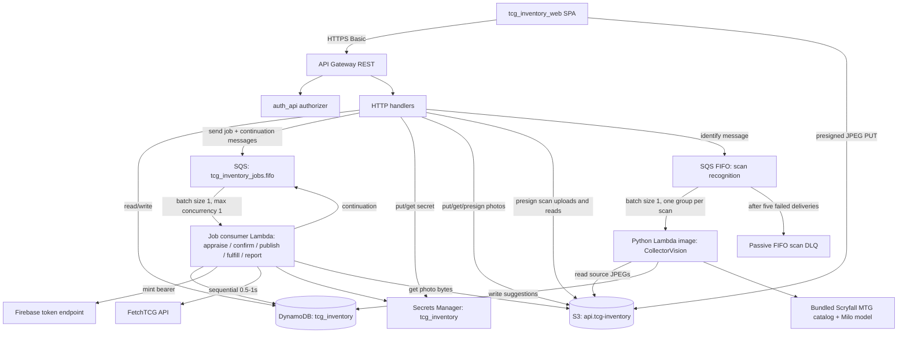
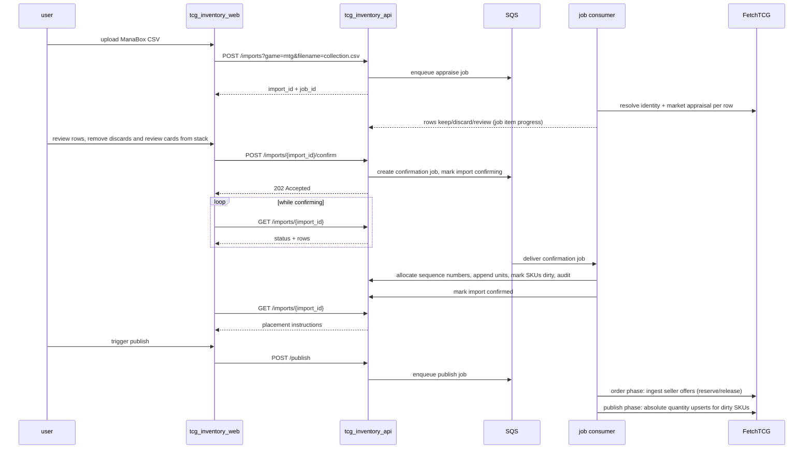
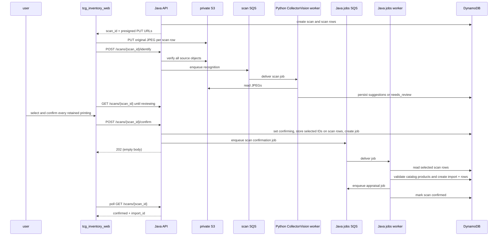

# TCG inventory API

The TCG inventory API service is the source of truth for physical Magic: The Gathering and English Pokémon stock stored under chaos sorting, projecting in-stock units to FetchTCG listings and mirroring FetchTCG order activity back as reservations, pulls, and releases. Pokémon inventory starts empty because its import and scan capabilities are disabled.

## Overview

- **Service type**: backend API (`tcg_inventory_api`)
- **Interface**: REST over HTTPS plus an SQS-driven job consumer
- **Runtime**: AWS Lambda (Java 21) behind API Gateway REST; Java job Lambda consuming SQS; Python CollectorVision Lambda image consuming a separate scan queue
- **Primary storage**: DynamoDB table `tcg_inventory` with `gsi1`, `gsi2`, and `gsi3`; S3 bucket `api.tcg-inventory.jordansimsmith.com` (listing photos under `users/<user>/photos/`, source scans under `users/<user>/scans/`)
- **Auth model**: API Gateway custom REQUEST authorizer provided by the shared `auth_api` service (see `auth_api/README.md`)
- **External integration**: FetchTCG website API (unofficial), Firebase token exchange, offline CollectorVision Scryfall MTG catalog, live Scryfall catalog lookup for Magic card review, and TCGplayer card images for Pokémon inventory
- **Primary consumer**: `tcg_inventory_web`

## User stories

- As a card seller, I want to import a ManaBox scan, review each card's keep/discard appraisal in stack order, and confirm keepers into inventory with assigned storage locations, so that intake requires no physical sorting.
- As a card seller, I want to upload an ordered batch of card-front JPEGs, verify every exact printing, and create an ordinary import, so that a document scanner can replace ManaBox identification without changing appraisal or placement.
- As a card seller, I want scan uploads and recognition suggestions to survive browser closure, so that an interrupted review does not require rescanning the cards.
- As a card seller, I want FetchTCG listing quantities to always equal my in-stock unit counts, so that I never oversell or list phantom stock.
- As a card seller, I want cards appraised at NZ$20 or more to require photos captured during import review and projected onto their FetchTCG listings, so that high-value listings show the actual card the buyer receives.
- As a card seller, I want accepted offers to reserve the exact physical units and paid orders to produce a location-ordered pull sheet, so that fulfilment is one forward pass through my boxes.
- As a card seller, I want to see whether an accepted offer's price differs from my listed price, so that I can tell a lowball or over-ask from a buy-at-list sale.
- As a card seller packing an order, I want the buyer's name, delivery address, and the postage option they paid for, so that I can address and post the parcel without opening FetchTCG.
- As a card seller, I want every inventory mutation audited with before/after state, so that digital counts never silently drift from the physical boxes.
- As a card seller, I want a regenerated overview report of value, movement, and composition, so that I can appreciate the overall state of the inventory without browsing SKU by SKU.
- As a cautious FetchTCG user, I want conservative sequential API traffic and fail-closed credential handling, so that automation risk stays minimal.

## Features and scope boundaries

### In scope

- Authenticated CRUD for imports: upload a ManaBox CSV, appraise rows asynchronously, review appraisal decisions, confirm keepers into inventory, delete unwanted imports before confirm. Import detail derives `total_suggested_price` from keep-row suggested prices.
- Scanner intake: create a batch with a registered game, one condition (`NM`, `LP`, `MP`, `HP`, or `DMG`), and a finish allowed for that game; upload one ASCII-named JPEG front per card, identify with the configured offline catalog, explicitly confirm each retained printing, and create one ordinary appraising import. Magic (`mtg`) is the only game enabled for intake and uses the offline CollectorVision catalog. Pokémon (`pokemon`) is registered with scanning and CSV import disabled. Ascending filenames are bottom-to-top, and the first scanned row becomes the first import row. Alternate art, double-faced cards, and tokens are supported for Magic.
- Game metadata: authenticated `GET /games` returns Magic and Pokémon English with display names, ordered finish choices, scanning/CSV-import capabilities, and image regions used by scan review. Pokémon advertises no intake capability or scan review regions.
- Review catalog: authenticated catalog endpoints return exact Magic printing details, related printings, and finish-filtered name or ID search from Scryfall. Pokémon has no review catalog in this release. The browser scan review uses the Magic endpoints and receives normalized product metadata and image URLs.
- Pokémon inventory: `pokemon` uses source `tcgplayer`, TCGplayer product IDs as `external_id`, and the `normal`, `holofoil`, and `reverse_holofoil` finishes. Inventory browse and audited adjustments, publishing, order reservation and fulfillment, and report attribution use the shared game-aware workflows. A Pokémon SKU ID has the same form as Magic: `pokemon#tcgplayer#<tcgplayer_product_id>#<finish>#<condition>`; its exact finish-specific FetchTCG card ID remains stored separately for publishing. No production stock-creation, import, scan, or Pokémon review-catalog route is provided.
- Durable scan jobs and source images: all-or-abandon batch uploads, background recognition with stored suggestions, manual correction through the authenticated catalog endpoints, irreversible removal of an outlier scan row, deletion of an unfinished job, and read-only confirmed jobs. Confirmed source scans are retained indefinitely and never automatically used as listing photos.
- Appraisal per row: FetchTCG identity resolution for the submitted ManaBox or scan-confirmed printing (candidates verified against the row's Scryfall ID, cached on the SKU after first sight), keep filter, and suggested policy price.
- Inventory browse: SKU search and detail with unit lists and derived locations.
- Listing photos: up to 5 JPEG photos per keep row, captured during import review (raw-body upload, stored durably in S3, served via short-lived presigned URLs); confirm is blocked while any keep row appraised at NZ$20+ has no photos; photos freeze onto units at confirm and are immutable afterwards.
- Manual audited adjustments: remove a unit; change a unit's condition (moving it between SKUs).
- Publish job (single two-phase job): the order phase resumes local work, processes existing offers, preflights every new accepted offer together, and saves each valid order before reserving its units; the publish phase then drains dirty SKUs to FetchTCG as absolute listing quantities, projecting the first in-stock unit's photos and deleting listings at zero.
- Pull sheets for paid orders, sorted by game and then unit sequence number; each entry carries the offered per-unit price, the unit's game and external identity, its current block position (gaps from sold and removed cards collapsed), and neighboring cards still in the same game's block. Confirming a pull queues background fulfillment and reports completion after every allocated unit is sold.
- Offer vs listed price: each ingested offer line stores the FetchTCG listing's `listedPrice` at ingest time; `GET /orders` returns item and listed subtotals (shipping excluded) and `GET /orders/{order_id}` returns the same subtotals plus per-line offered and listed prices.
- Fulfillment details on orders: the buyer's display name, delivery address, and selected postage option are captured from the offer and refreshed on every order-phase run, so `GET /orders/{order_id}` carries what packing a parcel needs.
- Reports: an async report job aggregates the entire inventory into a stored dashboard snapshot with combined headline totals and activity trends, plus a stock breakdown for every registered game; `GET /reports` serves the latest snapshot with staleness metadata and generation status.
- Per-user FetchTCG refresh-token storage with masked reads; fresh one-hour bearer minted per job run.
- Append-only audit log written transactionally with each inventory unit mutation and audited order lifecycle transition.

### Out of scope

- Repricing existing listings (a separate repricing process owns price maintenance; this service prices new listings only).
- Marketplaces other than FetchTCG; games other than Magic: The Gathering and English Pokémon; non-English cards (they become review rows).
- Camera capture, PNG/TIFF/PDF scans, non-English/non-Magic recognition, scan quality grading, automatic per-image recognition retries, and using source scans as listing photos.
- Post-confirm photo editing (photos freeze at confirm; remove and re-import is the retake path) and FetchTCG buyer photo requests.
- Cost/purchase-price tracking and profit reporting (reports cover revenue and valuation only), bulk lots, master sets, POS, buylist.
- Background/scheduled polling of FetchTCG (all jobs are manually triggered).
- Deleting SKU records (they are permanent once created) or offer negotiation (accept/counter/reject happens on FetchTCG).

## Architecture


```mermaid
flowchart TD
  web[tcg_inventory_web SPA] -->|HTTPS Basic| apigw[API Gateway REST]
  apigw --> authz[auth_api authorizer]
  apigw --> http[HTTP handlers]
  http -->|read/write| ddb[(DynamoDB: tcg_inventory)]
  http -->|send job + continuation messages| sqs[SQS: tcg_inventory_jobs.fifo]
  sqs -->|batch size 1, max concurrency 1| jobs[Job consumer Lambda: appraise / confirm / publish / fulfill / report]
  jobs --> ddb
  jobs -->|continuation| sqs
  jobs -->|mint bearer| firebase[Firebase token endpoint]
  jobs -->|sequential 0.5-1s| fetchtcg[FetchTCG API]
  http -->|put/get secret| secrets[Secrets Manager: tcg_inventory]
  jobs --> secrets
  http -->|put/get/presign photos| s3[(S3: api.tcg-inventory)]
  jobs -->|get photo bytes| s3
  http -->|presign scan uploads and reads| s3
  web -->|presigned JPEG PUT| s3
  http -->|identify message| scansqs[SQS FIFO: scan recognition]
  scansqs -->|batch size 1, one group per scan| scanworker[Python Lambda image: CollectorVision]
  scansqs -->|after five failed deliveries| scandlq[Passive FIFO scan DLQ]
  scanworker -->|read source JPEGs| s3
  scanworker -->|write suggestions| ddb
  scanworker --> catalog[Bundled Scryfall MTG catalog + Milo model]
```

### Primary workflow


```mermaid
sequenceDiagram
  participant U as user
  participant W as tcg_inventory_web
  participant A as tcg_inventory_api
  participant Q as SQS
  participant J as job consumer
  participant F as FetchTCG

  U->>W: upload ManaBox CSV
  W->>A: POST /imports?game=mtg&filename=collection.csv
  A->>Q: enqueue appraise job
  A-->>W: import_id + job_id
  J->>F: resolve identity + market appraisal per row
  J-->>A: rows keep/discard/review (job item progress)
  U->>W: review rows, remove discards and review cards from stack
  W->>A: POST /imports/{import_id}/confirm
  A->>Q: create confirmation job, mark import confirming
  A-->>W: 202 Accepted
  loop while confirming
    W->>A: GET /imports/{import_id}
    A-->>W: status + rows
  end
  Q->>J: deliver confirmation job
  J->>A: allocate sequence numbers, append units, mark SKUs dirty, audit
  J->>A: mark import confirmed
  W->>A: GET /imports/{import_id}
  A-->>W: placement instructions
  U->>W: trigger publish
  W->>A: POST /publish
  A->>Q: enqueue publish job
  J->>F: order phase: ingest seller offers (reserve/release)
  J->>F: publish phase: absolute quantity upserts for dirty SKUs
```

### Scanner workflow


```mermaid
sequenceDiagram
  participant U as user
  participant W as tcg_inventory_web
  participant A as Java API
  participant S as private S3
  participant Q as scan SQS
  participant P as Python CollectorVision worker
  participant JQ as Java jobs SQS
  participant J as Java jobs worker
  participant D as DynamoDB
  A->>D: create scan and scan rows
  A-->>W: scan_id + presigned PUT URLs
  W->>S: PUT original JPEG per scan row
  W->>A: POST /scans/{scan_id}/identify
  A->>S: verify all source objects
  A->>Q: enqueue recognition
  Q->>P: deliver scan job
  P->>S: read JPEGs
  P->>D: persist suggestions or needs_review
  W->>A: GET /scans/{scan_id} until reviewing
  U->>W: select and confirm every retained printing
  W->>A: POST /scans/{scan_id}/confirm
  A->>D: set confirming, store selected IDs on scan rows, create job
  A->>JQ: enqueue scan confirmation job
  A-->>W: 202 (empty body)
  JQ->>J: deliver job
  J->>D: read selected scan rows
  J->>D: validate catalog products and create import + rows
  J->>JQ: enqueue appraisal job
  J->>D: mark scan confirmed
  W->>A: poll GET /scans/{scan_id}
  A-->>W: confirmed + import_id
```

## CollectorVision image

The image is an amd64, digest-pinned AWS Lambda Python 3.12 OCI image that loads CollectorVision, opens the pinned local v40 catalog with `Catalog.load(..., offline=True, version=40)`, and initializes its CPU ONNX Runtime/Milo embedder and bundled Cornelius card-corner detector. The production handler processes SQS scan messages and uses only packaged models and catalog data at runtime.

The `collectorvision_image` macro in `collectorvision.bzl` owns the cache metadata, catalog downloads, direct Milo download, license layer, Python dependency layer, application layer, image labels, and image-load target. `BUILD.bazel` only invokes that macro. Records, embeddings, and Milo are all checksum-pinned Bazel downloads; Milo is downloaded directly from the pinned CollectorVision commit rather than extracted from the Python wheel.

The image uses `COLLECTORVISION_CACHE=/opt/collectorvision` and the v40 cache layout expected by CollectorVision. Python dependencies, including CPU-only `onnxruntime==1.19.2` and its transitive native dependencies, are installed at the Lambda-standard `/var/task` root, alongside the worker application, so `collector_vision` imports normally without a `PYTHONPATH` or runtime `sys.path` modification. The repository's Python 3.12 toolchain, dependency lock, and Lambda base image are intentionally aligned; the AL2023 Lambda base supplies the glibc version required by the pinned ONNX Runtime wheel without a compatibility-library layer. The package is pinned to commit `2a122d00d25c8d112a90e47bf235a021e0c53b0c`; the 5,191,100-byte Milo download is pinned by SHA-256, and the CollectorVision AGPL-3.0-or-later license is included in the image.

Build the image with `bazel build //tcg_inventory_api:scan-worker-image` and load it with `bazel run //tcg_inventory_api:scan-worker-image-load` for local smoke checks. The `scan-worker-image.digest` target is the authoritative manifest digest, and `scan-worker-image-push` pushes the same OCI layout by digest when given an ECR repository. The Terraform deployment runner creates the manifest-declared ECR repository through boto3 when it is absent, obtains ECR credentials in an isolated Docker config, and passes the resulting `repository@sha256:<digest>` to Lambda. ECR repositories are retained outside Terraform lifecycle; Terraform owns the Lambda retrieval policy and consumers. The worker initializes the pinned catalog and Milo embedder with `offline=True`, reads `SCAN_TABLE_NAME` and `SCAN_BUCKET_NAME`, and resolves the fixed `tcg_inventory_scan_jobs.fifo` queue when it needs to continue a batch.

The deployed worker is an x86_64 image Lambda with 1769 MB memory, a 900-second timeout, and a 30-day CloudWatch log group. Its source queue keeps a 960-second visibility timeout and max receive count 5. The immutable, scan-on-push ECR repository and separate worker role are limited to scan-object reads, the required DynamoDB reads/writes, source-queue delivery and continuation operations, and basic logging; the role has no DLQ access. Terraform pins the Lambda image to the pushed digest; the platform alarm observes both the ordinary job DLQ and the passive scan DLQ, while no DLQ consumer performs recovery.

The shared `infra/modules/container_lambda` module owns the generic image-Lambda role, basic logging policy, explicit log group, published function, and optional event-source mappings. The deployment runner owns creation of the scan-specific ECR repository; this service supplies its retrieval policy, worker data policy, queue, and environment values through Terraform.

## Main technical decisions

### Java package layout

The Java API is organized into hard-boundary vertical packages. `games` owns the immutable registered game and finish metadata plus `GET /games`; `catalog` owns normalized catalog models, provider adapters, and card detail, alternatives, and search handlers; `scans` owns scan records, recognition messages, scan persistence, and scan handlers; `imports` owns ManaBox parsing, appraisal, import records, photos during intake, and import handlers; `inventory` owns SKUs, units, locations, sequence allocation, and inventory handlers; `orders` owns offers, reservations, fulfillment, order persistence, and order handlers; `reports` owns report records, aggregation, generation, and report handlers; `publish` owns listing projection, publish orchestration, publish jobs, and publish handlers; and `settings` owns settings persistence and settings handlers. Dagger, jobs, FetchTCG clients, audit records, generic photo policy/storage helpers, and table constants remain in the top-level package.

Bazel mirrors this layout with `:games-lib`, `:catalog-lib`, `:scan-lib`, `:import-lib`, `:inventory-lib`, `:order-lib`, `:report-lib`, `:publish-lib`, and `:settings-lib`. The game registry is a shared dependency of the verticals that validate or expose game identity. The remaining libraries depend in one direction: scans, imports, inventory, and settings depend on the top-level `:lib`; orders depend on inventory and settings; publish depends on inventory, orders, settings, and the top-level `:lib`; and reports depend on inventory and orders. Cross-vertical composition is kept on the smallest handler or job target that needs it (for example, import confirmation composes imports and inventory, while scan confirmation composes scans, catalog, games, and imports). The jobs handler composes all vertical libraries directly; there is no separate jobs library.

- Inventory is the source of truth; FetchTCG listings are an absolute projection: listing quantity = count of `in_stock` units per SKU. Re-importing already-listed cards converges to a no-op, and FetchTCG's own decrement at offer acceptance converges without a write.
- Dirty-marker outbox for the projection: every mutation transaction sets a plain boolean `dirty` on affected SKU records. Only mutation transactions can set the flag, which makes every FetchTCG write traceable to an audited inventory event; blind reconciliation never changes quantities. Coalescing is inherent because the projection is absolute. The publish phase discovers dirty SKUs through an eventually consistent GSI; a recent dirty SKU missed by one run remains dirty and is picked up by a later publish.
- Stock counts are never stored: SKU detail derives `in_stock`/`reserved`/`sold` counts from the unit items in its own partition query. SKU browse returns only identity fields (no counts, no unit fan-out) — users click through to the detail page for counts. With no denormalized aggregate there is nothing to drift or verify. Every mutation transaction bumps a plain `version` number on the affected SKU (`ADD version :1`); the publish phase recounts unit items with a strongly consistent partition query for its absolute write and clears `dirty` conditionally on the version being unchanged since the recount, so a mutation landing mid-publish fails the clear and the SKU stays dirty for the next run.
- The `tcg_inventory` table remains a single physical-table storage contract, while each persisted record type has its own independent `@DynamoDbBean` schema (`SkuItem`, `UnitItem`, `ImportItem`, `ImportRowItem`, `ScanItem`, `ScanRowItem`, `OrderItem`, `JobItem`, `SettingsItem`, `ReportItem`, `AuditItem`, and `SequenceCounterItem`). Each bean owns its `pk`, `sk`, attributes, and applicable GSI keys. Object values used by only one record schema stay nested in that bean, including separate `Photo` value types for units and import rows even though their shapes currently match. Cross-record atomic operations continue to use low-level DynamoDB requests with the concrete table schema for each serialized item.
- SQS FIFO work queue with continuation messages: messages carry only `{user, job_id, job_type}`; the job item's `continuation` is authoritative. The queue is FIFO with one message group per user because the group is what serializes the consumer to concurrency 1 (Lambda event source mappings cannot set maximum concurrency below 2 on standard queues), serializing all FetchTCG traffic and all inventory-mutating jobs (no job lease needed). Each slice does bounded work, checkpoints, and re-enqueues.
- A shared active-job gate protects mutations to existing resources and jobs that can change inventory: gated handlers strongly query the user's base-table `JOB#` records and return `409` with a generic message while any job is `queued` or `running`. Manual inventory adjustment handlers check before reading inventory. Creating new imports and scans, and requesting report generation, are allowed while another job runs because reports only read inventory. Reads remain available and workers bypass the gate. The check and following write are not atomic; a request that passes just before a job starts can still race, and pre-issued scan upload URLs cannot be revoked.
- Slice messages for one job are byte-identical, so content-based deduplication is disabled and every send sets an explicit `MessageDeduplicationId` of `<job_id>#<continuation>`: distinct slices are never deduplicated, duplicate re-sends of the same slice within the 5-minute dedup window are suppressed, and a send missing a dedup ID fails loudly instead of silently swallowing a continuation.
- Duplicate SQS delivery is expected and absorbed: slices read the job item fresh, DynamoDB effects are conditionally guarded, FetchTCG effects are absolute upserts keyed by `cardId` + condition.
- Job processors return `SuccessJobResult` for progress or completion, or `FailureJobResult` with a short user-facing error. A returned failure is terminal; any exception propagates to SQS for retry. If DynamoDB creates a job but the initial SQS send fails, the job stays `queued` without a message; an operator can enqueue that existing job as `{user, job_id, job_type}` with group `<user>` and deduplication ID `<job_id>#<continuation>`. After five failed deliveries, the message remains in the passive DLQ and the job stays `running`; inspect the failure and fix its cause before a human redrives the DLQ message to the source queue. There is no automatic DLQ consumer or timeout that clears a stuck job.
- Credential rejection returns a failure telling the user to replace the refresh token. Other FetchTCG, catalog, Firebase, storage, and queue failures are exceptions and are not copied into user-facing error fields.
- One publish job with two ordered phases (order phase before publish phase) structurally prevents relisting stock committed to a pending offer.
- Units are append-only with a monotonic `sequence_number` per user and game, allocated by an atomic game-scoped counter. Each game starts at sequence zero and has its own physical box locations. Storage blocks and locations are pure derivations of the sequence number. Sold and removed units leave gaps; nothing is renumbered or reshuffled. Order detail derives each pull unit's current block position at read time by querying that game's block range through `gsi3`; stored data never renumbers.
- The offer lifecycle is modeled with reservations: acceptance preflights all new offers against strongly read in-stock units, then saves a `reserving` order with frozen lines and allocations before changing units. Each unit reservation, SKU dirty/version update, and audit commits together. Payment makes the order pickable; non-payment voids and releases. Confirming a pull atomically starts `fulfilling` with its durable job, then sells each reserved unit with a SKU version bump and a per-unit audit. Sale leaves the unit's `order_id` and does not set the SKU dirty flag because reserved and sold units are both absent from the listing projection.
- Reservation preflight checks every accepted offer that passes `track_orders_after` before creating any new order. An empty offer, unmapped listing, or combined stock shortage fails the publish job with offer and listing/SKU details; the listing phase does not run. The operator repairs the mapping or inventory and starts a new publish. This recovery assumes FetchTCG continues returning the accepted offer after a failed preflight.
- A saved `reserving` order is the durable retry record: replay resumes its saved units and completes from its saved FetchTCG `currentAction`, without fetching a replacement offer. Only the explicit preflight mismatch becomes a user-facing failed job; transaction and infrastructure failures propagate to SQS with the parent intact.
- SKU identity is the deterministic composite `game#external_source#external_id#finish#condition`; the external source is derived from the registered game, and changing a game's canonical source requires an explicit identity migration to preserve existing SKU IDs. SKU records cache the resolved `fetchtcg_card_id`; they are never deleted.
- Conditions use the 5-level TCGplayer-style scale; ManaBox's 7 values collapse at import and FetchTCG codes are a boundary translation. NM is the default when no condition is provided.
- FetchTCG traffic is sequential with a random 0.5–1 s delay before each request attempt, including retries, an endpoint allowlist, and fail-closed bearer handling. Retries are bounded. Every job run mints a fresh one-hour bearer from the stored refresh token and persists a rotated refresh token when Firebase returns one.
- Reports are a stored snapshot, not live aggregation: a `report` job pages all SKU records via `gsi2` (projection ALL), derives combined and per-game figures from unit and order items, and overwrites a singleton report item stamped with the latest audit ULID captured at generation start. Paid order line revenue is attributed to the referenced SKU's game; a missing SKU reference or unsupported stored game fails the job. Monthly revenue includes zero-value months between the first and latest paid-order month. `GET /reports` computes staleness (comparing the latest audit ULID against the snapshot's as-of audit ULID, plus a 24-hour backstop) without touching inventory partitions. The later migration must clear the old singleton report snapshot before deploying this payload contract so the client requests a new generation. Stock counts stay unstored; the report is a disposable projection regenerated on demand.
- Appraisal selects a catalog resolver by the import's registered game. The Magic resolver owns its English-language rule, Scryfall set mapping, front-face name normalization, FetchTCG game and finish values, and the `externalReferences.scryfallId` field. It maps the stored `etched` finish to FetchTCG's `foil` search finish while retaining `etched` as the inventory finish. The shared FetchTCG card resolver searches each supplied set, fetches candidate details, verifies the external reference, and resolves only when exactly one distinct FetchTCG card ID matches; no match or multiple matches becomes `review` rather than trusting search order. NZ market price is extracted only after resolution. Shared appraisal owns duplicate-resolution caching, rival pricing, and keep/discard policy.
- The Magic resolver uses the generated, checked-in Scryfall→FetchTCG set mapping; unmapped sets stop appraisal into `review` rather than guessing. The generator maps each FetchTCG set to every distinct Scryfall code found by sampling unique card names from both the newest and oldest ends of that set, so reprint printings filed under an older FetchTCG set (for example MH1 and MH2 Timeshifts under Modern Horizons) still resolve. FetchTCG card search receives its provider game ID as an explicit argument; the shared HTTP client does not assume Magic.
- Photos are per-unit, captured on keep rows during import review (the only moment cards are in hand) and immutable after confirm — no unit-level photo mutations exist, so no photo-driven dirty flags or audit events. The import gate is NZ$20 against FetchTCG's NZ$50 client-side rule: the margin makes a sub-gate card later drifting past $50 negligible, and FetchTCG's API never rejects photo-less listings anyway (verified live — it defaults the front image to the stock card image), so a photo-less NZ$50+ upsert logs a warning and proceeds rather than blocking publish.
- Listing images are an absolute projection of the first (lowest sequence) in-stock unit's photos — the exact card the next buyer receives, since reservation allocates forward-most first. Every upsert sends full image state (verified live: an omitted `frontImage` resets to the stock image; a present `additionalImages` replaces the set). Each photo uploads to FetchTCG once ever; the returned URL is cached on the unit's photo entry and remains valid across listing deletion and recreation.
- Photo upload uses a raw `image/jpeg` request body through the API (the CSV import precedent) rather than presigned S3 uploads: client-side re-encoding keeps bodies far below Lambda's payload ceiling, so presign choreography buys nothing at photo sizes.
- Scan source images use direct presigned S3 PUTs because a typical batch has about 100 separate JPEGs. The API persists scan rows and requires every object to exist before it queues recognition; `POST /scans` returns the initial PUT URLs, and `GET /scans/{scan_id}` verifies upload state without issuing replacements. A failed or incomplete batch is abandoned and must be replaced by a new batch. Deletion hard-deletes the scan or row in DynamoDB before attempting S3 cleanup, so parent/row existence is the worker fence; a cleanup failure can leave private, unreachable orphan objects.
- CollectorVision runs in a separate Python Lambda OCI image and SQS queue so CPU inference cannot block the Java FetchTCG queue. A game-selected scan integration supplies the recognition catalog, card-corner detector, and suggestion conversion. The Magic integration retains the pinned Scryfall MTG catalog snapshot, matching Milo model, English and finish filtering, and Scryfall identity output; it opens a fixed catalog version with `Catalog.load("mtg", source="scryfall", cache_dir=..., offline=True, version=...)`. Each JPEG is passed to the bundled Cornelius detector; a detected card is perspective-corrected, searched upright and rotated 180 degrees, and the orientation with the higher top cosine score supplies candidates. A frame without a detected card becomes `needs_review`. Unknown games fail before image reads. The matching Milo ONNX file must also occupy CollectorVision's `models/<model-sha>/model.onnx` cache path, or `catalog.embedder` attempts model resolution despite an offline catalog. A ZIP is unsuitable because the measured unpacked native dependencies alone exceed Lambda's 250 MiB ZIP limit.
- The scan queue is FIFO with batch size 1, one message group per scan, content-based deduplication disabled, and max receive count 5. Every initial or continuation send supplies an explicit `<scan_id>#<next_pending_scan_position>` deduplication ID; the body stays `{user, scan_id}`. Each invocation reads the first 100 pending rows in scan order, runs recognition, and writes each result directly; there is no row claim or `processing` state. Row statuses are the durable continuation checkpoint. Per-row failures become `needs_review`; fatal catalog initialization, infrastructure, and other worker errors propagate for normal SQS retries and then remain in a passive FIFO DLQ. The platform monitors the DLQ with a CloudWatch alarm, but no Lambda consumes it or changes scan state. Duplicate deliveries or overlapping workers may repeat inference and overwrite a result, which is safe because recognition is advisory; result writes still require the identifying parent and existing row, preventing deletion races from resurrecting data. Identification progress is derived from row statuses rather than a scan counter.
- An EFS catalog mount would require VPC subnets, mount targets, and separate catalog provisioning for a roughly 40 MiB catalog/model cache; an S3-to-`/tmp` catalog would download on each cold environment, contrary to the no-startup-download requirement. Sending recognition through the existing serialized Java jobs queue would require a Python handoff or a multi-runtime Java image and could delay appraisal/publishing; attaching two consumers to one queue would not route message types. The separate Python image/queue keeps these concerns isolated at the cost of one ECR/queue/deploy path.
- Recognition suggestions are advisory cosine-similarity results, never percentage confidence or approval. Every retained scan row needs explicit confirmation of an exact printing from the selected game. The API stores selected external IDs on scan rows before accepting confirmation; a background job validates those IDs and finishes with the game's catalog, then writes canonical metadata into an ordinary import. Callers read the successful import ID from scan detail after confirmation. Each processing attempt creates its own import and appraisal job IDs, so a retry after partial writes can leave an earlier import alongside the successful one. Worker validation failures return the scan to `reviewing` with an error. A selected-row write exception occurs before the confirmation transaction and leaves the scan `reviewing`; an initial queue-send exception occurs after the transaction and leaves the scan `confirming` with a queued job for manual enqueue.

## Domain glossary

- **Printing**: a specific card printing identified by Scryfall ID (set-specific; encodes name, set, collector number, language).
- **Finish**: `normal` | `foil` | `etched`.
- **Condition**: `NM` | `LP` | `MP` | `HP` | `DMG`. ManaBox import mapping: mint→NM, near_mint→NM, excellent→LP, good→MP, light_played→HP, played→HP, poor→DMG. FetchTCG listing mapping: NM→`raw-nm`, LP→`raw-lp`, MP→`raw-mp`, HP→`raw-hp`, DMG→`raw-d` (`raw-m` is never listed).
- **SKU**: game + external printing ID + finish + condition; the sellable identity. The game determines the external ID namespace. One FetchTCG listing per SKU. Permanent once created.
- **Unit**: one physical card. Status lifecycle: `in_stock` → `reserved` → `sold`; `reserved` → `in_stock` on void; `in_stock` → `removed` by adjustment.
- **Photo**: a JPEG of a specific physical card (max 5 per row/unit, in upload order; the first uploaded is the listing front image), captured on a keep row during review, stored durably in S3, frozen onto the unit at confirm.
- **Sequence number**: monotonic integer per user and game, assigned at import confirm; the canonical physical position within that game's boxes.
- **Block**: `floor(sequence_number / 100)`, labeled `A0` … `A99`, `B0` … (letter advances every 100 blocks). Labels are logical and append-only; a block physically lives wherever its labeled divider sits.
- **Location**: display form `<block>-<offset>` with zero-based offset = `sequence_number % 100` (4242 → `A42-42`). Derived, never stored. Offsets are placement order; pulls leave gaps but preserve relative order, guaranteeing single-forward-pass pulls.
- **Current location**: `<block>-<current offset>` where the current offset counts the cards physically ahead of the unit in its block as of the read: sold and removed units are gone; in-stock and reserved units (including the order's own) still occupy their slots. Derived at read time via `gsi3`, never stored.
- **Import**: one ManaBox CSV or confirmed scan ingest session — uploaded, appraised, reviewed, confirmed once, then done. Status: `appraising` → `review` → `confirming` → `confirmed`. An unconfirmed import can be deleted outright (import and rows removed); confirmed imports are permanent because units reference them for provenance.
- **Import row**: one candidate physical card within a ManaBox or scan-created import (CSV quantities expand, and scan rows map one-to-one after deletions, so one import row = one card). A `keep` row becomes exactly one unit at confirm and records its assigned sequence number; `discard` and `review` rows never become units. Rows carry appraisal and review state and die with their import; units are permanent inventory.
- **Appraise**: the job that adds FetchTCG identity resolution and market appraisal (keep filter + suggested policy price) to either a ManaBox or scan-created import.
- **Scan**: one ordered batch of card-front JPEGs with immutable condition and finish. `scan_position` is 1-based bottom-first from filename order; the first scanned row becomes import row 1. Status: `uploading` → `identifying` → `reviewing` → `confirming` → `confirmed`. Per-row recognition failures become row `needs_review`; fatal recognition failures retry through SQS and remain in the passive DLQ after the queue's receive limit, leaving the scan `identifying` for operational inspection or redrive.
- **Scan row**: one physical card front in a scan, keyed by immutable `scan_position`; it owns a source JPEG and recognition suggestions. A deleted row is excluded without renumbering survivors.
- **Scan suggestion**: a CollectorVision Scryfall catalog candidate with an exact printing ID and raw cosine score; it is neither a confirmation nor a calibrated probability. `needs_review` directs attention to ambiguous or failed matches.
- **Publish**: the job that projects inventory to FetchTCG; order phase (ingest offers) then publish phase (drain dirty SKUs).
- **Order**: an accepted FetchTCG offer. State: `reserving` → `awaiting_payment` → `to_pick` → `fulfilling` → `fulfilled`, or `awaiting_payment` → `voiding` → `voided`. `reserving` and `fulfilling` are in-progress durable transitions. Each line stores the offered line total (`price`), per-unit listing price captured at ingest (`listed_price`), and frozen allocated sequence numbers.
- **Fulfillment details**: the buyer's display name, delivery address, and selected postage option on an order — what the seller needs to address a parcel. Mirrored from the offer on every order-phase run, never edited locally.
- **Pull sheet**: pick list for a paid order, grouped by game and sorted by sequence number within each game, forward-most duplicate first. Each entry carries the offered per-unit price, the current location, and the previous and next cards still in the block.
- **Dirty**: boolean on a SKU meaning its FetchTCG listing may not reflect current in-stock count; set only inside mutation transactions.
- **Report**: the singleton stored dashboard snapshot (totals, trends, composition figures) produced by the report job; overwritten in place, no history. Stale when any audited mutation postdates its as-of audit ULID or it is older than 24 hours.

## Integration contracts

### External systems

- **FetchTCG website API**: sequential HTTPS JSON requests to `https://api.fetchtcg.com` with a browser-compatible user agent. Public reads (card details `GET /v3/cards/{card_id}` — identity verification via `externalReferences.scryfallId`, market pricing via `pricingData` — card search `GET /v3/cards`, active listings `GET /v3/cards/{card_id}/listings`) are unauthenticated. Authenticated calls attach `Authorization: Bearer <token>` only to the seller offers list (`GET /v2/private/market/offers/seller`), managed-listings read (`GET /v1/manage-listings`), the listing image upload (`POST /v2/private/manage-listings/uploadListingImage`, multipart `file`, JPEG/PNG only, server re-encodes; returns a durable account-scoped `imageUrl` reusable across listing lifecycles), the listing upsert (`POST /v2/private/manage-listings`, absolute quantity, price, and image state keyed by `cardId` + condition — `frontImage` is a string that resets to the stock card image when omitted; `additionalImages` is `[{"label": null, "url": "..."}]` and replaces the set when present, `[]` clearing it), and the listing delete (`DELETE /v1/manage-listings/{listing_id}`, no body, 200 with empty body; a 404 means the listing is already gone and is treated as success — used to delist a SKU whose in-stock count reaches zero). Transient failures retry with bounded backoff; 401/403 stops the job. FetchTCG does not publish these endpoints as a supported API and its terms prohibit unpermitted automation; conservative pacing reduces load but the policy risk stays with the user.
- **Firebase token exchange**: each job run exchanges the stored refresh token at Firebase's fixed HTTPS token endpoint for a one-hour bearer. A replacement refresh token in the response is persisted back to the secret. The refresh token is never sent to FetchTCG.
- **Offer state mapping** (from the seller offers list): an offer first seen with `status = ACCEPTED` is considered only when its `acceptedAt` is strictly after the user's `track_orders_after` setting (when set). Offers accepted at or before that instant are silently skipped on every run. A null or unparseable `acceptedAt` is fail-closed skipped with a warning. Before writing any new order, the worker maps every offer line to a SKU and strongly queries each SKU once for enough `in_stock` units across all candidate offers. An empty offer, unmapped listing, or combined shortage returns a failed publish job with an actionable message; no new-offer order or unit write occurs, and listing publication does not run. After all offers pass, each order is conditionally saved as `reserving` with its complete lines, distinct allocated units, and FetchTCG action. The worker reserves units one at a time, with each unit's `in_stock → reserved` change, SKU dirty/version update, and `reserve` audit in one transaction. On retry, a unit already reserved for that order is skipped; after all children complete, a conditional transaction writes the `order_reserved` audit and moves the order to `to_pick` when `currentAction` is past payment confirmation — exactly `SEND_PICKUP_ADDRESS`, `SEND_TRACKING_CODE`, `SEND_REVIEW`, or `AWAIT_REVIEW` — or otherwise to `awaiting_payment`. The saved action decides recovery even if FetchTCG later changes or omits the offer. An `awaiting_payment` order whose offer comes back `CANCELLED_BY_SELLER` or `CANCELLED_BY_BUYER` — the two post-acceptance cancellations in FetchTCG's cancelled filter, whose other members (`REJECTED`, `WITHDRAWN_BY_BUYER`) are pre-acceptance — first stores `voiding` and the observed FetchTCG status, then releases the saved allocated units before becoming `voided`. Each release is one unit/SKU/audit transaction; a final transaction marks the order voided and writes its completion audit. The publish job resumes local `reserving` and `voiding` orders before reading FetchTCG, so interrupted work continues even when an offer is absent or has changed. A cancelled offer carries `currentAction: null`, so it can never advance. When starting cancellation, a unit not reserved for the order fails preflight before `voiding` is stored. Each mapped line persists `items[].price` (offered line total) and `items[].listing.listedPrice` (per-unit asking price at ingest — FetchTCG's current listing price at fetch time, not a snapshot from offer creation). Payment instructions, bank details, proof of payment, and tracking details are never persisted.
- **Fulfillment details** (from the same seller offers list): every run copies `buyerName`, `buyerRegionAddress` (`line1`, `line2`, `suburb`, `city`, `postCode`, `country` only — latitude, longitude, and profile imagery are dropped), and `shippingOption.title` (the postage product the buyer paid for, for example `Economy Tracked`) onto the order. These fields are absent or incomplete until the buyer supplies them — pickup offers carry no `shippingOption`, and an address whose parts are all null stores as no address — so unlike `listed_price` they are refreshed on every order-phase run rather than frozen at ingest.
- **Scryfall API**: the set-mapping generator consumes public set/card records. Authenticated catalog routes in this API call Scryfall for English physical Magic printing details, related printings, and name or exact-ID search. These requests use a descriptive User-Agent, `Accept: application/json`, a 5-second request timeout, and 100 ms minimum spacing per warm Lambda. Catalog continuations contain a provider page position bound to the original request; clients never provide a provider URL. The scan confirmation job validates distinct selected IDs through `POST /cards/collection` in chunks of at most 75, checks exact identity, English language, and the scan finish, and stores canonical name/set/collector metadata before creating an import. Invalid selections and catalog failures are reported on scan detail after the request is accepted. SKU and order detail responses include small and normal image redirect URLs generated from each stored identity without Scryfall requests. Existing FetchTCG appraisal verifies the Scryfall ID against its candidate before a keep decision.
- **CollectorVision and CollectorVisionCatalog**: a pinned Python library, Scryfall MTG catalog v2 snapshot, and matching Milo ONNX model are installed in the scan worker image before deployment. Runtime opens a fixed catalog version with `offline=True`; it makes no catalog/model downloads. Search returns printing IDs and raw cosine scores; a candidate never bypasses human confirmation.

## API contracts

### Conventions

- Base URL: `https://api.tcg-inventory.jordansimsmith.com`
- Auth: `Authorization: Basic <base64(user:password)>` on every endpoint
- Request and response fields use `snake_case`; no path version segment
- Non-2xx responses use `{"message": "error details"}`
- `PATCH` is used for partial updates of resources with independent fields: each field present in the body is applied, absent fields are unchanged, and an empty body returns 400
- The photo upload endpoint accepts a raw binary body (`Content-Type: image/jpeg`, 4 MB max) instead of JSON; photo mutations respond `204` and clients re-read `GET /imports/{import_id}` for the updated `photos` list and `needs_photos`
- Scan source JPEGs upload via short-lived presigned S3 PUT URLs (`Content-Type: image/jpeg`); `POST /scans` returns the initial slots, and the API verifies each object with S3 before recognition. `GET /scans/{scan_id}` reports verification state but never issues replacement PUT URLs; an incomplete batch is abandoned and cannot be resumed. Bounds are 1–200 files, 10 MiB each, and 15-minute presigns.
- Async work is observed through the affected resource, not a generic jobs API: appraisal and import-confirmation status ride on the import (`GET /imports/{import_id}`), publish progress and errors on `GET /publish` (current-or-latest run), and report generation progress and errors on `GET /reports` (latest snapshot plus current-or-latest generation). Job items exist in storage only as internal continuation state.
- Job `error` values are supplied only by a processor's `FailureJobResult` and are short, human-readable messages. Exception details, including upstream response bodies, go to Lambda logs and are not stored as user-facing errors.
- Verb convention: edits that record client-owned data use `PUT` on the resource; domain actions that cause server-side cascades (confirm, publish) are `POST` sub-resource actions with transition-specific contracts

### Endpoint summary

| Method   | Path                                                     | Purpose                                                                                   |
| -------- | -------------------------------------------------------- | ----------------------------------------------------------------------------------------- |
| `GET`    | `/games`                                                 | list registered game display metadata, finishes, and capabilities                         |
| `POST`   | `/imports?game=<game>&filename=<filename>`               | upload a ManaBox CSV for a registered CSV-enabled game; starts the appraise job           |
| `GET`    | `/imports`                                               | list imports newest-first (continuation paging)                                           |
| `GET`    | `/imports/{import_id}`                                   | import status, progress, rows, and confirmed placement instructions                       |
| `PUT`    | `/imports/{import_id}/rows/{position}`                   | update a row's condition before confirm                                                   |
| `DELETE` | `/imports/{import_id}/rows/{position}`                   | delete a misidentified row before confirm                                                 |
| `POST`   | `/imports/{import_id}/rows/{position}/photos`            | add a photo to a keep row (raw JPEG body)                                                 |
| `DELETE` | `/imports/{import_id}/rows/{position}/photos/{photo_id}` | remove a row photo before confirm                                                         |
| `POST`   | `/imports/{import_id}/confirm`                           | queue keeper confirmation; returns `202` or confirmed retry `204`                         |
| `DELETE` | `/imports/{import_id}`                                   | delete an unconfirmed import and its rows                                                 |
| `POST`   | `/scans`                                                 | create ordered scan slots with batch condition/finish and presigned upload URLs           |
| `GET`    | `/scans`                                                 | list scan jobs newest-first (continuation paging)                                         |
| `GET`    | `/scans/{scan_id}`                                       | scan rows, progress/suggestions, source GET URLs, and upload-phase verification state     |
| `POST`   | `/scans/{scan_id}/identify`                              | verify all uploaded JPEGs and queue one recognition pass                                  |
| `DELETE` | `/scans/{scan_id}/rows/{scan_position}`                  | permanently exclude one scan row while reviewing                                          |
| `POST`   | `/scans/{scan_id}/confirm`                               | accept selected rows and queue catalog validation; return `202` while confirming          |
| `DELETE` | `/scans/{scan_id}`                                       | delete an unfinished scan and its source objects                                          |
| `GET`    | `/skus`                                                  | browse/search SKUs for required `game` (prefix search, continuation paging)               |
| `GET`    | `/skus/{sku_id}`                                         | SKU detail, units, and provider image URLs                                                |
| `DELETE` | `/skus/{sku_id}/units/{sequence_number}`                 | remove a unit (optional `reason` query param)                                             |
| `PUT`    | `/skus/{sku_id}/units/{sequence_number}`                 | update a unit's condition (moves it to another SKU; response returns the new `sku_id`)    |
| `GET`    | `/orders`                                                | list orders by descending numeric ID with item and listed subtotals (continuation paging) |
| `GET`    | `/orders/{order_id}`                                     | order detail: offer lines (offered vs listed), game-aware units, images, and locations    |
| `POST`   | `/orders/{order_id}/confirm`                             | start async pull confirmation; returns `202` while fulfilling or `200` if fulfilled       |
| `POST`   | `/publish`                                               | start a publish run; responds 202 and is idempotent while one is queued/running           |
| `GET`    | `/publish`                                               | current-or-latest publish run: status, processed count, live pending dirty count, error   |
| `POST`   | `/reports`                                               | start a report generation; responds 202 and is idempotent while one is queued/running     |
| `GET`    | `/reports`                                               | latest report snapshot with staleness and generation status; 404 before first run         |
| `GET`    | `/settings`                                              | settings view: credential presence, last-updated, track orders after                      |
| `PATCH`  | `/settings`                                              | partial update: optional refresh token + optional track orders after                      |
| `GET`    | `/catalog/cards/{external_id}`                           | exact Magic printing detail and available finishes                                        |
| `GET`    | `/catalog/cards/{external_id}/alternatives`              | related Magic printings eligible for a finish, with continuation paging                   |
| `GET`    | `/catalog/cards`                                         | Magic product search by name or exact Scryfall ID, with continuation paging               |

### `GET /games`

Response `200` returns games in registry order. Only registered games are included. Each game's `finishes` list preserves the display order supplied by the backend; `scanning_enabled` and `csv_import_enabled` advertise whether the corresponding create workflows are available. `scan_review_image_regions` is an ordered list of labeled rectangles normalized to the image bounds, with coordinates measured from the upper-left corner. An empty list means scan review has no crop regions for that game. Provider fields such as `external_source` are not part of this response.

```json
{
  "games": [
    {
      "id": "mtg",
      "display_name": "Magic: The Gathering",
      "scanning_enabled": true,
      "csv_import_enabled": true,
      "finishes": [
        { "id": "normal", "display_name": "Normal" },
        { "id": "foil", "display_name": "Foil" },
        { "id": "etched", "display_name": "Etched" }
      ],
      "scan_review_image_regions": [
        {
          "id": "set_code",
          "display_name": "Set code",
          "x": 0.0,
          "y": 0.9,
          "width": 0.25,
          "height": 0.1
        },
        {
          "id": "set_symbol",
          "display_name": "Set symbol",
          "x": 0.75,
          "y": 0.535,
          "width": 0.25,
          "height": 0.1
        }
      ]
    }
  ]
}
```

### Catalog lookup

All catalog endpoints require `game=mtg`; list endpoints also require the application `finish` ID. Only English physical printings are selectable. Finish values map from Scryfall's `nonfoil`, `foil`, and `etched` into the ordered registered IDs `normal`, `foil`, and `etched`. Results keep distinct printing IDs, including alternate art and tokens. Search text is treated as a literal card-name phrase; a UUID-shaped query resolves that exact Scryfall ID.

`GET /catalog/cards/{external_id}?game=mtg` returns `200` with the exact English printing, even if it lacks the finish selected for a scan. Missing and non-English IDs return `404`. Images use the top-level Scryfall image when present, then the first card face; each image size is `null` if unavailable.

```json
{
  "game": "mtg",
  "external_id": "4eaac4fd-95f5-4f38-b593-0101e79a20f9",
  "name": "Lightning Bolt",
  "set_code": "sta",
  "set_name": "Strixhaven Mystical Archive",
  "collector_number": "42",
  "image_urls": {
    "small": "https://cards.scryfall.io/small/front/4/e/4eaac4fd-95f5-4f38-b593-0101e79a20f9.jpg?1783927429",
    "normal": "https://cards.scryfall.io/normal/front/4/e/4eaac4fd-95f5-4f38-b593-0101e79a20f9.jpg?1783927429"
  },
  "available_finishes": ["normal", "foil", "etched"]
}
```

`GET /catalog/cards/{external_id}/alternatives?game=mtg&finish=foil&continuation=<token>` returns `{ "cards": [...], "next_continuation": "<token>" | null }`; each page contains at most 20 eligible distinct printings. The exact anchor is first on page one when it offers the requested finish and is omitted from later pages. An unknown or non-English anchor returns `404`, including when a continuation is supplied. `GET /catalog/cards?game=mtg&query=Lightning%20Bolt&finish=foil&continuation=<token>` uses the same page shape. A valid search with no eligible results returns an empty `cards` array and `next_continuation: null`.

Continuations are opaque, request-bound values for endpoint, game, finish, anchor or query, and provider page position. Missing required parameters, malformed IDs or continuations, mismatched continuation inputs, unsupported games, and unsupported finishes return `400 {"message":"..."}`. A Scryfall timeout, rate-limit response, upstream failure, or malformed response returns `503 {"message":"catalog is temporarily unavailable"}` rather than an empty successful search. The routes use the existing API Gateway authentication.

### `POST /imports`

The request requires `game` and `filename` query parameters and a raw ManaBox CSV body with `Content-Type: text/csv`. The API rejects missing, unregistered, or CSV-disabled games before creating an import. The response includes the requested registered game ID. Only Magic currently enables CSV imports.

### Example request and response

`GET /imports`

Query parameters: optional `continuation` (opaque token from a previous page) and `limit` (default 20). Response is `{ "imports": [...], "next_continuation": "<token>" | null }` newest-first; `next_continuation` is null on the last page.

`GET /imports/{import_id}`

Response `200` is the import summary plus `rows`, `total_suggested_price`, `unit_count`, and `placement_instructions`. The total is the sum of keep rows' suggested listing prices (`0.00` when there are none) and is derived at read time. `unit_count` and `placement_instructions` are `null` until the import is confirmed; after confirmation they are derived from keep rows and their assigned sequence numbers. Each placement instruction carries the card names at its boundary locations.

`POST /imports/{import_id}/confirm`

Already confirmed imports return bodyless `204`, and already confirming imports return bodyless `202`. For a new confirmation, the endpoint rejects another active Java job with `409`, checks the photo gate, then atomically changes `review` to `confirming` while creating an internal confirmation job. The worker assigns stable sequence numbers to keeper rows and creates each unit in its own transaction with the SKU upsert and that unit's audit entry. A retry skips units already present for this import and resumes remaining rows; a foreign import at the assigned unit key fails the job. The worker conditionally marks the import `confirmed` only after every keeper row is present. Poll `GET /imports/{import_id}` for completion and placement instructions, including the zero-keeper case. If the initial SQS send throws after the transaction, the import remains `confirming` with its queued job available for manual enqueue. Worker exceptions leave the import `confirming` for SQS retry or operational recovery.

Representative active-job failure: `409` with `{"message":"another job is in progress"}`. This applies to mutations of existing resources and inventory-changing job starts while a job is queued or running; new import or scan creation and report generation are allowed because reports only read inventory, and import confirmation still returns its own `202` or `204` when the import is already confirming or confirmed.

Representative failures:

- `409`: `{"message":"import is not in review status"}` (confirm during appraisal)
- `409`: `{"message":"2 rows need photos before confirm"}` (keep rows appraised at NZ$20+ still photo-less)
- `404`: `{"message":"Not Found"}` (unknown import in user scope)

`POST /imports/{import_id}/rows/{position}/photos` (body: raw JPEG bytes)

Response `204` (both photo mutations; no body). Updated `photos` and `needs_photos` are observed on `GET /imports/{import_id}`. Photos order by upload and the first is the listing front image — removing one promotes the next, so reordering is delete + re-upload. `url` on GET is a 15-minute presigned S3 GET.

Representative failures: `409` unless the import is in review; `400` for a non-keep row, a non-JPEG body, a body over 4 MB, or a sixth photo. Rows in `GET /imports/{import_id}` carry `photos` (`[{photo_id, url}]`, `[]` when none) and `needs_photos` (keep, appraised at NZ$20+, no photos yet).

### `GET /publish`

Returns the current-or-latest publish job and the current dirty SKU count. A `200` response has `status`, `published_sku_count`, `pending_sku_count`, `error`, `started_at`, and `finished_at`; `404` means no publish run has existed yet. `published_sku_count` is the cumulative count from completed listing batches and is suitable for the completed-run summary. `pending_sku_count` is the live count from the eventually consistent dirty SKU index, so it can lag or change while a run is active. There is no run total; clients use job status to determine completion.

```json
{
  "status": "running",
  "published_sku_count": 100,
  "pending_sku_count": 23,
  "error": null,
  "started_at": 1765420900,
  "finished_at": null
}
```

`GET /skus/{sku_id}`

Response `200` (units sorted ascending by sequence number; locations and the `*_count` fields are derived server-side from unit items, never stored; unit `photos` are read-only — photo management exists only on review rows):

```json
{
  "sku_id": "mtg#scryfall#f0a51425-d796-48b8-b68c-bc21fb465c81#normal#NM",
  "game": "mtg",
  "external_id": "f0a51425-d796-48b8-b68c-bc21fb465c81",
  "image_urls": {
    "small": "https://api.scryfall.com/cards/f0a51425-d796-48b8-b68c-bc21fb465c81?format=image&version=small",
    "normal": "https://api.scryfall.com/cards/f0a51425-d796-48b8-b68c-bc21fb465c81?format=image&version=normal"
  },
  "name": "Elvish Aberration",
  "set_code": "a25",
  "set_name": "Masters 25",
  "collector_number": "167",
  "finish": "normal",
  "condition": "NM",
  "in_stock_count": 2,
  "reserved_count": 1,
  "sold_count": 0,
  "units": [
    {
      "sequence_number": 1204,
      "location": "A12-4",
      "status": "reserved",
      "photos": []
    },
    {
      "sequence_number": 4242,
      "location": "A42-42",
      "status": "in_stock",
      "photos": [
        {
          "photo_id": "01JEXAMPLEPHOTOULID00000",
          "url": "https://s3.ap-southeast-2.amazonaws.com/api.tcg-inventory.jordansimsmith.com/users/jordan/photos/01JEXAMPLEPHOTOULID00000.jpg?X-Amz-Expires=900&..."
        }
      ]
    },
    {
      "sequence_number": 4250,
      "location": "A42-50",
      "status": "in_stock",
      "photos": []
    }
  ]
}
```

`GET /skus` requires `game` and accepts optional `search`, `continuation`, and `limit`. The game must be registered; missing or unsupported games return 400. Each summary includes `game`.

`image_urls` on SKU detail and order units are generated by the registered game's catalog adapter from the stored `external_id`, without a provider request. Magic keeps Scryfall image redirect URLs; Pokémon uses TCGplayer CDN thumbnails (`<product_id>_200w.jpg`) and large images (`<product_id>_in_1000x1000.jpg`). The Pokémon adapter currently supports image URLs only; its review methods return 400 until Pokémon catalog lookup is implemented. Pokémon's `external_id` is the numeric TCGplayer product ID, while `fetchtcg_card_id` stores the exact finish-specific FetchTCG card ID used by publishing.

Adjustment responses: `DELETE /skus/{sku_id}/units/{sequence_number}` responds `200` with the updated SKU detail (same shape as `GET /skus/{sku_id}`); `PUT /skus/{sku_id}/units/{sequence_number}` with body `{"condition": "LP"}` responds `200` with `{"sku_id": "mtg#scryfall#f0a51425-d796-48b8-b68c-bc21fb465c81#normal#LP"}`.

`GET /orders/{order_id}`

Response `200` (the `units` list, sorted by game then sequence number, is the pull sheet when the order is `to_pick`; `lines` are offer lines in payload order and include `game`; line `price` is the offered line total and `listed_price` is the per-unit asking price captured at ingest, or `null` on orders ingested before this field existed; `items_total_price` and `listed_total_price` follow the `GET /orders` semantics; unit `price` is the line total divided evenly across its quantity; each unit carries `game`, `external_id`, and `image_urls`; `current_location`, `previous_card`, and `next_card` are a snapshot of the same game's block as of the read, with neighbors `null` at block edges):

```json
{
  "order_id": "83663",
  "state": "to_pick",
  "accepted_at": 1765420932,
  "delivery_mode": "DELIVERY",
  "buyer_name": "Chris Andrew (generic)",
  "buyer_address": {
    "line1": "32 Abercrombie Street",
    "line2": null,
    "suburb": "Howick",
    "city": "Auckland",
    "post_code": "2014",
    "country": "NZ"
  },
  "postage_option": "Economy Tracked",
  "total_price": "3.33",
  "items_total_price": "3.33",
  "listed_total_price": "3.50",
  "unit_count": 1,
  "lines": [
    {
      "game": "mtg",
      "name": "Hellkite Tyrant",
      "set_code": "gtc",
      "collector_number": "75",
      "finish": "normal",
      "condition": "NM",
      "quantity": 1,
      "price": "3.33",
      "listed_price": "3.50"
    }
  ],
  "units": [
    {
      "game": "mtg",
      "sequence_number": 1204,
      "location": "A12-4",
      "current_location": "A12-1",
      "external_id": "0bc3401f-935b-45ce-b1e6-300a5d9dfd4f",
      "image_urls": {
        "small": "https://api.scryfall.com/cards/0bc3401f-935b-45ce-b1e6-300a5d9dfd4f?format=image&version=small",
        "normal": "https://api.scryfall.com/cards/0bc3401f-935b-45ce-b1e6-300a5d9dfd4f?format=image&version=normal"
      },
      "name": "Hellkite Tyrant",
      "set_code": "gtc",
      "collector_number": "94",
      "finish": "normal",
      "condition": "NM",
      "price": "3.33",
      "previous_card": {
        "name": "Llanowar Elves",
        "set_code": "dom",
        "collector_number": "168",
        "finish": "normal",
        "condition": "NM"
      },
      "next_card": null
    }
  ]
}
```

Fulfillment fields are detail-only and each is independently nullable: `buyer_name` is FetchTCG's display form (`"<first> <last> (<profile>)"`), `postage_option` is the buyer's selected postage product and is `null` on pickup orders, and `buyer_address` is `null` until the buyer supplies one (its `line2` stays `null` when the buyer left it blank). All three are `null` on orders last ingested before these fields existed, until the next order-phase run refreshes them.

`GET /orders`

Query parameters: optional `continuation` (opaque token from a previous page) and `limit` (default 20). Response is `{ "orders": [...], "next_continuation": "<token>" | null }` in descending numeric FetchTCG order ID order; this assumes IDs increase over time. `next_continuation` is null on the last page. Summaries add `unit_count` (sum of line quantities), `items_total_price` (sum of line offered totals; excludes shipping), and `listed_total_price` (sum of `listed_price × quantity`). `listed_total_price` is `null` when any line lacks a listed baseline. `total_price` remains the FetchTCG offer total and may include shipping. `GET /orders/{order_id}` also returns `unit_count` (allocated unit count) and the same `items_total_price` and `listed_total_price` fields.

`POST /orders/{order_id}/confirm` returns `202` with `{"order_id": "83663", "state": "fulfilling"}` after atomically starting fulfillment and creating its queued job. A duplicate request while the order is `fulfilling` returns the same `202` without enqueueing again; an already `fulfilled` order returns `200` with `{"order_id": "83663", "state": "fulfilled"}`. The endpoint does not sell units synchronously; clients poll `GET /orders/{order_id}` until it reports `fulfilled`. If sending the initial SQS message fails, the order remains `fulfilling` with a queued job for manual enqueue.

- `409` on `POST /orders/{order_id}/confirm`: `{"message":"order is not ready to pick"}` when the order is not `to_pick`.

`GET /reports`

Response `200` (arrays shown with one representative entry; empty game buckets and bands are still emitted so the browser renders stable scales; money values are NZD decimal strings):

```json
{
  "generated_at": 1765420800,
  "stale": false,
  "generation": {
    "status": "succeeded",
    "error": null,
    "started_at": 1765420700,
    "finished_at": 1765420800
  },
  "report": {
    "totals": {
      "inventory_value": "2894.35",
      "in_stock_units": 9412,
      "sku_count": 6120,
      "reserved_units": 14,
      "sold_units": 862,
      "revenue_to_date": "1204.50",
      "unpriced_units": 3
    },
    "revenue_by_month": [
      { "month": "2026-07", "revenue": "180.20", "order_count": 12 }
    ],
    "intake_vs_sales_by_week": [
      { "week_start": "2026-07-06", "added_units": 240, "sold_units": 31 }
    ],
    "games": [
      {
        "game": "mtg",
        "unique_card_names": 5980,
        "totals": {
          "inventory_value": "2894.35",
          "in_stock_units": 9412,
          "sku_count": 6120,
          "reserved_units": 14,
          "sold_units": 862,
          "revenue_to_date": "1204.50",
          "unpriced_units": 3
        },
        "top_sets": [
          { "set_code": "a25", "set_name": "Masters 25", "in_stock_units": 812 }
        ],
        "price_buckets": [{ "label": "$0.25-$0.50", "in_stock_units": 5120 }],
        "top_hits": [
          {
            "sku_id": "mtg#scryfall#f0a51425-d796-48b8-b68c-bc21fb465c81#normal#NM",
            "name": "Ragavan, Nimble Pilferer",
            "set_code": "mh2",
            "collector_number": "138",
            "finish": "normal",
            "condition": "NM",
            "price": "95.00",
            "in_stock_units": 1
          }
        ],
        "aging_bands": [{ "label": "0-30 days", "in_stock_units": 1200 }]
      }
    ]
  }
}
```

- `generation` reflects the current-or-latest `report` job (`queued` | `running` | `succeeded` | `failed`, with `error` populated on failure); a run in flight rides alongside the previous snapshot.
- `404` with `{"message":"Not Found"}` before the first generation ever.

### Scan intake contract

`POST /scans` creates one scan batch before upload. The user selects a registered `game` with scanning enabled, one condition (`NM`, `LP`, `MP`, `HP`, `DMG`), and a finish allowed for that game for the whole batch. Magic (`mtg`) is the only game enabled for scanning; Pokémon is registered with scanning disabled and is rejected before any writes. The request contains 1–200 distinct ASCII JPEG filenames and expected byte sizes (maximum 10 MiB each). The API sorts filenames with ordinary case-sensitive lexicographic string ordering, assigns immutable 1-based `scan_position` values in ascending order, and rejects non-ASCII names, duplicate names, unsupported extensions, and invalid values. Position 1 is the bottom physical card and becomes import row 1. The web form applies this ordering implicitly without a preview or confirmation step; `1.jpg`, `10.jpg`, `2.jpg` is not silently treated as numeric order.

Request:

```json
{
  "game": "mtg",
  "condition": "LP",
  "finish": "foil",
  "files": [
    { "filename": "001.jpg", "size_bytes": 483200 },
    { "filename": "002.jpg", "size_bytes": 501003 }
  ]
}
```

Response `201` includes `scan_id` and the initial upload slots `rows: [{scan_position, filename, size_bytes, uploaded, upload_url, upload_headers}]` (`uploaded: false` initially); it does not repeat scan status or detail fields. The `upload_url` is a 15-minute presigned S3 PUT for `image/jpeg`; `upload_headers` contains `Content-Type: image/jpeg` and `If-None-Match: *`, so an issued slot cannot replace an object that already exists. The browser uploads each original JPEG directly. While uploading, `GET /scans/{scan_id}` checks each expected S3 object for exact size and content type and reports `uploaded` per row, but never returns replacement PUT URLs. Any failed or incomplete batch is abandoned and must be replaced by a new batch. Source objects use `users/<user>/scans/<scan_id>/<scan_position padded>.jpg`, not the listing photo prefix. Once identification starts, no PUT URL is issued and original bytes are immutable.

`POST /scans/{scan_id}/identify` uses S3 HeadObject to require every source JPEG to exist with an allowed size and content type. An incomplete batch returns `409` with `{"message":"all scan files must be uploaded before identification"}` and remains `uploading`; a complete batch conditionally moves `uploading -> identifying`, queues one `{"user":"<user>","scan_id":"<scan_id>"}` message on the fixed `tcg_inventory_scan_jobs.fifo` FIFO queue with group `<scan_id>` and deduplication ID `<scan_id>#0`, and responds `202` with `{"scan_id":"<scan_id>","status":"identifying"}`. Repeated calls in `identifying`, `reviewing`, or `confirmed` return `202` with the current state and do not enqueue another pass. The Python worker loads the bundled Magic catalog/model offline, reads the first 100 pending rows in scan order, decodes each source JPEG, stores up to five eligible English candidates as `{external_id, name, score}` (raw cosine score), and sets row status `suggested` or `needs_review`. If pending rows remain after a batch, it sends the same message body again with deduplication ID `<scan_id>#<next_pending_scan_position>`; row statuses, not a separate claim or counter, identify the next work. An unsupported, corrupt, or unmatched row becomes `needs_review`; no score auto-confirms. Real scanner ambiguity-threshold calibration is deferred to the physical end-to-end rehearsal. Fatal catalog/model initialization and infrastructure failures propagate through normal SQS retries to the passive DLQ; they do not mark unfinished rows or move the scan to `reviewing`. When all retained rows have terminal outcomes, the scan becomes `reviewing`. FIFO ordering serializes one scan, while at-least-once delivery may repeat inference safely. The UI must never display the score as a percentage probability.

`GET /scans` returns `{ "scans": [...], "next_continuation": "<opaque>" | null }` newest-first and is the authoritative collection read used after creation. `GET /scans/{scan_id}` returns batch values, status, `row_count` (the immutable initial batch size), `error`, and the currently retained ordered rows with `scan_position`, `filename`, `status`, `needs_review`, suggestions, and short-lived presigned `source_url` for uploaded objects. While `uploading`, it also returns each row's S3-verified `uploaded` boolean and no replacement `upload_url`. During `identifying`, the client derives progress by counting rows with terminal recognition statuses; the API does not expose a scan-level processed counter. Printing selections stay in browser memory until confirmation is accepted, then each selected external ID is stored internally on its scan row for the worker. These row attributes and the confirmation job ID are never returned. A confirmed scan carries its status and `import_id` alongside the normal scan rows.

For each scan row, the browser loads the exact suggested product and related printings from the authenticated catalog endpoints. Search returns selectable products filtered for the scan's game and finish. Each choice keeps its own opaque identity, set and collector metadata, available finishes, and backend-supplied image URLs. The exact suggestion remains selected when it lacks the scan finish; it is marked ineligible and cannot be confirmed. A lookup failure is shown without clearing an already valid selection. Search displays one page of results; users refine the query to find additional matches. Alternatives use opaque continuations and append distinct product IDs. The browser explicitly confirms every retained row and never presents recognition scores as calibrated confidence. The Magic adapter enforces English language and maps application finish `normal` to Scryfall `nonfoil`; the browser does not call Scryfall for catalog JSON.

`POST /scans/{scan_id}/confirm` accepts all retained scan positions with a confirmed printing. Each submitted row has `scan_position`, `external_id`, `name`, `set_code`, `set_name`, and `collector_number`; the server does not trust submitted card metadata. Missing/extra positions, missing identity or metadata fields, and zero retained rows return `400` immediately. The handler stores the selected external ID on each scan row, then atomically changes `reviewing -> confirming` and creates an internal confirmation job. It returns `202` with an empty body; repeated requests while `confirming` do the same without enqueueing again. A repeated request for an already `confirmed` scan returns `204` with an empty body. The browser already knows the scan ID from the route and polls `GET /scans/{scan_id}` for status and, once confirmed, the `import_id`. The confirmation job stores the scan ID only. Each processing attempt creates a fresh import ID and appraisal job ID; the successful import ID is stored on the scan, and the appraisal job ID is stored on the import. If storing selected rows fails, the exception occurs before the status/job transaction and leaves the scan `reviewing`; if sending the initial confirmation message fails, the exception leaves the scan `confirming` and the job `queued` for manual enqueue.

`ScanConfirmationJobProcessor` resolves each distinct selected ID once through the game's catalog, verifies the selected source, exact identity, and scan finish, then creates an ordinary appraising import with catalog-canonical name, set, and collector number in ascending `scan_position`. It writes and queues the appraisal job before conditionally marking the scan `confirmed`. A retry after a partial write creates another import with new IDs; the scan points to the import from the attempt that confirms it. The web app polls `GET /scans/{scan_id}` and opens that import after it observes `confirmed`. Invalid selections or catalog errors fail the job, return the scan to `reviewing`, and store a short `error` on the scan; callers see that error in scan detail rather than as an HTTP error after acceptance. A confirmed retry returns `204` with an empty body and does not make another catalog lookup. Scan and import writes are not one transaction. Import and import-row records receive no scan provenance fields; scan source images remain available indefinitely. Scryfall collection requests contain at most 75 IDs and use the catalog adapter's pacing and five-second request timeout.

Example confirm body for the LP/foil two-row scan above (the server applies those scan-level values to both import rows):

```json
{
  "rows": [
    {
      "scan_position": 1,
      "external_id": "a9738cda-adb1-47fb-9f4c-ecd930228c4d",
      "name": "Ragavan, Nimble Pilferer",
      "set_code": "mh2",
      "set_name": "Modern Horizons 2",
      "collector_number": "138"
    },
    {
      "scan_position": 2,
      "external_id": "4ced112a-e775-4f97-97b3-74877e9dce12",
      "name": "Dragon's Rage Channeler",
      "set_code": "mh2",
      "set_name": "Modern Horizons 2",
      "collector_number": "121"
    }
  ]
}
```

`DELETE /scans/{scan_id}/rows/{scan_position}` permanently excludes one row while the scan is `reviewing`, atomically deletes the row without changing the initial `row_count`, deletes its source object, and returns 204. The response continues to report the original batch size; the retained `rows` list is authoritative for what can be confirmed. Surviving scan positions do not change; the user removes the matching physical card immediately. `DELETE /scans/{scan_id}` hard-deletes an unfinished scan (`uploading`, `identifying`, or `reviewing`) before attempting to remove its objects/rows, returning 204; a confirmed scan returns 409. Worker writes require the parent scan and target row to still exist, so a deletion fence prevents an in-flight recognition result from recreating records. Confirmation and deletion are not transactionally coordinated. Child rows are removed before S3 cleanup; if that cleanup fails, private orphaned objects may remain unreachable. There is no undo and no automatic use of scan images as listing photos.

### Pricing policy (new listings)

Computed during appraisal for each keep row; the suggested price is stored on the row, copied to the SKU at confirm, and the publish phase lists at the SKU's stored suggested price. All values NZD.

```text
keep filter: market price >= 0.25 (applied at appraisal; below → discard)

tick = max(0.05, round_nearest_half_up(2.5% * lowest_rival, 0.05))

if lowest same-or-better-condition rival exists and lowest_rival >= 80% * market:
    benchmark = lowest_rival - tick
elif two-seller supported same-or-better-condition floor exists:
    benchmark = supported_floor
elif no same-or-better-condition rival exists and market >= 2.00:
    benchmark = market * 1.15
else:
    benchmark = market

price = max(0.25, round_nearest_half_up(benchmark, 0.05))
```

- Market price source: FetchTCG `pricingData.NZ.tcgMarketPrice`.
- Rival evidence: active New Zealand listings for the exact card in the SKU's condition or strictly better, excluding the authenticated account's own listings. Condition quality order: `raw-d < raw-hp < raw-mp < raw-lp < raw-nm < raw-m`.
- Two-seller supported floor: the first ascending same-or-better-condition price at which at least two distinct sellers are cumulatively available.
- Deep-discount guard: a lowest rival below 80% of market is not undercut.
- Sole-source premium: 15% over market when no rival exists and market ≥ NZ$2.00.

## Data and storage contracts

### DynamoDB model

- **Table**: `tcg_inventory`, keys `pk`/`sk`, PAY_PER_REQUEST.
- **`gsi1`** (dirty index): `gsi1pk` = `USER#<user>#DIRTY` (dirty) or `USER#<user>#CLEAN` (published), `gsi1sk = SKU#<sku_id>` (set once at SKU creation, never changed). Querying `gsi1pk = USER#<user>#DIRTY` returns exactly the dirty set. The publish phase flips `gsi1pk` to `CLEAN`; mutations flip it back to `DIRTY`.
- **`gsi2`**: SKU browse (`gsi2pk = USER#<user>#SKUS`, `gsi2sk = GAME#<game>#NAME#<normalized name>#<sku_id>`), supporting per-game alphabetical listing and `begins_with` prefix search. Order processing and reports query the full user partition when they need every game's SKUs.
- **`gsi3`** (units by game and sequence): `gsi3pk = USER#<user>#UNITS#<game>` with numeric `sequence_number` as the range key; both `game` and the index partition are set on each unit at creation and game is preserved by status changes. Order detail queries each relevant game block's sequence range (`block*100` to `block*100+99`) to derive current locations and neighboring cards; sold and removed units stay in the index and are filtered in code.
- Order sort keys use the original positive decimal FetchTCG ID padded to 20 digits, with the original ID stored separately as `order_id`. The `migrations/001-pad-order-keys.py` migration moves existing unpadded orders to this key shape before the new application version is deployed.
- Order `lines` are stored as a DynamoDB list of maps. The `migrations/002-order-lines-to-native-list.py` migration converts the existing JSON-string attribute to that native shape before the new application version is deployed.
- `sku_id` is `<game>#<game's configured external source>#<external_id>#<finish>#<condition>`. A SKU record and its unit items share a partition so one query serves detail, recount, and allocation. The source segment preserves existing IDs and is derived from the game's static registration.

| Item             | pk                            | sk                                              | Notable attributes                                                                                                                                                                                                                                                                                                                                                                                         |
| ---------------- | ----------------------------- | ----------------------------------------------- | ---------------------------------------------------------------------------------------------------------------------------------------------------------------------------------------------------------------------------------------------------------------------------------------------------------------------------------------------------------------------------------------------------------- |
| SKU              | `USER#<u>#SKU#<sku_id>`       | `SKU`                                           | game, external_id, finish, condition, name, set_code, set_name, collector_number, fetchtcg_card_id, fetchtcg_set_id, `version`, `dirty`, `fetchtcg_listing_id`, `last_published_quantity`, `last_published_price`, `last_published_at`                                                                                                                                                                     |
| Unit             | `USER#<u>#SKU#<sku_id>`       | `UNIT#<sequence_number>`                        | game, sequence_number, status, import_id, order_id (when reserved/sold), timestamps, `gsi3pk`, `photos` (ordered `{photo_id, fetchtcg_url once uploaded}` list)                                                                                                                                                                                                                                            |
| Import           | `USER#<u>`                    | `IMPORT#<ulid>`                                 | game, filename, status, row counts, appraise job_id, error (when the appraise job fails), timestamps                                                                                                                                                                                                                                                                                                       |
| Import row       | `USER#<u>#IMPORT#<import_id>` | `ROW#<stack position, padded>`                  | submitted identity fields (CSV or confirmed scan), resolved identity, decision + reason, appraisal evidence (market price, rival evidence, suggested price), assigned sequence_number, `photos` (ordered `{photo_id}` list)                                                                                                                                                                                |
| Scan             | `USER#<u>`                    | `SCAN#<scan_id>`                                | scan_id, game, status, condition, finish, immutable initial `row_count`, catalog_version, import_id after confirm, error, timestamps; no TTL                                                                                                                                                                                                                                                               |
| Scan row         | `USER#<u>#SCAN#<scan_id>`     | `ROW#<scan_position, padded>`                   | scan_id, scan_position, filename, size_bytes, s3_key, status, suggestions, needs_review, error, selected_external_id while confirmation is queued                                                                                                                                                                                                                                                          |
| Order            | `USER#<u>`                    | `ORDER#<fetchtcg_offer_id padded to 20 digits>` | order_id (original ID), state including transient `reserving`, `voiding`, and `fulfilling`, FetchTCG status/currentAction snapshot, accepted_at, delivery_mode, financial totals, fulfillment details (`buyer_name`, `buyer_address` map, `postage_option`), `lines` as a DynamoDB list of typed maps (`sku_id`, `fetchtcg_listing_id`, `quantity`, `price`, `listed_price`, `allocated_sequence_numbers`) |
| Audit entry      | `USER#<u>#AUDIT`              | `<ulid>`                                        | event_type (`import_confirm`, `adjustment`, `reserve`, `order_reserved`, `payment`, `release`, `sell`, `publish`), affected `sku_id` / `target_sku_id`, unit `sequence_number`, `order_id`, `import_id`, `before_status`, `after_status`, and other event details                                                                                                                                          |
| Job              | `USER#<u>`                    | `JOB#<ulid>`                                    | internal continuation state, never an API resource: type (`appraise` \| `publish` \| `report` \| `scan_confirmation` \| `import_confirmation` \| `order_fulfillment`), status (`queued` \| `running` \| `succeeded` \| `failed`), continuation, progress counters, user-facing error; scan confirmation jobs store scan_id, import confirmation jobs use import_id, and fulfillment jobs use order_id      |
| Sequence counter | `USER#<u>`                    | `COUNTER#SEQUENCE#<game>`                       | game, `next_sequence_number`                                                                                                                                                                                                                                                                                                                                                                               |
| Settings         | `USER#<u>`                    | `SETTINGS`                                      | credential metadata (set-at timestamp only), `track_orders_after` (epoch seconds)                                                                                                                                                                                                                                                                                                                          |
| Report           | `USER#<u>`                    | `REPORT`                                        | singleton snapshot: `report` (JSON string in the API's `report` shape), `as_of_audit_ulid` (the latest audit ULID at generation start), `updated_at` (generation instant)                                                                                                                                                                                                                                  |

### Representative records

```json
{
  "pk": "USER#jordan#SKU#mtg#scryfall#f0a51425-d796-48b8-b68c-bc21fb465c81#normal#NM",
  "sk": "SKU",
  "sku_id": "mtg#scryfall#f0a51425-d796-48b8-b68c-bc21fb465c81#normal#NM",
  "game": "mtg",
  "external_id": "f0a51425-d796-48b8-b68c-bc21fb465c81",
  "finish": "normal",
  "condition": "NM",
  "name": "Elvish Aberration",
  "set_code": "a25",
  "collector_number": "167",
  "fetchtcg_card_id": "mtg_167_c_a25_normal",
  "fetchtcg_set_id": 78,
  "version": 7,
  "dirty": true,
  "gsi1pk": "USER#jordan#DIRTY",
  "gsi1sk": "SKU#mtg#scryfall#f0a51425-d796-48b8-b68c-bc21fb465c81#normal#NM",
  "gsi2pk": "USER#jordan#SKUS",
  "gsi2sk": "GAME#mtg#NAME#elvish aberration#mtg#scryfall#f0a51425-d796-48b8-b68c-bc21fb465c81#normal#NM",
  "fetchtcg_listing_id": 975737,
  "last_published_quantity": 3,
  "last_published_price": "0.30",
  "last_published_at": 1765420800
}
```

```json
{
  "pk": "USER#jordan#SKU#mtg#scryfall#f0a51425-d796-48b8-b68c-bc21fb465c81#normal#NM",
  "sk": "UNIT#0000004242",
  "gsi3pk": "USER#jordan#UNITS#mtg",
  "game": "mtg",
  "sequence_number": 4242,
  "status": "in_stock",
  "import_id": "01JEXAMPLEULID0000000000",
  "photos": [
    {
      "photo_id": "01JEXAMPLEPHOTOULID00000",
      "fetchtcg_url": "https://listing-img.fetchtcg.com/aBcDeFgH0123456789/listing/5314d615-8f24-4eb9-8613-de544566c2c2.jpg"
    }
  ]
}
```

Scan row example:

```json
{
  "pk": "USER#jordan#SCAN#01K5G62PXD5NZ9CVW6E8E2S3HM",
  "sk": "ROW#000001",
  "scan_id": "01K5G62PXD5NZ9CVW6E8E2S3HM",
  "scan_position": 1,
  "filename": "001.jpg",
  "size_bytes": 483200,
  "s3_key": "users/jordan/scans/01K5G62PXD5NZ9CVW6E8E2S3HM/000001.jpg",
  "status": "suggested",
  "suggestions": [
    {
      "external_id": "a9738cda-adb1-47fb-9f4c-ecd930228c4d",
      "name": "Ragavan, Nimble Pilferer",
      "score": 0.83
    }
  ],
  "needs_review": false
}
```

### Transaction shapes

Inventory mutations are `TransactWriteItems` including their audit entry; each SKU-affecting mutation bumps the affected SKU's `version` with `ADD version :1`, while only changes to in-stock listing quantity set `gsi1pk` to the dirty value. Manual removal, condition edits, and payment advances each send their complete bounded write set in one request (three, five, and two items respectively); DynamoDB enforces its transaction limits. Scan preparation and import creation do not mutate inventory; import confirmation writes one unit with its SKU upsert and audit in each transaction. Order reservation and release write one unit with its SKU dirty/version update and audit in each three-item transaction, then use a final two-item order update and completion audit. Pull fulfillment writes each unit with its SKU version bump and unit audit in a three-item transaction, without setting dirty, then uses a two-item order completion transaction and audit.

- **Import confirm**: the endpoint returns bodyless `204` for an already confirmed import and `202` for an already confirming import before checking the shared active-job gate. For a new confirmation, it checks that no Java job is active, checks the photo gate, then atomically changes `review → confirming` while creating a fresh internal job. If the initial SQS send throws after the transaction, the import remains `confirming` with its queued job available for manual enqueue. The worker strongly reads the import and keeper rows, atomically allocates a game-scoped sequence range, and records sequence numbers on keeper rows before writing units. It processes keep rows in stack order, using the first row for each SKU as its metadata seed. Each new unit is conditionally created in a transaction with its SKU upsert (dirty marker and version bump) and one audit entry containing `import_id`, `sku_id`, `sequence_number`, and `absent → in_stock` statuses. A strong read skips a unit already present at that sequence key for this import; a unit owned by another import is a hard conflict. Transaction errors propagate to SQS. Once every keep row is present, a conditional update changes `confirming → confirmed`; an import with no keep rows also completes. `GET /imports/{import_id}` returns `unit_count` and placement instructions only after confirmation. The photo gate returns 409 while any keep row appraised at NZ$20+ has zero photos.
- **Scan confirm**: persist selected external IDs on scan rows, then atomically gate `reviewing -> confirming` with creation of a fresh internal job and enqueue. The confirmation job reads those rows, validates every distinct catalog identity and finish before writing an ordinary import and canonical-metadata rows, queues appraisal, then conditionally flips the scan to `confirmed`. Validation failures return the scan to `reviewing` with an error. A selected-row write exception propagates before the status/job transaction, leaving the scan reviewable; an initial confirmation-message send exception propagates after the transaction, leaving the scan `confirming` for manual enqueue. The scan stores no confirmation job ID; the confirmation job stores scan_id only. Each processing attempt creates new import and appraisal job IDs; the successful import ID is recorded on the scan, and the appraise job ID is stored on its import. A failure after import writes can leave partial imports from unsuccessful attempts.
- **Scan deletion**: row deletion transactionally checks an unfenced `reviewing` scan and deletes the row without changing the immutable initial batch size; whole-scan deletion conditionally removes the unfinished parent first, fencing queued or in-flight worker writes, then removes child rows and S3 objects. Child-row removal precedes S3 cleanup; cleanup is not transactional with DynamoDB, so a failed cleanup can leave private orphaned objects.
- **Reserve**: preflight strongly reads `in_stock` units from each SKU base-table partition and assigns them across every new accepted offer in provider order. Only after the whole batch passes does a conditional parent put save each order as `reserving` with its frozen lines and unique allocation. Each child transaction contains one conditional `in_stock → reserved` unit update (also requiring absent `order_id`), that SKU's dirty/version update, and one `reserve` audit with before/after status. A retry resumes the saved parent and skips units already reserved by it. After all children, a two-item transaction conditionally changes `reserving` to the state derived from its saved FetchTCG action and adds one `order_reserved` audit. A known preflight mismatch returns a terminal failed publish job before listing publication; transaction or infrastructure exceptions propagate for SQS retry.
- **Advance to pick (payment)**: one two-item transaction conditionally changes the order `awaiting_payment → to_pick` while refreshing the FetchTCG status snapshot and writing a `payment` audit with the same before/after states. No unit, dirty, or version writes — nothing changes in inventory or the listing projection; the audit exists because the transition moves the order into the revenue set, so it must surface as report staleness. Transaction errors propagate through the publish worker so SQS retries the order phase; a committed state change prevents a replay from adding another audit.
- **Release (void)**: after a strong preflight confirms every allocated unit is reserved for the order, a conditional update stores `awaiting_payment → voiding` and the observed cancelled FetchTCG status. The worker then changes each unit `reserved → in_stock` and removes `order_id` in its own three-item transaction with that SKU's dirty/version update and a unit-level `release` audit. Already released `in_stock` units with no owner are skipped only while resuming this saved voiding order. After all units complete, a two-item transaction conditionally changes `voiding → voided` and writes one `order_voided` completion audit. The order phase resumes local `voiding` orders before fetching offers, so SQS retries continue even if an offer disappears; transaction failures propagate, and the listing phase does not run until recovery completes.
- **Sell (confirm pull)**: confirmation atomically changes `to_pick → fulfilling` and creates an `order_fulfillment` job, then enqueues it. The worker sells each saved unit in a three-item transaction with a SKU version bump and per-unit `sell` audit; retries skip a unit already sold by the same order. After all units sell, a two-item transaction changes `fulfilling → fulfilled` and writes one completion audit. No dirty flag — reserved units already left the projection and FetchTCG decremented at acceptance.
- **Remove / condition edit**: removal is one three-item transaction containing the `in_stock → removed` unit update, SKU dirty/version update, and audit with the status transition. A condition edit is one five-item transaction across two SKU partitions (conditional source delete + target put with the same sequence number and `photos` list, both SKUs dirtied); the target put requires an absent unit key, and the audit identifies both SKU IDs with `in_stock → in_stock` statuses. Each failed condition rolls back the complete operation. An HTTP error after a committed write can be ambiguous to the browser, so the user refreshes inventory before deciding whether to retry.
- **Publish clear**: set `dirty = false`, set `gsi1pk` to clean value, update the listing snapshot — conditional on `dirty = true AND version = :captured` (the version read before the recount). A delist clears the listing snapshot (`fetchtcg_listing_id` and published values removed); a later restock creates a fresh listing.

### Large mutation strategy

Use a DynamoDB transaction for one atomic invariant, not as a container for an arbitrary number of writes. Small, bounded operations stay synchronous in one transaction. A large mutation records durable parent intent first, changes children in separate small transactions, and completes the parent only after every saved child has been handled. Readers expose the parent transition while children are partially complete; dependent work waits for that transition to finish.

- **Gate conflicting work**: mutations to existing shared state and dependent job starts check the user's queued or running Java jobs and return `409` when one is active. Fresh import and scan creation and report generation remain allowed. The strongly consistent, paginated check is best effort, not a lock; conditional parent and child writes still protect their own invariants, and workers bypass the HTTP gate.
- **Save intent before child writes**: store a transition state and immutable child identities or enough saved data to derive them. When HTTP starts a job, create the job atomically with the parent transition, then enqueue it. Publish order processing stores a `reserving` order before reserving units. Recovery reads that saved intent instead of relying on a new provider response or an in-memory list.
- **Keep each child atomic**: transact one changed child with its audit and any related SKU update. Set the SKU dirty marker only when in-stock listing quantity changes; bump the SKU version for every SKU-affecting mutation. A child already complete under that flow's retry rule is a no-op and writes no second audit or version bump.
- **Retry from observable state**: strongly read the child to recognize an earlier committed write, then use transaction conditions for the expected source state and ownership. Let unexpected transaction and infrastructure exceptions escape to SQS. Deterministic preflight failures are returned as user-facing job failures before that operation writes children.
- **Finish last**: after all saved children succeed, conditionally move the parent to its terminal state and write its completion audit in the same transaction. A retry skips completed children and retries finalization; a terminal parent makes duplicate delivery a no-op. Do not use arbitrary transaction chunks or a numeric progress counter as proof that child writes committed.
- **Recover visibly**: a failed initial queue send can leave a durable queued job for manual enqueue; exhausted deliveries leave the job and parent in progress for DLQ inspection and repair. Do not automatically clear a stuck job based on elapsed time.

The large transitions use this pattern: import `confirming`, order `reserving`, order `voiding`, and pull `fulfilling`. Their child transaction shapes and flow-specific recovery rules are described above. Partial child visibility is an accepted tradeoff for this single-operator service; if a future operation requires all-or-nothing visibility across the whole collection, it needs a different data model or a genuinely bounded transaction.

## Behavioral invariants and time semantics

- CSV rows are quantity-expanded; CSV row order is physical bottom-up (ManaBox stacks last-scanned-on-top). The creator reverses them for top-of-stack-first review, and the current confirm implementation assigns sequence numbers in that resulting row order, so the top retained card receives the lower sequence number. Scan-created rows are not reversed, so the first scanned bottom card receives the lower sequence number.
- Scan filenames are restricted to ASCII, sorted ascending with ordinary case-sensitive lexicographic string ordering, and mapped to immutable 1-based bottom-first `scan_position` values. The first retained scan row becomes import row 1; deleted positions are omitted without renumbering the scan. Scan-created imports never reverse their rows.
- Every retained scan row requires an explicit browser confirmation of the exact printing. The API accepts selected identities while the scan is `reviewing`, stores selected external IDs on scan rows, and returns bodyless `202` while a worker validates each identity and the batch finish through the catalog. Only catalog-canonical metadata is written to the resulting import. Validation or catalog failures return the scan to `reviewing` with an error; callers poll scan detail for completion and read the stored import ID there. Recognition scores never approve a printing.
- Scan states are exactly `uploading`, `identifying`, `reviewing`, `confirming`, and `confirmed`. Uploads, suggestions, and accepted confirmation selections persist independently of the browser; unsubmitted manual choices may be lost on refresh. During an in-page confirmation the review stays mounted and locked so a failed attempt preserves local selections. A reloaded `confirming` scan can be observed through polling, but its selections are not reconstructed from the stored row IDs. Confirmed source scans remain private and retained indefinitely. Confirmed scans are read-only, and source scans never enter listing photo projection automatically.
- Scan deletion is irreversible. A deleted row is absent without renumbering surviving positions; a whole scan is absent as soon as its parent item is deleted. Worker writes must condition on an existing parent scan and row, and cleanup failures may leave unreachable private S3 objects.
- The shared active-job gate blocks mutations to existing resources while a Java job is queued or running; new import or scan creation and report generation remain allowed because reports only read inventory. Its strongly consistent, fully paginated check is best-effort rather than an atomic lock, so a request that passes immediately before job creation may still race. The single-operator workflow does not edit imports or units during confirmation; the worker bypasses the gate. Presigned scan PUT URLs already issued to a browser remain valid until expiry.
- Deleting the ordinary import created from a confirmed scan does not reopen or mutate the source scan. A failed worker attempt after import writes may leave an orphaned ordinary import that is cleaned up manually; deleting it does not reopen the source scan.
- Sequence numbers are unique per user and game: allocation uses a game-scoped atomic counter `ADD` (disjoint ranges by construction), the confirming-status gate prevents double allocation for one import, and unit keys embed the sequence number so within-SKU duplicates are unwritable. Different games start at zero independently.
- Discarded and review rows never create units; only `keep` rows are confirmed. Appraisal decisions are final for an import: review cards are set aside physically and return through a later import once their cause is fixed.
- Import `total_suggested_price` is derived from keep-row suggested prices at read time and never stored. Confirmed import detail also derives unit count and placement instructions from keep rows and their sequence numbers; these fields are null before confirmation.
- Import deletion is allowed only while `review` (409 otherwise) and removes the import and all its rows.
- While any Java job for the user is `queued` or `running`, mutations to existing resources and inventory-changing job starts return `409` with `{"message":"another job is in progress"}` after checking their own already-started or terminal state. New import or scan creation and report generation are allowed because reports only read inventory. Reads remain available.
- English-only intake: non-English rows become `review`; unmapped sets and unresolvable identities become `review` rather than guesses.
- The FetchTCG listing projection counts only `in_stock` units. Reserved and sold units are excluded. Upward and downward corrections, including delisting at zero, occur only for SKUs dirtied by an audited mutation.
- A delist whose listing FetchTCG has already removed (for example an untracked offer consumed the last copy, or the seller deleted it on the site) converges: the delete's 404 is treated as already-delisted, the snapshot clears, and the run continues.
- Stock counts are derived from unit items at read time and never stored. Every mutation transaction bumps the SKU `version`; the publish clear is conditional on the version being unchanged since the recount, so a mutation landing mid-publish leaves the SKU dirty.
- The order phase always completes before the publish phase within a run: it runs on the run's first slice, then listing slices drain the dirty set ~100 SKUs at a time, checkpointing the cumulative count as the continuation.
- Only FetchTCG offers with `acceptedAt` strictly after the user's `track_orders_after` setting create order records and reservations. The cutoff comparison uses epoch-seconds instants; the advance loop for existing orders is unfiltered (orders already tracked cannot be orphaned by a date change).
- Order fulfillment details (`buyer_name`, `buyer_address`, `postage_option`) mirror the offer on every order-phase run and are rewritten whenever any of them changed, in a single plain update that writes no audit entry: nothing about inventory or revenue moved, so the refresh must not mark the report stale. A run where none of the three changed writes nothing. An address whose parts are all null stores as no address rather than an empty map, and voided or fulfilled orders keep the details they last saw.
- Order line `listed_price` is captured once at ingest from the offer payload and never rewritten. Orders ingested before this field existed deserialize it as null; `listed_total_price` is then omitted. `items[].price` is a line total; `listedPrice` is per-unit. `total_price` includes shipping and is not compared against listed value.
- Order detail unit `price` is the line's offered total divided evenly across its quantity (2 dp, half-up) — a display value; stored line totals stay authoritative for sums. Each target unit returns `game`, `external_id`, and image URLs selected by its game's stored identity; URLs are constructed without provider requests, and neighbor cards intentionally carry only text identity fields. `current_location`, `previous_card`, and `next_card` are a snapshot of the same game's block at read time: sold and removed units are excluded; in-stock and reserved units, including the order's own, count as boxed. Neighbors never cross game or block boundaries and are `null` at block edges.
- Advancing an order `awaiting_payment → to_pick` touches no units and sets no dirty flag, but writes a `payment` audit entry transactionally with the conditional status flip: revenue counts paid orders, so the advance marks the report stale like every other revenue-affecting mutation.
- Confirming a pull writes nothing to FetchTCG. The fulfillment worker sells saved units one at a time, keeping `order_id`, writing a unit-level `sell` audit, and bumping the SKU version without setting `dirty`; the order is marked `fulfilled` with one completion audit only after all units sell.
- Only an `awaiting_payment` order starts voiding, and only when its offer is present in the seller list with a cancelled status: an order missing from the list keeps its reservations, and a cancellation arriving after payment leaves a `to_pick` order alone for manual handling. The order stores `voiding` before the first release; retries resume its saved allocations before contacting FetchTCG. A conflict leaves the order `voiding` and the publish job running until the cause is repaired or the message reaches the DLQ.
- SKU records are never deleted; a zero-count SKU keeps its record, is delisted on FetchTCG, and is reused on restock.
- Duplicate SQS deliveries, replayed job slices, and re-processed offers converge: job slices read the job item's continuation fresh, order creation is conditional on the offer id, unit transitions are conditional on current status, publish writes are absolute.
- Pull confirmation starts only from a strongly read `to_pick` order after validating that its saved allocation has exactly the declared quantities, contains no duplicate unit, and still points to units reserved by that order. One transaction changes the order to `fulfilling` and creates its `order_fulfillment` job; SQS enqueue follows that commit. The worker sells each saved unit in a three-item transaction (unit, SKU version bump, and unit audit), skipping a sale already owned by that order on retry. It conditionally marks the order `fulfilled` and writes one completion audit after all units succeed. An exception leaves the order `fulfilling` and the job running for SQS retry or DLQ inspection. A queue-send exception leaves a durable queued job for manual enqueue. Pull confirmation never sets SKU `dirty` because it does not change the in-stock listing quantity.
- A re-enqueueing slice must strictly advance the continuation (the deduplication id `<job_id>#<continuation>` only distinguishes slices when it does); a non-advancing result throws and is retried through SQS.
- At most one publish run is queued or running per user: `POST /publish` creates the job conditionally, responds 202 either way, and starts nothing new while one is already active; `GET /publish` returns `published_sku_count` from completed listing batches and `pending_sku_count` from the live dirty index, without a run total. The dirty index is eventually consistent, so the pending count can lag or change as order processing dirties SKUs; job status remains the completion signal.
- Returned job failures surface on the affected resource: an appraise failure sets `error` on its import; publish and report failures appear in their status responses. Reservation preflight mismatches return a failed publish result with the cause so the operator can repair inventory or the listing mapping and start another publish. Unexpected exceptions, including reservation transactions, propagate for SQS retries and remain in progress if they reach the passive DLQ.
- Market appraisal deduplicates FetchTCG reads per printing + finish within a job run and caches card detail reads per card id within a batch, so verifying ambiguous names never re-fetches the same candidate.
- Report generation is a single-slice job of pure reads plus one snapshot overwrite; re-runs and duplicate deliveries converge on the same result. At most one report job is queued or running per user (`POST /reports` responds 202 either way, mirroring publish).
- Report staleness: the job captures the latest audit ULID before reading any data; `GET /reports` reports stale when a later audit entry exists or the snapshot is older than 24 hours, so mutations landing mid-generation surface as stale on the next read.
- Report figures count `in_stock` units only for value, price buckets, top sets, top hits, and aging; each game also counts distinct card names among SKUs with at least one in-stock unit, so extra printings, finishes, and conditions do not inflate that count. Reserved units appear only in the reserved count; `removed` units are excluded everywhere. Intake trends count every unit by `created_at` (preserved across condition edits); sold trends use the sell-time `updated_at`; revenue counts paid orders (`to_pick`, `fulfilling`, `fulfilled`) as the sum of offer line totals (shipping excluded), bucketed by first-seen month in the combined trend and attributed by referenced SKU game in each game summary. The report includes every registered game in registry order, including games with no SKUs. A unit's price is its SKU's `last_published_price` falling back to appraisal `suggested_price`; SKUs with neither surface as an unpriced count and are excluded from value figures.
- Report week and month bucketing and aging bands use the fixed `Pacific/Auckland` timezone; weeks start Monday. Top hits rank by per-unit price (quantity is display detail), tie-broken by name ascending.
- Photos are immutable after confirm: management exists only on keep rows while the import is in review (max 5, JPEG, 4 MB), and the confirm gate (409 while any keep row appraised at NZ$20+ is photo-less) is the only photo enforcement anywhere — publish never blocks on photos.
- Listing upserts always project full image state: a photographed SKU sends its first (lowest sequence) in-stock unit's photos (`frontImage` first, the rest as `additionalImages`); a photo-less SKU omits `frontImage` (FetchTCG defaults to the stock card image) and sends `additionalImages: []`. An upsert at NZ$50+ with a photo-less first unit logs a warning and proceeds.
- Each photo is uploaded to FetchTCG at most once: the returned `imageUrl` persists on the unit's photo entry as `fetchtcg_url` and is reused thereafter; replayed slices converge on the same URL.
- NM is the default condition where none is provided. Timestamps are epoch seconds; ULIDs order imports, jobs, and audit entries by creation time.

## Source of truth

| Entity                               | Authoritative source                                                                               | Notes                                                                                                      |
| ------------------------------------ | -------------------------------------------------------------------------------------------------- | ---------------------------------------------------------------------------------------------------------- |
| Physical stack order and quantity    | ManaBox CSV row order and `Quantity`                                                               | reversed into import rows; current sequence assignment follows import row order                            |
| Scan source order and batch values   | Scan and scan-row DynamoDB items                                                                   | `scan_position` is filename-ascending and bottom-first; condition/finish are immutable                     |
| Scan images                          | Private S3 `users/<user>/scans/<scan_id>/` objects                                                 | retained indefinitely after confirm; separate from listing photos                                          |
| Recognition suggestions              | Scan-row DynamoDB items                                                                            | advisory CollectorVision results; submitted choices become import rows on scan confirm                     |
| Printing identity                    | ManaBox `Scryfall ID` or a scan review selection validated by the catalog, plus finish/condition   | exact external ID passes through import appraisal; catalog supplies canonical scan metadata                |
| FetchTCG card identity               | Verified FetchTCG lookup, cached as `fetchtcg_card_id` on the SKU                                  | set mapping is a generated, checked-in artifact                                                            |
| Unit existence, status, and position | DynamoDB unit items                                                                                | append-only; gaps are permanent                                                                            |
| Stock counts                         | Derived from unit items at read time                                                               | never stored; publish recounts units for its absolute write                                                |
| Listing quantity on FetchTCG         | Projection of in-stock unit count                                                                  | absolute upserts keyed by `cardId` + condition                                                             |
| Photo bytes                          | S3 object at `users/<user>/photos/<photo_id>.jpg`                                                  | immutable; never lifecycle-deleted                                                                         |
| Listing images on FetchTCG           | Projection of the first in-stock unit's photos                                                     | full image state on every upsert; stock-image default when photo-less                                      |
| New-listing price                    | Pricing policy in this README                                                                      | computed at appraisal; publish lists the SKU's stored suggested price                                      |
| Order state                          | FetchTCG seller offers list (`status`, `currentAction`) plus saved reservation/cancellation intent | mapped to `reserving` / `awaiting_payment` / `voiding` / `to_pick` / `fulfilling` / `fulfilled` / `voided` |
| Offer vs listed price                | Offer payload at ingest (`items[].price`, `listing.listedPrice`)                                   | stored on the order line; not re-fetched later                                                             |
| Order fulfillment details            | FetchTCG seller offers list (`buyerName`, `buyerRegionAddress`, `shippingOption.title`)            | mirrored onto the order on every run; never edited locally                                                 |
| Market price                         | FetchTCG `pricingData.NZ.tcgMarketPrice`                                                           | keep filter and pricing benchmark                                                                          |
| Audit history                        | Append-only audit items                                                                            | written in the same transaction as each mutation                                                           |
| Report figures                       | Stored report snapshot item                                                                        | derived from SKU/unit/order items at generation time                                                       |
| Report staleness                     | Latest audit ULID vs snapshot `as_of_audit_ulid`                                                   | plus a fixed 24-hour wall-clock backstop                                                                   |

## Security and privacy

- All endpoints require Basic auth via the shared `auth_api` authorizer; all data is partitioned by user (`pk = USER#<user>…`).
- The FetchTCG refresh token lives only in the Secrets Manager secret; the settings endpoint writes it and never returns it (reads expose presence and last-updated only). Bearer tokens are minted per job run, held in memory, attached only to the four authenticated FetchTCG endpoints, and never logged.
- Orders persist the minimum buyer PII that addressing a parcel requires: display name, delivery address parts, and postage option. Everything else FetchTCG returns about the buyer or the transaction — payment instructions, bank details, proof of payment, tracking numbers, geocoordinates, contact details, and profile imagery — is dropped at parse time and never stored. Fulfillment details are returned only by `GET /orders/{order_id}`, never by the list endpoint, and never appear in logs or audit entries.
- Audit entries and logs exclude credentials and raw FetchTCG response bodies.
- Listing photos live in a private SSE-S3 bucket; clients access them only through short-lived presigned GET URLs, which are never logged. Copies uploaded to FetchTCG are public marketplace images by nature.
- Source scans use the same private bucket under a distinct user/scan prefix. Presigned PUT/GET URLs are short-lived, never logged, and issued only for the authenticated user's scan; PUT URLs stop when identification begins. The worker reads source objects and writes suggestions with least-privilege IAM. The browser sends selected printing IDs/metadata to confirm scan, not source image bytes.
- All external requests use HTTPS. FetchTCG automation is unsupported by its terms; the user owns that policy risk.

## Configuration and secrets reference

### Environment variables

| Name                    | Required              | Purpose                                        | Default behavior                       |
| ----------------------- | --------------------- | ---------------------------------------------- | -------------------------------------- |
| `AWS_REGION`            | yes (Lambda-provided) | region for Java SQS clients and worker AWS SDK | startup fails if absent                |
| `SCAN_TABLE_NAME`       | yes (Python worker)   | existing `tcg_inventory` DynamoDB table        | startup fails if absent                |
| `SCAN_BUCKET_NAME`      | yes (Python worker)   | existing private service S3 bucket             | startup fails if absent                |
| `COLLECTORVISION_CACHE` | yes (Python worker)   | bundled catalog/model cache path               | startup fails if missing/incompatible  |
| `SCRYFALL_BASE_URL`     | no                    | Scryfall API base URL for catalog handlers     | defaults to `https://api.scryfall.com` |

Fixed configuration lives in code: FetchTCG request delay 0.5–1 s, bounded retries, request budgets, list page size 20, slice sizes (~100 rows per appraise slice, ~100 dirty SKUs per publish listing slice), country `NZ`, currency `NZD`, keep threshold NZ$0.25, price increment NZ$0.05, seller floor NZ$0.25. Photo constants: import gate NZ$20, publish warning NZ$50, 5 photos per row/unit, 4 MB max upload, 15-minute presign TTL. Report constants: staleness backstop 24 h, bucketing timezone `Pacific/Auckland`, price buckets $0.25–$0.50 / $0.50–$1 / $1–$2 / $2–$5 / $5–$10 / $10+ NZD, aging bands 0–30 / 31–90 / 91–180 / 180+ days, top sets 10 and top hits 10 per game.

The Java app and Python worker use the fixed queue names `tcg_inventory_jobs.fifo` and `tcg_inventory_scan_jobs.fifo` rather than a queue URL setting. Scan constants: 1–200 JPEGs per batch, 10 MiB per JPEG, 15-minute source presigns, up to five advisory suggestions per row, at most 100 pending rows per worker batch, one logical recognition attempt per row, and five source-queue receives before passive DLQ routing. Pin the CollectorVision source, Scryfall MTG catalog snapshot, model identity, and AWS SDK asset versions in the worker image. Updating the catalog means deploying a new image; the worker does not download it at startup.

### Secret shape

Secrets Manager secret `tcg_inventory`:

```json
{
  "<user>": "<firebase refresh token>"
}
```

Rotated refresh tokens returned by Firebase are written back to the same key.

## Performance envelope

- Scale target: 10,000+ units, ~5,000–10,000 SKUs/listings per user; DynamoDB request volume at this scale is negligible.
- SKU browse is a single GSI2 query returning identity fields only (no unit fan-out, no counts); detail derives counts from the partition query which returns the SKU and all its units in one shot.
- Order detail adds one `gsi3` query per distinct block in the order (at most 100 small items each); typical orders touch one or two blocks.
- Job Lambdas: 900 s timeout with the module's default 1769 MB memory (the 1-vCPU point — keeps Java cold starts fast; the GB-second cost of idle FetchTCG pacing still sits far inside the always-free compute allowance). HTTP handlers use module defaults (10 s).
- Catalog requests use a 5-second per-request timeout and return `503` on provider failure. Request spacing is 100 ms within each warm Java Lambda; traffic across separate Lambda environments is not globally rate-limited.
- FetchTCG pacing dominates: an appraise slice of ~100 rows runs minutes; a daily publish run (typical daily delta) runs single-digit minutes; large publish backlogs (for example a first full-inventory publish) checkpoint and re-enqueue every ~100 SKUs; jobs re-enqueue continuations well before timeout.
- Photo volume is negligible (<10 photographed SKUs expected at target scale, ≤5 photos each); each photo uploads to FetchTCG once ever, inside the existing pacing.
- Report generation makes no FetchTCG calls: it pages all SKU records via gsi2 (~5–10 pages) and queries each SKU partition once (~25–100 s sequential at target scale), completing in a single slice. `GET /reports` is one item read plus two small queries.
- SQS consumer maximum concurrency 1; visibility timeout exceeds the function timeout.
- Normal scanner batches contain about 100 JPEGs. Physical capture under one minute is useful but not an image-recognition SLA. Source uploads go directly from browser to S3 with bounded concurrency; the Java API does not carry 100 JPEG bodies. The Python worker loads the bundled catalog once per warm environment and reports row progress. Measure real scanner image sizes, catalog memory, cold start, and 100-card processing time before changing bounds.
- Everything fits the repo's serverless cost posture (Lambda/SQS free tiers; Secrets Manager ~US$0.40/month).

## Testing and quality gates

- Unit tests: registered game capabilities and finishes, numeric TCGplayer product IDs in finish-specific SKU IDs, Scryfall and TCGplayer stored-card image URL policies, Scryfall normalization, finish mapping, first-face and missing images, exact-ID and literal-name search, related printings, continuation paging and binding, bulk exact-ID collection lookup and 75-card chunking, invalid input, non-English records, required HTTP headers, provider timeout/rate-limit/failure handling; pricing policy scenarios (keep filter, undercut tick, deep-discount guard, supported floor, sole-source premium, rounding, floor), condition translation, set mapping, sequence/block/location derivation, FetchTCG client pacing/retries/allowlist/fail-closed auth/delete-of-missing-listing tolerance with fixture responses (including seller-offer `listedPrice`, `buyerName`, `buyerRegionAddress`, and `shippingOption` parsing, card `externalReferences.scryfallId` parsing, and search-name URL encoding), FetchTCG resolution with exact, absent, ambiguous, and repeated-card matches across mapped sets, offer state mapping, report aggregation (price fallback chain, distinct in-stock name counting, bucket and band edges, NZ-timezone bucketing, top-hits ordering and tie-break, paid-order filter, shipping excluded from revenue, removed-unit exclusion), report staleness comparison (as-of audit ULID and 24 h backstop), image-state projection (object shape, omission and replace rules, NZ$50 warning), and FetchTCG multipart upload encoding.
- Integration tests (DynamoDB Testcontainers, LocalStack SQS): disabled Pokémon import and scan rejection, finish-distinct Pokémon inventory identities and TCGplayer images, Pokémon condition changes and removals, per-game sequence isolation in a mixed Magic/Pokémon order, TCGplayer external IDs kept separate from finish-specific FetchTCG card IDs during publish, mixed-game offer reservation, Pokémon report stock and paid-revenue attribution; import upload→rows, import list continuation paging, import detail keep-row suggested total, async import-confirm acceptance and duplicate requests, active-job `409` and same-operation status responses, photo gate, empty keeper sets, confirmed detail placement instructions, per-unit worker replay and rejection of a foreign-owned unit key, audit status/sequence fields, imports larger than 100 units, order list continuation paging and unit_count, order detail block positions (sold and removed gaps collapsing the current offset, reserved units counted as boxed, block-edge null neighbors, cross-SKU neighbors), per-unit offered prices and detail subtotals, appraisal identity verification (variant printings resolve by Scryfall ID, unverified candidates fall through to review, ambiguous matches go to review without listings lookup, etched imports search as foil while retaining the etched finish, and diacritic-folded names still resolve), adjustment gates and atomic rollbacks including occupied target unit keys, reserve/advance/release/sell transitions (the advance asserting its `payment` status audit and replay idempotency, the release covering both cancelled statuses, its `release` audit, the no-ops for a missing offer and a `to_pick` order, and convergence on replay and on a partially applied release), parent-first reservation preflight across offers and repeated lines, terminal mapping/empty-offer/aggregate-stock failures without writes, per-unit reserve audits and SKU version bumps, partial-reservation resume from saved allocations/action, per-unit fulfillment transactions and replay beyond the 100-item transaction cap, publish create/update/delist and conditional clear, publish checkpointing and continuation across listing slices, duplicate-delivery no-ops, masked credential handling, report job snapshots with empty game breakdowns, distinct-name counts, and line revenue attribution, missing-SKU report failure, `GET /reports` staleness transitions, `POST /reports` idempotency while active, row photo CRUD against LocalStack S3 (caps, status gates, 204 mutations, `GET` import `photos`/`needs_photos` and presigned reads), confirm photo freeze and gate 409, condition-edit photo carry, publish image projection with one-time `fetchtcg_url` persistence, order-phase `listed_price` capture, order-phase fulfillment capture and refresh (an address arriving on a later run, an all-null address storing as none, no write when nothing changed), and order list/detail offered-vs-listed fields (including null baseline on legacy lines).
- E2E (LocalStack): authenticated game and all three catalog routes through the local API and Scryfall stub; import → appraise → confirm → publish → order → pull → async confirm and poll-to-fulfilled loop, then report generation and retrieval, plus the photo lifecycle (flagged row → photo → gated confirm → published images → sale swaps the listing to the next unit's photos). The ingested order asserts offered 1.50 against listed 2.00, its buyer name, delivery address, and postage option, and the pull sheet's per-unit price, current location, and block neighbors.
- Tests never call the live FetchTCG API.
- Scan tests cover ASCII filename ordering, batch condition/finish validation, rejection of non-ASCII names, complete-batch upload verification with no replacement URLs, owner-scoped source URLs, FIFO group/deduplication attributes, 100-row worker batches and continuation messages, direct result writes without claims, duplicate/overlapping delivery convergence, partial-batch retry, continuation-send failure recovery, corner-detection misses and orientation selection, finish/language filtering and face-result deduplication, corrupt/empty recognition results, infrastructure failure propagation, irreversible scan-row and whole-scan deletion, deletion fences for stale identify/worker writes, asynchronous confirmation acceptance and duplicate requests, worker success and validation/catalog failure, canonical catalog metadata, persisted scan-row selections without a job payload, duplicate-ID lookup, worker replay, confirmed retry without repeat lookup, and first-scanned-first-import row order. Real scanner fixtures and ambiguity-threshold calibration are manual rehearsal work; the worker's packaged catalog and models must open offline with network disabled.
- Required checks: `bazel build //tcg_inventory_api:all`, `bazel test //tcg_inventory_api:all`, then repo-level `bazel mod tidy` and `bazel run //:format`.

## Local development and smoke checks

- Focused suites: `bazel test //tcg_inventory_api:unit-tests`, `:integration-tests`, `:e2e-tests`.
- Infrastructure deployment uses `bazel run //:apply -- --path tcg_inventory_api/infra --path platform/infra`. The runner builds Java artifacts and the worker digest, creates the manifest-declared ECR repository through boto3 when missing, pushes the image by digest, and then applies Terraform with the repository name and immutable image URI. The scan DLQ is observable through the platform alarm and has no recovery consumer.
- Minimal smoke flow (against deployed stack): set the credential via `PUT /settings`; `POST /imports` with a single-card CSV; poll the import to `review`; add a photo to the row from a phone (raw JPEG POST); `GET /imports/{import_id}` and verify it renders via the presigned URL; confirm and poll import detail until it is `confirmed`; `POST /publish`; verify the listing appears on FetchTCG at the policy price; then remove the unit via `DELETE` and run publish again to verify the delist. Use only a throwaway low-value card for live smoke checks.

## End-to-end scenarios

### Scenario 1: daily import to listed stock

1. User uploads a 90-card ManaBox CSV; rows persist and the appraise job runs.
2. Appraisal resolves identities (duplicate printings within the run skip FetchTCG search), applies the keep filter, and prices keepers; three rows become `review` (one non-English, one unmapped set, one below threshold is `discard`).
3. User reviews top-of-stack first, physically removes the discards, sets aside the review cards, and confirms.
4. The confirm request returns `202` after accepting the import into `confirming`. The job allocates sequence numbers 4200–4286 in import row order, appends 87 units, dirties 61 SKUs, and marks the import `confirmed`; the web app polls import detail and reads placement instructions there ("A42-0 through A42-86").
5. User boxes the stack in one motion and triggers publish; the order phase finds nothing new; the publish phase upserts 61 listings (creates priced by policy, updates as absolute quantities) and clears the markers.

### Scenario 2: offer accepted, paid, and pulled

1. A buyer's offer for two copies is accepted on FetchTCG; FetchTCG takes the stock off-market.
2. The next publish run's order phase preflights every new accepted offer together, captures each line's offered total and listing `listedPrice`, and saves a `reserving` order with distinct forward-most unit allocations before reserving them one at a time. The SKU is dirtied but its projection (in-stock count) already matches FetchTCG's decrement, so the publish phase makes no write.
3. The buyer pays; a later run sees `currentAction` past payment confirmation and marks the order `to_pick`, writing a `payment` audit so the report shows stale with the new revenue pending.
4. The user opens the order, sees whether the offer is below, at, or above list plus the buyer's name, address, and paid postage option, then pulls both units in one forward pass and confirms; units become `sold` with no FetchTCG write.

### Scenario 3: void releases and relists safely

1. A buyer never pays; the seller cancels on FetchTCG and the reserved order's offer comes back `CANCELLED_BY_SELLER`.
2. The order phase preflights the saved allocations and stores `voiding` plus the observed cancelled status before releasing anything.
3. Each reserved unit returns to `in_stock` in a transaction with its SKU dirty/version update and `release` audit; a final transaction marks the order `voided` and writes an `order_voided` audit.
4. If a delivery stops midway, the next run resumes local `voiding` orders before FetchTCG reads, skips units already released, and releases the remaining units. A conflict stops the order phase, so listing publication waits for a successful retry.
5. If the seller already used FetchTCG's relist action, the publish phase recount matches the restored listing and converges as a no-op; otherwise the publish phase restores the quantity itself. Reserved stock was never re-projected while the offer was pending.

### Scenario 4: condition edit republishes both SKUs

1. The user regrades a unit from NM to LP.
2. One transaction moves the unit item to the LP SKU (same sequence number), dirties both SKUs, bumps both versions, and writes one audit entry.
3. The next publish updates the NM listing quantity (delisting it if the count reached zero) and creates or updates the LP listing at the policy price.

### Scenario 5: report snapshot after a day's activity

1. After confirming an import and running publish, the user opens the reports tab; `GET /reports` returns the previous snapshot marked stale because new audit entries postdate its as-of audit ULID.
2. The client posts `/reports`; the job captures the latest audit ULID, pages every SKU and its units, pages orders, and overwrites the snapshot.
3. `GET /reports` now returns fresh figures: updated totals, today's intake in the weekly trend, and any newly listed hits.

### Scenario 6: listing a hit with photos

1. An import contains a card appraised at NZ$60; its row is flagged `needs_photos` and confirm returns 409 while it stays photo-less.
2. The user opens the same import on their phone and photographs the card front and back; confirm then freezes the photos onto the created unit.
3. Publish uploads each photo to FetchTCG once, then creates the listing carrying the unit's photos as its images.
4. The unit sells while a second copy (photographed at its own import) remains; the next publish swaps the listing images to that unit's photos.
5. A card that entered below the NZ$20 gate and later reprices past NZ$50 publishes with FetchTCG's stock-image default plus a warning log; remove + re-import captures photos if the user cares to fix it.

### Scenario 7: document scanner to ordinary import

1. User sets `LP` and `foil`, then scans 100 Magic card fronts as `001.jpg` through `100.jpg`; `001.jpg` is the bottom card.
2. Browser creates a scan, refreshes the collection table, and uploads the complete JPEG batch to the initial presigned S3 URLs. If any upload fails, the batch remains an abandoned `uploading` job; the user starts a new batch. `GET /scans/{scan_id}` verifies every object before `POST /scans/{scan_id}/identify`.
3. Python worker opens its bundled Scryfall MTG catalog offline, stores suggestions, and marks an ambiguous alternate art row `needs_review`. Browser closure does not remove the scan or suggestions.
4. User returns, checks each original JPEG against the exact suggested catalog product and its related printings, corrects the ambiguous row through catalog search, explicitly confirms every retained product, and permanently deletes one damaged outlier while removing the physical card.
5. `POST /scans/{scan_id}/confirm` returns `202` after it stores the selected product IDs on scan rows and queues a confirmation job. The Java jobs worker validates those products and creates one import whose first row is the first retained scanned card; the web app polls until the scan is `confirmed`, then opens that import. A validation or catalog failure returns the scan to `reviewing` with an error, where the user can retry. The scan is read-only after confirmation. The existing appraisal, photo gate, import confirmation, placement, and listing paths proceed normally, including for tokens.
