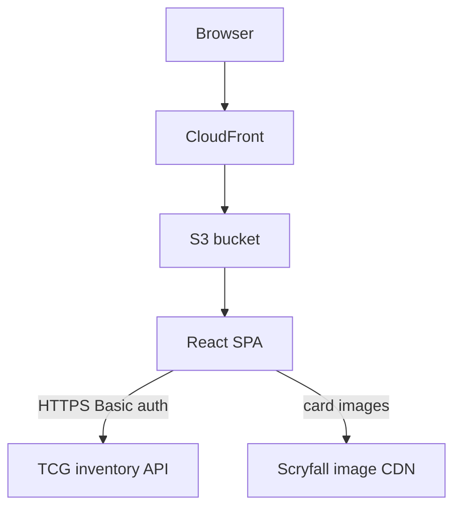
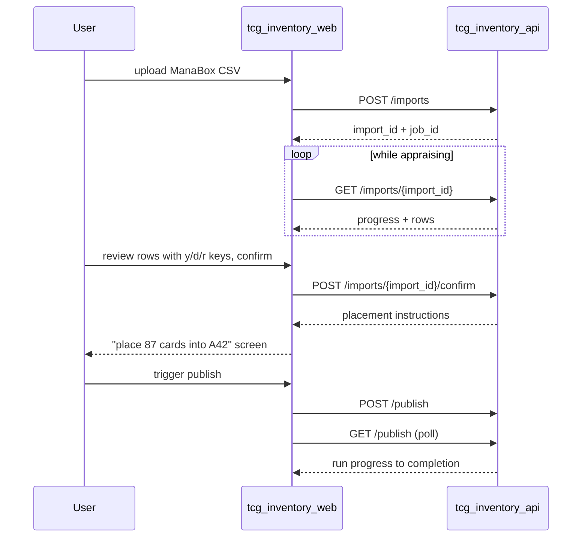

# TCG inventory web

The TCG inventory web service is a keyboard-first single-page app for running a chaos-sorted Magic: The Gathering card operation against `tcg_inventory_api`: importing ManaBox scans, reviewing appraisals, browsing stock, publishing to FetchTCG, and pulling orders.

## Overview

- **Service type**: web client (`tcg_inventory_web`)
- **Interface**: browser SPA served via CloudFront and S3
- **Frontend stack**: React, TypeScript, Vite, Mantine, React Router
- **Primary backend**: `tcg_inventory_api`
- **Primary user**: single-user personal card-selling workflow; desktop-first with mobile support for physical flows

## User stories

- As a card seller working through a physical stack, I want to review an import top-of-stack first with single-key decisions, so that daily intake needs no mouse and tracks the cards in my hand.
- As a card seller, I want a dense full-width inventory view with instant prefix search, so that I can find any SKU and its storage location in seconds.
- As a card seller standing at my boxes, I want a phone-friendly pull sheet in location order, so that I can pull an order one-handed in a single forward pass.
- As a card seller, I want to trigger a publish run and watch its progress, so that FetchTCG listings converge with my inventory on demand.
- As a returning user, I want a persisted session and a write-only credential form, so that setup is one-time and my FetchTCG token is never displayed.

## Features and scope boundaries

### In scope

- Authenticate with username/password against the backend and persist a Basic auth session in `localStorage`; protect all routes and redirect unauthenticated users to `/`.
- Import flow: upload a ManaBox CSV, watch appraisal progress, review rows in stack order with keyboard-first decisions, resolve review rows, confirm, and display placement instructions.
- Inventory: dense SKU table with counts, prefix search, SKU detail with the Scryfall card image, units, and derived locations, and manual adjustments (remove unit, change condition).
- Orders: list and detail with state badges, location-ordered pull sheet optimized for one-handed phone use, confirm-pull action.
- Publish widget (no dedicated jobs page): trigger a publish run, show the pending publish count (SKUs with unpublished inventory changes), and poll/render the current-or-latest run's progress and outcome. Appraisal progress and errors render on the import pages.
- Settings: set or replace the FetchTCG refresh token; display presence and last-updated only.
- Vim-style keyboard navigation across all data views.
- Development fake mode: an in-memory `ApiClient` with seeded data so the whole UX runs without a backend.

### Out of scope

- Analytics dashboards, reporting, and charts.
- Scan or camera-based intake and image verification UIs.
- Offline support, background sync, or push notifications.
- Multi-marketplace views, repricing controls, and offer negotiation (accept/counter happens on FetchTCG).

## Architecture

### Primary workflow

## Main technical decisions

- Use a typed `ApiClient` interface with swappable implementations: production uses the HTTP client, development uses an in-memory fake with seeded data (SKUs across blocks, an in-flight import, orders in every state) for fast iteration and tests.
- Implement vim-style navigation as one small custom hook (keydown handling scoped to the focused data view) rather than adopting a hotkey framework.
- Desktop-first dense layouts: full-width compact Mantine tables, minimal chrome, no narrow content column. Mobile remains functional everywhere, with the pull sheet and placement screens explicitly designed for one-handed phone use.
- Store the session in `localStorage` so it survives browser restarts; logout clears it.
- Poll job and import progress with a short interval while a job is running instead of adding streaming infrastructure.
- Keep server state in page-level React state fed by the `ApiClient`; no global cache library.

## Domain glossary

Shared vocabulary is defined by `tcg_inventory_api/README.md`; the UI uses it verbatim: SKU, unit, sequence number, block, location (`A42-42`), import (`appraising` → `review` → `confirming` → `confirmed`; deletable before confirm), appraise and publish jobs, order states (`awaiting_payment`, `to_pick`, `fulfilled`, `voided`), pull sheet.

- **Keep/discard/review row**: an import row's appraisal decision; review rows must be resolved before confirm.
- **Placement instructions**: the post-confirm screen mapping the confirmed stack to block labels and location ranges.
- **Pending publish badge**: count of SKUs with unpublished inventory changes shown on the publish trigger.

## Keyboard contract

- List views (inventory, imports, import review, orders): `j`/`k` move selection down/up, `gg`/`G` jump to first/last row, `/` focuses search, `Enter` opens the selected row, `Escape` closes detail or clears search focus.
- Import review row actions: `y` mark keep, `d` mark discard, `r` open the resolve dialog for a review row, `u` revert the row to its appraised suggestion.
- Destructive or committing actions (confirm import, confirm pull, remove unit, delete import) are explicit buttons with confirmation dialogs — never single keys.
- Keyboard interactions are desktop affordances; all actions remain reachable by touch.

## Integration contracts

### External systems

- **Scryfall card imagery**: the SKU detail page loads the card image directly in the browser from `https://api.scryfall.com/cards/{scryfall_id}?format=image&version=normal` (an HTTP 302 redirect to Scryfall's image CDN). Requests are unauthenticated, carry only the public `scryfall_id`, and a neutral placeholder renders when the image fails to load.
- FetchTCG is integrated exclusively by the backend; all other data comes from `tcg_inventory_api`.

## API contracts

### Consumed backend endpoints

| Method   | Path                                     | Used by                                 |
| -------- | ---------------------------------------- | --------------------------------------- |
| `POST`   | `/imports`                               | import upload                           |
| `GET`    | `/imports`                               | imports list                            |
| `GET`    | `/imports/{import_id}`                   | appraisal progress + review rows        |
| `PATCH`  | `/imports/{import_id}/rows/{position}`   | review row decisions and identity fixes |
| `POST`   | `/imports/{import_id}/confirm`           | confirm flow + placement instructions   |
| `DELETE` | `/imports/{import_id}`                   | delete-import action                    |
| `GET`    | `/skus`                                  | inventory browse/search                 |
| `GET`    | `/skus/{sku_id}`                         | SKU detail + units                      |
| `DELETE` | `/skus/{sku_id}/units/{sequence_number}` | remove-unit adjustment                  |
| `PUT`    | `/skus/{sku_id}/units/{sequence_number}` | condition-change adjustment             |
| `GET`    | `/orders`                                | orders list                             |
| `GET`    | `/orders/{order_id}`                     | order detail                            |
| `POST`   | `/orders/{order_id}/confirm`             | confirm pull                            |
| `POST`   | `/publish`                               | publish trigger                         |
| `GET`    | `/publish`                               | publish run polling + pending count     |
| `GET`    | `/settings`                              | credential presence check + login probe |
| `PUT`    | `/settings`                              | credential set/replace                  |

### UI contract expectations

- Requests and responses use snake_case fields; errors use `{"message":"..."}` and surface as user-visible feedback.
- Login is validated by an authenticated `GET /settings` call; success persists the session.
- Async work is observed through the affected resource: the UI polls `GET /imports/{import_id}` during appraisal and `GET /publish` during a publish run, every ~2 seconds while running. `POST /publish` is idempotent while a run is active (returns the existing run), so the trigger button cannot double-fire.
- The order detail response is also the pull sheet: its `units` list is location-ordered and renders as the pick list when the order is `to_pick`.
- The credential endpoint is write-only: the UI never receives or renders a stored token value, only `{"credential_set": true, "updated_at": …}`.
- `DELETE /skus/{sku_id}/units/{sequence_number}` (optional `reason` query parameter) responds with the updated SKU detail; the page re-renders counters and units from that response.
- `PUT /skus/{sku_id}/units/{sequence_number}` responds `{"sku_id": "<new sku_id>"}`; the UI navigates to the new SKU's detail page.
- Import review renders rows top-of-stack first exactly as returned; confirm is blocked client-side and server-side (`409`) while unresolved review rows remain.
- Locations render from sequence numbers exactly as the backend provides them (`A42-42`); the client never re-derives them.

## Data and storage contracts

### Browser storage

| Location              | Key                  | Purpose                                                                          | Retention             |
| --------------------- | -------------------- | -------------------------------------------------------------------------------- | --------------------- |
| `localStorage`        | `tcg_inventory_auth` | persisted session `{ "username": string, "token": string }` (base64 Basic token) | until explicit logout |
| in-memory React state | n/a                  | page data, review selection, polling state, dialogs                              | reset on refresh      |

### Data ownership expectations

- `tcg_inventory_api` is authoritative for all inventory, import, order, job, and audit data; the client persists nothing but the session.
- In development, fake-client data is in-memory only and resets on refresh.

## Behavioral invariants and time semantics

- Review order is always top-of-stack first; the client never re-sorts import rows.
- Pull sheets and unit lists render in ascending sequence-number order (forward pass order).
- Single-key review actions apply optimistically to the selected row and persist via `PATCH`; failures revert the row and surface the error.
- Job and import polling stops when the job reaches a terminal status.
- Dates and times display in the browser locale from epoch values; the API remains the source of truth for all timestamps.

## Source of truth

| Entity                                   | Authoritative source                   | Notes                                     |
| ---------------------------------------- | -------------------------------------- | ----------------------------------------- |
| Credential validity                      | authenticated `GET /settings` response | login treated as valid on 2xx             |
| Inventory, imports, orders, publish runs | `tcg_inventory_api`                    | client state is a render cache only       |
| Review edits in flight                   | browser memory                         | authoritative only until `PATCH` succeeds |
| Session persistence                      | browser `localStorage`                 | cleared on logout                         |

## Security and privacy

- All API calls use HTTPS with Basic auth from the persisted session; the session token lives in `localStorage`, never in URLs.
- Card images load directly from Scryfall using the public `scryfall_id`; no session, credential, or inventory data accompanies those requests.
- The FetchTCG refresh token is entered into a password-type field, sent once via `PUT /settings`, and never displayed, stored, or logged client-side.
- Logout clears the session immediately.
- The client embeds no backend secrets or infrastructure credentials.

## Configuration and secrets reference

### Environment variables

| Name                | Required | Purpose                          | Default behavior                                           |
| ------------------- | -------- | -------------------------------- | ---------------------------------------------------------- |
| `VITE_API_BASE_URL` | no       | base URL for the HTTP API client | defaults to `https://api.tcg-inventory.jordansimsmith.com` |

Build mode behavior: production (`import.meta.env.PROD`) uses the HTTP client; development uses the in-memory fake client.

### Secrets handling

- User credentials are entered at login and used only to build the Basic auth header token.
- The FetchTCG refresh token passes through the client write-only; masked presence metadata is the only credential state ever rendered.

## Performance envelope

- Optimized for a single user with 5,000–10,000 SKUs: browse views paginate via continuation tokens and keep interactions immediate on desktop hardware.
- Import review handles a few hundred rows with keyboard navigation and optimistic updates; no virtualization until row counts demand it.
- Polling intervals (~2 s) apply only while a job is running.
- Mobile targets are the pull sheet and placement screens; they render fast on mid-range phones.

## Testing and quality gates

- Unit and component tests run with Vitest and React Testing Library in `jsdom`.
- Key coverage: login and route protection, the vim navigation hook (movement, jumps, search focus), SKU detail adjustments (remove unit, condition change), import review row actions and confirm gating, pull-sheet ordering and confirm flow, publish trigger + job polling, masked credential form.
- Required checks: `bazel test //tcg_inventory_web:unit-tests`, `bazel build //tcg_inventory_web:typecheck`, `bazel build //tcg_inventory_web:build`.

## Local development and smoke checks

- Recommended: `cd tcg_inventory_web && pnpm vite dev` (fake mode, no backend needed); Bazel option: `bazel run //tcg_inventory_web:vite -- dev`.
- Smoke flow in dev mode:
  1. Log in with any credentials.
  2. Open inventory, traverse with `j`/`k`, search with `/`, open a SKU with `Enter`; verify the card image renders, remove a unit, and change a unit's condition.
  3. Upload a ManaBox CSV, watch appraisal progress, review with `y`/`d`/`r`, confirm, and check placement instructions.
  4. Open the seeded `to_pick` order, view the pull sheet at phone width, confirm the pull.
  5. Trigger publish and watch the fake job drain the pending publish count.
  6. Set a credential in settings and verify only presence metadata renders.

## End-to-end scenarios

### Scenario 1: daily import without touching the mouse

1. User uploads today's ManaBox export and watches appraisal progress.
2. Review opens top-of-stack first; the user leafs through the physical stack while `j`/`k` tracks rows, pressing `y`/`d` to adjust decisions and `r` to resolve the flagged rows.
3. Discards come out of the stack; the user confirms via the confirm dialog.
4. The placement screen says which block labels to file the stack into; the user boxes it in one motion.
5. The user triggers publish and watches the job complete; the pending badge drops to zero.

### Scenario 2: pulling an order on a phone

1. A paid order appears as `to_pick` after a publish run.
2. Standing at the boxes, the user opens the order's pull sheet on their phone: units listed in location order.
3. The user pulls each card front-to-back in one pass, then taps confirm; the order becomes `fulfilled`.

### Scenario 3: replacing an expired FetchTCG credential

1. A publish run fails with an authentication error visible in the publish widget.
2. The user opens settings, pastes a fresh refresh token into the write-only field, and saves.
3. Settings shows updated presence metadata; re-triggering publish succeeds. The token value itself is never displayed.
