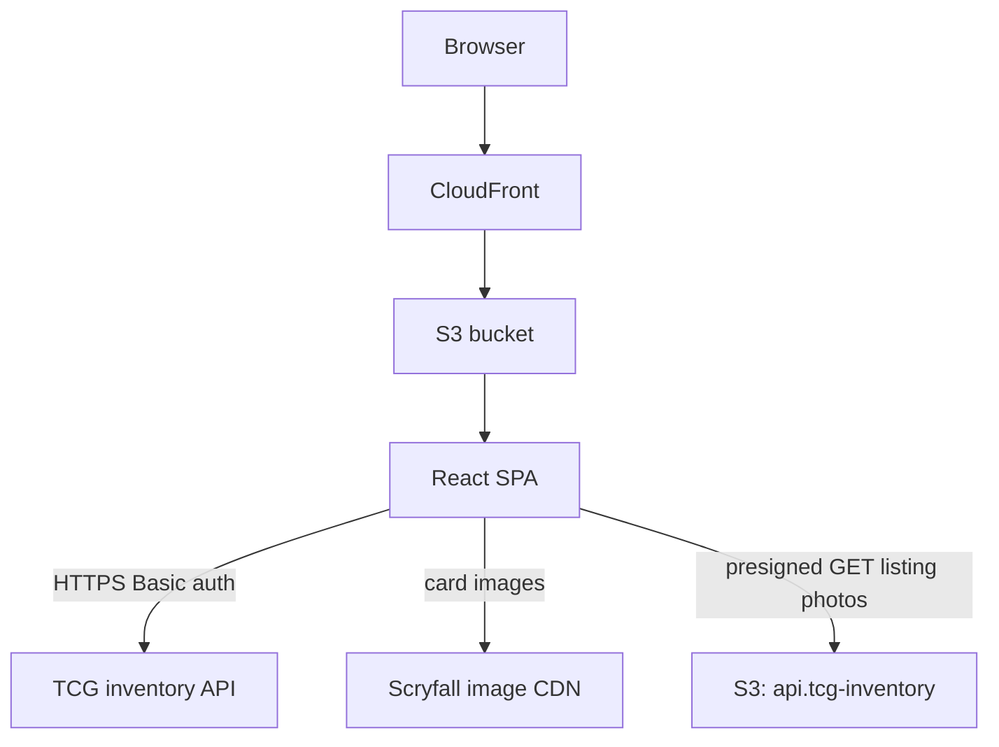
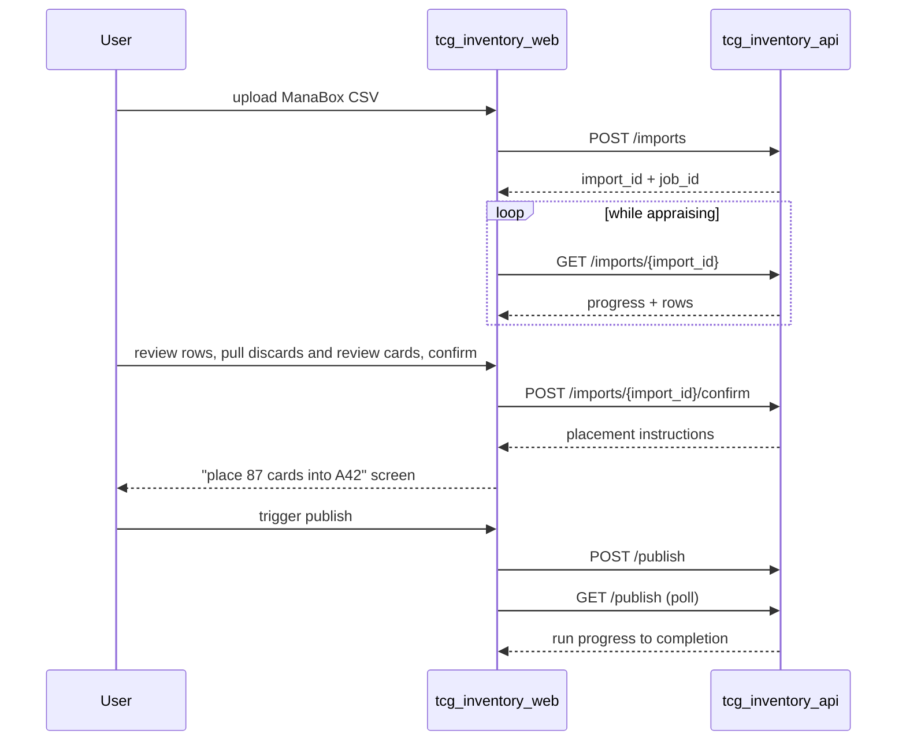

# TCG inventory web

The TCG inventory web service is a keyboard-first single-page app for running a chaos-sorted Magic: The Gathering card operation against `tcg_inventory_api`: importing ManaBox scans, reviewing appraisals, browsing stock, publishing to FetchTCG, pulling orders, and reviewing inventory reports.

## Overview

- **Service type**: web client (`tcg_inventory_web`)
- **Interface**: browser SPA served via CloudFront and S3
- **Frontend stack**: React, TypeScript, Vite, Mantine, React Router
- **Primary backend**: `tcg_inventory_api`
- **Primary user**: single-user personal card-selling workflow; desktop-first with mobile support for physical flows

## User stories

- As a card seller working through a physical stack, I want to review an import top-of-stack first while pulling out its discard and review cards, so that daily intake tracks the cards in my hand.
- As a card seller reviewing an import on my desktop, I want rows needing photos flagged so I can add photos from my phone mid-review, so that high-value cards are photographed while still in hand.
- As a card seller, I want a dense full-width inventory view with instant prefix search, so that I can find any SKU and its storage location in seconds.
- As a card seller standing at my boxes, I want a phone-friendly pull sheet in location order, so that I can pull an order one-handed in a single forward pass.
- As a card seller, I want each order to show whether the offered price differs from my listed price, so that I can spot a lowball or over-ask without opening FetchTCG.
- As a card seller, I want to trigger a publish run and watch its progress, so that FetchTCG listings converge with my inventory on demand.
- As a card seller, I want a reports dashboard of value, movement, and composition figures, so that I can appreciate the overall state of my inventory at a glance.
- As a returning user, I want a persisted session and a write-only credential form, so that setup is one-time and my FetchTCG token is never displayed.

## Features and scope boundaries

### In scope

- Authenticate with username/password against the backend and persist a Basic auth session in `localStorage`; protect all routes and redirect unauthenticated users to `/`.
- Import flow: upload a ManaBox CSV, watch appraisal progress, review appraisal decisions in stack order while pulling discard and review cards from the stack, confirm keepers, and display placement instructions.
- Listing photos during review: keep rows appraised at NZ$20+ carry a "needs photos" badge; a touch-friendly photo strip on keep rows supports add (camera or library) and remove — the first uploaded photo is the listing front image; confirm stays disabled while flagged rows lack photos; desktop picks up phone uploads on window refocus.
- Inventory: dense SKU table with counts, prefix search, SKU detail with the Scryfall card image, units, derived locations, and per-unit photo thumbnails (view-only), and manual adjustments (remove unit, change condition).
- Orders: list and detail with state badges, offer lines on detail with an above/below-list badge when the offered price differs from list, location-ordered pull sheet optimized for one-handed phone use, confirm-pull action.
- Publish widget (no dedicated jobs page): trigger a publish run, show the pending publish count (SKUs with unpublished inventory changes), and poll/render the current-or-latest run's progress and outcome. Appraisal progress and errors render on the import pages.
- Reports tab: renders the latest generated report — headline totals strip, monthly revenue, weekly intake vs sales, top sets, price buckets, top hits table, and aging bands — under a "data as of" stamp. Regeneration is automatic and background-only: when the response says stale (checked on navigation and window refocus), the page triggers a new generation and polls until fresh figures swap in place; the first-ever visit shows skeletons while the first generation runs.
- Settings: set or replace the FetchTCG refresh token (display presence and last-updated only); configure the "Track orders after" date to exclude pre-existing FetchTCG orders from tracking.
- Vim-style keyboard navigation across all data views.
- Development fake mode: an in-memory `ApiClient` with seeded data so the whole UX runs without a backend.

### Out of scope

- Manual report refresh controls (regeneration is automatic on visit and refocus) and real-time or streaming report updates.
- Scan or camera-based intake and image verification UIs.
- Post-confirm photo management (unit photos render view-only; retakes go through remove + re-import).
- Offline support, background sync, or push notifications.
- Multi-marketplace views, repricing controls, and offer negotiation (accept/counter happens on FetchTCG).

## Architecture

### Primary workflow

## Main technical decisions

- Use a typed `ApiClient` interface with swappable implementations: production uses the HTTP client, development uses an in-memory fake with seeded data (SKUs across blocks, an in-flight import, orders in every state, a generated report) for fast iteration and tests.
- Charts come from `@mantine/charts` (Recharts-backed, same version line as the Mantine kit); every report figure renders the API's prepared payload verbatim with no client-side aggregation.
- Report freshness is stale-while-revalidate: the page always renders the stored snapshot immediately, auto-triggers regeneration when stale, and never unmounts content during a refresh; there is no manual refresh control (a browser reload or re-navigation is the escape hatch).
- Implement vim-style navigation as one small custom hook (keydown handling scoped to the focused data view) rather than adopting a hotkey framework.
- Desktop-first dense layouts: full-width compact Mantine tables, minimal chrome, no narrow content column. Mobile remains functional everywhere, with the pull sheet and placement screens explicitly designed for one-handed phone use.
- Store the session in `localStorage` so it survives browser restarts; logout clears it.
- Poll job and import progress with a short interval while a job is running instead of adding streaming infrastructure.
- Keep server state in page-level React state fed by the `ApiClient`; no global cache library.
- Photo uploads are processed client-side before the API: a canvas re-encode to JPEG (max edge 2000 px, quality 0.85) normalizes iPhone HEIC and library picks, strips EXIF (including GPS), and keeps raw `image/jpeg` bodies far under Lambda's payload ceiling — no multipart, no presigned upload choreography.
- Cross-device capture needs no live sync: the desktop review page refetches the import on window refocus (the reports pattern), so photos added from the phone appear when the user glances back.

## Domain glossary

Shared vocabulary is defined by `tcg_inventory_api/README.md`; the UI uses it verbatim: SKU, unit, sequence number, block, location (`A42-42`), import (`appraising` → `review` → `confirming` → `confirmed`; deletable before confirm), appraise and publish jobs, order states (`awaiting_payment`, `to_pick`, `fulfilled`, `voided`), pull sheet.

- **Keep/discard/review row**: an import row's appraisal decision; decisions are final for the import. Review cards are set aside physically, never ingested, and return through a later import once their cause is fixed.
- **Placement instructions**: the post-confirm screen mapping the confirmed stack to block labels and location ranges, with the card names at each range boundary as physical checkpoints.
- **Pending publish badge**: count of SKUs with unpublished inventory changes shown on the publish trigger.
- **Needs photos badge**: flag on a keep row appraised at NZ$20+ with no photos yet; confirm is blocked while any such row remains.
- **Report**: the latest generated dashboard snapshot served by `GET /reports`; stale when inventory changed since generation or the snapshot is older than 24 hours. The "data as of" stamp renders its generation time (relative under 24 h, absolute beyond).

## Keyboard contract

- List views (inventory, imports, orders): `j`/`k` move selection down/up, `gg`/`G` jump to first/last row, `/` focuses search, `Enter` opens the selected row, `Escape` closes detail or clears search focus.
- Import review is read-only: the same movement keys track the selected row while the user leafs through the physical stack; rows carry no actions.
- Destructive or committing actions (confirm import, confirm pull, remove unit, delete import) are explicit buttons with confirmation dialogs — never single keys.
- Keyboard interactions are desktop affordances; all actions remain reachable by touch.

## Integration contracts

### External systems

- **Scryfall card imagery**: the SKU detail page loads the card image directly in the browser from `https://api.scryfall.com/cards/{scryfall_id}?format=image&version=normal` (an HTTP 302 redirect to Scryfall's image CDN). Requests are unauthenticated, carry only the public `scryfall_id`, and a neutral placeholder renders when the image fails to load.
- **Listing photo thumbnails**: row and unit photos render from short-lived presigned S3 URLs provided by the API; the client never constructs S3 URLs itself.
- FetchTCG is integrated exclusively by the backend; all other data comes from `tcg_inventory_api`.

## API contracts

### Consumed backend endpoints

| Method   | Path                                                     | Used by                                                      |
| -------- | -------------------------------------------------------- | ------------------------------------------------------------ |
| `POST`   | `/imports`                                               | import upload                                                |
| `GET`    | `/imports`                                               | imports list                                                 |
| `GET`    | `/imports/{import_id}`                                   | appraisal progress + review rows                             |
| `POST`   | `/imports/{import_id}/confirm`                           | confirm flow + placement instructions                        |
| `DELETE` | `/imports/{import_id}`                                   | delete-import action                                         |
| `POST`   | `/imports/{import_id}/rows/{position}/photos`            | photo add from the review strip                              |
| `DELETE` | `/imports/{import_id}/rows/{position}/photos/{photo_id}` | photo remove                                                 |
| `GET`    | `/skus`                                                  | inventory browse/search                                      |
| `GET`    | `/skus/{sku_id}`                                         | SKU detail + units                                           |
| `DELETE` | `/skus/{sku_id}/units/{sequence_number}`                 | remove-unit adjustment                                       |
| `PUT`    | `/skus/{sku_id}/units/{sequence_number}`                 | condition-change adjustment                                  |
| `GET`    | `/orders`                                                | orders list                                                  |
| `GET`    | `/orders/{order_id}`                                     | order detail                                                 |
| `POST`   | `/orders/{order_id}/confirm`                             | confirm pull                                                 |
| `POST`   | `/publish`                                               | publish trigger                                              |
| `GET`    | `/publish`                                               | publish run polling + pending count                          |
| `GET`    | `/reports`                                               | reports tab snapshot + staleness + generation polling        |
| `POST`   | `/reports`                                               | automatic regeneration trigger when stale                    |
| `GET`    | `/settings`                                              | credential presence check + login probe + track orders after |
| `PATCH`  | `/settings`                                              | partial update: credential and/or track orders after         |

### UI contract expectations

- Requests and responses use snake_case fields; errors use `{"message":"..."}` and surface as user-visible feedback.
- Login is validated by an authenticated `GET /settings` call; success persists the session.
- Async work is observed through the affected resource: the UI polls `GET /imports/{import_id}` during appraisal and `GET /publish` during a publish run, every ~2 seconds while running. `POST /publish` is idempotent while a run is active (returns the existing run), so the trigger button cannot double-fire.
- The order detail response is also the pull sheet: its `units` list is location-ordered and renders as the pick list when the order is `to_pick`. Its `lines` list is the offer (offered line total vs per-unit `listed_price` captured at ingest); a vs-list badge renders only when the offered price is above or below list.
- The settings endpoint uses PATCH with merge semantics: each field present in the body is applied, absent fields are unchanged. The response returns the full view `{credential_set, updated_at, track_orders_after}`. The refresh token is write-only (never returned in the response).
- `DELETE /skus/{sku_id}/units/{sequence_number}` (optional `reason` query parameter) responds with the updated SKU detail; the page re-renders counters and units from that response.
- `PUT /skus/{sku_id}/units/{sequence_number}` responds `{"sku_id": "<new sku_id>"}`; the UI navigates to the new SKU's detail page.
- Import review renders rows top-of-stack first exactly as returned; review rows are informational and never become units — confirm ingests keep rows only.
- Photo mutations respond `204`; the strip and needs-photos badge re-render from a follow-up `GET /imports/{import_id}`. Photos order by upload — the first is the listing front image, removing one promotes the next, and reordering is delete + re-upload. Uploads send canvas-processed raw `image/jpeg` bodies; the 5-photo cap and the NZ$20 gate are server-derived (`needs_photos`), never re-derived client-side.
- The confirm 409 while rows still need photos surfaces the API message; the confirm button is disabled client-side with the same reason.
- Unit `photos` on SKU detail are read-only; no management affordances render at any status.
- Locations render from sequence numbers exactly as the backend provides them (`A42-42`); the client never re-derives them.
- The reports tab renders `GET /reports` figures exactly as provided — buckets, bands, labels, and money strings are pre-shaped server-side. A 404 means no report exists yet: the page triggers `POST /reports` and shows skeletons until the first snapshot lands. When `stale` is true and no generation is queued or running, the page triggers `POST /reports` and polls `GET /reports` every ~2 seconds, keeping the old figures visible with a subtle refreshing indicator until fresh figures swap in place. Generation failures render inline (like the publish widget) while the stale figures remain visible.

## Data and storage contracts

### Browser storage

| Location              | Key                  | Purpose                                                                          | Retention             |
| --------------------- | -------------------- | -------------------------------------------------------------------------------- | --------------------- |
| `localStorage`        | `tcg_inventory_auth` | persisted session `{ "username": string, "token": string }` (base64 Basic token) | until explicit logout |
| in-memory React state | n/a                  | page data, review selection, polling state, dialogs                              | reset on refresh      |

### Data ownership expectations

- `tcg_inventory_api` is authoritative for all inventory, import, order, job, and audit data; the client persists nothing but the session.
- In development, fake-client data is in-memory only and resets on refresh.

## Behavioral invariants and time semantics

- Review order is always top-of-stack first; the client never re-sorts import rows.
- Pull sheets and unit lists render in ascending sequence-number order (forward pass order).
- Import review is read-only; appraisal decisions are final for the import.
- Job and import polling stops when the job reaches a terminal status.
- The reports tab revalidates staleness on navigation and window refocus; regeneration is automatic only, and rendered figures never unmount during a refresh.
- The import review page refetches on window refocus while the import is in review, picking up cross-device photo uploads; photos are immutable after confirm and the UI offers no unit-level photo management.
- Dates and times display in the browser locale from epoch values; the API remains the source of truth for all timestamps.

## Source of truth

| Entity                                   | Authoritative source                   | Notes                               |
| ---------------------------------------- | -------------------------------------- | ----------------------------------- |
| Credential validity                      | authenticated `GET /settings` response | login treated as valid on 2xx       |
| Inventory, imports, orders, publish runs | `tcg_inventory_api`                    | client state is a render cache only |
| Session persistence                      | browser `localStorage`                 | cleared on logout                   |

## Security and privacy

- All API calls use HTTPS with Basic auth from the persisted session; the session token lives in `localStorage`, never in URLs.
- Card images load directly from Scryfall using the public `scryfall_id`; no session, credential, or inventory data accompanies those requests.
- The FetchTCG refresh token is entered into a password-type field, sent once via `PATCH /settings`, and never displayed, stored, or logged client-side.
- Logout clears the session immediately.
- The client embeds no backend secrets or infrastructure credentials.

## Configuration and secrets reference

### Environment variables

| Name                | Required | Purpose                          | Default behavior                                           |
| ------------------- | -------- | -------------------------------- | ---------------------------------------------------------- |
| `VITE_API_BASE_URL` | no       | base URL for the HTTP API client | defaults to `https://api.tcg-inventory.jordansimsmith.com` |

Build mode behavior: production (`import.meta.env.PROD`) uses the HTTP client; development uses the in-memory fake client.

### Secrets handling

- User credentials are entered at login and used only to build the Basic auth header token.
- The FetchTCG refresh token passes through the client write-only; masked presence metadata is the only credential state ever rendered.

## Performance envelope

- Optimized for a single user with 5,000–10,000 SKUs: browse views paginate via continuation tokens and keep interactions immediate on desktop hardware.
- Import review handles a few hundred rows with keyboard navigation; no virtualization until row counts demand it.
- Polling intervals (~2 s) apply only while a job is running.
- The report payload is a few KB of pre-aggregated figures; charts render prepared data with no client-side computation. The reports tab is desktop-first and functional on mobile without special optimization.
- Mobile targets are the pull sheet and placement screens; they render fast on mid-range phones.

## Testing and quality gates

- Unit and component tests run with Vitest and React Testing Library in `jsdom`.
- Key coverage: login and route protection, the vim navigation hook (movement, jumps, search focus), SKU detail adjustments (remove unit, condition change), import review rendering and the confirm transition, pull-sheet ordering and confirm flow, offered-vs-listed badges on order detail (above/below only; omitted at list and when the listed baseline is missing), publish trigger + job polling, masked credential form, reports tab rendering of every section from the fake client, the stale→regenerate→poll flow with figures kept visible, first-visit skeleton generation, the needs-photos badge and gated confirm, photo strip interactions (add via the canvas util, remove), refocus refetch of in-review imports, and read-only unit photo thumbnails.
- Required checks: `bazel test //tcg_inventory_web:unit-tests`, `bazel build //tcg_inventory_web:typecheck`, `bazel build //tcg_inventory_web:build`.

## Local development and smoke checks

- Recommended: `cd tcg_inventory_web && pnpm vite dev` (fake mode, no backend needed); Bazel option: `bazel run //tcg_inventory_web:vite -- dev`.
- Smoke flow in dev mode:
  1. Log in with any credentials.
  2. Open inventory, traverse with `j`/`k`, search with `/`, open a SKU with `Enter`; verify the card image renders, remove a unit, and change a unit's condition.
  3. Upload a ManaBox CSV, watch appraisal progress, review the appraisal decisions, add photos to the seeded flagged row and watch confirm enable, confirm, and check placement instructions.
  4. Open the seeded `to_pick` order, view the pull sheet at phone width, confirm the pull.
  5. Trigger publish and watch the fake job drain the pending publish count.
  6. Set a credential in settings and verify only presence metadata renders.
  7. Open reports; verify every figure renders under the "data as of" stamp, then make an inventory change, revisit reports, and watch it regenerate automatically with figures swapping in place.

## End-to-end scenarios

### Scenario 1: daily import without touching the mouse

1. User uploads today's ManaBox export and watches appraisal progress.
2. Review opens top-of-stack first; the user leafs through the physical stack while `j`/`k` tracks rows, pulling out each discard and review card as it appears.
3. A NZ$60 rare carries the needs-photos badge: the user opens the same import on their phone, photographs the card, and the desktop picks the photos up on refocus, enabling confirm.
4. The user confirms via the confirm dialog; only keep rows become units (photos frozen onto them), and the set-aside review cards return through a later import once fixed.
5. The placement screen says which block labels to file the stack into; the user boxes it in one motion.
6. The user triggers publish and watches the job complete; the pending badge drops to zero.

### Scenario 2: pulling an order on a phone

1. A paid order appears as `to_pick` after a publish run.
2. Standing at the boxes, the user opens the order: offer lines show offered vs listed when they differ, then the pull sheet lists units in location order.
3. The user pulls each card front-to-back in one pass, then taps confirm; the order becomes `fulfilled`.

### Scenario 3: replacing an expired FetchTCG credential

1. A publish run fails with an authentication error visible in the publish widget.
2. The user opens settings, pastes a fresh refresh token into the write-only field, and saves.
3. Settings shows updated presence metadata; re-triggering publish succeeds. The token value itself is never displayed.

### Scenario 4: appreciating the inventory after a big import

1. The user confirms a 300-card import and triggers publish.
2. Opening the reports tab shows the previous snapshot instantly, marked stale, with the refreshing indicator while regeneration runs in the background.
3. Fresh figures swap in place: total value and in-stock units jump, the intake trend shows this week's spike, and a new card appears in the top hits table.
4. Glancing away and refocusing the window later re-checks staleness silently; nothing regenerates when nothing changed.
