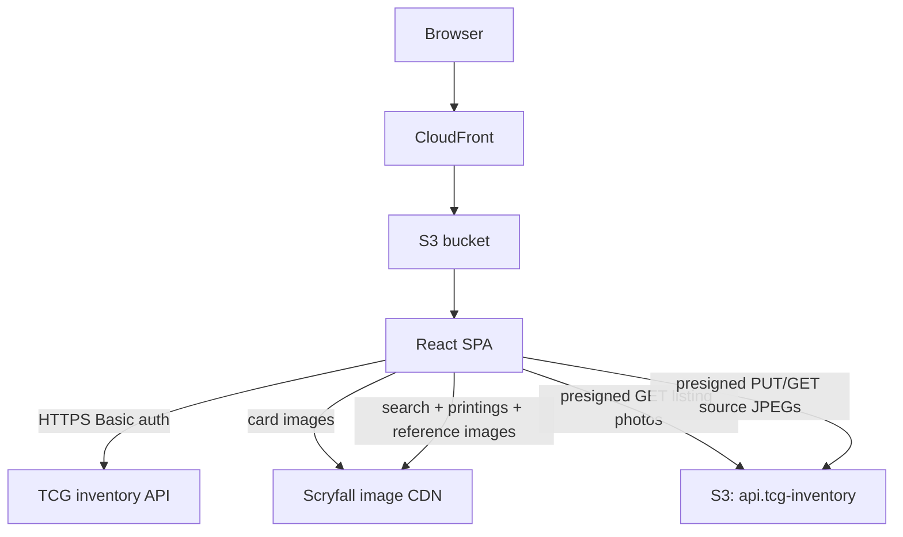
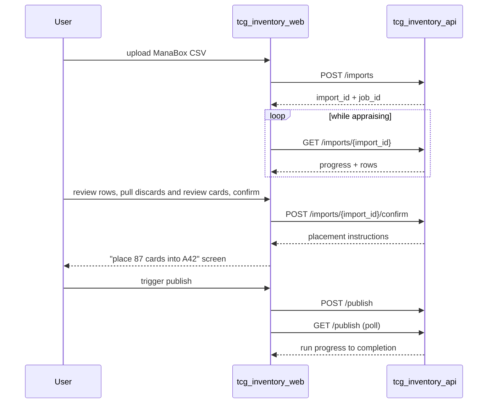
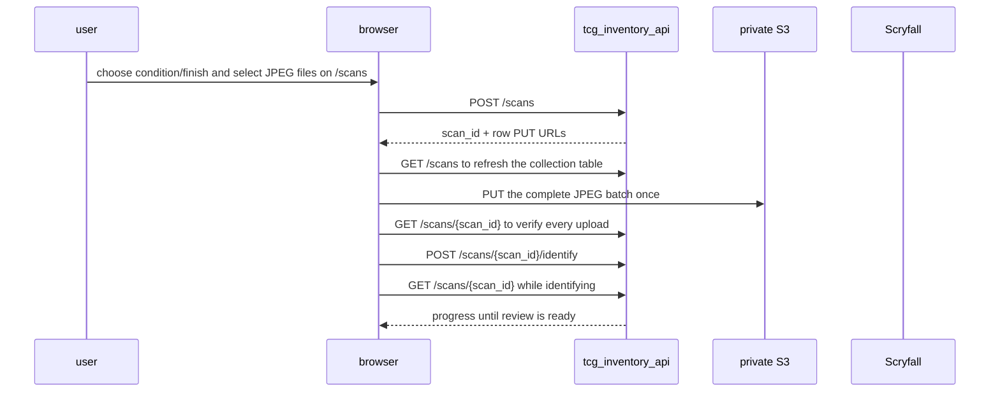

# TCG inventory web

The TCG inventory web service is a single-page app for running a chaos-sorted card operation against `tcg_inventory_api`. Magic: The Gathering is the only registered game today. The app supports ManaBox exports and scanner JPEGs, appraisal, per-game inventory browsing, FetchTCG publishing, combined order pulling, and inventory reports.

## Overview

- **Service type**: web client (`tcg_inventory_web`)
- **Interface**: browser SPA served via CloudFront and S3
- **Frontend stack**: React, TypeScript, Vite, Mantine, React Router
- **Primary backend**: `tcg_inventory_api`
- **Primary user**: single-user personal card-selling workflow; desktop-first with responsive support throughout and one-handed optimization for physical flows

## User stories

- As a card seller working through a physical stack, I want to review an import top-of-stack first while pulling out its discard and review cards, so that daily intake tracks the cards in my hand.
- As a card seller, I want to upload a batch of ordered card-front JPEGs and have identification start automatically, so that the scanner can begin processing without another confirmation step.
- As a card seller, I want an identifying scan to show its progress on a dedicated page, so that I know when the batch is ready for review.
- As a card seller revisiting a confirmed import, I want to see the total suggested value of its keepers, so that I can recall what that intake was worth without re-adding the row prices.
- As a card seller reviewing an import on my desktop, I want rows needing photos flagged so I can add photos from my phone mid-review, so that high-value cards are photographed while still in hand.
- As a card seller, I want a dense full-width inventory view with instant prefix search, so that I can find any SKU and its storage location in seconds.
- As a card seller standing at my boxes, I want a phone-friendly pull sheet in location order, so that I can pull an order one-handed in a single forward pass.
- As a card seller counting cards from the front of a block, I want each pull entry to show the card's current position and the cards either side of it, so that gaps from sold cards and duplicates in the block cannot make me pull the wrong card.
- As a card seller, I want each order to show whether the offered price differs from my listed price, so that I can spot a lowball or over-ask without opening FetchTCG.
- As a card seller packing a parcel, I want the order page to show the buyer's name, address, and paid postage option, so that I can write the label straight from the pull sheet.
- As a card seller packing a fulfilled parcel, I want direct links to FetchTCG and Trade Me's courier booking page, so that I can finish the shipment from the order detail.
- As a card seller scanning the orders list, I want the money column to be what the cards sold for, so that postage the buyer paid never inflates what an order looks like it earned.
- As a card seller, I want to trigger a publish run and watch its progress, so that FetchTCG listings converge with my inventory on demand.
- As a card seller, I want a reports dashboard of value, movement, and composition figures, so that I can appreciate the overall state of my inventory at a glance.
- As a returning user, I want a persisted session and a write-only credential form, so that setup is one-time and my FetchTCG token is never displayed.

## Features and scope boundaries

### In scope

- Authenticate with username/password against the backend and persist a Basic auth session in `localStorage`; protect all routes and redirect unauthenticated users to `/`.
- Import flow: upload a ManaBox CSV, watch appraisal progress, review appraisal decisions in stack order while pulling discard and review cards from the stack, confirm keepers, and display placement instructions with the card count and total suggested value. A confirmed import keeps that same keep-row total on the import page so reopening it still shows what the stack was worth.
- Scanner intake: the `/scans` page places a compact new scan form above the unified scans list, like the imports list/new import pattern. Choose a registered game, one of that game's finishes, one condition, and 1–200 JPEG files before creating the batch. Magic is the only registered game today. ASCII filenames are sorted case-sensitive lexicographically; client validation blocks local file/count/size errors before any API call, and the API rejects non-ASCII names. The Create button stays loading while the API creates the job, refreshes the table, uploads and verifies the complete batch, and starts identification. The browser then opens `/scans/{scan_id}`, where identification progress is polled until review is ready. The first scanned card is the first import row. Alternate art, double-faced cards, and tokens are supported.
- Scan job management: an upload is one all-or-abandon batch attempt; an incomplete failed job remains `uploading` until it is deleted and cannot be retried or resumed. Scan rows open read-only job details, and identifying jobs show progress. Later review controls permanently delete an outlier row while requiring immediate physical removal, delete unfinished jobs, and inspect confirmed jobs read-only. Source scans are shown for identification only and are never automatically used as listing photos.
- Listing photos during review: keep rows appraised at NZ$20+ carry a "needs photos" badge; a touch-friendly photo strip on keep rows supports add (camera or library) and remove — the first uploaded photo is the listing front image; confirm stays disabled while flagged rows lack photos; desktop picks up phone uploads on window refocus.
- Inventory: one independently searchable and paginated section per registered game, each with a dense SKU table and counts. SKU detail shows the registered image for its external identity, units, derived locations, and per-unit photo thumbnails (view-only), with manual adjustments (remove unit, change condition).
- Orders: one combined order list and detail view with state badges, a Cards column carrying the card-line subtotal (postage excluded), a detail fulfillment panel with the buyer's name, delivery address, and postage option, order-level offered vs listed totals with an above/below-list badge when they differ, and a location-ordered pull sheet optimized for one-handed phone use. Pull sheet rows are grouped by game and show a bounded image when that identity has an image resolver, the accepted per-card price, the current block position with the insertion location struck through beside it when gaps have shifted it, and the previous and next cards still in the block; confirm-pull action; the detail page keeps only Back to orders in the header and places neutral external links in a right-column Order actions panel, including courier booking for fulfilled orders.
- Publish widget (no dedicated jobs page): trigger a publish run, show the pending publish count (SKUs with unpublished inventory changes), and poll/render the current-or-latest run's progress and outcome. Appraisal progress and errors render on the import pages.
- Job failure reporting: failed publish runs, appraisals, and report generations render a compact alert with the failure title and the backend's short actionable error message; full diagnostics stay in backend logs, never in the UI.
- Reports tab: renders combined inventory value to two decimal places, paid-order revenue, weekly card movement, and monthly revenue, then one tab per registered game. A game summary uses three sections: inventory value; unique in-stock card names with units in stock; and paid revenue with units sold. Supporting sections rank highest-value cards and sets, then show time in stock and stock by price. Regeneration is automatic and background-only: when the response says stale (checked on navigation and window refocus), the page triggers a new generation and polls until fresh figures swap in place; the first-ever visit shows skeletons while the first generation runs.
- Settings: set or replace the FetchTCG refresh token (display presence and last-updated only); configure the "Track orders after" date to exclude pre-existing FetchTCG orders from tracking.
- A `/` shortcut focuses the active inventory game's search field; scan review keeps its workflow-specific keyboard controls.
- Development fake mode: an in-memory `ApiClient` with seeded data so the whole UX runs without a backend.

### Out of scope

- Manual report refresh controls (regeneration is automatic on visit and refocus) and real-time or streaming report updates.
- Camera capture, PNG/TIFF/PDF scans, non-English/non-Magic cards, scan quality grading, automatic per-image recognition retry, saved partial confirmation choices across browser closures, and use of source scans as listing photos.
- Post-confirm photo management (unit photos render view-only; retakes go through remove + re-import).
- Offline support, background sync, or push notifications.
- Multi-marketplace views, repricing controls, and offer negotiation (accept/counter happens on FetchTCG).

## Architecture

### Primary workflow

### Scanner workflow

## Main technical decisions

- Use a typed `ApiClient` interface with swappable implementations: production uses the HTTP client, development uses an in-memory fake with seeded data (SKUs across blocks, an in-flight import, orders in every state, a generated report) for fast iteration and tests.
- Charts come from `@mantine/charts` (Recharts-backed, same version line as the Mantine kit); every report figure renders the API's prepared payload verbatim with no client-side aggregation.
- Report freshness is stale-while-revalidate: the page always renders the stored snapshot immediately, auto-triggers regeneration when stale, and never unmounts content during a refresh; there is no manual refresh control (a browser reload or re-navigation is the escape hatch).
- Keep inventory's `/` search shortcut local to its page; scan review owns its workflow-specific keyboard controls.
- Desktop-first dense layouts: full-width compact Mantine tables, minimal chrome, and no narrow content column. Narrow screens use deliberate mobile compositions rather than squeezed desktop tables; the pull sheet, import review, and placement screens are explicitly designed for one-handed physical use.
- Store the session in `localStorage` so it survives browser restarts; logout clears it.
- Poll job and import progress with a short interval while a job is running instead of adding streaming infrastructure.
- Keep server state in page-level React state fed by the `ApiClient`; no global cache library.
- Photo uploads are processed client-side before the API: a canvas re-encode to JPEG (max edge 2000 px, quality 0.85) normalizes iPhone HEIC and library picks, strips EXIF (including GPS), and keeps raw `image/jpeg` bodies far under Lambda's payload ceiling — no multipart, no presigned upload choreography.
- Scanner JPEGs are different from listing photos: the browser preserves the original JPEG, creates the scan with `POST /scans`, refreshes the collection from `GET /scans`, uploads the selected files as one batch to private S3 with the initial presigned PUT URLs, and verifies the complete batch before automatic identification. The API owns durable scan/job/suggestion state; a failed/incomplete upload remains an abandoned `uploading` job with no retry or resume path. `GET /scans/{scan_id}` verifies uploads but does not issue replacement URLs.
- Browser-direct Scryfall search, paginated `prints_search_uri` results, card metadata, and reference images follow the spike. Handle double-faced cards through `card_faces[].image_uris` when top-level `image_uris` is absent; store the selected printing's `external_source=scryfall` and exact Scryfall ID as `external_id`. No browser score is presented as calibrated confidence.
- Order thumbnails resolve the unit's `(game, external_source, external_id)` through the registered image resolver with the small image variant, native lazy loading, and a reserved neutral frame. Unsupported identities do not get treated as Scryfall IDs.
- Cross-device capture needs no live sync: the desktop review page refetches the import on window refocus (the reports pattern), so photos added from the phone appear when the user glances back.
- Error surfaces split into two classes: transient request errors (short API `{"message"}` strings) surface as toasts or inline text, while persistent job failures use one shared failure alert component that renders the API's short error summary with defensive single-line truncation; deep diagnostics belong to backend logs rather than shipping to the browser.

## Domain glossary

Shared vocabulary is defined by `tcg_inventory_api/README.md`; the UI uses it verbatim: SKU, unit, sequence number, block, location (`A42-42`), current location, import (`appraising` → `review` → `confirming` → `confirmed`; deletable before confirm), appraise and publish jobs, order states (`awaiting_payment`, `to_pick`, `fulfilled`, `voided`), pull sheet.

- **Scan**: one ordered scanner batch with condition and finish fixed before identification; status `uploading` → `identifying` → `reviewing` → `confirmed`. The `/scans` table is refreshed from the API after creation, and the identifying detail page polls durable progress. Uploaded source images and suggestions survive browser closure; a confirmed scan is read-only.
- **Scan row**: one source JPEG at an immutable bottom-first `scan_position`. Recognition suggestions and later printing choices belong to the scan detail workflow; deleting a row is irreversible and means removing the same physical card.

- **Keep/discard/review row**: an import row's appraisal decision; decisions are final for the import. Review cards are set aside physically, never ingested, and return through a later import once their cause is fixed.
- **Placement instructions**: the post-confirm screen mapping the confirmed stack to block labels and location ranges, with the card names at each range boundary as physical checkpoints and a total suggested value for the confirmed stack. The same total stays on the import page when a confirmed import is reopened.
- **Pending publish badge**: count of SKUs with unpublished inventory changes shown on the publish trigger.
- **Needs photos badge**: flag on a keep row appraised at NZ$20+ with no photos yet; confirm is blocked while any such row remains.
- **Report**: the latest generated dashboard snapshot served by `GET /reports`; stale when inventory changed since generation or the snapshot is older than 24 hours. The "data as of" stamp renders its generation time (relative under 24 h, absolute beyond).

## Keyboard contract

- In inventory, `/` focuses and selects the active game's search field when focus is outside an editable control.
- Scan review adapts the spike's `j`/`k` row movement, `h`/`l` printing movement, `/` search, and `c` confirm. Delete card is an explicit button that deletes the selected row immediately, like import-row deletion; it has no single-key shortcut. Confirm scan is an explicit button, not a single key.
- Scan review shortcuts remain active after pointer selection and while buttons are focused; they pause only while typing into an input, textarea, select, or contenteditable control. `Escape` blurs the active text control or leaves the detail view.
- Actions requiring confirmation (confirm import, confirm pull, remove unit, delete import, and delete an unfinished scan) are explicit buttons with confirmation dialogs; scan-row deletion follows direct import-row behavior and has no single-key shortcut.
- Keyboard interactions are desktop affordances; all actions remain reachable by touch.

## Integration contracts

### External systems

- **Card imagery**: one resolver maps registered `(game, external_source, external_id)` identities to image URLs. Today it supports only Magic/Scryfall, using `https://api.scryfall.com/cards/{external_id}?format=image&version=normal` for SKU detail and `version=small` for order rows (both redirect to Scryfall's image CDN). Requests are unauthenticated, use only the public external ID, lazy-load order thumbnails, and render a neutral placeholder when an image fails. Order thumbnails do not prefetch metadata or search.
- **Scryfall scan review**: the browser calls Scryfall directly for name search, all pages of a card's `prints_search_uri`, chosen-printing metadata, and reference images. It uses `card_faces[].image_uris` for double-faced cards without top-level `image_uris`. The API does not proxy these calls; only the final selected fields are sent to Confirm scan.
- **Listing photo thumbnails**: row and unit photos render from short-lived presigned S3 URLs provided by the API; the client never constructs S3 URLs itself.
- FetchTCG is integrated exclusively by the backend; all other data comes from `tcg_inventory_api`.
- Order details navigate to FetchTCG's sale page through an ordinary external link; fulfilled order details additionally navigate to Trade Me's courier booking page. The browser does not call either service API or send credentials.

## API contracts

### Consumed backend endpoints

| Method   | Path                                                     | Used by                                                                |
| -------- | -------------------------------------------------------- | ---------------------------------------------------------------------- |
| `POST`   | `/imports`                                               | import upload                                                          |
| `GET`    | `/imports`                                               | imports list (continuation paging)                                     |
| `GET`    | `/imports/{import_id}`                                   | appraisal progress + review rows + keep-row suggested total            |
| `POST`   | `/imports/{import_id}/confirm`                           | confirm flow + placement instructions and total suggested value        |
| `DELETE` | `/imports/{import_id}`                                   | delete-import action                                                   |
| `POST`   | `/imports/{import_id}/rows/{position}/photos`            | photo add from the review strip                                        |
| `DELETE` | `/imports/{import_id}/rows/{position}/photos/{photo_id}` | photo remove                                                           |
| `POST`   | `/scans`                                                 | create batch and get initial row upload URLs                           |
| `GET`    | `/scans`                                                 | scans list (continuation paging)                                       |
| `GET`    | `/scans/{scan_id}`                                       | scan rows, upload verification, progress, suggestions, and source URLs |
| `POST`   | `/scans/{scan_id}/identify`                              | start recognition after all JPEG uploads                               |
| `DELETE` | `/scans/{scan_id}/rows/{scan_position}`                  | permanently remove an outlier row                                      |
| `POST`   | `/scans/{scan_id}/confirm`                               | create one import from confirmed rows; return `import_id`              |
| `DELETE` | `/scans/{scan_id}`                                       | delete an unfinished scan and its uploads                              |
| `GET`    | `/skus?game=<game>`                                      | one game's inventory browse/search (continuation paging)               |
| `GET`    | `/skus/{sku_id}`                                         | SKU detail + units                                                     |
| `DELETE` | `/skus/{sku_id}/units/{sequence_number}`                 | remove-unit adjustment                                                 |
| `PUT`    | `/skus/{sku_id}/units/{sequence_number}`                 | condition-change adjustment                                            |
| `GET`    | `/orders`                                                | orders list (continuation paging)                                      |
| `GET`    | `/orders/{order_id}`                                     | order detail                                                           |
| `POST`   | `/orders/{order_id}/confirm`                             | confirm pull                                                           |
| `POST`   | `/publish`                                               | publish trigger                                                        |
| `GET`    | `/publish`                                               | publish run polling + pending count                                    |
| `GET`    | `/reports`                                               | reports tab snapshot + staleness + generation polling                  |
| `POST`   | `/reports`                                               | automatic regeneration trigger when stale                              |
| `GET`    | `/settings`                                              | credential presence check + login probe + track orders after           |
| `PATCH`  | `/settings`                                              | partial update: credential and/or track orders after                   |

### UI contract expectations

- Requests and responses use snake_case fields; errors use `{"message":"..."}` and surface as user-visible feedback.
- The scan form sits above the unified scans list on `/scans`. It requires an explicit registered game, one of that game's finishes, condition (`NM`, `LP`, `MP`, `HP`, `DMG`), and 1–200 `.jpg`/`.jpeg` front files (1 MiB or smaller) before creating a batch. Today the available game is Magic and its finishes are `normal`, `foil`, and `etched`. Filenames sort case-sensitive lexicographically from bottom to top without a preview or confirmation step. Client validation blocks local file/count/size errors before the API call; the API rejects non-ASCII names. The Create button stays loading while `POST /scans` returns the initial upload slots, `GET /scans` refreshes the table, the complete batch uploads, `GET /scans/{scan_id}` verifies every row, and `POST /scans/{scan_id}/identify` starts recognition. `GET /scans/{scan_id}` reports an S3-verified `uploaded` flag per row and does not issue fresh upload URLs; any upload or verification failure leaves an incomplete `uploading` job that cannot be retried or resumed.
- `GET /scans` lists durable jobs in one table with a game column and is the collection table's source of truth. Imports use the same unified-list pattern with a game column; ManaBox CSV uploads derive their game from the CSV format. `/scans/{scan_id}` supplies status, retained rows, source image URLs, recognition suggestions, and short row/scan errors; the page derives identification progress from terminal row statuses, polls while `identifying`, and stops in `reviewing` or `confirmed`. The `reviewing` status is shown as the yellow `review` badge, matching imports. It shows raw similarity only as an advisory rank, never as a percentage or automatic approval. During review the original scan appears beside the Scryfall reference, not as a styled Scryfall stand-in; a confirmed scan currently shows only its read-only summary and import link.
- Scan review requires an explicit printing confirmation for every retained row, even a strong suggestion. The browser stores `external_source`, `external_id`, name, set code/name, and collector number; changing the selected printing clears confirmation. Search and printing pagination call Scryfall directly. A selectable printing has `lang=en` and offers the batch finish (`normal` maps to Scryfall `nonfoil`). Alternate art, double-faced cards, and tokens remain distinct printings; non-English and non-Magic selections are excluded. A `needs_review` row without a useful suggestion can be resolved through manual search.
- Deleting a scan row is an explicit, keyboard-focusable action that immediately calls `DELETE /scans/{scan_id}/rows/{scan_position}`; the selected physical card must be removed from the stack immediately and there is no undo or single-key shortcut. Surviving positions do not change. Deleting an unfinished whole scan calls `DELETE /scans/{scan_id}` after its confirmation dialog; confirmed scans expose no mutation controls.
- Later scan review enables Confirm scan only with at least one retained row and every retained row freshly confirmed. `POST /scans/{scan_id}/confirm` sends rows in ascending `scan_position` with selected identity fields; the browser's local confirmation flag is not sent. On success the response's `import_id` opens `/imports/{import_id}`. The Task 2 identifying detail is deliberately read-only; the existing import appraisal/review/photo/confirm screens handle the eventual new import without a special scan mode.
- Login is validated by an authenticated `GET /settings` call; success persists the session.
- Async work is observed through the affected resource: the UI polls `GET /imports/{import_id}` during appraisal and `GET /publish` during a publish run, every ~2 seconds while running. `POST /publish` is idempotent while a run is active (returns the existing run), so the trigger button cannot double-fire.
- The order detail response is also the pull sheet: its `units` list is sorted by game and sequence number and renders as the pick list when the order is `to_pick`, with a visible game heading for each group. Every entry renders its per-unit `price` inline and, where the registered identity has an image resolver, a non-interactive thumbnail; thumbnails are fixed at 64 px wide, preserve card aspect ratio, lazy-load the `small` image variant, and remain secondary to location and text identity. While the order's cards are still boxed (`awaiting_payment`, `to_pick`) each entry renders the server-derived `current_location` big, with the insertion `location` struck through beside it when they differ, plus `previous_card`/`next_card` rows; `fulfilled` and `voided` orders render the insertion location only. The response's `lines` list is not rendered; the header shows `items_total_price` vs `listed_total_price` with a vs-list badge only when the offered total is above or below list. Above the pull sheet, a Delivery panel renders the detail-only `buyer_name`, `buyer_address`, and `postage_option`; each line is omitted when its field is null, the address renders as street lines followed by `<suburb>, <city> <post_code>` and the country, and postage falls back to a mapped `delivery_mode` label (`PICKUP` → `Pickup`, `DELIVERY` → `Delivery`) so pickup orders still state how the order leaves. The header carries `total_price` (postage included) so it stays distinct from the offered card subtotal beside it. The header contains only the blue `Back to orders` navigation action; a right-column `Order actions` panel always offers a neutral FetchTCG sale link and adds a neutral `Book a courier` link to `https://www.trademe.co.nz/a/marketplace/book-courier/select` only when the order is `fulfilled`.
- `POST /orders/{order_id}/confirm` responds with a transition receipt (`{"order_id": "...", "state": "fulfilled"}`), not the order detail; after a successful confirm the page re-reads `GET /orders/{order_id}` and renders the fulfilled order from that response.
- The settings endpoint uses PATCH with merge semantics: each field present in the body is applied, absent fields are unchanged. The response returns the full view `{credential_set, updated_at, track_orders_after}`. The refresh token is write-only (never returned in the response).
- `DELETE /skus/{sku_id}/units/{sequence_number}` (optional `reason` query parameter) responds with the updated SKU detail; the page re-renders counters and units from that response.
- `PUT /skus/{sku_id}/units/{sequence_number}` responds `{"sku_id": "<new sku_id>"}`; the UI navigates to the new SKU's detail page.
- Import review renders rows exactly as returned: ManaBox rows are top-of-stack first, while scan-created rows start with the first scanned bottom card. Review rows are informational and never become units — confirm ingests keep rows only. Keep-row names render foil as bold rainbow and etched as bold purple-blue rainbow; discarded foil and etched names stay bold without the gradient. The Finish column is capitalized and unbolded. A confirmed import renders `total_suggested_price` beside the keep/discard/review counts as "Total suggested value $…", the same figure confirm returns; it is omitted before confirm.
- The imports list loads the first `GET /imports` page on mount and appends further pages via Load more while `next_continuation` is present.
- The orders list loads the first `GET /orders` page on mount and appends further pages via Load more while `next_continuation` is present. The Units column renders `unit_count`; the Cards column renders `items_total_price` (an em dash when null) rather than `total_price`, so postage the buyer paid never reads as card revenue. The Delivery column maps `delivery_mode` (`PICKUP` → `Pickup`, `DELIVERY` → `Delivery`).
- Photo mutations respond `204`; the strip and needs-photos badge re-render from a follow-up `GET /imports/{import_id}`. Photos order by upload — the first is the listing front image, removing one promotes the next, and reordering is delete + re-upload. Uploads send canvas-processed raw `image/jpeg` bodies; the 5-photo cap and the NZ$20 gate are server-derived (`needs_photos`), never re-derived client-side.
- The confirm 409 while rows still need photos surfaces the API message; the confirm button is disabled client-side with the same reason.
- Unit `photos` on SKU detail are read-only; no management affordances render at any status.
- Locations and current locations render exactly as the backend provides them (`A42-42`); the client never re-derives them.
- The reports page treats combined and per-game figures as API-prepared data. Each game includes `unique_card_names`, the distinct names with at least one in-stock unit. It formats dates and money, and scales the thin stock-by-price indicators against the largest bucket in that game. Combined revenue includes zero-value months between the first and latest paid-order month. Highest-value card names use the same foil and etched treatments as import review; table prices are per unit and set cells show the set code with collector number. The Finish column is capitalized and unbolded. A 404 means no report exists yet: the page triggers `POST /reports` and shows skeletons until the first snapshot lands. When `stale` is true and no generation is queued or running, the page triggers `POST /reports` and polls `GET /reports` every ~2 seconds, keeping the old figures visible with a subtle refreshing indicator until fresh figures swap in place. Generation failures render the shared job-failure alert while the stale figures remain visible.

## Data and storage contracts

### Browser storage

| Location              | Key                  | Purpose                                                                          | Retention             |
| --------------------- | -------------------- | -------------------------------------------------------------------------------- | --------------------- |
| `localStorage`        | `tcg_inventory_auth` | persisted session `{ "username": string, "token": string }` (base64 Basic token) | until explicit logout |
| in-memory React state | n/a                  | page data, review selection, polling state, dialogs                              | reset on refresh      |

### Data ownership expectations

- `tcg_inventory_api` is authoritative for all inventory, import, scan, order, job, and audit data; the client persists nothing but the session. Unsubmitted scan printing selections and confirmation flags exist only in page memory.
- In development, fake-client data is in-memory only and resets on refresh.

## Behavioral invariants and time semantics

- The client never re-sorts import rows. ManaBox imports present top-of-stack first; scan-created imports preserve scan filename order, with the first scanned bottom card as row 1.
- Scan settings are fixed before identification. The collection table is re-read from `GET /scans` after creation. Completed scan uploads and suggestions are server-owned and survive browser closure; a failed/incomplete upload remains an `uploading` job without retry or resume. Once confirmed, the scan is read-only and its source images remain available indefinitely.
- Pull sheets and unit lists render in ascending sequence-number order (forward pass order).
- Current locations and neighbor cards render only while the order's cards are still boxed (`awaiting_payment`, `to_pick`); fulfilled and voided orders show insertion locations only.
- Import review is read-only; appraisal decisions are final for the import.
- Job and import polling stops when the job reaches a terminal status.
- The reports tab revalidates staleness on navigation and window refocus; regeneration is automatic only, and rendered figures never unmount during a refresh.
- The import review page refetches on window refocus while the import is in review, picking up cross-device photo uploads; photos are immutable after confirm and the UI offers no unit-level photo management.
- Dates and times display in the browser locale from epoch values; the API remains the source of truth for all timestamps.

## Source of truth

| Entity                                          | Authoritative source                   | Notes                                                                   |
| ----------------------------------------------- | -------------------------------------- | ----------------------------------------------------------------------- |
| Credential validity                             | authenticated `GET /settings` response | login treated as valid on 2xx                                           |
| Inventory, imports, scans, orders, publish runs | `tcg_inventory_api`                    | scan uploads/suggestions persist; browser selections wait until confirm |
| Session persistence                             | browser `localStorage`                 | cleared on logout                                                       |

## Security and privacy

- All API calls use HTTPS with Basic auth from the persisted session; the session token lives in `localStorage`, never in URLs.
- Card images load directly from the configured image provider using public `game`, `external_source`, and `external_id` values; currently the resolver supports Magic/Scryfall only. No session or credential accompanies image requests.
- Scan source images and uploads use short-lived API-issued S3 presigned URLs. The app never places Basic credentials in S3 requests or URLs, never logs presigns, exposes no retry/resume controls, and stops exposing upload controls after identification begins.
- The FetchTCG refresh token is entered into a password-type field, sent once via `PATCH /settings`, and never displayed, stored, or logged client-side.
- Buyer names and addresses render only on the order detail page, straight from `GET /orders/{order_id}`; the client never caches them beyond page state and never puts them in URLs or logs.
- Logout clears the session immediately.
- The client embeds no backend secrets or infrastructure credentials.

## Configuration and secrets reference

### Environment variables

| Name                | Required | Purpose                          | Default behavior                                           |
| ------------------- | -------- | -------------------------------- | ---------------------------------------------------------- |
| `VITE_API_BASE_URL` | no       | base URL for the HTTP API client | defaults to `https://api.tcg-inventory.jordansimsmith.com` |

Build mode behavior: production (`import.meta.env.PROD`) uses the HTTP client; development uses the in-memory fake client.

### Secrets handling

- User credentials are entered at login and used only to build the Basic auth header token.
- The FetchTCG refresh token passes through the client write-only; masked presence metadata is the only credential state ever rendered.

## Performance envelope

- Optimized for a single user with 5,000–10,000 SKUs: browse views paginate via continuation tokens and keep interactions immediate on desktop hardware.
- Import review handles a few hundred rows with direct row controls; no virtualization until row counts demand it.
- Scan intake handles a typical 100 JPEGs with one aggregate batch upload and no per-file progress, retry, or resume controls. Physical scanning under one minute is a useful capture goal, not a browser processing SLA. The Create button remains loading through the upload/verification/identify handoff; scan detail polling runs only while identifying.
- Polling intervals (~2 s) apply only while a job is running.
- The report payload is a few KB of pre-aggregated combined figures and registered-game breakdowns. The reports tab is desktop-first; on mobile its figures stack, tabs scroll horizontally when needed, and tables, charts, and legends remain contained within the viewport.
- Every route remains contained and usable at phone widths. The pull sheet, import review, and placement screens receive the strongest mobile optimization because they support one-handed physical work, and they render fast on mid-range phones.
- Order thumbnails use fixed-aspect neutral frames and lazy loading so long orders do not shift layout or eagerly request every image; the mobile composition keeps location and price on the first line and remains contained at 390 px.

## Testing and quality gates

- Unit and component tests run with Vitest and React Testing Library in `jsdom`.
- Key coverage: login and route protection, the inventory `/` search shortcut, game-scoped inventory requests, SKU detail adjustments (remove unit, condition change), unified imports list game labels and load more, import review rendering and the confirm transition, order list and pull-sheet flow with game groups, game-aware image resolution, publish and report flows, photo interactions, refocus refetch of in-review imports, and read-only unit photo thumbnails.
- Scan coverage: explicit game selection before `/scans` creation, registered game finish choices, unified scan-list game labels, `/scans/:scanId` detail layout, all condition/finish choices, ASCII lexicographic filename order and duplicates, JPEG/count/size validation, server table refresh after creation, aggregate batch upload and verification, automatic identification, failed batches remaining `uploading` without retry/resume controls, identifying progress polling, browser restart preserving completed jobs, advisory suggestions, scan review keyboard row/printing/search/confirmation controls, direct Scryfall search/pagination and double-faced image handling, generic identity fields on confirmation, immediate irreversible row deletion without a modal or single-key shortcut, confirmed read-only state, guarded Confirm scan and redirect to its returned import ID.
- Required checks: `bazel test //tcg_inventory_web:unit-tests`, `bazel build //tcg_inventory_web:typecheck`, `bazel build //tcg_inventory_web:build`.

## Local development and smoke checks

- Install workspace dependencies once from the repository root: `pnpm install`
- Start local development: `cd tcg_inventory_web && pnpm vite dev` (fake mode, no backend needed).
- Smoke flow in dev mode:
  1. Log in with any credentials.
  2. Open inventory, search within the Magic section, and open a SKU by clicking its row; verify the card image renders, remove a unit, and change a unit's condition.
  3. Upload a ManaBox CSV, watch appraisal progress, review the appraisal decisions, add photos to the seeded flagged row and watch confirm enable, confirm, and check placement instructions.
  4. Open the seeded `to_pick` order, check the fulfillment panel (buyer, address, postage option), view the pull sheet at phone width (card thumbnails, current positions with struck-through insertion locations, per-card prices, neighbor rows), confirm the pull.
  5. Trigger publish and watch the fake job drain the pending publish count.
  6. Set a credential in settings and verify only presence metadata renders.
  7. Open reports; verify every figure renders under the "data as of" stamp, then make an inventory change, revisit reports, and watch it regenerate automatically with figures swapping in place.
  8. On `/scans`, choose LP/foil, add two JPEGs, create the batch, verify the table refreshes from `GET /scans`, wait for the Create button to finish the upload/verification/identify handoff, and watch `/scans/{scan_id}` show identification progress. Later review and confirm the scan; verify the returned import opens. Reopen the scan and verify it is read-only.

## End-to-end scenarios

### Scenario 1: daily import

1. User uploads today's ManaBox export and watches appraisal progress.
2. Review opens top-of-stack first; the user works through the rows in order, pulling out each discard and review card as it appears.
3. A NZ$60 rare carries the needs-photos badge: the user opens the same import on their phone, photographs the card, and the desktop picks the photos up on refocus, enabling confirm.
4. The user confirms via the confirm dialog; only keep rows become units (photos frozen onto them), and the set-aside review cards return through a later import once fixed.
5. The placement screen says which block labels to file the stack into; the user boxes it in one motion.
6. The user triggers publish and watches the job complete; the pending badge drops to zero.

### Scenario 2: pulling an order on a phone

1. A paid order appears as `to_pick` after a publish run.
2. Standing at the boxes, the user opens the order: the header shows the offered vs listed totals, the fulfillment panel shows who the parcel goes to and which postage they paid for, and the pull sheet lists units in location order, each with a small Scryfall thumbnail, its price, current block position, and the cards either side of it in the block.
3. The user counts to each card's current position from the front of its block, checks the neighbor cards when duplicates exist, pulls front-to-back in one pass, then taps confirm; the order becomes `fulfilled`.
4. At the packing bench the user copies the name and address off the same page, then uses the right-column Order actions panel to book the parcel with Trade Me or open FetchTCG; the header keeps only the blue `Back to orders` navigation action.

### Scenario 3: replacing an expired FetchTCG credential

1. A publish run fails with an authentication error visible in the publish widget.
2. The user opens settings, pastes a fresh refresh token into the write-only field, and saves.
3. Settings shows updated presence metadata; re-triggering publish succeeds. The token value itself is never displayed.

### Scenario 4: appreciating the inventory after a big import

1. The user confirms a 300-card import and triggers publish.
2. Opening the reports tab shows the previous snapshot instantly, marked stale, with the refreshing indicator while regeneration runs in the background.
3. Fresh figures swap in place: total value and in-stock units jump, the intake trend shows this week's spike, and a new card appears in the top hits table.
4. Glancing away and refocusing the window later re-checks staleness silently; nothing regenerates when nothing changed.

### Scenario 5: scanned stack to import

1. User scans a stack into portrait front JPEGs; the lowest ASCII filename is the bottom physical card. The new form on `/scans` applies one condition/finish to the batch and validates the selected files before creation; filename order is implicit and lexicographic.
2. `POST /scans` creates the durable job, `GET /scans` refreshes the table, and the browser uploads the complete JPEG batch directly to S3 before verifying every row and starting identification. If any upload fails, the scan remains an incomplete `uploading` job and the user creates a new batch; there is no per-file retry or browser-session resume. `/scans/{scan_id}` shows the identifying progress, and closing the browser after a completed upload does not lose the scan or persisted suggestions.
3. The user returns, compares each actual scan with browser-direct Scryfall printings, searches manually for an ambiguous alternate art, and explicitly confirms every retained row. The user deletes one damaged row and removes the physical card immediately.
4. Confirm scan returns an `import_id` and opens that ordinary import. Its first row is the first scanned card; the established appraisal, listing-photo gate, import confirmation, and placement flow follows. Reopening the confirmed scan shows images and identities without edit controls.
