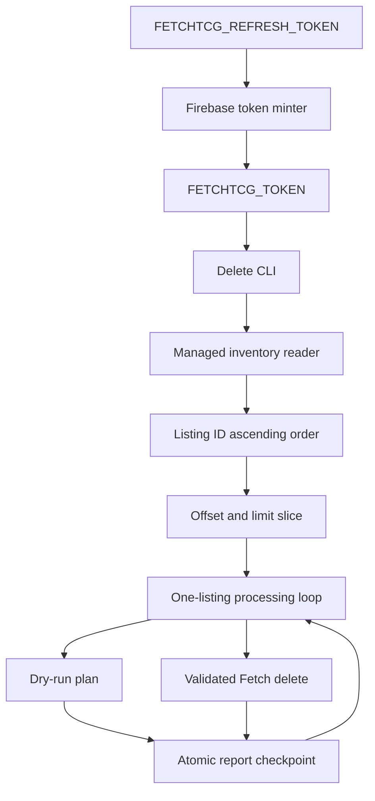
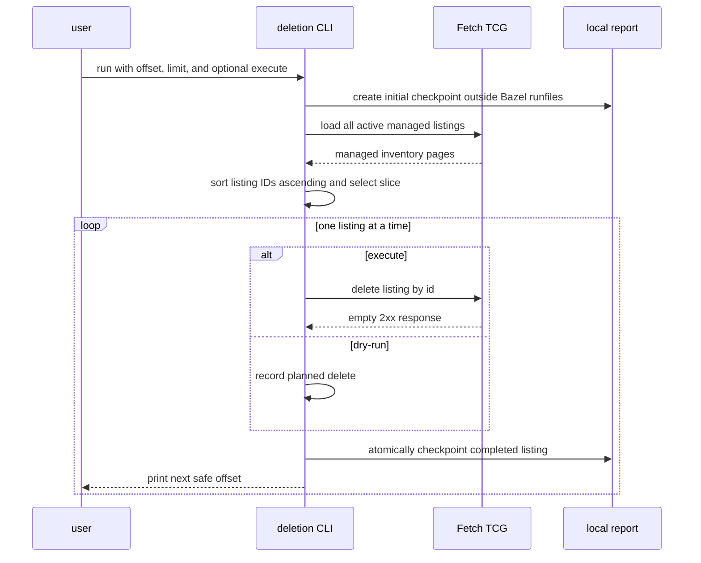

# Delete Fetch TCG listings

This script deletes active Fetch TCG listings owned by the authenticated account while preserving resumable, one-listing-at-a-time execution.

## Overview

- **Service type**: local Python CLI
- **Interface**: Bazel-run command
- **Primary input**: active managed Fetch TCG listings
- **Primary outputs**: checkpointed JSON and CSV reports under the repository `tmp/` directory
- **Mutation mode**: dry-run by default; explicit `--execute` enables deletes

The script is self-contained under `scripts/delete`. It intentionally duplicates the small amount of Fetch client logic it needs so changes to listing, repricing, and deletion spikes remain isolated.

## User stories

- As a seller, I want every active listing identified before any delete, so that I can inspect the full inventory first.
- As a seller, I want dry-run to be the default, so that inspecting my store cannot accidentally remove listings.
- As a seller, I want each listing deleted immediately after it is selected, so that a later token expiry does not lose completed work.
- As a seller resuming a partial run, I want a stable offset reported continuously, so that I can restart from the first incomplete listing.
- As a seller processing a large portfolio, I want offset and limit controls, so that I can run predictable batches within the Fetch token lifetime.

## Features and scope boundaries

### In scope

- Load every active Magic: The Gathering listing managed by the authenticated Fetch account.
- Sort managed listings by numeric listing ID ascending before applying offset and limit.
- Report listing identity, name, set, finish, condition, quantity, and NZD price from the managed-listing payload.
- Process and checkpoint one listing completely before moving to the next.
- Print mutation status for every listing and color the status when stdout is interactive.
- Report the next safe offset after every completed listing and on controlled termination.

### Out of scope

- Creating or updating listings.
- Changing listing condition, quantity, or price.
- Deleting listings for games other than Magic: The Gathering or markets other than New Zealand.
- Refreshing or obtaining Fetch credentials inside the deletion process.
- Resuming by report file or processed-ID set.
- Sharing code at runtime with the sibling list, pricing, or repricing spikes.

## Architecture



### Primary workflow



## Main technical decisions

- Fetch the complete managed inventory before processing. Offset and limit select a stable slice from that snapshot.
- Keep Firebase refresh-token exchange outside the deletion client. The shared minter produces one short-lived `FETCHTCG_TOKEN` before a run, preserving the client's existing endpoint allowlist and fail-closed authorization behavior.
- Sort locally by listing ID ascending instead of relying on Fetch's `listed_at,DESC` response order. Newly created listings normally append after existing IDs.
- Apply offset and limit only after stable sorting. Offset is a zero-based count of listings skipped.
- Keep the selected inventory slice immutable for the run. Deletes cannot reorder the remaining work list.
- Perform optional mutation and checkpointing inline for one listing before beginning the next.
- Use an empty 2xx response as the per-listing write verification. Fetch returns no JSON body for a successful delete.
- Parse card identity from the managed-listing payload instead of issuing per-listing card-detail reads.
- Print each listing's identity and mutation status. Color only the status label so the identity remains easy to read.
- Use yellow for `PLANNED`, green for `SUCCEEDED`, and red for `FAILED`. Disable ANSI color when stdout is not an interactive terminal.
- Atomically replace report files after each completed listing. A prior valid checkpoint remains available if the process is killed while writing.
- Print the safe offset after each completed listing as well as from the controlled-shutdown path.

## Domain glossary

- **Managed listing**: one active listing owned by the authenticated Fetch account.
- **Stable inventory position**: one-based display position after sorting managed listings by listing ID ascending.
- **Offset**: zero-based number of stable managed listings skipped before processing.
- **Next offset**: the offset of the first listing not yet completed; this is the restart value.
- **Completed listing**: a listing whose planned or executed delete finished.
- **Controlled termination**: a normal failure path, HTTP authentication stop, request-budget stop, exception, `SIGINT`, or `SIGTERM` for which Python can execute cleanup.

## Integration contracts

### External systems

- **Fetch TCG website API**: sequential HTTPS JSON requests to `https://api.fetchtcg.com`.
- **Managed inventory authentication**: `Authorization: Bearer <FETCHTCG_TOKEN>` is attached only to authenticated managed-listing reads and deletes.
- **Firebase token service**: the separate token minter can exchange `FETCHTCG_REFRESH_TOKEN` at Firebase's fixed HTTPS token endpoint before deletion starts. The refresh credential is never passed to Fetch.
- **Traffic policy**: request starts are spaced by a random one-to-two-second interval. Transient network errors and server errors retry with bounded backoff.

Fetch TCG does not publish these endpoints as a supported third-party API, and its current terms prohibit automated access without permission. Conservative request pacing reduces load but does not remove that policy risk.

## API contracts

### CLI

```text
bazel run //tcg_lister_api:fetchtcg-delete-listings -- \
  [--offset N] [--limit N] [--execute] [--verbose]
```

- `--offset N`: skip `N` listings after numeric listing-ID sorting. Default `0`; must be non-negative.
- `--limit N`: process at most `N` listings. When omitted, process through the end of the stable inventory.
- `--execute`: enable Fetch deletes. Without it, selected listings are reported as `PLANNED`.
- `--verbose`: print request diagnostics without credentials.

`FETCHTCG_TOKEN` must contain the raw token without a `Bearer ` prefix.
`FETCHTCG_REFRESH_TOKEN` is consumed only by the standalone token minter.

Each console listing line contains listing ID, name, condition, quantity, NZD price, and mutation status. ANSI color is applied only to the status when stdout is interactive; redirected output and report files remain uncolored.

### Consumed Fetch endpoints

- `GET /v1/manage-listings`: authenticated pagination of active MTG/NZD managed listings, requested in `listed_at,DESC` order and then re-sorted locally.
- `DELETE /v1/manage-listings/{listingId}`: authenticated delete of one managed listing. The request has no body or query string. A successful response is any 2xx with an empty body.

Managed-listing pagination must return stable `totalPages` values and no duplicate listing IDs. A delete path is allowed only when it matches `/v1/manage-listings/` followed by a positive integer listing ID.

### Output

Every run creates:

```text
tmp/tcg-lister/delete-<utc-timestamp>/
  report.json
  listings.csv
```

When invoked through Bazel, the base directory is `BUILD_WORKSPACE_DIRECTORY`. Outside Bazel it is the current working directory. Output paths are never derived from `__file__` or a Bazel runfiles path.

`report.json` contains:

- schema version and UTC generation/update timestamps
- execution mode
- requested offset and limit
- managed, selected, and completed listing counts
- next offset
- request count
- completion state and error
- ordered per-listing records

Each listing record contains:

- stable position and listing ID
- card identity, name, set, finish, and condition
- remaining quantity and listed NZD price
- mutation status and error

`listings.csv` contains the same per-listing values.

Files are checkpointed using a temporary file in the same directory followed by atomic replacement.

## Data and storage contracts

- Fetch managed inventory is the source of truth for owned listing identity, condition, quantity, and current price.
- Mutation decisions, stable positions, and next offsets are deterministic derived values owned by this tool.
- Reports are disposable local checkpoints under the git-ignored repository `tmp/` directory.
- No seller profile name is written to reports.

## Behavioral invariants and termination semantics

- Managed listings are sorted by numeric listing ID ascending before offset and limit are applied.
- Exactly one selected listing is planned or deleted before the next begins.
- Dry-run sends no DELETE request.
- Execute mode sends at most one DELETE request per selected listing.
- `next_offset` starts at the requested offset.
- `next_offset` advances by one only after the current listing completes.
- A failure during the current listing leaves `next_offset` unchanged so that listing is retried.
- The safe next offset is printed after each completed listing and again on controlled termination.
- Interactive console labels use the fixed `PLANNED`, `SUCCEEDED`, and `FAILED` color policy; reports never contain ANSI escapes.
- `SIGINT` and `SIGTERM` are converted into controlled termination and checkpoint the current state.
- `SIGKILL`, interpreter failure, and power loss cannot execute cleanup. The last atomic checkpoint and previously printed offset remain the latest safe restart point.
- A limited batch that completes successfully prints a continuation command when more stable inventory remains.
- A 401 or 403 is never retried and stops before the next listing.
- No credential, authorization header, or seller profile name is logged or persisted.

## Source of truth

- **Managed inventory**: Fetch `GET /v1/manage-listings`
- **Stable ordering**: numeric managed listing ID ascending
- **Mutation result**: empty 2xx Fetch delete response
- **Restart position**: checkpointed `next_offset`

## Security and privacy

- The bearer token is read only from `FETCHTCG_TOKEN`.
- The long-lived refresh credential is read only by the standalone minter from `FETCHTCG_REFRESH_TOKEN` and sent only to Firebase's fixed HTTPS token endpoint.
- The token is attached only to the two authenticated managed-listing endpoints.
- Exceptions and diagnostics redact authorization material.
- The minter disables redirects, ambient proxy/auth configuration, and cookies, and refuses to print a token directly to an interactive terminal.
- Reports include owned listing IDs, names, and prices but exclude token values and seller names.
- Output remains on the local machine under the repository workspace.

## Configuration and secrets

| Setting         | Source                   | Default       | Purpose                           |
| --------------- | ------------------------ | ------------- | --------------------------------- |
| Fetch token     | `FETCHTCG_TOKEN`         | none          | managed-listing reads and deletes |
| Refresh token   | `FETCHTCG_REFRESH_TOKEN` | none          | mint a one-hour Fetch token       |
| Offset          | `--offset`               | `0`           | stable listings skipped           |
| Limit           | `--limit`                | all remaining | maximum selected listings         |
| Execute mode    | `--execute`              | disabled      | enable listing deletes            |
| Verbose logging | `--verbose`              | disabled      | request diagnostics               |

Traffic pacing, retries, request budgets, country, currency, and game are fixed implementation constants.

## Performance envelope

- Managed inventory is fetched once, regardless of offset or limit.
- Dry-run sends no delete requests.
- An execute-mode delete adds one request per selected listing.
- Requests are sequential with one-to-two-second spacing.
- The request budget is 5,000 attempts per run.
- Limit should be used when a selected batch may exceed the approximately one-hour Fetch token lifetime.
- Local report checkpointing occurs after every completed listing and is negligible compared with network pacing.

## Testing and quality gates

- Unit tests use fake sessions and injected clocks; they never call Fetch.
- Client tests cover pagination, active filtering, empty-body deletes, Bearer isolation, disallowed paths, 401 stops, request spacing, and the request budget.
- Runner tests cover stable sorting, offset and limit, dry-run planning, one-listing-at-a-time deletes, exact next-offset behavior, `SIGINT`, and `SIGTERM`.
- Report tests cover atomic checkpoints, JSON/CSV consistency, token exclusion, and workspace-relative output outside Bazel runfiles.
- Required checks:
  - `bazel test //tcg_lister_api:delete-listings-unit-tests`
  - `bazel test //tcg_lister_api:all`
  - `bazel mod tidy`
  - `bazel run //:format`

## Local development

Dry-run a batch:

```bash
token="$(bazel run //tcg_lister_api:fetchtcg-mint-token)" &&
FETCHTCG_TOKEN="$token" bazel run //tcg_lister_api:fetchtcg-delete-listings -- \
  --offset 0 \
  --limit 25 \
  --verbose
unset token
```

Execute a batch:

```bash
token="$(bazel run //tcg_lister_api:fetchtcg-mint-token)" &&
FETCHTCG_TOKEN="$token" bazel run //tcg_lister_api:fetchtcg-delete-listings -- \
  --offset 0 \
  --limit 25 \
  --execute \
  --verbose
unset token
```

If the run reports `next offset: 17`, mint a new `FETCHTCG_TOKEN` and rerun with `--offset 17`. Set the refresh credential through a hidden prompt or local secret manager rather than a command, shell history, profile, or repository file. Delete HAR files containing credentials when they are no longer needed; if one has been shared, change the Fetch password to revoke existing Firebase refresh sessions.

## End-to-end scenarios

### Scenario 1: dry-run proposes every selected listing

1. Stable listings `#10` and `#20` are active NZD MTG listings.
2. Dry-run records both as `PLANNED` without DELETE requests.
3. Checkpoints show both listing identities and `execution_mode: dry_run`.

### Scenario 2: execute deletes inline

1. Listing `#10` is selected first after listing-ID sort.
2. The tool deletes listing `#10` and validates an empty 2xx response.
3. The checkpoint advances the next offset.
4. Only then does deletion begin for listing `#20`.

### Scenario 3: token expires during a listing

1. Ten listings complete and advance the next offset from `0` to `10`.
2. Fetch returns 401 while listing at offset `10` is being deleted.
3. The listing is recorded as failed and remains incomplete.
4. The partial report and console state `next offset: 10`.
5. The refreshed run starts with `--offset 10`.

### Scenario 4: limited batch completes

1. A run starts at offset `100` with limit `50`.
2. All 50 selected listings complete.
3. The report records next offset `150`.
4. If more inventory remains, the CLI prints a continuation command using `--offset 150`.
