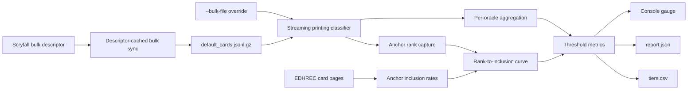
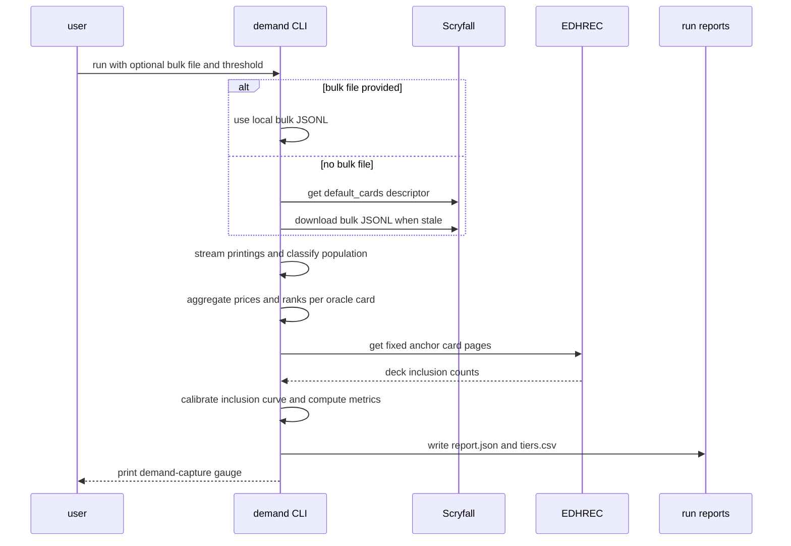

# EDH demand proxy analysis

The EDH demand proxy analysis script measures how well the fixed US$0.25
TCGplayer keep filter tracks Commander (EDH) demand across the commander-legal
paper Magic: The Gathering card universe.

## Overview

- **Service type**: local command-line tool (`tcg_lister_api/scripts/demand`)
- **Interface**: Bazel-run Python CLI
- **Runtime**: Python 3.11
- **Primary integrations**: Scryfall bulk data, EDHREC card pages
- **Primary input**: Scryfall `default_cards` bulk JSONL (per-printing TCGplayer
  USD prices and EDHREC ranks)
- **Primary output**: classifier-quality metrics for the price-based keep
  filter against EDH demand
- **Deployed API**: none

The script is read-only and analytical. It does not read or mutate Fetch TCG
state and it does not decide what to list; it gauges the existing scan-time
keep heuristic.

## User stories

- As a card seller who bins scanned cards below US$0.25 TCGplayer market, I
  want to know how much EDH demand that filter throws away, so that I can
  judge whether the proxy is good enough.
- As a card seller, I want to see which highly played staples are entirely
  binned by the price filter, so that I can rescue specific cards from bulk.
- As a card seller, I want to see how much of what the filter keeps has
  effectively no EDH demand, so that I understand the junk it lets through.
- As a card seller, I want the same metrics at alternative price thresholds,
  so that I can compare cutoffs before changing my workflow.
- As a cautious integrator, I want bulk data cached and third-party requests
  bounded, so that repeat analysis does not create excessive traffic.

## Features and scope boundaries

### In scope

- Download and cache Scryfall's `default_cards` bulk JSONL with descriptor
  freshness checks, or reuse an explicit local bulk file.
- Stream bulk printings and select the commander-legal paper population.
- Select one USD price per printing, preferring non-foil TCGplayer prices.
- Derive per-oracle demand from EDHREC ranks embedded in bulk data.
- Calibrate an EDHREC rank-to-inclusion-rate curve from fixed anchor cards.
- Compute pass rates by demand tier, in-demand recall, low-demand keep share,
  a Spearman price-demand correlation, and inclusion-weighted demand capture.
- Repeat headline metrics across a fixed threshold sweep.
- List the most played oracle cards entirely binned by the filter and the
  most expensive kept printings with negligible demand.
- Write versioned JSON and CSV reports and print a concise console gauge.

### Out of scope

- Deciding or changing listing eligibility in the list, pricing, or reprice
  scripts.
- Reading Fetch TCG data or any authenticated resource.
- Demand measures beyond EDHREC Commander data (for example Modern or
  Standard play rates).
- Weighting the population by what a specific bulk collection actually
  contains (for example a ManaBox export); the gauge covers the whole
  commander-legal paper universe.
- Foil-specific pricing strategy; foil prices participate only as fallbacks
  for foil-only printings.
- Persisting analysis results between runs beyond the report directory.

## Architecture



### Primary workflow



## Main technical decisions

- Keep this script self-contained under `scripts/demand`. Bulk-sync behavior
  is intentionally duplicated from the scan spike so the demand gauge can
  evolve independently.
- Evaluate the whole commander-legal paper universe instead of the current
  inventory. The keep filter operates at scan time on arbitrary bulk cards,
  so the gauge must not inherit survivorship bias from cards already listed.
- Use Scryfall `default_cards` (one record per printing) rather than
  `oracle_cards`. The filter is applied to a physical printing, and cheap
  printings of staples are exactly the cases a price proxy can misjudge.
- Reuse Scryfall's TCGplayer-sourced `prices.usd` as the filter input. This
  matches the ManaBox scan-time price the current workflow filters on.
- Prefer `prices.usd`, then `prices.usd_foil`, then `prices.usd_etched`.
  Foil-only printings would otherwise drop out of the population.
- Read `edhrec_rank` from bulk data as the demand signal and convert ranks to
  unconditional deck-inclusion rates through a log-log interpolated curve
  calibrated from fixed EDHREC anchor cards fetched at run time.
- Compute anchor ranks from the same bulk snapshot so curve x-values and
  card x-values share one rank scale.
- Treat unranked oracle cards as zero EDH demand rather than guessing a tail
  value; they are reported separately.
- Weight demand capture by the passing share of each oracle card's priced
  printings. This estimates the survival probability of a random copy of the
  card under the filter.
- Use Spearman correlation (average ranks for ties) between printing price
  and demand because both distributions are heavy-tailed and monotonic
  alignment is the question, not linearity.
- Keep tiers, anchors, sweep thresholds, and demand cutoffs fixed constants
  so runs stay comparable; only the headline threshold is a CLI argument.
- Fail the run loudly on malformed bulk records, missing anchors, or
  malformed EDHREC responses instead of degrading silently.

## Domain glossary

- **Printing**: one Scryfall card record in `default_cards` (a specific set,
  collector number, and finish availability).
- **Oracle card**: the rules-level card identified by `oracle_id`; all
  printings of one oracle card share EDH demand.
- **Population printing**: an English, paper, commander-legal, non-basic,
  normally shaped printing (fixed layout and set-type exclusions).
- **Priced printing**: a population printing with a selected USD price.
- **Selected price**: `prices.usd`, else `prices.usd_foil`, else
  `prices.usd_etched`.
- **Keep threshold**: the USD price at or above which a printing passes the
  filter; the headline default is US$0.25.
- **Demand rank**: the oracle card's EDHREC rank; lower means more played.
- **Demand tier**: fixed rank buckets `1-100`, `101-1000`, `1001-2000`,
  `2001-5000`, `5001-20000`, `20001+`, and `unranked`.
- **In-demand**: demand rank at or below 2,000.
- **Low-demand**: demand rank above 20,000, or unranked.
- **Anchor card**: one of sixteen fixed cards whose EDHREC page calibrates
  the rank-to-inclusion curve.
- **Unconditional inclusion**: an anchor's `num_decks` divided by the
  maximum `potential_decks` across anchors (total tracked decks).
- **Demand mass**: the sum of unconditional inclusion rates across ranked
  oracle cards with at least one priced printing.
- **Demand capture**: the share of demand mass that survives the filter,
  weighting each oracle card by its passing share of priced printings.
- **Fully binned staple**: an in-demand oracle card none of whose priced
  printings passes the threshold.

## Integration contracts

### External systems

- **Scryfall bulk data API**: `GET https://api.scryfall.com/bulk-data/default_cards`
  returns the bulk descriptor; its `jsonl_download_uri` is downloaded when the
  cached copy is stale by `updated_at`. Requests carry a project user agent
  and JSON accept headers. Bulk downloads stream to a temporary file and
  replace atomically.
- **EDHREC JSON pages**: `GET https://json.edhrec.com/pages/cards/{slug}.json`
  for the sixteen fixed anchors, spaced by a fixed request interval. Each
  response must contain positive `num_decks` and `potential_decks` under
  `container.json_dict.card`.

Scryfall publishes bulk data for exactly this kind of offline analysis.
EDHREC page fetches are bounded to sixteen per run.

## API contracts

The script exposes no HTTP endpoints.

### CLI contract

```shell
bazel run //tcg_lister_api:demand-proxy-analyze -- \
  [--bulk-file PATH] \
  [--threshold-usd 0.25] \
  [--limit N] \
  [--verbose]
```

- `--bulk-file PATH` uses an existing Scryfall `default_cards` JSONL file
  (`.jsonl` or `.jsonl.gz`), for example the scan spike cache at
  `tmp/tcg-scan/scryfall/metadata/default_cards.jsonl.gz`. Relative paths
  resolve against the Bazel workspace root. Without the flag, the script
  syncs its own descriptor-cached copy under `tmp/tcg-lister/demand-scryfall/`.
- `--threshold-usd` sets the headline keep threshold. It must be a positive
  decimal and defaults to `0.25`.
- `--limit N` stops after classifying the first `N` bulk records. It exists
  for smoke checks; reports from limited runs are partial.
- `--verbose` prints request and streaming diagnostics.
- A successful complete run exits `0`. Invalid arguments, unreadable bulk
  data, a missing anchor, or a failed anchor fetch exit non-zero.

### Consumed endpoints

- `GET https://api.scryfall.com/bulk-data/default_cards`
- `GET <jsonl_download_uri>` from the descriptor
- `GET https://json.edhrec.com/pages/cards/{slug}.json` for each anchor

### Output contract

Each run writes to `<workspace>/tmp/tcg-lister/demand-<utc-timestamp>/`.
Bazel runs resolve `<workspace>` from `BUILD_WORKSPACE_DIRECTORY`; direct
Python runs use the current working directory:

- `report.json`: run metadata, population counts, correlation, tier table,
  precision shares, demand capture, threshold sweep, fully binned staples,
  and expensive low-demand printings.
- `tiers.csv`: the per-tier table in spreadsheet-friendly form.

Monetary values serialize as two-decimal strings and shares as four-decimal
strings. The report uses schema version `1`.

Population counts include every exclusion reason: `non_english`, `digital`,
`non_paper`, `layout`, `set_type`, `oversized`, `not_commander_legal`,
`basic_land`, `missing_oracle_id`, and `invalid_price`, plus the count of
unpriced population printings.

### Fixed analysis policy

- Demand tiers: `1-100`, `101-1000`, `1001-2000`, `2001-5000`, `5001-20000`,
  `20001+`, `unranked`.
- In-demand cutoff: rank at or below `2000`. Low-demand: rank above `20000`
  or unranked.
- Threshold sweep: `0.10`, `0.25`, `0.50`, `1.00`, plus the headline
  threshold when it differs.
- Anchors: Sol Ring, Arcane Signet, Command Tower, Swords to Plowshares,
  Counterspell, Cultivate, Rhystic Study, Swiftfoot Boots, Blasphemous Act,
  Beast Within, Chaos Warp, Murder, Divination, Cancel, Mind Rot, Lava Axe.
- A printing passes a threshold when its selected price is greater than or
  equal to the threshold.
- The Spearman correlation is reported as price versus demand, so positive
  values mean higher prices align with more played cards.
- Fully binned staples and expensive low-demand printings list at most 20
  entries each.

## Data and storage contracts

- Scryfall bulk data remains the source for printing identity, prices, EDHREC
  ranks, legality, and population attributes.
- EDHREC pages remain the source for anchor deck-inclusion counts.
- Tier tables, curves, correlations, capture shares, and lists are
  deterministic derived values owned by this script.
- The bulk cache under `tmp/tcg-lister/demand-scryfall/` contains the bulk
  JSONL and its descriptor and is reused across runs while fresh.
- Reports are disposable local artifacts under the git-ignored `tmp/`
  directory.

## Behavioral invariants and time semantics

- Every bulk record is classified exactly once into the population or one
  exclusion reason, in the documented check order.
- Population membership requires English language, the `paper` game, a
  non-excluded layout and set type, non-oversized shape, Commander legality,
  and a non-basic type line.
- An oracle identity comes from the top-level `oracle_id`, else the first
  card face; records without either are excluded.
- The demand rank of an oracle card is the minimum `edhrec_rank` observed
  across its population printings.
- Anchor ranks come from the same bulk stream; a missing anchor aborts the
  run before metrics are computed.
- Total tracked decks is the maximum `potential_decks` across anchors, and
  anchor inclusion is `num_decks / total`.
- The inclusion curve interpolates log-log between anchor points, clamps to
  the first anchor's inclusion below its rank, extends the last segment's
  slope beyond the deepest anchor, and never returns below `1e-6` for ranked
  cards.
- Unranked oracle cards contribute zero demand mass and are excluded from
  capture denominators.
- Demand capture weights each ranked oracle card by passing priced printings
  divided by priced printings; oracle cards with no priced printing are
  excluded from capture and counted separately.
- A selected price exactly equal to a threshold passes that threshold.
- Reports round money to cents and shares to four decimals; run directory
  timestamps use UTC.

## Source of truth

- **Printing population and prices**: Scryfall `default_cards` bulk JSONL.
- **Demand ranks**: `edhrec_rank` in the same bulk snapshot.
- **Anchor inclusion counts**: EDHREC card pages at run time.
- **Analysis policy**: the fixed rules in this README and `analyze.py`.
- **Traffic behavior**: fixed constants in `analyze.py` covered by unit
  tests.

## Security and privacy

- No credential is read, sent, or stored; both integrations are public.
- Requests carry a project-identifying user agent.
- All external requests use HTTPS.
- Reports contain only public card data and derived metrics.

## Configuration and secrets reference

### Fixed configuration

- Bulk type: `default_cards`
- Bulk cache directory: `tmp/tcg-lister/demand-scryfall/`
- EDHREC request interval: `0.2` seconds
- Connect timeout: `5` seconds; read timeout: `30` seconds (bulk download
  `300` seconds)
- Demand tiers, cutoffs, sweep thresholds, anchors, and list caps as
  documented above

### Environment variables

- `BUILD_WORKSPACE_DIRECTORY`: set by `bazel run`; anchors cache, report, and
  relative `--bulk-file` resolution to the workspace root.

## Performance envelope

- The bulk descriptor request is constant; the bulk download happens only
  when the cached copy is stale and streams roughly a few hundred megabytes.
- Bulk parsing streams line by line; memory is bounded by per-oracle
  aggregation (tens of thousands of small entries), not file size.
- Roughly one hundred thousand printings classify in well under a minute on
  a development machine.
- EDHREC traffic is fixed at sixteen paced requests per run.

## Testing and quality gates

- Unit tests cover streaming JSONL iteration, gzip and plain input, malformed
  lines, every exclusion reason, price selection and fallbacks, threshold
  boundaries, tier boundaries, oracle aggregation, anchor rank capture,
  Spearman correlation with ties, curve interpolation and clamping, demand
  capture weighting, list ordering and caps, report serialization, bulk
  descriptor caching, anchor fetch parsing and failures, and CLI validation.
- HTTP tests use fake sessions and injected sleep functions; tests never call
  Scryfall or EDHREC.
- Required checks:

```shell
bazel test //tcg_lister_api:all
bazel mod tidy
bazel run //:format
```

## Local development and smoke checks

Smoke-check the pipeline against a small slice of an existing bulk file:

```shell
bazel run //tcg_lister_api:demand-proxy-analyze -- \
  --bulk-file tmp/tcg-scan/scryfall/metadata/default_cards.jsonl.gz \
  --limit 2000 \
  --verbose
```

A limited run still fetches anchors and can abort if an anchor lies outside
the parsed slice; use limits only to validate plumbing, then run without
`--limit` for real metrics.

## End-to-end scenarios

### Scenario 1: cheap staple is reported as binned

1. An oracle card has EDHREC rank 350 and printings priced US$0.12 and
   US$0.18.
2. No priced printing reaches US$0.25, so the card is a fully binned staple.
3. It appears in the binned-staples list with its rank and best price.
4. Its inclusion rate counts fully against demand capture.

### Scenario 2: expensive junk is reported as kept

1. A printing costs US$4.00 and its oracle card has rank 32,000.
2. The printing passes the threshold and is low-demand.
3. It appears in the expensive low-demand list and in the low-demand keep
   share.

### Scenario 3: split printings weight capture fractionally

1. An oracle card with rank 900 has printings priced US$0.15 and US$0.40.
2. One of two priced printings passes, so its capture weight is one half.
3. Half of its inclusion rate counts as captured demand mass.

### Scenario 4: unranked cards stay out of demand mass

1. A commander-legal printing has a price but no EDHREC rank.
2. It appears in population counts and the `unranked` tier row.
3. It contributes nothing to demand mass or capture in either direction.

### Scenario 5: threshold sweep contrasts cutoffs

1. The headline threshold is US$0.25.
2. The sweep also reports US$0.10, US$0.50, and US$1.00.
3. Each sweep row reports pass rate, in-demand recall, low-demand keep
   share, and demand capture, so cutoffs can be compared directly.

## Reference results

Full-universe run on 9 August 2026 against the Scryfall `default_cards`
snapshot of 2 August 2026 (116,490 bulk records; 88,993 population printings;
87,860 priced printings across 31,621 oracle cards; report
`tmp/tcg-lister/demand-20260809T102607Z`). Rerun the CLI to refresh these
numbers after meaningful market or metagame shifts.

### Headline gauge at US$0.25

- Demand capture: `91.3%` of EDH demand mass passes the filter; `8.7%` is
  binned.
- In-demand recall: `94.9%` of top-2000 staple printings pass.
- Fully binned staples: `2` of the top 2,000 — Refute (rank 1927, up to
  US$0.24) and Witness Protection (rank 1950, up to US$0.22), both sitting
  just under the threshold.
- Low-demand share of kept printings: `10.3%`, dominated by Reserved List
  and Old School collectibles (for example Juzám Djinn at US$1,827) whose
  value is real but not EDH-driven; keeping them is correct commercially.
- Price-demand alignment: Spearman `+0.58` across 87,752 priced ranked
  printings.

### Pass rate by demand tier

| Tier       | Oracle cards | Priced printings | Printings passing | Cheapest printing passing |
| ---------- | ------------ | ---------------- | ----------------- | ------------------------- |
| 1-100      | 95           | 2,662            | 95.9%             | 86.3%                     |
| 101-1000   | 897          | 8,880            | 96.5%             | 89.9%                     |
| 1001-2000  | 997          | 6,220            | 92.1%             | 88.4%                     |
| 2001-5000  | 2,999        | 12,616           | 91.6%             | 85.7%                     |
| 5001-20000 | 14,994       | 37,960           | 69.6%             | 53.6%                     |
| 20001+     | 11,573       | 19,414           | 32.2%             | 22.3%                     |
| unranked   | 66           | 108              | 66.7%             | 39.0%                     |

The filter degrades monotonically with demand: it keeps staples and bins the
deep tail, which is exactly the intended shape.

### Threshold and hybrid-rule sweep

| Keep rule                 | Keep rate | Demand capture |
| ------------------------- | --------- | -------------- |
| price ≥ US$0.10           | 93.6%     | 99.3%          |
| price ≥ US$0.25 (current) | 69.6%     | 91.3%          |
| US$0.25 or rank ≤ 2000    | 70.6%     | 92.8%          |
| US$0.25 or rank ≤ 5000    | 71.8%     | 93.9%          |
| US$0.25 or rank ≤ 10000   | 74.7%     | 95.9%          |
| price ≥ US$0.50           | 43.5%     | 70.1%          |
| price ≥ US$1.00           | 34.5%     | 61.7%          |

US$0.25 sits at the knee of the tradeoff: US$0.10 keeps 24 points more
volume for 8 points more demand, and US$0.50 loses 21 points of capture.
Augmenting the keep rule with EDHREC rank gains at most a few points of
capture, so rank data is better spent guiding acquisition than gating keeps.

### Caveats

- The gauge weights the whole commander-legal paper universe equally; it is
  not weighted by what a particular bulk collection actually contains.
- Demand capture counts partial losses when only a card's cheapest printings
  fall under the threshold, so it reflects the survival odds of a random
  copy, not of the card name.
- EDH demand is the only demand measured; kept low-demand cards may hold
  value in other formats or as collectibles.
