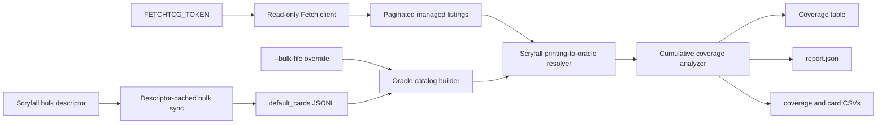
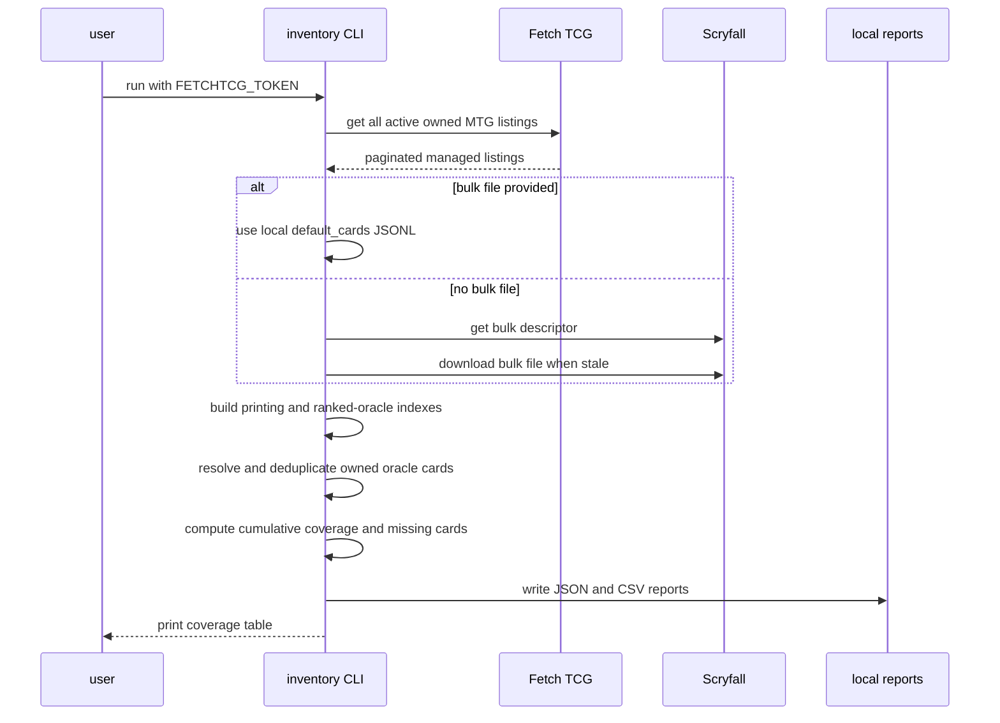

# EDH inventory coverage

The EDH inventory coverage script measures how much of the most-played
Commander card universe is represented by active Fetch TCG listings.

## Overview

- **Service type**: local command-line tool (`tcg_lister_api/scripts/inventory`)
- **Interface**: Bazel-run Python CLI
- **Runtime**: Python 3.11
- **Primary integrations**: Fetch TCG managed listings, Scryfall bulk data
- **Primary input**: authenticated active MTG listings and Scryfall
  `default_cards` bulk JSONL
- **Primary output**: cumulative EDHREC-rank coverage and ranked inventory gaps
- **Deployed API**: none

The script is read-only. It measures whether at least one active listing maps
to each ranked oracle card; listing quantity, condition, finish, and price do
not increase binary name coverage.

## User stories

- As a card seller, I want to know what share of the top EDH cards I currently
  list, so that I can judge whether my inventory follows Commander demand.
- As a card seller, I want coverage at several cumulative rank cutoffs, so that
  I can distinguish staple coverage from long-tail coverage.
- As a card seller, I want a ranked list of missing cards, so that I can guide
  acquisition and bulk-sorting decisions.
- As a cautious Fetch user, I want one bounded read of my managed listings, so
  that the analysis does not create unnecessary traffic or mutate listings.

## Features and scope boundaries

### In scope

- Read every active New Zealand MTG listing owned by the authenticated Fetch
  account.
- Download and cache Scryfall `default_cards`, or reuse an explicit local bulk
  file.
- Resolve each Fetch listing's Scryfall printing ID to its oracle identity.
- Deduplicate inventory by oracle identity while preserving canonical names.
- Measure cumulative binary coverage at EDHREC rank cutoffs `100`, `1000`,
  `2000`, `5000`, and `20000`.
- Report active listing, physical-copy, unique-printing, unique-oracle, ranked,
  unranked, out-of-population, and unmatched counts.
- Write versioned JSON and CSV reports and print a concise console table.
- Pace Fetch requests, retry transient failures, and stop on invalid or
  potentially partial responses.

### Out of scope

- Creating, updating, deleting, pausing, or repricing Fetch listings.
- Treating duplicate listings or additional copies as additional coverage.
- Estimating sales velocity, card value, revenue, or demand capture weighted by
  deck inclusion.
- Ranking cards with demand signals other than Scryfall's EDHREC rank.
- Recommending purchases or deciding what inventory should be acquired.
- Persisting Fetch data outside the disposable local report directory.

## Architecture



### Primary workflow



## Main technical decisions

- Keep the script self-contained under `scripts/inventory`, including its
  read-only Fetch client and Scryfall cache behavior, so it can evolve without
  changing listing, pricing, repricing, or demand-proxy workflows.
- Use Fetch managed listings as the owned-inventory source because the endpoint
  returns all active owned listing identities in a small number of paginated
  requests.
- Join on Scryfall printing ID, then deduplicate by Scryfall oracle ID. This
  produces unique card-name coverage without fragile text matching and prevents
  alternate printings, finishes, conditions, or split-card formatting from
  inflating coverage.
- Use the same commander-legal paper population rules and minimum
  per-oracle `edhrec_rank` semantics as the demand proxy analysis.
- Make every bracket cumulative: top 1,000 includes ranks 1 through 1,000,
  rather than only ranks 101 through 1,000.
- Divide by the ranked oracle cards actually present at or below each cutoff.
  Scryfall ranks can contain gaps, so the denominator is reported explicitly
  instead of assuming it equals the numeric cutoff.
- Preserve unmatched printing IDs in the local report and fail on malformed
  bulk or Fetch contracts; never silently count unresolved listings as covered.

## Domain glossary

- **Managed listing**: an active NZD Fetch listing owned by the authenticated
  account.
- **Printing**: a specific Scryfall card record identified by Scryfall ID.
- **Oracle card**: the rules-level card identity shared by all printings.
- **Ranked universe**: English, commander-legal, non-basic paper oracle cards
  with a valid positive EDHREC rank in the bulk snapshot.
- **Covered card**: a ranked-universe oracle card with at least one active
  managed listing resolving to that oracle ID.
- **Cumulative bracket**: all ranked-universe cards whose EDHREC rank is at or
  below one fixed cutoff.
- **Coverage share**: covered oracle cards divided by ranked-universe oracle
  cards in a cumulative bracket.
- **Unranked inventory card**: a listed oracle card in the eligible population
  without an EDHREC rank.
- **Out-of-population inventory card**: a listed oracle card that resolves in
  Scryfall but is not in the commander-legal non-basic paper universe.
- **Unmatched listing**: a managed listing whose Scryfall printing ID is absent
  from the selected bulk snapshot.

## Integration contracts

### External systems

- **Fetch TCG website API**: authenticated `GET /v1/manage-listings` returns
  active owned listings, paginated at 20 records and filtered to MTG/NZD
  without a set filter. The bearer token is attached only to this path.
  Requests are sequential, redirects are disabled, and transient failures use
  bounded retries.
- **Scryfall bulk data API**:
  `GET https://api.scryfall.com/bulk-data/default_cards` returns the bulk
  descriptor. Its `jsonl_download_uri` is streamed to a local cache when the
  descriptor `updated_at` changes.

Fetch TCG does not publish the consumed endpoint as a supported third-party
API, and its current terms prohibit automated access without permission.
Conservative read behavior does not remove that policy risk.

## API contracts

The script exposes no HTTP endpoints.

### CLI contract

```shell
bazel run //tcg_lister_api:fetchtcg-inventory-coverage -- \
  [--bulk-file PATH] \
  [--verbose]
```

- `FETCHTCG_TOKEN` is required and contains the raw bearer token without a
  `Bearer ` prefix.
- `--bulk-file PATH` uses an existing Scryfall `default_cards` JSONL file
  (`.jsonl` or `.jsonl.gz`). Relative paths resolve against the Bazel workspace
  root.
- Without `--bulk-file`, the descriptor-cached bulk file is stored under
  `tmp/tcg-lister/inventory-scryfall/`.
- `--verbose` prints safe request, cache, and classification diagnostics
  without response bodies or credentials.
- A complete successful run exits `0`. Invalid authentication, malformed or
  partial pagination, an unreadable bulk file, or malformed integration data
  exits non-zero.

### Output contract

Each run writes to
`<workspace>/tmp/tcg-lister/inventory-<utc-timestamp>/`:

- `report.json`: run metadata, inventory counts, cumulative coverage rows,
  unmatched Scryfall IDs, ranked inventory cards, and missing ranked cards.
- `coverage.csv`: one row per cumulative cutoff with denominator, covered count,
  missing count, and four-decimal coverage share.
- `inventory_cards.csv`: each resolved inventory oracle card with rank, name,
  population status, unique printing count, listing count, and physical-copy
  count.
- `missing_cards.csv`: every missing ranked card through rank `20000`, ordered
  by rank then name.

The report uses schema version `1`. Shares serialize as four-decimal strings.
Names and public Scryfall identities are included; Fetch listing IDs, prices,
conditions, credentials, and raw responses are omitted.

### Fixed analysis policy

- Cumulative cutoffs: `100`, `1000`, `2000`, `5000`, `20000`.
- Population: English, paper, non-digital, non-oversized, commander-legal,
  non-basic cards excluding token, emblem, art-series, augment, host, planar,
  scheme, vanguard, and memorabilia records.
- Oracle demand rank: the minimum valid positive `edhrec_rank` observed across
  eligible printings.
- Binary coverage: one or more active listings for an oracle card count once.

## Data and storage contracts

- Fetch managed listings are the source of active owned listing Scryfall IDs
  and remaining physical quantities.
- Scryfall `default_cards` is the source of printing-to-oracle mappings,
  canonical names, Commander legality, population membership, and EDHREC rank.
- Coverage and missing-card rows are deterministic derived values owned by this
  script.
- The Scryfall cache and reports are disposable local artifacts under the
  git-ignored `tmp/` directory.
- No Fetch response or credential is persisted.

## Behavioral invariants and time semantics

- Every active listing returned across stable pagination contributes once to
  listing and copy totals.
- Duplicate listing IDs abort the run; duplicate printings and oracle cards are
  expected and deduplicated for coverage.
- A listing resolves through exact case-insensitive Scryfall printing ID.
- Any listed printing of an eligible oracle card covers that oracle card,
  including alternate language, finish, or set printings.
- A ranked oracle card belongs to every cutoff greater than or equal to its
  rank.
- Coverage denominators count actual ranked oracle identities, not cutoff
  labels.
- Missing and inventory-card outputs are ordered by rank, then case-insensitive
  name, then oracle ID; unranked cards sort after ranked cards.
- Bulk descriptor freshness is based on exact `updated_at` equality.
- Run directory timestamps and `generated_at` use UTC.

## Source of truth

- **Active owned inventory**: authenticated Fetch managed listings.
- **Printing and oracle identity**: Scryfall `default_cards`.
- **EDH demand rank**: `edhrec_rank` in the selected Scryfall bulk snapshot.
- **Coverage policy**: fixed rules in this README and `coverage.py`.
- **Traffic controls**: fixed constants in `fetchtcg_client.py`.

## Security and privacy

- `FETCHTCG_TOKEN` is retained only in memory and attached only to the managed
  listings read.
- The token is never accepted as a CLI argument, logged, or written to reports.
- Ambient authorization headers, cookies, and proxy settings are removed from
  the Fetch HTTP session.
- Raw Fetch response bodies and Fetch listing IDs are not persisted.
- Scryfall data and generated card-name coverage contain public card metadata.
- All external requests use HTTPS.

## Configuration and secrets reference

### Fixed configuration

- Fetch game: Magic: The Gathering
- Fetch country and currency: `NZ` and `NZD`
- Fetch page size: `20`; maximum pages: `100`
- Fetch request concurrency: `1`
- Fetch request-start interval: random value from `1` to `2` seconds
- Fetch connect timeout: `5` seconds; read timeout: `30` seconds
- Scryfall bulk download timeout: `10` seconds connect, `300` seconds read
- Maximum retry attempts: `5`
- Cumulative rank cutoffs: `100`, `1000`, `2000`, `5000`, `20000`

### Environment variables

- `FETCHTCG_TOKEN`: required raw Firebase ID token for Fetch.
- `BUILD_WORKSPACE_DIRECTORY`: set by `bazel run`; sets the workspace root for
  the cache, reports, and relative bulk paths.

## Performance envelope

- Fetch traffic is one request per 20 managed listings, bounded at 100 pages.
- The Scryfall descriptor request is constant; the bulk download occurs only
  when the cache is stale and streams to disk.
- Bulk parsing is line-by-line; memory is bounded by printing-to-oracle and
  per-oracle indexes for the current Magic card universe.
- Coverage computation is linear in bulk records plus managed listings.
- A normal run should finish in under a minute when the bulk cache is current.

## Testing and quality gates

- Unit tests cover managed-listing pagination, active filtering, token and
  response validation, request safety controls, bulk parsing and population
  rules, printing-to-oracle resolution, duplicate printings, cumulative
  boundary coverage, unmatched and unranked inventory, report serialization,
  summary formatting, and Scryfall cache behavior.
- HTTP tests use fake sessions and clocks; tests never call Fetch or Scryfall.
- Required checks:

```shell
bazel test //tcg_lister_api:all
bazel mod tidy
bazel run //:format
```

## Local development and smoke checks

Use an existing bulk cache to avoid downloading Scryfall data:

```shell
token="$(bazel run //tcg_lister_api:fetchtcg-mint-token)" &&
FETCHTCG_TOKEN="$token" bazel run //tcg_lister_api:fetchtcg-inventory-coverage -- \
  --bulk-file tmp/tcg-lister/demand-scryfall/default_cards.jsonl.gz \
  --verbose
unset token
```

## End-to-end scenarios

### Scenario 1: duplicate printings cover one card

1. Two active Fetch listings resolve to different printings of Sol Ring.
2. Both printing IDs resolve to the same oracle ID.
3. Sol Ring contributes one covered card to every cutoff containing its rank.
4. Both listings and their quantities remain visible in inventory totals.

### Scenario 2: top-card gap remains actionable

1. A rank-75 oracle card has no active listing.
2. It is missing from top-100 coverage.
3. It also remains missing in every larger cumulative bracket.
4. It appears once in `missing_cards.csv` at rank 75.

### Scenario 3: unranked inventory does not inflate coverage

1. A listed printing resolves to an eligible commander-legal oracle card with
   no EDHREC rank.
2. The card contributes to unique inventory and unranked counts.
3. It contributes to no cumulative coverage numerator or denominator.

### Scenario 4: stale printing identity stays visible

1. A Fetch listing references a Scryfall ID absent from the selected bulk
   snapshot.
2. The listing contributes to listing and copy totals but cannot resolve to an
   oracle card.
3. The run records the unmatched Scryfall ID and does not count it as covered.
