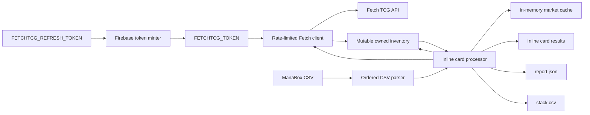
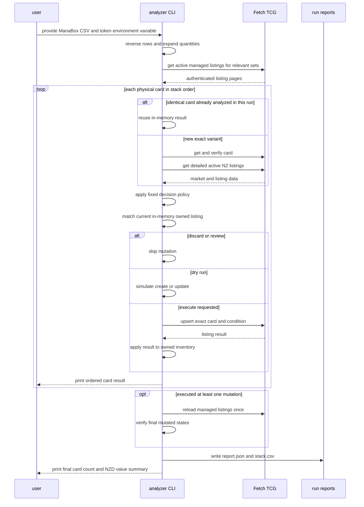

# TCG lister API

The TCG lister service provides a local, dry-run-first bulk workflow that turns a ManaBox scan into ordered Fetch TCG listing decisions and optionally executes exact create-or-update mutations.

## Overview

- **Service type**: local command-line tool (`tcg_lister_api/scripts/list`)
- **Interface**: Bazel-run Python CLI
- **Runtime**: Python 3.11
- **Primary integration**: Fetch TCG's website API
- **Primary input**: ManaBox CSV export
- **Primary output**: one pricing decision and listing-action result per physical card in stack order
- **Deployed API**: none

The current service is intentionally a script rather than an HTTP API. It is non-mutating by default and requires the explicit `--execute` flag before it can create or update Fetch listings.

## User stories

- As a card seller, I want cards analyzed in physical stack order, so that I can work down the stack without losing my place.
- As a card seller, I want to resume after an interrupted stack position, so that I do not repeat already processed cards.
- As a card seller, I want exact printing and finish matches, so that prices from another variant do not influence my decision.
- As a card seller, I want a deterministic list or discard decision, so that I can separate cards for collection indexing or bulk storage.
- As a card seller, I want to know whether each exact card is already listed, so that I can preview whether a future listing operation would create or update.
- As a card seller, I want each card actioned before the next card is analyzed, so that Fetch state follows my physical progress through the stack.
- As a card seller, I want a final count and NZD value summary, so that I can quickly reconcile the processed stack.
- As a card seller, I want execution to require an explicit flag, so that inspecting a scan cannot accidentally mutate my store.
- As a cautious Fetch user, I want requests rate-limited and retried conservatively, so that a bulk scan does not create excessive traffic.

## Features and scope boundaries

### In scope

- Read a Magic: The Gathering ManaBox CSV export.
- Reverse spreadsheet rows into physical top-to-bottom stack order.
- Expand each row's `Quantity` into one ordered record per physical card.
- Skip an explicit number of expanded physical cards before applying an optional run limit.
- Match each card to Fetch by Scryfall ID, Fetch set identity, collector number, and finish.
- Read Fetch's NZD market price and active New Zealand listings across all conditions, while retaining distinct seller counts, physical-copy counts, and translated-condition prices.
- Read the authenticated user's active listings and match exact card, set, finish, and condition variants.
- Exclude authenticated managed-listing IDs from local competition counts and price ladders.
- List every card with a valid Fetch NZD market price of at least NZ$0.25 regardless of competitor count; retain competitor evidence for pricing and reporting.
- Price new listings from a two-independent-seller same-or-better-condition floor when available, otherwise use market price, then round to the nearest NZ$0.25 increment with midpoint ties upward and an NZ$0.75 minimum.
- Apply the fixed NZD decision policy.
- Preview `CREATE`, `UPDATE`, `NONE`, or `REVIEW` without mutating Fetch.
- With `--execute`, create missing exact listings and add scanned quantities to existing exact listings, lowering an existing price only when the proposed reduction is material.
- Process every physical card inline in stack order, with at most one absolute upsert for that card before advancing.
- Print green `LIST`, red `DISCARD`, and yellow `REVIEW` decisions with the ManaBox condition when running in an interactive terminal, and write uncolored JSON and CSV reports.
- Print a blue final summary containing the number of physical cards listed and their combined per-card listing value.
- Reuse identical analysis results only within one process.
- Rate-limit requests and retry transient failures with bounded backoff.

### Out of scope

- Deleting Fetch listings.
- Increasing the price or changing the condition of an existing Fetch listing.
- Repricing an existing listing without adding a scanned physical card.
- Automatically adding cards to a collection.
- Persisting market prices, listing data, or card identifiers between runs.
- Supporting games other than Magic: The Gathering or markets other than New Zealand.
- Guessing matches for non-English, misprinted, altered, or ambiguous cards.
- Circumventing Fetch access controls or treating a browser-shaped user agent as permission to automate.

## Architecture



### Primary workflow



## Main technical decisions

- Use a local Python CLI because the initial workflow is manual and does not need deployed infrastructure.
- Keep dry-run as the default. Construct the bearer header from the explicit raw token and send it only to the managed-listings read and upsert endpoints.
- Keep Firebase refresh-token exchange outside the listing client. The shared minter produces one short-lived `FETCHTCG_TOKEN` before a run, so the client's endpoint allowlist and fail-closed authorization behavior remain unchanged.
- Treat spreadsheet order as reversed physical order, then expand quantities without aggregating output cards.
- Apply offset after reversal and quantity expansion, then apply limit. Retain original full-stack positions so a resumed run after position 6 starts at `[7/<full stack size>]`.
- Use Scryfall ID as the strongest printing identifier and verify set, collector number, and finish as independent safeguards.
- Keep a generated, checked-in one-to-many mapping from Scryfall/ManaBox set codes to Fetch numeric set identifiers. An unmapped set stops the run so the mapping must be updated explicitly. Manual aliases cover Fetch catalogs that split one Scryfall set across products, including `PLST` cards in Fetch's `The List` and `Mystery Booster` sets.
- Translate ManaBox's seven Cardmarket-style conditions into Fetch condition codes: `mint` to `raw-m`, `near_mint` to `raw-nm`, `excellent` to `raw-lp`, `good` to `raw-mp`, `light_played` and `played` to `raw-hp`, and `poor` to `raw-d`.
- Construct the normal Fetch card identifier as a fast path, but fall back to a search restricted to the statically mapped Fetch sets when that identifier does not resolve.
- Always read the detailed listings endpoint for local stock. Count distinct non-owned seller profiles and physical copies across every condition for reporting, while deriving the price ladder from the translated ManaBox condition and every strictly better condition. Each price tier retains normalized seller keys in memory so a supported local floor requires two cumulative independent sellers; three copies from one seller do not establish a pricing floor. Competitor counts do not determine listing eligibility. The indexed `listingsData` summary on a card may be stale and is not used for decisions or validation.
- Prefer the two-seller supported same-or-better-condition floor as the pricing benchmark. When no such floor exists, use Fetch's NZD market price and ignore one-seller local prices for automatic pricing.
- Round the selected benchmark to the nearest NZ$0.25 increment, with exact midpoint ties rounded upward, and enforce an NZ$0.75 minimum. Nearest rounding keeps the target within NZ$0.125 of the benchmark before applying the seller floor instead of systematically pricing above it.
- Treat the authenticated managed-listing IDs as owned inventory, not competition. Exclude those IDs from local listing counts, copy counts, lowest prices, and price ladders before applying the decision policy.
- Use `Decimal` for all threshold checks and price rounding.
- Cache card resolution, market data, and pricing decisions only in memory for the duration of one run. Listing actions are never cached because owned state changes after each physical card.
- Load active managed listings once per run for the relevant static Fetch set identifiers, then maintain a mutable in-memory owned inventory.
- Treat Fetch `cardId` plus condition as the upsert key. Fetch card identity encodes the printing and finish; Scryfall ID, numeric set ID, and finish are verified independently before any write.
- Action cards inline. A create writes quantity `1` at the suggested price. An update writes the current in-memory quantity plus `1`; it lowers the existing price to the suggestion only when the reduction is at least the greater of NZ$0.25 and 5% of the suggestion. Smaller reductions and every increase preserve the existing price.
- Dry-run applies virtual owned-inventory transitions, so repeated copies preview the same create-then-update sequence as execute mode.
- Summarize `PLANNED` records in dry-run mode and verified `SUCCEEDED` records in execute mode. Each qualifying physical card contributes one unit at its mutation price, not the absolute quantity of its aggregated Fetch listing.
- Make requests sequentially with a randomly selected request-start interval from one to two seconds. Concurrency is not appropriate for this personal-volume integration.
- Keep operational settings fixed so the normal CLI cannot accidentally weaken traffic controls.

## Domain glossary

- **Physical card**: one individual card represented by one output record.
- **Scan row**: one ManaBox CSV row, which may represent multiple adjacent physical cards through `Quantity`.
- **Stack position**: one-based top-to-bottom physical position after reversing CSV rows and expanding quantities.
- **Exact variant**: a card printing identified by Scryfall ID, Fetch set identity, collector number, and finish, with a specific condition for listing comparisons.
- **Market price**: Fetch's NZD value at `pricingData.NZ.tcgMarketPrice`, which may be available without local stock.
- **Local stock**: active New Zealand Fetch listings for the exact card at the translated Fetch condition or a strictly better condition, excluding listings owned by the authenticated account.
- **All-condition local sellers**: distinct seller profiles with at least one active New Zealand Fetch listing for the exact card in any condition, excluding listings owned by the authenticated account.
- **All-condition local copies**: physical copies across active New Zealand Fetch listings for the exact card in every condition, excluding listings owned by the authenticated account.
- **Price ladder**: non-owned local listing, seller, and remaining-copy counts at the translated ManaBox condition or a strictly better condition, grouped by NZD price; seller identities remain in memory and are not reported.
- **Two-seller supported floor**: the first ascending same-or-better-condition price at which at least two distinct non-owned sellers are available cumulatively.
- **Seller price floor**: the fixed NZ$0.75 minimum suggested listing price.
- **Price increment**: the fixed NZ$0.25 step to which pricing benchmarks are rounded to the nearest increment, with midpoint ties upward.
- **Material reduction**: an existing-price reduction at least equal to the greater of NZ$0.25 and 5% of the suggested price.
- **Managed listing**: one active listing owned by the authenticated Fetch account.
- **Listing action**: a `CREATE`, `UPDATE`, `NONE`, or `REVIEW` intent derived from the pricing decision and exact managed-listing matches.
- **Mutation key**: the Fetch card ID and condition identity shared by sequential mutations of the same exact listing.
- **Simulated listing**: dry-run owned-inventory state produced by an earlier planned create or update; it has no real Fetch listing ID.
- **Upsert**: Fetch's absolute listing write keyed by Fetch card ID and condition, which creates a missing listing or updates the existing exact listing.

## Integration contracts

### External systems

- **Fetch TCG website API**: The CLI sends sequential HTTPS JSON requests to `https://api.fetchtcg.com` using a browser-compatible macOS Chrome user agent. Public card and market requests are unauthenticated. Authenticated managed-listing reads and upserts construct `Authorization: Bearer <token>` from `FETCHTCG_TOKEN`; the credential is never attached to public endpoints. The separate token minter can exchange `FETCHTCG_REFRESH_TOKEN` at Firebase's fixed HTTPS token endpoint before the CLI starts. Transient errors retry with bounded exponential backoff. Authorization failures and repeated rate limits stop the run.
- **Scryfall API**: The mapping generator reads Scryfall's public set catalog and individual public card records to associate canonical set codes with Fetch set identifiers. Normal analysis runs do not call Scryfall.
- **ManaBox CSV export**: The CLI consumes a local export and never sends the file to another service. Required fields are `Name`, `Set code`, `Set name`, `Collector number`, `Foil`, `Rarity`, `Quantity`, `Scryfall ID`, `Misprint`, `Altered`, `Condition`, and `Language`.

ManaBox condition values are translated before market lookup, owned-listing matching, mutation-key construction, and upsert. Reports preserve the original ManaBox condition while Fetch-facing operations use the translated code.

Fetch TCG does not publish these endpoints as a supported third-party API, and its current terms prohibit automated access without permission. Conservative traffic behavior reduces load but does not remove that policy risk.

## API contracts

The current service exposes no HTTP endpoints.

### CLI contract

```shell
bazel run //tcg_lister_api:fetchtcg-bulk-analyze -- \
  "/path/to/manabox-scan.csv" \
  [--offset N] \
  [--limit N] \
  [--verbose] \
  [--execute]
```

- The CSV path is required and positional.
- `--offset N` skips the first `N` physical cards after reversal and quantity expansion. It defaults to `0`, must be non-negative, and must be smaller than the expanded stack size.
- `--limit N` analyzes only the first `N` physical cards remaining after offset.
- Offset cards are not analyzed, reported, or mutated. Selected cards retain their original one-based stack positions and the console denominator remains the full expanded stack size.
- `--verbose` prints request, retry, and in-memory cache diagnostics.
- Without `--execute`, actionable per-card mutations are simulated and reported but no write request is sent.
- `--execute` explicitly enables one sequential listing upsert per actionable physical card.
- A successful complete run exits `0`.
- Missing or malformed `FETCHTCG_TOKEN`, invalid input, or a run-level safety stop exits non-zero.
- Individual card resolution or transient API failures become `REVIEW` records when continuing is safe.
- After reports are written, the CLI prints a blue interactive-terminal summary. Dry-run labels the total as planned; execute mode includes only successfully verified physical cards.

### Consumed backend endpoints

- `GET /v3/cards/{card_id}` returns identity fields and `pricingData.NZ.tcgMarketPrice`. Its indexed `listingsData` summary is ignored.
- `GET /v3/cards` finds card candidates for a card name, set, and finish.
- `GET /v3/cards/{card_id}/listings` is the source of truth for paginated active listings sorted by price and is called for every newly analyzed exact variant. Active listing IDs found in the authenticated managed-listings response are excluded before deriving the distinct all-condition seller count, all-condition physical-copy count, and translated-condition local stock.
- Authenticated `GET /v1/manage-listings` returns the current account's listing pages. Requests filter to Magic, NZD, and all static Fetch set identifiers relevant to the input cards.
- Authenticated `POST /v2/private/manage-listings` creates or updates one listing. Its JSON body contains `cardId`, exact `condition`, absolute `quantity`, `listedPrice`, `listedCurrency: "NZD"`, `matchPriceEnabled: false`, and `details: ""`. Fetch derives the upsert target from `cardId` and condition; no listing ID is sent.

The mapping generator additionally consumes `GET /v3/filters/cards` for Fetch's complete MTG set catalog and Scryfall's `GET /sets` and `GET /cards/{scryfall_id}` endpoints. It spaces Fetch requests by a random interval from one to two seconds.

Every candidate response must match the ManaBox Scryfall ID, collector number, finish, and a numeric Fetch set identifier from the static mapping before it is accepted. The resolver searches each mapped Fetch set until it finds an exact match. Collector numbers are compared case-insensitively with leading zeroes ignored, so values such as `228` and `0228` are equivalent. For `PLST`, Scryfall's source-set prefix is removed before comparison, so `ISD-195` matches Fetch `195` and `M20-14` matches Fetch `14`. Fetch `printVersionCode` represents treatments such as `standard` or `EA` and is not treated as a set code.

ManaBox names for double-faced cards contain both faces separated by `//`, while Fetch indexes only the front-face name. Fallback searches therefore use the portion before `//`; the full printing is still verified by Scryfall ID and the other identity fields.

Managed listings are accepted only when they are active, listed in New Zealand, and provide a valid listing ID, exact Fetch card ID, Scryfall ID, numeric Fetch set ID, finish, condition, positive remaining quantity, and non-negative NZD price. Matching requires the resolved Fetch card ID, Scryfall ID, set ID, finish, and translated Fetch condition to agree.

Mutation responses must return a positive listing ID, the requested exact condition, absolute quantity, NZD currency, and applied price. An update response must retain the expected existing listing ID.

### Output contract

Each run writes to `tmp/tcg-lister/<input-stem>-<utc-timestamp>/`:

- `report.json`: structured run metadata and ordered card records.
- `stack.csv`: the same ordered card records in spreadsheet-friendly form.

Every card record contains:

- `stack_position`
- `source_csv_row`
- `quantity_index`
- `name`
- `set_code`
- `collector_number`
- `finish`
- `condition`
- `scryfall_id`
- `fetch_card_id`
- `decision`
- `decision_reason`
- `market_price_nzd`
- `supported_local_price_nzd`
- `better_condition_lowest_price_nzd`
- `suggested_price_nzd`
- `local_listing_count`
- `local_copy_count`
- `all_condition_local_seller_count`
- `all_condition_local_copy_count`
- `lowest_local_price_nzd`
- `price_ladder`
- `listing_action`
- `listing_action_reason`
- `existing_listing_count`
- `existing_copy_count`
- `existing_listings`
- `fetch_set_id`
- `mutation_key`
- `mutation_status`
- `mutation_listing_id`
- `mutation_quantity`
- `mutation_price_nzd`
- `mutation_error`

`local_listing_count`, `local_copy_count`, `lowest_local_price_nzd`, and `price_ladder` describe non-owned competition in the translated ManaBox condition and every strictly better condition. `supported_local_price_nzd` is the two-seller supported floor or `null`; `better_condition_lowest_price_nzd` remains the cheapest strictly better-condition competitor for audit evidence or `null`. `all_condition_local_seller_count` and `all_condition_local_copy_count` report non-owned competition across every condition but do not determine listing eligibility. Seller names are not written to reports. `price_ladder` is a JSON object keyed by two-decimal NZD price. Each value contains `listing_count`, `seller_count`, and `copy_count`.

`existing_listings` is a JSON array. Each item contains `listing_id`, `remaining_quantity`, `listed_price_nzd`, and `simulated`. A planned create produces `listing_id: null` and `simulated: true`; a planned update retains the real positive listing ID but uses `simulated: true` for its virtual quantity. Unmodified or executed Fetch state uses `simulated: false`. `stack.csv` stores this array as compact JSON.

`mutation_key` is the shared `cardId|condition` identity. `mutation_quantity` is the absolute listing quantity after that physical card's transition, so three repeated new cards report quantities `1`, `2`, and `3`.

`mutation_status` is:

- `PLANNED` for an actionable dry-run card after its transition is simulated.
- `SUCCEEDED` after the card's upsert response and final managed-listing verification agree.
- `SKIPPED` for `NONE` or `REVIEW`.
- `FAILED` for the card mutation or final verification that stopped execution.

Execute-mode console output uses the intermediate `POSTED` status immediately after an accepted upsert; final reports replace it with `SUCCEEDED` or `FAILED` after the single verification refresh.

`report.json` additionally contains `execution_mode` (`dry_run` or `execute`), `execution_complete`, and `execution_error`. Reports contain only cards reached before any fail-fast stop and use schema version `7`.

## Data and storage contracts

### Data ownership expectations

- The input CSV remains the source for stack order, quantity, printing identifiers, finish, and condition.
- Fetch remains the source for its current market value and active local listings.
- The authenticated managed-listings endpoint remains the source for listings owned by the current account.
- Decisions, suggested prices, listing actions, and inline mutation transitions are deterministic derived values owned by this tool.
- Reports are disposable local artifacts under the git-ignored `tmp/` directory.
- The process keeps an in-memory exact-variant analysis cache and writes no persistent cache.

## Behavioral invariants and time semantics

- CSV data rows are reversed before quantities are expanded.
- A row with `Quantity = N` produces exactly `N` consecutive records.
- Output records are never deduplicated, aggregated, or reordered.
- `stack_position` is the original one-based position in the full expanded stack. An offset creates an intentional gap before the first reported position.
- Repeated exact variants may reuse one in-run market snapshot but derive listing actions again from current mutable owned inventory.
- Every ManaBox set code must have at least one entry in the static Fetch set mapping before its first card is analyzed. All mapped Fetch sets are eligible for exact identity resolution and managed-listing reads.
- Every condition must be one of ManaBox's seven exported values, and all Fetch comparisons and mutations use its fixed translated condition code.
- All-condition seller totals deduplicate case-insensitive Fetch seller profile names across every active New Zealand condition. All-condition physical-copy totals include every active New Zealand condition, while local stock and price ladders include the translated ManaBox condition and every strictly better condition. Price-ladder seller keys are retained only in memory and deduplicated cumulatively when deriving the two-seller supported floor. All counts exclude positive listing IDs present in the authenticated managed-listings response.
- Managed listings are loaded before per-card analysis; authentication failure stops the run before card market requests or report generation.
- A `LIST` decision with no exact managed listing previews `CREATE`.
- A `LIST` decision with exactly one exact managed listing previews `UPDATE`.
- A `DISCARD` decision previews `NONE`, while still reporting any exact managed listing.
- A pricing `REVIEW` or multiple exact managed listings previews `REVIEW`.
- Dry-run is the default and sends no POST request.
- `--execute` upserts only per-card `CREATE` and `UPDATE` actions; `NONE` and `REVIEW` records remain `SKIPPED`.
- Every actionable physical card produces one absolute transition before the next card is analyzed.
- A create uses quantity `1` and the suggested price.
- An update uses current in-memory remaining quantity plus `1`. It lowers the existing price to the suggested price only when `existing - suggested >= max(NZ$0.25, suggested * 5%)`; otherwise it preserves the existing price. It never increases a price.
- After every simulated or successful transition, mutable owned inventory becomes the source for the next card's listing action and quantity.
- Mutations execute sequentially and stop before the next card on the first request failure. The partial report includes only reached cards.
- After all successful POST requests, or after a later POST fails, managed listings are reloaded once and each affected identity's final listing ID, quantity, condition, set, finish, Scryfall ID, and price is verified.
- All posted records for one identity become `SUCCEEDED` only when its final expected state verifies; otherwise those records become `FAILED`.
- The final card count is the number of `PLANNED` dry-run records or `SUCCEEDED` execute records. The final value is the sum of one `mutation_price_nzd` per counted physical-card record.
- Market prices below `0.25` NZD are `DISCARD`.
- Market prices of `0.25` NZD or more are `LIST` regardless of competitor listing, seller, or copy counts.
- A `LIST` price uses the two-seller supported same-or-better-condition floor when available and otherwise uses market price. The benchmark is rounded to the nearest NZ$0.25 increment with midpoint ties upward and then raised to the NZ$0.75 seller floor when lower.
- Missing market data, unsupported input, and ambiguous identity produce `REVIEW`.
- Run directory timestamps and report generation timestamps use UTC.

## Source of truth

- **Physical order and quantity**: ManaBox CSV row order and `Quantity`.
- **Printing identity**: ManaBox Scryfall ID, verified against Fetch identity fields.
- **Set translation**: generated `fetch_set_mapping.py`, including deterministic manual aliases for one-to-many catalog splits, reviewed and checked into the repository.
- **Condition translation**: the fixed ManaBox-to-Fetch mapping in this README and the analyzer implementation.
- **Market price**: Fetch `pricingData.NZ.tcgMarketPrice`.
- **Local stock, all-condition sellers, and all-condition copies**: active Fetch listing records for country `NZ`, minus listing IDs owned by the authenticated account.
- **Suggested price benchmark**: the two-seller supported same-or-better-condition floor when present, otherwise Fetch market price.
- **Seller floor and increment**: fixed NZ$0.75 minimum and nearest-NZ$0.25 rounding step with midpoint ties upward in the analyzer.
- **Better-condition evidence**: strictly better-condition active Fetch listings participate in the supported ladder; the lowest remains an explicit report field.
- **Owned listings**: authenticated Fetch `/v1/manage-listings` records.
- **Decision**: the fixed rules in this README and the analyzer implementation.
- **Listing action**: the fixed preview rules in this README and the analyzer implementation.
- **Mutation quantity and price**: the current mutable owned state plus the per-card create/update rules in this README.
- **Execution result**: validated Fetch upsert responses followed by the authenticated managed-listings verification read.
- **Traffic controls**: fixed client constants covered by unit tests.

## Security and privacy

- `FETCHTCG_TOKEN` is required and must contain only the non-empty bearer token, without the `Bearer ` scheme prefix.
- `FETCHTCG_REFRESH_TOKEN` is consumed only by the standalone token minter and is never passed to the listing client or Fetch API.
- The bearer credential is kept in memory only, attached only to `GET /v1/manage-listings` and `POST /v2/private/manage-listings`, never logged, never written to reports, and never accepted from ambient session headers or cookies.
- The token minter sends the refresh credential only to Firebase's fixed HTTPS token endpoint, disables redirects, ambient proxy/auth configuration, and cookies, and refuses to print a token directly to an interactive terminal.
- Public card, market, and listing requests remain unauthenticated.
- The complete HAR is never copied into the repository because it may contain unrelated request data.
- Test fixtures contain only minimal card, price, and listing fields with no real credential or seller PII.
- Reports omit seller names, profile images, locations, and raw API response bodies.
- Logs omit response bodies unless represented by a safe validation error.
- All external requests use HTTPS.
- The user is responsible for obtaining permission for automated Fetch access.

## Configuration and secrets reference

### Fixed configuration

- Country: `NZ`
- Currency: `NZD`
- Request concurrency: `1`
- Request-start interval: random value from `1` to `2` seconds
- Connect timeout: `5` seconds
- Read timeout: `30` seconds
- Maximum attempts per retryable request: `5`
- Maximum requests per run: `1000`
- Maximum card-search pages per mapped Fetch set: `5`
- Maximum managed-listing pages: `25`
- User agent: browser-compatible macOS Chrome shape captured in the reference HAR

### Environment variables

- `FETCHTCG_TOKEN`: required raw one-hour bearer token, supplied to the analyzer process.
- `FETCHTCG_REFRESH_TOKEN`: long-lived Firebase refresh credential consumed only by `//tcg_lister_api:fetchtcg-mint-token`.

### Secrets handling

Neither credential is persisted by the service. Set the refresh credential through a hidden prompt or local secret manager rather than a command, shell history, profile, or repository file. Capture the minted token through command substitution; do not run the minter directly or redirect its output to a file. Delete HAR files containing credentials when they are no longer needed. If a HAR has been shared, change the Fetch password to revoke existing Firebase refresh sessions.

## Performance envelope

- Intended input size is approximately 100 physical cards per run.
- Managed listings are fetched once, filtered to relevant Fetch sets, and paginated at 20 records per request.
- Execute mode sends at most one POST per actionable physical card and performs one final managed-listings verification read.
- Duplicate exact variants make no repeated market or listing requests within a run.
- The randomized one-to-two-second request interval intentionally makes unique-card-heavy runs take several minutes.
- The request budget and pagination bounds prevent accidental unbounded traffic.
- Report generation and CSV processing are local and negligible compared with network time.

## Testing and quality gates

- Unit tests cover CSV validation, reversed row order, quantity expansion, condition translation, one-to-many static set mapping, PLST collector normalization, exact matching, fallback search, card and listing pagination, distinct all-condition seller counts, all-condition physical-copy counts, same-or-better-condition seller-aware price ladders, two-seller supported floors, owned-listing exclusion, bearer isolation, managed-listing validation and matching, inline dry-run simulation, per-card execution, material-only price reductions, mutable inventory, fail-fast partial results, final post-write verification, final count and value summaries, decision boundaries, NZ$0.75 floor and nearest-NZ$0.25 rounding, retry behavior, rate limiting, request budgets, token redaction, and stop conditions.
- HTTP tests use mocked responses and injected time functions; tests never call Fetch.
- Test fixtures contain no seller PII.
- Required checks:

```shell
bazel test //tcg_lister_api:all
bazel mod tidy
bazel run //:format
```

## Local development and smoke checks

Regenerate the static set mapping after Scryfall or Fetch adds or changes sets:

```shell
bazel run //tcg_lister_api:generate-fetch-set-mapping
```

Review the generated mapping before committing it. Unresolved Fetch sets are reported by the generator and remain intentionally unmapped.

Analyze only the first three physical cards:

```shell
token="$(bazel run //tcg_lister_api:fetchtcg-mint-token)" &&
FETCHTCG_TOKEN="$token" bazel run //tcg_lister_api:fetchtcg-bulk-analyze -- \
  "/path/to/manabox-scan.csv" \
  --limit 3 \
  --verbose
unset token
```

Verify that console positions and `stack.csv` match the physical top-to-bottom stack before running the complete file.

Resume after completing position 6 and analyze at most 20 more cards:

```shell
token="$(bazel run //tcg_lister_api:fetchtcg-mint-token)" &&
FETCHTCG_TOKEN="$token" bazel run //tcg_lister_api:fetchtcg-bulk-analyze -- \
  "/path/to/manabox-scan.csv" \
  --offset 6 \
  --limit 20 \
  --verbose
unset token
```

For a 70-card expanded stack, the first console record is `[7/70]`. Use the last successfully handled stack position as the next run's offset.

For a controlled live mutation check, use only the disposable single-card `/Users/jordansimsmith/Downloads/pyramid.csv` input:

```shell
token="$(bazel run //tcg_lister_api:fetchtcg-mint-token)" &&
FETCHTCG_TOKEN="$token" bazel run //tcg_lister_api:fetchtcg-bulk-analyze -- \
  "/Users/jordansimsmith/Downloads/pyramid.csv" \
  --verbose
FETCHTCG_TOKEN="$token" bazel run //tcg_lister_api:fetchtcg-bulk-analyze -- \
  "/Users/jordansimsmith/Downloads/pyramid.csv" \
  --verbose \
  --execute
unset token
```

Run dry-run again to confirm `UPDATE`, execute once more to increase quantity from one to two, and verify the final report. Delete the disposable listing manually afterward. Never use another CSV for automated live smoke testing.

## End-to-end scenarios

### Scenario 1: repeated cards remain ordered

1. A reversed ManaBox export contains a quantity-2 row and a separate quantity-1 row for the same printing.
2. The CLI reverses rows and expands the quantity-2 row into two physical-card records.
3. The first occurrence reads current Fetch data.
4. The first new copy creates quantity `1`; later copies reuse the market analysis but derive updates to quantities `2` and `3` from mutable owned inventory.
5. All three cards retain separate, correctly positioned actions in both reports.

### Scenario 2: low-value out-of-stock card

1. A card resolves to the exact Fetch printing with a market price of `0.35` NZD.
2. Fetch reports no non-owned active New Zealand copies in any condition.
3. The card receives `LIST` with a suggested price of `0.75` NZD.
4. The managed-listings index contains no exact owned listing, so the card previews `CREATE`.
5. The decision and preview action appear at the card's physical stack position.

### Scenario 3: listed card previews update

1. A card receives `LIST`.
2. Exactly one active managed listing matches its Fetch card ID, Scryfall ID, set, finish, and condition.
3. The card previews `UPDATE` and reports the existing listing ID, remaining quantity, and NZD price.
4. Dry-run simulates the update before advancing without sending a mutation.
5. With `--execute`, Fetch receives the upsert before the next physical card is analyzed.

### Scenario 4: different condition creates separately

1. The authenticated account has one active listing for a Fetch card in `raw-lp`.
2. A scanned copy resolves to the same card ID in `raw-nm`.
3. Exact managed-listing matching finds no `raw-nm` listing and chooses `CREATE`.
4. Execute mode sends a `raw-nm` upsert and does not modify the `raw-lp` listing.

### Scenario 5: interrupted run resumes at the next card

1. A 70-card expanded stack stops after position 6.
2. The next invocation uses `--offset 6`.
3. Position 7 is the first card analyzed and is printed as `[7/70]`.
4. Positions 1 through 6 do not appear in reports or inline mutations.

### Scenario 6: owned stock is not competition

1. A card has a market price of `0.26` NZD and the only active exact-condition local listing belongs to the authenticated account.
2. The owned listing ID is excluded from local stock, leaving zero competing listings and copies.
3. The pricing decision is `LIST` and the existing exact owned listing produces `UPDATE`.

### Scenario 7: PLST resolves across Fetch products

1. ManaBox identifies a card with set code `PLST`, its exact Scryfall ID, and a prefixed collector number.
2. The resolver searches each Fetch set mapped to `PLST`, including `The List` and `Mystery Booster`.
3. Moonmist `ISD-195` resolves in Fetch's `The List` set, while Disenchant `M20-14` resolves in Fetch's `Mystery Booster` set.
4. The candidate is accepted only after its exact Scryfall ID, normalized collector number, finish, and mapped Fetch set ID agree.

### Scenario 8: competition does not block listing eligibility

1. A card has a market price of `0.25` NZD or more.
2. Any number of non-owned sellers list copies across one or more conditions.
3. The card receives `LIST`.
4. Same-or-better-condition competitor evidence still participates in selecting the pricing benchmark.

### Scenario 9: two sellers establish the listing price

1. A card has a market price of `1.40` NZD.
2. Two independent same-or-better-condition sellers are available cumulatively by `0.76` NZD.
3. The two-seller supported floor replaces market price as the pricing benchmark.
4. The benchmark rounds to the nearest increment for a suggested price of `0.75` NZD.

### Scenario 10: one deep seller does not establish the price

1. One same-or-better-condition seller has three copies at `0.45` NZD.
2. No second same-or-better-condition seller exists.
3. The seller's quantity contributes to stock reporting but does not establish a supported pricing floor.
4. The suggestion uses market price, the NZ$0.25 increment, and the NZ$0.75 seller floor.

### Scenario 11: existing price decreases only when material

1. An exact managed listing is `1.00` NZD and the current suggestion is `0.75` NZD.
2. The `0.25` NZD reduction meets the material threshold.
3. Adding a scanned copy previews or executes the new absolute quantity at `0.75` NZD.
4. An existing price of `0.90` NZD would remain unchanged because its `0.15` NZD reduction is not material.

### Scenario 12: better conditions participate automatically

1. A lightly played card would otherwise receive a suggested price of `1.00` NZD.
2. Two independent near-mint sellers are available cumulatively by `0.75` NZD.
3. Their listings participate in the same-or-better-condition ladder and establish the supported floor.
4. The card remains `LIST` with an NZ$0.75 suggested price.
