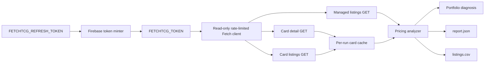
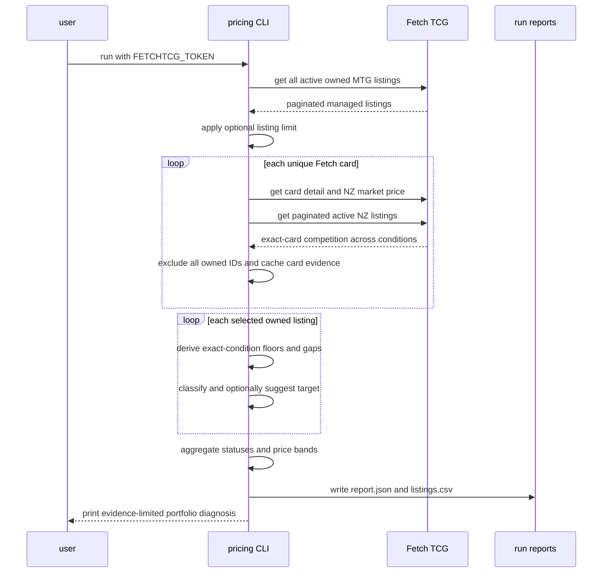

# Fetch TCG pricing analysis

The Fetch TCG pricing analysis script compares every active owned Magic: The
Gathering listing with current New Zealand competition and produces a
read-only portfolio diagnosis.

## Overview

- **Service type**: local command-line tool (`tcg_lister_api/scripts/pricing`)
- **Interface**: Bazel-run Python CLI
- **Runtime**: Python 3.11
- **Primary integration**: Fetch TCG's website API
- **Primary input**: authenticated active MTG listings
- **Primary output**: per-listing pricing evidence and portfolio aggregates
- **Deployed API**: none

The script has no mutation endpoint or execution mode. Suggested prices are
non-binding analytical results.

## User stories

- As a card seller, I want to compare every active listing with exact local
  competitors, so that I can see whether pricing is contributing to weak
  sales.
- As a card seller, I want one-off cheap copies separated from supported
  market pricing, so that temporary listings do not drive unnecessary price
  cuts.
- As a card seller, I want quantity- and value-weighted portfolio summaries,
  so that I can understand whether overpricing is isolated or systematic.
- As a card seller, I want suggested targets backed by visible evidence, so
  that future repricing can be reviewed before writes are introduced.
- As a cautious Fetch user, I want sequential bounded reads and strict secret
  isolation, so that analysis does not create excessive traffic or expose my
  credential.

## Features and scope boundaries

### In scope

- Read all active New Zealand MTG listings owned by the authenticated account.
- Read the current Fetch market price and all active New Zealand listings for
  each unique Fetch card.
- Exclude all owned listing IDs from competition.
- Compare the exact Fetch card, finish, and condition in NZD.
- Retain all-condition data long enough to warn when a strictly
  better-condition copy is cheaper.
- Distinguish the immediate competitor floor from a supported floor.
- Classify listings as `OVERPRICED`, `WATCH`, `COMPETITIVE`,
  `NO_COMPETITION`, or `REVIEW`.
- Suggest matching the supported floor for high-confidence overpricing.
- Aggregate listing count, physical-copy count, listed value, median price
  ratio, and potential markdown by status and own-price band.
- Write versioned JSON and CSV reports and print a concise portfolio diagnosis.
- Color interactive pricing signals red for `STRONG`, yellow for `MIXED` or
  `INSUFFICIENT_DATA`, and green for `LIMITED`.
- Cache identical card reads only for the duration of one process.
- Rate-limit requests and retry transient failures with bounded backoff.

### Out of scope

- Creating, updating, deleting, pausing, or enabling price matching on Fetch
  listings.
- Claiming that a price change will cause a sale.
- Measuring completed-sale velocity, conversion, listing impressions, buyer
  baskets, or search ranking.
- Computing landed buyer cost, including shipping and card-payment surcharge.
- Valuing seller handling time or imposing a minimum viable selling price.
- Comparing different printings, finishes, countries, currencies, or games.
- Persisting market data between runs.
- Circumventing Fetch access controls or treating a browser-shaped user agent
  as permission to automate.

## Architecture



### Primary workflow



## Main technical decisions

- Keep this spike self-contained rather than importing from `scripts/list`.
  The safe read behavior is duplicated intentionally so future listing and
  pricing experiments can evolve independently.
- Keep Firebase refresh-token exchange outside the pricing client. The shared
  minter produces one short-lived `FETCHTCG_TOKEN` before a run without
  changing the client's read-only endpoint guard.
- Start from authenticated managed listings because they already contain the
  exact Fetch card and condition identities. No ManaBox input, set mapping, or
  card search is required.
- Omit the `sets` filter from the managed-listings request to retrieve the
  complete account inventory. A response that violates the documented parser
  contract stops the run rather than silently producing a partial report.
- Fetch card detail and listing pages once per unique Fetch card ID. Listings
  in different conditions reuse that immutable in-run evidence.
- Treat detailed active listings as the source of truth. The indexed
  `listingsData` card summary is ignored because it may be stale.
- Use exact card, finish, and condition as the primary competitor cohort.
  Cross-condition prices are not used in floors or targets.
- Define the immediate floor as the cheapest exact-condition competing price.
- Define the supported floor as the first ascending price at which cumulative
  competition reaches either two distinct sellers or three physical copies.
  This recognizes both multi-seller support and one seller with meaningful
  stock depth.
- Define a material gap as the greater of `NZ$0.25` and `5%` of the relevant
  competitor benchmark. The absolute buffer prevents low-value price noise
  while the percentage remains sensitive to high-value listings.
- Match the supported floor instead of undercutting it. Undercutting would
  create avoidable downward price races without proving additional demand.
- Retain evidence-based targets below `NZ$1` and flag them. The read-only
  report must not silently invent a seller price floor.
- Use `Decimal` for every price, gap, ratio, total, threshold, and report value.
- Keep the diagnosis evidence-limited. Point-in-time supply data can support or
  weaken a pricing hypothesis but cannot prove that card range or demand is
  the alternative cause of weak sales.
- Make requests sequentially with a randomly selected request-start interval
  from one to two seconds. The full personal inventory can take tens of
  minutes; concurrency is intentionally avoided.

## Domain glossary

- **Owned listing**: an active NZD Fetch listing returned by the authenticated
  managed-listings endpoint.
- **Competitor listing**: an active New Zealand listing whose positive listing
  ID is not owned by the authenticated account.
- **Exact cohort**: competitor listings for the same Fetch card ID, finish, and
  condition as one owned listing.
- **Immediate floor**: the lowest price in the exact cohort.
- **Supported floor**: the first ascending exact-cohort price backed
  cumulatively by at least two distinct sellers or three physical copies.
- **Material gap**: `max(NZ$0.25, benchmark * 0.05)`.
- **Price ratio**: owned price divided by supported floor when that floor is
  positive.
- **Potential markdown**: `(owned price - suggested price) * owned quantity`;
  it is a price-change amount, not predicted lost revenue.
- **Better-condition warning**: a strictly better Fetch condition for the same
  card is available below the owned price.
- **Pricing signal**: an evidence-limited portfolio label derived from the
  materially overpriced shares of listings, copies, and listed value.

## Integration contracts

### External systems

- **Fetch TCG website API**: The CLI sends sequential HTTPS JSON `GET`
  requests to `https://api.fetchtcg.com` using a browser-compatible macOS
  Chrome user agent. The bearer credential is attached only to the managed
  listings read. Transient errors retry with bounded exponential backoff.
  Authorization failures and repeated rate limits stop the run.
- **Firebase token service**: The separate token minter can exchange
  `FETCHTCG_REFRESH_TOKEN` at Firebase's fixed HTTPS token endpoint before the
  pricing CLI starts. The refresh credential is never passed to Fetch.

Fetch TCG does not publish these endpoints as a supported third-party API, and
its current terms prohibit automated access without permission. Conservative
traffic behavior reduces load but does not remove that policy risk.

## API contracts

The script exposes no HTTP endpoints.

### CLI contract

```shell
bazel run //tcg_lister_api:fetchtcg-pricing-analyze -- \
  [--limit N] \
  [--verbose]
```

- `FETCHTCG_TOKEN` is required and contains the raw bearer token without the
  `Bearer ` scheme prefix.
- `FETCHTCG_REFRESH_TOKEN` is consumed only by the standalone token minter.
- `--limit N` analyzes only the first `N` active managed listings returned in
  newest-first order. The complete managed inventory is still loaded so every
  owned listing ID can be excluded from competition.
- `--verbose` prints request, retry, and in-memory cache diagnostics without
  response bodies or credentials.
- A successful complete run exits `0`.
- Missing or malformed auth, invalid managed inventory, or a run-level safety
  stop exits non-zero.
- A card-specific public response failure produces `REVIEW` for selected owned
  listings on that card when continuing is safe.

### Consumed backend endpoints

- Authenticated `GET /v1/manage-listings` returns active owned listings,
  paginated at 20 records per request and filtered to MTG/NZD without a set
  filter.
- `GET /v3/cards/{card_id}` returns the card name, collector number, exact
  identity, and `pricingData.NZ.tcgMarketPrice`.
- `GET /v3/cards/{card_id}/listings` returns paginated active New Zealand
  listings sorted by price across every condition.

No `POST`, `PUT`, `PATCH`, or `DELETE` operation exists in the pricing client.

### Output contract

Each run writes to
`<workspace>/tmp/tcg-lister/pricing-<utc-timestamp>/`. Bazel runs resolve
`<workspace>` from `BUILD_WORKSPACE_DIRECTORY`; direct Python runs use the
current working directory:

- `report.json`: run metadata, portfolio summary, status and price-band
  aggregates, and complete ordered listing records.
- `listings.csv`: the same listing records sorted by status priority, then
  potential markdown descending, percentage gap descending, and listing ID.

Each listing record contains:

- owned identity: `listing_id`, `fetch_card_id`, `scryfall_id`, `name`,
  `set_id`, `collector_number`, `finish`, `condition`
- owned state: `remaining_quantity`, `listed_price_nzd`,
  `listed_value_nzd`, `own_price_band`
- market context: `market_price_nzd`, `competitor_listing_count`,
  `competitor_seller_count`, `competitor_copy_count`
- price position: `immediate_floor_nzd`, `supported_floor_nzd`,
  `cheaper_listing_count`, `cheaper_seller_count`, `cheaper_copy_count`,
  `price_rank`, `immediate_gap_nzd`, `immediate_gap_percent`,
  `supported_gap_nzd`, `supported_gap_percent`, `supported_price_ratio`
- condition context: `better_condition_lowest_price_nzd`,
  `better_condition_cheaper`
- decision: `status`, `status_reason`, `suggested_price_nzd`,
  `suggested_price_below_nz_1`, `potential_markdown_nzd`
- failure context: `analysis_error`

Seller names, raw API responses, auth data, and shipping details are omitted.

The report uses schema version `1`. Decimal monetary values are serialized as
two-decimal strings and ratios/percentages as four-decimal strings.

### Status policy

- `OVERPRICED`: a supported floor exists and the owned price is at least one
  material gap above it. The suggested price is the supported floor.
- `WATCH`: the owned price is at least one material gap above the immediate
  floor, but either no supported floor exists or the gap to the supported
  floor is below the material threshold.
- `COMPETITIVE`: exact-condition competition exists but neither material-gap
  rule is met.
- `NO_COMPETITION`: the exact cohort is empty.
- `REVIEW`: card-specific evidence could not be loaded or validated.

A better-condition warning is independent of the primary status.

### Portfolio diagnosis

Aggregates are calculated for the complete selected report and for these
per-unit own-price bands:

- `under_nz_1`
- `nz_1` for prices from `1.00` through `1.99`
- `nz_2` for prices from `2.00` through `2.99`
- `nz_3` for prices from `3.00` through `3.99`
- `nz_4_to_9_99`
- `nz_10_plus`

`REVIEW` records remain visible in totals but are excluded from materially
overpriced share denominators. The pricing signal is:

- `STRONG`: at least two of listing, copy, and listed-value overpriced shares
  are at least `25%`.
- `LIMITED`: all three shares are at most `10%`.
- `MIXED`: every other result.
- `INSUFFICIENT_DATA`: no non-`REVIEW` listing can be analyzed.

Every signal includes wording that it describes current competitor supply and
does not measure sales velocity or prove causation.

## Data and storage contracts

- Fetch managed listings remain the source for owned IDs, exact conditions,
  quantities, and current prices.
- Fetch card details remain the source for names, collector numbers, and market
  prices.
- Fetch detailed listing pages remain the source for current exact-card
  competition.
- Statuses, targets, aggregates, and diagnosis are deterministic derived
  values owned by this script.
- Reports are disposable local artifacts under the git-ignored `tmp/`
  directory.
- The process writes no persistent cache.

## Behavioral invariants and time semantics

- Every positive listing ID returned by the complete managed inventory is
  excluded from competition, including owned listings omitted by `--limit`.
- Each selected owned listing produces exactly one output record.
- The exact cohort always matches Fetch card ID, finish, and condition.
- Sellers are deduplicated case-insensitively after trimming whitespace.
- Copy counts use positive `remainingQuantity`; listing counts count active
  listing records.
- Supported-floor seller and copy counts are cumulative through each ascending
  price tier.
- A gap equal to the material threshold is material.
- Suggested prices never exceed the current owned price and exist only for
  `OVERPRICED`.
- A target below `NZ$1` is preserved and flagged.
- Listed value and potential markdown are quantity-weighted.
- Run and report timestamps use UTC.

## Source of truth

- **Owned listing state**: authenticated Fetch managed listings.
- **Card identity and market price**: Fetch card detail.
- **Competitor supply**: active Fetch card listing pages for NZ/NZD, minus all
  owned listing IDs.
- **Condition ordering**: `raw-m`, `raw-nm`, `raw-lp`, `raw-mp`, `raw-hp`,
  `raw-d`, from best to worst.
- **Pricing policy**: deterministic rules in this README and `analyze.py`.
- **Traffic controls**: fixed pricing-client constants covered by unit tests.

## Security and privacy

- `FETCHTCG_TOKEN` is required, retained only in memory, and attached only to
  `GET /v1/manage-listings`.
- `FETCHTCG_REFRESH_TOKEN` is sent only to Firebase's fixed HTTPS token
  endpoint by the standalone minter. It is never passed to this client.
- Ambient authorization headers, cookies, and proxy settings are removed from
  the HTTP session.
- The token is never accepted as a CLI argument, logged, or written to reports.
- The token minter disables redirects, ambient proxy/auth configuration, and
  cookies, and refuses to print a token directly to an interactive terminal.
- Seller profile names are used only as in-memory deduplication keys and are
  never written to reports.
- Raw response bodies are not logged.
- All external requests use HTTPS.
- The user is responsible for obtaining permission for automated Fetch access.

## Configuration and secrets reference

### Fixed configuration

- Game: Magic: The Gathering
- Country: `NZ`
- Currency: `NZD`
- Request concurrency: `1`
- Request-start interval: random value from `1` to `2` seconds
- Connect timeout: `5` seconds
- Read timeout: `30` seconds
- Maximum attempts per retryable request: `5`
- Maximum requests per run: `5000`
- Maximum managed-listing pages: `100`
- Maximum card-listing pages: `25`
- Page size: `20`
- User agent: browser-compatible macOS Chrome shape used by the list spike

### Environment variables

- `FETCHTCG_TOKEN`: required raw one-hour bearer token, supplied to the pricing
  process.
- `FETCHTCG_REFRESH_TOKEN`: long-lived Firebase refresh credential consumed
  only by `//tcg_lister_api:fetchtcg-mint-token`.

## Performance envelope

- Intended inventory is up to 2,000 active managed listings.
- The current known inventory is approximately 745 unique listings and 1,270
  physical copies.
- Managed inventory requires approximately 38 requests at that size.
- Each unique Fetch card requires one card-detail request and at least one
  listing-page request.
- A 745-card run therefore requires at least approximately 1,528 sequential
  requests and can take tens of minutes under the fixed traffic interval.
- Duplicate Fetch card IDs make no repeated card or competitor requests within
  one run.
- Pagination and the 5,000-request budget stop accidentally unbounded traffic.

## Testing and quality gates

- Unit tests cover managed and public pagination, owned exclusion, auth
  isolation, malformed responses, retries, rate limits, request budgets,
  caching, floor depth, material boundaries, all statuses, sub-NZ$1 flags,
  condition warnings, aggregates, diagnosis, ordering, and serialization.
- HTTP tests use fake responses and injected time functions; tests never call
  Fetch.
- Required checks:

```shell
bazel test //tcg_lister_api:all
bazel mod tidy
bazel run //:format
```

## Local development and smoke checks

Analyze one listing before a full run:

```shell
token="$(bazel run //tcg_lister_api:fetchtcg-mint-token)" &&
FETCHTCG_TOKEN="$token" bazel run //tcg_lister_api:fetchtcg-pricing-analyze -- \
  --limit 1 \
  --verbose
unset token
```

Review the console evidence and generated files before removing `--limit`.
The smoke check is read-only but still consumes the unsupported Fetch website
API and requires permission.

Set the refresh credential through a hidden prompt or local secret manager
rather than a command, shell history, profile, or repository file. The minted
token is not renewed during a run. Delete HAR files containing credentials when
they are no longer needed; if one has been shared, change the Fetch password to
revoke existing Firebase refresh sessions.

## End-to-end scenarios

### Scenario 1: isolated cheap copy produces watch

1. An owned near-mint listing is `NZ$2.00`.
2. One competing seller has one near-mint copy at `NZ$1.50`.
3. The immediate gap exceeds the material threshold, but no supported floor
   exists.
4. The listing receives `WATCH` without a suggested price.

### Scenario 2: supported cheaper stock produces target

1. An owned near-mint listing is `NZ$2.00`.
2. Two sellers have near-mint copies at or below `NZ$1.50`.
3. `NZ$1.50` is the supported floor and the `NZ$0.50` gap is material.
4. The listing receives `OVERPRICED` with suggested price `NZ$1.50`.

### Scenario 3: small low-value gap stays competitive

1. An owned near-mint listing is `NZ$1.00`.
2. Supported competing stock exists at `NZ$0.90`.
3. The `NZ$0.10` gap is below the `NZ$0.25` material threshold.
4. The listing receives `COMPETITIVE`; cheaper stock remains visible.

### Scenario 4: one deep seller supports the floor

1. An owned listing is `NZ$3.00`.
2. One seller has three exact-condition copies at `NZ$2.50`.
3. Three cumulative physical copies establish the supported floor.
4. The material gap produces `OVERPRICED` and target `NZ$2.50`.

### Scenario 5: better condition is secondary context

1. An owned lightly played listing is `NZ$2.00`.
2. No exact-condition competitor exists.
3. A near-mint copy of the same Fetch card is available at `NZ$1.50`.
4. The primary status is `NO_COMPETITION` and the
   `better_condition_cheaper` warning is true.

### Scenario 6: competitive portfolio weakens pricing hypothesis

1. Fewer than 10% of analyzable listings, copies, and value are
   `OVERPRICED`.
2. The portfolio signal is `LIMITED`.
3. The report states that current competitor pricing does not strongly support
   pricing as the main cause of weak sales.
4. The report does not claim that range or demand has been proven instead.
