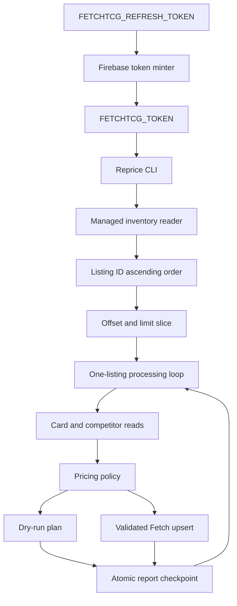
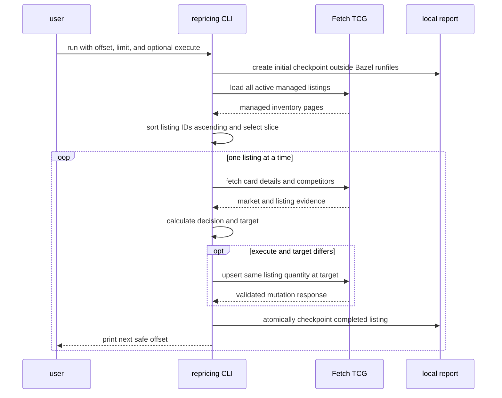

# Reprice Fetch TCG listings

This script exhaustively reprices active Fetch TCG listings against current New Zealand competition while preserving resumable, one-listing-at-a-time execution.

## Overview

- **Service type**: local Python CLI
- **Interface**: Bazel-run command
- **Primary input**: active managed Fetch TCG listings
- **Primary outputs**: checkpointed JSON and CSV reports under the repository `tmp/` directory
- **Mutation mode**: dry-run by default; explicit `--execute` enables price updates

The script is self-contained under `scripts/reprice`. It intentionally duplicates the small amount of Fetch client and pricing logic it needs so changes to the listing, pricing-analysis, and repricing spikes remain isolated.

## User stories

- As a seller, I want every active listing assessed against current competitors, so that stale prices can be corrected.
- As a seller, I want dry-run to be the default, so that I can inspect every proposed price before changing Fetch.
- As a seller, I want each listing updated immediately after it is analyzed, so that a later token expiry does not lose completed work.
- As a seller resuming a partial run, I want a stable offset reported continuously, so that I can restart from the first incomplete listing.
- As a seller processing a large portfolio, I want offset and limit controls, so that I can run predictable batches within the Fetch token lifetime.

## Features and scope boundaries

### In scope

- Load every active Magic: The Gathering listing managed by the authenticated Fetch account.
- Sort managed listings by numeric listing ID ascending before applying offset and limit.
- Exclude every owned listing ID from competitor evidence.
- Fetch current NZD market data and active New Zealand competitor listings.
- Derive a two-independent-seller supported floor from the managed condition and every strictly better condition.
- Fall back to Fetch's NZD market price when no supported same-or-better-condition floor exists.
- Round target prices to the nearest NZ$0.25 increment with midpoint ties upward and an NZ$0.75 minimum.
- Reprice both upward and downward whenever an actionable target differs from the current price.
- Preserve listing identity, condition, and quantity during every mutation.
- Process and checkpoint one listing completely before moving to the next.
- Print the pricing reason for every listing and color the direction or terminal outcome when stdout is interactive.
- Report the next safe offset after every completed listing and on controlled termination.

### Out of scope

- Creating or deleting listings.
- Changing listing condition or quantity.
- Automatically pricing `REVIEW` decisions.
- Refreshing or obtaining Fetch credentials inside the repricing process.
- Resuming by report file or processed-ID set.
- Supporting games other than Magic: The Gathering or markets other than New Zealand.
- Sharing code at runtime with the sibling list or pricing spikes.

## Architecture



### Primary workflow



## Main technical decisions

- Fetch the complete managed inventory before processing. Correct competitor analysis requires all owned listing IDs, even when offset and limit select a small batch.
- Keep Firebase refresh-token exchange outside the repricing client. The shared minter produces one short-lived `FETCHTCG_TOKEN` before a run, preserving the client's existing endpoint allowlist and fail-closed authorization behavior.
- Sort locally by listing ID ascending instead of relying on Fetch's `listed_at,DESC` response order. Price mutations cannot change listing IDs, and newly created listings normally append after existing IDs.
- Apply offset and limit only after stable sorting. Offset is a zero-based count of listings skipped.
- Keep the selected inventory slice immutable for the run. Mutations cannot reorder or change the active work list.
- Perform card reads, pricing, optional mutation, and checkpointing inline for one listing before beginning the next.
- Use the mutation response as the per-listing write verification. The response must preserve listing ID, condition, quantity, currency, and requested price.
- Round the selected pricing benchmark to the nearest NZ$0.25 increment, with exact midpoint ties upward, before applying the NZ$0.75 minimum. This avoids systematically pricing above the benchmark.
- Apply targets in both directions. This tool does not use the list spike's material-decrease gate because exhaustive repricing is intended to converge every actionable listing to the current target.
- Treat `DISCARD` as a sunk-inventory liquidation decision: lower an existing price above NZ$0.75 to the seller floor, but never raise a `DISCARD` listing already at or below the floor.
- Print each listing's complete pricing reason after its direction and mutation status. Color only the direction or terminal-outcome label so the evidence remains easy to read.
- Use green for `DECREASE`, blue for `UNCHANGED`, yellow for `INCREASE` and `REVIEW`, and red for `FAILED`. Disable ANSI color when stdout is not an interactive terminal.
- Atomically replace report files after each completed listing. A prior valid checkpoint remains available if the process is killed while writing.
- Print the safe offset after each completed listing as well as from the controlled-shutdown path.

## Domain glossary

- **Managed listing**: one active listing owned by the authenticated Fetch account.
- **Stable inventory position**: one-based display position after sorting managed listings by listing ID ascending.
- **Offset**: zero-based number of stable managed listings skipped before processing.
- **Next offset**: the offset of the first listing not yet completed; this is the restart value.
- **Completed listing**: a listing whose analysis and optional mutation finished, including deliberate `UNCHANGED` and `REVIEW` skips.
- **Same-or-better-condition ladder**: non-owned active NZ listings grouped by price for the managed listing's condition and every strictly better condition.
- **Two-seller supported floor**: the first ascending same-or-better-condition price at which at least two distinct sellers are available cumulatively.
- **Better condition**: a Fetch condition strictly above the managed listing in the fixed condition-quality order.
- **Target price**: the supported floor or market fallback, rounded to the nearest NZ$0.25 with midpoint ties upward and constrained to at least NZ$0.75.
- **Controlled termination**: a normal failure path, HTTP authentication stop, request-budget stop, exception, `SIGINT`, or `SIGTERM` for which Python can execute cleanup.

## Integration contracts

### External systems

- **Fetch TCG website API**: sequential HTTPS JSON requests to `https://api.fetchtcg.com`.
- **Managed inventory authentication**: `Authorization: Bearer <FETCHTCG_TOKEN>` is attached only to authenticated managed-listing reads and writes.
- **Firebase token service**: the separate token minter can exchange `FETCHTCG_REFRESH_TOKEN` at Firebase's fixed HTTPS token endpoint before repricing starts. The refresh credential is never passed to Fetch.
- **Public market reads**: card details and competitor listing requests never include the bearer token.
- **Traffic policy**: request starts are spaced by a random one-to-two-second interval. Transient network errors and server errors retry with bounded backoff.

Fetch TCG does not publish these endpoints as a supported third-party API, and its current terms prohibit automated access without permission. Conservative request pacing reduces load but does not remove that policy risk.

## API contracts

### CLI

```text
bazel run //tcg_lister_api:fetchtcg-reprice -- \
  [--offset N] [--limit N] [--execute] [--verbose]
```

- `--offset N`: skip `N` listings after numeric listing-ID sorting. Default `0`; must be non-negative.
- `--limit N`: process at most `N` listings. When omitted, process through the end of the stable inventory.
- `--execute`: enable Fetch mutations. Without it, changed prices are reported as `PLANNED`.
- `--verbose`: print request and cache diagnostics without credentials.

`FETCHTCG_TOKEN` must contain the raw token without a `Bearer ` prefix.
`FETCHTCG_REFRESH_TOKEN` is consumed only by the standalone token minter.

Each console listing line contains its current and target prices when available, a direction or terminal-outcome label, mutation status, and the full pricing decision reason. ANSI color is applied only to the label when stdout is interactive; redirected output and report files remain uncolored.

### Consumed Fetch endpoints

- `GET /v1/manage-listings`: authenticated pagination of active MTG/NZD managed listings, requested in `listed_at,DESC` order and then re-sorted locally.
- `GET /v3/cards/{card_id}`: public card identity and NZD market details.
- `GET /v3/cards/{card_id}/listings`: public active New Zealand competition across conditions.
- `POST /v2/private/manage-listings`: authenticated absolute upsert preserving the existing condition and quantity while replacing price.

Managed-listing pagination must return stable `totalPages` values and no duplicate listing IDs. A mutation response must return the expected positive listing ID, unchanged condition and quantity, NZD currency, and the requested target price.

### Output

Every run creates:

```text
tmp/tcg-lister/reprice-<utc-timestamp>/
  report.json
  listings.csv
```

When invoked through Bazel, the base directory is `BUILD_WORKSPACE_DIRECTORY`. Outside Bazel it is the current working directory. Output paths are never derived from `__file__` or a Bazel runfiles path.

`report.json` contains:

- schema version and UTC generation/update timestamps
- execution mode
- requested offset and limit
- managed, selected, and completed listing counts
- next offset
- request count
- completion state and error
- ordered per-listing records

Each listing record contains:

- stable position and listing ID
- card identity, name, set, finish, and condition
- current price and quantity
- decision and reason
- market price, supported floor, better-condition price, and target price
- same-or-better-condition listing, seller, and copy evidence
- price ladder without seller identities
- mutation status, requested price, and error

`listings.csv` contains the same per-listing values, with nested ladders encoded as compact JSON.

Files are checkpointed using a temporary file in the same directory followed by atomic replacement.

## Pricing policy

### Selection decision

- Invalid or missing market price is `REVIEW`.
- Market price below NZ$0.25 is `DISCARD`.
- Market price from NZ$0.25 through NZ$0.33 is `DISCARD` when any non-owned local copy exists across conditions; otherwise it is eligible for `LIST`.
- Market price above NZ$0.33 and below NZ$0.50 is `DISCARD` when more than five distinct non-owned sellers exist across conditions; otherwise it is eligible for `LIST`.
- Market price of at least NZ$0.50 is eligible for `LIST`.

### Target decision

For an eligible `LIST` decision:

```text
benchmark = two-seller supported same-or-better-condition floor, otherwise market price
target = max(NZ$0.75, round_nearest_half_up(benchmark, NZ$0.25))
```

### Mutation decision

- `LIST` and `target != current price`: `PLANNED` in dry-run or updated in execute mode.
- `LIST` and `target == current price`: `UNCHANGED`.
- `DISCARD` receives an NZ$0.75 liquidation target because its listing effort is already sunk.
- `DISCARD` above NZ$0.75 is reduced to NZ$0.75; at or below NZ$0.75 it is `UNCHANGED` and is never raised.
- `REVIEW` is `SKIPPED`; this tool never deletes the listing.
- A duplicate owned `(card_id, condition)` identity is `REVIEW` and `SKIPPED`.
- Execute mode may raise or lower a `LIST` price and may only lower a `DISCARD` price. Quantity, condition, and listing ID remain unchanged.

## Data and storage contracts

- Fetch managed inventory is the source of truth for owned listing identity, condition, quantity, and current price.
- Fetch card details are the source of truth for NZD market price and card metadata.
- Fetch active listing records are the source of truth for local competitor evidence.
- Pricing decisions, stable positions, mutation states, and next offsets are deterministic derived values owned by this tool.
- Reports are disposable local checkpoints under the git-ignored repository `tmp/` directory.
- No seller profile name is written to reports. Normalized seller keys exist only in memory for distinct-seller calculations.

## Behavioral invariants and termination semantics

- Managed listings are sorted by numeric listing ID ascending before offset and limit are applied.
- The full managed listing ID set is excluded from competitor evidence.
- Exactly one selected listing is analyzed and optionally mutated before the next begins.
- Dry-run sends no POST request.
- Execute mode sends at most one POST request per selected listing.
- Mutations preserve listing ID, condition, and quantity.
- `next_offset` starts at the requested offset.
- `next_offset` advances by one only after the current listing completes or is deliberately skipped.
- A failure during the current listing leaves `next_offset` unchanged so that listing is retried.
- The safe next offset is printed after each completed listing and again on controlled termination.
- Every completed or failed listing console line includes the same pricing reason persisted in `decision_reason`.
- Interactive console labels use the fixed `DECREASE`, `UNCHANGED`, `INCREASE`, `REVIEW`, and `FAILED` color policy; reports never contain ANSI escapes.
- `SIGINT` and `SIGTERM` are converted into controlled termination and checkpoint the current state.
- `SIGKILL`, interpreter failure, and power loss cannot execute cleanup. The last atomic checkpoint and previously printed offset remain the latest safe restart point.
- A limited batch that completes successfully prints a continuation command when more stable inventory remains.
- A 401 or 403 is never retried and stops before the next listing.
- No credential, authorization header, or seller profile name is logged or persisted.

## Source of truth

- **Managed inventory**: Fetch `GET /v1/manage-listings`
- **Stable ordering**: numeric managed listing ID ascending
- **Market price**: Fetch `pricingData.NZ.tcgMarketPrice`
- **Competitor evidence**: non-owned active NZ listings from the card listings endpoint
- **Condition quality**: `raw-d < raw-hp < raw-mp < raw-lp < raw-nm < raw-m`
- **Pricing policy**: fixed rules in this README and the repricer implementation
- **Mutation result**: validated Fetch upsert response
- **Restart position**: checkpointed `next_offset`

## Security and privacy

- The bearer token is read only from `FETCHTCG_TOKEN`.
- The long-lived refresh credential is read only by the standalone minter from `FETCHTCG_REFRESH_TOKEN` and sent only to Firebase's fixed HTTPS token endpoint.
- The token is attached only to the two authenticated managed-listing endpoints.
- Public card and competitor requests remain unauthenticated.
- Exceptions and diagnostics redact authorization material.
- The minter disables redirects, ambient proxy/auth configuration, and cookies, and refuses to print a token directly to an interactive terminal.
- Reports include owned listing IDs and prices but exclude token values and seller names.
- Output remains on the local machine under the repository workspace.

## Configuration and secrets

| Setting         | Source                   | Default       | Purpose                          |
| --------------- | ------------------------ | ------------- | -------------------------------- |
| Fetch token     | `FETCHTCG_TOKEN`         | none          | managed-listing reads and writes |
| Refresh token   | `FETCHTCG_REFRESH_TOKEN` | none          | mint a one-hour Fetch token      |
| Offset          | `--offset`               | `0`           | stable listings skipped          |
| Limit           | `--limit`                | all remaining | maximum selected listings        |
| Execute mode    | `--execute`              | disabled      | enable price mutations           |
| Verbose logging | `--verbose`              | disabled      | request diagnostics              |

Traffic pacing, retries, request budgets, country, currency, game, seller floor, increment, condition order, and decision thresholds are fixed implementation constants.

## Performance envelope

- Managed inventory is fetched once, regardless of offset or limit.
- Per selected listing, normal analysis uses one card-details request and all required competitor-listing pages.
- An execute-mode price change adds one mutation request.
- Requests are sequential with one-to-two-second spacing.
- The request budget is 5,000 attempts per run.
- Limit should be used when a selected batch may exceed the approximately one-hour Fetch token lifetime.
- Local report checkpointing occurs after every completed listing and is negligible compared with network pacing.

## Testing and quality gates

- Unit tests use fake sessions and injected clocks; they never call Fetch.
- Pricing tests cover market boundaries, same-or-better-condition two-seller support, one seller across copies and tiers, NZ$0.75 floor, and nearest-NZ$0.25 rounding with midpoint ties upward.
- Runner tests cover stable sorting, offset and limit, both-direction mutations, unchanged and skipped records, duplicate identities, one-listing-at-a-time sequencing, quantity preservation, decision reasons, and interactive direction colors.
- Failure tests cover 401 during reads and writes, request errors, partial records, exact next-offset behavior, `SIGINT`, and `SIGTERM`.
- Report tests cover atomic checkpoints, JSON/CSV consistency, token and seller-name exclusion, and workspace-relative output outside Bazel runfiles.
- Required checks:
  - `bazel test //tcg_lister_api:reprice-unit-tests`
  - `bazel test //tcg_lister_api:all`
  - `bazel mod tidy`
  - `bazel run //:format`

## Local development

Dry-run a batch:

```bash
token="$(bazel run //tcg_lister_api:fetchtcg-mint-token)" &&
FETCHTCG_TOKEN="$token" bazel run //tcg_lister_api:fetchtcg-reprice -- \
  --offset 0 \
  --limit 25 \
  --verbose
unset token
```

Execute a batch:

```bash
token="$(bazel run //tcg_lister_api:fetchtcg-mint-token)" &&
FETCHTCG_TOKEN="$token" bazel run //tcg_lister_api:fetchtcg-reprice -- \
  --offset 0 \
  --limit 25 \
  --execute \
  --verbose
unset token
```

If the run reports `next offset: 17`, mint a new `FETCHTCG_TOKEN` and rerun with `--offset 17`. Set the refresh credential through a hidden prompt or local secret manager rather than a command, shell history, profile, or repository file. Delete HAR files containing credentials when they are no longer needed; if one has been shared, change the Fetch password to revoke existing Firebase refresh sessions.

## End-to-end scenarios

### Scenario 1: dry-run proposes both directions

1. Stable listing `#100` is NZ$1.25 and calculates to NZ$0.75.
2. Stable listing `#101` is NZ$0.75 and calculates to NZ$1.00.
3. Dry-run records both as `PLANNED` without POST requests.
4. Checkpoints show requested prices of NZ$0.75 and NZ$1.00.

### Scenario 2: execute updates inline

1. Listing `#100` calculates to a different target.
2. The tool upserts listing `#100` with its unchanged quantity and target price.
3. The response is validated and the checkpoint advances the next offset.
4. Only then does analysis begin for listing `#101`.

### Scenario 3: token expires during a listing

1. Ten listings complete and advance the next offset from `0` to `10`.
2. Fetch returns 401 while listing at offset `10` is being analyzed or mutated.
3. The listing is recorded as failed and remains incomplete.
4. The partial report and console state `next offset: 10`.
5. The refreshed run starts with `--offset 10`.

### Scenario 4: better conditions establish the floor

1. A lightly played listing has two independent near-mint competitors available cumulatively by NZ$0.75.
2. The near-mint listings participate in the same-or-better-condition ladder.
3. Their NZ$0.75 level becomes the supported floor and target.
4. The listing is automatically repriced instead of requiring review.

### Scenario 5: limited batch completes

1. A run starts at offset `100` with limit `50`.
2. All 50 selected listings complete.
3. The report records next offset `150`.
4. If more inventory remains, the CLI prints a continuation command using `--offset 150`.
