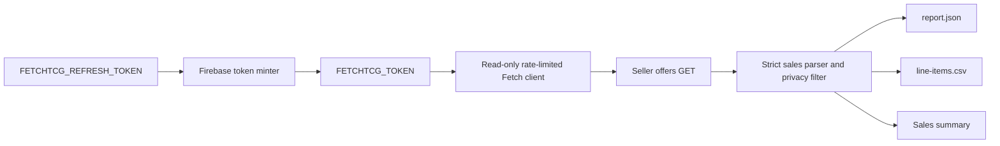
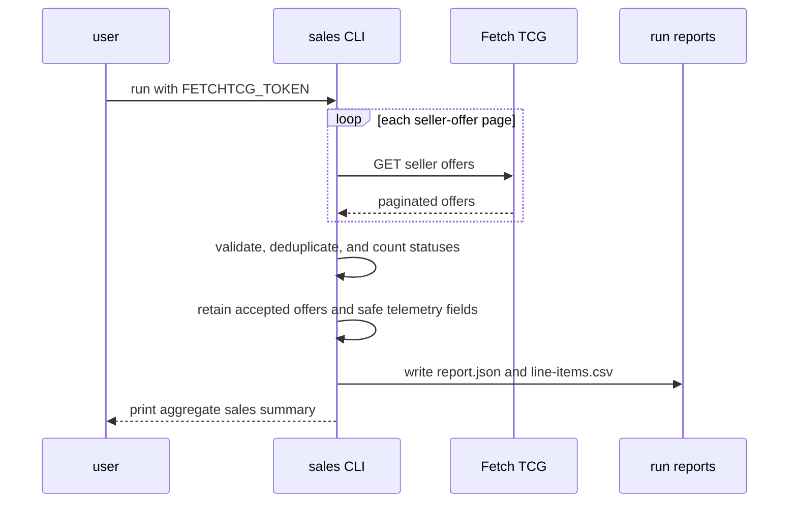

# Fetch TCG sales telemetry

The Fetch TCG sales telemetry script exports privacy-minimized order and
line-item metrics for the authenticated seller account.

## Overview

- **Service type**: local command-line tool (`tcg_lister_api/scripts/sales`)
- **Interface**: Bazel-run Python CLI
- **Runtime**: Python 3.11
- **Primary integration**: Fetch TCG's website API
- **Primary input**: authenticated seller offers
- **Primary output**: aggregate sales metrics and accepted-sale line items
- **Deployed API**: none

## User stories

- As a card seller, I want a complete history of accepted offers, so that I
  can measure order count, card volume, receipts, fees, and payout.
- As a card seller, I want sold-card identity and quantity, so that I can
  understand which parts of the inventory generate sales.
- As a cautious Fetch user, I want buyer and fulfillment details excluded
  from local reports, so that sales analysis does not persist unnecessary
  personal information.
- As a cautious Fetch user, I want bounded sequential reads and strict secret
  isolation, so that telemetry collection does not create excessive traffic
  or expose my credential.

## Features and scope boundaries

### In scope

- Read every page of seller offers in newest-first order.
- Count all returned offer statuses to make accepted-offer filtering visible.
- Treat offers whose top-level status is `ACCEPTED` as sales.
- Export aggregate accepted-sale order, card, merchandise, shipping, fee, and
  payout metrics in NZD.
- Export accepted sales and their line items with Fetch card, Scryfall,
  printing, finish, condition, quantity, and line-total fields.
- Normalize output timestamps to UTC and monetary values to two-decimal
  strings.
- Write versioned JSON and CSV reports under the git-ignored `tmp/` directory.
- Rate-limit requests and retry transient failures with bounded backoff.

### Out of scope

- Creating, updating, accepting, rejecting, messaging about, or fulfilling an
  offer.
- Persisting raw Fetch responses.
- Exporting buyer names, profile names, addresses, coordinates, payment
  instructions, bank details, tracking numbers, reviews, messages, or images.
- Inferring profit, cost of goods sold, tax liability, conversion, listing
  impressions, or unsold-inventory sell-through.
- Calling per-offer detail, negotiation, message, profile, or dashboard
  endpoints.
- Circumventing Fetch access controls or treating a browser-shaped user agent
  as permission to automate.

## Architecture



### Primary workflow



## Main technical decisions

- Keep the spike in one self-contained Python script so it can be removed or
  evolved independently of listing and pricing experiments.
- Use the seller-offers list endpoint observed in the supplied HAR. The list
  response already contains the order and line-item fields needed for
  telemetry, so the script makes no per-offer detail requests.
- Keep Firebase refresh-token exchange outside the sales script. The shared
  minter produces one short-lived `FETCHTCG_TOKEN` before a run.
- Fetch all offer statuses and filter locally to `ACCEPTED`. This preserves a
  visible denominator and avoids assuming undocumented server-side filters.
- Treat each item `price` as the line merchandise total because the observed
  response combines it with `shippingPriceTotal` to produce
  `totalOfferPrice`.
- Validate that each accepted offer's merchandise plus shipping equals gross
  receipts and that gross receipts minus the Fetch transaction fee equals the
  final payout. A mismatch stops the run instead of publishing misleading
  financial telemetry.
- Build reports from an explicit field allowlist. The API response contains
  personal and fulfillment data that must not be serialized accidentally.
- Make requests sequentially with a randomly selected request-start interval
  from one to two seconds. The expected personal history requires few pages,
  and concurrency is unnecessary.

## Domain glossary

- **Seller offer**: an offer returned by Fetch's authenticated seller-offers
  endpoint, regardless of status.
- **Accepted sale**: a seller offer whose top-level status is `ACCEPTED`.
- **Line item**: one sold Fetch listing within an accepted sale.
- **Card quantity**: the sum of positive line-item quantities.
- **Merchandise sales**: the sum of line-item `price` values.
- **Shipping charged**: the accepted offer's `shippingPriceTotal`, with `null`
  interpreted as zero.
- **Gross receipts**: the accepted offer's `totalOfferPrice`, including
  shipping.
- **Fetch fees**: the accepted offer's `fetchTransactionFee`.
- **Net payout**: the accepted offer's `finalPayoutAmount`.

## Integration contracts

### External systems

- **Fetch TCG website API**: The CLI sends sequential authenticated HTTPS JSON
  `GET` requests to `https://api.fetchtcg.com` using a browser-compatible
  macOS Chrome user agent. Transient errors retry with bounded exponential
  backoff. Authorization failures and repeated rate limits stop the run.
- **Firebase token service**: The separate token minter can exchange
  `FETCHTCG_REFRESH_TOKEN` at Firebase's fixed HTTPS token endpoint before the
  sales CLI starts. The refresh credential is never passed to Fetch.

Fetch TCG does not publish this endpoint as a supported third-party API, and
its current terms prohibit automated access without permission. Conservative
traffic behavior reduces load but does not remove that policy risk.

## API contracts

The script exposes no HTTP endpoints.

### CLI contract

```shell
bazel run //tcg_lister_api:fetchtcg-sales-telemetry -- [--verbose]
```

- `FETCHTCG_TOKEN` is required and contains the raw bearer token without the
  `Bearer ` scheme prefix.
- `FETCHTCG_REFRESH_TOKEN` is consumed only by the standalone token minter.
- `--verbose` prints request and retry diagnostics without response bodies or
  credentials.
- A successful complete run exits `0`.
- Missing or malformed auth, invalid pagination, malformed sales data,
  duplicate offer IDs, inconsistent financial totals, or a run-level safety
  stop exits non-zero without writing a partial report.

### Consumed backend endpoint

Authenticated `GET /v2/private/market/offers/seller` uses:

- `sort=NEWEST`
- `size=20`
- zero-based `page`

The response must be a JSON object containing `content`, `totalPages`,
`totalElements`, `number`, and `numberOfElements`. The complete result is
bounded to 100 pages and 2,000 offers.

No `POST`, `PUT`, `PATCH`, or `DELETE` operation exists in the sales client.

### Output contract

Each run writes to
`<workspace>/tmp/tcg-lister/sales-<utc-timestamp>/`. Bazel runs resolve
`<workspace>` from `BUILD_WORKSPACE_DIRECTORY`; direct Python runs use the
current working directory:

- `report.json`: schema metadata, aggregate summary, status counts, and
  accepted sales with nested safe line items.
- `line-items.csv`: one row per accepted-sale line item, ordered by acceptance
  time newest first and then sale and item ID.

The JSON summary contains:

- `fetched_offer_count`
- `accepted_sale_count`
- `accepted_line_item_count`
- `accepted_card_quantity`
- `merchandise_sales_nzd`
- `shipping_charged_nzd`
- `gross_receipts_nzd`
- `fetch_fees_nzd`
- `net_payout_nzd`
- `average_order_value_nzd`
- `first_accepted_at`
- `last_accepted_at`
- `offer_status_counts`

Each accepted sale contains:

- `sale_id`
- `created_at`
- `accepted_at`
- `delivery_mode`
- `shipping_status`
- `currency_code`
- `line_item_count`
- `card_quantity`
- `merchandise_sales_nzd`
- `shipping_charged_nzd`
- `gross_receipts_nzd`
- `fetch_fees_nzd`
- `net_payout_nzd`
- `items`

Each line item contains:

- `sale_id`
- `item_id`
- `listing_id`
- `fetch_card_id`
- `scryfall_id`
- `card_name`
- `set_id`
- `set_name`
- `set_code`
- `finish`
- `condition`
- `quantity`
- `line_total_nzd`
- `accepted_at`

The report uses schema version `1`. Monetary values are serialized as
two-decimal strings. Buyer and fulfillment details are omitted.

## Data and storage contracts

- Fetch seller offers remain the source for offer status, sold-card identity,
  quantity, receipts, fees, and payout.
- Aggregate telemetry is a deterministic derived value owned by this script.
- Reports are disposable local artifacts under the git-ignored `tmp/`
  directory.
- The process writes no persistent cache and never writes raw API responses.

## Behavioral invariants and time semantics

- Every seller-offer page is loaded before a report is written.
- Every positive offer ID is unique across the complete response.
- Every accepted offer produces exactly one sale record.
- Every accepted line item produces exactly one CSV row.
- Only the top-level `ACCEPTED` status contributes to sales metrics.
- Offer and line-item currencies must be `NZD`.
- Merchandise plus shipping must equal gross receipts to the cent.
- Gross receipts minus Fetch fees must equal net payout to the cent.
- Card quantities and identifiers are positive.
- `accepted_at` is present on every accepted sale.
- Run and report timestamps use UTC.
- The first and last accepted timestamps are chronological bounds, independent
  of API page order.

## Source of truth

- **Offer status and timestamps**: authenticated Fetch seller offers.
- **Sold-card identity and quantity**: accepted-offer line items.
- **Receipts, fees, and payout**: accepted-offer financial fields.
- **Sales inclusion policy**: top-level `status == ACCEPTED`.
- **Privacy policy**: explicit output fields documented in this README and
  implemented in `main.py`.
- **Traffic controls**: fixed client constants covered by unit tests.

## Security and privacy

- `FETCHTCG_TOKEN` is required, retained only in memory, and attached only to
  `GET /v2/private/market/offers/seller`.
- `FETCHTCG_REFRESH_TOKEN` is sent only to Firebase's fixed HTTPS token
  endpoint by the standalone minter. It is never passed to this script.
- Ambient authorization headers, cookies, and proxy settings are removed from
  the HTTP session.
- The token is never accepted as a CLI argument, logged, or written to reports.
- Raw response bodies are not logged or persisted.
- Output is constructed from an explicit allowlist and excludes buyer,
  address, payment-instruction, tracking, review, message, and image fields.
- All external requests use HTTPS.
- The user is responsible for obtaining permission for automated Fetch access.

## Configuration and secrets reference

### Fixed configuration

- Currency: `NZD`
- Sort: newest first
- Page size: `20`
- Maximum pages: `100`
- Maximum request attempts per run: `500`
- Request concurrency: `1`
- Request-start interval: random value from `1` to `2` seconds
- Connect timeout: `5` seconds
- Read timeout: `30` seconds
- Maximum attempts per retryable request: `5`
- Maximum repeated rate-limit responses: `3`
- Maximum retry backoff: `60` seconds

### Environment variables

- `FETCHTCG_TOKEN`: required raw one-hour bearer token, supplied to the sales
  process.
- `FETCHTCG_REFRESH_TOKEN`: long-lived Firebase refresh credential consumed
  only by `//tcg_lister_api:fetchtcg-mint-token`.

## Performance envelope

- The script supports up to 2,000 seller offers across 100 pages.
- One request is made per page; no per-offer requests are made.
- A full run therefore uses at most 100 successful sequential page requests
  and normally completes in a few minutes.
- The 500-attempt request budget leaves room for bounded transient retries at
  the maximum page count.
- Pagination and the request budget stop accidentally unbounded traffic.

## Testing and quality gates

- Unit tests cover pagination, authentication isolation, accepted-sale
  filtering, financial aggregation, privacy-safe serialization, malformed
  responses, duplicate IDs, retries, rate limits, request budgets, report
  writing, and deterministic ordering.
- HTTP tests use fake responses and injected time functions; tests never call
  Fetch.
- Required checks:

```shell
bazel test //tcg_lister_api:all
bazel mod tidy
bazel run //:format
```

## Local development and smoke checks

```shell
token="$(bazel run //tcg_lister_api:fetchtcg-mint-token)" &&
FETCHTCG_TOKEN="$token" bazel run //tcg_lister_api:fetchtcg-sales-telemetry -- \
  --verbose
unset token
```

Review the console summary and generated files. The smoke check is read-only
but still consumes the unsupported Fetch website API and requires permission.

Set the refresh credential through a hidden prompt or local secret manager
rather than a command, shell history, profile, or repository file. The minted
token is not renewed during a run. Delete HAR files containing credentials or
personal data when they are no longer needed; if a HAR with credentials has
been shared, change the Fetch password to revoke existing Firebase refresh
sessions.

## End-to-end scenarios

### Scenario 1: accepted delivery sale

1. Fetch returns an accepted sale containing multiple card line items and a
   shipping charge.
2. The script validates merchandise plus shipping against gross receipts.
3. The JSON report contains one privacy-minimized sale and the aggregate
   totals.
4. The CSV contains one row per sold line item and no buyer, address, payment,
   or tracking fields.

### Scenario 2: rejected offer

1. Fetch returns a rejected offer.
2. The `REJECTED` status count increases.
3. The offer contributes no sale, card, or financial metrics and is absent
   from accepted-sale output.

### Scenario 3: inconsistent financial response

1. Fetch returns an accepted offer whose merchandise and shipping do not equal
   gross receipts.
2. The script stops before writing output.
3. No partial report is published.
